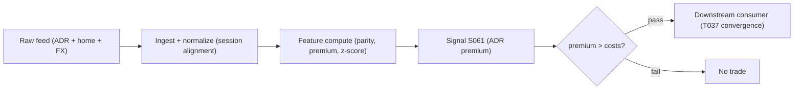

# S061 — ADR / dual-listed premium

An ADR represents a fixed number of foreign shares (the *depositary ratio*). *Parity* is the no-arbitrage price: ADR = ratio × home price × FX. A *premium* (ADR rich) or *discount* should be arbitraged by converting via the depositary bank --- but spreads, issuance/cancellation fees, borrow, and FX hedging mean a statistically real premium is often economically untradeable. The z-score formulation here standardizes the premium against its trailing window and trades it toward zero, time-aligned across sessions. Provenance **[D]**.

> Tag law: every numeric literal in prose carries one of `[documented]
> [default] [example] [unverified] [internal-est] [measured]` (legend: Appendix
> i v1.0.0). Constants inside cited formulas inherit the formula's tag.
> Bibliographic years, volumes, pages, arXiv IDs, section numbers, rule codes
> (C1–C10), fail-safe codes (F1–F5), module IDs, and machine-parsed §0 data
> fields are identifiers, not literals, and are exempt.

## §1 Five-minute reviewer card

| Row | Value |
|---|---|
| Module | S061 — ADR / dual-listed premium, v1.1.0 |
| Edge verdict | `PREDICTIVE-FEATURE-ONLY` — documented premium dynamics; the intraday z-score trading formulation is a standard reconstruction [SR]; no published after-cost Sharpe |
| After-cost | `BEFORE-COST` — One economic asset, two prices, one FX rate --- the signal is the residual after FX adjustment, and the bound is the edge. |
| Build cost | Tier S · an afternoon for the monitor [internal-est] (chapter); borrow/CA integration extra |
| Data cost | Tier-1 daily + FX retail `$0`–`199`/mo [unverified] (third-party reports of Polygon tiers: Free `$0` EOD, Starter `~$29` delayed, Developer `~$79`–`99`, Advanced `~$199` — verify at polygon.io/pricing before budgeting); borrow/CA data Tier 2 [unverified] — bands indicative, verify before budgeting |
| latency_class | 30-min bars over the overlap session; home-open gate |
| risk_class | medium (two listings + FX hedge; no order placement) |
| Capacity | `$1`–`5`M/day notional [example] --- illustrative; calibrate per venue |
| Executability | Feasible: parity arithmetic + z-score; Tier S. The costs are operational (conversion, borrow), not computational. |
| Risk summary | A statistically real premium can be economically untradeable: spreads, depositary fees, borrow, FX hedging, and session staleness each take a cut |
| When it dies | Short-sale bans, HTB ADR borrow, depositary halting issuance/cancellation, corporate-action ratio changes, capital controls |
| Regime gates | Provisional: R001 stress --- conversion frictions spike; veto on capital-control or borrow-freeze headlines (machine records in §S10) |
| Emits | `signal_vector` (Appendix b v1.0.0) — never orders |

## §1.5 Cheapest / least-build path

1. **Prototype hour band:** an afternoon for the monitor [internal-est] — parity + premium z-score monitor, session-alignment handling, fixture validation against both tapes.
2. **Cheapest-source row:** min_tier = Tier-1 daily + FX --- cheapest data source candidate [unverified]; latency_class = daily, point-in-time adjusted;
   required_fields = ADR prices (ticker, ts, o/h/l/c, v), home-market prices (ticker, ts, o/h/l/c, currency), spot FX (pair, ts, rate), depositary ratio + CA events (ratio, effective_ts), session calendars; price_band = `$0`–`199`/mo [unverified] (indicative third-party Polygon tiers — verify before budgeting); build_or_buy = **build the parity/z-score monitor on Tier-1 daily+FX data; buy borrow-availability and corporate-action history** (prime-broker stock-loan API or a securities-lending data vendor [unverified]).
3. **Prototype acceptance:** `test_cmd` exits `0`; bar-`3` tape-A premium hand-check `40` bps [example] reproduces; direction distribution on tape B matches expected (warmup `0`s, entries, vetoes, exit).
4. **Resource budget:** `1` core, `<4` GB RAM [internal-est]; compute pattern `per_bar`.
5. **Skip list:** intraday conversion timing engine; FX hedging optimizer; multi-pair portfolio layer.
6. **DO-NOT-CUT list:** causality assertions (`assert fill_event >
   signal_event`, no-signal-bar-fills test); COST block + callable
   `expected_cost_bps`; F1–F5 fail-safes + module-state enum; decision-log
   audit records; bona-fide-intent + self-trade prevention; provenance tags on
   every numeric literal; fixtures + `test_cmd`; secrets via env only.
7. **Escalation gate:** universe >`20` ADRs [default]; move to intraday overlap bars; live conversion plumbing enters scope.

## §S0 Module contract

### S0.1 Typed signature

```python
def signal(state: ModuleState, events: list[Event], cfg: Config) -> SignalVector:
```

`SignalVector` per Appendix b v1.0.0. `state` is the module-owned named state
vector (`direction` (current leg: +1 | -1 | 0), `window` (Π history, ≤ `W` bars, newest last), `z` (premium z-score), `Pi` (premium),
`cooldown_until` (int64 ns), `module_state`); `events` are canonical Events
(Appendix a v1.0.0), newest last. The function handles documented edge cases:
empty events → `UNKNOWN`; non-finite or non-positive prices/FX → `UNKNOWN` (F1/F2, never interpolate); home market closed → `UNKNOWN` (gate veto, forced flat, C10 cooldown); halt/auction → freeze per the market-state table.

### S0.2 Config dataclass

| Parameter | Type | Default | Range | Status |
|---|---|---|---|---|
| `premium_bound_bps` (= `Pi_min`) | float | `25.0` | `—` | example |
| `W` | int | `60` | `20–120` | example |
| `z_entry` | float | `1.5` | `1.0–3.0` | example |
| `z_exit` | float | `0.5` | `0.25–1.0` | example |
| `min_obs` | int | `2` | `2–W` | default |
| `cost_gate_k` | float | `0.5` | `0.1–2.0` | default |
| `cooldown_s` | float | `60.0` | `0–300` | default |
| `locate_ok` | bool | `True` | `—` | default |

All defaults tagged per the tag law. Calibration grids + OOS selection recipe per parameter: §S2 "Calibration recipe".

### S0.3 Canonical schema mapping

Vendor columns → canonical Event schema (Appendix a v1.0.0), stated once here:

| Vendor | Canonical |
|---|---|
| ``bar` (tape)` | ``bar_id` (int)` |
| ``event_ts` (tape)` | ``event_ts` (int64 ns UTC)` |
| ``asof_ts` (tape)` | ``asof_ts` (int64 ns UTC)` |
| ``local_px` (tape)` | ``P_local` (float, home-market share price)` |
| ``fx` (tape)` | ``X` (float, USD per unit of local currency)` |
| ``adr_px` (tape)` | ``P_ADR` (float, ADR price)` |
| ``ratio` (tape)` | ``n` (int, depositary ratio)` |
| ``home_open` (tape)` | ``home_open` (bool, session gate)` |

### S0.4 Time contract

> Time contract: clock domain UTC, int64 ns; authoritative causality clock =
> `event_ts`; max_skew = `1` ms [default]; jitter budget = `500` µs [default]
> bar-label = open time; staleness TTL = `3` s [default]; gap policy = mask, no interpolation; halt/auction
> → discard contributions across reopen.

**Timing box:** `signal@t (per_bar, America/New_York) → earliest fill @open(t+1)`

### S0.5 Market-state table

| State | Module behavior |
|---|---|
| CONTINUOUS_TRADING | Compute normally; emit per cadence |
| HALTED | Freeze state; emit `UNKNOWN`; discard contributions across reopen |
| AUCTION | No new signals; hold last `SignalVector`; state `DEGRADED` |
| CLOSED | Emit nothing; state `OFF` |

### S0.6 Module-state enum + error taxonomy

States per Appendix k v1.0.0: `OK | DEGRADED | UNKNOWN | OFF`. Invalid input →
`UNKNOWN`, never interpolate (Appendix f v1.0.0, F1–F5).

| Failure | State | Alert |
|---|---|---|
| Missing/stale input (TTL `3` s [default]) | `UNKNOWN` | page |
| Inputs out of mathematical bounds (F2) | `UNKNOWN` | page |
| `seq` gap > `1,000` events [default] | `DEGRADED` (restart windows) | log |
| Feed jitter > budget persistently | `DEGRADED` | notify |
| Halt/auction | `UNKNOWN` / `DEGRADED` (per table) | log |
| Kill/administrative disable | `OFF` | page |
| Anything unmapped | `UNKNOWN` | page |

### S0.7 Ops tail

- **Schedule:** per 30-min bar over the US/home overlap session [documented]; owner: adr-arb on-call.
- **Health checks:** fixture replay (`test_cmd`) green on deploy; live
  `seq`-gap monitor; staleness watchdog at `3`× cadence.
- **Alert table:** page on `UNKNOWN` > `30` s [default] or bounds violation;
  notify on `DEGRADED`; log on single dropped events.
- **Resource budget:** `1` core, `<4` GB RAM [internal-est]; state is O(window) per symbol.
- **Runbook stub:** `1.` confirm feed (vendor status); `2.` replay fixture;
  `3.` if red → set `OFF`, page; `4.` reconcile decision log before re-arm.

### S0.8 Secrets (env-only)

`POLYGON_API_KEY` via environment only. No secrets in
this file, fixtures, or logs (CI secrets-grep).

### S0.9 May / must-NOT

> **May:** emit `SignalVector` records per Appendix b v1.0.0. **Must-NOT:**
> emit orders, order intents, prices, share counts, or notionals; call a
> broker; mutate shared state outside `state`; interpolate across gaps.

## §S1 Legacy (subsumed by §1)

Legacy §S1 content is the §1 reviewer card above; this header is retained so
section numbering stays frozen.

## §S2 Specification

### Universe

Liquid dual listings with overlapping sessions; ADR borrowable for the short side (C7); corporate-action ratio changes point-in-time.

### Entry rule (Boolean — no prose-only conditions)

```
# X = USD per unit of local currency [fixed]; fair = local_px * fx * ratio
Pi   = adr_px / (local_px * fx * ratio) - 1          # premium (fraction)
z    = (Pi - mean_W(Pi)) / std_pop_W(Pi)             # expanding window until W bars; NaN if < min_obs
edge = |Pi| * 10000                                  # bps [example] modeled per-trade edge
gate = expected_cost_bps(1.0 [example], 0.001 [example], "XNYS", "taker", "normal") <= cost_gate_k * edge

ENTER_SHORT_ADR := home_open AND NOT in_cooldown AND NOT is_nan(z)
                   AND (z > +z_entry) AND (Pi*10000 > +premium_bound_bps)
                   AND gate AND locate_ok                                   # ADR rich; C7
ENTER_LONG_ADR  := home_open AND NOT in_cooldown AND NOT is_nan(z)
                   AND (z < -z_entry) AND (Pi*10000 < -premium_bound_bps)
                   AND gate                                                  # ADR cheap
FLAT            := otherwise
```

### Exits (with post-exit cooldown)

```
EXIT := (direction == -1 AND z < z_exit) OR (direction == +1 AND z > -z_exit)   # premium normalized (or flipped)
        OR (home_open == False) OR (module_state != OK)                         # session gate veto / degradation
ON_EXIT: direction = 0; cooldown_until = event_ts + cooldown_s * 1e9   # cooldown_s = 60 s [default]; C10
```

Exits are evaluated before entries on every bar: a bar that exits never re-enters on the same bar. Vetoed bars (home closed, non-finite input) do not append Π to the window — they never contaminate the z history.

### Position sizing (fenced function)

```python
def size_shares(risk_budget_R, stop_distance, vol_estimate, ADV_cap, cost):
    # S-module requests capital fraction only; share math lives in the strategy.
    # Reference: capital = 0.5 * confidence  (confidence in [0,1])  [default]
    risk_notional = risk_budget_R * 0.5 * confidence          # [default] 0.5 factor
    shares = risk_notional / max(stop_distance, 1e-9)
    return int(min(shares, ADV_cap * adv_shares * 0.001))     # 0.1% ADV cap [default]
```

### Risk limits

| Limit | Value |
|---|---|
| Max capital fraction per signal | `0.3` [default] |
| Max ADR pairs per book | `20` [example] |
| Session gate | home market closed → `UNKNOWN` |
| Staleness kill | TTL `3` s [default] → `UNKNOWN` |

### COST block (single source of truth)

| Component | Value (bps) | Basis |
|---|---|---|
| Spread (ADR + local half-spreads) | `3.00` | [example] — reference stack |
| Fees (two-market fees + depositary pass-through) | `1.20` | [example] — reference stack |
| Borrow (ADR borrow amortized over hold) | `3.00` | [example] — reference stack; assumes `3`-day average hold [example] |
| Impact (FX + equity async fill slippage) | `2.00` | [example] — reference stack |
| **Total reference** | `9.20` | [example] |

`borrow_bps_per_day`: `0.08` [example] — = `30` bps/yr GC borrow ÷ `360` [example]; reason it is not `0`: every SHORT leg pays stock-loan. HTB names (fee ≫ GC) are excluded by the C7 locate gate, so the stack prices GC borrow only; stress ×`3` impact row in the fill table covers fee spikes.

`fee_schedule_as_of`: `2026-09-01 [unverified]` — placeholder; pin the real
venue schedule before production. `side: taker` [default]; venue/tier/source:
XNYS / home exchange [example]. Re-stating cost numbers outside this block is a validation failure.

```python
def expected_cost_bps(notional, adv_pct, venue, side, urgency) -> float:
    """Callable cost model — reference stack for S061."""
    spread_bps = 3.00   # ADR + local half-spreads [example]
    fee_bps = 1.20      # two-market fees + depositary pass-through [example]
    borrow_bps = 3.00   # ADR borrow amortized [example]
    impact_bps = 2.00   # FX + equity async fill slippage [example]
    return spread_bps + fee_bps + borrow_bps + impact_bps
```

### Execution / fill model table

| Aspect | Assumption |
|---|---|
| Latency | Signal computed at overlap-session bar close; intent next bar [example] |
| Partial fills | Two-listing legs async --- leg slippage captured in impact [example] |
| Impact | `2.00` bps reference [example]; stress ×`3` [example] |
| Adverse fill | Conversion-freeze haircut on event bars [example] |

### Robustness

All prices must be time-aligned: if sessions do not overlap, use the last synchronous print (or S060 HY alignment) --- never mix a live ADR quote with a stale home close. Corporate-action ratio changes must be point-in-time.

### Compliance sub-block (C1–C10+)

| Code | Rule: trigger → check → action → log |
|---|---|
| C1 | Self-match prevention: signal module emits no orders; downstream T-modules must set self-trade-prevention flags — S061 asserts the requirement in its `consumes` contract |
| C2 | Bona-fide intent: every emitted `SignalVector` with |direction|=`1` must pass the cost gate; sub-threshold readings emit direction `0`, never a tradeable hint |
| C3 | Message-rate: `≤100` emissions/symbol/s [default]; breach → throttle to `1`/s [default] + alert |
| C4 | Fat-finger trio (applied by consumers; S061 bounds its own outputs): confidence ∈ [`0`,`1`], capital ∈ [`0`,`0.5`], computed_at sane — out-of-bounds → `UNKNOWN` (F2) |
| C5 | Decision log: every emission, veto, and state transition logged per Appendix g v1.0.0, hash-chained |
| C6 | Halt/auction: per §S0.5 market-state table; contributions across reopen discarded |
| C7 | Locate check: SHORT direction requires `locate_ok` from the consumer (cfg flag, default `True` [default]); S061 never emits SHORT without the consumer asserting locate (Reg-SHO threshold securities → direction `0`) |
| C8 | Public dissemination: no signal values published externally without review gate |
| C9 | Data entitlements: per §S6 Data rights row; entitlement-class change → §1.5 escalation gate |
| C10 | Post-exit cooldown: `60 s` [default] after any exit or compliance block; no re-entry |
| C11 | Session-overlap gate: premium computed only on overlapping-session prints; home-closed bars emit `UNKNOWN`. --- trigger → check → action → log: prevents staleness-artifact premiums |
| C12 | Corporate-action vintage: ratio changes applied point-in-time; never revised histories. --- trigger → check → action → log: prevents phantom premium jumps |

### Parameter table

| Parameter | Symbol | Value | Tag | Sensitivity |
|---|---|---|---|---|
| Premium window (bars) | `W` | `60` | [example] | medium |
| Entry z-threshold | `z_entry` | `1.5` | [example] | high |
| Exit z-threshold | `z_exit` | `0.5` | [example] | medium |
| Min premium (bps) | `premium_bound_bps` (`Pi_min`) | `25` | [example] | high |
| Min observations for z | `min_obs` | `2` | [default] | low |
| Depositary ratio | `n` | `5` | [example] | low |
| Cost-gate k | `cost_gate_k` | `0.5` | [default] | medium |
| Post-exit cooldown (s) | `cooldown_s` | `60` | [default] | low |
| Locate assertion | `locate_ok` | `True` | [default] | — (veto) |

### Calibration recipe (per parameter)

Shared OOS protocol: expanding walk-forward over ≥`2` years [example] of `30`-min [example] overlap-session bars; `5`-session embargo [example] between train and test; fixtures `S061_tape.csv`/`S061_tape_z.csv` must stay green for every grid point. Metric ladder per grid point: net bps per entered trade at BEFORE-COST → COMM-ONLY → FULL-COST. Selection: max FULL-COST net bps/trade with ≥`30` OOS entered trades [example] per grid point; tie-break = fewest parameters changed, then simplest value. Promote chosen values from `example` to `calibrate` status and re-tag `[measured]` once observed.

| Parameter | Grid [example] | Selection note |
|---|---|---|
| `W` | `{20, 40, 60, 90, 120}` | maximize FULL-COST net bps/trade; tie-break smaller `W` |
| `z_entry` | `{1.0, 1.5, 2.0, 2.5, 3.0}` | maximize net bps/trade; tie-break = more OOS trades |
| `z_exit` | `{0.25, 0.5, 0.75, 1.0}` | maximize capture ratio (realized ÷ model edge); tie-break `0.5` |
| `premium_bound_bps` | `{10, 25, 50, 100}` | must exceed one-way reference stack (`9.20` bps [example]); maximize hit-rate-weighted edge |
| `cost_gate_k` | `{0.25, 0.5, 1.0, 2.0}` | maximize net-of-cost capture; default `0.5` until calibrated |
| `min_obs` | `{2, 5, 10}` | minimize warmup blindness without destabilizing z; default `2` |
| `cooldown_s` | `{0, 60, 300}` | minimize whipsaw re-entries; default `60` |

### Timing box

`signal@t (per_bar, America/New_York) → earliest fill @open(t+1)`

## §S3 Math + normative pseudocode

FX-adjusted premium Π_t and its z-score against a trailing window of length W (X = USD per unit of local currency [fixed 2026-09-11]):

$$\Pi_t = P_{ADR,t}/(n\cdot P_{local,t}\cdot X_t) - 1, \qquad \ell_t = \log P_{ADR,t}-\log n-\log P_{local,t}-\log X_t.$$

$$z_t = (\Pi_t - mean(\Pi_{t-W+1..t}))/std_{pop}(\Pi_{t-W+1..t}),$$

with an expanding window while history < W, `min_obs` = `2` [default] minimum observations (fewer → z undefined), and population std (ddof=`0` [default]); `std ≤ 0` → z undefined.

Trade toward zero: short ADR / buy local when $z_t>+z_{entry}$ and premium exceeds the bound; buy ADR / short local when $z_t<-z_{entry}$; exit when the leg's z normalizes ($z_t<z_{exit}$ for shorts, $z_t>-z_{exit}$ for longs). Time-align: never mix a live ADR quote with a stale home-market close; vetoed bars never enter the z window.

**Normative pseudocode** (pseudocode is normative; prose is commentary):

```
function signal(state, bars, cfg) -> SignalVector:
    # state = {direction ∈ {+1,-1,0}, window: list of Π (newest last, ≤ W),
    #          cooldown_until: int64 ns, module_state}
    assert bars non-empty else return UNKNOWN                          # F1
    b = bars[-1]; ts = b.event_ts
    if not finite(b.local_px, b.fx, b.adr_px) or b.local_px<=0 or b.fx<=0 or b.adr_px<=0:
        state.direction = 0; return UNKNOWN                            # F1/F2, never interpolate
    if not b.home_open:
        state.direction = 0
        state.cooldown_until = ts + cfg.cooldown_s * 1e9                # C10: veto is a compliance block
        return UNKNOWN                                                 # session-overlap gate (C11)
    fair = b.local_px * b.fx * b.ratio       # X = USD per unit of local currency
    Pi = b.adr_px / fair - 1
    state.window.append(Pi); truncate state.window to cfg.W            # vetoed bars never appended
    z = NaN
    if len(state.window) >= cfg.min_obs:
        z = (Pi - mean(state.window)) / std_pop(state.window)          # std<=0 -> NaN
    edge_bps = abs(Pi) * 10000
    # exits first: a bar that exits never re-enters on the same bar
    if state.direction != 0:
        exit_now = is_nan(z) or (state.direction == -1 and z < cfg.z_exit) \
                   or (state.direction == +1 and z > -cfg.z_exit)
        if exit_now:
            state.direction = 0
            state.cooldown_until = ts + cfg.cooldown_s * 1e9           # C10
    # entries: flat, cooled down, z defined, premium bound, cost gate, locate
    if state.direction == 0 and ts >= state.cooldown_until and not is_nan(z):
        gate = expected_cost_bps(1.0 [example], 0.001 [example], "XNYS", "taker", "normal") \
               <= cfg.cost_gate_k * edge_bps                          # fee-covering entry gate
        if gate:
            if z > +cfg.z_entry and Pi*10000 > +cfg.premium_bound_bps and cfg.locate_ok:
                state.direction = -1                                  # ADR rich; C7 locate
            elif z < -cfg.z_entry and Pi*10000 < -cfg.premium_bound_bps:
                state.direction = +1                                  # ADR cheap
    conf = min(1.0, edge_bps / cfg.premium_bound_bps - 1.0) if state.direction != 0 else 0.0  # [default]
    assert fill_event_ts > signal_event_ts    # causality: earliest fill is bar t+1; unit-tested
    return SignalVector(dir=state.direction, conf, 0.5*conf [default],
                        event_ts=ts, state=OK)
```

Causality: $z_t$ is computed at the close of bar/session $t$ on data $\le t$; the earliest tradable fill is bar $t+1$ (or the next overlapping session). Mandatory unit test: no-signal-bar fills. The cost gate is a veto (direction forced `0`), never an assertion — a failing gate must not raise.

## §S4 Worked example (fixture-backed)

- Tape A: `modules/fixtures/S061_tape.csv` — `# TYPE: validation-run`;
  `8` rows [example] (`8`-bar [example] synthetic `30`-min [example] overlap-session tape, 2026-09-09 13:30–17:00 UTC; n=`5` local shares per ADR [example]; FX convention: `fx` = USD per unit of local currency, fair = local×fx×n; premium bound `25` bps [example]; home-open gate [example]), all numbers synthetic; `event_ts`/`asof_ts` int64 ns UTC.
- Tape B: `modules/fixtures/S061_tape_z.csv` — `# TYPE: validation-run`;
  `72` rows [example] synthetic `30`-min [example] grid from 2026-09-08 09:00 UTC, seed `61` [example]: warmup bars `0`–`1`; noise bars `2`–`30`; sustained rich premium bars `31`–`52` (bar `45` home-open `0`: session interruption); decay bars `53`–`65` (bar `60` fx=NaN); discount bars `66`–`71`. All numbers synthetic.
- Expected outputs: `modules/fixtures/S061_expected.csv`, `modules/fixtures/S061_expected_z.csv` — per-bar `fair_adr`, `premium_bps`, `z` (expanding window, population std, ddof=`0` [default]; empty = undefined), `direction`, `module_state`.
- Tolerance: `1e-9 [default]` on floats; integers exact; empty z compares NaN==NaN.
- Hand-checks (tape A): bar-`3` premium = `40` bps [measured] > `25` bps bound → direction `-1` (short rich ADR); bar-`3` z = `1.5554275420956` [measured] (expanding window `0, 0.0012, -0.0012, 0.004`, population std) > `1.5` entry; bar-`4` premium flips to `-40` bps → exit (`z < z_exit`), cooldown blocks same-bar re-entry → direction `0`; bars `5`,`7` home closed → `UNKNOWN` (forced flat); bar `0` warmup → `z` undefined → direction `0`.
- Hand-checks (tape B): bars `0`–`1` warmup `0`; bars `2`–`30` noise `0`; bar `31` entry `-1`; bar `45` `UNKNOWN`; bar `46` re-entry `-1`; bar `53` z-exit `0`; bar `60` `UNKNOWN`; bar `67` entry `+1` (sustained discount).
- Acceptance tests (`modules/tests/test_S061.py`, `11` tests):
  `1.` tape-A recompute matches expected (parity arithmetic + FX-convention pin: fair = local×fx×ratio)
  `2.` tape-A entry/exit/veto path (bar-`3` z hand-check, flip-exit, home-closed vetoes)
  `3.` tape-B validation run (warmup, entry, interruption, exit, long leg)
  `4.` stub emits valid `SignalVector` (direction ∈ {+1,-1,0}, confidence/capital ∈ [0,1]/[0,0.5])
  `5.` no-signal-bar fills (`fill_event_ts > computed_at`)
  `6.` cost-gate predicate passes on large edge, blocks on tiny edge, boundary `9.2 <= 0.5*18.4` [default] passes
  `7.` invalid input (non-finite/zero/negative) → `UNKNOWN`
  `8.` home-closed veto → `UNKNOWN`, forced flat, C10 cooldown set
  `9.` cooldown suppresses re-entry at `+30` s, allows at `+61` s
  `10.` locate veto (`locate_ok=False` → no `-1` entries, C7)
  `11.` `min_obs` warmup (single bar → `z` undefined → direction `0`)
- `test_cmd`: `python3 -m pytest modules/tests/test_S061.py -q` → exits `0`.

**Where the example is optimistic:** synthetic bars [example], frictionless conversion, known ratio, GC borrow pricing — demonstrates parity/z arithmetic, vetoes, and cooldown mechanics, not the conversion cost stack.

## §S5 Strategies that use this signal

| Strategy | Role |
|---|---|
| T037 — ADR / Dual-Listed Premium Convergence | Primary trigger: fades FX-adjusted ADR premiums with HY lead-lag timing across time zones |

## §S6 Data required

| Field | Type | Granularity | Source tier | Required fields | Price band | Notes |
|---|---|---|---|---|---|---|
| ADR prices | float | intraday/daily | Tier 1 | ticker, event_ts, o/h/l/c, v, n_trades | `$0`–`199`/mo [unverified] | US-listed leg |
| Home-market share prices | float | intraday/daily | Tier 1 | ticker, event_ts, o/h/l/c, currency | Tier-2 [unverified] | local-currency leg; session-overlap only |
| FX reference rate | float | daily | Tier 1 | pair, event_ts, rate (USD per local) | `$0` (public reference) [unverified] | ECB reference rates; daily fixing — intraday FX needs a Tier-1 FX feed (not in cheapest path) |
| Depositary ratio + corporate actions | reference | per event | Tier 1–2 | ratio, effective_ts, event_type | Tier-2 [unverified] | ratio changes are premium events |
| Borrow availability/fees | snapshot | daily | Tier 2 | ticker, available_qty, fee_bps_yr | bundled/Tier-2 [unverified] | short-leg feasibility |

Price bands are indicative third-party reports — verify before budgeting. `fx` is quoted USD per unit of local currency everywhere in this module (§S0.3, §S3); convert vendor quotes (often local-per-USD) at ingest and assert the convention in the loader.

**Data rights row** (Appendix j v1.0.0): ADR + FX data via Polygon / ECB, `rights: licensed|public`; license scope = research + stated production symbol count; raw ticks never leave our systems --- fixtures are synthetic; entitlement-class change → §1.5 escalation gate.

## §S7 Local build (M5 Max / 128 GB)

Feasible. Parity arithmetic and a rolling z-score --- microseconds per bar [internal-est]; the working set is megabytes. What breaks first is borrow availability and corporate-action data, not compute. Stack: Python + polars.

## §S8 Buy vs build

Build the parity/z-score monitor; buy borrow-availability and corporate-action history. Indicative bands: Tier-`1` daily + FX [unverified] --- parity monitor, cheap, no intraday conversion timing; borrow/CA data vendors Tier-`2` [unverified] --- the veto inputs, cost. Crossover verdict: build the monitor, buy the veto inputs.

## §S9 Efficacy — documented evidence

| Study / source | Market & period | Metric | Before/after cost | Caveat |
|---|---|---|---|---|
| Gagnon & Karolyi (2010) [documented] | dual listings | multi-market trading and arbitrage; premium dynamics | empirical | academic sample/period |
| Pasquariello (2014) [documented] | global equities (NBER) | law of one price across markets | empirical | broad; not a trading rule |
| Eun & Sabherwal (2003) [documented] | cross-border listings | price discovery across listings | empirical | attribution, not timing |

**Honest bottom line.** The ADR-premium literature is documented (Gagnon & Karolyi 2010; Pasquariello 2014); the intraday z-score trading formulation is a standard reconstruction [SR]. A statistically real premium can be economically untradeable --- report premium capture net of conversion fees, borrow, and FX hedging with session-alignment audit, never gross premium frequency.

## §S10 Failure modes & pitfalls

| # | Trigger → Detect → Action → Recovery | check: |
|---|---|---|
| 1 | Stale home close → premium from closed market is artifact → detect: session-overlap gate (C11) → action: `UNKNOWN` when home closed → recovery: wait for overlap | ``home_open == True`` |
| 2 | Borrow failure → HTB ADR, buy-ins → detect: borrow-availability feed → action: veto shorts without locate → recovery: unwind | ``borrow_available == True`` |
| 3 | Depositary halts conversion → issuance/cancellation suspended → detect: depositary notices → action: stand down → recovery: resume on reopen | ``conversion_open == True`` |
| 4 | Ratio change → corporate action reprices parity → detect: CA feed point-in-time (C12) → action: re-base parity → recovery: resume post-event | ``ratio_vintage == point_in_time`` |
| 5 | Capital controls → conversion blocked → detect: jurisdiction monitor → action: veto affected pairs → recovery: policy change | ``capital_controls == False`` |
| 6 | FX hedging cost → unhedged FX swamps premium → detect: FX vol vs premium → action: hedge or widen bound → recovery: resize | ``fx_hedged_or_bounded == True`` |
| 7 | Short-sale bans → one side untradeable → detect: regulatory feed → action: veto → recovery: lift of ban | ``short_allowed == True`` |
| 8 | Conversion fees → depositary fees exceed premium → detect: fee schedule in bound → action: include in cost stack → recovery: negotiate or skip | ``fees_in_bound == True`` |

### Regime gates (machine records)

```yaml
regime_gates:
  - regime_id: R001            # provisional
    direction: degrades
    mechanism: "stress regime: depositary issuance/cancellation frictions spike, borrow recalls rise"
    condition: "R001 stress flag active OR depositary conversion notice"
    action: veto
    min_lag: 0                # bars [default]
    unknown_behavior: veto    # restrictive default: unknown regime state blocks entries
```

Additional regime IDs ride the R001–R050 annotation pass (format spec §5); until then, `regime_ids: [R001]` provisional and the restrictive default above apply.

## §S11 Visuals




## §S12 Source log + unverified leads

**Sources** (citable facts only):

['1. Gagnon, L. & Karolyi, G. A. (2010) [documented]. "Multi-market trading and arbitrage." --- dual-listing arbitrage and premium dynamics.', '2. Pasquariello, P. (2014) [documented]. "The Law of One Price in the Global Stock Market." NBER --- cross-market price parity.', '3. "Stock – ADR Arbitrage: Microstructure Risk" (PhD thesis, University of Liverpool) [documented] --- ADR arbitrage microstructure frictions.', '4. Foerster, S. R. & Karolyi, G. A. (1999) [documented]. "The effects of market segmentation and investor recognition." --- cross-listing price effects.', '5. Karolyi, G. A. (2006) [documented]. "The world of cross-listings." --- cross-listing survey.', '6. Eun, C. S. & Sabherwal, S. (2003) [documented]. "Cross-border listings and price discovery." --- price discovery across listings.']

**Chatbot source log.** Duck.ai (GPT-5.6 Luna, anonymous, web-search assisted, 2026-09-10) answered Q-SB7-1–Q-SB7-3. Grok/Cursor answers pending (checked 2026-09-10). Chatbot output is leads, never facts.

**Unverified leads** (chatbot-only — never in evidence tables):

['- Duck.ai Q-SB7-1–Q-SB7-3: ADR parity formulas, premium half-life and cost-stack leads (standard reconstruction; the intraday z-score trading formulation is [SR]) --- quarantined here.']

- Web search 2026-09-11 (third-party reports, not vendor-confirmed): Polygon.io retail tiers reported as Free `$0` (EOD, `5` calls/min), Starter `~$29`/mo (delayed), Developer `~$79`–`99`/mo, Advanced `~$199`/mo [unverified] — verify at polygon.io/pricing before budgeting. ECB euro foreign-exchange reference rates are published free of charge [unverified] — verify license/redistribution terms before production.

---

## Appendix — AI build prompt (S061)

Copy-paste into any chat agent:

> Build module **S061 — ADR / dual-listed premium** per
> `notes/module-template.md` v1.0.0 and this file's §S0 contract.
> Cheapest path (§1.5): prototype an afternoon for the monitor [internal-est]; cheapest data
> candidate Tier-1 daily + FX --- cheapest data source candidate [unverified]; compute pattern
> `per_bar`; skip intraday timing, FX hedge optimizer, portfolio layer for now.
> Implement `signal(state, events, cfg) -> SignalVector` (Appendix b v1.0.0)
> with the §S3 normative pseudocode, including the cost-gate predicate
> `expected_cost_bps(...) <= k * edge_bps` (as a veto, never an assert),
> expanding-window z (`min_obs`=`2` [default], population std), exit-before-entry,
> C10 cooldown, C7 locate gate, and `assert fill_event >
> signal_event`. FX convention: `fx` = USD per unit of local currency,
> `fair = local_px * fx * ratio`. Wire F1–F5 (Appendix f v1.0.0): invalid input → `UNKNOWN`,
> never interpolate; vetoed bars never enter the z window. Log decisions per Appendix g v1.0.0. Secrets via env
> only. Run the fixtures `modules/fixtures/S061_tape.csv` and
> `modules/fixtures/S061_tape_z.csv` (`# TYPE: validation-run`) against
> `modules/fixtures/S061_expected.csv` / `S061_expected_z.csv`
> (tolerance `1e-9 [default]`).
> **Definition of done:** `python3 -m pytest modules/tests/test_S061.py -q`
> exits `0` (`11` tests). Tag every numeric literal you add with the unified enum
> (Appendix i v1.0.0); put anything unverifiable in §S12 unverified leads.
