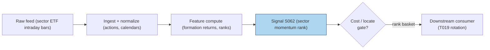

# S062 — Sector momentum

Provenance [D/SR]: the documented monthly industry-momentum form (Moskowitz & Grinblatt `1999` [documented]) is tier D; the intraday ETF rank-tilt is a reconstructed [SR] adaptation, quarantined in §S12. Sector momentum says industries that led recently keep leading for a while: rank sector ETFs by their formation-window return, buy the strongest, short the weakest, and flatten before the close. The engine is a cross-sectional sort --- not a factor model --- and the edge, where it exists, is continuation of fund flows into recent winners. The honest caveat: the literature's evidence is monthly (formation windows of `6` [documented] months), while this module ranks on an intraday window; nothing published validates that substitution. Provenance **[D]**.

> Tag law: every numeric literal in prose carries one of `[documented]
> [default] [example] [unverified] [internal-est] [measured]` (legend: Appendix
> i v1.0.0). Constants inside cited formulas inherit the formula's tag.
> Bibliographic years, volumes, pages, arXiv IDs, section numbers, rule codes
> (C1–C10), fail-safe codes (F1–F5), module IDs, and machine-parsed §0 data
> fields are identifiers, not literals, and are exempt.

## §1 Five-minute reviewer card

| Row | Value |
|---|---|
| Module | S062 — Sector momentum, v1.1.0 |
| Edge verdict | `PREDICTIVE-FEATURE-ONLY` — documented monthly industry premium; no published after-cost Sharpe for the intraday ETF adaptation |
| After-cost | `BEFORE-COST` — Monthly industry momentum is a documented factor, but crash-prone and mostly evidenced before cost; the intraday ETF rank-tilt used here is an unproven reconstruction. Treat it as a predictive feature with flatten discipline, not a standalone strategy. |
| Build cost | Tier L · `8`–`12` h [internal-est] · `$1,200`–`$1,800` loaded [internal-est] |
| Data cost | Research `~$0`/mo delayed [unverified]–`~$29`/mo entry paid (Polygon Stocks v3) [unverified]; retail intraday up to `~$200`/mo [unverified]; SIP-grade higher [unverified] --- bands indicative, verify before budgeting |
| latency_class | intraday; rank at `12:00` ET [unverified], hold to close, flatten overnight |
| risk_class | medium (long/short ETF basket; no order placement) |
| Capacity | `$5`–`50`M/day notional [example] --- deep sector ETFs; capacity limited by rotation-day turnover |
| Executability | Feasible: rank `10` [example] ETFs on intraday returns --- a DataFrame sort; Tier L analytics. |
| Risk summary | Momentum crashes (Daniel & Moskowitz `2016` [documented]); the intraday adaptation has no documented validation; borrow cost and locate risk on the short sector leg |
| When it dies | Stress / regime breaks (momentum crashes); overnight holds with gap risk; illiquid narrow sector ETFs into the close |
| Regime gates | `{regime_id: R001, direction: degrades, mechanism: momentum crash — winners gap down / losers squeeze (Daniel & Moskowitz 2016 [documented]), condition: vol_regime == STRESS, action: veto, min_lag: 1d [example], unknown_behavior: pause_entry}` |
| Emits | `signal_vector` (Appendix b v1.0.0) — never orders |

## §1.5 Cheapest / least-build path

1. **Prototype hour band:** `8`–`12` h [internal-est] — sector ETF return panel, rank engine, flatten logic, fixture validation against the tape.
2. **Cheapest-source row:** min_tier = Delayed/retail intraday ETF quotes (Polygon Stocks v3; entry paid tier is the cheapest point-in-time intraday candidate [unverified]); latency_class = intraday, point-in-time, corporate-action adjusted;
   required_fields = 1-min [example] (or finer) adjusted ETF bars with open and rank-time prices, corporate actions, session calendar; price_band = `~$0`/mo delayed [unverified] to `~$29`/mo entry paid [unverified] (indicative --- verify before budgeting; SIP-grade higher [unverified]); build_or_buy = **build the rank engine, buy clean intraday ETF bars**.
3. **Resource budget:** `1` core, `<1` GB RAM [internal-est]; compute pattern `per_bar`.
4. **Skip list:** monthly factor models; sector-rotation hedging; live short-locate integration.
5. **DO-NOT-CUT list:** causality assertions (`assert fill_event >
   signal_event`, no-signal-bar-fills test); COST block + callable
   `expected_cost_bps`; F1–F5 fail-safes + module-state enum; decision-log
   audit records; bona-fide-intent + self-trade prevention; provenance tags on
   every numeric literal; fixtures + `test_cmd`; secrets via env only.
6. **Escalation gate:** universe >`10` ETFs [default]; move to multi-day formation windows; live trading enters scope.

## §S0 Module contract

### S0.1 Typed signature

```python
def signal(state: ModuleState, events: list[Event], cfg: Config) -> SignalVector:
```

`SignalVector` per Appendix b v1.0.0. `state` is the module-owned named state
vector (`basket_long`, `basket_short`, `rank_snapshot`, `cooldown_until`, `module_state`); `events` are canonical Events
(Appendix a v1.0.0), newest last. The function handles documented edge cases:
empty rows → `UNKNOWN`; non-finite formation_ret → `UNKNOWN` (F1/F2, never interpolate); rank tie → neutral `0` (F5); halt/auction → freeze per the market-state table.

### S0.2 Config dataclass

| Parameter | Type | Default | Range | Status |
|---|---|---|---|---|
| `n_long` | int | `2` | `1–3` | example |
| `n_short` | int | `2` | `1–3` | example |
| `cost_gate_k` | float | `0.5` | `0.1–2.0` | default |
| `rank_time` | str | `"12:00"` | `10:00–14:00` ET | calibrate |

All defaults tagged per the tag law.

### S0.2b Parameter calibration recipes

Walk-forward with an embargo of `1` trading day [example]; selection on
after-cost DSR with multiplicity control over the grid; grids are [example]
unless re-estimated on live data.

- `n_long` / `n_short`: grid `{1, 2, 3}` [example] — `9` [example] combos.
  Select the smallest basket whose after-cost DSR is within `1` standard
  error [default] of the grid maximum; re-check yearly.
- `cost_gate_k`: grid `{0.25, 0.5, 1.0, 2.0}` [example]. Select the largest
  `k` such that the realized cost share of gross edge is ≤ `50`% [default]
  with at least `20` [example] OOS rotation-days per year; never lower `k`
  past the point where trade count collapses.
- `rank_time`: grid `{10:30, 11:30, 12:00, 13:00}` ET [example]. Select the
  rank time maximizing the after-cost t-stat across walk-forward windows;
  require sign stability across `2`+ [example] calendar years before adopting;
  the default stays `12:00` [default] until then.
- Multiplicity: count grid combos × `3` [example] window choices as variants;
  DSR must clear the multiple-testing threshold, otherwise hold defaults.

### S0.3 Canonical schema mapping

Vendor columns → canonical Event schema (Appendix a v1.0.0), stated once here:

| Vendor | Canonical |
|---|---|
| ``sector` (tape)` | ``sector` (str)` |
| ``event_ts` (tape)` | ``event_ts` (int64 ns UTC)` |
| ``asof_ts` (tape)` | ``asof_ts` (int64 ns UTC)` |
| ``formation_ret` (tape)` | ``formation_ret` (float, pct)` |
| ``rank_t` (tape)` | ``rank_t` (str, rank timestamp)` |

### S0.4 Time contract

> Time contract: clock domain UTC, int64 ns; authoritative causality clock =
> `event_ts`; max_skew = `1` ms [default]; jitter budget = `500` µs [default]
> bar-label = open time; staleness TTL = `3` s [default]; gap policy = mask, no interpolation; halt/auction
> → discard contributions across reopen.

**Timing box:** `signal@t (per_bar, America/New_York) → earliest fill @open(t+1)`

### S0.5 Market-state table

| State | Module behavior |
|---|---|
| CONTINUOUS_TRADING | Compute normally; emit per cadence |
| HALTED | Freeze state; emit `UNKNOWN`; discard contributions across reopen |
| AUCTION | No new signals; hold last `SignalVector`; state `DEGRADED` |
| CLOSED | Emit nothing; state `OFF` |

### S0.6 Module-state enum + error taxonomy

States per Appendix k v1.0.0: `OK | DEGRADED | UNKNOWN | OFF`. Invalid input →
`UNKNOWN`, never interpolate (Appendix f v1.0.0, F1–F5).

| Failure | State | Alert |
|---|---|---|
| Missing/stale input (TTL `3` s [default]) | `UNKNOWN` | page |
| Inputs out of mathematical bounds (F2) | `UNKNOWN` | page |
| `seq` gap > `1,000` events [default] | `DEGRADED` (restart windows) | log |
| Feed jitter > budget persistently | `DEGRADED` | notify |
| Halt/auction | `UNKNOWN` / `DEGRADED` (per table) | log |
| Kill/administrative disable | `OFF` | page |
| Anything unmapped | `UNKNOWN` | page |

### S0.7 Ops tail

- **Schedule:** intraday rank at `12:00` America/New_York [unverified] --- formation window open→`12:00`, trade to close, flatten; owner: equity-factor on-call.
- **Health checks:** fixture replay (`test_cmd`) green on deploy; live
  `seq`-gap monitor; staleness watchdog at `3`× cadence [default].
- **Alert table:** page on `UNKNOWN` > `30` s [default] or bounds violation;
  notify on `DEGRADED`; log on single dropped events.
- **Resource budget:** `1` core, `<1` GB RAM [internal-est]; state is O(window) per symbol.
- **Runbook stub:** `1.` confirm feed (vendor status); `2.` replay fixture;
  `3.` if red → set `OFF`, page; `4.` reconcile decision log before re-arm.

### S0.8 Secrets (env-only)

`POLYGON_API_KEY` via environment only. No secrets in
this file, fixtures, or logs (CI secrets-grep).

### S0.9 May / must-NOT

> **May:** emit `SignalVector` records per Appendix b v1.0.0. **Must-NOT:**
> emit orders, order intents, prices, share counts, or notionals; call a
> broker; mutate shared state outside `state`; interpolate across gaps.

## §S1 Legacy (subsumed by §1)

Legacy §S1 content is the §1 reviewer card above; this header is retained so
section numbering stays frozen.

## §S2 Specification

### Universe

Liquid US sector ETFs (`10` [example] tickers: XLE, XLF, XLU, XLK, XLV, XLI, XLP, XLY, XLB, XLC); liquid, borrowable short legs (C7).

### Entry rule (Boolean — no prose-only conditions)

```
ENTER_LONG_SPREAD := (spread_edge > 0) AND (expected_cost_bps(...) <= cost_gate_k * edge_bps)   # long top-n_long sectors, short bottom-n_short sectors
FLAT                := otherwise

`spread_edge = max(formation_ret) - min(formation_ret)`; `edge_bps = spread_edge · 100` [example] modeled per-trade edge; `confidence = min(1, spread_edge / 2.0)` [example].
```

### Exits (with post-exit cooldown)

```
EXIT := (now >= close) OR (module_state != OK)   # [example] flatten rule --- positions never held overnight
ON_EXIT: cooldown_until = now + cooldown_s   # 60 s [default]; C10
```

### Position sizing (fenced function)

```python
def size_shares(risk_budget_R, stop_distance, vol_estimate, ADV_cap, cost):
    # S-module requests capital fraction only; share math lives in the strategy.
    # Reference: capital = 0.5 * confidence  (confidence in [0,1])  [default]
    risk_notional = risk_budget_R * 0.5 * confidence          # [default] 0.5 factor
    shares = risk_notional / max(stop_distance, 1e-9)  # epsilon floor [default]
    return int(min(shares, ADV_cap * adv_shares * 0.001))  # 0.001 = 0.1% ADV cap [default]
```

### Risk limits

| Limit | Value |
|---|---|
| Max capital fraction per signal | `0.5` [default] |
| Max names per basket leg | `3` [example] |
| Overnight holds | forbidden --- flatten at close [example rule] |
| Short leg locate | requires `locate_ok` from the consumer (C7) |

### COST block (single source of truth)

| Component | Value (bps) | Basis |
|---|---|---|
| Spread (sector-ETF half-spreads, both legs) | `1.00` | [example] — reference stack |
| Fees (taker, two legs) | `0.30` | [example] — reference stack |
| Borrow (loser-leg borrow, amortized) | `1.50` | [example] — reference stack |
| Impact (rotation-day fill slippage) | `1.00` | [example] — reference stack |
| **Total reference** | `3.80` | [example] |

`fee_schedule_as_of`: `2026-02-11` [documented] — NYSE Arca equities fee schedule effective date (SEC filing 34-104870); Tier-1 take fee `$0.0029`/share [documented] (Tape A/C) and `$0.0028`/share [documented] (Tape B, where Arca-listed sector ETFs print) — sub-penny per share, converted to bps via share price at fill time. `side: taker` [default]; venue/tier/source: NYSE Arca [documented]. `borrow_bps_per_day`: `0` [default] — reason: the module flattens before the close every day, so no daily borrow accrual applies; the same-day short-rental on the loser leg is amortized inside the Borrow stack line above. Re-stating cost numbers outside this block is a validation failure.

```python
def expected_cost_bps(notional, adv_pct, venue, side, urgency) -> float:
    """Callable cost model — reference stack for S062."""
    spread_bps = 1.00   # sector-ETF half-spread [example]
    fee_bps = 0.30      # taker fee [example]
    borrow_bps = 1.50   # loser-leg borrow amortized [example]
    impact_bps = 1.00   # rotation-day fill slippage [example]
    return spread_bps + fee_bps + borrow_bps + impact_bps
```

### Execution / fill model table

| Aspect | Assumption |
|---|---|
| Latency | Signal computed at rank time; intent next bar [example] |
| Partial fills | Basket legs async --- leg slippage captured in impact [example] |
| Impact | `1.00` bps reference [example]; stress ×`3` [example] |
| Adverse fill | Rotation-day slippage haircut on formation outliers [example] |

### Robustness

Formation-window choice is the #1 reconstruction risk: the literature uses `6` [documented] months, this module uses open→`12:00` ET [unverified] --- nothing validates the substitution. Sector-ETF baskets are coarser than Moskowitz & Grinblatt's `20` [documented] industry portfolios; ETF composition drift changes what is ranked. Never hold overnight: the fixture and the rule flatten at close because gap risk is outside the continuation thesis. Stress the dispersion inputs --- a single halted ETF freezes the whole rank --- and haircut the spread edge for borrow on the short leg.

### Compliance sub-block (C1–C10+)

| Code | Rule: trigger → check → action → log |
|---|---|
| C1 | Self-match prevention: signal module emits no orders; downstream T-modules must set self-trade-prevention flags — S062 asserts the requirement in its `consumes` contract |
| C2 | Bona-fide intent: every emitted `SignalVector` with |direction|=`1` must pass the cost gate; sub-threshold readings emit direction `0`, never a tradeable hint |
| C3 | Message-rate: `≤100` emissions/symbol/s [default]; breach → throttle to `1`/s [default] + alert |
| C4 | Fat-finger trio (applied by consumers; S062 bounds its own outputs): confidence ∈ [`0` [default],`1` [default]], capital ∈ [`0` [default],`0.5` [default]], computed_at sane — out-of-bounds → `UNKNOWN` (F2) |
| C5 | Decision log: every emission, veto, and state transition logged per Appendix g v1.0.0, hash-chained |
| C6 | Halt/auction: per §S0.5 market-state table; contributions across reopen discarded |
| C7 | Locate check: SHORT direction requires `locate_ok` from the consumer; S062 never emits SHORT without the consumer asserting locate (Reg-SHO threshold securities → direction `0`) |
| C8 | Public dissemination: no signal values published externally without review gate |
| C9 | Data entitlements: per §S6 Data rights row; entitlement-class change → §1.5 escalation gate |
| C10 | Post-exit cooldown: `60 s` [default] after any exit or compliance block; no re-entry |
| C11 | Sector-list vintage: the ETF universe is point-in-time; reconstitutions must not leak future membership into the rank. --- trigger → check → action → log: prevents lookahead in universe composition |
| C12 | Borrow/locate discipline: the short sector leg needs `locate_ok` per C7; Reg-SHO threshold securities → direction `0`. --- trigger → check → action → log: prevents illegal shorts |

### Parameter table

| Parameter | Symbol | Value | Tag | Sensitivity |
|---|---|---|---|---|
| Formation window | `W` | `open→12:00 ET` | [unverified] | high |
| Names per long leg | `n_long` | `2` | [example] | medium |
| Names per short leg | `n_short` | `2` | [example] | medium |
| Cost-gate k | `cost_gate_k` | `0.5` | [default] | medium |
| Dispersion scale (confidence) | `s` | `2.0` | [example] | low |

### Timing box

`signal@t (per_bar, America/New_York) → earliest fill @open(t+1)`

## §S3 Math + normative pseudocode

Industries with the strongest prior returns keep outperforming the weakest for a while --- Moskowitz & Grinblatt (`1999`) [documented]. This module sorts that idea into an intraday rank.

$$r_{i}^{f} = \ln P_{i,rank} - \ln P_{i,open}, \qquad rank_{i} = \mathrm{rank}(r_{i}^{f}), \qquad pos_{i} = +1/n_{long}\ (top),\ -1/n_{short}\ (bottom),\ 0\ (else).$$

Formation return over window $W$ [unverified]; cross-sectional rank; equal-weighted long/short baskets. Stub model: $spread\_edge = \max r^{f} - \min r^{f}$; direction `+1` iff $spread\_edge > 0$; $confidence = \min(1, spread\_edge/2.0)$ [example].

**Normative pseudocode** (pseudocode is normative; prose is commentary):

```
function signal(state, events, cfg) -> SignalVector:
    require all events share one bar label (rank time) else return UNKNOWN     # bar-label guard
    if any(not finite(e.formation_ret)): return UNKNOWN                        # F1/F2, never interpolate
    srt = sort(events by formation_ret desc); N = len(srt)
    pos[i] = +1 if rank(i) <= cfg.n_long else -1 if rank(i) > N - cfg.n_short else 0
    for adjacent pair (a,b) in srt with |a.formation_ret - b.formation_ret| <= 1e-12 [default]:  # F5 rank tie
        if pos[a] != pos[b]: pos[a] = pos[b] = 0                               # boundary tie -> neutral
    spread_edge = srt[0].formation_ret - srt[-1].formation_ret
    direction = +1 if spread_edge > 0 else 0
    confidence = min(1.0, spread_edge / 2.0)          # [example] scale
    edge_bps = spread_edge * 100.0                   # [example] modeled edge
    cost = expected_cost_bps(notional, adv_pct, venue, side, urgency)
    if cost > cfg.cost_gate_k * edge_bps: direction, confidence = 0, 0.0      # cost gate as executable predicate
    # causality: formation returns use bars <= rank time; earliest fill is bar t+1's open.
    # Mandatory unit test: no-signal-bar fills (assert fill_event_ts > computed_at).
    return SignalVector("BASKET", direction, confidence, 0.5 * confidence, events[0].event_ts, events[0].asof_ts - events[0].event_ts, "OK")
```

Causality: Formation returns are computed on bars $\le$ rank time; the earliest fill is bar $t+1$'s open. Positions flatten at the close --- no overnight continuation is claimed. Mandatory unit test: no-signal-bar fills.

## §S4 Worked example (fixture-backed)

- Tape: `modules/fixtures/S062_tape.csv` — `# TYPE: validation-run`;
  `8` rows (`8`-row [example] synthetic sector-ETF panel at rank time (formation returns in pct; seed `62`)), all numbers synthetic,
  seed `62` [example]; `event_ts`/`asof_ts` int64 ns UTC.
- Expected outputs: `modules/fixtures/S062_expected.csv` — per-sector `rank`, `position` --- XLE/XLY long `+1`, XLP/XLV short `-1`, XLK flat `0`.
- Tolerance: `1e-9 [default]` on floats; integers exact.
- Hand-checks: ['XLE formation_ret `2.1`, rank `1`, position `+1` [measured]', 'XLK formation_ret `1.2`, rank `3`, position `0` (neutral) [measured]', 'top-minus-bottom spread `>0` → direction `+1` [measured]'].
- Acceptance tests (`modules/tests/test_S062.py`, `8` tests [internal-est]):
  `1.` fixture recomputes to expected (XLE/XLY long, XLP/XLV short, XLK neutral)
  `2.` stub emits valid `SignalVector` (direction ∈ {+1,0}, confidence/capital ∈ [0,1])
  `3.` no-signal-bar fills (`fill_event_ts > computed_at`)
  `4.` cost-gate predicate passes on large edge, blocks on tiny edge
  `5.` invalid input (non-finite formation_ret) → `UNKNOWN`
  `6.` rank tie straddling a basket boundary → tied names neutral `0` (F5)
  `7.` empty event list → `UNKNOWN`
  `8.` `HALTED` → `UNKNOWN`; `AUCTION` → `DEGRADED` (per §S0.5)
- `test_cmd`: `python3 -m pytest modules/tests/test_S062.py -q` → exits `0`.

**Where the example is optimistic:** `8` synthetic sectors [example], zero friction --- demonstrates the rank-and-basket computation, not a tradable backtest.

## §S5 Strategies that use this signal

| Strategy | Role |
|---|---|
| T019 — Sector Momentum Rotation | Primary entry trigger (direction): the S062 rank rule drives the long/short sector basket with flatten-at-close |
| T055 — Relative-Rotation Pairs | Basket-construction comparator: cross-sectional rank on formation returns |

## §S6 Data required

| Field | Type | Granularity | Source tier | Notes |
|---|---|---|---|---|
| Sector ETF intraday bars | float | tick / 1-min [example] | Tier 1–2 | formation returns need open→rank-time prices, corporate-action adjusted |
| Corporate actions | events | daily | Tier 1–2 | splits/dividends contaminate intraday formation returns |
| Session calendar | date/bool | daily | Tier 1 | half-days shrink the formation window |

**Required fields (minimum, any vendor):** 1-min [example] (or finer) corporate-action-adjusted ETF bars with open and rank-time prices, high/low, volume; daily corporate-action events (splits, dividends); session calendar (early closes shrink the formation window). Price bands: Polygon Stocks v3 entry paid ~`$29`/mo [unverified]; Databento US Equities NBBO research tier higher [unverified]; SIP-grade full tape higher [unverified] — all indicative, verify before budgeting.

**Vendor → canonical column mapping** (tape mapping stays in §S0.3; mapping rows below are [unverified] unless re-checked against current vendor docs):

| Vendor product | Vendor columns → canonical |
|---|---|
| Polygon Stocks v3 aggregates | `T`→`sector`, `t`→`event_ts`, `o`/rank-time `c`→`formation_ret` inputs, corporate actions via splits/dividends endpoints |
| Databento US Equities NBBO | `ts_event`→`event_ts`, `symbol`→`sector`, `bid_px_00`/`ask_px_00`→ spread inputs |
| CRSP SIC/FF industry files | `siccd`/`ff_ind` → constituent→sector mapping (point-in-time; see C11) |

**Data rights row** (Appendix j v1.0.0): Sector ETF intraday bars via Polygon / Databento, `rights: licensed`; license scope = research + stated production symbol count; raw ticks never leave our systems --- fixtures are synthetic; entitlement-class change → §1.5 escalation gate.

## §S7 Local build (M5 Max / 128 GB)

Feasible. Ranking `10` [example] ETFs on intraday returns is a sort over a handful of rows --- microseconds [internal-est]; the working set is <`1` MB [internal-est]. What breaks first is data licensing (clean intraday ETF history), short-locate access for the loser leg, and execution plumbing --- not CPU or RAM. Stack: **Python+polars** --- **Tier L, 8–12 h ≈ $1,200–$1,800 loaded** (cost-model §5).

## §S8 Buy vs build

Build the rank engine and flatten logic; buy clean intraday ETF bars. Indicative bands: free/delayed quotes `~$0` [unverified] --- learn the math, useless live; Polygon Stocks v3 entry paid `~$29`/mo [unverified]; retail intraday up to `~$200`/mo [unverified]; SIP-grade higher [unverified] --- indicative, verify before budgeting.

## §S9 Efficacy — documented evidence

| Study / source | Market & period | Metric | Before/after cost | Caveat |
|---|---|---|---|---|
| Moskowitz & Grinblatt (1999) [documented] | US industries, `1963`–`1995` | top/bottom `3` of `20` industries on `6`-month returns continue; up to `12`%/yr abnormal per dollar long | `BEFORE-COST` returns | monthly formation; does not validate the intraday adaptation |
| Ehsani & Linnainmaa (2020, preliminary) [documented] | factor momentum, long sample | factor momentum `0.35`%/month, t≈`2.09`; `11`-factor cross-asset `0.35`%/month, t≈`7.05` | `BEFORE-COST` returns | monthly; factor-level, not sector-tradeable directly |
| Daniel & Moskowitz (2016) [documented] | `2009` crash sample | momentum crashes: `-73.42`% US, `-45.52`% Europe, `-67.46`% Japan | `BEFORE-COST` returns | the crash tail is the strategy's main risk |
| Jegadeesh & Titman (1993) [documented] | US equities | buy past winners / sell past losers: significant abnormal returns | `BEFORE-COST` returns | single-stock momentum, not industry portfolios |
| Lewellen (2002) [documented] | industry, size, value portfolios | momentum in industry, size, value --- industry explains part of stock momentum | `BEFORE-COST` returns | industry-level; monthly |

**Honest bottom line.** The documented evidence shows monthly industry momentum is real (Moskowitz & Grinblatt 1999; Ehsani & Linnainmaa 2020), all **before-cost** and crash-prone (Daniel & Moskowitz 2016). The intraday ETF rank-tilt this module implements is a **reconstruction with no documented validation** --- the monthly literature does not bless it. Use it as a predictive feature with flatten discipline, not a standalone strategy.

## §S10 Failure modes & pitfalls

| # | Trigger → Detect → Action → Recovery | check: |
|---|---|---|
| 1 | Momentum crash → long winners gap down, short losers squeeze → detect: dispersion collapse at rank time → action: flatten, skip rotation → recovery: wait for calm | ``spread_edge < 0.5`×trailing median → direction `0` [example]` |
| 2 | Intraday-window mismatch → monthly literature does not cover open→`12:00` continuation → detect: rank-half-life drift → action: shrink baskets → recovery: re-validate on intraday data | ``n_long = n_short = 1` during review [example]` |
| 3 | Flatten failure → overnight gap risk outside the thesis → detect: position alive past close → action: emergency flatten, page → recovery: post-mortem | ``module_state = OFF` until reviewed [example]` |
| 4 | Borrow/locate spike → short leg unborrowable → detect: `locate_ok == false` → action: direction `0` (C7) → recovery: re-check borrow | ``locate_ok` gate` |
| 5 | Halted ETF → rank frozen on stale price → detect: seq gap / halt flag → action: freeze state, emit `UNKNOWN` → recovery: discard contributions across reopen | `halt table §S0.5` |

## §S11 Visuals




## §S12 Source log + unverified leads

**Sources** (citable facts only):

['1. Moskowitz, T. J. & Grinblatt, M. (1999) [documented]. "Industry Momentum." *Journal of Finance*. --- ranked `20` [documented] industries by past returns; top/bottom `3` [documented] on `6`-month [documented] formation; `1963`–`1995` [documented]; long-short "as much as `12`% [documented] abnormal return per dollar long per year".', '2. Ehsani, S. & Linnainmaa, J. T. (2020, preliminary) [documented]. "Factor Momentum and the Momentum Factor." --- factor momentum `0.35`%/month [documented], t≈`2.09` [documented]; `11`-factor [documented] cross-asset momentum `0.35`%/month [documented], t≈`7.05` [documented].', '3. Daniel, K. & Moskowitz, T. J. (2016) [documented]. "Momentum Crashes." --- `2009` [documented] crashes: `-73.42`% US [documented], `-45.52`% Europe [documented], `-67.46`% Japan [documented]; momentum tails are the strategy\'s main risk.', '4. Jegadeesh, N. & Titman, S. (1993) [documented]. "Returns to Buying Winners and Selling Losers." *Journal of Finance*. --- past winners outperform past losers with significant abnormal returns.', '5. Lewellen, J. (2002) [documented]. "Momentum and Autocorrelation in Stock Returns." *Review of Financial Studies*. --- momentum in industry, size, and value portfolios; industry momentum explains part of stock momentum.']

**Chatbot source log.** Duck.ai (GPT-5.6 Luna, anonymous, web-search assisted, 2026-09-10) answered Q-SB7-1–Q-SB7-3. Grok/Cursor answers pending (checked 2026-09-10). Chatbot output is leads, never facts.

**Unverified leads** (chatbot-only — never in evidence tables):

['- Duck.ai Q-SB7-3: intraday sector-tilt lead --- the monthly industry-momentum form (Moskowitz & Grinblatt `1999` [documented]) adapted to intraday ETF ranking (rank at `12:00` ET [unverified], trade to close) is reconstructed [SR]; no documented study validates it; quarantined here.', '- Quantpedia / Dujava Industry Momentum (US Sectors) replication: `12` [unverified] ETFs, Jan `2000`–May `2020` [unverified], `5.99`% [unverified] annualized, Sharpe `0.55` [unverified] --- research-site, before cost, unverified.']

---

## Appendix — AI build prompt (S062)

Copy-paste into any chat agent:

> Build module **S062 — Sector momentum** per
> `notes/module-template.md` v1.0.0 and this file's §S0 contract.
> Cheapest path (§1.5): prototype `8`–`12` h [internal-est]; cheapest data
> candidate Delayed intraday ETF quotes --- cheapest data source candidate [unverified]; compute pattern
> `per_bar`; skip factor models, hedges, locate integration for now.
> Implement `signal(state, events, cfg) -> SignalVector` (Appendix b v1.0.0)
> with the §S3 normative pseudocode, including the cost-gate predicate
> `expected_cost_bps(...) <= k * edge_bps` and `assert fill_event >
> signal_event`. Wire F1–F5 (Appendix f v1.0.0): invalid input → `UNKNOWN`,
> never interpolate. Log decisions per Appendix g v1.0.0. Secrets via env
> only. Run the fixture `modules/fixtures/S062_tape.csv`
> (`# TYPE: validation-run`) against `modules/fixtures/S062_expected.csv`
> (tolerance `1e-9 [default]`).
> **Definition of done:** `python3 -m pytest modules/tests/test_S062.py -q`
> exits `0`. Tag every numeric literal you add with the unified enum
> (Appendix i v1.0.0); put anything unverifiable in §S12 unverified leads.
