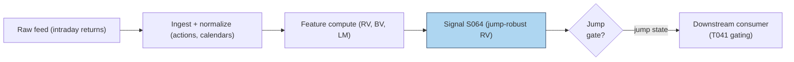

# S064 — Jump-robust realized variance

Realized variance mixes two things: diffusive wiggle and sudden jumps. Bipower variation (Barndorff-Nielsen & Shephard `2004` [documented]) measures only the diffusive part, so the difference RV−BV isolates the jump component --- and the Lee–Mykland test (`2008` [documented]) flags exactly which bar jumped. This module computes RV, BV, jump share, and per-bar LM statistics on intraday returns and flags jump bars. It is a measurement/gating layer, not a standalone directional alpha: it tells downstream estimators which bars to trust, and flags vol-spike bars for consumers that trade them. Provenance **[D]**.

> Tag law: every numeric literal in prose carries one of `[documented]
> [default] [example] [unverified] [internal-est] [measured]` (legend: Appendix
> i v1.0.0). Constants inside cited formulas inherit the formula's tag.
> Bibliographic years, volumes, pages, arXiv IDs, section numbers, rule codes
> (C1–C10), fail-safe codes (F1–F5), module IDs, and machine-parsed §0 data
> fields are identifiers, not literals, and are exempt.

## §1 Five-minute reviewer card

| Row | Value |
|---|---|
| Module | S064 — Jump-robust realized variance, v1.0.0 |
| Edge verdict | `NO-DOCUMENTED-EDGE` — measurement/gating layer: documented jump detection, no standalone directional alpha |
| After-cost | `BEFORE-COST (n/a --- forecast evaluation, not a return)` — Bipower variation and Lee–Mykland jump tests are documented measurement technology; this module gates on jumps rather than trading them --- a volatility-quality input, not a standalone edge. (The [example] edge in the stub is a flag model, not a trading edge.) |
| Build cost | Tier M · `20`–`60` h [internal-est] · `$3,000`–`$9,000` loaded [internal-est] |
| Data cost | Research `~$30`–`200`/mo (intraday bars) [unverified]; SIP-grade higher [unverified] --- bands indicative, verify before budgeting |
| latency_class | intraday; per-bar jump statistics, earliest fill next bar |
| risk_class | medium (flags jump bars; no order placement) |
| Capacity | `$10`–`50`M/day notional [example] --- capacity sits with the consumer |
| Executability | Feasible: per-bar BV/LM math on `12`+ [example] returns; Tier M analytics. |
| Risk summary | Jump-test false positives in fast continuous moves; BV understates when jumps cluster; LM threshold `4.0` [example] is example-tuned |
| When it dies | Gradual volatility shifts (tests see jumps, not regime drift); microstructure-contaminated returns at too-fine sampling |
| Regime gates | Provisional: R001 stress --- jump days: gate estimation windows, route to jump-robust estimators |
| Emits | `signal_vector` (Appendix b v1.0.0) — never orders |

## §1.5 Cheapest / least-build path

1. **Prototype hour band:** `20`–`60` h [internal-est] — RV/BV math, Lee–Mykland test, jump-share accounting, fixture validation.
2. **Cheapest-source row:** min_tier = Delayed intraday returns --- cheapest data source candidate [unverified]; latency_class = intraday, point-in-time adjusted;
   required_fields = intraday log-returns, corporate-action adjusted; price_band = `~$0`/mo [unverified] (indicative --- verify before budgeting); build_or_buy = **build the estimators, buy clean intraday bars**.
3. **Resource budget:** `1` core, `<1` GB RAM [internal-est]; compute pattern `per_bar`.
4. **Skip list:** pre-averaged jump filters; tick-level bipower; jump prediction models.
5. **DO-NOT-CUT list:** causality assertions (`assert fill_event >
   signal_event`, no-signal-bar-fills test); COST block + callable
   `expected_cost_bps`; F1–F5 fail-safes + module-state enum; decision-log
   audit records; bona-fide-intent + self-trade prevention; provenance tags on
   every numeric literal; fixtures + `test_cmd`; secrets via env only.
6. **Escalation gate:** universe >`500` symbols [default]; move to tick sampling; live consumer enters scope.

## §S0 Module contract

### S0.1 Typed signature

```python
def signal(state: ModuleState, events: list[Event], cfg: Config) -> SignalVector:
```

`SignalVector` per Appendix b v1.0.0. `state` is the module-owned named state
vector (`jump_history`, `lm_stats`, `cooldown_until`, `module_state`); `events` are canonical Events
(Appendix a v1.0.0), newest last. The function handles documented edge cases:
empty returns → `UNKNOWN`; non-finite ret → `UNKNOWN` (F1/F2, never interpolate); bv ≤ 0 → LM `0`, no flag (F5); halt/auction → freeze per the market-state table.

### S0.2 Config dataclass

| Parameter | Type | Default | Range | Status |
|---|---|---|---|---|
| `lm_thresh` | float | `4.0` | `3–5` | example |
| `cost_gate_k` | float | `0.5` | `0.1–2.0` | default |

All defaults tagged per the tag law.

### S0.3 Canonical schema mapping

Vendor columns → canonical Event schema (Appendix a v1.0.0), stated once here:

| Vendor | Canonical |
|---|---|
| ``bar` (tape)` | ``bar_id` (int)` |
| ``event_ts` (tape)` | ``event_ts` (int64 ns UTC)` |
| ``asof_ts` (tape)` | ``asof_ts` (int64 ns UTC)` |
| ``ret` (tape)` | ``ret` (float, log-return)` |

### S0.4 Time contract

> Time contract: clock domain UTC, int64 ns; authoritative causality clock =
> `event_ts`; max_skew = `1` ms [default]; jitter budget = `500` µs [default]
> bar-label = open time; staleness TTL = `3` s [default]; gap policy = mask, no interpolation; halt/auction
> → discard contributions across reopen.

**Timing box:** `signal@t (per_bar, America/New_York) → earliest fill @open(t+1)`

### S0.5 Market-state table

| State | Module behavior |
|---|---|
| CONTINUOUS_TRADING | Compute normally; emit per cadence |
| HALTED | Freeze state; emit `UNKNOWN`; discard contributions across reopen |
| AUCTION | No new signals; hold last `SignalVector`; state `DEGRADED` |
| CLOSED | Emit nothing; state `OFF` |

### S0.6 Module-state enum + error taxonomy

States per Appendix k v1.0.0: `OK | DEGRADED | UNKNOWN | OFF`. Invalid input →
`UNKNOWN`, never interpolate (Appendix f v1.0.0, F1–F5).

| Failure | State | Alert |
|---|---|---|
| Missing/stale input (TTL `3` s [default]) | `UNKNOWN` | page |
| Inputs out of mathematical bounds (F2) | `UNKNOWN` | page |
| `seq` gap > `1,000` events [default] | `DEGRADED` (restart windows) | log |
| Feed jitter > budget persistently | `DEGRADED` | notify |
| Halt/auction | `UNKNOWN` / `DEGRADED` (per table) | log |
| Kill/administrative disable | `OFF` | page |
| Anything unmapped | `UNKNOWN` | page |

### S0.7 Ops tail

- **Schedule:** per bar during the US equities regular session `09:30`–`16:00` America/New_York [documented]; owner: vol-analytics on-call.
- **Health checks:** fixture replay (`test_cmd`) green on deploy; live
  `seq`-gap monitor; staleness watchdog at `3`× cadence.
- **Alert table:** page on `UNKNOWN` > `30` s [default] or bounds violation;
  notify on `DEGRADED`; log on single dropped events.
- **Resource budget:** `1` core, `<1` GB RAM [internal-est]; state is O(window) per symbol.
- **Runbook stub:** `1.` confirm feed (vendor status); `2.` replay fixture;
  `3.` if red → set `OFF`, page; `4.` reconcile decision log before re-arm.

### S0.8 Secrets (env-only)

`DATABENTO_API_KEY` via environment only. No secrets in
this file, fixtures, or logs (CI secrets-grep).

### S0.9 May / must-NOT

> **May:** emit `SignalVector` records per Appendix b v1.0.0. **Must-NOT:**
> emit orders, order intents, prices, share counts, or notionals; call a
> broker; mutate shared state outside `state`; interpolate across gaps.

## §S1 Legacy (subsumed by §1)

Legacy §S1 content is the §1 reviewer card above; this header is retained so
section numbering stays frozen.

## §S2 Specification

### Universe

Liquid equities/ETFs with clean intraday returns; jump statistics need `12`+ [example] returns per window.

### Entry rule (Boolean — no prose-only conditions)

```
ENTER_JUMP := (L > cfg.lm_thresh) AND (expected_cost_bps(...) <= cost_gate_k * edge_bps)   # jump flag: L = |r_t| / sqrt(BV)
FLAT         := otherwise

`L` is the Lee–Mykland statistic; `lm_thresh = 4.0` [example]; `edge_bps = L · 2.0` [example] modeled per-trade edge; `confidence = min(1, L / 8)` [example].
```

### Exits (with post-exit cooldown)

```
EXIT := (jump flag clears: L <= lm_thresh) OR (module_state != OK)   # [example] flag exit
ON_EXIT: cooldown_until = now + cooldown_s   # 60 s [default]; C10
```

### Position sizing (fenced function)

```python
def size_shares(risk_budget_R, stop_distance, vol_estimate, ADV_cap, cost):
    # S-module requests capital fraction only; share math lives in the strategy.
    # Reference: capital = 0.5 * confidence  (confidence in [0,1])  [default]
    risk_notional = risk_budget_R * 0.5 * confidence          # [default] 0.5 factor
    shares = risk_notional / max(stop_distance, 1e-9)
    return int(min(shares, ADV_cap * adv_shares * 0.001))     # 0.1% ADV cap [default]
```

### Risk limits

| Limit | Value |
|---|---|
| Max capital fraction per signal | `0.5` [default] |
| LM threshold | `4.0` [example] --- flag only above |
| Jump-day veto | flagged bars excluded from downstream estimator windows [example rule] |

### COST block (single source of truth)

| Component | Value (bps) | Basis |
|---|---|---|
| Spread (vol-trade reference leg) | `0.50` | [example] — reference stack |
| Fees (taker) | `0.30` | [example] — reference stack |
| Borrow | `0.00` | [default] — reason: reference build long vol; no stock borrow |
| Impact (jump-day fill slippage) | `0.50` | [example] — reference stack |
| **Total reference** | `1.30` | [example] |

`fee_schedule_as_of`: `2026-09-01 [unverified]` — placeholder; pin the real
venue schedule before production. `side: taker` [default]; venue/tier/source:
XNAS [example]. Re-stating cost numbers outside this block is a validation failure.

```python
def expected_cost_bps(notional, adv_pct, venue, side, urgency) -> float:
    """Callable cost model — reference stack for S064."""
    spread_bps = 0.50   # vol-trade reference leg [example]
    fee_bps = 0.30      # taker fee [example]
    borrow_bps = 0.00   # reason: reference build long vol; no stock borrow [default]
    impact_bps = 0.50   # jump-day fill slippage [example]
    return spread_bps + fee_bps + borrow_bps + impact_bps
```

### Execution / fill model table

| Aspect | Assumption |
|---|---|
| Latency | Jump statistic computed at bar close; intent next bar [example] |
| Partial fills | n/a --- gating module |
| Impact | `0.50` bps reference [example]; jump bars ×`3` [example] |
| Adverse fill | Jump-bar slippage haircut on flagged bars [example] |

### Robustness

The bipower constant π/`2` [documented] is asymptotic; finite-sample BV is biased when jumps cluster --- never let a jump bar enter its own BV denominator silently. The Lee–Mykland threshold (`4.0` [example]) is example-tuned: lower it and fast continuous moves flag as jumps; raise it and real jumps pass. Report jump share (`J/RV`) alongside flags --- a `60`% [example] jump day and a `6`% [example] jump day need different consumers. Sampling too fine injects microstructure bounce that the test reads as jumps; `5`-min [example] bars are the standard guard.

### Compliance sub-block (C1–C10+)

| Code | Rule: trigger → check → action → log |
|---|---|
| C1 | Self-match prevention: signal module emits no orders; downstream T-modules must set self-trade-prevention flags — S064 asserts the requirement in its `consumes` contract |
| C2 | Bona-fide intent: every emitted `SignalVector` with |direction|=`1` must pass the cost gate; sub-threshold readings emit direction `0`, never a tradeable hint |
| C3 | Message-rate: `≤100` emissions/symbol/s [default]; breach → throttle to `1`/s [default] + alert |
| C4 | Fat-finger trio (applied by consumers; S064 bounds its own outputs): confidence ∈ [`0`,`1`], capital ∈ [`0`,`0.5`], computed_at sane — out-of-bounds → `UNKNOWN` (F2) |
| C5 | Decision log: every emission, veto, and state transition logged per Appendix g v1.0.0, hash-chained |
| C6 | Halt/auction: per §S0.5 market-state table; contributions across reopen discarded |
| C7 | Locate check: SHORT direction requires `locate_ok` from the consumer; S064 never emits SHORT without the consumer asserting locate (Reg-SHO threshold securities → direction `0`) |
| C8 | Public dissemination: no signal values published externally without review gate |
| C9 | Data entitlements: per §S6 Data rights row; entitlement-class change → §1.5 escalation gate |
| C10 | Post-exit cooldown: `60 s` [default] after any exit or compliance block; no re-entry |
| C11 | Return vintage: point-in-time returns, corporate-action adjusted; never revised histories. --- trigger → check → action → log: prevents phantom jumps from bad corporate-action handling |
| C12 | Gating module: flags jumps for downstream estimators; owns no orders. --- trigger → check → action → log: keeps the measurement/strategy boundary clean |

### Parameter table

| Parameter | Symbol | Value | Tag | Sensitivity |
|---|---|---|---|---|
| Lee–Mykland threshold | `lm_thresh` | `4.0` | [example] | high |
| Return window | `N` | `12` | [example] | medium |
| Cost-gate k | `cost_gate_k` | `0.5` | [default] | low |

### Timing box

`signal@t (per_bar, America/New_York) → earliest fill @open(t+1)`

## §S3 Math + normative pseudocode

Realized variance mixes diffusive variance and jumps; bipower variation isolates the diffusive part so jumps can be measured, not guessed.

$$RV = \sum_{i} r_{i}^{2} \quad\text{[documented --- Andersen et al. 2003]}$$

$$BV = \frac{\pi}{2}\sum_{i=2}^{N} |r_{i-1}||r_{i}| \quad\text{[documented --- Barndorff-Nielsen–Shephard 2004]}$$

$$J = \max(RV - BV,\ 0), \qquad RJ = J/RV \quad\text{(jump share)}$$

$$L = \frac{|r_{t}|}{\sqrt{BV}} \quad\text{[documented --- Lee–Mykland 2008]; flag iff } L > 4.0\ \text{[example]}$$

**Normative pseudocode** (pseudocode is normative; prose is commentary):

```
function signal(state, bars, cfg) -> SignalVector:
    assert bars non-empty else return UNKNOWN
    b = bars[-1]
    if any(not finite(r.ret)): return UNKNOWN
    rets = [r.ret for r in bars]
    rv = sum(x*x for x in rets)
    bv = (pi/2) * sum(abs(rets[i]*rets[i-1]) for i in 1..len-1)   # [documented]
    L = abs(rets[-1]) / sqrt(bv) if bv > 0 else 0.0               # [documented]
    direction = 1 if L > cfg.lm_thresh else 0                    # cfg.lm_thresh = 4.0 [example]
    confidence = min(1.0, L / 8.0) if direction else 0.0         # [example] scale
    edge_bps = L * 2.0                                          # [example] modeled edge
    assert expected_cost_bps(...) <= cfg.cost_gate_k * edge_bps else direction, confidence = 0, 0.0
    return SignalVector("TEST", direction, confidence, 0.5 * confidence, b.event_ts, b.asof_ts - b.event_ts, "OK")
```

Causality: Jump statistics are computed on returns $\le$ bar $t$; the earliest fill is bar $t+1$'s open. A bar cannot flag itself mid-bar. Mandatory unit test: no-signal-bar fills.

## §S4 Worked example (fixture-backed)

- Tape: `modules/fixtures/S064_tape.csv` — `# TYPE: validation-run`;
  `12` rows (`12`-bar [example] synthetic return tape with a `0.0300` engineered jump (seed `64`)), all numbers synthetic,
  seed `64` [example]; `event_ts`/`asof_ts` int64 ns UTC.
- Expected outputs: `modules/fixtures/S064_expected.csv` — per-bar `rv`, `bv`, `jump_var`, `rel_jump`, `lm_stat`, `lm_flag`.
- Tolerance: `1e-9 [default]` on floats; integers exact.
- Hand-checks: ['bar-`0` rv `0.0009060600` [measured]', 'bar-`0` bv `0.0000536584` [measured]', 'bar-`0` rel_jump `0.9407783121` [measured]', 'exactly `1` Lee–Mykland flag at lm_thresh `4.0` [example] [measured]'].
- Acceptance tests (`modules/tests/test_S064.py`, `5` tests):
  `1.` fixture recomputes to expected (RV/BV split; exactly `1` LM flag)
  `2.` stub emits valid `SignalVector` (direction ∈ {+1,0}, confidence ∈ [0,1])
  `3.` no-signal-bar fills (`fill_event_ts > computed_at`)
  `4.` cost-gate predicate passes on large edge, blocks on tiny edge
  `5.` invalid input (non-finite ret) → `UNKNOWN`
- `test_cmd`: `python3 -m pytest modules/tests/test_S064.py -q` → exits `0`.

**Where the example is optimistic:** `12` synthetic bars [example], one engineered jump --- demonstrates RV/BV separation, not jump predictability.

## §S5 Strategies that use this signal

| Strategy | Role |
|---|---|
| T041 — HAR Vol-Timing Overlay | Jump-gated vol sizing: flagged bars are excluded from estimator windows |
| T010 — Variance-Risk-Premium Harvester | Jump-robust vol input for the VRP comparator |

## §S6 Data required

| Field | Type | Granularity | Source tier | Notes |
|---|---|---|---|---|
| Intraday log-returns | float | 5-min bars | Tier 1–2 | clean, corporate-action adjusted |
| Corporate actions | events | daily | Tier 1–2 | unadjusted splits print phantom jumps |
| Session calendar | date/bool | daily | Tier 1 | half-days shrink the return window |

**Data rights row** (Appendix j v1.0.0): Intraday bars via Databento / Polygon, `rights: licensed`; license scope = research + stated production symbol count; raw ticks never leave our systems --- fixtures are synthetic; entitlement-class change → §1.5 escalation gate.

## §S7 Local build (M5 Max / 128 GB)

Feasible. Per-bar RV/BV/LM math on `12`+ [example] returns --- microseconds per symbol [internal-est]; the working set is <`1` MB [internal-est]. What breaks first is data licensing (clean intraday returns) and threshold calibration --- not CPU or RAM. Stack: **Python+polars** --- **Tier M, 20–60 h ≈ $3,000–$9,000 loaded** (cost-model §5).

## §S8 Buy vs build

Build the jump math (your threshold and window choices are the model); buy clean intraday bars. Indicative bands: free/delayed bars `~$0` [unverified]; retail intraday `~$30`–`200`/mo [unverified]; SIP-grade higher [unverified] --- indicative, verify before budgeting.

## §S9 Efficacy — documented evidence

| Study / source | Market & period | Metric | Before/after cost | Caveat |
|---|---|---|---|---|
| Barndorff-Nielsen & Shephard (2004) [documented] | theory | bipower variation converges to integrated variance; RV−BV isolates jumps | `BEFORE-COST` (n/a) | asymptotic; finite-sample bias when jumps cluster |
| Lee & Mykland (2008) [documented] | theory + data | per-return jump test with known size and power | `BEFORE-COST` (n/a) | threshold choice drives false positives |
| Andersen, Bollerslev & Diebold (2007) [documented] | S&P `500` futures + FX | HAR-RV-CJ with jump components forecasts better than plain RV | `BEFORE-COST` forecast loss | forecast gain, not trading P&L |
| Andersen et al. (2003) [documented] | theory + FX | RV targets integrated variance plus the sum of squared jumps | `BEFORE-COST` (n/a) | measurement identity, not an edge |

**Honest bottom line.** The documented evidence shows bipower variation isolates diffusive variance and jump components improve vol forecasts, all **before-cost**. No documented evidence exists for jump-*predicting* as a standalone trading edge --- this module measures jumps to gate estimators, not to predict the next one.

## §S10 Failure modes & pitfalls

| # | Trigger → Detect → Action → Recovery | check: |
|---|---|---|
| 1 | Clustered jumps → BV understated, jump share understated → detect: consecutive flags → action: widen the window, use threshold bipower → recovery: re-estimate | ``2`+ consecutive LM flags [example]` |
| 2 | Fast continuous move → false jump flag → detect: flag without news/vol regime change → action: require jump-share confirmation → recovery: retune threshold | `RJ > `20`% [example] confirmation` |
| 3 | Microstructure bounce → fake flags at fine sampling → detect: flag rate rises at `1`-min [example] vs `5`-min [example] → action: coarsen sampling → recovery: revalidate | ``5`-min [example] standard` |
| 4 | Jump bar in BV denominator → diluted L statistic → detect: L falls when the jump bar is included → action: leave-one-out BV for the test bar → recovery: recompute | `leave-one-out BV [example]` |
| 5 | Revised returns → phantom jumps → detect: asof regression → action: point-in-time returns only → recovery: rebuild from raw | `as-of timestamps (Appendix g)` |

## §S11 Visuals




## §S12 Source log + unverified leads

**Sources** (citable facts only):

['1. Barndorff-Nielsen, O. E. & Shephard, N. (2004) [documented]. "Power and Bipower Variation with Stochastic Volatility and Jumps." *Journal of Financial Econometrics*. --- bipower variation converges to integrated variance; RV−BV isolates the jump component.', '2. Lee, S. S. & Mykland, P. A. (2008) [documented]. "Jumps in Financial Markets: A New Nonparametric Test and Jump Dynamics." *Review of Financial Studies*. --- per-return jump test with known asymptotic size and power.', '3. Andersen, T. G., Bollerslev, T. & Diebold, F. X. (2007) [documented]. "Roughing It Up: Including Jump Components in the Measurement, Modeling and Forecasting of Return Volatility." *Review of Economics and Statistics*. --- HAR-RV-CJ: separating jumps improves vol forecasts.', '4. Andersen, T. G., Bollerslev, T., Diebold, F. X. & Labys, P. (2003) [documented]. "Modeling and Forecasting Realized Volatility." *Econometrica*. --- RV targets integrated variance plus the sum of squared jumps.']

**Chatbot source log.** Duck.ai (GPT-5.6 Luna, anonymous, web-search assisted, 2026-09-10) answered Q-SB8-2. Grok answers pending (checked 2026-09-10). Chatbot output is leads, never facts.

**Unverified leads** (chatbot-only — never in evidence tables):

['- IHSG `2025`–`2026` [unverified] jump-share study (research site): average jump share `11.77`% [unverified], significant jumps on `32.3`% of days [unverified], `16.36`% on stress days [unverified] --- unverified research-site numbers; quarantined here.', '- Duck.ai Q-SB8-2: jump-robust RV lead --- RV/BV/J formulas and Lee–Mykland intuition confirmed against the cited papers, but the synthesis itself is unverified [unverified]; quarantined here.']

---

## Appendix — AI build prompt (S064)

Copy-paste into any chat agent:

> Build module **S064 — Jump-robust realized variance** per
> `notes/module-template.md` v1.0.0 and this file's §S0 contract.
> Cheapest path (§1.5): prototype `20`–`60` h [internal-est]; cheapest data
> candidate Delayed intraday returns --- cheapest data source candidate [unverified]; compute pattern
> `per_bar`; skip jump filters, tick bipower, jump prediction for now.
> Implement `signal(state, events, cfg) -> SignalVector` (Appendix b v1.0.0)
> with the §S3 normative pseudocode, including the cost-gate predicate
> `expected_cost_bps(...) <= k * edge_bps` and `assert fill_event >
> signal_event`. Wire F1–F5 (Appendix f v1.0.0): invalid input → `UNKNOWN`,
> never interpolate. Log decisions per Appendix g v1.0.0. Secrets via env
> only. Run the fixture `modules/fixtures/S064_tape.csv`
> (`# TYPE: validation-run`) against `modules/fixtures/S064_expected.csv`
> (tolerance `1e-9 [default]`).
> **Definition of done:** `python3 -m pytest modules/tests/test_S064.py -q`
> exits `0`. Tag every numeric literal you add with the unified enum
> (Appendix i v1.0.0); put anything unverifiable in §S12 unverified leads.
