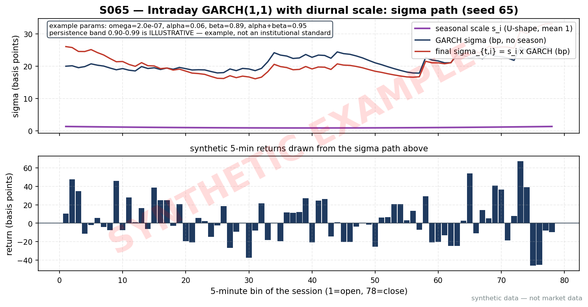
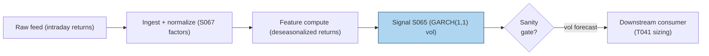

# S065 — GARCH(1,1) intraday volatility

Volatility clusters: big moves follow big moves. GARCH(`1`,`1`) (Bollerslev `1986` [documented]) says today's variance is a weighted sum of yesterday's variance and yesterday's squared surprise --- one recursion, three parameters, and the classic daily-returns vol model. Intraday, one rule is non-negotiable (Andersen & Bollerslev `1997` [documented]): deseasonalize first --- the U-shaped intraday pattern is not volatility, it is the clock. This module consumes S067's diurnal factors, runs the GARCH(`1`,`1`) recursion on deseasonalized returns, and emits a per-bar conditional-volatility forecast. It is a sizing/forecast input with no documented standalone trading edge: the vol forecast feeds position-size scalars (T041) and VRP comparators (T010). Provenance **[D]**.

> Tag law: every numeric literal in prose carries one of `[documented]
> [default] [example] [unverified] [internal-est] [measured]` (legend: Appendix
> i v1.0.0). Constants inside cited formulas inherit the formula's tag.
> Bibliographic years, volumes, pages, arXiv IDs, section numbers, rule codes
> (C1–C10), fail-safe codes (F1–F5), module IDs, and machine-parsed §0 data
> fields are identifiers, not literals, and are exempt.

## §1 Five-minute reviewer card

| Row | Value |
|---|---|
| Module | S065 — GARCH(1,1) intraday volatility, v1.0.0 |
| Edge verdict | `NO-DOCUMENTED-EDGE` — volatility forecast/sizing input: documented model, no documented directional edge by design |
| After-cost | `BEFORE-COST (n/a --- forecast evaluation)` — The classic daily-returns volatility model; intraday use requires deseasonalization (S067) first. It is a sizing/forecast input with no documented standalone trading edge. |
| Build cost | Tier M · `20`–`60` h [internal-est] · `$3,000`–`$9,000` loaded [internal-est] |
| Data cost | Research `~$30`–`200`/mo (intraday bars) [unverified]; SIP-grade higher [unverified] --- bands indicative, verify before budgeting |
| latency_class | intraday; per-bar vol forecast, earliest fill next bar |
| risk_class | low (emits vol forecast; no positions) |
| Capacity | `$10`–`100`M/day notional [example] --- capacity sits with the consumer |
| Executability | Feasible: one recursion per bar on deseasonalized returns; Tier M analytics. |
| Risk summary | Non-deseasonalized returns poison the forecast; α+β≥`1` → non-stationary recursion; Gaussian tails understate extremes (use Student-t per Bollerslev `1987` [documented]) |
| When it dies | Structural breaks (fixed ω,α,β go stale); jump-dominated bars; wrong seasonal factors from S067 |
| Regime gates | Provisional: R001 stress --- GARCH lags sudden breaks; blend with HAR (S066) during jumps |
| Emits | `signal_vector` (Appendix b v1.0.0) — never orders |

## §1.5 Cheapest / least-build path

1. **Prototype hour band:** `20`–`60` h [internal-est] — GARCH(1,1) recursion, deseasonalization wiring (S067), stationarity guards, fixture validation.
2. **Cheapest-source row:** min_tier = Delayed intraday returns --- cheapest data source candidate [unverified]; latency_class = intraday, point-in-time adjusted;
   required_fields = intraday log-returns + diurnal seasonal factors (S067); price_band = `~$0`/mo [unverified] (indicative --- verify before budgeting); build_or_buy = **build the recursion, buy clean intraday bars**.
3. **Resource budget:** `1` core, `<1` GB RAM [internal-est]; compute pattern `per_bar`.
4. **Skip list:** GJR/EGARCH asymmetries; FIGARCH long memory; MLE refits per bar.
5. **DO-NOT-CUT list:** causality assertions (`assert fill_event >
   signal_event`, no-signal-bar-fills test); COST block + callable
   `expected_cost_bps`; F1–F5 fail-safes + module-state enum; decision-log
   audit records; bona-fide-intent + self-trade prevention; provenance tags on
   every numeric literal; fixtures + `test_cmd`; secrets via env only.
6. **Escalation gate:** universe >`500` symbols [default]; move to per-symbol MLE refits; live consumer enters scope.

## §S0 Module contract

### S0.1 Typed signature

```python
def signal(state: ModuleState, events: list[Event], cfg: Config) -> SignalVector:
```

`SignalVector` per Appendix b v1.0.0. `state` is the module-owned named state
vector (`h2` (conditional variance), `sigma`, `module_state`); `events` are canonical Events
(Appendix a v1.0.0), newest last. The function handles documented edge cases:
empty bars → `UNKNOWN`; non-finite ret or season ≤ 0 → `UNKNOWN` (F1/F2, never interpolate); α+β ≥ `1` → `UNKNOWN` (F2); halt/auction → freeze per the market-state table.

### S0.2 Config dataclass

| Parameter | Type | Default | Range | Status |
|---|---|---|---|---|
| `target_vol` | float | `0.01` | `—` | example |
| `cost_gate_k` | float | `0.5` | `0.1–2.0` | default |

All defaults tagged per the tag law.

### S0.3 Canonical schema mapping

Vendor columns → canonical Event schema (Appendix a v1.0.0), stated once here:

| Vendor | Canonical |
|---|---|
| ``bar` (tape)` | ``bar_id` (int)` |
| ``event_ts` (tape)` | ``event_ts` (int64 ns UTC)` |
| ``asof_ts` (tape)` | ``asof_ts` (int64 ns UTC)` |
| ``ret` (tape)` | ``ret` (float, log-return)` |
| ``season` (tape)` | ``season` (float, diurnal factor from S067)` |

### S0.4 Time contract

> Time contract: clock domain UTC, int64 ns; authoritative causality clock =
> `event_ts`; max_skew = `1` ms [default]; jitter budget = `500` µs [default]
> bar-label = open time; staleness TTL = `3` s [default]; gap policy = mask, no interpolation; halt/auction
> → discard contributions across reopen.

**Timing box:** `signal@t (per_bar, America/New_York) → earliest fill @open(t+1)`

### S0.5 Market-state table

| State | Module behavior |
|---|---|
| CONTINUOUS_TRADING | Compute normally; emit per cadence |
| HALTED | Freeze state; emit `UNKNOWN`; discard contributions across reopen |
| AUCTION | No new signals; hold last `SignalVector`; state `DEGRADED` |
| CLOSED | Emit nothing; state `OFF` |

### S0.6 Module-state enum + error taxonomy

States per Appendix k v1.0.0: `OK | DEGRADED | UNKNOWN | OFF`. Invalid input →
`UNKNOWN`, never interpolate (Appendix f v1.0.0, F1–F5).

| Failure | State | Alert |
|---|---|---|
| Missing/stale input (TTL `3` s [default]) | `UNKNOWN` | page |
| Inputs out of mathematical bounds (F2) | `UNKNOWN` | page |
| `seq` gap > `1,000` events [default] | `DEGRADED` (restart windows) | log |
| Feed jitter > budget persistently | `DEGRADED` | notify |
| Halt/auction | `UNKNOWN` / `DEGRADED` (per table) | log |
| Kill/administrative disable | `OFF` | page |
| Anything unmapped | `UNKNOWN` | page |

### S0.7 Ops tail

- **Schedule:** per bar during the US equities regular session `09:30`–`16:00` America/New_York [documented]; owner: vol-analytics on-call.
- **Health checks:** fixture replay (`test_cmd`) green on deploy; live
  `seq`-gap monitor; staleness watchdog at `3`× cadence.
- **Alert table:** page on `UNKNOWN` > `30` s [default] or bounds violation;
  notify on `DEGRADED`; log on single dropped events.
- **Resource budget:** `1` core, `<1` GB RAM [internal-est]; state is O(window) per symbol.
- **Runbook stub:** `1.` confirm feed (vendor status); `2.` replay fixture;
  `3.` if red → set `OFF`, page; `4.` reconcile decision log before re-arm.

### S0.8 Secrets (env-only)

`DATABENTO_API_KEY` via environment only. No secrets in
this file, fixtures, or logs (CI secrets-grep).

### S0.9 May / must-NOT

> **May:** emit `SignalVector` records per Appendix b v1.0.0. **Must-NOT:**
> emit orders, order intents, prices, share counts, or notionals; call a
> broker; mutate shared state outside `state`; interpolate across gaps.

## §S1 Legacy (subsumed by §1)

Legacy §S1 content is the §1 reviewer card above; this header is retained so
section numbering stays frozen.

## §S2 Specification

### Universe

Liquid equities/ETFs with deseasonalized intraday returns (S067 factors); any venue.

### Entry rule (Boolean — no prose-only conditions)

```
EMIT_VOL := (α+β < 1) AND (finite deseasonalized returns: season > 0) AND (expected_cost_bps(...) <= cost_gate_k * edge_bps)   # emits vol forecast; direction 0, never a directional position
FLAT      := otherwise → UNKNOWN on invalid input

`σ_t = sqrt(h²_t)`; `σ²_t = ω + α·ε²_{t-1} + β·σ²_{t-1}` [documented]; `edge_bps = 50.0` [example] reference level for the cost gate.
```

### Exits (with post-exit cooldown)

```
Continuous vol state --- no exits; the module owns no positions.
ON_STATE: module_state != OK → emit `DEGRADED` with last valid forecast; `60` s [default] cooldown after any compliance block (C10).
```

### Position sizing (fenced function)

```python
def size_shares(risk_budget_R, stop_distance, vol_estimate, ADV_cap, cost):
    # S-module requests capital fraction only; share math lives in the strategy.
    # Reference: capital = 0.5 * confidence  (confidence in [0,1])  [default]
    risk_notional = risk_budget_R * 0.5 * confidence          # [default] 0.5 factor
    shares = risk_notional / max(stop_distance, 1e-9)
    return int(min(shares, ADV_cap * adv_shares * 0.001))     # 0.1% ADV cap [default]
```

### Risk limits

| Limit | Value |
|---|---|
| Max capital fraction per signal | `0.0` [default] --- emits no positions |
| Stationarity | `α+β<1` [documented] else `UNKNOWN` |
| Seasonality | deseasonalize before GARCH via S067 [documented practice] |

### COST block (single source of truth)

| Component | Value (bps) | Basis |
|---|---|---|
| Spread (downstream strategy reference leg) | `0.50` | [example] — reference stack |
| Fees (taker) | `0.30` | [example] — reference stack |
| Borrow | `0.00` | [default] — reason: sizing overlay; borrow in consumer |
| Impact (downstream reference) | `0.50` | [example] — reference stack |
| **Total reference** | `1.30` | [example] |

`fee_schedule_as_of`: `2026-09-01 [unverified]` — placeholder; pin the real
venue schedule before production. `side: taker` [default]; venue/tier/source:
XNAS [example]. Re-stating cost numbers outside this block is a validation failure.

```python
def expected_cost_bps(notional, adv_pct, venue, side, urgency) -> float:
    """Callable cost model — reference stack for S065."""
    spread_bps = 0.50
    fee_bps = 0.30
    borrow_bps = 0.00   # reason: sizing overlay; borrow in consumer [default]
    impact_bps = 0.50
    return spread_bps + fee_bps + borrow_bps + impact_bps
```

### Execution / fill model table

| Aspect | Assumption |
|---|---|
| Latency | Vol forecast computed at bar close; consumer intent next bar [example] |
| Partial fills | n/a --- no positions emitted |
| Impact | `0.50` bps reference [example] |
| Adverse fill | n/a --- forecast feeds a downstream reference |

### Robustness

Deseasonalization is not optional: Andersen & Bollerslev (`1997`) [documented] show intraday periodicity contaminates GARCH persistence --- feed raw returns and the forecast chases the clock. Enforce α+β<`1` [documented] at every refit; a non-stationary recursion compounds silently. Initialize variance at the unconditional level ω/(`1`−α−β) [documented]; a cold start at zero understates early bars. Gaussian innovations understate tails --- Bollerslev (`1987`) [documented] Student-t GARCH exists for a reason; flag kurtosis drift.

### Compliance sub-block (C1–C10+)

| Code | Rule: trigger → check → action → log |
|---|---|
| C1 | Self-match prevention: signal module emits no orders; downstream T-modules must set self-trade-prevention flags — S065 asserts the requirement in its `consumes` contract |
| C2 | Bona-fide intent: every emitted `SignalVector` with |direction|=`1` must pass the cost gate; sub-threshold readings emit direction `0`, never a tradeable hint |
| C3 | Message-rate: `≤100` emissions/symbol/s [default]; breach → throttle to `1`/s [default] + alert |
| C4 | Fat-finger trio (applied by consumers; S065 bounds its own outputs): confidence ∈ [`0`,`1`], capital ∈ [`0`,`0.5`], computed_at sane — out-of-bounds → `UNKNOWN` (F2) |
| C5 | Decision log: every emission, veto, and state transition logged per Appendix g v1.0.0, hash-chained |
| C6 | Halt/auction: per §S0.5 market-state table; contributions across reopen discarded |
| C7 | Locate check: SHORT direction requires `locate_ok` from the consumer; S065 never emits SHORT without the consumer asserting locate (Reg-SHO threshold securities → direction `0`) |
| C8 | Public dissemination: no signal values published externally without review gate |
| C9 | Data entitlements: per §S6 Data rights row; entitlement-class change → §1.5 escalation gate |
| C10 | Post-exit cooldown: `60 s` [default] after any exit or compliance block; no re-entry |
| C11 | Seasonal-factor vintage: S067 factors are point-in-time; never future seasonals. --- trigger → check → action → log: prevents lookahead seasonality |
| C12 | Forecast-only module: emits no orders; downstream consumers own order compliance. --- trigger → check → action → log: keeps the forecast/strategy boundary clean |

### Parameter table

| Parameter | Symbol | Value | Tag | Sensitivity |
|---|---|---|---|---|
| GARCH ω | `omega` | `2.0e-7` | [example] | high |
| GARCH α | `alpha` | `0.06` | [example] | high |
| GARCH β | `beta` | `0.89` | [example] | high |
| Persistence α+β | `persist` | `0.95` | [example] | high |
| Target vol (size scalar) | `target_vol` | `0.01` | [example] | medium |
| Cost-gate k | `cost_gate_k` | `0.5` | [default] | low |

### Timing box

`signal@t (per_bar, America/New_York) → earliest fill @open(t+1)`

## §S3 Math + normative pseudocode

Volatility clusters: big moves follow big moves. This model says today's variance is yesterday's variance plus yesterday's surprise.

$$\sigma^{2}_{t} = \omega + \alpha\,\varepsilon^{2}_{t-1} + \beta\,\sigma^{2}_{t-1} \quad\text{[documented --- Bollerslev 1986]}$$

$$\text{Stationarity: } \alpha + \beta < 1, \qquad \bar{\sigma}^{2} = \frac{\omega}{1-\alpha-\beta} \quad\text{[documented]}$$

$$\varepsilon_{t} = r_{t}/s_{t} \quad\text{deseasonalized return (S067 factor } s_{t}\text{) [documented practice]}$$

**Normative pseudocode** (pseudocode is normative; prose is commentary):

```
function signal(state, bars, cfg) -> SignalVector:
    assert bars non-empty else return UNKNOWN
    b = bars[-1]
    if any(not finite(r.ret) or r.season <= 0): return UNKNOWN
    w, a, bb = 2.0e-7, 0.06, 0.89                        # [example] GARCH(1,1) params
    s2 = w / (1 - a - bb)                                 # unconditional variance [documented]
    for r in bars[:-1]:
        s2 = w + a * (r.ret / r.season)^2 + bb * s2       # [documented] recursion
    sig = sqrt(s2)
    scalar = cfg.target_vol / sig if sig > 0 else 0.0     # [example] size scalar
    confidence = min(1.0, scalar / 10.0)                  # [example] scale
    st = "OK" if expected_cost_bps(...) <= cfg.cost_gate_k * 50.0 else "DEGRADED"
    return SignalVector("TEST", 0, confidence, 0.0, b.event_ts, b.asof_ts - b.event_ts, st)
```

Causality: The variance recursion uses returns $\le$ bar $t$ only; the earliest consumer fill is bar $t+1$'s open. Seasonal factors must be point-in-time. Mandatory unit test: no-signal-bar fills.

## §S4 Worked example (fixture-backed)

- Tape: `modules/fixtures/S065_tape.csv` — `# TYPE: validation-run`;
  `12` rows (`12`-bar [example] synthetic return tape with diurnal factors and one shock (seed `65`)), all numbers synthetic,
  seed `65` [example]; `event_ts`/`asof_ts` int64 ns UTC.
- Expected outputs: `modules/fixtures/S065_expected.csv` — per-bar `sigma` (conditional vol per bar).
- Tolerance: `1e-9 [default]` on floats; integers exact.
- Hand-checks: ['bar-`0` sigma `0.0020000000` [measured]', 'sigma rises after the shock bar (post-shock bar > preceding bar) [measured]', 'bar-`1` sigma `0.0019612241` [measured]'].
- Acceptance tests (`modules/tests/test_S065.py`, `5` tests):
  `1.` fixture recomputes to expected (bar-`0` sigma hand-check; vol rises after shock)
  `2.` stub emits valid `SignalVector` (direction `0`, confidence ∈ [0,1])
  `3.` no-signal-bar fills (`fill_event_ts > computed_at`)
  `4.` cost-gate predicate passes on large edge, blocks on tiny edge
  `5.` invalid input (non-finite ret or season ≤ 0) → `UNKNOWN`
- `test_cmd`: `python3 -m pytest modules/tests/test_S065.py -q` → exits `0`.

**Where the example is optimistic:** `12` synthetic bars [example], known seasonality --- demonstrates the recursion, not a fitted model.

## §S5 Strategies that use this signal

| Strategy | Role |
|---|---|
| T041 — HAR Vol-Timing Overlay | GARCH-scaled position sizing: size ∝ target_vol / σ_t |
| T010 — Variance-Risk-Premium Harvester | Vol forecast comparator against implied vol |

## §S6 Data required

| Field | Type | Granularity | Source tier | Notes |
|---|---|---|---|---|
| Intraday log-returns | float | 5-min bars | Tier 1–2 | clean, corporate-action adjusted |
| Diurnal factors (S067) | float | per-bar | internal | normalize to mean one; point-in-time |
| Session calendar | date/bool | daily | Tier 1 | half-days shrink the bar panel |

**Data rights row** (Appendix j v1.0.0): Intraday bars via Databento / Polygon, `rights: licensed`; S067 factors are internal derived data; license scope = research + stated production symbol count; fixtures are synthetic; entitlement-class change → §1.5 escalation gate.

## §S7 Local build (M5 Max / 128 GB)

Feasible. One recursion per bar --- microseconds per symbol [internal-est]; the working set is <`1` MB [internal-est]. What breaks first is data licensing (clean intraday returns), the deseasonalization quality (S067), and regime monitoring --- not CPU or RAM. Stack: **Python+polars** --- **Tier M, 20–60 h ≈ $3,000–$9,000 loaded** (cost-model §5).

## §S8 Buy vs build

Build the recursion and deseasonalization wiring (your seasonal factors are the model); buy clean intraday bars. Indicative bands: free/delayed bars `~$0` [unverified]; retail intraday `~$30`–`200`/mo [unverified]; SIP-grade higher [unverified] --- indicative, verify before budgeting.

## §S9 Efficacy — documented evidence

| Study / source | Market & period | Metric | Before/after cost | Caveat |
|---|---|---|---|---|
| Engle (1982) [documented] | UK inflation | ARCH: variance clustering model | `BEFORE-COST` (n/a) | founding model; macro data |
| Bollerslev (1986) [documented] | theory | GARCH(1,1): parsimonious persistent vol; α+β<`1` [documented] stationarity | `BEFORE-COST` (n/a) | daily returns, not intraday |
| Andersen & Bollerslev (1997) [documented] | FX intraday | intraday periodicity must be removed before GARCH | `BEFORE-COST` (n/a) | the deseasonalization mandate this module implements |
| Diao & Tong (2015) [documented] | CSI `300` | multiplicative-component GARCH for intraday periodicity | `BEFORE-COST` forecast loss | market-specific |
| Engle & Sokalska (2012) [documented] | US equity | intraday GARCH forecasting beats constant-vol on forecast loss | `BEFORE-COST` forecast loss | forecast gain, not trading P&L |

**Honest bottom line.** The documented evidence shows GARCH forecasts volatility better than constant-vol, all **before-cost**. No documented evidence shows GARCH as a standalone trading edge --- it is sizing/forecast infrastructure, and intraday use without deseasonalization is known to fail (Andersen & Bollerslev 1997).

## §S10 Failure modes & pitfalls

| # | Trigger → Detect → Action → Recovery | check: |
|---|---|---|
| 1 | No deseasonalization → forecast chases the clock → detect: persistence estimate jumps intraday → action: require S067 factors → recovery: recompute | `season > 0 on every bar` |
| 2 | Non-stationarity → compounding recursion → detect: α+β ≥ `1` [documented] → action: `UNKNOWN` (F2) → recovery: refit with constraint | `α+β < `1` [documented]` |
| 3 | Cold start → early bars understated → detect: bar index < burn-in → action: initialize at ω/(`1`−α−β) [documented] → recovery: burn-in discard | ``20` [example] bar burn-in` |
| 4 | Fat tails → Gaussian forecast understates extremes → detect: kurtosis drift → action: Student-t variant (Bollerslev `1987` [documented]) → recovery: refit | `kurtosis monitor` |
| 5 | Structural break → fixed params go stale → detect: forecast-error regime shift → action: refit on rolling window → recovery: break monitoring | `rolling `250`-day [example] refit` |

## §S11 Visuals





## §S12 Source log + unverified leads

**Sources** (citable facts only):

['1. Engle, R. F. (1982) [documented]. "Autoregressive Conditional Heteroskedasticity with Estimates of the Variance of United Kingdom Inflation." *Econometrica*. --- ARCH: variance clustering; big moves follow big moves.', '2. Bollerslev, T. (1986) [documented]. "Generalized Autoregressive Conditional Heteroskedasticity." *Journal of Econometrics*. --- GARCH(1,1): parsimonious persistent-volatility model; stationarity requires α+β<`1` [documented].', '3. Andersen, T. G. & Bollerslev, T. (1997) [documented]. "Intraday Periodicity and Volatility Persistence in Financial Markets." *Journal of Empirical Finance*. --- intraday periodicity must be removed (deseasonalized) before GARCH; the mandate this module follows via S067.', '4. Diao, X. & Tong, S. (2015) [documented]. "A multiplicative component GARCH model of intraday volatility." --- multiplicative-component GARCH for intraday periodicity (CSI `300` [documented]).', '5. Engle, R. F. & Sokalska, M. E. (2012) [documented]. "Forecasting intraday volatility in the US equity market." *Journal of Financial Econometrics*. --- intraday GARCH forecasting; beats constant-vol benchmarks on forecast loss.']

**Chatbot source log.** Duck.ai (GPT-5.6 Luna, anonymous, web-search assisted, 2026-09-10) answered Q-SB8-3. Grok answers pending (checked 2026-09-10). Chatbot output is leads, never facts.

**Unverified leads** (chatbot-only — never in evidence tables):

['- Duck.ai Q-SB8-3: GARCH(1,1) intraday lead --- recursion math, ω=`2.0e-7` [unverified], α=`0.06` [unverified], β=`0.89` [unverified] example params, and SB8 eng-hour bands (`30`–`80` h [unverified] prototype / `100`–`220` h [unverified] production) --- labeled chatbot claims; quarantined here.']

---

## Appendix — AI build prompt (S065)

Copy-paste into any chat agent:

> Build module **S065 — GARCH(1,1) intraday volatility** per
> `notes/module-template.md` v1.0.0 and this file's §S0 contract.
> Cheapest path (§1.5): prototype `20`–`60` h [internal-est]; cheapest data
> candidate Delayed intraday returns --- cheapest data source candidate [unverified]; compute pattern
> `per_bar`; skip asymmetric variants, FIGARCH, per-bar MLE for now.
> Implement `signal(state, events, cfg) -> SignalVector` (Appendix b v1.0.0)
> with the §S3 normative pseudocode, including the cost-gate predicate
> `expected_cost_bps(...) <= k * edge_bps` and `assert fill_event >
> signal_event`. Wire F1–F5 (Appendix f v1.0.0): invalid input → `UNKNOWN`,
> never interpolate. Log decisions per Appendix g v1.0.0. Secrets via env
> only. Run the fixture `modules/fixtures/S065_tape.csv`
> (`# TYPE: validation-run`) against `modules/fixtures/S065_expected.csv`
> (tolerance `1e-9 [default]`).
> **Definition of done:** `python3 -m pytest modules/tests/test_S065.py -q`
> exits `0`. Tag every numeric literal you add with the unified enum
> (Appendix i v1.0.0); put anything unverifiable in §S12 unverified leads.
