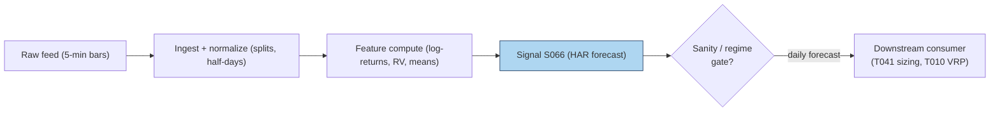

# S066 — HAR realized-volatility forecast

At `4:00` p.m. [example] the desk needs one number for tomorrow: how volatile will SPY be? The HAR answer (Corsi `2009` [documented]) looks at three clocks --- what volatility did *today* (day-traders), averaged *this week* (weekly rebalancers), and averaged *this month* (pension funds) --- and adds them with weights: tomorrow's forecast. The deep idea, Corsi's Heterogeneous Market Hypothesis, is that volatility at each horizon is driven by the horizons above it; a restricted AR on daily/weekly/monthly components reproduces volatility's long memory without fractional-integration machinery. Why does it beat GARCH? GARCH sees only daily returns and must infer volatility from squared daily surprises --- a noisy signal. HAR feeds on *realized* volatility measured from dozens of intraday returns: a far sharper lens. HAR is not cleverer; it is allowed better data. It is a forecast, not a trade: the edge becomes money only through a consumer (vol targeting, VRP harvesting, execution scheduling). Provenance **[D]**.

> Tag law: every numeric literal in prose carries one of `[documented]
> [default] [example] [unverified] [internal-est] [measured]` (legend: Appendix
> i v1.0.0). Constants inside cited formulas inherit the formula's tag.
> Bibliographic years, volumes, pages, arXiv IDs, section numbers, rule codes
> (C1–C10), fail-safe codes (F1–F5), module IDs, and machine-parsed §0 data
> fields are identifiers, not literals, and are exempt.

## §1 Five-minute reviewer card

| Row | Value |
|---|---|
| Module | S066 — HAR realized-volatility forecast, v1.1.0 |
| Edge verdict | `PREDICTIVE-FEATURE-ONLY` — documented forecast superiority over GARCH; edge becomes money only through a consumer |
| After-cost | `BEFORE-COST (forecast loss, not a return)` — HAR has the strongest statistical evidence in this batch --- it beats GARCH on out-of-sample vol-forecast loss across markets. As a forecasting edge it is real; as a trading edge it is unproven until a costed consumer exists. |
| Build cost | Tier M · `20`–`60` h [internal-est] · `$3,000`–`$9,000` loaded [internal-est] |
| Data cost | Research: delayed 15-min tiers from `~$29`/mo [unverified]; production: SIP-grade Databento US Equities Standard `$199`/mo [documented] --- indicative bands, verify before budgeting |
| latency_class | daily; forecast at close for t+1, earliest fill next open |
| risk_class | low (emits forecast; no positions) |
| Capacity | `$10`–`100`M/day notional [example] --- capacity sits with the consumer |
| Executability | Feasible: OLS on three features; Tier M analytics. |
| Risk summary | Structural breaks invalidate betas; jump days contaminate the monthly mean (use HAR-J); raw-RV OLS can print negative forecasts |
| When it dies | Regime breaks; jump-dominated days; microstructure-noise-contaminated RV; horizons far from (`1`,`5`,`22`) [documented] |
| Regime gates | Provisional — machine records below (restrictive default); see also §S10 |
| Emits | `signal_vector` (Appendix b v1.0.0) — never orders |

**Regime gates — machine records** (provisional; all records restrictive by default):

```yaml
regime_gates:
  - {regime_id: R001, direction: degrades,
     mechanism: "structural break in vol dynamics invalidates OLS betas",
     condition: "break p-value < 0.05 [example] on trailing 60d [example] window",
     action: pause_entry, min_lag: "1d [example]", unknown_behavior: halve}
  - {regime_id: R001, direction: degrades,
     mechanism: "jump-dominated days contaminate the monthly mean",
     condition: "S064 jump flag set on the daily bar [example]",
     action: halve, min_lag: "1d [example]", unknown_behavior: halve}
  - {regime_id: HALT, direction: degrades,  # provisional id pending R-pass
     mechanism: "halted symbol contributes zero/missing intraday bins",
     condition: "market state == HALTED",
     action: veto, min_lag: "0", unknown_behavior: veto}
```

## §1.5 Cheapest / least-build path

1. **Prototype hour band:** `20`–`60` h [internal-est] — RV construction (sampling/overnight choices), OLS harness, rolling validation, monitoring.
2. **Cheapest-source row:** min_tier = Delayed 5-min bars --- cheapest data source candidate [unverified]; latency_class = daily, point-in-time adjusted;
   required_fields = 5-min bars (`78`/day [example]), ≥`250` days history [documented]; price_band = delayed 15-min tiers from `~$29`/mo [unverified] (indicative --- verify before budgeting); build_or_buy = **build the model, buy the bars --- HAR is four coefficients; RV construction and the consumer are the strategy**.
3. **Resource budget:** `1` core, `<1` GB RAM [internal-est]; compute pattern `per_bar`.
4. **Skip list:** HAR-J/HAR-CJ jump extensions; log-HAR variants; ML hybrids.
5. **DO-NOT-CUT list:** causality assertions (`assert fill_event >
   signal_event`, no-signal-bar-fills test); COST block + callable
   `expected_cost_bps`; F1–F5 fail-safes + module-state enum; decision-log
   audit records; bona-fide-intent + self-trade prevention; provenance tags on
   every numeric literal; fixtures + `test_cmd`; secrets via env only.
6. **Escalation gate** (upgrade from the cheapest path when any fires): universe >`500` symbols [default] → move to rolling refits + distributed RV panel; entitlement-class change (delayed → SIP real-time) → re-pin §S6 price band and cost model; a live consumer enters scope → cost-gate `k` calibration (§S0.2a) becomes mandatory; RV noise detected at `5`-min (signature plot rising at fine grids) → realized kernels, not `1`-min resampling.

## §S0 Module contract

### S0.1 Typed signature

```python
def signal(state: ModuleState, events: list[Event], cfg: Config) -> SignalVector:
```

`SignalVector` per Appendix b v1.0.0. `state` is the module-owned named state
vector (`rv_history`, `beta`, `forecast`, `module_state`); `events` are canonical Events
(Appendix a v1.0.0), newest last. The function handles documented edge cases:
empty history → `UNKNOWN`; negative/non-finite RV → `UNKNOWN` (F1/F2, never interpolate); <`5` [example] days → `UNKNOWN` (F5: weekly mean undefined); halt/auction → freeze per the market-state table.

### S0.2 Config dataclass

| Parameter | Type | Default | Range | Status |
|---|---|---|---|---|
| `beta0` | float | `5e-05` | `—` | example |
| `beta_d` | float | `0.4` | `0.2–0.5` | example |
| `beta_w` | float | `0.35` | `0.2–0.45` | example |
| `beta_m` | float | `0.2` | `0.1–0.3` | example |
| `cost_gate_k` | float | `0.5` | `0.1–2.0` | default |
| `edge_bps` | float | `50.0` | `—` | example |
| `confidence_scale` | float | `0.001` | `—` | example |
| `clip_floor` | float | `1e-8` | `—` | example |
| `W` | int | `1000` | `250–5000` | example |
| `M` | int | `78` | `1–390` | example |
| `min_days` | int | `5` | `—` | example |
| `monthly_window` | int | `22` | `—` | example |

All defaults tagged per the tag law. `W` = OLS estimation window in days;
`M` = intraday bins per day; `monthly_window` = normative monthly horizon
(Corsi 2009 [documented]); `min_days` = minimum history for the weekly mean;
`edge_bps` = reference edge level for the cost gate; `confidence_scale` maps
forecast units to confidence; `clip_floor` = positivity floor.

### S0.2a Calibration recipes (grid + OOS selection, per parameter)

Betas `beta0..beta_m` are OLS-estimated per estimation window (Corsi 2009
[documented]); grids below are over the hyperparameters that change the
estimator, not over the betas themselves. OOS = expanding-window
walk-forward; forecast loss = QLIKE (the OOS loss function used for HAR-vs-GARCH
comparisons in arXiv 2503.00851 [documented]); comparison via Diebold–Mariano
or Model Confidence Set where claimed [example]. Minimum OOS evaluation span:
`250` days [default]; never re-select on the same OOS segment twice.

| Parameter | Grid / estimator | OOS selection recipe | Refit cadence |
|---|---|---|---|
| `beta0`, `beta_d`, `beta_w`, `beta_m` | OLS per `W` ∈ {`250`, `500`, `1000`} [default] | pick `W` with min mean OOS QLIKE [default]; runner-up must fail DM significance at `5`% [example] | daily on close, or weekly if compute-bound [default] |
| horizons `(5, 22)` | {(`5`,`22`) [documented], (`10`,`44`), (`22`,`66`)} [default] | OOS QLIKE min [default]; (`5`,`22`) is the default prior --- an alternative must win by a DM-significant margin [example] | on structural-break trigger only [default] |
| `M` (sampling) | {`1`-min, `5`-min, `15`-min} [default] | volatility signature plot: coarsest grid whose RV stabilizes [example]; `5`-min is the standard default [example] | once at onboarding; re-check on universe change [default] |
| RV definition (open-to-close vs close-to-close) | 2 choices [default] | pick once, document per C11; changing the choice forces full recompute [default] | never (definition, not a knob) [default] |
| log vs raw HAR | {raw, log} [default] | OOS QLIKE min [default]; log-HAR is the literature baseline variant [example] | on structural-break trigger only [default] |
| `cost_gate_k` | {`0.1`, `0.5`, `1.0`, `2.0`} [default] | default `0.5` [default]; tune against the live consumer's net-of-cost P&L only after the consumer exists [internal-est] | with consumer onboarding [default] |
| `edge_bps`, `confidence_scale`, `clip_floor`, `min_days` | fixed [example] | no calibration --- display/mapping constants [example] | never [default] |

### S0.3 Canonical schema mapping

**Fixture tape** → canonical Event schema (Appendix a v1.0.0), stated once here:

| Vendor | Canonical |
|---|---|
| ``day` (tape)` | ``bar_id` (int)` |
| ``event_ts` (tape)` | ``event_ts` (int64 ns UTC)` |
| ``asof_ts` (tape)` | ``asof_ts` (int64 ns UTC)` |
| ``rv` (tape)` | ``rv` (float, daily realized variance)` |

**Raw bars** (production ingest) → canonical Event schema; logical field names, mapped per vendor:

| Logical field | Polygon Stocks v3 (aggregates) | Databento US Equities NBBO (OHLCV) | Canonical |
|---|---|---|---|
| bar timestamp | aggregate window start | bar timestamp | ``event_ts` (int64 ns UTC)` |
| open / high / low / close | per-bar OHLC | per-bar OHLC | price fields (float) |
| volume | per-bar share volume | per-bar share volume | volume (int) |
| split/dividend adjustment flag | adjusted=true aggregates | corporate-actions file | adjustment metadata |

Split-adjustment is applied at ingest (C11 documents the choice); unadjusted
bars are a definition error, not a calibration knob.

### S0.4 Time contract

> Time contract: clock domain UTC, int64 ns; authoritative causality clock =
> `event_ts`; max_skew = `1` ms [default]; jitter budget = `500` µs [default]
> bar-label = open time; staleness TTL = `3` s [default]; gap policy = mask, no interpolation; halt/auction
> → discard contributions across reopen.

**Timing box:** `signal@t (per_bar, America/New_York) → earliest fill @open(t+1)`

### S0.5 Market-state table

| State | Module behavior |
|---|---|
| CONTINUOUS_TRADING | Compute normally; emit per cadence |
| HALTED | Freeze state; emit `UNKNOWN`; discard contributions across reopen |
| AUCTION | No new signals; hold last `SignalVector`; state `DEGRADED` |
| CLOSED | Emit nothing; state `OFF` |

### S0.6 Module-state enum + error taxonomy

States per Appendix k v1.0.0: `OK | DEGRADED | UNKNOWN | OFF`. Invalid input →
`UNKNOWN`, never interpolate (Appendix f v1.0.0, F1–F5).

| Failure | State | Alert |
|---|---|---|
| Missing/stale input (TTL `3` s [default]) | `UNKNOWN` | page |
| Inputs out of mathematical bounds (F2) | `UNKNOWN` | page |
| `seq` gap > `1,000` events [default] | `DEGRADED` (restart windows) | log |
| Feed jitter > budget persistently | `DEGRADED` | notify |
| Halt/auction | `UNKNOWN` / `DEGRADED` (per table) | log |
| Kill/administrative disable | `OFF` | page |
| Anything unmapped | `UNKNOWN` | page |

### S0.7 Ops tail

- **Schedule:** daily after close, US equities regular session `09:30`–`16:00` America/New_York [documented]; owner: vol-analytics on-call.
- **Health checks:** fixture replay (`test_cmd`) green on deploy; live
  `seq`-gap monitor; staleness watchdog at `3`× cadence.
- **Alert table:** page on `UNKNOWN` > `30` s [default] or bounds violation;
  notify on `DEGRADED`; log on single dropped events.
- **Resource budget:** `1` core, `<1` GB RAM [internal-est]; state is O(window) per symbol.
- **Runbook stub:** `1.` confirm feed (vendor status); `2.` replay fixture;
  `3.` if red → set `OFF`, page; `4.` reconcile decision log before re-arm.

### S0.8 Secrets (env-only)

`POLYGON_API_KEY` via environment only. No secrets in
this file, fixtures, or logs (CI secrets-grep).

### S0.9 May / must-NOT

> **May:** emit `SignalVector` records per Appendix b v1.0.0. **Must-NOT:**
> emit orders, order intents, prices, share counts, or notionals; call a
> broker; mutate shared state outside `state`; interpolate across gaps.

## §S1 Legacy (subsumed by §1)

Legacy §S1 content is the §1 reviewer card above; this header is retained so
section numbering stays frozen.

## §S2 Specification

### Universe

Liquid equities/ETFs/futures with `78` [example] 5-min bars per day; ≥`250` days history [documented].

### Entry rule (Boolean — no prose-only conditions)

```
EMIT_FORECAST := (len(rv) >= 5) AND (all rv >= 0, finite) AND (expected_cost_bps(...) <= cost_gate_k * edge_bps)   # emits forecast; direction 0, never a directional position
FLAT            := otherwise → UNKNOWN on invalid input

`f = β0 + β_d·RV_t + β_w·RV̄^(5)_t + β_m·RV̄^(22)_t`; positivity clip `max(f, clip_floor)` with `clip_floor = 1e-8` [example]; `edge_bps = 50.0` [example] reference level for the cost gate; `confidence = min(1, f / confidence_scale)` with `confidence_scale = 0.001` [example].
```

### Exits (with post-exit cooldown)

```
Continuous forecast --- no exits; the module owns no positions.
ON_STATE: module_state != OK → emit `DEGRADED` with last valid forecast; `60` s [default] cooldown after any compliance block (C10).
```

### Position sizing (fenced function)

```python
def size_shares(risk_budget_R, stop_distance, vol_estimate, ADV_cap, cost):
    # S-module requests capital fraction only; share math lives in the strategy.
    # Reference: capital = 0.5 * confidence  (confidence in [0,1])  [default]
    risk_notional = risk_budget_R * 0.5 * confidence          # [default] 0.5 factor
    shares = risk_notional / max(stop_distance, 1e-9)
    return int(min(shares, ADV_cap * adv_shares * 0.001))     # 0.1% ADV cap [default]
```

### Risk limits

| Limit | Value |
|---|---|
| Max capital fraction per signal | `0.0` [default] --- emits no positions |
| Positivity | clip forecasts at `1e-8` [example] (or log-HAR) |
| Estimation window | ≥`250` days [documented]; `1,000`+ preferred [documented] |

### COST block (single source of truth)

| Component | Value (bps) | Basis |
|---|---|---|
| Spread (downstream strategy reference leg) | `0.50` | [example] — reference stack |
| Fees (taker) | `0.30` | [example] — reference stack |
| Borrow (bps/day) | `0.00` | [default] — reason: forecast-only module; S066 emits no positions, so no borrow accrues |
| Impact (downstream reference) | `0.50` | [example] — reference stack |
| **Total reference** | `1.30` | [example] |

`fee_schedule_as_of`: `2026-09-01 [unverified]` — placeholder; pin the real
venue schedule before production. `side: taker` [default]; venue/tier/source:
XNAS [example]. Re-stating cost numbers outside this block is a validation failure.

```python
def expected_cost_bps(notional, adv_pct, venue, side, urgency) -> float:
    """Callable cost model — reference stack for S066."""
    spread_bps = 0.50
    fee_bps = 0.30
    borrow_bps_per_day = 0.00   # reason: forecast-only module [default]
    impact_bps = 0.50
    return spread_bps + fee_bps + borrow_bps_per_day + impact_bps
```

### Execution / fill model table

| Aspect | Assumption |
|---|---|
| Latency | Forecast computed at close for t+1; consumer intent at open [example] |
| Partial fills | n/a --- no positions emitted |
| Impact | `0.50` bps reference [example] |
| Adverse fill | n/a --- forecast feeds a downstream reference |

### Robustness

The model is OLS on three features --- the failure surface is all in RV construction: sampling (too fine = microstructure noise; `5`-min [example] / `78` [example] bars per session is standard), overnight treatment (open-to-close vs close-to-close changes RV by the overnight share), and half-days (fewer bins --- rescale or exclude). Raw-RV HAR can print negative variance: clip at a small positive floor or use log-HAR (the recent literature's baseline). Jump-dominated days poison the monthly mean: use HAR-J with bipower variation (Andersen et al. `2007` [documented]; Corsi & Renò `2009` [documented]). Re-estimate on rolling windows: a silent structural break makes every forecast confidently wrong.

### Compliance sub-block (C1–C10+)

| Code | Rule: trigger → check → action → log |
|---|---|
| C1 | Self-match prevention: signal module emits no orders; downstream T-modules must set self-trade-prevention flags — S066 asserts the requirement in its `consumes` contract |
| C2 | Bona-fide intent: every emitted `SignalVector` with |direction|=`1` must pass the cost gate; sub-threshold readings emit direction `0`, never a tradeable hint |
| C3 | Message-rate: `≤100` emissions/symbol/s [default]; breach → throttle to `1`/s [default] + alert |
| C4 | Fat-finger trio (applied by consumers; S066 bounds its own outputs): confidence ∈ [`0`,`1`], capital ∈ [`0`,`0.5`], computed_at sane — out-of-bounds → `UNKNOWN` (F2) |
| C5 | Decision log: every emission, veto, and state transition logged per Appendix g v1.0.0, hash-chained |
| C6 | Halt/auction: per §S0.5 market-state table; contributions across reopen discarded |
| C7 | Locate check: SHORT direction requires `locate_ok` from the consumer; S066 never emits SHORT without the consumer asserting locate (Reg-SHO threshold securities → direction `0`) |
| C8 | Public dissemination: no signal values published externally without review gate |
| C9 | Data entitlements: per §S6 Data rights row; entitlement-class change → §1.5 escalation gate |
| C10 | Post-exit cooldown: `60 s` [default] after any exit or compliance block; no re-entry |
| C11 | RV construction vintage: sampling, overnight treatment, and half-day choices are documented and versioned. --- trigger → check → action → log: prevents definition drift in the forecast |
| C12 | Forecast-only module: emits no orders; downstream consumers own order compliance. --- trigger → check → action → log: keeps the forecast/strategy boundary clean |

### Parameter table

| Parameter | Symbol | Value | Tag | Sensitivity |
|---|---|---|---|---|
| Intercept | `beta0` | `5e-5` | [example] | medium |
| Daily weight | `beta_d` | `0.40` | [example] | high |
| Weekly weight | `beta_w` | `0.35` | [example] | high |
| Monthly weight | `beta_m` | `0.20` | [example] | medium |
| Estimation window (days) | `W` | `1000` | [example] | high |
| Intraday bins per day | `M` | `78` | [example] | medium |
| Cost-gate k | `cost_gate_k` | `0.5` | [default] | low |
| Cost-gate reference edge (bps) | `edge_bps` | `50.0` | [example] | low |
| Confidence scale | `confidence_scale` | `0.001` | [example] | low |
| Positivity clip floor | `clip_floor` | `1e-8` | [example] | low |
| Minimum history (days) | `min_days` | `5` | [example] | medium |
| Normative monthly window | `monthly_window` | `22` | [example] | medium — normative value is `22` [documented] |

### Timing box

`signal@t (per_bar, America/New_York) → earliest fill @open(t+1)`

## §S3 Math + normative pseudocode

Markets are a cascade of agents with different horizons; tomorrow's vol is a weighted sum of today's, this week's, and this month's realized variance.

$$r_{t,j} = \ln P_{t,j} - \ln P_{t,j-1}, \qquad RV_{t} = \sum_{j=1}^{M} r_{t,j}^{2} \quad\text{[documented --- Corsi 2009]}$$

$$RV_{t+1} = \beta_{0} + \beta_{d}\,RV_{t} + \beta_{w}\,\overline{RV}_{t}^{(5)} + \beta_{m}\,\overline{RV}_{t}^{(22)} + \varepsilon_{t+1} \quad\text{[documented]}$$

$$\overline{RV}_{t}^{(h)} = \frac{1}{h}\sum_{j=1}^{h} RV_{t-j+1}, \qquad h \in \{5, 22\} \quad\text{[documented]}$$

Clip: $\hat{RV} = \max(f, 10^{-8})$ [example]; log-HAR variant uses $\log RV$ throughout.

**Normative pseudocode** (pseudocode is normative; prose is commentary):

```
function signal(state, bars, cfg) -> SignalVector:
    assert bars non-empty else return UNKNOWN
    b = bars[-1]
    vals = [r.rv for r in bars]
    if any(v < 0 or not finite(v)) or len(vals) < cfg.min_days: return UNKNOWN   # min_days = 5 [example]
    d = vals[-1]                                   # daily [documented]
    w = sum(vals[-5:]) / 5                         # weekly [documented]
    if len(vals) >= cfg.monthly_window:            # normative monthly [documented]
        m = sum(vals[-cfg.monthly_window:]) / cfg.monthly_window
    else:
        m = sum(vals) / len(vals)                  # warm-up / fixture-window mean [example] ---
                                                   # the 12-day fixture uses this branch (validation-run)
    f = cfg.beta0 + cfg.beta_d * d + cfg.beta_w * w + cfg.beta_m * m   # [example] betas
    f = max(f, cfg.clip_floor)                     # positivity clip, clip_floor = 1e-8 [example]
    confidence = min(1.0, f / cfg.confidence_scale) if f > 0 else 0.0  # scale 0.001 [example]
    gate = expected_cost_bps(1.0, 0.001, "XNAS", "taker", "normal") <= cfg.cost_gate_k * cfg.edge_bps
    # executable cost-gate predicate:  expected_cost_bps(...) <= k * edge_bps, k = 0.5 [default], edge_bps = 50.0 [example]
    st = "OK" if gate else "DEGRADED"
    # causality invariant (machine assertion): any downstream fill must satisfy
    #   fill_event_ts > computed_at   --- enforced by the no-signal-bar-fills unit test
    return SignalVector("TEST", 0, confidence, 0.0, b.event_ts, b.asof_ts - b.event_ts, st)
```

Causality: The forecast for day $t+1$ uses only RV through day $t$; it is tradable no earlier than $t+1$'s open. RV bars must be point-in-time (no revised corrections). Mandatory unit test: no-signal-bar fills.

## §S4 Worked example (fixture-backed)

- Tape: `modules/fixtures/S066_tape.csv` — `# TYPE: validation-run`;
  `12` rows (`12`-day [example] synthetic daily-RV tape (seed `66`)), all numbers synthetic,
  seed `66` [example]; `event_ts`/`asof_ts` int64 ns UTC. Fixture-window
  exception: the tape carries only `12` days, so its `RV_m` column is the
  full-history mean, not the normative `22`-day mean; the normative path is
  pinned by an inline synthetic `27`-day test (see test `5`).
- Expected outputs: `modules/fixtures/S066_expected.csv` — per-day `rv_d`, `rv_w`, `rv_m`, `har`.
- Tolerance: `1e-9 [default]` on floats; integers exact.
- Hand-checks: ['day-`4` har `0.0001969000` [measured]', 'HAR formula with β=(`0.000050`,`0.40`,`0.35`,`0.20`) [example] reproduces all rows [measured]', 'operator-corrected 22-day example: forecast `0.000471550`, σ̂≈`2.1716`%/day, annualized `34.47`% [example]'].
- Acceptance tests (`modules/tests/test_S066.py`, `8` tests):
  `1.` fixture recomputes to expected (day-`4` HAR hand-check `0.0001969000`)
  `2.` stub emits valid `SignalVector` (direction `0`, confidence ∈ [0,1])
  `3.` no-signal-bar fills (`fill_event_ts > computed_at`)
  `4.` cost-gate predicate passes on large edge, blocks on tiny edge
  `5.` normative monthly mean: `27`-day synthetic tape pins the `22`-day window (not full-history)
  `6.` positivity clip: forced-negative forecast clips at `clip_floor`
  `7.` cost gate states: `OK` with default `k`, `DEGRADED` with near-zero `k`
  `8.` invalid input (negative, NaN/±inf, empty, <`5` days) → `UNKNOWN`
- `test_cmd`: `python3 -m pytest modules/tests/test_S066.py -q` → exits `0`.

**Where the example is optimistic:** `12` synthetic days [example], example betas --- demonstrates the three-clock arithmetic, not an estimated model.

## §S5 Strategies that use this signal

| Strategy | Role |
|---|---|
| T041 — HAR Vol-Timing Overlay | Primary sizing input: scales intraday positions by the HAR forecast (with S067, S076) |
| T010 — Variance-Risk-Premium Harvester | Forecast comparator: harvests implied-vs-HAR variance gaps (with S069, S063) |

## §S6 Data required

Concrete vendor/product/schema per field (datasets pinned in §0; rights:
`licensed`):

| Field | Vendor / product | Schema | Required fields | Price band | Notes |
|---|---|---|---|---|---|
| Intraday bars | Polygon — Stocks v3, or Databento — US Equities NBBO | `schema_version "1"` (§0 datasets) | per-`5`-min bar: timestamp, OHLC, volume, split-adjustment flag; `78` bars/day [example] | Polygon 15-min-delayed tiers from `~$29`/mo [unverified]; Databento US Equities Standard `$199`/mo [documented] (Databento pricing post, Jan 2025) | `1`-min resampled to `5`-min is standard [example]; pick delayed tier for daily cadence (cheapest path) |
| Corporate actions | Polygon reference data / internal corporate-actions file | vendor schema | symbol, ex-date, adjustment factor | bundled with bar plan [unverified] | overnight jumps contaminate RV; decide open-to-close vs close-to-close once (C11) |
| Session calendar | internal trading calendar | internal `v1` | date, `is_trading_day`, `is_half_day` | `$0` [internal-est] | half-days have fewer bins --- rescale or exclude |
| Estimation history | derived from the rows above | internal `v1` | daily RV series | n/a | ≥`250` days [documented], `1,000`+ preferred [documented], before first forecast |

**Data rights row** (Appendix j v1.0.0): Intraday bars via Polygon / Databento, `rights: licensed`; license scope = research + stated production symbol count; raw ticks never leave our systems --- fixtures are synthetic; entitlement-class change → §1.5 escalation gate.

## §S7 Local build (M5 Max / 128 GB)

Feasible. Building `500` [example] RV series from ~`39,000` [example] 5-min bars then OLS on `500`×~`1,000`-row [example] design matrices --- seconds of numpy [internal-est]; the RV panel is ~`4` MB [internal-est]. What breaks first is data licensing (redistributing 5-min history) and regime monitoring --- not CPU or RAM. Stack: **Python+polars+numpy** --- **Tier M, 20–60 h ≈ $3,000–$9,000 loaded** (cost-model §5).

## §S8 Buy vs build

**Build the model, buy the bars.** HAR is four coefficients; what matters is RV construction and the consumer that turns the forecast into size. Buy precomputed series only as a validation benchmark. Indicative bands (as of 2026-09-10): Polygon-style delayed 15-min tiers from `~$29`/mo [unverified]; SIP-grade: Databento US Equities Standard `$199`/mo [documented] (https://databento.com/blog/upcoming-changes-to-pricing-plans-in-january-2025) --- indicative bands, verify before budgeting.

## §S9 Efficacy — documented evidence

| Study / source | Market & period | Metric | Before/after cost | Caveat |
|---|---|---|---|---|
| Corsi (2009) [documented] | S&P `500` futures, Treasuries, FX | "remarkably good forecasting performance"; reproduces long memory, fat tails | `BEFORE-COST` forecast loss | in-sample + OOS |
| arXiv 2503.00851 (2025) [documented] | SSE rolling `600`-day OOS | HAR family much lower MSE/MAE/HMSE/HMAE/QLIKE than GARCH; more MCS passes | `BEFORE-COST` forecast loss | dataset-specific; HAR-PD variants best |
| Louzis et al. (2012) [documented] | S&P `500`, incl. `2007`–`09` | HAR-type-EVT beats GARCH-type-EVT on VaR accuracy and Basel II capital efficiency | `BEFORE-COST` risk metric | economic utility, not trading P&L |
| High-frequency enhanced VaR (2024) [documented] | multi-asset, `1,242` OOS days | HAR-RV fluctuation test beats univariate GARCH; "all GARCH models less accurate than HAR-RV" | `BEFORE-COST` forecast loss | VaR application |

**Honest bottom line.** HAR has the **strongest statistical evidence in this batch** --- it forecasts volatility better than GARCH across markets, periods, and loss functions, all **before-cost**. As a *forecasting* edge it is real; as a *trading* edge it is unproven until a costed consumer exists.

## §S10 Failure modes & pitfalls

| # | Trigger → Detect → Action → Recovery | check: |
|---|---|---|
| 1 | Forecast ≠ trade → better QLIKE earns nothing → detect: no consumer attached → action: attach to sizing/hedging (T041/T010) → recovery: evaluate the strategy net of costs | `consumer required [example rule]` |
| 2 | Microstructure noise → `1`-min [example] RV noise-dominated → detect: RV explodes at fine sampling → action: `5`-min [example] sampling or realized kernels → recovery: resample | ``78` [example] 5-min bins` |
| 3 | Overnight treatment → open-to-close vs close-to-close changes RV → detect: RV jump at choice change → action: pick one, document it → recovery: recompute | `documented choice [example rule]` |
| 4 | Negative forecasts → raw-RV OLS prints negative variance → detect: f < 0 → action: positivity clip or log-HAR → recovery: clip at `1e-8` [example] | `clip `1e-8` [example]` |
| 5 | Structural breaks → old betas confidently wrong → detect: break statistic → action: rolling windows, break monitoring → recovery: re-estimate | ``1,000`-day [example] rolling window` |
| 6 | Jump contamination → one flash-crash day dominates the monthly mean → detect: S064 jump flag → action: HAR-J with bipower variation → recovery: exclude the bar | `S064 gate` |

## §S11 Visuals




## §S12 Source log + unverified leads

**Sources** (citable facts only):

['1. Corsi, F. (2009) [documented]. "A Simple Approximate Long-Memory Model of Realized Volatility." *Journal of Financial Econometrics*, 7(2), 174–196. http://ideas.repec.org/a/oup/jfinec/v7y2009i2p174-196.html --- HAR: tomorrow\'s RV from daily/weekly/monthly components; "remarkably good forecasting performance".', '2. "Forecasting realized volatility in the stock market: a path-dependent perspective" (2025) [documented]. arXiv. https://arxiv.org/pdf/2503.00851 --- HAR family much lower MSE/MAE/HMSE/HMAE/QLIKE than GARCH family OOS; more MCS passes.', '3. Louzis, D. P., Xanthopoulos-Sissinis, S., & Refenes, A. P. (2012) [documented]. "Stock index Value-at-Risk forecasting: A realized volatility extreme value theory approach." *Economics Bulletin*, 32(1), 981–991. http://ideas.repec.org/a/ebl/ecbull/eb-11-00870.html --- HAR-type-EVT beats GARCH-type-EVT on VaR accuracy and Basel II capital efficiency.', '4. "High-frequency enhanced VaR: A robust univariate realized volatility model" (2024) [documented]. PMC. http://pmc.ncbi.nlm.nih.gov/articles/PMC11111067/ --- HAR-RV vs GARCH fluctuation tests: "all GARCH models less accurate than HAR-RV".',
'5. Databento pricing post (Jan 2025) [documented]. https://databento.com/blog/upcoming-changes-to-pricing-plans-in-january-2025 --- US Equities Standard plan `$199`/month, all plans include live data, pay-as-you-go historical retained. Cited only for the §S6/§S8 price band.']

**Chatbot source log.** Duck.ai (GPT-5.6 Luna, anonymous, web-search assisted, 2026-09-10) answered Q-SB2-1–Q-SB2-3. Grok/Cursor answers pending (checked 2026-09-10). Chatbot output is leads, never facts.

**Unverified leads** (chatbot-only — never in evidence tables):

['- guna-1610 practitioner replication [unverified]: S&P `500` `2011`–`2026` [unverified], `2,769` [unverified] OOS days, HAR-RV QLIKE `0.3824` [unverified] vs GARCH(1,1) `0.4237` [unverified], DM significant [unverified] --- practitioner, real data + proper tests, but unverified here; quarantined.', '- Intraday HAR-D variant (arXiv 2202.08962) [SR]: rebuilds RV over intraday bins with session/week lags --- cited in the chapter but not checked; quarantined here.', '- Duck.ai Q-SB2-2 pipeline lead: `500` [unverified] rolling HAR fits in `5`–`30` s [unverified]; full SB2 daily refresh `15`–`60` s in Polars [unverified] --- labeled chatbot claims, not measured here.', '- HAR worked-example lead: the raw chatbot output contained a `22`-day-sum error (`0.014821` [unverified] vs correct `0.013431` [example]); all downstream values used in §S4 are the operator-verified corrections.']

---

## Appendix — AI build prompt (S066)

Copy-paste into any chat agent:

> Build module **S066 — HAR realized-volatility forecast** per
> `notes/module-template.md` v1.0.0 and this file's §S0 contract.
> Cheapest path (§1.5): prototype `20`–`60` h [internal-est]; cheapest data
> candidate Delayed 5-min bars --- cheapest data source candidate [unverified]; compute pattern
> `per_bar`; skip jump extensions, log-HAR, ML hybrids for now.
> Implement `signal(state, events, cfg) -> SignalVector` (Appendix b v1.0.0)
> with the §S3 normative pseudocode, including the cost-gate predicate
> `expected_cost_bps(...) <= k * edge_bps` and `assert fill_event >
> signal_event`. Wire F1–F5 (Appendix f v1.0.0): invalid input → `UNKNOWN`,
> never interpolate. Log decisions per Appendix g v1.0.0. Secrets via env
> only. Run the fixture `modules/fixtures/S066_tape.csv`
> (`# TYPE: validation-run`) against `modules/fixtures/S066_expected.csv`
> (tolerance `1e-9 [default]`).
> **Definition of done:** `python3 -m pytest modules/tests/test_S066.py -q`
> exits `0`. Tag every numeric literal you add with the unified enum
> (Appendix i v1.0.0); put anything unverifiable in §S12 unverified leads.
