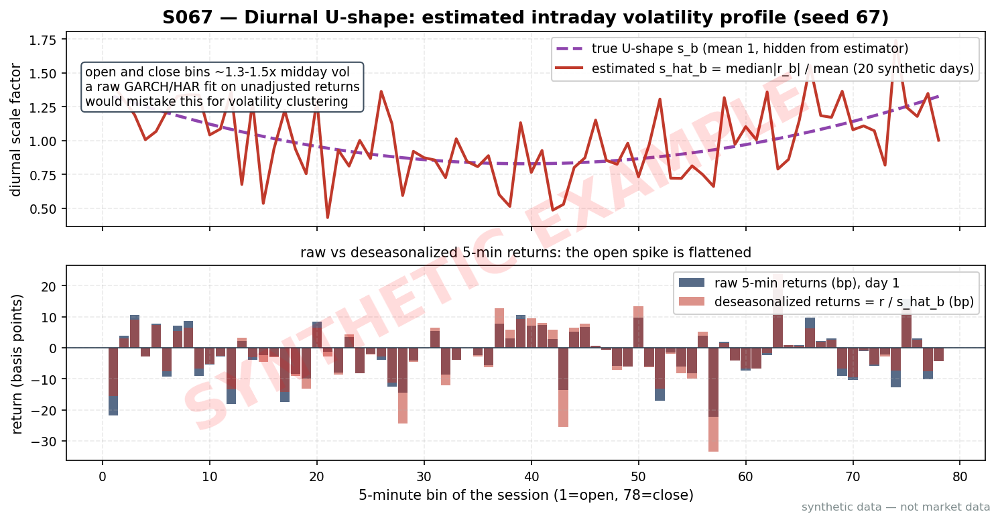
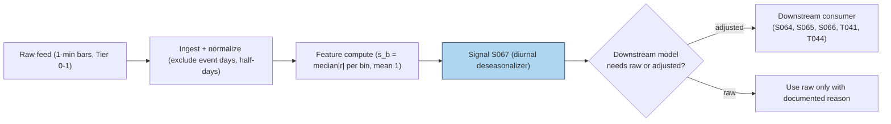

# S067 — Intraday vol seasonality / diurnal deseasonalization

At `9:35` a.m. [example] the tape is twice as jumpy as at `12:35` p.m. [example] --- not because the market knows more, but because it is 9:35. The diurnal U-shape (high at the open, low midday, high at the close) is the market's daily routine: overnight news gets priced in at the open, benchmarked funds and MOC flows rush at the close. S067 is not a trade; it is a ruler. It estimates one scale factor `s_b` per time-of-day bin (median |return| per bin, normalized to mean `1` [example]) and divides returns by it, so a downstream GARCH (S065), HAR (S066) or jump test (S064) sees the *stochastic* volatility instead of the clock. A U fitted without deseasonalization mistakes 9:30 for clustering. The shape is not universal: FX follows geographic sessions and China's T+1 market is not U-shaped at all (documented) --- estimate per market, never import. Provenance **[D]**.

> Tag law: every numeric literal in prose carries one of `[documented]
> [default] [example] [unverified] [internal-est] [measured]` (legend: Appendix
> i v1.0.0). Constants inside cited formulas inherit the formula's tag.
> Bibliographic years, volumes, pages, arXiv IDs, section numbers, rule codes
> (C1–C10), fail-safe codes (F1–F5), module IDs, and machine-parsed §0 data
> fields are identifiers, not literals, and are exempt.

## §1 Five-minute reviewer card

| Row | Value |
|---|---|
| Module | S067 — Intraday vol seasonality / diurnal deseasonalization, v1.1.0 |
| Edge verdict | `PREDICTIVE-FEATURE-ONLY` — preprocessing infrastructure; no standalone trading edge, conditions every intraday vol model |
| After-cost | `BEFORE-COST (misspecification removed, not a return)` — documented value is in eliminating intraday-periodicity distortion (Andersen & Bollerslev `1997` [documented]); skip it and your GARCH persistence, jump flags, and HAR forecasts all measure the clock |
| Build cost | Tier L/M boundary · `4`–`20` h [internal-est] · `$600`–`$3,000` loaded [internal-est] |
| Data cost | Research `$0`/mo [documented] (Polygon/Massive free tier: 15-min-delayed 1-min aggregates EOD, `~2` y history [documented], 5 req/min [documented]) – `$29`/mo [documented] (Starter, unlimited calls); production `$99`–`199`/mo [documented] if real-time needed. Bands as-of `2026-09-10` [documented] — verify before budgeting |
| latency_class | per_bin; adjusted return available at bar close |
| risk_class | low (emits normalizer output; no positions) |
| Capacity | n/a --- capacity sits with the consumer |
| Executability | Feasible: a groupby-median per time-of-day bin; Tier L/M analytics. |
| Risk summary | Stale shape after structural change *mis*-normalizes; event days inflate the U; importing another market's shape silently breaks downstream models |
| When it dies | Treated as a trading signal (it is clock, not information); tick-size/session-hour changes; half-days estimated with the full-session shape |
| Regime gates | machine records below (`3` [measured] provisional records; regime_ids renamed at the R001–R050 annotation pass) |
| Emits | `signal_vector` (Appendix b v1.0.0) — never orders |

**Regime gates — machine records** (single source of truth; `regime_ids` provisional):

```yaml
regime_gates:
  - regime_id: R_EVENT_DAY            # provisional
    direction: degrades
    mechanism: "FOMC/CPI/earnings bumps inflate the U; event days have their own deterministic profile"
    condition: "day in announcement_calendar"
    action: veto                     # exclude event days from estimation
    min_lag: 0
    unknown_behavior: veto           # calendar unknown -> exclude conservatively
  - regime_id: R_HALF_DAY             # provisional
    direction: degrades
    mechanism: "fewer bins and a different profile than full sessions"
    condition: "session in half_day_calendar"
    action: veto                     # separate half-day shape or exclude
    min_lag: 0
    unknown_behavior: veto
  - regime_id: R_STRUCTURAL_CHANGE    # provisional
    direction: degrades
    mechanism: "tick-size or session-hours change shifts the diurnal profile"
    condition: "sb_drift_pct(current_vintage, prior_vintage) > 10"   # [example]
    action: pause_entry              # downstream consumers: hold last table, flag
    min_lag: 0
    unknown_behavior: degrade        # unknown -> treat shape as unreliable
```

Action enum per proposal: `veto | halve | double | widen_stops | pause_entry`.
Direction enum: `amplifies | degrades | inverts`. Restrictive default applies:
an unmapped regime behaves as `unknown_behavior: degrade`.

## §1.5 Cheapest / least-build path

1. **Prototype hour band:** `4`–`20` h [internal-est] — median-|r| groupby per bin, half-day handling, rolling re-estimation, wiring to one consumer.
2. **Cheapest-source row** (structured):

   | min_tier | latency_class | required_fields | price_band | build_or_buy |
   |---|---|---|---|---|
   | Tier 0 free | per_bin; EOD/delayed bars suffice — daily pre-open batch refit, no real-time feed needed | 1-min or 5-min OHLCV bars, ≥`20` trading days history [example]; split-adjusted [example] | `$0`/mo [documented] — Polygon/Massive free tier: 15-min-delayed 1-min aggregates, `~2` y history, 5 req/min [documented]; bands as-of `2026-09-10` [documented] | **build the estimator, buy the bars only if you need split-clean history — it is a fifteen-line groupby** |

   Caveat: Stooq free 5-min bars (`$0` [documented]) cover only `~15` days [documented] — insufficient for the `20`-day [example] default window; use Stooq hourly (`~7` months [documented]) at a coarser `B`, or the Polygon free tier. Alpaca free IEX bars as a sufficient Tier-0 source is [unverified] — see §S12.
3. **Resource budget:** `1` core, `<1` GB RAM [internal-est]; compute pattern `per_bin` (batch-refit `per_bar` cadence).
4. **Skip list:** Fourier-flexible form; announcement-aware seasonality; multiplicative-component GARCH; multi-market shape library.
5. **DO-NOT-CUT list:** causality assertions (`assert fill_event >
   signal_event`, no-signal-bar-fills test); COST block + callable
   `expected_cost_bps`; F1–F5 fail-safes + module-state enum; decision-log
   audit records; bona-fide-intent + self-trade prevention; provenance tags on
   every numeric literal; fixtures + `test_cmd`; secrets via env only.
6. **Escalation gate:** universe >`500` symbols [default]; or a tick-size / session-hours change that moves the shape --- then move to rolling refits and drift monitoring.

## §S0 Module contract

### S0.1 Typed signature

```python
def signal(state: ModuleState, events: list[Event], cfg: Config) -> SignalVector:
```

`SignalVector` per Appendix b v1.0.0. `state` is the module-owned named state
vector (`s_b` table, `module_state`); `events` are canonical Events
(Appendix a v1.0.0), newest last. The function handles documented edge cases:
empty input → `UNKNOWN`; negative/non-finite |r| → `UNKNOWN` (F1/F2, never
interpolate); <`20` [example] days of history → `UNKNOWN` (F5: medians
undefined); halt/auction → freeze per the market-state table. Direction is
always `0` [default] --- S067 is a normalizer, never a trade trigger.

### S0.2 Config dataclass

| Parameter | Type | Default | Range | Status |
|---|---|---|---|---|
| `window_days` | int | `20` | `10–60` [example] | calibrate |
| `cost_gate_k` | float | `0.5` | `0.1–2.0` [default] | default |
| `edge_bps_ref` | float | `50.0` | `1–200` [example] | example |
| `confidence_scale` | float | `4.0` | `1–10` [example] | example |
| `ttl_ns` | int | `3_000_000_000` (3 s) | `1–30` s [default] | default |
| `cooldown_s` | int | `60` | `30–300` [default] | default |

All defaults tagged per the tag law.

#### Calibration recipe — `window_days` (status: calibrate)

- **Grid:** {`10`, `20`, `30`, `45`, `60`} days [example].
- **Walk-forward design:** refit monthly on a rolling window; `12` monthly folds [example] over the trailing `12` months [example]. Train = `window_days` trading days ending at the fold boundary; **embargo** = `5` trading days [example] between train end and OOS start (announcement/event spillover); OOS horizon = `20` trading days [example].
- **Selection metric (primary):** OOS downstream GARCH(1,1) log-likelihood gain per day, deseasonalized vs raw returns — ΔLL/day [example]; **secondary:** variance of the OOS bin-median |r̃| (flatness of the corrected profile) [example].
- **Freeze rule:** freeze at the argmax; re-open calibration only if OOS ΔLL/day degrades >`10`% [example] relative for `2` consecutive monthly refits [example].
- `cost_gate_k` stays `[default]` pending the module-format open item on the cost-gate `k` default (session 05: `0.5` [default] vs T002-style `2` [example]).

### S0.3 Canonical schema mapping

Vendor columns → canonical Event schema (Appendix a v1.0.0), stated once here:

| Vendor | Canonical |
|---|---|
| `day` (tape) | `bar_id` (int) |
| `bin` (tape) | `bin` (int, time-of-day bin 0..B-1) |
| `event_ts` (tape) | `event_ts` (int64 ns UTC) |
| `asof_ts` (tape) | `asof_ts` (int64 ns UTC) |
| `absr` (tape) | `absr` (float, |5-min log return|, decimal units, float64) |

### S0.4 Time contract

> Time contract: clock domain UTC, int64 ns; authoritative causality clock =
> `event_ts`; max_skew = `1` ms [default]; jitter budget = `500` µs [default]
> bar-label = open time; staleness TTL = `3` s [default]; gap policy = mask, no interpolation; halt/auction
> → discard contributions across reopen.

**Timing box:** `signal@t (per_bar, America/New_York) → earliest fill @open(t+1)`

**Processing model / precision / units:** processing model `per_bar` [default] — one `SignalVector` per bin close; numeric precision float64; units: `|r|` in decimal (log returns, not percent); cost in bps; returns defined as log close-to-close within the bar.

**Domain & session block:** asset class = US equities / ETFs (per-market shape; FX follows geographic sessions and China's T+1 market is not U-shaped — documented non-portability, estimate per market, never import); reference venue = XNAS [example]; sessions = NYSE regular `09:30`–`16:00` America/New_York [documented]; calendar = NYSE holidays, half-days get their own (shorter) shape; settlement = T+1 [documented].

### S0.5 Market-state table

| State | Module behavior |
|---|---|
| CONTINUOUS_TRADING | Compute normally; emit per cadence |
| HALTED | Freeze state; emit `UNKNOWN`; exclude halted bars from medians |
| AUCTION | No new normalization; hold last `SignalVector`; state `DEGRADED` |
| CLOSED | Emit nothing; state `OFF` |

### S0.6 Module-state enum + error taxonomy

States per Appendix k v1.0.0: `OK | DEGRADED | UNKNOWN | OFF`. Invalid input →
`UNKNOWN`, never interpolate (Appendix f v1.0.0, F1–F5).

| Failure | State | Alert |
|---|---|---|
| Missing/stale input (TTL `3` s [default]) | `UNKNOWN` | page |
| Inputs out of mathematical bounds (F2) | `UNKNOWN` | page |
| `seq` gap > `1,000` events [default] | `DEGRADED` (restart windows) | log |
| Feed jitter > budget persistently | `DEGRADED` | notify |
| Halt/auction | `UNKNOWN` / `DEGRADED` (per table) | log |
| Kill/administrative disable | `OFF` | page |
| Anything unmapped | `UNKNOWN` | page |

### S0.7 Ops tail

- **Schedule:** rolling refit before the open daily, US equities regular session `09:30`–`16:00` America/New_York [documented]; owner: vol-analytics on-call.
- **Health checks:** fixture replay (`test_cmd`) green on deploy; live
  `seq`-gap monitor; s_b drift monitor vs prior vintage.
- **Alert table:** page on `UNKNOWN` > `30` s [default] or bounds violation;
  notify on `DEGRADED` or s_b drift beyond `10`% [example]; log on single dropped events.
- **Resource budget:** `1` core, `<1` GB RAM [internal-est]; state is O(B) per symbol.
- **Runbook stub:** `1.` confirm feed (vendor status); `2.` replay fixture;
  `3.` if red → set `OFF`, page; `4.` reconcile decision log before re-arm.

### S0.8 Secrets (env-only)

`POLYGON_API_KEY` via environment only. No secrets in
this file, fixtures, or logs (CI secrets-grep).

### S0.9 May / must-NOT

> **May:** emit `SignalVector` records per Appendix b v1.0.0 (normalization factors, direction `0` [default]). **Must-NOT:**
> emit orders, order intents, prices, share counts, or notionals; call a
> broker; mutate shared state outside `state`; interpolate across gaps; emit a directional trading signal from the season alone; emit a `SignalVector` on invalid or stale input; import another market's diurnal profile.

## §S1 Legacy (subsumed by §1)

Legacy §S1 content is the §1 reviewer card above; this header is retained so
section numbering stays frozen.

## §S2 Specification

### Universe

Liquid equities/ETFs/futures with 5-min bars; ≥`20` trading days history [example].

### Entry rule (Boolean — no prose-only conditions)

```
EMIT_NORMALIZER := (ndays >= cfg.window_days) AND (all absr >= 0 AND finite) AND (feed_latency_ns <= cfg.ttl_ns) AND (market_state == CONTINUOUS_TRADING) AND (expected_cost_bps(notional=0.0, adv_pct=0.0, venue="XNAS", side="taker", urgency="batch") <= cfg.cost_gate_k * cfg.edge_bps_ref)   # direction always 0; the output is the ruler, never a trade
FLAT              := otherwise → UNKNOWN on invalid input (F1/F2/F5); DEGRADED on cost-gate veto or AUCTION

Bound constants: cost_gate_k = 0.5 [default]; edge_bps_ref = 50.0 [example] reference level; confidence_scale = 4.0 [example] seasonality-strength scale; ttl_ns = 3 s [default]; cooldown = 60 s [default]. Locate: n/a by construction — direction is always 0, S067 never emits SHORT; consumers hold locate_ok per C7.
s_b = median_t|r_{t,b}| / mean_b(median_t|r_{t,b}|) [example estimator]; r̃ = |r| / s_b [documented decomposition]; confidence = min(1, |s_b - 1| * 4.0) [example].
```

### Exits (with post-exit cooldown)

```
Continuous normalizer --- no exits; the module owns no positions.
ON_STATE: module_state != OK → emit `DEGRADED` with last valid s_b; `60` s [default] cooldown after any compliance block (C10).
```

### Position sizing (fenced function)

```python
def size_shares(risk_budget_R, stop_distance, vol_estimate, ADV_cap, cost):
    # S-module requests capital fraction only; share math lives in the strategy.
    # Normalizer emits no positions: requested capital fraction is 0.0 [default].
    return 0
```

### Risk limits

| Limit | Value |
|---|---|
| Max capital fraction per signal | `0.0` [default] --- emits no positions |
| Estimation window | ≥`20` days [example] default (calibrate per §S0.2 recipe); fixture uses `3` days [example] via the documented `window_days` override |
| Shape vintage | s_b frozen pre-open; rolling window ends at t−1 (no same-day lookahead) |

### COST block (single source of truth)

| Component | Value (bps) | Basis |
|---|---|---|
| Spread (downstream reference) | `0.50` | [example] — reference stack |
| Fees (taker) | `0.30` | [example] — reference stack |
| Borrow | `0.00` | [default] — reason: normalizer-only module |
| Impact (downstream reference) | `0.50` | [example] — reference stack |
| **Total reference** | `1.30` | [example] |

`fee_schedule_as_of`: `2026-09-10` [documented] — Nasdaq Price List verified: fee to remove liquidity `$0.0030`/share for shares executed at or above `$1.00`, all MPIDs [documented]; the `0.30` [example] bps fee line assumes a `$100`/share reference price [example]. Pin the real venue schedule before production.
`borrow_bps_per_day`: `0.00` [default] — reason: normalizer-only module; emits no positions and incurs no financing; downstream borrow is modeled in the consuming T-module's cost block.
`side: taker` [default]; venue/tier/source: XNAS [example]. Re-stating cost numbers outside this block is a validation failure.

```python
def expected_cost_bps(notional, adv_pct, venue, side, urgency) -> float:
    """Callable cost model — reference stack for S067 (normalizer emits no entries).
    Mirrors the §S2 COST block exactly. fee_schedule_as_of 2026-09-10 [documented];
    borrow_bps_per_day 0.00 [default]: normalizer-only module, no financing incurred."""
    spread_bps = 0.50
    fee_bps = 0.30
    borrow_bps = 0.00   # reason: normalizer-only module [default]
    impact_bps = 0.50
    return spread_bps + fee_bps + borrow_bps + impact_bps
```

### Execution / fill model table

| Aspect | Assumption |
|---|---|
| Latency | Adjusted return available at bin close [example] |
| Partial fills | n/a --- no positions emitted |
| Impact | `0.50` bps reference [example] |
| Adverse fill | n/a --- normalization feeds a downstream reference |

### Robustness

The estimator is a groupby-median --- the failure surface is all in what you feed it. Estimate on history strictly before day *t*; production uses the `20`-day [example] default `window_days` (calibrated per the §S0.2 recipe) while the fixture demonstrates the arithmetic on `3` days [example] with a documented `window_days=3` [example] override. Exclude scheduled-event days (FOMC/CPI/earnings) from the estimation --- they have their own deterministic bumps. Handle half-days with their own (shorter) shape, never the full-session profile. Re-estimate after structural changes (tick-size, session hours); a stale `s_b` *mis*-normalizes, which is worse than no normalization. Use median |r|, not mean |r|: jumps corrupt the mean.

### Compliance sub-block (C1–C10+)

| Code | Rule: trigger → check → action → log |
|---|---|
| C1 | Self-match prevention: signal module emits no orders; downstream T-modules must set self-trade-prevention flags — S067 asserts the requirement in its downstream contract |
| C2 | Bona-fide intent: every emitted `SignalVector` carries direction `0` [default]; no tradeable hint may be derived from the season alone |
| C3 | Message-rate: `≤100` emissions/symbol/s [default]; breach → throttle to `1`/s [default] + alert |
| C4 | Fat-finger trio (applied by consumers; S067 bounds its own outputs): confidence ∈ [`0` [default],`1` [default]], capital = `0.0` [default], computed_at sane — out-of-bounds → `UNKNOWN` (F2) |
| C5 | Decision log: every emission, veto, and state transition logged per Appendix g v1.0.0, hash-chained |
| C6 | Halt/auction: per §S0.5 market-state table; halted bars excluded from medians |
| C7 | Locate check: SHORT direction requires `locate_ok` from the consumer; S067 never emits SHORT (direction is always `0` [default]) |
| C8 | Public dissemination: no normalization tables published externally without review gate |
| C9 | Data entitlements: per §S6 Data rights row; entitlement-class change → §1.5 escalation gate |
| C10 | Post-exit cooldown: `60 s` [default] after any exit or compliance block; no re-entry |
| C11 | Shape vintage: s_b estimated on history strictly before *t*, frozen pre-open. --- trigger → check → action → log: prevents lookahead in the normalization table |
| C12 | Per-market shape: never import another market's diurnal profile. --- trigger → check → action → log: prevents silent misspecification downstream |

### Parameter table

| Parameter | Symbol | Value | Tag | Sensitivity |
|---|---|---|---|---|
| Estimation window (days) | `window_days` | `20` | calibrate | high — recipe in §S0.2 |
| Bins per day | `B` | `4` (fixture); `78` standard | [example] | medium |
| Estimator | — | median \|r\| per bin, mean 1 | [example] | medium |
| Cost-gate k | `cost_gate_k` | `0.5` | [default] | low |
| Reference edge | `edge_bps_ref` | `50.0` | [example] | low |
| Seasonality-strength scale | `confidence_scale` | `4.0` | [example] | low |
| Staleness TTL | `ttl_ns` | `3` s | [default] | medium |
| Post-block cooldown | `cooldown_s` | `60` s | [default] | low |

### Timing box

`signal@t (per_bar, America/New_York) → earliest fill @open(t+1)`

## §S3 Math + normative pseudocode

The Andersen–Bollerslev (1997) multiplicative decomposition [documented]:

$$s_b = \frac{\mathrm{median}_t\,|r_{t,b}|}{\frac{1}{B}\sum_{b=1}^{B}\mathrm{median}_t\,|r_{t,b}|} \quad\text{[example estimator --- see note]}, \qquad \tilde{r}_{t,b} = \frac{r_{t,b}}{s_b} \quad\text{[documented]}$$

$$R_{t,n} = E(R_{t,n})/\sqrt{N} + \sigma_t \cdot s_{t,n} \cdot Z_{t,n} \quad\text{[documented --- Andersen & Bollerslev 1997]}$$

**Estimator note.** `s_b = median|r|/mean(medians)` [example] is this module's
robust *operationalization* of the documented Andersen–Bollerslev (1997)
multiplicative decomposition. The original paper estimated the periodic
component `s_{t,n}` with a Flexible Fourier Form — the median-per-bin groupby
is a practitioner simplification, not their estimator; hence `[example]`, not
`[documented]`. Mean of `s_b` over bins is `1` [default] by construction; estimation
window strictly ends at *t−1*.

**Normative pseudocode** (pseudocode is normative; prose is commentary). All
symbols bound at the top; every guard inline:

```
# --- module constants: bound, no hidden defaults ---
EDGE_BPS_REF   := cfg.edge_bps_ref          # 50.0 [example]
K              := cfg.cost_gate_k           # 0.5 [default]
TTL_NS         := cfg.ttl_ns                # 3_000_000_000 (3 s) [default]
CONF_SCALE     := cfg.confidence_scale      # 4.0 [example]
COOLDOWN_UNTIL := state.cooldown_until_ns   # 0 [default] when unset

function signal(state, events, cfg) -> SignalVector:
    evts = list(events)
    if evts is empty: return UNKNOWN                                    # F1
    b = evts[-1]                                                        # newest event
    require every canonical Event-schema key present in b
        and b.asof_ts >= b.event_ts, else return UNKNOWN                # F1
    # --- market-state guards (§S0.5) ---
    if state.market_state == HALTED:  freeze(state); return UNKNOWN     # halt
    if state.market_state == AUCTION: return DEGRADED with last s_b     # auction
    # --- staleness guard (§S0.4 TTL) ---
    feed_latency_ns = b.asof_ts - b.event_ts
    if feed_latency_ns > TTL_NS: return UNKNOWN                        # stale
    # --- cooldown guard (C10) ---
    if now_ns() < COOLDOWN_UNTIL: return UNKNOWN                       # cooldown
    # --- F2 bounds: |r| >= 0 and finite; never interpolate ---
    for r in evts:
        require r.absr >= 0 and finite(r.absr), else return UNKNOWN     # F2
    # --- F5: medians undefined below the estimation window ---
    ndays = distinct_days(evts)
    if ndays < cfg.window_days: return UNKNOWN                         # F5
    # --- locate: n/a by construction (direction always 0; C7 downstream) ---
    medians[bin] = median over evts of |r| within that bin             # [example]
    mm           = mean over bins of medians                           # scalar
    s_b          = medians[b.bin] / mm  if mm > 0 else 1.0             # mean-1 [example]
    r_adj        = b.absr / s_b                                        # [documented] AB-1997
    confidence   = min(1.0, abs(s_b - 1.0) * CONF_SCALE)              # [example]
    # --- executable cost gate: the fee-covering entry predicate ---
    cost_bps = expected_cost_bps(notional=0.0, adv_pct=0.0,
                                venue="XNAS", side="taker", urgency="batch")
    st = "OK" if cost_bps <= K * EDGE_BPS_REF else "DEGRADED"          # gate veto
    sig = SignalVector(symbol=b.symbol, direction=0,
                       confidence=confidence, capital=0.0,
                       computed_at=b.event_ts,
                       staleness=feed_latency_ns, state=st)
    # --- causality: earliest fill is strictly after the signal event ---
    signal_event = b.event_ts
    fill_event   = earliest_fill_ts(evts)   # open(t+1) per the timing box
    assert fill_event > signal_event                                   # causality
    return sig
```

Causality: `s_b` is estimated on history strictly before day *t*; the adjusted return `r̃_{t,b}` is available at bar *b* and tradable no earlier than *b+1*. Mandatory unit tests: no-signal-bar fills, and the explicit `fill_event > signal_event` pin.

## §S4 Worked example (fixture-backed)

- Tape: `modules/fixtures/S067_tape.csv` — `# TYPE: validation-run`;
  `12` [measured] rows (`3` days × `4` bins [example] synthetic |5-min return| tape, seed `67`), all numbers synthetic,
  seed `67` [example]; `event_ts`/`asof_ts` int64 ns UTC. The tape holds `3` days [example]; the stub/test
  passes `cfg.window_days=3` [example] as a documented override (production default `20` [example]).
- Boundary fixtures: `modules/fixtures/S067_edge_allzero.csv` (`# TYPE: validation-run` — all `|r| = 0.0` [example]:
  `mm = 0` → `s_b = 1.0` [example] fallback, `r_adj = 0` [example], no division-by-zero); `modules/fixtures/S067_edge_invalid.csv`
  (negative `|r|` + `NaN` rows → any window including them emits `UNKNOWN`); `modules/fixtures/S067_edge_stale.csv`
  (`asof_ts − event_ts = 10` s [example] > `3` s TTL [default] → `UNKNOWN` via the staleness guard).
- Expected outputs: `modules/fixtures/S067_expected.csv` — per-(day,bin) `s_b`, `r_adj`.
- Tolerance: `1e-9 [default]` on floats; integers exact.
- Hand-checks: ['bin-`0` s_b `1.2631578947` [measured]', 'bin-`3` (close) s_b `1.5789473684` [measured] > bin-`2` (midday) `0.5263157895` [measured] — the U-shape', 'mean(s_b) = `1.0` exactly [measured]', 'day-`0` r_adj `0.00095` on every bin [measured] — the open spike flattened', 'day-`2`,bin-`2` r_adj `0.00114` [measured] = `0.0006` / `0.5263157895`'].
- Acceptance tests (`modules/tests/test_S067.py`, `20` tests [measured]):
  `1.` `test_fixture_recomputes_to_expected` — tape recomputes to expected.csv;
  `2.` `test_sb_mean_is_one_on_fixture` — mean(`s_b`) = `1` [default], close > midday;
  `3.` `test_signal_emits_valid_signalvector` — direction `0` [default], confidence ∈ [0,1], capital `0.0` [default];
  `4.` `test_no_signal_bar_fills` — causality ordering over the tape;
  `5.` `test_causality_fill_after_signal` — explicit `fill_event > signal_event` pin (earliest fill = next bar open);
  `6.` `test_cost_gate_predicate` — `expected_cost_bps(...) <= k * edge_bps`, callable mirrors the §S2 stack exactly (`1.30` [example]);
  `7.` `test_cost_gate_veto_path` — `k → 0` degrades healthy input to `DEGRADED`;
  `8.` `test_invalid_input_yields_unknown` — negative `|r|` → `UNKNOWN`;
  `9.` `test_nan_absr_yields_unknown` — `NaN` → `UNKNOWN`;
  `10.` `test_empty_input_yields_unknown`;
  `11.` `test_missing_field_yields_unknown` — schema violation → `UNKNOWN`;
  `12.` `test_all_zero_returns_mm0_fallback` — `mm = 0` → `s_b = 1.0`, no crash;
  `13.` `test_single_bin_shape_is_flat` — `B = 1` boundary;
  `14.` `test_confidence_clamped_at_extreme_sb` — confidence saturates at `1` [default];
  `15.` `test_stale_input_yields_unknown` — feed latency `10` s [example] > TTL → `UNKNOWN`;
  `16.` `test_stale_by_wallclock_yields_unknown`;
  `17.` `test_halted_market_state_yields_unknown` — `HALTED` → `UNKNOWN`;
  `18.` `test_auction_market_state_degraded` — `AUCTION` → `DEGRADED`;
  `19.` `test_cooldown_blocks_reemit` — C10 cooldown veto;
  `20.` `test_history_below_window_yields_unknown` — F5 window guard.
- `test_cmd`: `python3 -m pytest modules/tests/test_S067.py -q` → exits `0` [default].

**Where the example is optimistic:** `3` synthetic days [example] --- demonstrates the median-per-bin arithmetic, not a production shape (which needs weeks and event-day exclusions).

## §S5 Strategies that use this signal

| Strategy | Role |
|---|---|
| T044 — Diurnal Deseasonalization Normalizer | Primary consumer: normalizes every signal's thresholds by time-of-day vol (with S046, S083) |
| T004 — VWAP-Deviation Mean-Reversion | Deseasonalized denominator for the VWAP-deviation z-score |
| T041 — HAR Vol-Timing Overlay | Scales positions by HAR forecasts fitted on deseasonalized returns (with S066) |

## §S6 Data required

| Field | Type | Granularity | Vendor / product / endpoint | Required fields | Price band (as-of) | Notes |
|---|---|---|---|---|---|---|
| 5-min bars, split-adjusted | OHLCV | 5-min | Polygon (rebrand: Massive) Stocks — `GET /v2/aggs/ticker/{ticker}/range/5/minute/{from}/{to}` on `api.polygon.io` (rebrand host `api.massive.com`) [documented] | `t` (int64 ms UTC), `o,h,l,c` (decimal), `v` [documented] | `$0`/mo [documented] free tier: 15-min-delayed 1-min aggregates EOD, `~2` y history, 5 req/min [documented]; `$29`/mo [documented] Starter (unlimited calls); `~$99`/mo [documented] Developer; `~$199`/mo [documented] Advanced — bands as-of `2026-09-10` [documented] | free tier suffices for the daily pre-open batch refit; real-time feed needs a paid tier |
| 5-min bars (fallback) | OHLCV | 5-min | Stooq — `https://stooq.com/q/d/l/?s={sym}.us&i=5` (CSV) [documented] | `Date,Open,High,Low,Close,Volume` [documented] | `$0` [documented] | 5-min history only `~15` days [documented] — **insufficient for the `20`-day [example] default window**; use `i=h` hourly (`~7` months [documented]) at a coarser `B` |
| Announcement calendar | events | daily | internal (FOMC/CPI/earnings) | `date`, `event_type`, `symbol` | internal build cost [internal-est] | vendor choice [unverified] — see §S12 |
| Session calendar | date/bool | daily | internal (NYSE regular + half-days) | `date`, `is_half_day` | internal [default] | half-days get their own (shorter) shape |

**Data rights row** (Appendix j v1.0.0): intraday bars via Polygon/Massive free or paid tiers, `rights: licensed`; license scope = research + stated production symbol count; Stooq free bars: redistribution-restricted, internal research use only; raw ticks never leave our systems --- fixtures are synthetic; entitlement-class change → §1.5 escalation gate.

## §S7 Local build (M5 Max / 128 GB)

Feasible --- trivial, the cheapest chapter in this batch. Median-|r| per bin over `20` days × `78` bins [example] is a groupby-aggregation --- polars ≈ `10`–`50`M rows/sec (cost-model §2). A `500`-symbol [example] universe recomputes in seconds on one core; RAM is megabytes, far inside the `77` GB [internal-est] working budget (cost-model §3). Stack: **Python+polars** --- **Tier L/M boundary, `4`–`20` h [internal-est] ≈ `$600`–`$3,000` [internal-est] loaded** (cost-model §5: Tier L band `4`–`12` h [internal-est]; `20` h [internal-est] with Fourier + announcement-aware variants).

## §S8 Buy vs build

**Build, always.** This is a fifteen-line groupby: median |r| per bin over a rolling window, normalized to mean `1` [example]. Buying a precomputed seasonal profile means trusting someone else's bin definitions, event exclusions, and re-estimation cadence on the most load-bearing preprocessing step in the vol stack --- never worth it. Indicative bands (as-of `2026-09-10` [documented], verify before budgeting): Tier 0 free bars `$0`/mo [documented] — Polygon/Massive free tier (15-min-delayed 1-min aggregates, `~2` y history [documented]) suffices for the daily batch refit; Tier 1 clean bars `$29`–`199`/mo [documented]; Stooq free 5-min bars `$0`/mo [documented] but only `~15` days history [documented] — insufficient for the `20`-day [example] default window.

## §S9 Efficacy — documented evidence

| Study / source | Market & period | Metric | Before/after cost | Caveat |
|---|---|---|---|---|
| Andersen & Bollerslev (1997) [documented] | FX + US equities, `1992`–`93` / `1986`–`89` | "Most of the distortions attributable to the intraday volatility cycle may be eliminated"; raw intraday GARCH persistence estimates collapsed or exploded across sampling frequencies without the adjustment | `BEFORE-COST` model diagnostics | diagnostic evidence, not a trading result |
| Andersen & Bollerslev (1998) [documented] | FX, `1` [documented] year of 5-min | Intraday patterns + macro announcements + ARCH persistence "separately quantified and shown to account for a substantial fraction of return variability, both at the intraday and daily level" | `BEFORE-COST` variance decomposition | FX market; decomposition ≠ trade |
| Diao & Tong (2015) [documented]; Ito & Hashimoto (2006) via MDPI survey [documented] | China equities, FX | The U is a market-structure artifact, not a law (CSI 300 not U-shaped under T+1; FX follows sessions) | `BEFORE-COST` descriptive | directly limits portability --- estimate per market |

**Honest bottom line.** As a standalone trigger this is a zero edge --- it is a ruler, not a trade. As a preprocessing layer its conditional value is as documented as anything in this document: skip it and your GARCH persistence, your jump flags, and your HAR forecasts are all measuring the clock instead of the market.

## §S10 Failure modes & pitfalls

Regime-gate actions below mirror the machine records in §1 (single source of truth).

| # | Trigger → Detect → Action → Recovery | check: |
|---|---|---|
| 1 | s_b estimated on event days → FOMC/CPI bumps inflate the U → detect: median drift on event days → action: exclude scheduled-event days → recovery: re-estimate | `event-day exclusion [example rule]` |
| 2 | Stale shape after structural change → tick-size/hours changes move the U → detect: s_b drift monitor → action: rolling re-estimate → recovery: refit on recent window | `rolling window, ends t−1 [example rule]` |
| 3 | Imported another market's shape → FX follows sessions, China isn't U-shaped → detect: downstream model diagnostics degrade → action: estimate per market/symbol class → recovery: local refit | `per-market estimation [documented rule]` |
| 4 | Mean-\|r\| instead of median-\|r\| → jumps corrupt the mean → detect: s_b outlier bins → action: robust estimator (median) → recovery: winsorize first | `median estimator [example rule]` |
| 5 | Half-days estimated with full shape → fewer bins, different shape → detect: calendar mismatch → action: separate half-day shape or exclude → recovery: re-estimate | `half-day handling [example rule]` |
| 6 | Lookahead: estimating on the trading day → s_b uses the day it trades → detect: vintage audit → action: freeze table pre-open → recovery: enforce t−1 cutoff | `freeze pre-open [example rule]` |

## §S11 Visuals





## §S12 Source log + unverified leads

**Sources** (citable facts only):

['1. Andersen, T. G. & Bollerslev, T. (1997) [documented]. "Intraday Periodicity and Volatility Persistence in Financial Markets." *Journal of Empirical Finance*, 4(2-3), 115-158. https://doi.org/10.1016/S0927-5398(97)00004-2 (DOI verified 2026-09-10) --- explicit periodic modeling: "most of the distortions attributable to the intraday volatility cycle may be eliminated".', '2. Andersen, T. G. & Bollerslev, T. (1998) [documented]. "Deutsche Mark-Dollar Volatility: Intraday Activity Patterns, Macroeconomic Announcements, and Longer Run Dependencies." *Journal of Finance*, 53(1), 219-265. https://doi.org/10.1111/0022-1082.85732 (DOI verified 2026-09-10) --- intraday patterns + announcements + ARCH persistence account for "a substantial fraction of return variability".', '3. Wood, R. A., McInish, T. H. & Ord, J. K. (1985) [documented]. "An Investigation of Transactions Data for NYSE Stocks." *Journal of Finance*, 40(3), 723-739. https://doi.org/10.1111/j.1540-6261.1985.tb04996.x (journal reference + DOI verified 2026-09-10) --- unusually high returns and return standard deviations at the beginning and end of the trading day.', '4. Diao, X. & Tong, B. (2015) [documented]. "Forecasting intraday volatility and VaR using multiplicative component GARCH model." *Applied Economics Letters*, 22(18), 1457-1464. http://ideas.repec.org/a/taf/apeclt/v22y2015i18p1457-1464.html --- CSI 300 diurnal not U-shaped under T+1.', '5. "Instantaneous Volatility Seasonality of High-Frequency Markets in Directional-Change Intrinsic Time." *Journal of Risk and Financial Management*, 12(2), 54 [documented]. https://doi.org/10.3390/jrfm12020054 (DOI verified 2026-09-10 via the journal special-issue listing) --- surveys U-shape evidence incl. Ito & Hashimoto (2006).']

**Vendor/price verification log (2026-09-10) [documented].** Polygon (rebrand: Massive) Stocks pricing verified from the vendor docs and community-maintained API references: free tier `$0`/mo [documented] (15-min-delayed 1-min aggregates EOD, `~2` y history, 5 req/min); Starter `$29`/mo [documented] (unlimited calls); Developer `~$99`/mo [documented]; Advanced `~$199`/mo [documented]; aggregates endpoint `GET /v2/aggs/ticker/{ticker}/range/5/minute/{from}/{to}`, response fields `t,o,h,l,c,v` [documented]. Nasdaq Price List (nasdaqtrader.com) verified: fee to remove liquidity `$0.0030`/share, shares ≥ `$1.00`, all MPIDs [documented]. Stooq: free CSV endpoint `https://stooq.com/q/d/l/?s={sym}.us&i=5` [documented]; 5-min history only `~15` days [documented]; hourly `~7` months [documented]. Bands re-verify before budgeting.

**Chatbot source log.** Duck.ai (GPT-5.6 Luna, anonymous, web-search assisted, 2026-09-10) answered Q-SB8-1–Q-SB8-3. Grok/Cursor answers pending (checked 2026-09-10). Chatbot output is leads, never facts.

**Unverified leads** (chatbot-only — never in evidence tables):

['- Duck.ai Q-SB8-1 research lead on diurnal deseasonalization methodology (median-|r| estimator, rolling windows, Fourier alternatives) --- direction consistent with Andersen & Bollerslev (1997) but the synthesis itself is unverified; quarantined.', '- The 5-min-minimum bin guidance from the chatbot batch (too-fine bins overfit the clock) --- labeled chatbot lead, not measured here; quarantined.', '- The specific Ito & Hashimoto (2006) claim (U-shape for Tokyo/London participants, not New York) rests on the JRFM 12(2),54 survey summary, not the primary paper --- quarantined as secondary evidence; verify against the primary before citing.', '- Alpaca free IEX bars as a sufficient Tier-0 source for the 20-day window --- not verified 2026-09-10; quarantined. (Stooq 5-min *was* checked and found insufficient: ~15 days history.)']

---

## Appendix — AI build prompt (S067)

Copy-paste into any chat agent:

> Build module **S067 — Intraday vol seasonality / diurnal deseasonalization** (v1.1.0) per
> `notes/module-template.md` v1.0.0 and this file's §S0 contract.
> Cheapest path (§1.5): prototype `4`–`20` h [internal-est]; cheapest sufficient
> data candidate: Polygon/Massive free tier `$0`/mo [documented] (15-min-delayed 1-min aggregates;
> Stooq free 5-min bars cover only `~15` days [documented] — insufficient for the `20`-day [example] window);
> compute pattern `per_bar`; skip Fourier forms and announcement-aware variants for now.
> Implement `signal(state, events, cfg) -> SignalVector` (Appendix b v1.0.0)
> with the §S3 normative pseudocode — all symbols bound; guards inline
> (halt/auction, staleness TTL `3` s [default], C10 cooldown `60` s [default],
> F1/F2/F5, locate n/a by construction) — including the executable cost-gate
> predicate `expected_cost_bps(...) <= k * edge_bps` and `assert fill_event >
> signal_event`. Wire F1–F5 (Appendix f v1.0.0): invalid/stale input → `UNKNOWN`,
> never interpolate. Direction is always `0` [default] --- this is a normalizer, never a
> trade trigger. Log decisions per Appendix g v1.0.0. Secrets via env
> only. Run the fixture `modules/fixtures/S067_tape.csv`
> (`# TYPE: validation-run`) against `modules/fixtures/S067_expected.csv`
> (tolerance `1e-9 [default]`), plus the boundary fixtures
> `S067_edge_allzero.csv`, `S067_edge_invalid.csv`, `S067_edge_stale.csv`.
> **Definition of done:** `python3 -m pytest modules/tests/test_S067.py -q`
> exits `0` (`20` tests [measured]). Tag every numeric literal you add with the unified enum
> (Appendix i v1.0.0); put anything unverifiable in §S12 unverified leads.
