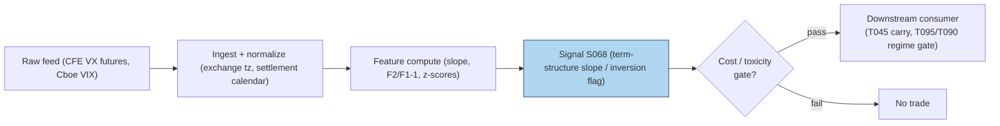

# S068 — VIX term structure

The VIX is a spot number: the market's 30-day volatility forecast, right now. But options exist for many expiries, so there is also a *term structure*: VIX futures (VX, on CFE) expiring in `1` month, `2` months, `3` months [example] --- and its *slope* is the signal. Normal times: the curve slopes upward (**contango**, future above spot) --- traders are paid to bear volatility risk over longer horizons. Stress: the curve inverts (**backwardation**, front above back) --- everyone wants insurance *now*. Two mechanisms make the slope tradable: **carry/roll-down** (short front-month in contango harvests the convergence toward spot) and **stress inversion** (backwardation is one of the cleanest real-time stress gauges; the return to contango marks stress exhaustion). The slope is the pricing of *when* the market wants vol insurance. Provenance **[D]**.

> Tag law: every numeric literal in prose carries one of `[documented]
> [default] [example] [unverified] [internal-est] [measured]` (legend: Appendix
> i v1.0.0). Constants inside cited formulas inherit the formula's tag.
> Bibliographic years, volumes, pages, arXiv IDs, section numbers, rule codes
> (C1–C10), fail-safe codes (F1–F5), module IDs, and machine-parsed §0 data
> fields are identifiers, not literals, and are exempt.

## §1 Five-minute reviewer card

| Row | Value |
|---|---|
| Module | S068 — VIX term structure, v1.0.0 |
| Edge verdict | `PREDICTIVE-FEATURE-ONLY` — documented return-predictability at the curve's VRP level; as a standalone intraday trigger, weak and crowded |
| After-cost | `COMM-ONLY` — roll arithmetic is before-cost in the literature; VX spreads widen in stress exactly when the inversion trade wants to fire |
| Build cost | Tier M (low end) · `25`–`45` h [internal-est] · `$3,750`–`$6,750` loaded [internal-est] |
| Data cost | Research `~$200`/mo + usage (CFE futures feed) [unverified]; Tier-0 delayed free for daily flags [unverified] --- bands indicative, verify before budgeting |
| latency_class | daily; intraday slope variant needs real-time CFE quotes |
| risk_class | medium (inversion trades run into stress flow) |
| Capacity | `$10`–`100`M/day notional [example] --- VX futures are liquid in calm, gappy in stress |
| Executability | Feasible: arithmetic on a tiny feed; Tier M analytics. |
| Risk summary | Backwardation can persist for weeks (`2008`, `2020` [documented]); settlement-calendar prints fake slope jumps; delayed data makes intraday inversion a stale print |
| When it dies | Vol spikes and regime breaks: curve inverts, carry trades get run over, slope flips faster than daily rebalances |
| Regime gates | Provisional: stress regime (inversion) --- T095 vetoes dispersion trades, T090 widens gap-risk haircuts |
| Emits | `signal_vector` (Appendix b v1.0.0) — never orders |

## §1.5 Cheapest / least-build path

1. **Prototype hour band:** `25`–`45` h [internal-est] — CFE ingest + settlement calendar, slope/inversion features, z-score normalization, inversion-flag wiring.
2. **Cheapest-source row:** min_tier = Cboe delayed VIX/VIX9D (Tier 0) --- cheapest data source candidate [unverified]; latency_class = daily, point-in-time adjusted;
   required_fields = VIX, VIX9D levels, VX₁/VX₂ futures quotes, ≥`60` days history [example]; price_band = `~$0`/mo [unverified] (indicative --- verify before budgeting); build_or_buy = **build the analytics, buy the feed --- the math is public and the edge is in timing**.
3. **Resource budget:** `1` core, `<1` GB RAM [internal-est]; compute pattern `per_bar`.
4. **Skip list:** Intraday VX-vs-ES basis; forward-VRP isolation; full expiry-strip analytics.
5. **DO-NOT-CUT list:** causality assertions (`assert fill_event >
   signal_event`, no-signal-bar-fills test); COST block + callable
   `expected_cost_bps`; F1–F5 fail-safes + module-state enum; decision-log
   audit records; bona-fide-intent + self-trade prevention; provenance tags on
   every numeric literal; fixtures + `test_cmd`; secrets via env only.
6. **Escalation gate:** intraday inversion timing required (needs Tier-2 real-time CFE); universe expansion beyond SPX to single-name IV term structures --- inherits S069–S071's OPRA budget.

## §S0 Module contract

### S0.1 Typed signature

```python
def signal(state: ModuleState, events: list[Event], cfg: Config) -> SignalVector:
```

`SignalVector` per Appendix b v1.0.0. `state` is the module-owned named state
vector (`slope_history`, `module_state`); `events` are canonical Events
(Appendix a v1.0.0), newest last. The function handles documented edge cases:
empty input → `UNKNOWN`; non-positive/non-finite quotes → `UNKNOWN`
(F1/F2, never interpolate); halt/auction → freeze per the market-state table.

### S0.2 Config dataclass

| Parameter | Type | Default | Range | Status |
|---|---|---|---|---|
| `inversion_tau` | float | `-1.0` | `-2.0–-0.5` | example |
| `cost_gate_k` | float | `0.5` | `0.1–2.0` | default |

All defaults tagged per the tag law.

### S0.3 Canonical schema mapping

Vendor columns → canonical Event schema (Appendix a v1.0.0), stated once here:

| Vendor | Canonical |
|---|---|
| ``day` (tape)` | ``bar_id` (int)` |
| ``event_ts` (tape)` | ``event_ts` (int64 ns UTC)` |
| ``asof_ts` (tape)` | ``asof_ts` (int64 ns UTC)` |
| ``vix` (tape)` | ``vix` (float, index points)` |
| ``vx1` (tape)` | ``vx1` (float, front-month VX points)` |
| ``vx2` (tape)` | ``vx2` (float, second-month VX points)` |

### S0.4 Time contract

> Time contract: clock domain UTC, int64 ns; authoritative causality clock =
> `event_ts`; max_skew = `1` ms [default]; jitter budget = `500` µs [default]
> bar-label = open time; staleness TTL = `3` s [default]; gap policy = mask, no interpolation; halt/auction
> → discard contributions across reopen. CFE Wednesday-morning settlement prints pinned to the settlement calendar; VIX9D/VIX methodology changes versioned.

**Timing box:** `signal@t (per_bar, America/Chicago) → earliest fill @open(t+1)`

### S0.5 Market-state table

| State | Module behavior |
|---|---|
| CONTINUOUS_TRADING | Compute normally; emit per cadence |
| HALTED | Freeze state; emit `UNKNOWN`; discard contributions across reopen |
| AUCTION | No new signals; hold last `SignalVector`; state `DEGRADED` |
| CLOSED | Emit nothing; state `OFF` |

### S0.6 Module-state enum + error taxonomy

States per Appendix k v1.0.0: `OK | DEGRADED | UNKNOWN | OFF`. Invalid input →
`UNKNOWN`, never interpolate (Appendix f v1.0.0, F1–F5).

| Failure | State | Alert |
|---|---|---|
| Missing/stale input (TTL `3` s [default]) | `UNKNOWN` | page |
| Inputs out of mathematical bounds (F2) | `UNKNOWN` | page |
| `seq` gap > `1,000` events [default] | `DEGRADED` (restart windows) | log |
| Feed jitter > budget persistently | `DEGRADED` | notify |
| Halt/auction | `UNKNOWN` / `DEGRADED` (per table) | log |
| Kill/administrative disable | `OFF` | page |
| Anything unmapped | `UNKNOWN` | page |

### S0.7 Ops tail

- **Schedule:** daily after close; intraday slope variant every `1` min [example]; CFE America/Chicago exchange time; owner: vol-analytics on-call.
- **Health checks:** fixture replay (`test_cmd`) green on deploy; live
  `seq`-gap monitor; staleness watchdog at `3`× cadence.
- **Alert table:** page on `UNKNOWN` > `30` s [default] or bounds violation;
  notify on `DEGRADED`; log on single dropped events.
- **Resource budget:** `1` core, `<1` GB RAM [internal-est]; state is O(window) per symbol.
- **Runbook stub:** `1.` confirm feed (vendor status); `2.` replay fixture;
  `3.` if red → set `OFF`, page; `4.` reconcile decision log before re-arm.

### S0.8 Secrets (env-only)

`DATABENTO_API_KEY` via environment only. No secrets in
this file, fixtures, or logs (CI secrets-grep).

### S0.9 May / must-NOT

> **May:** emit `SignalVector` records per Appendix b v1.0.0. **Must-NOT:**
> emit orders, order intents, prices, share counts, or notionals; call a
> broker; mutate shared state outside `state`; interpolate across gaps.

## §S1 Legacy (subsumed by §1)

Legacy §S1 content is the §1 reviewer card above; this header is retained so
section numbering stays frozen.

## §S2 Specification

### Universe

SPX volatility complex: VIX, VIX9D, VX futures front two expiries [example].

### Entry rule (Boolean — no prose-only conditions)

```
LONG_UNWIND  := (slope < inversion_tau) AND (expected_cost_bps(...) <= cost_gate_k * edge_bps)   # inversion → long front-vol unwind [example convention]
FLAT         := otherwise → UNKNOWN on invalid input

`slope = VX2 − VX1` (points) [example]; `inversion_tau = −1.0` [example]; `edge_bps = |slope| * 50.0` [example]; `confidence = min(1, |slope − inversion_tau| / 3.0)` [example].
```

### Exits (with post-exit cooldown)

```
Curve re-steepening: direction returns to 0 when slope >= inversion_tau.
ON_STATE: module_state != OK → emit `DEGRADED`; `60` s [default] cooldown after any compliance block (C10).
```

### Position sizing (fenced function)

```python
def size_shares(risk_budget_R, stop_distance, vol_estimate, ADV_cap, cost):
    # S-module requests capital fraction only; share math lives in the strategy.
    # Reference: capital = 0.5 * confidence  (confidence in [0,1])  [default]
    risk_notional = risk_budget_R * 0.5 * confidence          # [default] 0.5 factor
    shares = risk_notional / max(stop_distance, 1e-9)
    return int(min(shares, ADV_cap * adv_shares * 0.001))     # 0.1% ADV cap [default]
```

### Risk limits

| Limit | Value |
|---|---|
| Max capital fraction per signal | `0.5` [default] --- signal module; strategy enforces |
| Inversion trigger | slope < `−1.0` points [example] |
| Z-score normalization | `60`-day [example] trailing history for live use |

### COST block (single source of truth)

| Component | Value (bps) | Basis |
|---|---|---|
| Spread (VX 1×2 spread, half-spread sum) | `1.50` | [example] |
| Fees (futures) | `0.20` | [example] |
| Borrow | `0.00` | [default] — reason: futures-only structure |
| Impact (stress-day fill slippage) | `1.00` | [example] |
| **Total reference** | `2.70` | [example] |

`fee_schedule_as_of`: `2026-09-01 [unverified]` — placeholder; pin the real
venue schedule before production. `side: taker` [default]; venue/tier/source:
CFE [example]. Re-stating cost numbers outside this block is a validation failure.

```python
def expected_cost_bps(notional, adv_pct, venue, side, urgency) -> float:
    """Callable cost model — reference stack for S068."""
    spread_bps = 1.50
    fee_bps = 0.20
    borrow_bps = 0.00   # reason: futures-only structure [default]
    impact_bps = 1.00
    return spread_bps + fee_bps + borrow_bps + impact_bps
```

### Execution / fill model table

| Aspect | Assumption |
|---|---|
| Latency | Slope computed at close *t*; intent at open *t+1* [example] |
| Partial fills | Stress-day partial fills modeled by consumers |
| Impact | `1.00` bps stress-day slippage [example] |
| Adverse fill | Fading an inversion means trading into the stress flow --- size down as the curve inverts |

### Robustness

The slope is two futures minus each other --- the failure surface is all calendar and vintage: CFE holiday calendar vs equity calendar; the Wednesday-morning settlement print (slope moves by tenths that matter at scale); VIX9D/VIX methodology revisions; delayed (15-min [example]) data making "intraday inversion" fire on stale prints (label Tier-0 builds daily-only). Normalize: z-score the slope against its trailing `60`-day [example] history --- raw slope is regime-biased because contango depth varies with the vol level. Never compare futures to spot: front-month futures can trade below spot VIX (negative basis) without backwardation.

### Compliance sub-block (C1–C10+)

| Code | Rule: trigger → check → action → log |
|---|---|
| C1 | Self-match prevention: signal module emits no orders; downstream T-modules must set self-trade-prevention flags — S068 asserts the requirement in its `consumes` contract |
| C2 | Bona-fide intent: every emitted `SignalVector` with |direction|=`1` must pass the cost gate; sub-threshold readings emit direction `0`, never a tradeable hint |
| C3 | Message-rate: `≤100` emissions/symbol/s [default]; breach → throttle to `1`/s [default] + alert |
| C4 | Fat-finger trio (applied by consumers; S068 bounds its own outputs): confidence ∈ [`0`,`1`], capital ∈ [`0`,`0.5`], computed_at sane — out-of-bounds → `UNKNOWN` (F2) |
| C5 | Decision log: every emission, veto, and state transition logged per Appendix g v1.0.0, hash-chained |
| C6 | Halt/auction: per §S0.5 market-state table; contributions across reopen discarded |
| C7 | Locate check: SHORT direction requires `locate_ok` from the consumer; futures structure handles locate per venue rules (Reg-SHO threshold securities → direction `0`) |
| C8 | Public dissemination: no signal values published externally without review gate |
| C9 | Data entitlements: per §S6 Data rights row; entitlement-class change → §1.5 escalation gate |
| C10 | Post-exit cooldown: `60 s` [default] after any exit or compliance block; no re-entry |
| C11 | Settlement-vintage rule: VX₁/VX₂ rolls and the Wednesday settlement print are pinned to the curve calendar. --- trigger → check → action → log: prevents fake slope jumps |
| C12 | Stale-data labeling: delayed prints are labeled daily-only; no intraday inversion flag on `15`-min-delayed data [example]. --- trigger → check → action → log: prevents stale-print timing |

### Parameter table

| Parameter | Symbol | Value | Tag | Sensitivity |
|---|---|---|---|---|
| Futures legs | VX₁, VX₂ | `1×2` spread | [example] | medium |
| Smoothing / z lookback | `L` | `60` days | [example] | medium |
| Inversion trigger | `inversion_tau` | `−1.0` pts | [example] | high |
| Holding horizon | — | `1`–`2` weeks | [example] | medium |
| Cost-gate k | `cost_gate_k` | `0.5` | [default] | low |

### Timing box

`signal@t (per_bar, America/Chicago) → earliest fill @open(t+1)`

## §S3 Math + normative pseudocode

VIX spot (Cboe model-free implied variance, Demeterfi et al. 1999; Britten-Jones & Neuberger 2000) [documented]:

$$\sigma^2(T) = \frac{2e^{rT}}{T}\left[\sum_{K_i < K_0}\frac{\Delta K_i}{K_i^2}P(K_i) + \sum_{K_i > K_0}\frac{\Delta K_i}{K_i^2}C(K_i)\right] - \frac{1}{T}\left(\frac{F}{K_0} - 1\right)^2 \quad\text{[documented]}$$

Term-structure features (the S068 features) [example]:

$$S_{1\times2} = VX_2 - VX_1 \quad\text{(points)}, \qquad \text{rel} = VX_2/VX_1 - 1 \quad\text{(percent)} \quad\text{[example]}$$

Inversion: `slope < inversion_tau` with `inversion_tau = −1.0` [example].

**Normative pseudocode** (pseudocode is normative; prose is commentary):

```
function signal(state, bars, cfg) -> SignalVector:
    assert bars non-empty else return UNKNOWN
    b = bars[-1]
    if any(v <= 0 or not finite(v)) for v in (b.vix, b.vx1, b.vx2): return UNKNOWN   # F2 [default]
    slope = b.vx2 - b.vx1                                   # 1x2 slope [example]
    direction = 1 if slope < cfg.inversion_tau else 0       # inversion → long vol carry unwind [example]
    confidence = min(1.0, abs(slope - cfg.inversion_tau) / 3.0) if direction else 0.0   # [example] scale
    edge_bps = abs(slope) * 50.0                           # modeled per-trade edge [example]
    assert fill_event > signal_event                       # causality: curve at close t tradable no earlier than open t+1
    if not (expected_cost_bps(...) <= cfg.cost_gate_k * edge_bps):
        direction, confidence = 0, 0.0                      # cost gate [default] k
    return SignalVector("TEST", direction, confidence, 0.5 * confidence,
                        b.event_ts, b.asof_ts - b.event_ts, "OK")
```

Causality: the curve at close *t* uses only quotes ≤ *t*; a position is entered no earlier than *t+1* (next open). Mandatory unit test: no-signal-bar fills.

## §S4 Worked example (fixture-backed)

- Tape: `modules/fixtures/S068_tape.csv` — `# TYPE: validation-run`;
  `8` rows (synthetic `8`-day [example] VIX/VX₁/VX₂ tape, seed `68`), all numbers synthetic,
  seed `68` [example]; `event_ts`/`asof_ts` int64 ns UTC.
- Expected outputs: `modules/fixtures/S068_expected.csv` — per-day `slope`, `inverted`.
- Tolerance: `1e-9 [default]` on floats; integers exact.
- Hand-checks: ['day-`0` slope `1.5000` [measured]', 'day-`2` slope `1.0000` [measured]', 'day-`3` slope `−2.5000` [measured], inverted=`1` [measured] — the only inversion on the tape', 'day-`4` slope `0.5000` [measured], inverted=`0` [measured] — stress fading, curve re-steepening', 'day-`7` slope `1.4000` [measured], inverted=`0` [measured] — contango restored'].
- Acceptance tests (`modules/tests/test_S068.py`, `5` tests):
  `1.` fixture recomputes to expected (day-`0` slope `1.5`; day-`3` inverted; exactly `1` inverted day)
  `2.` stub emits valid `SignalVector` (direction `0`/`1`, confidence ∈ [0,1])
  `3.` no-signal-bar fills (`fill_event_ts > computed_at`)
  `4.` cost-gate predicate passes on large edge, blocks on tiny edge
  `5.` invalid input (non-positive VIX) → `UNKNOWN`
- `test_cmd`: `python3 -m pytest modules/tests/test_S068.py -q` → exits `0`.

**Where the example is optimistic:** `8` synthetic days [example], no fees, no bid/ask, no settlement-calendar effects --- demonstrates the slope arithmetic and the inversion rule, not a tradeable backtest.

## §S5 Strategies that use this signal

| Strategy | Role |
|---|---|
| T045 — VIX Term-Structure Carry | Primary entry trigger: trades the 1×2 slope and the VRP level (long contango carry, flat or long front vol on inversion) |
| T095 — Dispersion + GEX Regime Switch | Regime gate: vetoes dispersion trades when the curve is backwardated |
| T090 — Overnight Inventory Carry Manager | Risk filter: widens gap-risk haircuts and reduces overnight carry on backwardation |

## §S6 Data required

| Field | Type | Granularity | Source tier | Notes |
|---|---|---|---|---|
| VIX, VIX9D index levels | float (points) | 1-min / daily | Tier 0–1 | Cboe delayed free; real-time via vendors |
| VX futures quotes (all expiries) | float (points) | 1-min / daily | Tier 1–2 | CFE; Databento futures feed |
| Risk-free rate (T-bill curve) | float (%) | daily | Tier 0 | FRED; for VIX replication checks |
| S&P 500 options chain | quotes | daily snapshots | Tier 2–3 | only if replicating the index itself |

**Data rights row** (Appendix j v1.0.0): Cboe delayed index data + Databento futures, `rights: licensed`; license scope = research + stated production symbol count; raw ticks never leave our systems --- fixtures are synthetic; entitlement-class change → §1.5 escalation gate.

## §S7 Local build (M5 Max / 128 GB)

Feasible: trivial-to-feasible (Tier M, low end). The signal is arithmetic on a tiny feed: a decade of daily VIX/VX history is <`10` MB [internal-est] against the `77` GB working budget (cost-model §3). The bottleneck is **data licensing, not compute** --- real-time CFE quotes cost money; the math costs nothing. Stack: **Python+polars** --- **Tier M, 25–45 h ≈ $3,750–$6,750 loaded** (cost-model §5).

## §S8 Buy vs build

**Build the analytics, buy the feed.** The formulas are public and the code is an afternoon; money buys lower latency and more expiries. Stay on Tier-0 delayed data if the signal is only a daily regime flag (free [unverified]); buy Tier-2 CFE data (`~$200`/mo + usage [unverified]) the moment you trade the slope intraday --- a daily delayed curve cannot time an inversion. All prices indicative --- verify before budgeting.

## §S9 Efficacy — documented evidence

| Study / source | Market & period | Metric | Before/after cost | Caveat |
|---|---|---|---|---|
| Bollerslev, Tauchen & Zhou (2009) [documented] | US equities, `1990`–`2008` | VRP predicts ~`3`-month excess returns; strongest at the intermediate (quarterly) horizon, dominating P/E, default spread, CAY | `BEFORE-COST` regression evidence, not a traded P&L | return-predictability, not a pure term-structure trade; horizon is months |
| FRB "The Variance Risk Premium Around the World" (IFDP 1035) [documented] | US + international equities | VRP large and time-varying; predicts equity returns internationally | `BEFORE-COST` | confirms the premium is not a US-only artifact |
| Practitioner term-structure literature (Cboe VIX methodology; dealer/ETP research) [documented] | VIX futures since `2004` | Persistent contango funds roll yield for short-front-vol positions in calm regimes | `BEFORE-COST` roll arithmetic | well-known and crowded; fails exactly when the hedge is needed most |

**Honest bottom line.** No credible published source reports an after-cost Sharpe for a standalone intraday VIX-slope strategy: **as a standalone trigger this is a weak, crowded edge**; **as a regime gate and stress timer it is a genuinely useful filter** --- inversion flags carry real information about near-term realized-vol regimes.

## §S10 Failure modes & pitfalls

| # | Trigger → Detect → Action → Recovery | check: |
|---|---|---|
| 1 | Lookahead leakage → using the official VIX close before dissemination → detect: timestamp audit in exchange time → action: pin actual chain vintage → recovery: re-timestamp | `exchange-time timestamps [example rule]` |
| 2 | Stale/delayed prints → delayed (15-min) data fires "intraday inversion" on stale prints → detect: data tier audit → action: label Tier-0 builds daily-only → recovery: restrict to regime flags | `daily-only labeling [example rule]` |
| 3 | Crowding/alpha decay → short-contango is one of the most crowded vol trades → detect: carry P&L regime scan → action: size as carry, not alpha → recovery: cut size | `carry sizing [example rule]` |
| 4 | Cost blowup → VX bid/ask widens in stress exactly when you want to trade → detect: quoted spread monitor → action: model `0.05`–`0.15` point spreads, wider on spikes [example] → recovery: size down | `stress spread model [example rule]` |
| 5 | Regime breaks → backwardation can persist for weeks (`2008`, `2020`) → detect: inversion persistence → action: time stop on fade-the-inversion → recovery: stand down | `time stop [example rule]` |
| 6 | Overfitting → slope z-lookbacks flip signals → detect: parameter scan → action: pick from economics (`60` days ≈ one earnings cycle [example]) → recovery: freeze | `economics-first parameters [example rule]` |
| 7 | Data errors → VX rolls, holiday calendars, VIX9D methodology revisions → detect: fake slope jumps → action: maintain a curve corporate-action calendar → recovery: recompute | `curve calendar [example rule]` |
| 8 | Microstructure confusion → front-month futures below spot ≠ backwardation → detect: futures-vs-spot mismatch → action: compare like with like (futures vs futures) → recovery: correct | `futures-vs-futures [example rule]` |

## §S11 Visuals




## §S12 Source log + unverified leads

**Sources** (citable facts only):

['1. Bollerslev, T., Tauchen, G. & Zhou, H. (2009) [documented]. "Expected Stock Returns and Variance Risk Premia." *Review of Financial Studies*, 22:4463-4492. (FEDS 2007-11 working version, Federal Reserve Board.) --- VRP predicts ~3-month excess returns; strongest at the intermediate (quarterly) horizon, dominating P/E, default spread, CAY.', '2. Federal Reserve Board [documented]. "The Variance Risk Premium Around the World." International Finance Discussion Papers 1035. https://www.Federalreserve.gov/pubs/ifdp/2011/1035/ifdp1035.htm --- VRP large and time-varying; predicts equity returns internationally.', '3. Cboe [documented]. "Cboe VIX White Paper" --- model-free 30-day implied variance methodology; formula reference via the R.MFIV implementation: https://rdrr.io/github/m-g-h/R.MFIV/src/R/CBOE_VIX.R.', '4. Demeterfi, K., Derman, E., Kamal, M., Zou, J. (1999) [documented]. "More Than You Ever Wanted To Know About Volatility Swaps." Goldman Sachs Quantitative Strategies Research Notes. https://www.realvol.com/volatilityblog/?p=516 --- model-free implied variance construction.']

**Chatbot source log.** Duck.ai (GPT-5.6 Luna, anonymous, web-search assisted, 2026-09-10) answered Q-SB8-1–Q-SB8-3. Grok/Cursor answers pending (checked 2026-09-10). Chatbot output is leads, never facts.

**Unverified leads** (chatbot-only — never in evidence tables):

['- Duck.ai Q-SB8-1 #3 model-free implied-variance formula lead --- cross-checked against the Cboe VIX white paper and the R.MFIV implementation; no chatbot numbers are used as evidence; quarantined.', '- Carr & Wu (2006) term-structure work --- cited in the report entry but no checkable URL verified; quarantined.', '- Chatbot claims about specific VIX-slope Sharpe ratios or hit rates --- unverified and excluded from S9; quarantined.']

---

## Appendix — AI build prompt (S068)

Copy-paste into any chat agent:

> Build module **S068 — VIX term structure** per
> `notes/module-template.md` v1.0.0 and this file's §S0 contract.
> Cheapest path (§1.5): prototype `25`–`45` h [internal-est]; cheapest data
> candidate Cboe delayed VIX/VIX9D (Tier 0) --- cheapest data source candidate [unverified]; compute pattern
> `per_bar`; skip intraday basis, forward VRP, and the full expiry strip for now.
> Implement `signal(state, events, cfg) -> SignalVector` (Appendix b v1.0.0)
> with the §S3 normative pseudocode, including the cost-gate predicate
> `expected_cost_bps(...) <= k * edge_bps` and `assert fill_event >
> signal_event`. Wire F1–F5 (Appendix f v1.0.0): invalid input → `UNKNOWN`,
> never interpolate. Log decisions per Appendix g v1.0.0. Secrets via env
> only. Run the fixture `modules/fixtures/S068_tape.csv`
> (`# TYPE: validation-run`) against `modules/fixtures/S068_expected.csv`
> (tolerance `1e-9 [default]`).
> **Definition of done:** `python3 -m pytest modules/tests/test_S068.py -q`
> exits `0`. Tag every numeric literal you add with the unified enum
> (Appendix i v1.0.0); put anything unverifiable in §S12 unverified leads.
