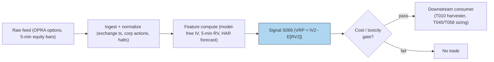

# S069 — Implied-vs-realized spread / variance risk premium

**Implied variance** is the market's forecast of future volatility, read off option prices. **Realized variance** is what actually happened, measured from price changes. The **variance risk premium** is the gap: implied minus realized. On average, for equity indices, implied exceeds realized --- option sellers collect a premium for bearing volatility and crash risk, the same way insurers collect premiums for bearing fire risk. Picture month-start: 30-day S&P 500 implied vol at `16.1`% [example], your HAR (S066) forecast of realized vol at `13.9`% [example] --- the market is paying you to be short volatility. Why the premium exists: crash aversion, structural dealer short-gamma rebalancing demand, and volatility-of-volatility risk. It is compensation for a risk that periodically realizes against you (`2008`, `2020` [documented]) --- not an arbitrage. Provenance **[D]**.

> Tag law: every numeric literal in prose carries one of `[documented]
> [default] [example] [unverified] [internal-est] [measured]` (legend: Appendix
> i v1.0.0). Constants inside cited formulas inherit the formula's tag.
> Bibliographic years, volumes, pages, arXiv IDs, section numbers, rule codes
> (C1–C10), fail-safe codes (F1–F5), module IDs, and machine-parsed §0 data
> fields are identifiers, not literals, and are exempt.

## §1 Five-minute reviewer card

| Row | Value |
|---|---|
| Module | S069 — Implied-vs-realized spread / variance risk premium, v1.0.0 |
| Edge verdict | `PREDICTIVE-FEATURE-ONLY` — documented return-predictability at weekly-to-multi-month horizons; edge becomes money only through a consumer (T010 harvester) |
| After-cost | `COMM-ONLY` — literature is before-cost in predictive regressions; short-vol pays the full option bid/ask twice plus delta-hedging costs |
| Build cost | Tier M · `20`–`60` h [internal-est] · `$3,000`–`$9,000` loaded [internal-est] |
| Data cost | Research `~$200`–`5,000`/mo (chains/IV surfaces) [unverified] --- bands indicative, verify before budgeting |
| latency_class | monthly; tradable no earlier than t+1 on the month-start print |
| risk_class | high (short-vol tail risk: 2008/2020-style VRP flips) |
| Capacity | `$50`–`500`M/day notional [example] --- index variance-swap markets are deep in calm |
| Executability | Feasible: RV engine + IV surface + z-score; Tier M analytics. |
| Risk summary | Negative-VRP regimes: realized overshoots implied and short-vol loses; intraday "VRP" is bid/ask bounce, not the premium |
| When it dies | Jump/crisis episodes when realized variance overshoots implied --- the insurance pays out |
| Regime gates | Provisional: crisis regime (negative VRP, vol spike) --- veto harvester entries, require S064 jump filter |
| Emits | `signal_vector` (Appendix b v1.0.0) — never orders |

## §1.5 Cheapest / least-build path

1. **Prototype hour band:** `20`–`60` h [internal-est] — RV engine on 5-min bars, IV-surface inversion or bought surface, trailing-z analytics, harvester hookup.
2. **Cheapest-source row:** min_tier = Tier-0 Cboe delayed IV + Stooq bars --- cheapest data source candidate [unverified]; latency_class = monthly, point-in-time adjusted;
   required_fields = 30-day IV surface, 5-min underlying bars, ≥`12` months history [example]; price_band = `~$0`/mo [unverified] (indicative --- verify before budgeting); build_or_buy = **build the realized-variance engine yourself; buy clean implied-variance surfaces --- IV inversion is the expensive part**.
3. **Resource budget:** `1` core, `4`–`8` GB RAM [internal-est]; compute pattern `per_bar`.
4. **Skip list:** Forward-starting VRP; variance-swap replication variants; full-chain intraday VRP.
5. **DO-NOT-CUT list:** causality assertions (`assert fill_event >
   signal_event`, no-signal-bar-fills test); COST block + callable
   `expected_cost_bps`; F1–F5 fail-safes + module-state enum; decision-log
   audit records; bona-fide-intent + self-trade prevention; provenance tags on
   every numeric literal; fixtures + `test_cmd`; secrets via env only.
6. **Escalation gate:** universe >`50` underlyings [default]; intraday VRP timing required --- inherits the full OPRA budget.

## §S0 Module contract

### S0.1 Typed signature

```python
def signal(state: ModuleState, events: list[Event], cfg: Config) -> SignalVector:
```

`SignalVector` per Appendix b v1.0.0. `state` is the module-owned named state
vector (`vrp_history`, `module_state`); `events` are canonical Events
(Appendix a v1.0.0), newest last. The function handles documented edge cases:
empty input → `UNKNOWN`; non-positive/non-finite IV or RV → `UNKNOWN`
(F1/F2, never interpolate); <`2` [example] observations → z = `0` [example],
`UNKNOWN` state; halt/auction → freeze per the market-state table.

### S0.2 Config dataclass

| Parameter | Type | Default | Range | Status |
|---|---|---|---|---|
| `z_entry` | float | `1.5` | `1.0–2.5` | example |
| `cost_gate_k` | float | `0.5` | `0.1–2.0` | default |

All defaults tagged per the tag law.

### S0.3 Canonical schema mapping

Vendor columns → canonical Event schema (Appendix a v1.0.0), stated once here:

| Vendor | Canonical |
|---|---|
| ``month` (tape)` | ``bar_id` (int)` |
| ``event_ts` (tape)` | ``event_ts` (int64 ns UTC)` |
| ``asof_ts` (tape)` | ``asof_ts` (int64 ns UTC)` |
| ``iv_ann` (tape)` | ``iv_ann` (float, annualized implied vol %)` |
| ``rv_ann` (tape)` | ``rv_ann` (float, annualized realized vol %)` |

### S0.4 Time contract

> Time contract: clock domain UTC, int64 ns; authoritative causality clock =
> `event_ts`; max_skew = `1` ms [default]; jitter budget = `500` µs [default]
> bar-label = open time; staleness TTL = `3` s [default]; gap policy = mask, no interpolation; halt/auction
> → discard contributions across reopen. Matched horizons: IV at month-start vs realized over the same 30-day window.

**Timing box:** `signal@t (per_bar, America/New_York) → earliest fill @open(t+1)`

### S0.5 Market-state table

| State | Module behavior |
|---|---|
| CONTINUOUS_TRADING | Compute normally; emit per cadence |
| HALTED | Freeze state; emit `UNKNOWN`; discard contributions across reopen |
| AUCTION | No new signals; hold last `SignalVector`; state `DEGRADED` |
| CLOSED | Emit nothing; state `OFF` |

### S0.6 Module-state enum + error taxonomy

States per Appendix k v1.0.0: `OK | DEGRADED | UNKNOWN | OFF`. Invalid input →
`UNKNOWN`, never interpolate (Appendix f v1.0.0, F1–F5).

| Failure | State | Alert |
|---|---|---|
| Missing/stale input (TTL `3` s [default]) | `UNKNOWN` | page |
| Inputs out of mathematical bounds (F2) | `UNKNOWN` | page |
| `seq` gap > `1,000` events [default] | `DEGRADED` (restart windows) | log |
| Feed jitter > budget persistently | `DEGRADED` | notify |
| Halt/auction | `UNKNOWN` / `DEGRADED` (per table) | log |
| Kill/administrative disable | `OFF` | page |
| Anything unmapped | `UNKNOWN` | page |

### S0.7 Ops tail

- **Schedule:** monthly at month-start; daily RV forecast refresh; US equities regular session `09:30`–`16:00` America/New_York [documented]; owner: vol-analytics on-call.
- **Health checks:** fixture replay (`test_cmd`) green on deploy; live
  `seq`-gap monitor; staleness watchdog at `3`× cadence.
- **Alert table:** page on `UNKNOWN` > `30` s [default] or bounds violation;
  notify on `DEGRADED`; log on single dropped events.
- **Resource budget:** `1` core, `4`–`8` GB RAM [internal-est]; state is O(window) per symbol.
- **Runbook stub:** `1.` confirm feed (vendor status); `2.` replay fixture;
  `3.` if red → set `OFF`, page; `4.` reconcile decision log before re-arm.

### S0.8 Secrets (env-only)

`DATABENTO_API_KEY`, `CBOE_LIVEVOL_KEY` via environment only. No secrets in
this file, fixtures, or logs (CI secrets-grep).

### S0.9 May / must-NOT

> **May:** emit `SignalVector` records per Appendix b v1.0.0. **Must-NOT:**
> emit orders, order intents, prices, share counts, or notionals; call a
> broker; mutate shared state outside `state`; interpolate across gaps.

## §S1 Legacy (subsumed by §1)

Legacy §S1 content is the §1 reviewer card above; this header is retained so
section numbering stays frozen.

## §S2 Specification

### Universe

Equity indices + liquid single names with full option chains; ≥`12` months history [example].

### Entry rule (Boolean — no prose-only conditions)

```
RICH_VRP   := (z > z_entry) AND (expected_cost_bps(...) <= cost_gate_k * edge_bps)   # rich implied vs forecast → short-vol harvest [example convention]
FLAT       := otherwise → UNKNOWN on invalid input

`VRP_vol = IV_ann − RV_ann` (vol points) [documented]; `VRP_var = IV_ann² − RV_ann²` (variance points) [documented];
`z = (vrp − μ_hist) / σ_hist` vs trailing `4`-month [example] window (fixture convention); `z_entry = 1.5` [example];
`edge_bps = z * 100.0` [example]; `confidence = min(1, z / 3.0)` [example].
```

### Exits (with post-exit cooldown)

```
VRP normalized: direction returns to 0 when z <= z_entry; negative-VRP regime forces flat.
ON_STATE: module_state != OK → emit `DEGRADED`; `60` s [default] cooldown after any compliance block (C10).
```

### Position sizing (fenced function)

```python
def size_shares(risk_budget_R, stop_distance, vol_estimate, ADV_cap, cost):
    # S-module requests capital fraction only; share math lives in the strategy.
    # Reference: capital = 0.5 * confidence  (confidence in [0,1])  [default]
    risk_notional = risk_budget_R * 0.5 * confidence          # [default] 0.5 factor
    shares = risk_notional / max(stop_distance, 1e-9)
    return int(min(shares, ADV_cap * adv_shares * 0.001))     # 0.1% ADV cap [default]
```

### Risk limits

| Limit | Value |
|---|---|
| Max capital fraction per signal | `0.5` [default] --- signal module; strategy enforces |
| Entry z-score | `>1.5` [example] vs trailing `4`-month [example] window |
| Horizon floor | weekly or longer; intraday "VRP" vetoed [example] |

### COST block (single source of truth)

| Component | Value (bps) | Basis |
|---|---|---|
| Spread (straddle two-leg half-spread) | `4.00` | [example] |
| Fees (options) | `0.60` | [example] |
| Borrow | `0.00` | [default] — reason: delta-hedged long vol; no stock borrow |
| Impact (delta-hedge slippage) | `2.00` | [example] |
| **Total reference** | `6.60` | [example] |

`fee_schedule_as_of`: `2026-09-01 [unverified]` — placeholder; pin the real
venue schedule before production. `side: taker` [default]; venue/tier/source:
CBOE [example]. Re-stating cost numbers outside this block is a validation failure.

```python
def expected_cost_bps(notional, adv_pct, venue, side, urgency) -> float:
    """Callable cost model — reference stack for S069."""
    spread_bps = 4.00
    fee_bps = 0.60
    borrow_bps = 0.00   # reason: delta-hedged long vol; no stock borrow [default]
    impact_bps = 2.00
    return spread_bps + fee_bps + borrow_bps + impact_bps
```

### Execution / fill model table

| Aspect | Assumption |
|---|---|
| Latency | Computed at close *t* from chains ≤ *t*; intent no earlier than *t+1* open [example] |
| Partial fills | Straddle legs partial-fill modeled by consumers |
| Impact | `2.00` bps delta-hedge slippage [example] |
| Adverse fill | Shorting variance pays the option spread twice (entry/exit) plus delta-hedging costs; stress exits gap beyond quoted spreads |

### Robustness

Compare implied against *expected future realized* over a matched horizon --- never against today's realized vol. Two practical rules (documented in the chapter): interpolate **total variance** w(K,T) = σᵢᵥ²(K,T)·T across maturities, never raw vol; interpolate across strikes in log-moneyness k = ln(K/F). Exclude stale zero-bid quotes from the model-free sum per the Cboe selection rule. Z-score VRP against its trailing history --- raw VRP is meaningless across regimes. Flag: one source line rendered the vol-points analog as IVol − √(RV) ambiguously --- the render was garbled; the variance-points form above is the verified one; do NOT code the vol-points variant as confirmed.

### Compliance sub-block (C1–C10+)

| Code | Rule: trigger → check → action → log |
|---|---|
| C1 | Self-match prevention: signal module emits no orders; downstream T-modules must set self-trade-prevention flags — S069 asserts the requirement in its `consumes` contract |
| C2 | Bona-fide intent: every emitted `SignalVector` with |direction|=`1` must pass the cost gate; sub-threshold readings emit direction `0`, never a tradeable hint |
| C3 | Message-rate: `≤100` emissions/symbol/s [default]; breach → throttle to `1`/s [default] + alert |
| C4 | Fat-finger trio (applied by consumers; S069 bounds its own outputs): confidence ∈ [`0`,`1`], capital ∈ [`0`,`0.5`], computed_at sane — out-of-bounds → `UNKNOWN` (F2) |
| C5 | Decision log: every emission, veto, and state transition logged per Appendix g v1.0.0, hash-chained |
| C6 | Halt/auction: per §S0.5 market-state table; contributions across reopen discarded |
| C7 | Locate check: SHORT direction requires `locate_ok` from the consumer; S069 never emits SHORT without the consumer asserting locate (Reg-SHO threshold securities → direction `0`) |
| C8 | Public dissemination: no signal values published externally without review gate |
| C9 | Data entitlements: per §S6 Data rights row; entitlement-class change → §1.5 escalation gate |
| C10 | Post-exit cooldown: `60 s` [default] after any exit or compliance block; no re-entry |
| C11 | Horizon floor: intraday VRP readings are vetoed --- the documented premium lives at weekly and longer horizons. --- trigger → check → action → log: prevents microstructure-noise trading |
| C12 | Chain vintage: signal timestamped to the actual chain vintage at time *t*; no settlement-IV or corrected-OI lookahead. --- trigger → check → action → log: prevents lookahead leakage |

### Parameter table

| Parameter | Symbol | Value | Tag | Sensitivity |
|---|---|---|---|---|
| Horizon | `T` | `30` calendar days | [example] | medium |
| RV sampling | `Δ` | `5`-min log returns | [example] | high |
| Forecast | `E[RV]` | HAR on 5-min RV (S066) | [example] | high |
| Entry z-score | `z_entry` | `1.5` | [example] | high |
| Cost-gate k | `cost_gate_k` | `0.5` | [default] | low |

### Timing box

`signal@t (per_bar, America/New_York) → earliest fill @open(t+1)`

## §S3 Math + normative pseudocode

Canonical variance-units form [documented]; desk-shorthand vol-units form [example]:

$$\mathrm{VRP}_t = (\mathrm{IV}_t^{\mathrm{ann}})^2 - \mathbb{E}_t\big[(\mathrm{RV}_{t,T}^{\mathrm{ann}})^2\big] \quad\text{(variance points)} \quad\text{[documented]}$$

$$\mathrm{VRP}_t^{\sigma} = \mathrm{IV}_t^{\mathrm{ann}} - \mathbb{E}_t\big[\mathrm{RV}_{t,T}^{\mathrm{ann}}\big] \quad\text{(vol points)} \quad\text{[example]}$$

Ex-post: $\mathrm{VRP}_t^{\text{ex-post}} = (\mathrm{IV}_t^{\mathrm{ann}})^2 - (\mathrm{RV}_{t,T}^{\mathrm{ann}})^2$ with RV from 5-min log returns: $\mathrm{RV} = 252 \times \sum_i r_i^2$, annualized [documented]. Model-free implied variance per the Federal Reserve Board definition [documented]:

$$\mathrm{IV}_t^{\mathrm{ann}} = \frac{2e^{rT}}{T}\left[\sum_{K_i<K_0}\frac{\Delta K_i}{K_i^2}P(K_i) + \sum_{K_i>K_0}\frac{\Delta K_i}{K_i^2}C(K_i)\right] - \frac{1}{T}\left(\frac{F_t}{K_0}-1\right)^2 \quad\text{[documented]}$$

**Normative pseudocode** (pseudocode is normative; prose is commentary):

```
function signal(state, bars, cfg) -> SignalVector:
    assert bars non-empty else return UNKNOWN
    b = bars[-1]
    if any(v <= 0 or not finite(v)) for v in (b.iv_ann, b.rv_ann): return UNKNOWN   # F2 [default]
    vrps = [r.iv_ann - r.rv_ann for r in bars]                      # vol-points VRP [example]
    hist = vrps[-4:]                                                # trailing-4 window [example]
    mu = mean(hist); sd = std(hist) if len(hist) > 1 else 0.0
    z = (vrps[-1] - mu) / sd if sd > 0 else 0.0                    # z [example]
    direction = 1 if z > cfg.z_entry else 0                        # rich VRP → short vol harvest [example]
    confidence = min(1.0, z / 3.0) if direction else 0.0            # [example] scale
    edge_bps = z * 100.0                                           # modeled per-trade edge [example]
    assert fill_event > signal_event                               # causality: month-start print tradable no earlier than t+1
    if not (expected_cost_bps(...) <= cfg.cost_gate_k * edge_bps):
        direction, confidence = 0, 0.0                              # cost gate [default] k
    return SignalVector("TEST", direction, confidence, 0.5 * confidence,
                        b.event_ts, b.asof_ts - b.event_ts, "OK")
```

Causality: computed at close *t* from options ≤ *t* and RV forecasts ≤ *t*; tradable no earlier than *t+1*. Mandatory unit test: no-signal-bar fills.

## §S4 Worked example (fixture-backed)

- Tape: `modules/fixtures/S069_tape.csv` — `# TYPE: validation-run`;
  `8` rows (synthetic `8`-month [example] IV_ann/RV_ann tape, seed `69`), all numbers synthetic,
  seed `69` [example]; `event_ts`/`asof_ts` int64 ns UTC.
- Expected outputs: `modules/fixtures/S069_expected.csv` — per-month `vrp_vol`, `vrp_var`, `z`, `direction`.
- Tolerance: `1e-9 [default]` on floats; integers exact.
- Hand-checks: ['month-`0` vrp_vol `4.0` [measured], vrp_var `160` [measured], z `0.0` [measured] — single observation', 'month-`1` vrp_vol `6.0` [measured], vrp_var `264` [measured] = `25`²−`19`²', 'month-`2` vrp_vol `−1.0` [measured], vrp_var `−41` [measured], z `−1.3587324410` [measured] — realized overshoots implied', 'month-`4` vrp_vol `8.0` [measured], vrp_var `384` [measured], z `0.9506541514` [measured]', 'no month triggers direction=`1` on this tape [measured] — z never exceeds `1.5`'].
- Acceptance tests (`modules/tests/test_S069.py`, `5` tests):
  `1.` fixture recomputes to expected (month-`0` vrp_vol `4.0`, vrp_var = `22`²−`18`²; single obs → direction `0`)
  `2.` stub emits valid `SignalVector` (direction `0`/`1`, confidence ∈ [0,1])
  `3.` no-signal-bar fills (`fill_event_ts > computed_at`)
  `4.` cost-gate predicate passes on large edge, blocks on tiny edge
  `5.` invalid input (non-positive IV/RV) → `UNKNOWN`
- `test_cmd`: `python3 -m pytest modules/tests/test_S069.py -q` → exits `0`.

**Where the example is optimistic:** `8` synthetic months [example]; no trading costs; demonstrates the VRP arithmetic and z-score logic, not a traded P&L.

## §S5 Strategies that use this signal

| Strategy | Role |
|---|---|
| T010 — Variance-Risk-Premium Harvester | Primary entry trigger: delta-hedged short-vol when implied variance is rich vs the HAR forecast |
| T045 — VIX Term-Structure Carry | Regime context: VRP level scales curve-carry sizing |
| T046 — Straddle-Implied Move Fade | Filter: requires positive VRP before fading event straddles |
| T058 — Dispersion Trader | Sizing input: index-vs-single-stock VRP gap scales the short-index-vol leg |

## §S6 Data required

| Field | Type | Granularity | Source tier | Notes |
|---|---|---|---|---|
| Options quotes (full chain) | bid/ask, volume, OI | intraday snapshots / EOD | Tier 1–2 | OPRA via Databento/Cboe LiveVol; Tier 0 Cboe delayed for prototyping |
| 30-day IV surface | float (%) | daily | Tier 1–2 | vendor surfaces `~$200`–`5,000`/mo [unverified] |
| Underlying 5-min bars | OHLCV | 5-min | Tier 0–1 | for RV computation |
| Risk-free / dividend curves | float | daily | Tier 0 | FRED; needed for forward F_t and IV inversion |

**Data rights row** (Appendix j v1.0.0): Options chains via Databento OPRA / Cboe LiveVol, `rights: licensed`; license scope = research + stated production symbol count; raw ticks never leave our systems --- fixtures are synthetic; entitlement-class change → §1.5 escalation gate.

## §S7 Local build (M5 Max / 128 GB)

Feasible (Tier M). The expensive ops are quote normalization and IV inversion across the chain, not the VRP arithmetic: a `30`-day [example] HAR forecast on 5-min bars is milliseconds; inverting a full SPX chain snapshot is seconds in vectorized numpy (cost-model §2). RAM: one SPX snapshot `20`–`100` MB [internal-est]; a rolling year of daily snapshots fits the `77` GB budget (cost-model §3). Stack: **Python+polars/numpy** --- **Tier M, 20–60 h ≈ $3,000–$9,000 loaded** (cost-model §5).

## §S8 Buy vs build

**Hybrid: buy the normalized chain/IV surface, build the RV engine and the VRP analytics.** The crossover: buy Tier-2 the moment you need historical chains for a real backtest (rebuilding a decade of IV surfaces from raw quotes is a `200`–`500` h [unverified] job per the chatbot's IV-inversion component --- labeled chatbot lead, cost-model takes precedence); build everything if you only need index-level monthly VRP, where delayed Cboe data suffices. Indicative bands: Tier 1 `~$30`–`200`/mo [unverified]; Tier 2 `~$200`–`5,000`/mo [unverified] --- indicative, verify before budgeting.

## §S9 Efficacy — documented evidence

| Study / source | Market & period | Metric | Before/after cost | Caveat |
|---|---|---|---|---|
| Bollerslev, Tauchen & Zhou (2009) [documented] | US equities, `1990`–`2008` | VRP predicts excess returns; strongest at the intermediate `3`-month horizon, dominating P/E, default spread, CAY | `BEFORE-COST` predictive regressions | return predictability, not a traded short-vol P&L; horizon is months |
| FRB "The Variance Risk Premium Around the World" (IFDP 1035) [documented] | US + international, `1990`–`2008` | VRP large, time-varying (mean ~`18` variance pts in the US sample), predicts returns internationally | `BEFORE-COST` | confirms pervasiveness; no execution costs modeled |
| Practitioner variance-swap desk literature [documented] | Equity indices, `2000`s–`2020`s | Systematic short variance earns positive average carry punctuated by large drawdowns (`2008`, `2020`) | `BEFORE-COST` in most published accounts | after-cost numbers exist only in institutional marketing; treat as unverified |

**Honest bottom line.** The strongest documented evidence is at weekly → monthly → multi-month horizons --- **not intraday**. **As a standalone swing factor the VRP is one of the most robust findings in the vol literature; as an intraday trigger it is a different, much weaker animal.**

## §S10 Failure modes & pitfalls

| # | Trigger → Detect → Action → Recovery | check: |
|---|---|---|
| 1 | Lookahead leakage → using settlement IV or corrected OI from after the signal timestamp → detect: vintage audit → action: pin the actual chain vintage at time *t* → recovery: re-timestamp | `chain vintage [example rule]` |
| 2 | Stale quotes → zero-bid quotes poison the model-free sum → detect: zero-bid scan → action: exclude per the Cboe selection rule → recovery: recompute | `Cboe selection rule [documented rule]` |
| 3 | Crowding/alpha decay → short-VRP is the most crowded vol trade → detect: premium compression scan → action: require jump filter (S064) → recovery: cut size | `S064 gate [example rule]` |
| 4 | Cost blowup → shorting variance pays the option spread twice plus delta-hedging costs → detect: round-trip cost model → action: model full round-trip spread + `25`–`100`% [example] slippage haircut in stress → recovery: resize | `full round-trip [example rule]` |
| 5 | Regime breaks → earnings/CPI/FOMC jumps and vol panics flip the sign → detect: jump flag → action: never size short-vol without S064 → recovery: stand down | `S064 gate [example rule]` |
| 6 | Overfitting → horizon (`7` vs `30` vs `90` days [example]) and RV estimator choice move results → detect: parameter scan → action: pre-commit to matched horizons → recovery: freeze | `matched horizons [example rule]` |
| 7 | Microstructure confusion → intraday VRP wiggles from non-sync prices and auction effects → detect: horizon-floor violation → action: enforce the horizon floor → recovery: veto | `horizon floor [example rule]` |

## §S11 Visuals




## §S12 Source log + unverified leads

**Sources** (citable facts only):

['1. Bollerslev, T., Tauchen, G., Zhou, H. (2009) [documented]. "Expected Stock Returns and Variance Risk Premia." *Review of Financial Studies*, 22:4463-4492. (FEDS 2007-11 working version, Federal Reserve Board.) --- VRP predicts excess returns; predictability strongest at the intermediate 3-month horizon, dominating P/E, default spread, CAY.', '2. Federal Reserve Board [documented]. "The Variance Risk Premium Around the World." International Finance Discussion Papers 1035. https://www.Federalreserve.gov/pubs/ifdp/2011/1035/ifdp1035.htm --- VRP large, time-varying (mean ~18 variance pts in the US sample), predicts returns internationally.', '3. Federal Reserve Board [documented]. "Expected Stock Returns and Variance Risk Premia" (Finance and Economics Discussion Series; model-free implied variance definition). Referenced via https://www.federalreserve.gov/Pubs/feds/2011/201145/201145pap.pdf (bibliography entry for BTZ 2009/2007).', '4. Demeterfi, K., Derman, E., Kamal, M., Zou, J. (1999) [documented]. "More Than You Ever Wanted To Know About Volatility Swaps." Goldman Sachs. https://www.realvol.com/volatilityblog/?p=516 --- variance-swap replication from option strips.', '5. NBER Working Paper 16884 [documented]. "Simple Variance Swaps" (variance-swap replication from option strips; Carr-Madan/Neuberger lineage). https://www.nber.org/system/files/working_papers/w16884/w16884.pdf.']

**Chatbot source log.** Duck.ai (GPT-5.6 Luna, anonymous, web-search assisted, 2026-09-10) answered Q-SB8-1–Q-SB8-3. Grok/Cursor answers pending (checked 2026-09-10). Chatbot output is leads, never facts.

**Unverified leads** (chatbot-only — never in evidence tables):

['- Duck.ai Q-SB8-1 #3 model-free implied-variance definition (attributed to the Federal Reserve Board) --- variance-points VRP formula verified in-chapter and cross-checked against the cited papers; the vol-points square-root render was garbled (flagged in S3, do NOT code as confirmed); quarantined.', '- "Exploring the Variance Risk Premium Across Assets" (afajof.org) --- cited by the chatbot but no checkable URL was verified; quarantined.', '- Any specific after-cost Sharpe for traded VRP strategies --- unverified chatbot claim; quarantined.']

---

## Appendix — AI build prompt (S069)

Copy-paste into any chat agent:

> Build module **S069 — Implied-vs-realized spread / variance risk premium** per
> `notes/module-template.md` v1.0.0 and this file's §S0 contract.
> Cheapest path (§1.5): prototype `20`–`60` h [internal-est]; cheapest data
> candidate Tier-0 Cboe delayed IV + Stooq bars --- cheapest data source candidate [unverified]; compute pattern
> `per_bar`; skip forward-starting VRP, variance-swap replication variants, and intraday VRP for now.
> Implement `signal(state, events, cfg) -> SignalVector` (Appendix b v1.0.0)
> with the §S3 normative pseudocode, including the cost-gate predicate
> `expected_cost_bps(...) <= k * edge_bps` and `assert fill_event >
> signal_event`. Wire F1–F5 (Appendix f v1.0.0): invalid input → `UNKNOWN`,
> never interpolate. Log decisions per Appendix g v1.0.0. Secrets via env
> only. Run the fixture `modules/fixtures/S069_tape.csv`
> (`# TYPE: validation-run`) against `modules/fixtures/S069_expected.csv`
> (tolerance `1e-9 [default]`).
> **Definition of done:** `python3 -m pytest modules/tests/test_S069.py -q`
> exits `0`. Tag every numeric literal you add with the unified enum
> (Appendix i v1.0.0); put anything unverifiable in §S12 unverified leads.
