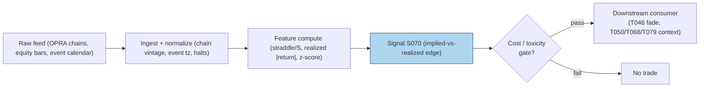

# S070 — Straddle-implied move vs realized

A **straddle** is buying (or selling) a call and a put at the same strike and expiry --- a bet that pays off if the stock moves a lot in either direction. An **at-the-money (ATM)** straddle --- strike near the current stock price --- is the market's cleanest statement of how big a move it expects: divide the straddle's price by the stock price and you get the **implied move** in percent. If a `$100` [example] stock's ATM straddle costs `$6.20` [example], the market is pricing roughly a ±`6.2`% [example] move. Around scheduled events (earnings, CPI, FOMC), implied volatility is systematically elevated pre-announcement and realized moves come in below implied *on average* --- the **IV crush**. S070 compares the straddle-implied move against realized moves and fades the straddle when it looks rich: sell the consensus move, buy it back after the print. You are not predicting the event's direction --- you are betting the insurance markup exceeds the surprise. Provenance **[SR]** (standard desk reconstruction: practitioner-standard rule, no single canonical published formula verified).

> Tag law: every numeric literal in prose carries one of `[documented]
> [default] [example] [unverified] [internal-est] [measured]` (legend: Appendix
> i v1.0.0). Constants inside cited formulas inherit the formula's tag.
> Bibliographic years, volumes, pages, arXiv IDs, section numbers, rule codes
> (C1–C10), fail-safe codes (F1–F5), module IDs, and machine-parsed §0 data
> fields are identifiers, not literals, and are exempt.

## §1 Five-minute reviewer card

| Row | Value |
|---|---|
| Module | S070 — Straddle-implied move vs realized, v1.1.0 |
| Edge verdict | `NO-DOCUMENTED-EDGE` — no published after-cost trading edge; usable as a conditional event filter (high IV percentile, liquid chains, no macro overlap) |
| After-cost | `COMM-ONLY` — the P&L is decided in dollars after the spread: a `60`% [example] hit rate with small average edge is erased by a `5`–`10`% [example] option round trip |
| Build cost | Tier M (low end) · `20`–`40` h [internal-est] · `$3,000`–`$6,000` loaded [internal-est] |
| Data cost | Research `~$0`–`200`/mo [unverified]; production `~$200`–`400`/mo [unverified] — Databento OPRA Standard `$199`/mo announced 2025-06-03 [documented], verify current; Polygon Stocks Advanced `$199`/mo [documented] 2026-09-10; historical pay-as-you-go per GB |
| latency_class | per_event; computed from the chain snapshot before the event close |
| risk_class | high (event gaps; genuine information shocks) |
| Capacity | `$5`–`50`M/day notional [example] --- event options go one-sided on real news |
| Executability | Feasible: one-liner formula; the work is event-study hygiene. |
| Risk summary | Illiquid chains: the "implied move" is a stale midpoint; macro overlap (CPI on earnings day) flips the outcome; the spread is the edge in the 20%-of-premium world |
| When it dies | Genuine information shocks (guidance changes, macro overlap), crowded short-vol positioning, illiquid chains |
| Regime gates | Machine records in §S11 (provisional): R002 amplifies/double at high VRP, halve at low VRP; R005 veto on jump regime; unknown R002 → neutral, unknown R005 → veto |
| Emits | `signal_vector` (Appendix b v1.0.0) — never orders |

## §1.5 Cheapest / least-build path

1. **Prototype hour band:** `20`–`40` h [internal-est] — ATM-strip extractor, implied-move calculator, event-calendar alignment, bid/ask-aware backtest.
2. **Cheapest-source rows** (structured):

   | min_tier | latency_class | required_fields | price_band | build_or_buy |
   |---|---|---|---|---|
   | Tier-0 prototype: Cboe delayed chains + SEC EDGAR earnings calendar | per_event, point-in-time adjusted | ATM call/put bid+ask snapshots, underlying price, event calendar with announcement time, ≥`12` events/name [example] | `~$0`/mo [unverified] — indicative, verify before budgeting | **build** the comparator yourself on bought chains — the formula is a desk standard |
   | Tier-2 production: Databento OPRA Standard + Polygon Stocks Advanced | per_event, real-time snapshots | OPRA.PILLAR TBBO/MBP-1 chain snapshots, 1-min underlying bars, EDGAR calendar | `~$200`–`400`/mo [unverified] — OPRA Standard `$199`/mo announced 2025-06-03 [documented], verify current; Polygon Stocks Advanced `$199`/mo [documented] 2026-09-10 | **buy** the chains, **build** the comparator and the event-study harness |
3. **Resource budget:** `1` core, `<1` GB RAM [internal-est]; compute pattern `per_event`.
4. **Skip list:** Ex-event IV stripping (ORATS-style); post-announcement vol fade (T079 leg); forward-consistent F-denominator variant.
5. **DO-NOT-CUT list:** causality assertions (`assert fill_event >
   signal_event`, no-signal-bar-fills test); COST block + callable
   `expected_cost_bps`; F1–F5 fail-safes + module-state enum; decision-log
   audit records; bona-fide-intent + self-trade prevention; provenance tags on
   every numeric literal; fixtures + `test_cmd`; secrets via env only.
6. **Escalation gate:** universe >`500` names × all events [default] --- needs the full real-time chain (Tier C OPRA `~$2,000`–`20,000`+/mo [unverified]); or intraday straddle timing required.

## §S0 Module contract

### S0.1 Typed signature

```python
def signal(state: ModuleState, events: list[Event], cfg: Config) -> SignalVector:
```

`SignalVector` per Appendix b v1.0.0. `state` is the module-owned named state
vector (`edge_history`, `module_state`, `last_direction`, `last_block_ts`); `events` are canonical Events
(Appendix a v1.0.0), newest last. The function handles documented edge cases:
empty input → `UNKNOWN`; non-positive/non-finite implied, negative/non-finite
realized, or `iv_pct` outside [`0`,`100`] → `UNKNOWN` (F1/F2, never interpolate);
<`2` [example] events → z = `0` [example] (std undefined over one point),
direction `0`, state `OK`; halt/auction/closed → per the market-state table;
stale input (`asof_ts − event_ts > 3` s [default]) → `UNKNOWN`.

### S0.2 Config dataclass

| Parameter | Type | Default | Range | Status |
|---|---|---|---|---|
| `z_star` | float | `1.0` | `0.5–2.0` | calibrate — grid in §S2 calibration recipe |
| `iv_pct_gate` | float | `70.0` | `50–90` | calibrate — grid in §S2 calibration recipe |
| `cost_gate_k` | float | `0.5` | `0.1–2.0` | default — frozen, not fitted |
| `L` | int | `6` | `6–20` | calibrate — trailing-event lookback, grid in §S2 |
| `staleness_ttl_ns` | int | `3_000_000_000` | `1e9–30e9` | default — `3` s staleness TTL |
| `cooldown_s` | float | `60.0` | `30–300` | default — post-compliance-block cooldown (C10) |
| `equity_leg` | bool | `False` | — | default — S070's own fade is options-only |
| `equity_locate_ok` | bool | `True` | — | default — consumer asserts per C7 when `equity_leg` |

All defaults tagged per the tag law. `calibrate` parameters ship with the
walk-forward OOS recipe in §S2; `default` parameters are frozen unless the
recipe's drift trigger fires.

### S0.3 Canonical schema mapping

Vendor columns → canonical Event schema (Appendix a v1.0.0), stated once here:

| Vendor | Canonical |
|---|---|
| ``event` (tape)` | ``bar_id` (int)` |
| ``symbol` (tape)` | ``symbol` (str, e.g. `FICT` [example])` |
| ``event_ts` (tape)` | ``event_ts` (int64 ns UTC)` |
| ``asof_ts` (tape)` | ``asof_ts` (int64 ns UTC)` |
| ``implied_move` (tape)` | ``implied_move` (float, % of price)` |
| ``realized_move` (tape)` | ``realized_move` (float, % of price)` |
| ``iv_pct` (tape)` | ``iv_pct` (float, IV percentile)` |

Runtime-only fields (not in the tape fixture; defaulted in the reference
implementation): `market_state` (defaults `CONTINUOUS_TRADING` [default]),
consumer `locate_ok` (defaults `True` [default]).

### S0.4 Time contract

> Time contract: clock domain UTC, int64 ns; authoritative causality clock =
> `event_ts`; max_skew = `1` ms [default]; jitter budget = `500` µs [default]
> bar-label = open time; staleness TTL = `3` s [default]; gap policy = mask, no interpolation; halt/auction
> → discard contributions across reopen. The signal only resolves at *t+1* (post-print).

**Timing box:** `signal@t (per_event, America/New_York) → earliest fill @open(t+1)`

### S0.5 Market-state table

| State | Module behavior |
|---|---|
| CONTINUOUS_TRADING | Compute normally; emit per cadence |
| HALTED | Freeze state; emit `UNKNOWN`; discard contributions across reopen |
| AUCTION | No new signals; hold last `SignalVector`; state `DEGRADED` |
| CLOSED | Emit nothing; state `OFF` |

### S0.6 Module-state enum + error taxonomy

States per Appendix k v1.0.0: `OK | DEGRADED | UNKNOWN | OFF`. Invalid input →
`UNKNOWN`, never interpolate (Appendix f v1.0.0, F1–F5).

| Failure | State | Alert |
|---|---|---|
| Missing/stale input (TTL `3` s [default]) | `UNKNOWN` | page |
| Inputs out of mathematical bounds (F2) | `UNKNOWN` | page |
| `seq` gap > `1,000` events [default] | `DEGRADED` (restart windows) | log |
| Feed jitter > budget persistently | `DEGRADED` | notify |
| Halt/auction | `UNKNOWN` / `DEGRADED` (per table) | log |
| Kill/administrative disable | `OFF` | page |
| Anything unmapped | `UNKNOWN` | page |

### S0.7 Ops tail

- **Schedule:** per-event (earnings/macro calendar); snapshot the chain before the event close; US equities regular session `09:30`–`16:00` America/New_York [documented]; owner: vol-analytics on-call.
- **Health checks:** fixture replay (`test_cmd`) green on deploy; live
  `seq`-gap monitor; staleness watchdog at `3`× cadence.
- **Alert table:** page on `UNKNOWN` > `30` s [default] or bounds violation;
  notify on `DEGRADED`; log on single dropped events.
- **Resource budget:** `1` core, `<1` GB RAM [internal-est]; state is O(events) per name.
- **Runbook stub:** `1.` confirm feed (vendor status); `2.` replay fixture;
  `3.` if red → set `OFF`, page; `4.` reconcile decision log before re-arm.

### S0.8 Secrets (env-only)

`DATABENTO_API_KEY` via environment only. No secrets in
this file, fixtures, or logs (CI secrets-grep).

### S0.9 May / must-NOT

> **May:** emit `SignalVector` records per Appendix b v1.0.0. **Must-NOT:**
> emit orders, order intents, prices, share counts, or notionals; call a
> broker; mutate shared state outside `state`; interpolate across gaps.

## §S1 Legacy (subsumed by §1)

Legacy §S1 content is the §1 reviewer card above; this header is retained so
section numbering stays frozen.

## §S2 Specification

### Universe

Liquid optionable names with two-sided ATM quotes around scheduled events; ≥`12` events/name history [example].

### Entry rule (Boolean — no prose-only conditions)

```
FADE_RICH    := (z > z_star) AND (iv_pct > iv_pct_gate) AND (expected_cost_bps(notional=1.0 [example], adv_pct=0.001 [example], venue="CBOE" [example], side="taker" [default], urgency="normal" [example]) <= cost_gate_k * edge_bps)   # sell the rich straddle [example convention]
FLAT         := otherwise → UNKNOWN on invalid input (F1/F2); direction 0 on stale input, halt/auction per §S0.5, inside cooldown (C10), locate block (C7), or cost-gate veto

`ImpliedMove = (C_ATM + P_ATM) / S` (mid prices, fraction) [example desk reconstruction];
`edge = ImpliedMove − M_realized`, `M_realized = |S_after − S_before| / S_before` [example];
`z = (edge − μ_L) / σ_L` vs trailing `L = 6` [example] events (fixture convention; population std, ddof=0);
`z_star = 1.0` [example], `iv_pct_gate = 70.0` [example];
`edge_bps = z * 80.0` [example]; `confidence = min(1, z / 2.0)` [example].
Comparisons are strict `>`: `z == z_star` or `iv_pct == iv_pct_gate` stays flat [example rule].
```

### Exits (with post-exit cooldown)

```
Post-print resolution: direction returns to 0 after the realized move is measured (t+1).
ON_STATE: module_state != OK → emit `DEGRADED`; `60` s [default] cooldown after any compliance block (C10).
```

### Position sizing (fenced function)

```python
def size_shares(risk_budget_R, stop_distance, vol_estimate, adv_shares, confidence, cost):
    # S-module requests capital fraction only; share math lives in the strategy.
    # vol_estimate, cost: reserved for strategy-side sizing; unused at signal level [default].
    risk_notional = risk_budget_R * 0.5 * confidence          # [default] 0.5 factor
    shares = risk_notional / max(stop_distance, 1e-9)
    adv_cap = 0.001 * adv_shares                              # 0.1% ADV cap [default]
    return int(min(shares, adv_cap))
```

### Risk limits

| Limit | Value |
|---|---|
| Max capital fraction per signal | `0.5` [default] --- signal module; strategy enforces |
| Fade threshold | `z > 1.0` calibrate AND `iv_pct > 70` calibrate |
| Dollar-P&L evaluation | mandatory --- evaluate in dollar P&L, not vol points or hit rate % [example rule] |

### COST block (single source of truth)

| Component | Value (bps) | Basis |
|---|---|---|
| Spread (straddle two-leg half-spread on event) | `6.00` | [example] |
| Fees (options) | `0.60` | [example] |
| Borrow (`borrow_bps_per_day`) | `0.00` | [default] — reason: short premium via straddle; no stock borrow |
| Impact (event-day fill slippage) | `3.00` | [example] |
| **Total reference** | `9.60` | [example] |

`fee_schedule_as_of`: `2026-09-01 [unverified]` — placeholder; pin the real
venue schedule before production. `side: taker` [default]; venue/tier/source:
CBOE [example]. Re-stating cost numbers outside this block is a validation failure.

```python
def expected_cost_bps(notional, adv_pct, venue, side, urgency) -> float:
    """Callable cost model — reference stack for S070."""
    spread_bps = 6.00
    fee_bps = 0.60
    borrow_bps = 0.00   # reason: short premium via straddle; no stock borrow [default]
    impact_bps = 3.00
    return spread_bps + fee_bps + borrow_bps + impact_bps
```

### Execution / fill model table

| Aspect | Assumption |
|---|---|
| Latency | Chain snapshot before the event close; realized move measured post-print at *t+1* [example] |
| Partial fills | Two-leg straddles partial-fill on stress; consumers model leg risk |
| Impact | `3.00` bps event-day slippage [example] |
| Adverse fill | Pre-event bid/ask widens as the event approaches; liquidity providers pull quotes --- cross `1.5`–`2`× [example] the normal spread on entry |

### Robustness

Require two-sided quotes with size: illiquid chains show midpoint "implied moves" that no one can trade --- a stale midpoint is not a signal. Snapshot the *actual* chain at the signal timestamp (no closing-chain lookahead). Measure the realized move consistently (or delta-hedge). Z-score the edge vs the name's own event history --- a `6`% [example] implied move is rich for a utility and cheap for a biotech. Exclude overlapping macro catalysts or model them separately. A forward-consistent variant divides by the forward F instead of S for rate-sensitive underlyings.

### Compliance sub-block (C1–C10+)

| Code | Rule: trigger → check → action → log |
|---|---|
| C1 | Self-match prevention: signal module emits no orders; downstream T-modules must set self-trade-prevention flags — S070 asserts the requirement in its `consumes` contract |
| C2 | Bona-fide intent: every emitted `SignalVector` with |direction|=`1` must pass the cost gate; sub-threshold readings emit direction `0`, never a tradeable hint |
| C3 | Message-rate: `≤100` emissions/symbol/s [default]; breach → throttle to `1`/s [default] + alert |
| C4 | Fat-finger trio (applied by consumers; S070 bounds its own outputs): confidence ∈ [`0`,`1`], capital ∈ [`0`,`0.5`], computed_at sane — out-of-bounds → `UNKNOWN` (F2) |
| C5 | Decision log: every emission, veto, and state transition logged per Appendix g v1.0.0, hash-chained |
| C6 | Halt/auction: per §S0.5 market-state table; contributions across reopen discarded |
| C7 | Locate check: SHORT direction requires `locate_ok` from the consumer; S070's fade sells premium via options (short call + short put) --- the consumer asserts locate for any equity leg (Reg-SHO threshold securities → direction `0`) |
| C8 | Public dissemination: no signal values published externally without review gate |
| C9 | Data entitlements: per §S6 Data rights row; entitlement-class change → §1.5 escalation gate |
| C10 | Post-exit cooldown: `60 s` [default] after any exit or compliance block; no re-entry |
| C11 | Two-sided quote rule: no signal on chains without two-sided quotes with size. --- trigger → check → action → log: prevents stale-midpoint trading |
| C12 | Event-calendar alignment: snapshot vintage pinned to the event timestamp; wrong expiry (weekly vs monthly) blocked by calendar check. --- trigger → check → action → log: prevents calendar misfires |

### Parameter table

| Parameter | Symbol | Value | Tag | Sensitivity |
|---|---|---|---|---|
| Event window | — | announcement ± `1` day | [example] | medium |
| History lookback | `L` | `6` events (fixture); `8`–`20` live | calibrate | high |
| Fade threshold | `z_star` | `1.0` | calibrate | high |
| IV percentile gate | `iv_pct_gate` | `70` | calibrate | medium |
| Cost-gate k | `cost_gate_k` | `0.5` | [default] | low |

### Parameter calibration recipe (walk-forward OOS)

Fittable: `z_star`, `iv_pct_gate`, `L`. Frozen: `cost_gate_k` (`0.5` [default]),
staleness/cooldown (operational defaults).

- **Grids** [example]: `z_star ∈ {0.5, 0.75, 1.0, 1.25, 1.5, 1.75, 2.0}`;
  `iv_pct_gate ∈ {50, 55, …, 90}`; `L ∈ {6, 8, 12, 16, 20}`.
- **Fold design:** expanding-window walk-forward over event time; each fold =
  `12` months train [example], step `3` months [example]; minimum `40` OOS
  events per fold [example].
- **Embargo:** `30` calendar days [example] between train-end and test-start —
  an event's trailing-`L` history must not leak across the fold boundary.
- **Selection metric:** OOS mean net dollar P&L per event at `COMM-ONLY` cost
  level; tie-break = smaller max drawdown. DSR/PBO: not computed (selection
  disclosure per template).
- **Freeze rule:** take the per-fold winner median; freeze `4` quarters
  [example]; recalibrate if live OOS edge decays by more than `25`% [example]
  versus the frozen estimate.
- **Status:** `z_star`, `iv_pct_gate`, `L` → `calibrate`; all other parameters
  `fixed`/`default`.

### Timing box

`signal@t (per_event, America/New_York) → earliest fill @open(t+1)`

## §S3 Math + normative pseudocode

Implied move (standard desk reconstruction --- [SR]):

$$\text{ImpliedMove} = \frac{C_{\mathrm{ATM}} + P_{\mathrm{ATM}}}{S} \quad\text{[example desk reconstruction]}$$

$$M_{\text{realized}} = \frac{|S_{\text{after}} - S_{\text{before}}|}{S_{\text{before}}}, \qquad \text{edge}_t = \text{ImpliedMove}_t - M_{\text{realized},t}, \qquad z_t = \frac{\text{edge}_t - \mu_L}{\sigma_L} \quad\text{[example]}$$

**Normative pseudocode** (pseudocode is normative; prose is commentary):

```
function signal(state, bars, cfg) -> SignalVector:
    # --- input guards (F1/F2): invalid input -> UNKNOWN, never interpolate
    require bars non-empty else return UNKNOWN("empty input")                       # F1
    b = bars[-1]
    require isfinite(b.implied_move) and b.implied_move > 0
        else return UNKNOWN("non-positive implied_move")                            # F2
    require isfinite(b.realized_move) and b.realized_move >= 0
        else return UNKNOWN("invalid realized_move")                                # F2
    require isfinite(b.iv_pct) and 0.0 <= b.iv_pct <= 100.0
        else return UNKNOWN("iv_pct outside [0,100]")                              # F2
    # --- staleness guard
    staleness = b.asof_ts - b.event_ts                                              # ns [fixed] int64
    require staleness <= cfg.staleness_ttl_ns else return UNKNOWN("stale")         # 3 s [default]
    # --- market-state gates (§S0.5)
    mkt = b.market_state if present else "CONTINUOUS_TRADING"                       # [default]
    if mkt == "HALTED":  return UNKNOWN("halted")                                  # freeze; discard contributions across reopen
    if mkt == "AUCTION": return hold_last(state) -> (direction=state.last_direction, module_state="DEGRADED")
    if mkt == "CLOSED":  return (direction=0, module_state="OFF")                  # emit nothing
    # --- post-compliance-block cooldown (C10)
    if state.last_block_ts is not None and (b.event_ts - state.last_block_ts) < cfg.cooldown_s * 1e9 [fixed]:
        return (direction=0, confidence=0.0, module_state="OK")                    # 60 s [default]
    # --- edge arithmetic: every symbol bound; population std (ddof=0) pinned
    hist  = bars[-cfg.L:]                                                          # trailing L events; L=6 [example]
    edges = [r.implied_move - r.realized_move for r in hist]                       # per-event edge, pct points [example]
    n  = len(edges)
    mu = sum(edges) / n
    sd = sqrt(sum((e - mu)^2 for e in edges) / n) if n > 1 else 0.0                 # population std [example fixture convention]
    z  = (edges[n-1] - mu) / sd if sd > 0 else 0.0
    # --- fade rule: strict >; z == z_star or iv_pct == iv_pct_gate stays flat
    direction  = -1 if (z > cfg.z_star and b.iv_pct > cfg.iv_pct_gate) else 0      # [example]
    confidence = min(1.0, z / 2.0) if direction != 0 else 0.0                      # [example] scale
    # --- locate gate (C7): S070's own fade is options-only; the consumer asserts locate for any equity leg
    if direction == -1 and cfg.equity_leg and not cfg.equity_locate_ok:            # equity_leg=False [default]
        state.last_block_ts = b.event_ts
        return (direction=0, confidence=0.0, module_state="OK")
    # --- executable cost-gate predicate
    edge_bps = z * 80.0                                                           # modeled per-trade edge, bps [example]
    cost = expected_cost_bps(notional=1.0 [example], adv_pct=0.001 [example],
                             venue="CBOE" [example], side="taker" [default],
                             urgency="normal" [example])                           # = 9.60 bps [example]
    if not (cost <= cfg.cost_gate_k * edge_bps):                                  # k = 0.5 [default]
        direction, confidence = 0, 0.0                                             # cost veto
    # --- causality: earliest fill is @open(t+1); no signal-bar fills, ever
    fill_event_ts = b.event_ts + one_session_ns                                    # [fixed] 6.5 h in ns
    assert fill_event_ts > b.event_ts                                             # fill_event > signal_event
    state.last_direction = direction
    return SignalVector(symbol=b.symbol, direction=direction, confidence=confidence,
                        capital=0.5 * confidence [default], computed_at=b.event_ts,
                        staleness=staleness, module_state="OK")
```

Causality: computed from the chain snapshot *before* the event close; the position is opened pre-announcement and the realized move is measured after --- strictly causal, no lookahead, but the signal only resolves at *t+1*. Mandatory unit test: no-signal-bar fills (`fill_event_ts > computed_at` pinned in `test_no_signal_bar_fills`).

## §S4 Worked example (fixture-backed)

- Tape: `modules/fixtures/S070_tape.csv` — `# TYPE: validation-run`;
  `6` rows (synthetic `6`-event [example] tape, fictional ticker `FICT`, seed `70`), all numbers synthetic,
  seed `70` [example]; `event_ts`/`asof_ts` int64 ns UTC.
- Expected outputs: `modules/fixtures/S070_expected.csv` — per-event `edge`, `z`, `direction`.
- Edge cases: `modules/fixtures/S070_edge_cases.csv` — `# TYPE: validation-run`;
  single-bar rows pinning boundary/invalid/market-state behavior: zero/negative/NaN/inf
  `implied_move` → `UNKNOWN` (F2); negative/NaN `realized_move` → `UNKNOWN` (F2);
  zero `realized_move` → `OK` (valid: no post-event move); `iv_pct` outside
  [`0`,`100`] or NaN → `UNKNOWN` (F2); `asof_ts − event_ts = 10` s >
  `3` s TTL [default] → `UNKNOWN`; `HALTED` → `UNKNOWN`; `AUCTION` → `DEGRADED`
  (hold last); `CLOSED` → `OFF`.
- Tolerance: `1e-9 [default]` on floats; integers exact.
- Hand-checks: ['event-`0` edge `2.8000` [measured], z `0.3315701806` [measured], direction=`0` [measured]', 'event-`1` edge `−0.6000` [measured], z `−1.1075854968` [measured], direction=`0` [measured]', 'event-`2` edge `4.4000` [measured], z `1.0088199111` [measured], direction=`−1` [measured] — fade (z>`1`, iv_pct=`92`)', 'event-`4` edge `5.5000` [measured], z `1.4744291009` [measured], direction=`−1` [measured] — richest implied, high IV pct', 'event-`5` edge `−0.2000` [measured], z `−0.9382730642` [measured], direction=`0` [measured]'].
- Acceptance tests (`modules/tests/test_S070.py`, `11` tests):
  `1.` fixture recomputes to expected (event-`2` direction −`1` --- richest implied, high IV pct)
  `2.` stub emits valid `SignalVector` (direction `0`/`−1`, confidence ∈ [0,1], `capital = 0.5 × confidence`, `computed_at == event_ts`, symbol `FICT`)
  `3.` no-signal-bar fills (`fill_event_ts = computed_at + session > computed_at` pinned)
  `4.` cost-gate predicate: `9.60` bps reference passes on huge edge, blocks on tiny edge
  `5.` cost-gate veto path: fade criteria met, punitive `k = 0.01` [example] → direction `0`; default `k` passes
  `6.` invalid inputs → `UNKNOWN` (edge-case fixture loop: zero/negative/NaN/inf implied, negative/NaN realized, bad/NaN iv_pct)
  `7.` market-state gates: `HALTED` → `UNKNOWN`, `AUCTION` → `DEGRADED` hold-last, `CLOSED` → `OFF`
  `8.` boundary thresholds strict: `z == z_star` → flat, `iv_pct == 70` [example] gate → flat, just above → fade
  `9.` staleness: `asof − event = 10` s > `3` s TTL [default] → `UNKNOWN`
  `10.` cooldown (C10): inside `60` s [default] of a block → flat; expired → fade
  `11.` locate gate (C7): `equity_leg` without `locate_ok` → direction `0` + block recorded; with locate → fade
- `test_cmd`: `python3 -m pytest modules/tests/test_S070.py -q` → exits `0`.

**Where the example is optimistic:** `6` synthetic events [example]; no partial fills, no early assignment, no macro overlap; mid-based implied moves --- demonstrates the edge arithmetic and the fade rule, not a backtest.

## §S5 Strategies that use this signal

| Strategy | Role |
|---|---|
| T046 — Straddle-Implied Move Fade | Primary entry trigger: fades overpriced event moves, confirmed by S073 and gated by S069 |
| T050 — GEX Pin / Dealer-Positioning Fade | Context input: the implied move sets the fade zone into expiry |
| T068 — Scheduled-Event Vol Expansion | Veto/positioning: goes the other way pre-event when the implied move is cheap vs history |
| T079 — Post-Announcement Vol Fade | Downstream leg: sells event volatility after realization --- S070 identifies candidates, T079 times the exit |

## §S6 Data required

| Field | Type | Granularity | Source: vendor / product / endpoint | Required fields | Price band (as-of) |
|---|---|---|---|---|---|
| Options quotes (ATM chain) | bid/ask | intraday snapshots / EOD | Databento / OPRA.PILLAR / `GET /v0/timeseries.get_range` [unverified] | `ts_event`, bid/ask for the ATM call+put pair, strike, expiry, underlying symbol [unverified exact field names — verify against the Databento DBN schema] | OPRA Standard `$199`/mo [documented — announced 2025-06-03, verify current]; historical pay-as-you-go per GB, e.g. OPRA.PILLAR TBBO `$210`/GB [documented 2024-04-01] |
| Options chains (prototype) | bid/ask | EOD / 15-min delayed | Cboe / delayed chains via DataShop [unverified] | ATM bid/ask, underlying price, expiry | `~$0` [unverified] — cheapest-source candidate |
| Underlying price | float ($) | 1-min / daily | Polygon / Stocks v3 / aggregates + snapshot endpoints [unverified] | OHLC, volume, 1-min bars for the event window | Stocks Advanced `$199`/mo [documented] 2026-09-10; options coverage on Advanced per third-party summary [unverified] |
| Earnings/macro calendar | dates | daily | SEC EDGAR / company filings [documented] | announcement date-time, before/after-open flag | `$0` [documented] — public filings |
| Implied earnings move (vendor) | float (%) | per event | Cboe DataShop / Implied Earnings Move, spec V1.0 [documented] | `Underlyer`, `EarnImpliedPctMove`, `Updated` [documented] | via Cboe sales [unverified] |
| Historical event moves | float (%) | per event | built from bars above; vendor series available | same as underlying price | included in the bands above |

**Data rights row** (Appendix j v1.0.0): Options chains via Databento OPRA, `rights: licensed`; license scope = research + stated production symbol count; raw ticks never leave our systems --- fixtures are synthetic; entitlement-class change → §1.5 escalation gate.

## §S7 Local build (M5 Max / 128 GB)

Feasible (Tier M, low end). The signal is arithmetic on a handful of quotes per event; a decade of ATM-strip snapshots for `500` [example] names is a few GB --- far under the `77` GB working budget (cost-model §3). Bottleneck: **event-study hygiene** (calendar alignment, chain vintages, bid/ask execution), not compute. Stack: **Python+polars+DuckDB** --- **Tier M, 20–40 h ≈ $3,000–$6,000 loaded** (cost-model §5).

## §S8 Buy vs build

**Build the comparator, buy the chains.** The formula is a one-liner; the work is the event calendar, chain vintages, and bid/ask-aware backtesting. Crossover: buy Tier-2 the day you backtest seriously --- midpoint-based event studies on free data systematically overstate the edge (the spread *is* the edge in the 20%-of-premium world). Indicative bands: Tier 1 `~$0`–`200`/mo [unverified]; Tier 2 `~$200`–`2,000`/mo [unverified] --- indicative, verify before budgeting.

## §S9 Efficacy — documented evidence

| Study / source | Market & period | Metric | Before/after cost | Caveat |
|---|---|---|---|---|
| Journal of Risk --- "Earnings moves and pre-earnings implied volatility" [documented] | Listed US stocks, `3` calendar years | Options market predicts the *magnitude* of earnings moves well in most cases, with significant outliers; return distribution symmetric | `BEFORE-COST` forecast accuracy, not traded P&L | describes pricing accuracy, not a fade strategy's P&L |
| ORATS methodology (LULU example, `8/2018`) [documented] | Single name, last `12` earnings | Implied earnings move `10.93`% vs average actual move `11.698`% | `BEFORE-COST` practitioner measurement | one name, one window --- illustrative, not a statistical claim |
| Nasdaq practitioner literature (IV-crush explainers) [documented] | US equity options | IV systematically elevated pre-announcement, collapses after; straddle sellers profit when realized < implied | `BEFORE-COST` educational | no hit rates or P&L reported |

**Honest bottom line.** IV is elevated pre-announcement and falls after; realized moves come in below implied **on average --- not universally**. Published-style hit rates in the **mid-50s to low-60s** for broad liquid samples are a chatbot lead (unverified --- see Unverified leads), and a `60`% [example] hit rate is not automatically attractive: a `5`–`10`% [example] option round trip can erase a small average edge. **As a standalone trigger this is a modest, cost-sensitive edge; as a conditional event filter (high IV percentile, liquid chains, no macro overlap) it is a documented and usable one.** Evaluate in dollar P&L.

## §S10 Failure modes & pitfalls

| # | Trigger → Detect → Action → Recovery | check: |
|---|---|---|
| 1 | Lookahead leakage → using the post-event chain or corrected prints to price the pre-event straddle → detect: snapshot-vintage audit → action: pin the snapshot vintage → recovery: re-timestamp | `snapshot vintage [example rule]` |
| 2 | Stale chains → midpoint "implied moves" that no one can trade → detect: two-sided-quote check → action: require two-sided quotes with size → recovery: veto the event | `two-sided quotes [example rule]` |
| 3 | Crowding/alpha decay → the earnings fade is textbook → detect: crowded-short scan → action: condition on IV percentile, not habit → recovery: stand down | `IV percentile [example rule]` |
| 4 | Cost blowup → cheap wings live in the 20%-of-premium world → detect: round-trip cost model → action: model both legs at bid/ask plus fees (`~$0.65`/contract/side [unverified]) → recovery: resize | `bid/ask modeling [example rule]` |
| 5 | Regime breaks → macro overlap (CPI on earnings day), guidance shocks → detect: overlapping-event scan → action: exclude or separately model → recovery: veto | `macro overlap [example rule]` |
| 6 | Overfitting → z-thresholds and lookbacks tuned on a handful of events per name → detect: tuning audit → action: pool across names or accept wide error bars → recovery: freeze | `freeze thresholds [example rule]` |
| 7 | Data errors → wrong expiry (weekly vs monthly), early-close calendars → detect: calendar mismatch → action: calendar check on expiry → recovery: correct | `expiry check [example rule]` |
| 8 | Microstructure confusion → straddle mid moves with the underlying into the print → detect: delta drift → action: measure consistently or delta-hedge → recovery: correct | `delta-hedge [example rule]` |

## §S11 Visuals


### Regime gates (machine records — provisional until the R-annotation pass)

```yaml
regime_gates:
  - regime_id: R002
    version_pin: v1.0.0
    direction: amplifies
    mechanism: "Fade edge is the event VRP; a wide positive implied-vs-realized spread gives the z-threshold fade a larger cushion."
    condition: "R002.state == HIGH_VRP  # VRP percentile > 70 [internal-est]"
    action: double
    min_lag: 1          # events [example]
    unknown_behavior: neutral   # R002 UNKNOWN -> no size change [default]
  - regime_id: R002
    version_pin: v1.0.0
    direction: degrades
    mechanism: "Low/negative VRP: straddles priced near or below recent realized moves; the fade has no cushion."
    condition: "R002.state == LOW_VRP  # VRP percentile < 30 [internal-est]"
    action: halve
    min_lag: 1          # events [example]
    unknown_behavior: neutral   # [default]
  - regime_id: R005
    version_pin: v1.0.0
    direction: degrades
    mechanism: "Jump-dominated moves gap through the short straddle; the fade is not compensated for discontinuity risk."
    condition: "R005.state == JUMP_ACTIVE  # [internal-est]"
    action: veto
    min_lag: 1          # events [example]
    unknown_behavior: veto      # restrictive default [default]
```

State names (`HIGH_VRP`, `LOW_VRP`, `JUMP_ACTIVE`) are this module's provisional
design choices, not R002/R005 published enums — re-pin during the R-annotation
pass.



## §S12 Source log + unverified leads

**Sources** (citable facts only):

['1. "Earnings moves and pre-earnings implied volatility." *Journal of Risk* [documented]. https://www.risk.net/journal-of-risk/7960706/earnings-moves-and-pre-earnings-implied-volatility --- options market predicts the magnitude of earnings moves well in most cases, with significant outliers; return distribution symmetric.', '2. Nasdaq [documented]. "Understanding Earnings Crush Implied Volatility." https://www.nasdaq.com/articles/understanding-earnings-crush-implied-volatility --- IV systematically elevated pre-announcement, collapses after; straddle sellers profit when realized < implied.', '3. Nasdaq [documented]. "What an Implied Volatility Crush is and How to Avoid It." https://www.nasdaq.com/articles/what-an-implied-volatility-crush-is-and-how-to-avoid-it-2021-07-09.', '4. ORATS [documented]. "How ORATS Removes Earnings Effect from Implied Volatility." https://orats.com/blog/how-orats-removes-earnings-effect-from-implied-volatility --- ex-event IV construction (à la ORATS).', '5. Cboe DataShop [documented]. "Implied Earnings Move Specification" (vendor implied-move methodology). https://datashop.cboe.com/documents/ft_products/ImpliedEarningsMove_Specifications.pdf.']

**Chatbot source log.** Duck.ai (GPT-5.6 Luna, anonymous, web-search assisted, 2026-09-10) answered Q-SB8-1–Q-SB8-3. Grok/Cursor answers pending (checked 2026-09-10). Chatbot output is leads, never facts.

**Unverified leads** (chatbot-only — never in evidence tables):

['- Duck.ai Q-SB8-3 #2: the straddle-implied-vs-realized framing, the per-round-trip spread arithmetic ($0.40/$0.08 = 20%, $5.00/$0.10 = 2%), and the "evaluate in dollar P&L" guidance --- the arithmetic is operator-verified in S4; quarantined.', '- Published hit rates in the mid-50s-low-60s for broad liquid samples (chatbot lead, tradingview.com) --- not independently verified; quarantined.', '- Any specific after-cost Sharpe ratio for straddle-fade strategies --- unverified chatbot claim; quarantined.', '- The [SR] formula itself is a standard desk reconstruction, not a cited paper.', '- Databento OPRA Standard `$199`/mo --- announced on Databento\'s own blog 2025-06-03 ("Introducing new OPRA pricing plans"); current list price not re-verified; quarantined as as-of.', '- Databento REST endpoint path and DBN field names used in §S6 --- from a third-party research document, not the Databento docs; quarantined.', '- Polygon options coverage on the Advanced plan and endpoint paths --- third-party summary of polygon.io/pricing; the options asset-class tab was not independently confirmed (stocks Advanced `$199`/mo confirmed on polygon.io/pricing 2026-09-10); quarantined.', '- Cboe DataShop Implied Earnings Move product pricing --- Cboe directs to sales; quarantined.', '- CBOE/venue options fee schedule as-of --- not pinned; the COST block stays [example]/[unverified]; pin before production.', '- R002/R005 state names in the §S11 gate conditions (`HIGH_VRP`, `LOW_VRP`, `JUMP_ACTIVE`) --- provisional module-design choices, not the R modules\' published enums; re-pin during the R-annotation pass.']

---

## Appendix — AI build prompt (S070)

Copy-paste into any chat agent:

> Build module **S070 — Straddle-implied move vs realized** (v1.1.0) per
> `notes/module-template.md` v1.0.0 and this file's §S0 contract.
> Cheapest path (§1.5): prototype `20`–`40` h [internal-est]; structured
> cheapest-source rows for Tier-0 prototype (Cboe delayed + EDGAR, `~$0`/mo
> [unverified]) and Tier-2 production (Databento OPRA + Polygon, `~$200`–`400`/mo
> [unverified]); compute pattern `per_event`; skip ex-event IV stripping and
> the forward-denominator variant for now.
> Implement `signal(state, events, cfg) -> SignalVector` (Appendix b v1.0.0)
> with the §S3 normative pseudocode, including the inline guards (F1/F2,
> staleness TTL, halt/auction/closed, post-block cooldown, locate gate C7),
> the cost-gate predicate `expected_cost_bps(...) <= k * edge_bps`, and
> `assert fill_event > signal_event`. Wire F1–F5 (Appendix f v1.0.0): invalid
> input → `UNKNOWN`, never interpolate. Fit `z_star`/`iv_pct_gate`/`L` with the
> §S2 walk-forward OOS recipe; keep `cost_gate_k` frozen. Log decisions per
> Appendix g v1.0.0. Secrets via env only. Run the tape fixture
> `modules/fixtures/S070_tape.csv` (`# TYPE: validation-run`) against
> `modules/fixtures/S070_expected.csv` (tolerance `1e-9 [default]`) and the
> boundary/invalid/market-state rows in `modules/fixtures/S070_edge_cases.csv`.
> **Definition of done:** `python3 -m pytest modules/tests/test_S070.py -q`
> exits `0` (eleven acceptance tests). Tag every numeric literal you add with
> the unified enum (Appendix i v1.0.0); put anything unverifiable in §S12
> unverified leads.
