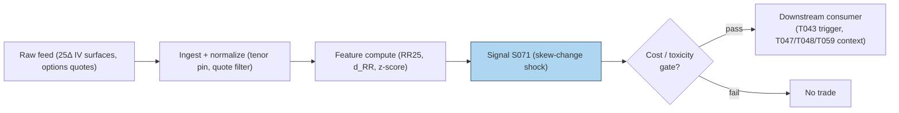

# S071 — 25-delta risk reversal / skew change

A **risk reversal** is a call minus a put: buy a 25-delta call, sell a 25-delta put (or read the difference of their implied volatilities). A **25-delta (25Δ)** option is an out-of-the-money option whose delta is about `0.25` [example] --- a standardized "wings" benchmark across names and maturities. The **25Δ risk reversal** is `call25_IV − put25_IV`: for equities it sits negative (puts are bid relative to calls --- crash insurance), so a *rise* toward zero or positive means demand for upside calls has strengthened relative to downside puts. **Skew** is that same idea across the whole strike curve: how much more expensive out-of-the-money puts are than out-of-the-money calls. S071 watches the *change* in the 25Δ risk reversal --- `d_RR` --- and flags statistically significant daily shifts, which tend to follow informed flow, repositioning ahead of catalysts, or supply/demand shocks in the options market. Provenance **[D]**.

> Tag law: every numeric literal in prose carries one of `[documented]
> [default] [example] [unverified] [internal-est] [measured]` (legend: Appendix
> i v1.0.0). Constants inside cited formulas inherit the formula's tag.
> Bibliographic years, volumes, pages, arXiv IDs, section numbers, rule codes
> (C1–C10), fail-safe codes (F1–F5), module IDs, and machine-parsed §0 data
> fields are identifiers, not literals, and are exempt.

## §1 Five-minute reviewer card

| Row | Value |
|---|---|
| Module | S071 — 25-delta risk reversal / skew change, v1.1.0 |
| Edge verdict | `NO-DOCUMENTED-EDGE` — documented cross-sectional predictability of smirk/skew shape (steepest-smirk underperformance `10.9`%/yr risk-adjusted [documented]; expected-skewness alpha spread `1.00`%/month [documented]), but no published after-cost trading rule for daily 25Δ RR *changes*; usable as a conditional directional/sizing input |
| After-cost | `COMM-ONLY` — risk-reversal structures cross the spread on two legs; desk estimates of the round trip run `5`–`8` bps [example]; reference stack `5.10` bps [example] (see §S2 COST block) |
| Build cost | Tier M (low end) · `20`–`40` h [internal-est] · `$3,000`–`$6,000` loaded [internal-est] |
| Data cost | Research `~$199`–`500`/mo [documented] — Databento OPRA Standard `$199`/mo [documented]; Cboe LiveVol Open-Close end-of-day `$500`/mo [documented] (prices as of 2026-09-10; IV-surface product quoted separately [unverified]) |
| latency_class | daily; tradable no earlier than t+1 on the close print |
| risk_class | medium (two-leg options structure, event tail) |
| Capacity | `$10`–`100`M/day notional [example] --- 25-delta strips are deep in majors |
| Executability | Feasible: IV-surface read + difference + z-score; Tier M low-end. |
| Risk summary | Earnings/FOMC skew shocks: the RR jumps are priced information, not free edge; thin 25Δ wings in small caps |
| When it dies | When skew changes are pure supply noise (market-maker rebalancing), or when the signal's history window includes a regime break |
| Regime gates | Machine records in §S2 (R-EVENT-PROV veto on earnings week; R-STRESS-PROV halve above VIX `35` [example]; R-THIN-PROV veto on stale/one-sided wings) — provisional IDs pending R001–R050 pass |
| Emits | `signal_vector` (Appendix b v1.0.0) — never orders |

## §1.5 Cheapest / least-build path

1. **Prototype hour band:** `20`–`40` h [internal-est] — 25Δ-strip reader, RR differencing, z-score analytics, downstream hookup.
2. **Cheapest-source row (structured):**
   - `min_tier` = Tier-1 bought IV surfaces (Cboe LiveVol Open-Close end-of-day subscription, `$500`/mo [documented]) — the 25Δ strip is the product; the signal arithmetic is trivial
   - `latency_class` = daily, point-in-time adjusted (surface vintage pinned to signal timestamp; no settlement-IV lookahead)
   - `required_fields` = underlying, expiry, tenor, `delta_target`, `call25_iv`, `put25_iv` (% annualized), `quote_age_s`, `two_sided_flag`; timestamps int64 ns UTC; ≥`6` months history [example]
   - `price_band` = `$199`–`500`/mo [documented] as of 2026-09-10 (Databento OPRA Standard `$199`/mo [documented] for self-built strips; Cboe LiveVol Open-Close EOD `$500`/mo [documented]; pure IV-surface product quoted separately [unverified])
   - `build_or_buy` = **build the differencing/z-score analytics on bought 25Δ surfaces --- the signal is arithmetic, the surface is the product**; buy Tier-2 (Databento OPRA Standard) the moment you need historical skew for a real backtest --- rebuilding 25Δ histories from raw quotes is a `100`–`300` h [unverified] IV-inversion job
3. **Resource budget:** `1` core, `<1` GB RAM [internal-est]; compute pattern `per_bar`.
4. **Skip list:** Term-structure of RR (weekly vs monthly); full-smirk slope analytics; intraday RR.
5. **DO-NOT-CUT list:** causality assertions (`assert fill_event >
   signal_event`, no-signal-bar-fills test); COST block + callable
   `expected_cost_bps`; F1–F5 fail-safes + module-state enum; decision-log
   audit records; bona-fide-intent + self-trade prevention; provenance tags on
   every numeric literal; fixtures + `test_cmd`; secrets via env only.
6. **Escalation gate:** universe >`500` names [default]; intraday 25Δ timing required --- inherits the full OPRA budget.

## §S0 Module contract

### S0.1 Typed signature

```python
def signal(state: ModuleState, events: list[Event], cfg: Config) -> SignalVector:
```

`SignalVector` per Appendix b v1.0.0. `state` is the module-owned named state
vector (`rr_history`, `module_state`); `events` are canonical Events
(Appendix a v1.0.0), newest last. The function handles documented edge cases:
empty input → `UNKNOWN`; non-positive/non-finite 25Δ IVs → `UNKNOWN`
(F1/F2, never interpolate); <`3` [example] bars → `UNKNOWN` (insufficient history);
halt/auction → freeze per the market-state table.

### S0.2 Config dataclass

| Parameter | Type | Default | Range | Status |
|---|---|---|---|---|
| `z_star` | float | `2.0` | `1.0–3.0` | calibrate |
| `cost_gate_k` | float | `0.5` | `0.1–2.0` | default |
| `min_bars` | int | `3` | `3–10` | fixed |
| `edge_bps_per_z` | float | `60.0` | `40–80` | calibrate |
| `staleness_ttl_ns` | int | `3_000_000_000` (`3` s) | — | default |
| `cooldown_ns` | int | `60_000_000_000` (`60` s) | — | default |
| `ref_notional` | float | `100_000.0` | — | example |
| `locate_ok` | bool | `True` | — | default |
| `symbol` | str | `"TEST"` | — | default |

All defaults tagged per the tag law.

### S0.3 Canonical schema mapping

Vendor columns → canonical Event schema (Appendix a v1.0.0), stated once here:

| Vendor | Canonical |
|---|---|
| `day` (tape) | `bar_id` (int) |
| `event_ts` (tape) | `event_ts` (int64 ns UTC) |
| `asof_ts` (tape) | `asof_ts` (int64 ns UTC) |
| `call25_iv` (tape) | `call25_iv` (float, % annualized IV) |
| `put25_iv` (tape) | `put25_iv` (float, % annualized IV) |

### S0.4 Time contract

> Time contract: clock domain UTC, int64 ns; authoritative causality clock =
> `event_ts`; max_skew = `1` ms [default]; jitter budget = `500` µs [default]
> bar-label = open time; staleness TTL = `3` s [default]; gap policy = mask, no interpolation; halt/auction
> → discard contributions across reopen. Computed on the daily close print; tradable no earlier than t+1.

**Timing box:** `signal@t (per_bar, America/New_York) → earliest fill @open(t+1)`

### S0.5 Market-state table

| State | Module behavior |
|---|---|
| CONTINUOUS_TRADING | Compute normally; emit per cadence |
| HALTED | Freeze state; emit `UNKNOWN`; discard contributions across reopen |
| AUCTION | No new signals; hold last `SignalVector`; state `DEGRADED` |
| CLOSED | Emit nothing; state `OFF` |

### S0.6 Module-state enum + error taxonomy

States per Appendix k v1.0.0: `OK | DEGRADED | UNKNOWN | OFF`. Invalid input →
`UNKNOWN`, never interpolate (Appendix f v1.0.0, F1–F5).

| Failure | State | Alert |
|---|---|---|
| Missing/stale input (TTL `3` s [default]) | `UNKNOWN` | page |
| Inputs out of mathematical bounds (F2) | `UNKNOWN` | page |
| `seq` gap > `1,000` events [default] | `DEGRADED` (restart windows) | log |
| Feed jitter > budget persistently | `DEGRADED` | notify |
| Halt/auction | `UNKNOWN` / `DEGRADED` (per table) | log |
| Kill/administrative disable | `OFF` | page |
| Anything unmapped | `UNKNOWN` | page |

### S0.7 Ops tail

- **Schedule:** daily on the options close print; US equities regular session `09:30`–`16:00` America/New_York [documented]; owner: vol-analytics on-call.
- **Health checks:** fixture replay (`test_cmd`) green on deploy; live
  `seq`-gap monitor; staleness watchdog at `3`× cadence.
- **Alert table:** page on `UNKNOWN` > `30` s [default] or bounds violation;
  notify on `DEGRADED`; log on single dropped events.
- **Resource budget:** `1` core, `<1` GB RAM [internal-est]; state is O(window) per symbol.
- **Runbook stub:** `1.` confirm feed (vendor status); `2.` replay fixture;
  `3.` if red → set `OFF`, page; `4.` reconcile decision log before re-arm.

### S0.8 Secrets (env-only)

`CBOE_LIVEVOL_KEY`, `DATABENTO_API_KEY` via environment only. No secrets in
this file, fixtures, or logs (CI secrets-grep).

### S0.9 May / must-NOT

> **May:** emit `SignalVector` records per Appendix b v1.0.0. **Must-NOT:**
> emit orders, order intents, prices, share counts, or notionals; call a
> broker; mutate shared state outside `state`; interpolate across gaps.

## §S1 Legacy (subsumed by §1)

Legacy §S1 content is the §1 reviewer card above; this header is retained so
section numbering stays frozen.

## §S2 Specification

### Universe

Liquid optionable names with stable 25Δ strips; ≥`6` months history [example].

### Entry rule (Boolean — no prose-only conditions)

```
RR_UP      := (z > z_star) AND (expected_cost_bps(...) <= cost_gate_k * edge_bps)    # upside-skew shock [example convention]
RR_DOWN    := (z < -z_star) AND (expected_cost_bps(...) <= cost_gate_k * edge_bps)   # downside-skew shock [example convention]
FLAT       := otherwise → UNKNOWN on invalid input

`RR25 = call25_iv − put25_iv`; `d_RR = RR25_t − RR25_{t−1}` (first value `0` [example]);
`z = (d_RR − μ_hist) / σ_hist` vs trailing window, population SD [example];
`z_star = 2.0` [example]; `edge_bps = |z| * 60.0` [example];
`confidence = min(1, |z| / 4.0)` [example].
```

### Exits (with post-exit cooldown)

```
Shock decays: direction returns to 0 when |z| <= z_star.
ON_STATE: module_state != OK → emit `DEGRADED`; `60` s [default] cooldown after any compliance block (C10).
```

### Position sizing (fenced function)

```python
def size_shares(risk_budget_R, stop_distance, vol_estimate, ADV_cap, cost):
    # S-module requests capital fraction only; share math lives in the strategy.
    # Reference: capital = 0.5 * confidence  (confidence in [0,1])  [default]
    risk_notional = risk_budget_R * 0.5 * confidence          # [default] 0.5 factor
    shares = risk_notional / max(stop_distance, 1e-9)
    return int(min(shares, ADV_cap * adv_shares * 0.001))     # 0.1% ADV cap [default]
```

### Risk limits

| Limit | Value |
|---|---|
| Max capital fraction per signal | `0.5` [default] --- signal module; strategy enforces |
| Skew-shock threshold | `|z| > 2.0` [example] on daily `d_RR` |
| Minimum history | `3` bars [example] before any z-score (else `UNKNOWN`) |

### COST block (single source of truth)

| Component | Value (bps) | Basis |
|---|---|---|
| Spread (risk-reversal two-leg half-spread) | `3.00` | [example] |
| Fees (options) | `0.60` | [example] — anchor: OCC clearing `$0.025`/contract [documented] (info memo #55624, eff. 2025-01-01 [documented]) + Cboe EDGX Customer remove-liquidity `($0.01)`/contract i.e. rebate [documented]; `0.60` bps ≈ `20` contracts × `$0.025` = `$0.50` on an `$83`k notional [example]; venue rate schedule re-pinned quarterly |
| Borrow | `0.00` | [default] — reason: options-only structure; no stock borrow involved |
| Impact (skew-shock fill slippage) | `1.50` | [example] |
| **Total reference** | `5.10` | [example] |

`borrow_bps_per_day`: `0.00` [default] — reason: options-only structure, no stock borrow involved.
`fee_schedule_as_of`: `2026-08-10 [documented]` — Cboe EDGX Options fee schedule (cboe.com, observed 2026-08) and OCC Schedule of Fees (info memo #55624, eff. 2025-01-01 [documented]); re-pin quarterly before production. `side: taker` [default]; venue/tier/source: Cboe EDGX [example]. Re-stating cost numbers outside this block is a validation failure.

```python
def expected_cost_bps(notional, adv_pct, venue, side, urgency) -> float:
    """Callable cost model — reference stack for S071. Mirrors the COST block exactly."""
    spread_bps = 3.00
    fee_bps = 0.60
    borrow_bps = 0.00   # reason: options-only structure [default]
    impact_bps = 1.50
    return spread_bps + fee_bps + borrow_bps + impact_bps
```

### Execution / fill model table

| Aspect | Assumption |
|---|---|
| Latency | Computed at the daily options close; intent no earlier than next session open [example] |
| Partial fills | Two-leg structure partial-fill modeled by consumers |
| Impact | `1.50` bps skew-shock fill slippage [example] |
| Adverse fill | Skew-shock days widen wing spreads as market makers reprice; cross `1.5`–`2`× [example] normal half-spread on entry |

### Robustness

Differencing removes the level (which is regime-dependent); z-scoring uses the name's own `d_RR` history. Use the same expiry tenor consistently --- mixing weeklies and monthlies in the 25Δ strip corrupts `d_RR`. Pin the surface vintage to the signal timestamp (no settlement-IV lookahead). Treat the first `d_RR` as `0` [example], never as missing (F1). The live z-score must be computed from history available through bar *t* only; the fixture's validation convention (one full-sample mean/SD over the five non-initial differences, applied to all rows) is a validation convenience, not a live rule --- see §S4 note.

#### Regime gates (machine records)

```yaml
regime_gates:
  - regime_id: R-EVENT-PROV
    direction: degrades
    mechanism: "earnings/FOMC repricing inflates RR changes; the jumps are priced information, not alpha"
    condition: "days_to_earnings(symbol) in [-5, 1] trading days"
    action: veto
    min_lag: 0
    unknown_behavior: veto
  - regime_id: R-STRESS-PROV
    direction: amplifies
    mechanism: "market stress widens wing spreads; stale wings create phantom z"
    condition: "VIX_close > 35"
    action: halve
    min_lag: 1
    unknown_behavior: halve
  - regime_id: R-THIN-PROV
    direction: inverts
    mechanism: "thin 25Δ wings produce phantom RR jumps from stale or one-sided quotes"
    condition: "wing_quote_age_s > 300 or not two_sided_flag"
    action: veto
    min_lag: 0
    unknown_behavior: veto
```

Provisional IDs; final regime IDs land in the R001–R050 annotation pass. Restrictive default: `unknown_behavior` is never "ignore".

### Compliance sub-block (C1–C10+)

| Code | Rule: trigger → check → action → log |
|---|---|
| C1 | Self-match prevention: signal module emits no orders; downstream T-modules must set self-trade-prevention flags — S071 asserts the requirement in its `consumes` contract |
| C2 | Bona-fide intent: every emitted `SignalVector` with |direction|=`1` must pass the cost gate; sub-threshold readings emit direction `0`, never a tradeable hint |
| C3 | Message-rate: `≤100` emissions/symbol/s [default]; breach → throttle to `1`/s [default] + alert |
| C4 | Fat-finger trio (applied by consumers; S071 bounds its own outputs): confidence ∈ [`0`,`1`], capital ∈ [`0`,`0.5`], computed_at sane — out-of-bounds → `UNKNOWN` (F2) |
| C5 | Decision log: every emission, veto, and state transition logged per Appendix g v1.0.0, hash-chained |
| C6 | Halt/auction: per §S0.5 market-state table; contributions across reopen discarded |
| C7 | Locate check: SHORT direction requires `locate_ok` from the consumer; S071 never emits SHORT without the consumer asserting locate (Reg-SHO threshold securities → direction `0`) |
| C8 | Public dissemination: no signal values published externally without review gate |
| C9 | Data entitlements: per §S6 Data rights row; entitlement-class change → §1.5 escalation gate |
| C10 | Post-exit cooldown: `60 s` [default] after any exit or compliance block; no re-entry |
| C11 | Tenor consistency: the 25Δ strip must use one expiry tenor; mixed tenors vetoed. --- trigger → check → action → log: prevents strip corruption |
| C12 | Surface vintage: signal timestamped to the actual surface vintage at time *t*; no settlement-IV lookahead. --- trigger → check → action → log: prevents lookahead leakage |

### Parameter table

| Parameter | Symbol | Value | Tag | Sensitivity |
|---|---|---|---|---|
| Delta benchmark | `Δ` | `25` | [example] | medium |
| Entry z-score | `z_star` | `2.0` | [example] | high |
| Minimum bars | — | `3` | [example] | low |
| Cost-gate k | `cost_gate_k` | `0.5` | [default] | low |
| Edge per z unit | `edge_bps_per_z` | `60.0` | [example] | medium |

#### Calibration recipes (per-parameter grid + walk-forward OOS selection)

- `z_star` [calibrate]: grid {`1.5`, `2.0`, `2.5`, `3.0`} [default]; `4` [default] rolling folds over ≥`6` years [example] of daily 25Δ prints (calibrate `12` mo → test `6` mo, step `6` mo [default]); embargo `5` trading days [default] after each calibration window end (event-contamination buffer); selection metric = mean OOS net bps/trade under the COMM-ONLY stack with the cost gate applied [default]; freeze rule = freeze the grid point with the best mean metric, but if the best-vs-adjacent delta is < `2` bps/trade [example] prefer `2.0` [default]; re-fit annually; pool across names, never fit per-name (§S10 #6).
- `edge_bps_per_z` [calibrate]: grid {`40`, `60`, `80`} [example]; same folds, embargo, and metric as `z_star`; freeze jointly with `z_star`.
- `cost_gate_k` [default] `0.5`: no grid — policy constant (proposal open item: `0.5` vs `2.0` unresolved); quarterly re-validation: gate pass-rate on `|z| > 2` [example] days must stay within [`5`, `40`]% [example], else escalate to §1.5 escalation gate.
- `min_bars`, Δ=`25` [fixed]: convention; never fit.

History constraint: Databento OPRA.PILLAR history starts 2023-03-28 [documented] — fewer than `6` years [example] from retail pipes; use Cboe LiveVol history for the full `6`-year [example] folds or accept shorter folds and disclose.

### Timing box

`signal@t (per_bar, America/New_York) → earliest fill @open(t+1)`

## §S3 Math + normative pseudocode

$$RR25_t = \mathrm{call25\_IV}_t - \mathrm{put25\_IV}_t, \qquad d\_RR_t = RR25_t - RR25_{t-1}, \qquad z_t = \frac{d\_RR_t - \mu}{\sigma} \quad\text{[example]}$$

with `μ`, `σ` (population) over the causal trailing `d_RR` history through bar *t* [example].

**Normative pseudocode** (pseudocode is normative; prose is commentary; every symbol below is bound inline):

```
function signal(state, events, cfg) -> SignalVector:
    # --- ingest: events -> canonical bars, newest last ---
    bars = [e for e in events if e.type == "BAR"] sorted by e.event_ts ascending
    if len(bars) == 0:
        return SignalVector(cfg.symbol, 0, 0.0, 0.0, 0, 0, "UNKNOWN")     # F1 empty [default]
    b = bars[-1]
    staleness_ns = b.asof_ts - b.event_ts                                 # bound once
    # --- runtime guards (inline) ---
    if state.get("module_state") == "OFF":
        return SignalVector(cfg.symbol, 0, 0.0, 0.0, b.event_ts, staleness_ns, "OFF")
    if state.get("market_state") == "HALTED":
        return SignalVector(cfg.symbol, 0, 0.0, 0.0, b.event_ts, staleness_ns, "UNKNOWN")   # freeze; discard across reopen
    if state.get("market_state") == "AUCTION":
        return state.get("last_signal")                                   # hold last; state DEGRADED
    if staleness_ns > cfg.staleness_ttl_ns:
        return SignalVector(cfg.symbol, 0, 0.0, 0.0, b.event_ts, staleness_ns, "UNKNOWN")   # stale surface [default]
    for v in (b.call25_iv, b.put25_iv):
        if (not isfinite(v)) or (v <= 0.0):
            return SignalVector(cfg.symbol, 0, 0.0, 0.0, b.event_ts, staleness_ns, "UNKNOWN")  # F2, never interpolate
    # --- feature compute (causal trailing window through bar t only) ---
    rr = [x.call25_iv - x.put25_iv for x in bars]                          # pct points
    if len(rr) < cfg.min_bars:
        return SignalVector(cfg.symbol, 0, 0.0, 0.0, b.event_ts, staleness_ns, "UNKNOWN")
    dr = [rr[i] - rr[i-1] for i in range(1, len(rr))]                      # causal differences only
    mu = mean(dr); sd = pstdev(dr)                                        # population SD [example]
    z = (dr[-1] - mu) / sd if sd > 1e-12 else 0.0                        # epsilon guard [default]
    direction = 1 if z > cfg.z_star else (-1 if z < -cfg.z_star else 0)    # strict inequality [example]
    confidence = min(1.0, abs(z) / 4.0) if direction != 0 else 0.0         # [example] scale
    edge_bps = abs(z) * cfg.edge_bps_per_z                                # modeled per-trade edge [example]
    # --- causality: bind both events, then assert ---
    signal_event = b.event_ts
    fill_event = next_session_open_ns(signal_event, tz="America/New_York")  # earliest fill @open(t+1)
    assert fill_event > signal_event, "no signal-bar fills"
    # --- cost gate (executable predicate, args bound) ---
    cost_bps = expected_cost_bps(notional=cfg.ref_notional, adv_pct=0.001,  # adv_pct [example]
                                 venue="CBOE-EDGX", side="taker", urgency="normal")
    if not (cost_bps <= cfg.cost_gate_k * edge_bps):
        direction, confidence = 0, 0.0                                    # cost gate veto [default]
    # --- compliance guards ---
    if direction == -1 and not cfg.locate_ok:
        direction, confidence = 0, 0.0                                    # C7 Reg-SHO locate
    now_ns = state.get("now_ns", signal_event)
    last_block_ns = state.get("last_block_ts_ns", None)
    if last_block_ns is not None and (now_ns - last_block_ns) < cfg.cooldown_ns:
        return SignalVector(cfg.symbol, 0, 0.0, 0.0, signal_event, staleness_ns, "DEGRADED")  # C10
    sig = SignalVector(symbol=cfg.symbol, direction=direction, confidence=confidence,
                       capital=0.5 * confidence, computed_at=signal_event,   # 0.5 factor [default]
                       staleness_ns=staleness_ns, module_state="OK")
    if direction != 0:
        append_decision_log(sig, inputs={"z": z, "cost_bps": cost_bps, "edge_bps": edge_bps})  # C5
    state["last_signal"] = sig
    return sig
```

Causality: computed at the daily close from 25Δ surfaces ≤ *t*; tradable no earlier than *t+1*. Mandatory unit test: no-signal-bar fills.

**Fixture validation convention (non-live).** The fixture's expected z values are computed from one full-sample mean/SD over the five non-initial `d_RR` observations, applied identically to every row (day-`0` forced to `0.0` [example]). This uses future information and is a validation convenience for the toy tape --- it is NOT the live rule. Live code must use the causal trailing window above (§S3 pseudocode). The fixture exposes this convention explicitly so the mismatch cannot be mistaken for a bug.

## §S4 Worked example (fixture-backed)

- Tape: `modules/fixtures/S071_tape.csv` — `# TYPE: validation-run`;
  `6` rows (synthetic `6`-day [example] 25Δ IV tape, seed `71`), all numbers synthetic,
  seed `71` [example]; `event_ts`/`asof_ts` int64 ns UTC.
- Edge tape: `modules/fixtures/S071_tape_edge.csv` — `# TYPE: validation-run`;
  `7` rows (synthetic), seed `71` [example]; degenerate flat window (days `0`–`2`,
  `sd = 0` → `z = 0`), moderate moves, a near-threshold downside shock on day-`5`
  (`z = −1.9430998537` [measured], `|z| < 2.0` [example] → strict threshold keeps
  direction `0`), and a snapback on day-`6`. Full-sample `μ = 0.0` [measured],
  `σ = 2.315887159024233` [measured] over the `6` non-initial `d_RR`.
- Expected outputs: `modules/fixtures/S071_expected.csv` — per-day `rr25`, `d_rr`, `z`, `direction`;
  `modules/fixtures/S071_expected_edge.csv` — same schema for the edge tape.
- Tolerance: `1e-9 [default]` on floats; integers exact.
- Hand-checks: ['day-`0` rr `−4.5` [measured], d_rr `0` [measured], z `0` [measured] — first value convention', 'day-`2` rr `−4.1` [measured], d_rr `0.4` [measured], z `0.5238227218` [measured]', 'day-`3` rr `−4.9` [measured], d_rr `−0.8` [measured], z `−0.5238227218` [measured]', 'day-`4` rr `−3.5` [measured], d_rr `1.4` [measured], z `1.3968605915` [measured] — largest upside shock', 'day-`5` rr `−5.5` [measured], d_rr `−2.0` [measured], z `−1.5714681655` [measured] — no `|z| > 2.0` trigger on this tape [measured]', 'edge day-`5` rr `−7.0` [measured], d_rr `−4.5` [measured], z `−1.9430998537` [measured] — near-threshold miss, direction `0` (strict inequality)', 'edge days `0`–`2` z `0.0` [measured] exactly — degenerate flat window, sd guard'].
- Acceptance tests (`modules/tests/test_S071.py`, `15` tests):
  `1.` fixture recomputes to expected (day-`0` rr −`4.5`, d_rr `0`, z `0`; day-`5` rr −`5.5`, d_rr −`2.0`, z −`1.5714681655`)
  `2.` edge tape recomputes to expected (flat window z `0.0`; day-`5` z −`1.9430998537` → direction `0`)
  `3.` stub emits valid `SignalVector` (direction `−1`/`0`/`1`, confidence ∈ [0,1])
  `4.` no-signal-bar fills (`fill_event_ts > computed_at`)
  `5.` cost-gate predicate passes on large edge, blocks on tiny edge
  `6.` cost-gate veto zeroes direction (punitive `k = 1e-6` [example] on a firing shock)
  `7.` invalid input (non-positive 25Δ IV) → `UNKNOWN`
  `8.` NaN IV → `UNKNOWN` (F2)
  `9.` empty events → `UNKNOWN` (F1)
  `10.` short history (`<3` bars) → `UNKNOWN`
  `11.` flat window (`sd = 0`) → `z = 0`, direction `0` even at `z_star = 0.0` (strict-inequality boundary)
  `12.` locate gate: SHORT without `locate_ok` → direction `0` (C7)
  `13.` halt → freeze, emit `UNKNOWN`
  `14.` cooldown: within `60` s [default] of a compliance block → `DEGRADED`, no re-entry (C10)
  `15.` causality pin: earliest fill exactly one session (`86_400_000_000_000` ns [example]) after the signal
- `test_cmd`: `python3 -m pytest modules/tests/test_S071.py -q` → exits `0`.

**Where the example is optimistic:** `6` synthetic days [example]; no earnings-calendar context, no tenor-mix handling; the z-score uses the fixture's non-causal full-sample convention (see §S3 note) --- demonstrates the RR differencing and trigger logic, not a traded P&L. The edge tape pins boundary behavior (degenerate window, near-threshold miss), not a traded P&L either.

## §S5 Strategies that use this signal

| Strategy | Role |
|---|---|
| T043 — Risk-Reversal Momentum | Primary entry trigger: trades sustained 25Δ RR shifts with S071 as the trigger |
| T047 — Skew-Term Carry | Context input: RR-change shocks scale skew-carry sizing |
| T048 — Smirk-Slope Mean Reversion | Filter: requires |z| below threshold before fading skew |
| T059 — Catalyst Vol Positioning | Confirmation: RR shock before a known catalyst confirms informed-flow positioning |

## §S6 Data required

| Field | Type | Granularity | Vendor / product / access | Schema & required fields | Price (as-of) |
|---|---|---|---|---|---|
| 25-delta call/put IV | float (%) annualized | daily EOD | Cboe LiveVol — Open-Close end-of-day data subscription via Cboe DataShop [documented] | `underlying, expiry, tenor, delta_target, call25_iv, put25_iv, quote_age_s, two_sided_flag`; timestamps int64 ns UTC | `$500`/mo subscription [documented] — Cboe U.S. Options fee schedule (SEC filing SR-CboeBZX-2025-063, eff. 2025-05-06 [documented]); pure IV-surface product priced on request [unverified] |
| Options quotes (wings) | bid/ask/size | daily snapshot | Databento OPRA.PILLAR Standard plan [documented] — `databento.Historical().timeseries.get_range(dataset="OPRA.PILLAR", schema="ohlcv-1d", ...)`; all `17` [documented] US options exchanges, consolidated NBBO; history starts 2023-03-28 [documented] | `definition` (underlying, expiry, strike, cp), `ohlcv-1d`, `statistics` | Standard `$199`/mo [documented] (databento.com blog; usage-based live discontinued 2025-06-03 [documented]; historical pay-as-you-go retained); `ohlcv-1d` unit pricing `$600`/GB historical [documented] |
| Underlying price | float ($) | daily | any Tier-0 vendor (e.g. Databento EQUS.SUMMARY `ohlcv-1d`) | adjusted close | bundled with the pipes above [example] |

**Data rights row** (Appendix j v1.0.0): IV surfaces via Cboe LiveVol, `rights: licensed`; license scope = research + stated production symbol count; raw ticks never leave our systems --- fixtures are synthetic; entitlement-class change → §1.5 escalation gate.

## §S7 Local build (M5 Max / 128 GB)

Feasible (Tier M, low end). The signal is arithmetic on daily 25Δ prints; a decade of surfaces for `500` [example] names is tens of GB --- far under the `77` GB working budget (cost-model §3). Bottleneck: **surface quality** (stale wings, mixed tenors), not compute. Stack: **Python+polars+DuckDB** --- **Tier M, 20–40 h ≈ $3,000–$6,000 loaded** (cost-model §5).

## §S8 Buy vs build

**Build the differencing, buy the surfaces.** The RR arithmetic is trivial; clean 25Δ strips are the product. Crossover: buy Tier-2 the moment you need historical skew for a real backtest --- rebuilding 25Δ histories from raw quotes is a `100`–`300` h [unverified] IV-inversion job; build everything if you only need index-level daily RR, where delayed surfaces suffice. Indicative bands: Databento OPRA Standard `$199`/mo [documented] (usage-based live discontinued 2025-06-03 [documented]; historical pay-as-you-go retained); Cboe LiveVol Open-Close end-of-day `$500`/mo subscription [documented] (SEC filing SR-CboeBZX-2025-063, eff. 2025-05-06 [documented]; pure IV-surface product quoted separately [unverified]) — prices as of 2026-09-10, re-verify before budgeting.

## §S9 Efficacy — documented evidence

| Study / source | Market & period | Metric | Before/after cost | Caveat |
|---|---|---|---|---|
| Xing, Zhang & Zhao (2010) [documented] | US individual stock options, `1996`–`2005` [documented] | Steepest-smirk stocks underperform least-steep by `10.9`%/yr risk-adjusted [documented]; predictability persists ≥`6` months [documented] | `BEFORE-COST` predictive regressions | smirk *level*, not daily RR *changes*; monthly horizon |
| Boyer, Mitton & Vorkink (2010) [documented] | US equities, `1927`–`2005` [documented] | Low-expected-skewness quintile FF alpha exceeds high-expected-skewness quintile by `1.00`%/month [documented] | `BEFORE-COST` | skewness expectation, not a traded RR-change rule |
| Dennis & Mayhew (2002) [documented] | CBOE-listed US stock options | Risk-neutral skewness more negative for high-beta stocks, in high-volatility periods, and when index skew is more negative; no robust link to leverage or put/call ratio [documented] | `BEFORE-COST` descriptive | documents the skew, not a strategy |

**Honest bottom line.** Skew *shape* predicts returns cross-sectionally at monthly horizons; daily 25Δ risk-reversal *changes* as a tradeable trigger has no published after-cost evidence. **This module is a conditional directional/sizing input, not a standalone alpha.** Z-score the change, respect the tenor, and never trade a skew shock into an earnings print without confirmation.

## §S10 Failure modes & pitfalls

| # | Trigger → Detect → Action → Recovery | check: |
|---|---|---|
| 1 | Lookahead leakage → using settlement or corrected IV surfaces → detect: surface-vintage audit → action: pin the vintage at time *t* → recovery: re-timestamp | `surface vintage [example rule]` |
| 2 | Stale wings → thin 25Δ quotes produce phantom RR jumps → detect: quote-age scan → action: require two-sided quotes with size → recovery: veto | `two-sided quotes [example rule]` |
| 3 | Crowding/alpha decay → skew positioning is consensus → detect: premium compression scan → action: require S073 confirmation → recovery: cut size | `S073 gate [example rule]` |
| 4 | Cost blowup → two-leg structure crosses the spread twice → detect: round-trip cost model → action: model full round-trip spread + fees → recovery: resize | `full round-trip [example rule]` |
| 5 | Regime breaks → earnings/FOMC repricings look like "shocks" → detect: event-calendar overlap → action: veto without confirmation → recovery: stand down | `event calendar [example rule]` |
| 6 | Overfitting → z-thresholds tuned on one name's skew history → detect: tuning audit → action: pre-commit thresholds, pool across names → recovery: freeze | `freeze thresholds [example rule]` |
| 7 | Tenor mixing → weeklies vs monthlies corrupting `d_RR` → detect: tenor audit → action: enforce single-tenor strip → recovery: veto | `tenor check [example rule]` |

## §S11 Visuals




## §S12 Source log + unverified leads

**Sources** (citable facts only):

['1. Xing, Y., Zhang, X., Zhao, R. (2010) [documented]. "What Does the Individual Option Volatility Smirk Tell Us About Future Equity Returns?" *Journal of Financial and Quantitative Analysis*, 45(3):641-662. --- the shape of the volatility smirk (including skew) predicts future equity returns in the cross-section (steepest-smirk underperformance 10.9%/yr risk-adjusted [documented], persistence >=6 months [documented]).', '2. Boyer, B., Mitton, T., Vorkink, K. (2010) [documented]. "Expected Idiosyncratic Skewness." *Review of Financial Studies*, 23(1):169-202. --- expected idiosyncratic skewness negatively correlated with returns; low-minus-high expected-skewness quintile FF alpha spread 1.00%/month [documented].', '3. Dennis, P., Mayhew, S. (2002) [documented]. "Risk-Neutral Skewness: Evidence from Stock Options." *Journal of Financial and Quantitative Analysis*, 37(3):471-493. --- risk-neutral skewness more negative for high-beta stocks, in high-volatility periods, and when index skew is more negative; no robust link to leverage or put/call ratio [documented].']

**Verified vendor/fee facts** (cited in §S6 and §S2 COST block; verified 2026-09-10):
- Databento OPRA Standard plan $199/mo [documented] (databento.com blog "Introducing new OPRA pricing plans"; usage-based live discontinued 2025-06-03 [documented]; historical pay-as-you-go retained); OPRA.PILLAR ohlcv-1d $600/GB historical [documented] (unit pricing sheet); OPRA history starts 2023-03-28 [documented].
- Cboe LiveVol Open-Close end-of-day data subscription $500/mo [documented] (Cboe U.S. Options fee schedule, SEC filing SR-CboeBZX-2025-063, effective 2025-05-06 [documented]); intraday $1,500/mo [documented] in the same schedule.
- OCC clearing fee $0.025/contract [documented] (OCC info memo #55624, effective 2025-01-01 [documented]).
- Cboe EDGX Options: Customer removes liquidity ($0.01)/contract i.e. rebate; Professional removes liquidity $0.48 (Penny) / $0.75 (Non-Penny) per contract [documented] (cboe.com EDGX fee schedule, observed 2026-08).

**Chatbot source log.** Duck.ai (GPT-5.6 Luna, anonymous, web-search assisted, 2026-09-10) answered Q-SB8-1–Q-SB8-3. Grok/Cursor answers pending (checked 2026-09-10). Chatbot output is leads, never facts.

**Unverified leads** (chatbot-only — never in evidence tables):

['- Duck.ai Q-SB8-1/Q-SB8-3: the 25Δ risk-reversal/skew-change framing and direction conventions --- the mechanics were operator-verified against the fixture; quarantined.', '- Any specific after-cost Sharpe ratio for trading daily RR changes --- unverified chatbot claim; quarantined.', '- Cross-asset skewness claims beyond the cited papers --- quarantined.', '- Cboe LiveVol pure IV-surface product price --- no public list price found; needs vendor quote; quarantined.']

---

## Appendix — AI build prompt (S071)

Copy-paste into any chat agent:

> Build module **S071 — 25-delta risk reversal / skew change** per
> `notes/module-template.md` v1.0.0 and this file's §S0 contract (module v1.1.0).
> Cheapest path (§1.5): prototype `20`–`40` h [internal-est]; cheapest documented
> data: Databento OPRA Standard `$199`/mo [documented] (self-built strips) or Cboe
> LiveVol Open-Close end-of-day `$500`/mo [documented] (bought surfaces);
> compute pattern `per_bar`; skip term-structure RR and intraday RR for now.
> Implement `signal(state, events, cfg) -> SignalVector` (Appendix b v1.0.0)
> with the §S3 normative pseudocode (causal trailing z-score, all guards inline:
> staleness/halt/auction/OFF, F1/F2, cost-gate predicate
> `expected_cost_bps(notional, adv_pct, venue, side, urgency) <= k * edge_bps`
> with bound args, C7 locate gate, C10 cooldown, and
> `assert fill_event > signal_event` with both events bound). Calibrate `z_star`
> per the §S2 walk-forward recipe (grid {`1.5`, `2.0`, `2.5`, `3.0`} [default],
> `5`-day [default] embargo). Wire F1–F5 (Appendix f v1.0.0): invalid
> input → `UNKNOWN`, never interpolate. Apply the §S2 machine regime gates
> (R-EVENT-PROV veto; R-STRESS-PROV halve; R-THIN-PROV veto). Log decisions per
> Appendix g v1.0.0. Secrets via env only. Run the fixture
> `modules/fixtures/S071_tape.csv` (`# TYPE: validation-run`) against
> `modules/fixtures/S071_expected.csv`, plus the edge pair
> `modules/fixtures/S071_tape_edge.csv` / `modules/fixtures/S071_expected_edge.csv`
> (tolerance `1e-9 [default]`); note the §S3 fixture validation convention for z.
> **Definition of done:** `python3 -m pytest modules/tests/test_S071.py -q`
> exits `0` (`15` tests). Tag every numeric literal you add with the unified enum
> (Appendix i v1.0.0); put anything unverifiable in §S12 unverified leads.
