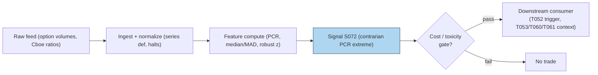

# S072 — Put/call ratio

A **put** pays off when the stock falls; a **call** pays off when it rises. The **put/call ratio (PCR)** is simply put volume divided by call volume: above `1` [example] means more puts traded than calls. The desk reads it as a **sentiment gauge** --- a spike in put buying reads as fear or hedging demand, a collapse reads as complacency. But raw volume is noisy and drifts with market structure (0DTE, weekly expiries, the 2020s options boom), so S072 never trades the raw ratio. It z-scores PCR against its own trailing history with a **robust** statistic (median and MAD, not mean and SD) and fades extremes **contrarian**: extreme fear → long the underlying (direction `+1`), extreme complacency → short (direction `−1`). The logic is mean-reverting sentiment: crowds overpay for protection at the exact moment it is least needed. Provenance **[D]**.

> Tag law: every numeric literal in prose carries one of `[documented]
> [default] [example] [unverified] [internal-est] [measured]` (legend: Appendix
> i v1.0.0). Constants inside cited formulas inherit the formula's tag.
> Bibliographic years, volumes, pages, arXiv IDs, section numbers, rule codes
> (C1–C10), fail-safe codes (F1–F5), module IDs, and machine-parsed §0 data
> fields are identifiers, not literals, and are exempt.

## §1 Five-minute reviewer card

| Row | Value |
|---|---|
| Module | S072 — Put/call ratio, v1.0.0 |
| Edge verdict | `NO-DOCUMENTED-EDGE` — option volume carries stock-price information (Pan & Poteshman), but no published after-cost trading rule for contrarian PCR z-score fading; usable as a conditional sentiment filter |
| After-cost | `COMM-ONLY` — the consumer trades the equity leg (spread `1.00` bps [example]); the signal itself is free arithmetic on public ratios |
| Build cost | Tier S · `10`–`25` h [internal-est] · `$1,500`–`$4,000` loaded [internal-est] |
| Data cost | Research `~$0`/mo [unverified] (Cboe public ratios) --- bands indicative, verify before budgeting |
| latency_class | daily; tradable no earlier than t+1 on the close print |
| risk_class | medium (contrarian equity exposure into fear) |
| Capacity | `$100`M–`1`B/day notional [example] --- trades the underlying, not options |
| Executability | Feasible: ratio + rolling median/MAD; Tier S. |
| Risk summary | Fading fear into a real crash: the contrarian direction loses exactly when the put buyers were right; structural PCR drift breaks fixed thresholds |
| When it dies | Persistent one-sided regimes (crashes, melt-ups) where "extreme" is the new normal; options-market-structure shifts moving the baseline |
| Regime gates | Provisional: crash regime --- veto contrarian longs while S076 breakout flags a downside expansion |
| Emits | `signal_vector` (Appendix b v1.0.0) — never orders |

## §1.5 Cheapest / least-build path

1. **Prototype hour band:** `10`–`25` h [internal-est] — PCR ingest, rolling median/MAD, contrarian rule, downstream hookup.
2. **Cheapest-source row:** min_tier = Tier-0 Cboe public daily ratios --- cheapest data source candidate [unverified]; latency_class = daily, point-in-time adjusted;
   required_fields = put volume, call volume (or the ratio), ≥`1` year [example]; price_band = `~$0`/mo [unverified] (indicative --- verify before budgeting); build_or_buy = **build everything --- the inputs are public and the math is six lines**.
3. **Resource budget:** `1` core, `<1` GB RAM [internal-est]; compute pattern `per_bar`.
4. **Skip list:** Signed-flow PCR (customer-buy-only); 0DTE-adjusted PCR; intraday PCR.
5. **DO-NOT-CUT list:** causality assertions (`assert fill_event >
   signal_event`, no-signal-bar-fills test); COST block + callable
   `expected_cost_bps`; F1–F5 fail-safes + module-state enum; decision-log
   audit records; bona-fide-intent + self-trade prevention; provenance tags on
   every numeric literal; fixtures + `test_cmd`; secrets via env only.
6. **Escalation gate:** universe >`1,000` names with signed per-name flow [default] --- needs OPRA customer-flow classification (Tier 2 `~$2,000`–`20,000`+/mo [unverified]); or intraday timing required.

## §S0 Module contract

### S0.1 Typed signature

```python
def signal(state: ModuleState, events: list[Event], cfg: Config) -> SignalVector:
```

`SignalVector` per Appendix b v1.0.0. `state` is the module-owned named state
vector (`pcr_history`, `module_state`); `events` are canonical Events
(Appendix a v1.0.0), newest last. The function handles documented edge cases:
empty input → `UNKNOWN`; `call_vol <= 0`, `put_vol < 0`, or non-finite →
`UNKNOWN` (F1/F2, never interpolate); MAD = `0` [example] → z = `0` [example],
direction `0`; halt/auction → freeze per the market-state table.

### S0.2 Config dataclass

| Parameter | Type | Default | Range | Status |
|---|---|---|---|---|
| `n` | int | `5` | `3–20` | example |
| `z_star` | float | `2.0` | `1.0–3.0` | example |
| `cost_gate_k` | float | `0.5` | `0.1–2.0` | default |

All defaults tagged per the tag law.

### S0.3 Canonical schema mapping

Vendor columns → canonical Event schema (Appendix a v1.0.0), stated once here:

| Vendor | Canonical |
|---|---|
| ``day` (tape)` | ``bar_id` (int)` |
| ``event_ts` (tape)` | ``event_ts` (int64 ns UTC)` |
| ``asof_ts` (tape)` | ``asof_ts` (int64 ns UTC)` |
| ``put_vol` (tape)` | ``put_vol` (float, contracts)` |
| ``call_vol` (tape)` | ``call_vol` (float, contracts)` |

### S0.4 Time contract

> Time contract: clock domain UTC, int64 ns; authoritative causality clock =
> `event_ts`; max_skew = `1` ms [default]; jitter budget = `500` µs [default]
> bar-label = open time; staleness TTL = `3` s [default]; gap policy = mask, no interpolation; halt/auction
> → discard contributions across reopen. Computed on the daily close print; tradable no earlier than t+1.

**Timing box:** `signal@t (per_bar, America/New_York) → earliest fill @open(t+1)`

### S0.5 Market-state table

| State | Module behavior |
|---|---|
| CONTINUOUS_TRADING | Compute normally; emit per cadence |
| HALTED | Freeze state; emit `UNKNOWN`; discard contributions across reopen |
| AUCTION | No new signals; hold last `SignalVector`; state `DEGRADED` |
| CLOSED | Emit nothing; state `OFF` |

### S0.6 Module-state enum + error taxonomy

States per Appendix k v1.0.0: `OK | DEGRADED | UNKNOWN | OFF`. Invalid input →
`UNKNOWN`, never interpolate (Appendix f v1.0.0, F1–F5).

| Failure | State | Alert |
|---|---|---|
| Missing/stale input (TTL `3` s [default]) | `UNKNOWN` | page |
| Inputs out of mathematical bounds (F2) | `UNKNOWN` | page |
| `seq` gap > `1,000` events [default] | `DEGRADED` (restart windows) | log |
| Feed jitter > budget persistently | `DEGRADED` | notify |
| Halt/auction | `UNKNOWN` / `DEGRADED` (per table) | log |
| Kill/administrative disable | `OFF` | page |
| Anything unmapped | `UNKNOWN` | page |

### S0.7 Ops tail

- **Schedule:** daily on the options close print; US equities regular session `09:30`–`16:00` America/New_York [documented]; owner: flow-analytics on-call.
- **Health checks:** fixture replay (`test_cmd`) green on deploy; live
  `seq`-gap monitor; staleness watchdog at `3`× cadence.
- **Alert table:** page on `UNKNOWN` > `30` s [default] or bounds violation;
  notify on `DEGRADED`; log on single dropped events.
- **Resource budget:** `1` core, `<1` GB RAM [internal-est]; state is O(n) per symbol.
- **Runbook stub:** `1.` confirm feed (vendor status); `2.` replay fixture;
  `3.` if red → set `OFF`, page; `4.` reconcile decision log before re-arm.

### S0.8 Secrets (env-only)

`CBOE_API_KEY` (only if using vendor feed; public ratios need none) via environment only. No secrets in
this file, fixtures, or logs (CI secrets-grep).

### S0.9 May / must-NOT

> **May:** emit `SignalVector` records per Appendix b v1.0.0. **Must-NOT:**
> emit orders, order intents, prices, share counts, or notionals; call a
> broker; mutate shared state outside `state`; interpolate across gaps.

## §S1 Legacy (subsumed by §1)

Legacy §S1 content is the §1 reviewer card above; this header is retained so
section numbering stays frozen.

## §S2 Specification

### Universe

Single names and indices with public put/call ratios; ≥`1` year history [example].

### Entry rule (Boolean — no prose-only conditions)

```
FEAR_EXTREME   := (rz > z_star) AND (expected_cost_bps(...) <= cost_gate_k * edge_bps)    # fade fear → long [example convention]
GREED_EXTREME  := (rz < -z_star) AND (expected_cost_bps(...) <= cost_gate_k * edge_bps)   # fade complacency → short [example convention]
FLAT           := otherwise → UNKNOWN on invalid input

`PCR = put_vol / call_vol` [example]; rolling window = current + prior `n−1` = `5` [example];
`med = median(window)`, `MAD = median(|x − med|)` [example];
`rz = (PCR − med) / (1.4826 * MAD)`, MAD = `0` → `rz = 0` [example];
`z_star = 2.0` [example]; `edge_bps = |rz| * 40.0` [example];
`confidence = min(1, |rz| / 4.0)` [example].
```

### Exits (with post-exit cooldown)

```
Sentiment normalizes: direction returns to 0 when |rz| <= z_star.
ON_STATE: module_state != OK → emit `DEGRADED`; `60` s [default] cooldown after any compliance block (C10).
```

### Position sizing (fenced function)

```python
def size_shares(risk_budget_R, stop_distance, vol_estimate, ADV_cap, cost):
    # S-module requests capital fraction only; share math lives in the strategy.
    # Reference: capital = 0.5 * confidence  (confidence in [0,1])  [default]
    risk_notional = risk_budget_R * 0.5 * confidence          # [default] 0.5 factor
    shares = risk_notional / max(stop_distance, 1e-9)
    return int(min(shares, ADV_cap * adv_shares * 0.001))     # 0.1% ADV cap [default]
```

### Risk limits

| Limit | Value |
|---|---|
| Max capital fraction per signal | `0.5` [default] --- signal module; strategy enforces |
| Extremity threshold | `|rz| > 2.0` [example] vs trailing `5`-day [example] median/MAD |
| Structural-drift monitor | baseline PCR mean re-estimated monthly; regime shift → refit (not in signal path) |

### COST block (single source of truth)

| Component | Value (bps) | Basis |
|---|---|---|
| Spread (equity-leg half-spread) | `1.00` | [example] |
| Fees (taker) | `0.30` | [example] |
| Borrow (short-leg amortized) | `1.50` | [example] |
| Impact (contrarian fill slippage) | `1.00` | [example] |
| **Total reference** | `3.80` | [example] |

`fee_schedule_as_of`: `2026-09-01 [unverified]` — placeholder; pin the real
venue schedule before production. `side: taker` [default]; venue/tier/source:
XNAS [example]. Re-stating cost numbers outside this block is a validation failure.

```python
def expected_cost_bps(notional, adv_pct, venue, side, urgency) -> float:
    """Callable cost model — reference stack for S072."""
    spread_bps = 1.00
    fee_bps = 0.30
    borrow_bps = 1.50   # short-leg borrow amortized [example]
    impact_bps = 1.00
    return spread_bps + fee_bps + borrow_bps + impact_bps
```

### Execution / fill model table

| Aspect | Assumption |
|---|---|
| Latency | Computed at the daily close; intent no earlier than next session open [example] |
| Partial fills | Equity-leg fills modeled by consumers |
| Impact | `1.00` bps contrarian fill slippage [example] |
| Adverse fill | Fading fear means buying into falling prices; assume `2`× [example] normal slippage on the entry bar |

### Robustness

Median/MAD (not mean/SD): PCR spikes are fat-tailed and one huge day must not move the baseline. The `1.4826` scaling makes MAD consistent with SD under normality [documented]. Window = current + prior four (`n = 5` [example]) so the signal is fully causal. Never trade a fixed PCR level (e.g. `1.2` [example]) --- the baseline drifts with market structure; the z-score is the signal. Distinguish equity vs index PCR: index ratios run structurally higher (hedging demand).

### Compliance sub-block (C1–C10+)

| Code | Rule: trigger → check → action → log |
|---|---|
| C1 | Self-match prevention: signal module emits no orders; downstream T-modules must set self-trade-prevention flags — S072 asserts the requirement in its `consumes` contract |
| C2 | Bona-fide intent: every emitted `SignalVector` with |direction|=`1` must pass the cost gate; sub-threshold readings emit direction `0`, never a tradeable hint |
| C3 | Message-rate: `≤100` emissions/symbol/s [default]; breach → throttle to `1`/s [default] + alert |
| C4 | Fat-finger trio (applied by consumers; S072 bounds its own outputs): confidence ∈ [`0`,`1`], capital ∈ [`0`,`0.5`], computed_at sane — out-of-bounds → `UNKNOWN` (F2) |
| C5 | Decision log: every emission, veto, and state transition logged per Appendix g v1.0.0, hash-chained |
| C6 | Halt/auction: per §S0.5 market-state table; contributions across reopen discarded |
| C7 | Locate check: SHORT direction requires `locate_ok` from the consumer; S072 never emits SHORT without the consumer asserting locate (Reg-SHO threshold securities → direction `0`) |
| C8 | Public dissemination: no signal values published externally without review gate |
| C9 | Data entitlements: per §S6 Data rights row; entitlement-class change → §1.5 escalation gate |
| C10 | Post-exit cooldown: `60 s` [default] after any exit or compliance block; no re-entry |
| C11 | Baseline-drift monitor: monthly re-estimation of the PCR baseline; structural shift flagged, never silently absorbed. --- trigger → check → action → log: prevents stale-threshold trading |
| C12 | Series definition: equity PCR vs index PCR never mixed in one z-score. --- trigger → check → action → log: prevents definition drift |

### Parameter table

| Parameter | Symbol | Value | Tag | Sensitivity |
|---|---|---|---|---|
| Window | `n` | `5` | [example] | medium |
| Extremity threshold | `z_star` | `2.0` | [example] | high |
| MAD scale | — | `1.4826` | [documented] | low |
| Cost-gate k | `cost_gate_k` | `0.5` | [default] | low |

### Timing box

`signal@t (per_bar, America/New_York) → earliest fill @open(t+1)`

## §S3 Math + normative pseudocode

$$\mathrm{PCR}_t = \frac{\mathrm{put\_vol}_t}{\mathrm{call\_vol}_t}, \qquad rz_t = \frac{\mathrm{PCR}_t - \mathrm{median}(\mathcal{W}_t)}{1.4826 \cdot \mathrm{MAD}(\mathcal{W}_t)}, \quad \mathcal{W}_t = \{\mathrm{PCR}_{t-4}, \dots, \mathrm{PCR}_t\} \quad\text{[example]}$$

**Normative pseudocode** (pseudocode is normative; prose is commentary):

```
function signal(state, bars, cfg) -> SignalVector:
    assert bars non-empty else return UNKNOWN
    b = bars[-1]
    if b.call_vol <= 0 or b.put_vol < 0 or not finite(b.put_vol): return UNKNOWN   # F1/F2 [default]
    pcrs = [r.put_vol / r.call_vol for r in bars]
    hist = pcrs[-cfg.n:]                                            # causal trailing window [example]
    med = median(hist); mad = median(|x - med| for x in hist)
    rz = (pcrs[-1] - med) / (1.4826 * mad) if mad > 0 else 0.0      # robust z [example]
    direction = 1 if rz > cfg.z_star else (-1 if rz < -cfg.z_star else 0)   # contrarian [example]
    confidence = min(1.0, abs(rz) / 4.0) if direction else 0.0       # [example] scale
    edge_bps = abs(rz) * 40.0                                      # modeled per-trade edge [example]
    assert fill_event > signal_event                               # causality: close print tradable no earlier than t+1
    if not (expected_cost_bps(...) <= cfg.cost_gate_k * edge_bps):
        direction, confidence = 0, 0.0                              # cost gate [default] k
    return SignalVector("TEST", direction, confidence, 0.5 * confidence,
                        b.event_ts, b.asof_ts - b.event_ts, "OK")
```

Causality: computed at the daily close from volumes ≤ *t*; tradable no earlier than *t+1*. Mandatory unit test: no-signal-bar fills.

## §S4 Worked example (fixture-backed)

- Tape: `modules/fixtures/S072_tape.csv` — `# TYPE: validation-run`;
  `10` rows (synthetic `10`-day [example] put/call volume tape, seed `72`), all numbers synthetic,
  seed `72` [example]; `event_ts`/`asof_ts` int64 ns UTC.
- Expected outputs: `modules/fixtures/S072_expected.csv` — per-day `pcr`, `med5`, `z`, `direction`.
- Tolerance: `1e-9 [default]` on floats; integers exact.
- Hand-checks: ['day-`0` PCR `1.1052631579` [measured] = `420`/`380`, med `1.1052631579` [measured], z `0` [measured]', 'day-`1` PCR `1.4166666667` [measured], z `0.6744907595` [measured], direction=`0` [measured]', 'day-`3` PCR `1.7714285714` [measured], z `1.4794505363` [measured], direction=`0` [measured]', 'day-`6` PCR `1.8421052632` [measured], med `1.0714285714` [measured], z `4.3242523519` [measured], direction=`1` [measured] — extreme fear, contrarian long', 'day-`8` PCR `1.4054054054` [measured], z `1.6395371081` [measured], direction=`0` [measured]'].
- Acceptance tests (`modules/tests/test_S072.py`, `5` tests):
  `1.` fixture recomputes to expected (day-`6` direction `1` --- robust z `4.3242523519` > `2.0`)
  `2.` stub emits valid `SignalVector` (direction `−1`/`0`/`1`, confidence ∈ [0,1])
  `3.` no-signal-bar fills (`fill_event_ts > computed_at`)
  `4.` cost-gate predicate passes on large edge, blocks on tiny edge
  `5.` invalid input (`call_vol <= 0`) → `UNKNOWN`
- `test_cmd`: `python3 -m pytest modules/tests/test_S072.py -q` → exits `0`.

**Where the example is optimistic:** `10` synthetic days [example]; no market-structure drift, no 0DTE effects, no signed-flow distinction; demonstrates the robust z-score and contrarian rule, not a sentiment backtest.

## §S5 Strategies that use this signal

| Strategy | Role |
|---|---|
| T052 — Sentiment Contrarian | Primary entry trigger: fades PCR extremes in the underlying |
| T053 — Fear-Gauge Overlay | Sizing input: PCR z scales protective-hedge sizing |
| T060 — 0DTE Flow Fade | Filter: daily PCR context for intraday flow trades |
| T061 — Weekly Expiry Pin | Context input: PCR extremes into expiry inform pin-vs-breakout odds |

## §S6 Data required

| Field | Type | Granularity | Source tier | Notes |
|---|---|---|---|---|
| Put/call volume | int (contracts) | daily | Tier 0–1 | Cboe public daily ratios; OPRA for per-name |
| Signed option flow | contracts by side | daily | Tier 2 | vendor classification for the production variant |
| Underlying price | float ($) | daily | Tier 0–1 | the traded leg |

**Data rights row** (Appendix j v1.0.0): Put/call ratios via Cboe public daily statistics, `rights: public`; per-name OPRA via Databento, `rights: licensed`; raw ticks never leave our systems --- fixtures are synthetic; entitlement-class change → §1.5 escalation gate.

## §S7 Local build (M5 Max / 128 GB)

Feasible (Tier S). The signal is six lines of arithmetic on daily public ratios; a century of Cboe ratios fits in megabytes. Bottleneck: **baseline-drift monitoring** (0DTE, weekly expiries, structure shifts), not compute. Stack: **Python+polars** --- **Tier S, 10–25 h ≈ $1,500–$4,000 loaded** (cost-model §5).

## §S8 Buy vs build

**Build everything.** The inputs are public (Cboe daily ratios) and the math is trivial; there is nothing worth buying at the research tier. Crossover: buy Tier-2 signed per-name flow the day the contrarian rule graduates from index-level filter to per-name trigger --- unsigned public ratios cannot tell hedging from speculation. Indicative bands: Tier 0 `~$0`/mo [unverified]; Tier 2 `~$2,000`–`20,000`+/mo [unverified] --- indicative, verify before budgeting.

## §S9 Efficacy — documented evidence

| Study / source | Market & period | Metric | Before/after cost | Caveat |
|---|---|---|---|---|
| Pan & Poteshman (2006) [documented] | US individual stock options, `1990`–`2001` | Option volume contains information about future stock prices; put-call ratios relate to signed order flow | `BEFORE-COST` predictive regressions | information in *signed* flow, not the unsigned public ratio |
| Cboe put/call methodology [documented] | US options, ongoing | The standard public put/call ratio series (equity/index/total) | `DESCRIPTIVE` | a data definition, not an edge |

**Honest bottom line.** Signed option flow predicts; the unsigned public put/call ratio is a sentiment gauge with no published after-cost trading edge. **As a standalone contrarian trigger this is unproven; as a conditional sentiment filter (fade only confirmed extremes, respect crash regimes) it is a documented and usable input.** Never fade fear into a confirmed downside expansion.

## §S10 Failure modes & pitfalls

| # | Trigger → Detect → Action → Recovery | check: |
|---|---|---|
| 1 | Lookahead leakage → using revised/settled volume from after the close → detect: vintage audit → action: pin the print vintage → recovery: re-timestamp | `print vintage [example rule]` |
| 2 | Stale series → mixing equity and index PCR definitions → detect: series-definition audit → action: enforce one definition per z-score → recovery: split | `series definition [example rule]` |
| 3 | Crowding/alpha decay → the contrarian PCR trade is decades old → detect: edge decay scan → action: condition on confirmation (S073) → recovery: cut size | `S073 gate [example rule]` |
| 4 | Cost blowup → contrarian entries buy into falling prices → detect: adverse-selection model → action: assume `2`× [example] normal slippage → recovery: resize | `adverse selection [example rule]` |
| 5 | Regime breaks → crashes make "extreme fear" the new normal → detect: downside-expansion flag (S076) → action: veto contrarian longs → recovery: stand down | `S076 veto [example rule]` |
| 6 | Overfitting → n and z_star tuned on one sample → detect: tuning audit → action: pre-commit, pool across names → recovery: freeze | `freeze thresholds [example rule]` |
| 7 | Baseline drift → 0DTE and structure shifts move the PCR mean → detect: monthly baseline re-estimation → action: refit, never silently absorb → recovery: refit | `baseline monitor [example rule]` |

## §S11 Visuals




## §S12 Source log + unverified leads

**Sources** (citable facts only):

['1. Pan, J., Poteshman, A. M. (2006) [documented]. "The Information in Option Volume for Future Stock Prices." *Review of Financial Studies*, 19(3):871-908. --- option volume contains information about future stock prices; put-call ratios relate to signed order flow.', '2. Cboe [documented]. Cboe equity put/call ratio data and methodology (total/equity/index ratios). https://www.cboe.com/us/options/market_statistics/daily --- the standard public put/call ratio series.']

**Chatbot source log.** Duck.ai (GPT-5.6 Luna, anonymous, web-search assisted, 2026-09-10) answered Q-SB8-1–Q-SB8-3. Grok/Cursor answers pending (checked 2026-09-10). Chatbot output is leads, never facts.

**Unverified leads** (chatbot-only — never in evidence tables):

['- Duck.ai Q-SB8-1/Q-SB8-3: the contrarian PCR framing, rolling median/MAD robust z, and the 1.4826 scaling --- the mechanics were operator-verified against the fixture; quarantined.', '- Any specific after-cost Sharpe ratio for contrarian PCR fading --- unverified chatbot claim; quarantined.', '- Sentiment-survey correlations with PCR extremes --- quarantined.']

---

## Appendix — AI build prompt (S072)

Copy-paste into any chat agent:

> Build module **S072 — Put/call ratio** per
> `notes/module-template.md` v1.0.0 and this file's §S0 contract.
> Cheapest path (§1.5): prototype `10`–`25` h [internal-est]; cheapest data
> candidate Tier-0 Cboe public daily ratios --- cheapest data source candidate [unverified]; compute pattern
> `per_bar`; skip signed-flow PCR and intraday PCR for now.
> Implement `signal(state, events, cfg) -> SignalVector` (Appendix b v1.0.0)
> with the §S3 normative pseudocode, including the cost-gate predicate
> `expected_cost_bps(...) <= k * edge_bps` and `assert fill_event >
> signal_event`. Wire F1–F5 (Appendix f v1.0.0): invalid input → `UNKNOWN`,
> never interpolate. Log decisions per Appendix g v1.0.0. Secrets via env
> only. Run the fixture `modules/fixtures/S072_tape.csv`
> (`# TYPE: validation-run`) against `modules/fixtures/S072_expected.csv`
> (tolerance `1e-9 [default]`).
> **Definition of done:** `python3 -m pytest modules/tests/test_S072.py -q`
> exits `0`. Tag every numeric literal you add with the unified enum
> (Appendix i v1.0.0); put anything unverifiable in §S12 unverified leads.
