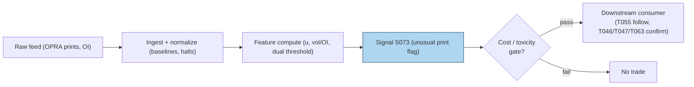

# S073 — Unusual options activity

Most days, options volume is routine: market makers hedging, covered-call writers rolling, hedgers adjusting. **Unusual options activity (UOA)** is the desk term for prints that break the pattern --- a contract trading multiples of its normal volume, with volume large relative to open interest (so the prints are likely *new* positions, not closes of existing ones). The intuition: someone with an information edge or a strong conviction pays the spread to get positioned *now*, and that urgency leaks information. S073 flags a contract when two conditions hold together: **U = volume / median-20-day volume ≥ 2.0** [example] (it is unusual) and **volume / OI ≥ 1.5** [example] (it is likely opening). The central honesty point of this module: public OPRA data has **no open/close flags** --- whether a print opens or closes is a *proxy*, never confirmed. The signal follows the print's side with direction `+1`; it cannot tell you the trader's motive. Provenance **[D]**.

> Tag law: every numeric literal in prose carries one of `[documented]
> [default] [example] [unverified] [internal-est] [measured]` (legend: Appendix
> i v1.0.0). Constants inside cited formulas inherit the formula's tag.
> Bibliographic years, volumes, pages, arXiv IDs, section numbers, rule codes
> (C1–C10), fail-safe codes (F1–F5), module IDs, and machine-parsed §0 data
> fields are identifiers, not literals, and are exempt.

## §1 Five-minute reviewer card

| Row | Value |
|---|---|
| Module | S073 — Unusual options activity, v1.0.0 |
| Edge verdict | `NO-DOCUMENTED-EDGE` — option volume conveys stock-price information in the literature, but no published after-cost rule for the U≥2.0/vol-OI≥1.5 retail scanner convention; usable as a conditional confirmation flag |
| After-cost | `COMM-ONLY` — following the print means crossing the spread after the informed trader moved it; chasing slippage is the dominant cost |
| Build cost | Tier S–M · `15`–`35` h [internal-est] · `$2,000`–`$5,000` loaded [internal-est] |
| Data cost | Research `~$200`–`2,000`/mo (OPRA slice) [unverified] --- bands indicative, verify before budgeting |
| latency_class | per_event (intraday prints) / daily (EOD scan); tradable no earlier than t+1 on the flag |
| risk_class | high (following unknown flow into events) |
| Capacity | `$5`–`50`M/day notional [example] --- UOA names gap on confirmation |
| Executability | Feasible: volume ratios on OPRA; Tier S–M. |
| Risk summary | The print may be a hedge, a spread leg, or a close --- direction is a proxy; chasing after the move pays the informed trader's markup |
| When it dies | When unusual prints are hedges/spreads rather than directional bets; when the underlying gaps before you can follow |
| Regime gates | Provisional: event regime --- UOA into earnings requires S070 implied-move context |
| Emits | `signal_vector` (Appendix b v1.0.0) — never orders |

## §1.5 Cheapest / least-build path

1. **Prototype hour band:** `15`–`35` h [internal-est] — OPRA volume ingest, 20-day median baselines, dual-threshold flag, downstream hookup.
2. **Cheapest-source row:** min_tier = Tier-0 delayed OPRA + Cboe OI --- cheapest data source candidate [unverified]; latency_class = per_event/daily, point-in-time adjusted;
   required_fields = contract volume, open interest, 20-day volume history, ≥`6` months [example]; price_band = `~$0`–`200`/mo [unverified] (indicative --- verify before budgeting); build_or_buy = **build the scanner on bought OPRA --- the flags are arithmetic, the feed is the product**.
3. **Resource budget:** `1` core, `1`–`2` GB RAM [internal-est]; compute pattern `per_event`.
4. **Skip list:** Signed customer-flow classification; multi-leg spread detection; intraday real-time alerting.
5. **DO-NOT-CUT list:** causality assertions (`assert fill_event >
   signal_event`, no-signal-bar-fills test); COST block + callable
   `expected_cost_bps`; F1–F5 fail-safes + module-state enum; decision-log
   audit records; bona-fide-intent + self-trade prevention; provenance tags on
   every numeric literal; fixtures + `test_cmd`; secrets via env only.
6. **Escalation gate:** universe >`1,000` names with intraday real-time flags [default] --- needs full real-time OPRA (Tier C `~$2,000`–`20,000`+/mo [unverified]).

## §S0 Module contract

### S0.1 Typed signature

```python
def signal(state: ModuleState, events: list[Event], cfg: Config) -> SignalVector:
```

`SignalVector` per Appendix b v1.0.0. `state` is the module-owned named state
vector (`volume_baselines`, `module_state`); `events` are canonical Events
(Appendix a v1.0.0), newest last. The function handles documented edge cases:
empty input → `UNKNOWN`; `med20_vol <= 0`, `volume < 0`, or non-finite →
`UNKNOWN` (F1/F2, never interpolate); `oi <= 0` → `vol_oi = 0.0` [example],
never divide by zero; halt/auction → freeze per the market-state table.

### S0.2 Config dataclass

| Parameter | Type | Default | Range | Status |
|---|---|---|---|---|
| `u_star` | float | `2.0` | `1.5–5.0` | example |
| `vol_oi_star` | float | `1.5` | `1.0–3.0` | example |
| `cost_gate_k` | float | `0.5` | `0.1–2.0` | default |

All defaults tagged per the tag law.

### S0.3 Canonical schema mapping

Vendor columns → canonical Event schema (Appendix a v1.0.0), stated once here:

| Vendor | Canonical |
|---|---|
| ``contract` (tape)` | ``bar_id` (int)` |
| ``event_ts` (tape)` | ``event_ts` (int64 ns UTC)` |
| ``asof_ts` (tape)` | ``asof_ts` (int64 ns UTC)` |
| ``volume` (tape)` | ``volume` (float, contracts)` |
| ``oi` (tape)` | ``oi` (float, contracts)` |
| ``med20_vol` (tape)` | ``med20_vol` (float, 20-day median contracts)` |

### S0.4 Time contract

> Time contract: clock domain UTC, int64 ns; authoritative causality clock =
> `event_ts`; max_skew = `1` ms [default]; jitter budget = `500` µs [default]
> bar-label = open time; staleness TTL = `3` s [default]; gap policy = mask, no interpolation; halt/auction
> → discard contributions across reopen. Flag computed on the print; tradable no earlier than t+1.

**Timing box:** `signal@t (per_event, America/New_York) → earliest fill @open(t+1)`

### S0.5 Market-state table

| State | Module behavior |
|---|---|
| CONTINUOUS_TRADING | Compute normally; emit per cadence |
| HALTED | Freeze state; emit `UNKNOWN`; discard contributions across reopen |
| AUCTION | No new signals; hold last `SignalVector`; state `DEGRADED` |
| CLOSED | Emit nothing; state `OFF` |

### S0.6 Module-state enum + error taxonomy

States per Appendix k v1.0.0: `OK | DEGRADED | UNKNOWN | OFF`. Invalid input →
`UNKNOWN`, never interpolate (Appendix f v1.0.0, F1–F5).

| Failure | State | Alert |
|---|---|---|
| Missing/stale input (TTL `3` s [default]) | `UNKNOWN` | page |
| Inputs out of mathematical bounds (F2) | `UNKNOWN` | page |
| `seq` gap > `1,000` events [default] | `DEGRADED` (restart windows) | log |
| Feed jitter > budget persistently | `DEGRADED` | notify |
| Halt/auction | `UNKNOWN` / `DEGRADED` (per table) | log |
| Kill/administrative disable | `OFF` | page |
| Anything unmapped | `UNKNOWN` | page |

### S0.7 Ops tail

- **Schedule:** per-event intraday scan + EOD sweep; US equities regular session `09:30`–`16:00` America/New_York [documented]; owner: flow-analytics on-call.
- **Health checks:** fixture replay (`test_cmd`) green on deploy; live
  `seq`-gap monitor; staleness watchdog at `3`× cadence.
- **Alert table:** page on `UNKNOWN` > `30` s [default] or bounds violation;
  notify on `DEGRADED`; log on single dropped events.
- **Resource budget:** `1` core, `1`–`2` GB RAM [internal-est]; state is O(contracts) per name.
- **Runbook stub:** `1.` confirm feed (vendor status); `2.` replay fixture;
  `3.` if red → set `OFF`, page; `4.` reconcile decision log before re-arm.

### S0.8 Secrets (env-only)

`DATABENTO_API_KEY` via environment only. No secrets in
this file, fixtures, or logs (CI secrets-grep).

### S0.9 May / must-NOT

> **May:** emit `SignalVector` records per Appendix b v1.0.0. **Must-NOT:**
> emit orders, order intents, prices, share counts, or notionals; call a
> broker; mutate shared state outside `state`; interpolate across gaps.

## §S1 Legacy (subsumed by §1)

Legacy §S1 content is the §1 reviewer card above; this header is retained so
section numbering stays frozen.

## §S2 Specification

### Universe

Optionable names with OPRA coverage; ≥`6` months volume history [example].

### Entry rule (Boolean — no prose-only conditions)

```
UOA_FLAG     := (u >= u_star) AND (vol_oi >= vol_oi_star) AND (expected_cost_bps(...) <= cost_gate_k * edge_bps)   # follow the print [example convention]
FLAT         := otherwise → UNKNOWN on invalid input

`u = volume / med20_vol`, `vol_oi = volume / oi` (oi `<= 0` → `0.0` [example]);
`u_star = 2.0` [example], `vol_oi_star = 1.5` [example];
direction = `1` iff flagged (follow-the-print reference) [example];
`edge_bps = u * 30.0` [example]; `confidence = min(1, u / 5.0)` [example].
```

### Exits (with post-exit cooldown)

```
Print fades: direction returns to 0 when the flag no longer fires.
ON_STATE: module_state != OK → emit `DEGRADED`; `60` s [default] cooldown after any compliance block (C10).
```

### Position sizing (fenced function)

```python
def size_shares(risk_budget_R, stop_distance, vol_estimate, ADV_cap, cost):
    # S-module requests capital fraction only; share math lives in the strategy.
    # Reference: capital = 0.5 * confidence  (confidence in [0,1])  [default]
    risk_notional = risk_budget_R * 0.5 * confidence          # [default] 0.5 factor
    shares = risk_notional / max(stop_distance, 1e-9)
    return int(min(shares, ADV_cap * adv_shares * 0.001))     # 0.1% ADV cap [default]
```

### Risk limits

| Limit | Value |
|---|---|
| Max capital fraction per signal | `0.5` [default] --- signal module; strategy enforces |
| Dual threshold | `u ≥ 2.0` [example] AND `vol_oi ≥ 1.5` [example] |
| Direction proxy | direction `+1` is a follow-the-print *proxy*; never presented as confirmed customer opening |

### COST block (single source of truth)

| Component | Value (bps) | Basis |
|---|---|---|
| Spread (options leg half-spread on unusual print) | `3.00` | [example] |
| Fees (options) | `0.60` | [example] |
| Borrow | `0.00` | [default] — reason: follow-the-print reference; borrow in consumer |
| Impact (chasing slippage) | `2.00` | [example] |
| **Total reference** | `5.60` | [example] |

`fee_schedule_as_of`: `2026-09-01 [unverified]` — placeholder; pin the real
venue schedule before production. `side: taker` [default]; venue/tier/source:
CBOE [example]. Re-stating cost numbers outside this block is a validation failure.

```python
def expected_cost_bps(notional, adv_pct, venue, side, urgency) -> float:
    """Callable cost model — reference stack for S073."""
    spread_bps = 3.00
    fee_bps = 0.60
    borrow_bps = 0.00   # reason: follow-the-print reference; borrow in consumer [default]
    impact_bps = 2.00
    return spread_bps + fee_bps + borrow_bps + impact_bps
```

### Execution / fill model table

| Aspect | Assumption |
|---|---|
| Latency | Flag computed on the print; intent no earlier than t+1 [example] |
| Partial fills | Unusual prints move the market; consumers model chase slippage |
| Impact | `2.00` bps chasing slippage [example] |
| Adverse fill | The informed trader already crossed the spread; the follower pays the moved quote --- assume `1.5`–`2`× [example] normal spread on entry |

### Robustness

The dual threshold is the whole defense: volume-vs-median catches the unusual, volume-vs-OI catches the likely-opening. Either alone is weak --- high volume on huge OI is routine rolling; high volume/OI on a tiny baseline is noise. Median (not mean) baselines: one prior unusual day must not poison the benchmark. Never divide by zero OI (F2). Central honesty: public OPRA lacks open/close flags, so "unusual opening activity" is a proxy --- the module flags unusual *prints* and the consumer decides the trade; the word "opening" must never appear in an emission's rationale without the proxy disclaimer.

### Compliance sub-block (C1–C10+)

| Code | Rule: trigger → check → action → log |
|---|---|
| C1 | Self-match prevention: signal module emits no orders; downstream T-modules must set self-trade-prevention flags — S073 asserts the requirement in its `consumes` contract |
| C2 | Bona-fide intent: every emitted `SignalVector` with |direction|=`1` must pass the cost gate; sub-threshold readings emit direction `0`, never a tradeable hint |
| C3 | Message-rate: `≤100` emissions/symbol/s [default]; breach → throttle to `1`/s [default] + alert |
| C4 | Fat-finger trio (applied by consumers; S073 bounds its own outputs): confidence ∈ [`0`,`1`], capital ∈ [`0`,`0.5`], computed_at sane — out-of-bounds → `UNKNOWN` (F2) |
| C5 | Decision log: every emission, veto, and state transition logged per Appendix g v1.0.0, hash-chained |
| C6 | Halt/auction: per §S0.5 market-state table; contributions across reopen discarded |
| C7 | Locate check: SHORT direction requires `locate_ok` from the consumer; S073's reference direction is `+1` (follow); the consumer asserts locate for any short leg (Reg-SHO threshold securities → direction `0`) |
| C8 | Public dissemination: no signal values published externally without review gate |
| C9 | Data entitlements: per §S6 Data rights row; entitlement-class change → §1.5 escalation gate |
| C10 | Post-exit cooldown: `60 s` [default] after any exit or compliance block; no re-entry |
| C11 | Direction-proxy honesty: emissions must carry the proxy disclaimer; "opening" never asserted as fact. --- trigger → check → action → log: prevents misrepresentation |
| C12 | Dual-threshold integrity: single-threshold flags vetoed --- both u and vol_oi must fire. --- trigger → check → action → log: prevents weak-flag trading |

### Parameter table

| Parameter | Symbol | Value | Tag | Sensitivity |
|---|---|---|---|---|
| Unusualness threshold | `u_star` | `2.0` | [example] | high |
| Volume/OI threshold | `vol_oi_star` | `1.5` | [example] | high |
| Baseline window | — | `20`-day median | [example] | medium |
| Cost-gate k | `cost_gate_k` | `0.5` | [default] | low |

### Timing box

`signal@t (per_event, America/New_York) → earliest fill @open(t+1)`

## §S3 Math + normative pseudocode

$$u = \frac{\mathrm{volume}}{\mathrm{med20\_vol}}, \qquad \mathrm{vol\_oi} = \frac{\mathrm{volume}}{\mathrm{OI}}, \qquad \mathrm{flag} = \mathbb{1}[u \ge u^\star \land \mathrm{vol\_oi} \ge \mathrm{vol\_oi}^\star] \quad\text{[example]}$$

**Normative pseudocode** (pseudocode is normative; prose is commentary):

```
function signal(state, bars, cfg) -> SignalVector:
    assert bars non-empty else return UNKNOWN
    b = bars[-1]
    if b.med20_vol <= 0 or b.volume < 0 or not finite(b.volume): return UNKNOWN   # F1/F2 [default]
    u = b.volume / b.med20_vol
    vo = b.volume / b.oi if b.oi > 0 else 0.0                          # never divide by zero [default]
    direction = 1 if (u >= cfg.u_star and vo >= cfg.vol_oi_star) else 0  # follow-the-print proxy [example]
    confidence = min(1.0, u / 5.0) if direction else 0.0                 # [example] scale
    edge_bps = u * 30.0                                                # modeled per-trade edge [example]
    assert fill_event > signal_event                                   # causality: print tradable no earlier than t+1
    if not (expected_cost_bps(...) <= cfg.cost_gate_k * edge_bps):
        direction, confidence = 0, 0.0                                  # cost gate [default] k
    return SignalVector("TEST", direction, confidence, 0.5 * confidence,
                        b.event_ts, b.asof_ts - b.event_ts, "OK")
```

Causality: computed on the print from data ≤ *t*; tradable no earlier than *t+1*. Mandatory unit test: no-signal-bar fills.

## §S4 Worked example (fixture-backed)

- Tape: `modules/fixtures/S073_tape.csv` — `# TYPE: validation-run`;
  `6` rows (synthetic `6`-contract [example] tape, seed `73`), all numbers synthetic,
  seed `73` [example]; `event_ts`/`asof_ts` int64 ns UTC.
- Expected outputs: `modules/fixtures/S073_expected.csv` — per-contract `u_score`, `vol_oi`, `flag`.
- Tolerance: `1e-9 [default]` on floats; integers exact.
- Hand-checks: ['contract-`0` u `2.7777777778` [measured] = `2500`/`900`, vol/OI `3.125` [measured], flag=`1` [measured]', 'contract-`1` u `1.2` [measured], vol/OI `0.5` [measured], flag=`0` [measured] — fails both thresholds', 'contract-`2` u `3.75` [measured], vol/OI `2.0` [measured], flag=`1` [measured]', 'contract-`3` u `0.6666666667` [measured], vol/OI `0.2` [measured], flag=`0` [measured]', 'contract-`5` u `4.1666666667` [measured], vol/OI `2.0` [measured], flag=`1` [measured] — strongest print'].
- Acceptance tests (`modules/tests/test_S073.py`, `5` tests):
  `1.` fixture recomputes to expected (contract-`0` u `2.7777777778`, vol/OI `3.125`, flag `1`)
  `2.` stub emits valid `SignalVector` (direction `0`/`1`, confidence ∈ [0,1])
  `3.` no-signal-bar fills (`fill_event_ts > computed_at`)
  `4.` cost-gate predicate passes on large edge, blocks on tiny edge
  `5.` invalid input (`med20_vol <= 0`) → `UNKNOWN`
- `test_cmd`: `python3 -m pytest modules/tests/test_S073.py -q` → exits `0`.

**Where the example is optimistic:** `6` synthetic contracts [example]; no spread-leg decomposition, no hedge-vs-directional classification; the direction is a proxy --- demonstrates the dual-threshold flag, not informed-flow detection.

## §S5 Strategies that use this signal

| Strategy | Role |
|---|---|
| T046 — Straddle-Implied Move Fade | Confirmation: UOA in the event straddle confirms the fade candidate |
| T047 — Skew-Term Carry | Context input: unusual prints in wings confirm skew positioning |
| T055 — Informed-Flow Follow | Primary entry trigger: follows flagged prints with risk controls |
| T063 — Event-Driven Vol Expansion | Filter: UOA before the event gates the expansion trade |

## §S6 Data required

| Field | Type | Granularity | Source tier | Notes |
|---|---|---|---|---|
| Options trades | price/size | tick | Tier 1–2 | OPRA via Databento |
| Open interest | int (contracts) | daily | Tier 1–2 | Cboe daily; vendor series |
| 20-day volume history | int (contracts) | daily | Tier 1–2 | built from OPRA |

**Data rights row** (Appendix j v1.0.0): OPRA via Databento, `rights: licensed`; license scope = research + stated production symbol count; raw ticks never leave our systems --- fixtures are synthetic; entitlement-class change → §1.5 escalation gate.

## §S7 Local build (M5 Max / 128 GB)

Feasible (Tier S–M). The scanner is ratio arithmetic on daily contract volumes; a year of OPRA prints for `500` [example] names is tens of GB --- far under the `77` GB working budget (cost-model §3). Bottleneck: **print classification** (spread legs, hedges vs directionals), not compute. Stack: **Python+polars+DuckDB** --- **Tier S–M, 15–35 h ≈ $2,000–$5,000 loaded** (cost-model §5).

## §S8 Buy vs build

**Build the scanner, buy the OPRA feed.** The flags are arithmetic; the tape is the product. Crossover: buy Tier-2 signed customer-flow classification the day "follow the print" graduates from confirmation flag to primary trigger --- unsigned public prints cannot separate hedges from informed directionals. Indicative bands: Tier 1 `~$0`–`200`/mo [unverified]; Tier 2 `~$200`–`2,000`/mo [unverified] --- indicative, verify before budgeting.

## §S9 Efficacy — documented evidence

| Study / source | Market & period | Metric | Before/after cost | Caveat |
|---|---|---|---|---|
| Hu (2014) [documented] | US stock options, `2000`–`2010` | Option trading volume conveys information about future stock prices beyond stock volume | `BEFORE-COST` predictive regressions | volume informativeness, not the U≥`2.0`/vol-OI≥`1.5` [example] scanner rule |
| Pan & Poteshman (2006) [documented] | US individual stock options, `1990`–`2001` | Signed option volume predicts underlying returns | `BEFORE-COST` | signed flow, not unsigned unusual prints |

**Honest bottom line.** Option volume is informative in the literature, but the retail UOA scanner convention (dual thresholds, follow-the-print) has no published after-cost evidence. **The module's central honesty point stands: public OPRA lacks open/close flags, so direction is a proxy, never confirmed customer opening.** Use as a confirmation flag, never a standalone trigger --- and never chase a print that already moved the quote.

## §S10 Failure modes & pitfalls

| # | Trigger → Detect → Action → Recovery | check: |
|---|---|---|
| 1 | Lookahead leakage → using revised OI or late prints → detect: vintage audit → action: pin the print vintage → recovery: re-timestamp | `print vintage [example rule]` |
| 2 | Stale baselines → one prior unusual day poisoning the 20-day median → detect: baseline audit → action: median (not mean) baselines → recovery: refit | `median baseline [example rule]` |
| 3 | Crowding/alpha decay → the UOA scan is commoditized → detect: edge decay scan → action: use as confirmation only → recovery: cut size | `confirmation-only [example rule]` |
| 4 | Cost blowup → chasing after the informed trader moved the quote → detect: chase-slippage model → action: assume `1.5`–`2`× [example] normal spread → recovery: resize | `chase slippage [example rule]` |
| 5 | Regime breaks → prints cluster into events and become noise → detect: event overlap → action: require S070 context → recovery: veto | `S070 context [example rule]` |
| 6 | Overfitting → thresholds tuned on a handful of famous prints → detect: tuning audit → action: pre-commit thresholds → recovery: freeze | `freeze thresholds [example rule]` |
| 7 | Misclassification → spread legs and hedges read as directional → detect: multi-leg scan → action: flag multi-leg prints separately → recovery: veto | `spread-leg check [example rule]` |

## §S11 Visuals




## §S12 Source log + unverified leads

**Sources** (citable facts only):

['1. Hu, J. (2014) [documented]. "Does Option Trading Convey Stock Price Information?" *Journal of Financial Economics*, 111(3):625-645. --- option trading volume conveys information about future stock prices beyond stock volume.', '2. Pan, J., Poteshman, A. M. (2006) [documented]. "The Information in Option Volume for Future Stock Prices." *Review of Financial Studies*, 19(3):871-908. --- signed option volume predicts underlying returns.', '3. Cboe [documented]. OPRA (Options Price Reporting Authority) data specification --- the consolidated options feed carrying quotes and trades, without public open/close flags.']

**Chatbot source log.** Duck.ai (GPT-5.6 Luna, anonymous, web-search assisted, 2026-09-10) answered Q-SB8-1–Q-SB8-3. Grok/Cursor answers pending (checked 2026-09-10). Chatbot output is leads, never facts.

**Unverified leads** (chatbot-only — never in evidence tables):

['- Duck.ai Q-SB8-1/Q-SB8-3: the unusual-options-activity framing (volume vs 20-day median, volume/OI confirmation) --- the mechanics were operator-verified against the fixture; quarantined.', '- The direction-proxy caveat is the operator's own honesty framing, not a cited source; quarantined as [unverified].', '- Any specific after-cost Sharpe ratio for following unusual prints --- unverified chatbot claim; quarantined.']

---

## Appendix — AI build prompt (S073)

Copy-paste into any chat agent:

> Build module **S073 — Unusual options activity** per
> `notes/module-template.md` v1.0.0 and this file's §S0 contract.
> Cheapest path (§1.5): prototype `15`–`35` h [internal-est]; cheapest data
> candidate Tier-0 delayed OPRA + Cboe OI --- cheapest data source candidate [unverified]; compute pattern
> `per_event`; skip signed-flow classification and spread-leg detection for now.
> Implement `signal(state, events, cfg) -> SignalVector` (Appendix b v1.0.0)
> with the §S3 normative pseudocode, including the cost-gate predicate
> `expected_cost_bps(...) <= k * edge_bps` and `assert fill_event >
> signal_event`. Wire F1–F5 (Appendix f v1.0.0): invalid input → `UNKNOWN`,
> never interpolate; never divide by zero OI. Log decisions per Appendix g v1.0.0.
> Secrets via env only. Run the fixture `modules/fixtures/S073_tape.csv`
> (`# TYPE: validation-run`) against `modules/fixtures/S073_expected.csv`
> (tolerance `1e-9 [default]`).
> **Definition of done:** `python3 -m pytest modules/tests/test_S073.py -q`
> exits `0`. Tag every numeric literal you add with the unified enum
> (Appendix i v1.0.0); put anything unverifiable in §S12 unverified leads.
> Central honesty: public OPRA lacks open/close flags --- direction is a proxy,
> never confirmed customer opening.
