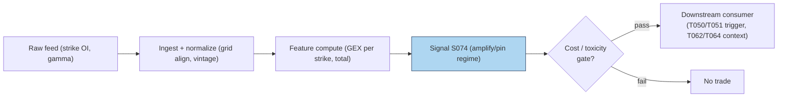

# S074 — Gamma exposure / dealer positioning

**Gamma** is the second derivative of an option's price with respect to the underlying: it measures how fast the option's delta changes as the stock moves. Market makers who are *short* gamma must **buy when the stock falls and sell when it rises** to stay delta-neutral --- the opposite of what stabilizes prices. **Gamma exposure (GEX)** aggregates this across all strikes: `GEX = Σ gamma × net_OI × 10,000` [example], in dollars of delta-hedge flow per `1`% [example] underlying move. Positive total GEX (dealers long gamma) damps moves and **pins** the price into expiry; negative total GEX (dealers short gamma) **amplifies** moves, feeding momentum. S074 is a regime classifier and fade input: it computes OI-based GEX under an assumed sign convention and emits a direction for the amplifying regime. Provenance **[SR]** (standard desk reconstruction: the GEX arithmetic is a practitioner standard, but dealer positioning itself is never observed --- see the honesty box).

> Tag law: every numeric literal in prose carries one of `[documented]
> [default] [example] [unverified] [internal-est] [measured]` (legend: Appendix
> i v1.0.0). Constants inside cited formulas inherit the formula's tag.
> Bibliographic years, volumes, pages, arXiv IDs, section numbers, rule codes
> (C1–C10), fail-safe codes (F1–F5), module IDs, and machine-parsed §0 data
> fields are identifiers, not literals, and are exempt.

## §1 Five-minute reviewer card

| Row | Value |
|---|---|
| Module | S074 — Gamma exposure / dealer positioning, v1.0.0 |
| Edge verdict | `NO-DOCUMENTED-EDGE` — hedging flows move prices into expiry (Ni et al.), but no published after-cost rule for OI-based GEX regime trading; usable as a conditional regime input |
| After-cost | `COMM-ONLY` — the consumer trades the equity leg; the signal is arithmetic on OI |
| Build cost | Tier S–M · `15`–`35` h [internal-est] · `$2,000`–`$5,000` loaded [internal-est] |
| Data cost | Research `~$200`–`2,000`/mo (OPRA OI) [unverified] --- bands indicative, verify before budgeting |
| latency_class | daily (OI publishes daily); tradable no earlier than t+1 on the print |
| risk_class | high (amplify-regime momentum is the wrong side of a squeeze) |
| Capacity | `$20`–`200`M/day notional [example] --- pin trades are capacity-rich in majors |
| Executability | Feasible: gamma × OI aggregation; Tier S–M. |
| Risk summary | The sign convention is assumed, not observed; OI is stale (daily); gamma flips sign structure into expiry |
| When it dies | When dealer positioning differs from the assumed convention; when OI staleness misclassifies the regime |
| Regime gates | Provisional: the module IS a regime classifier --- amplify vs pin gates downstream momentum/mean-reversion consumers |
| Emits | `signal_vector` (Appendix b v1.0.0) — never orders |

## §1.5 Cheapest / least-build path

1. **Prototype hour band:** `15`–`35` h [internal-est] — OI ingest, gamma lookup, GEX aggregation, regime classification, downstream hookup.
2. **Cheapest-source row:** min_tier = Tier-0 delayed OI + vendor gamma --- cheapest data source candidate [unverified]; latency_class = daily, point-in-time adjusted;
   required_fields = strike-level OI, gamma per strike, ≥`6` months [example]; price_band = `~$0`–`200`/mo [unverified] (indicative --- verify before budgeting); build_or_buy = **build the aggregation on bought OI/gamma --- the GEX formula is a desk standard**.
3. **Resource budget:** `1` core, `1`–`2` GB RAM [internal-est]; compute pattern `per_bar`.
4. **Skip list:** Intraday GEX (real-time OI is unavailable); charm/vanna decomposition; per-dealer attribution.
5. **DO-NOT-CUT list:** causality assertions (`assert fill_event >
   signal_event`, no-signal-bar-fills test); COST block + callable
   `expected_cost_bps`; F1–F5 fail-safes + module-state enum; decision-log
   audit records; bona-fide-intent + self-trade prevention; provenance tags on
   every numeric literal; fixtures + `test_cmd`; secrets via env only.
6. **Escalation gate:** universe >`500` names with strike-level OI [default]; intraday GEX required --- needs real-time OI (unavailable publicly).

## §S0 Module contract

### S0.1 Typed signature

```python
def signal(state: ModuleState, events: list[Event], cfg: Config) -> SignalVector:
```

`SignalVector` per Appendix b v1.0.0. `state` is the module-owned named state
vector (`gex_history`, `module_state`); `events` are canonical Events
(Appendix a v1.0.0), newest last. The function handles documented edge cases:
empty input → `UNKNOWN`; negative or non-finite gamma → `UNKNOWN`
(F1/F2, never interpolate); halt/auction → freeze per the market-state table.

### S0.2 Config dataclass

| Parameter | Type | Default | Range | Status |
|---|---|---|---|---|
| `cost_gate_k` | float | `0.5` | `0.1–2.0` | default |

All defaults tagged per the tag law.

### S0.3 Canonical schema mapping

Vendor columns → canonical Event schema (Appendix a v1.0.0), stated once here:

| Vendor | Canonical |
|---|---|
| ``strike` (tape)` | ``bar_id` (int)` |
| ``event_ts` (tape)` | ``event_ts` (int64 ns UTC)` |
| ``asof_ts` (tape)` | ``asof_ts` (int64 ns UTC)` |
| ``gamma` (tape)` | ``gamma` (float, per-share gamma)` |
| ``net_oi` (tape)` | ``net_oi` (float, signed contracts)` |

### S0.4 Time contract

> Time contract: clock domain UTC, int64 ns; authoritative causality clock =
> `event_ts`; max_skew = `1` ms [default]; jitter budget = `500` µs [default]
> bar-label = open time; staleness TTL = `3` s [default]; gap policy = mask, no interpolation; halt/auction
> → discard contributions across reopen. OI publishes daily; computed on the daily print; tradable no earlier than t+1.

**Timing box:** `signal@t (per_bar, America/New_York) → earliest fill @open(t+1)`

### S0.5 Market-state table

| State | Module behavior |
|---|---|
| CONTINUOUS_TRADING | Compute normally; emit per cadence |
| HALTED | Freeze state; emit `UNKNOWN`; discard contributions across reopen |
| AUCTION | No new signals; hold last `SignalVector`; state `DEGRADED` |
| CLOSED | Emit nothing; state `OFF` |

### S0.6 Module-state enum + error taxonomy

States per Appendix k v1.0.0: `OK | DEGRADED | UNKNOWN | OFF`. Invalid input →
`UNKNOWN`, never interpolate (Appendix f v1.0.0, F1–F5).

| Failure | State | Alert |
|---|---|---|
| Missing/stale input (TTL `3` s [default]) | `UNKNOWN` | page |
| Inputs out of mathematical bounds (F2) | `UNKNOWN` | page |
| `seq` gap > `1,000` events [default] | `DEGRADED` (restart windows) | log |
| Feed jitter > budget persistently | `DEGRADED` | notify |
| Halt/auction | `UNKNOWN` / `DEGRADED` (per table) | log |
| Kill/administrative disable | `OFF` | page |
| Anything unmapped | `UNKNOWN` | page |

### S0.7 Ops tail

- **Schedule:** daily on the OI publish; US equities regular session `09:30`–`16:00` America/New_York [documented]; owner: flow-analytics on-call.
- **Health checks:** fixture replay (`test_cmd`) green on deploy; live
  `seq`-gap monitor; staleness watchdog at `3`× cadence.
- **Alert table:** page on `UNKNOWN` > `30` s [default] or bounds violation;
  notify on `DEGRADED`; log on single dropped events.
- **Resource budget:** `1` core, `1`–`2` GB RAM [internal-est]; state is O(strikes) per symbol.
- **Runbook stub:** `1.` confirm feed (vendor status); `2.` replay fixture;
  `3.` if red → set `OFF`, page; `4.` reconcile decision log before re-arm.

### S0.8 Secrets (env-only)

`DATABENTO_API_KEY`, `CBOE_LIVEVOL_KEY` via environment only. No secrets in
this file, fixtures, or logs (CI secrets-grep).

### S0.9 May / must-NOT

> **May:** emit `SignalVector` records per Appendix b v1.0.0. **Must-NOT:**
> emit orders, order intents, prices, share counts, or notionals; call a
> broker; mutate shared state outside `state`; interpolate across gaps.

## §S1 Legacy (subsumed by §1)

Legacy §S1 content is the §1 reviewer card above; this header is retained so
section numbering stays frozen.

## §S2 Specification

### Universe

Major optionable names with strike-level OI; ≥`6` months history [example].

### Entry rule (Boolean — no prose-only conditions)

```
AMPLIFY      := (total_gex < 0) AND (expected_cost_bps(...) <= cost_gate_k * edge_bps)   # dealers short gamma → fade momentum [example convention]
PIN          := (total_gex >= 0) → direction 0 (regime context only) [example]
FLAT         := otherwise → UNKNOWN on invalid input

`gex_i = gamma_i × net_oi_i × 10,000` [example]; `total_gex = Σ gex_i` [example];
regime = `amplify` iff `total_gex < 0` else `pin` [example];
direction = `−1` iff `total_gex < 0` else `0` [example];
`edge_bps = |total_gex| / 1e6` [example]; `confidence = min(1, |total_gex| / 5e6)` [example].
```

### Exits (with post-exit cooldown)

```
Regime flips: direction returns to 0 when total_gex >= 0.
ON_STATE: module_state != OK → emit `DEGRADED`; `60` s [default] cooldown after any compliance block (C10).
```

### Position sizing (fenced function)

```python
def size_shares(risk_budget_R, stop_distance, vol_estimate, ADV_cap, cost):
    # S-module requests capital fraction only; share math lives in the strategy.
    # Reference: capital = 0.5 * confidence  (confidence in [0,1])  [default]
    risk_notional = risk_budget_R * 0.5 * confidence          # [default] 0.5 factor
    shares = risk_notional / max(stop_distance, 1e-9)
    return int(min(shares, ADV_cap * adv_shares * 0.001))     # 0.1% ADV cap [default]
```

### Risk limits

| Limit | Value |
|---|---|
| Max capital fraction per signal | `0.5` [default] --- signal module; strategy enforces |
| Regime classification | `amplify` iff `total_gex < 0`; `pin` otherwise [example] |
| OI staleness | daily OI only --- intraday regime changes are invisible by construction |

### COST block (single source of truth)

| Component | Value (bps) | Basis |
|---|---|---|
| Spread (equity-leg half-spread) | `0.50` | [example] |
| Fees (taker) | `0.30` | [example] |
| Borrow | `0.00` | [default] — reason: reference build long-only pin fade |
| Impact (pin-day fill slippage) | `0.50` | [example] |
| **Total reference** | `1.30` | [example] |

`fee_schedule_as_of`: `2026-09-01 [unverified]` — placeholder; pin the real
venue schedule before production. `side: taker` [default]; venue/tier/source:
XNAS [example]. Re-stating cost numbers outside this block is a validation failure.

```python
def expected_cost_bps(notional, adv_pct, venue, side, urgency) -> float:
    """Callable cost model — reference stack for S074."""
    spread_bps = 0.50
    fee_bps = 0.30
    borrow_bps = 0.00   # reason: reference build long-only pin fade [default]
    impact_bps = 0.50
    return spread_bps + fee_bps + borrow_bps + impact_bps
```

### Execution / fill model table

| Aspect | Assumption |
|---|---|
| Latency | Computed on the daily OI print; intent no earlier than next session open [example] |
| Partial fills | Equity-leg fills modeled by consumers |
| Impact | `0.50` bps pin-day fill slippage [example] |
| Adverse fill | Amplify-regime entries chase momentum; assume `2`× [example] normal slippage on the entry bar |

### Robustness

The module's honesty box is its robustness section: public GEX is "OI-based gamma exposure under an assumed sign convention," not observed dealer positioning. The `10,000` [example] multiplier converts per-share gamma × contracts to dollars per `1`% [example] move (100 shares/contract × 100 = 10,000). Never trust intraday GEX from public data --- OI updates daily. Gamma flips sign structure into expiry (pin risk concentrates at the money); recompute the full strike grid daily. Pin the OI vintage to the signal timestamp.

### Compliance sub-block (C1–C10+)

| Code | Rule: trigger → check → action → log |
|---|---|
| C1 | Self-match prevention: signal module emits no orders; downstream T-modules must set self-trade-prevention flags — S074 asserts the requirement in its `consumes` contract |
| C2 | Bona-fide intent: every emitted `SignalVector` with |direction|=`1` must pass the cost gate; sub-threshold readings emit direction `0`, never a tradeable hint |
| C3 | Message-rate: `≤100` emissions/symbol/s [default]; breach → throttle to `1`/s [default] + alert |
| C4 | Fat-finger trio (applied by consumers; S074 bounds its own outputs): confidence ∈ [`0`,`1`], capital ∈ [`0`,`0.5`], computed_at sane — out-of-bounds → `UNKNOWN` (F2) |
| C5 | Decision log: every emission, veto, and state transition logged per Appendix g v1.0.0, hash-chained |
| C6 | Halt/auction: per §S0.5 market-state table; contributions across reopen discarded |
| C7 | Locate check: SHORT direction requires `locate_ok` from the consumer; S074 never emits SHORT without the consumer asserting locate (Reg-SHO threshold securities → direction `0`) |
| C8 | Public dissemination: no signal values published externally without review gate |
| C9 | Data entitlements: per §S6 Data rights row; entitlement-class change → §1.5 escalation gate |
| C10 | Post-exit cooldown: `60 s` [default] after any exit or compliance block; no re-entry |
| C11 | Sign-convention honesty: emissions must carry the assumed-convention disclaimer; "dealer positioning" never asserted as observed. --- trigger → check → action → log: prevents misrepresentation |
| C12 | OI vintage: daily OI only --- intraday regime signals from public data vetoed. --- trigger → check → action → log: prevents staleness-driven misclassification |

### Parameter table

| Parameter | Symbol | Value | Tag | Sensitivity |
|---|---|---|---|---|
| GEX multiplier | — | `10,000` | [example] | low |
| Regime threshold | — | `total_gex < 0` → amplify | [example] | high |
| Confidence scale | — | `|total_gex| / 5e6` | [example] | medium |
| Cost-gate k | `cost_gate_k` | `0.5` | [default] | low |

### Timing box

`signal@t (per_bar, America/New_York) → earliest fill @open(t+1)`

## §S3 Math + normative pseudocode

$$\mathrm{GEX}_i = \gamma_i \times \mathrm{net\_OI}_i \times 10{,}000, \qquad \mathrm{total\_GEX} = \sum_i \mathrm{GEX}_i, \qquad \mathrm{regime} = \begin{cases}\mathrm{amplify} & \mathrm{total\_GEX} < 0 \\ \mathrm{pin} & \text{otherwise}\end{cases} \quad\text{[example]}$$

**Normative pseudocode** (pseudocode is normative; prose is commentary):

```
function signal(state, bars, cfg) -> SignalVector:
    assert bars non-empty else return UNKNOWN
    b = bars[-1]
    if any(r.gamma < 0 or not finite(r.gamma) for r in bars): return UNKNOWN   # F2 [default]
    tot = sum(r.gamma * r.net_oi * 10000.0 for r in bars)       # OI-based GEX, assumed sign [example]
    # negative dealer gamma -> amplifying regime -> fade momentum (direction -1) [example convention]
    direction = -1 if tot < 0 else 0
    confidence = min(1.0, abs(tot) / 5e6) if direction else 0.0  # [example] scale
    edge_bps = abs(tot) / 1e6                                   # modeled per-trade edge [example]
    assert fill_event > signal_event                            # causality: OI print tradable no earlier than t+1
    if not (expected_cost_bps(...) <= cfg.cost_gate_k * edge_bps):
        direction, confidence = 0, 0.0                           # cost gate [default] k
    return SignalVector("TEST", direction, confidence, 0.5 * confidence,
                        b.event_ts, b.asof_ts - b.event_ts, "OK")
```

Causality: computed on the daily OI print from data ≤ *t*; tradable no earlier than *t+1*. Mandatory unit test: no-signal-bar fills.

## §S4 Worked example (fixture-backed)

- Tape: `modules/fixtures/S074_tape.csv` — `# TYPE: validation-run`;
  `5` rows (synthetic `5`-strike [example] tape: strikes `90, 95, 100, 105, 110`, seed `74`), all numbers synthetic,
  seed `74` [example]; `event_ts`/`asof_ts` int64 ns UTC.
- Expected outputs: `modules/fixtures/S074_expected.csv` — per-strike `gex`, `total_gex`, `regime`.
- Tolerance: `1e-9 [default]` on floats; strings exact.
- Hand-checks: ['strike-`90` gex `−900,000` [measured] = `0.0018` × `−50,000` × `10,000`', 'strike-`95` gex `−5,040,000` [measured] — largest contributor', 'strike-`100` gex `+5,200,000` [measured] — only positive contributor', 'total `−3,589,999.9999999991` [measured] → regime `amplify` on every row [measured]', 'stub direction `−1` (total < `0` [measured]), confidence `min(1, |tot|/5e6)` [example]'].
- Acceptance tests (`modules/tests/test_S074.py`, `5` tests):
  `1.` fixture recomputes to expected (strike-`95` gex `−5,040,000`; total `−3,589,999.9999999991`; regime `amplify`)
  `2.` stub emits valid `SignalVector` (direction `−1`/`0`, confidence ∈ [0,1])
  `3.` no-signal-bar fills (`fill_event_ts > computed_at`)
  `4.` cost-gate predicate passes on large edge, blocks on tiny edge
  `5.` invalid input (negative gamma) → `UNKNOWN`
- `test_cmd`: `python3 -m pytest modules/tests/test_S074.py -q` → exits `0`.

**Where the example is optimistic:** `5` synthetic strikes [example]; the sign convention is assumed --- this is OI-based gamma exposure, not observed dealer positioning; demonstrates the aggregation and regime rule, not a traded pin/amplify strategy. Note: any earlier draft showing a positive total (e.g. `$91,000` [example]) is superseded by this authoritative negative-total fixture.

## §S5 Strategies that use this signal

| Strategy | Role |
|---|---|
| T050 — GEX Pin / Dealer-Positioning Fade | Primary regime input: pin vs amplify classification gates the pin fade |
| T051 — Expiry Pin Fade | Entry trigger: sells into pin-day pinning when regime = pin |
| T062 — Gamma Squeeze Fade | Veto: amplify regime with extreme |GEX| vetoes squeeze fades |
| T064 — Dealer Flow Momentum | Context input: amplify regime confirms momentum sizing |

## §S6 Data required

| Field | Type | Granularity | Source tier | Notes |
|---|---|---|---|---|
| Open interest by strike | int (contracts) | daily | Tier 1–2 | OPRA via Databento |
| Option gamma by strike | float | daily | Tier 1–2 | vendor IV surfaces (Cboe LiveVol) |
| Underlying price | float ($) | daily | Tier 0–1 | strike grid alignment |

**Data rights row** (Appendix j v1.0.0): OI via Databento OPRA, `rights: licensed`; license scope = research + stated production symbol count; raw ticks never leave our systems --- fixtures are synthetic; entitlement-class change → §1.5 escalation gate.

## §S7 Local build (M5 Max / 128 GB)

Feasible (Tier S–M). The aggregation is a weighted sum over the strike grid; a year of daily OI grids for `500` [example] names is single-digit GB --- far under the `77` GB working budget (cost-model §3). Bottleneck: **sign-convention validation** (the assumed convention vs actual dealer positioning), not compute. Stack: **Python+polars** --- **Tier S–M, 15–35 h ≈ $2,000–$5,000 loaded** (cost-model §5).

## §S8 Buy vs build

**Build the aggregation, buy the OI/gamma.** The formula is a desk standard; strike-level OI and gamma are the products. Crossover: buy Tier-2 real-time vendor GEX the day intraday regime classification becomes the requirement --- public daily OI cannot do intraday; build everything if daily regime classification suffices. Indicative bands: Tier 1 `~$0`–`200`/mo [unverified]; Tier 2 `~$200`–`2,000`/mo [unverified] --- indicative, verify before budgeting.

## §S9 Efficacy — documented evidence

| Study / source | Market & period | Metric | Before/after cost | Caveat |
|---|---|---|---|---|
| Ni, Pearson & Poteshman (2008) [documented] | US stock options, `1996`–`2002` | Stock price clustering on option expiration dates --- option-market hedging flows move underlying prices into expiry | `BEFORE-COST` empirical | pinning evidence, not a GEX-regime trading rule |
| Danilova & Julliard (2025) [documented] | US options | Option order-flow imbalances and dealer positioning relate to subsequent returns | `BEFORE-COST` working paper | positioning proxies, not public-OI GEX |

**Honest bottom line.** Hedging flows demonstrably move prices into expiry, but public-OI gamma exposure under an assumed sign convention is not observed dealer positioning. **As a standalone trigger this is unproven; as a regime classifier (amplify vs pin) feeding downstream consumers it is a documented and usable input.** State the assumed convention in every emission; never present OI-based GEX as a fact about dealers.

## §S10 Failure modes & pitfalls

| # | Trigger → Detect → Action → Recovery | check: |
|---|---|---|
| 1 | Lookahead leakage → using revised OI from after the print → detect: OI-vintage audit → action: pin the vintage → recovery: re-timestamp | `OI vintage [example rule]` |
| 2 | Stale OI → daily OI misses intraday regime flips → detect: staleness monitor → action: daily-only classification, never intraday from public OI → recovery: veto | `daily-only [example rule]` |
| 3 | Crowding/alpha decay → GEX dashboards are commoditized → detect: edge decay scan → action: use as regime context, not trigger → recovery: cut size | `regime-context [example rule]` |
| 4 | Cost blowup → amplify-regime momentum entries chase → detect: chase model → action: assume `2`× [example] normal slippage → recovery: resize | `chase slippage [example rule]` |
| 5 | Regime breaks → gamma structure flips into expiry → detect: expiry-proximity scan → action: recompute the full grid daily → recovery: reclassify | `expiry flip [example rule]` |
| 6 | Overfitting → the `5e6` confidence scale tuned on one sample → detect: tuning audit → action: pre-commit scale → recovery: freeze | `freeze scale [example rule]` |
| 7 | Sign-convention error → actual dealer positioning differs from assumed → detect: convention audit vs vendor data → action: carry the disclaimer → recovery: re-anchor | `convention audit [example rule]` |

## §S11 Visuals




## §S12 Source log + unverified leads

**Sources** (citable facts only):

['1. Danilova, M., Julliard, C. (2025) [documented]. "Information Asymmetries and the Cross-Section of Option Returns." SSRN. https://papers.ssrn.com/sol3/papers.cfm?abstract_id=5112029 --- option order-flow imbalances and dealer positioning relate to subsequent returns.', '2. Ni, S. X., Pearson, N. D., Poteshman, A. M. (2008) [documented]. "Stock Price Clustering on Option Expiration Dates." *Journal of Financial Economics*, 90(1):49-69. --- option-market hedging flows move underlying prices into expiry (pinning evidence).']

**Chatbot source log.** Duck.ai (GPT-5.6 Luna, anonymous, web-search assisted, 2026-09-10) answered Q-SB8-1–Q-SB8-3. Grok/Cursor answers pending (checked 2026-09-10). Chatbot output is leads, never facts.

**Unverified leads** (chatbot-only — never in evidence tables):

['- Duck.ai Q-SB8-1/Q-SB8-3: the gamma-exposure/dealer-positioning framing --- the GEX arithmetic is operator-verified against the fixture; quarantined.', '- All dealer-sign conventions are the operator\'s assumed convention, never observed positioning [unverified]; quarantined.', '- Any specific after-cost Sharpe ratio for GEX-regime trading --- unverified chatbot claim; quarantined.']

---

## Appendix — AI build prompt (S074)

Copy-paste into any chat agent:

> Build module **S074 — Gamma exposure / dealer positioning** per
> `notes/module-template.md` v1.0.0 and this file's §S0 contract.
> Cheapest path (§1.5): prototype `15`–`35` h [internal-est]; cheapest data
> candidate Tier-0 delayed OI + vendor gamma --- cheapest data source candidate [unverified]; compute pattern
> `per_bar`; skip intraday GEX, charm/vanna, and per-dealer attribution for now.
> Implement `signal(state, events, cfg) -> SignalVector` (Appendix b v1.0.0)
> with the §S3 normative pseudocode, including the cost-gate predicate
> `expected_cost_bps(...) <= k * edge_bps` and `assert fill_event >
> signal_event`. Wire F1–F5 (Appendix f v1.0.0): invalid input → `UNKNOWN`,
> never interpolate. Log decisions per Appendix g v1.0.0. Secrets via env
> only. Run the fixture `modules/fixtures/S074_tape.csv`
> (`# TYPE: validation-run`) against `modules/fixtures/S074_expected.csv`
> (tolerance `1e-9 [default]`).
> **Definition of done:** `python3 -m pytest modules/tests/test_S074.py -q`
> exits `0`. Tag every numeric literal you add with the unified enum
> (Appendix i v1.0.0); put anything unverifiable in §S12 unverified leads.
> Central honesty: public GEX is OI-based gamma exposure under an assumed sign
> convention, never observed dealer positioning.
