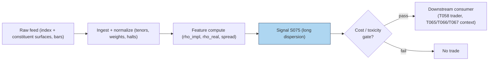

# S075 — Dispersion trading

**Dispersion** is the gap between how volatile an index *should* be, given its constituents' volatilities and their correlations, and how volatile the options market prices it. Index variance decomposes as: `σ_index² = Σ wᵢ²σᵢ² + Σ_{i≠j} wᵢwⱼσᵢσⱼρ` [documented]. Rearranged, the options market implies a correlation **ρ_impl**; realized returns give **ρ_real**. When implied correlation runs rich vs realized --- the documented **correlation risk premium** (Driessen, Maenhout & Vilkov) --- the trade is **long dispersion**: buy single-stock straddles, sell the index straddle, collecting the correlation premium as index options overprice co-movement. S075 computes ρ_impl from constituent IVs, compares it to realized correlation, and goes long dispersion when the spread exceeds `κ = 0.10` [example]. You are not betting on direction --- you are betting that stocks move *independently* more than the index options imply. Provenance **[D]**.

> Tag law: every numeric literal in prose carries one of `[documented]
> [default] [example] [unverified] [internal-est] [measured]` (legend: Appendix
> i v1.0.0). Constants inside cited formulas inherit the formula's tag.
> Bibliographic years, volumes, pages, arXiv IDs, section numbers, rule codes
> (C1–C10), fail-safe codes (F1–F5), module IDs, and machine-parsed §0 data
> fields are identifiers, not literals, and are exempt.

## §1 Five-minute reviewer card

| Row | Value |
|---|---|
| Module | S075 — Dispersion trading, v1.0.0 |
| Edge verdict | `PREDICTIVE-FEATURE-ONLY` — documented correlation risk premium in the literature; edge becomes money only through the multi-leg dispersion structure (T058) |
| After-cost | `COMM-ONLY` — four-leg option structure; the spread stack (`8.00` bps [example]) is the single largest cost in SB8–SB9 |
| Build cost | Tier M · `30`–`70` h [internal-est] · `$4,500`–`$10,500` loaded [internal-est] |
| Data cost | Research `~$200`–`5,000`/mo (index + constituent surfaces) [unverified] --- bands indicative, verify before budgeting |
| latency_class | daily; tradable no earlier than t+1 on the close print |
| risk_class | high (correlation spikes in crises; the dispersion is short correlation) |
| Capacity | `$50`–`500`M/day notional [example] --- index straddles are the deepest options market |
| Executability | Feasible: IV aggregation + correlation arithmetic; Tier M. |
| Risk summary | Correlation regime breaks: in a crisis everything correlates to 1 and the long-dispersion book loses on both legs; delta-hedging `N` names is operationally heavy |
| When it dies | Crisis correlation spikes; single-stock event risk (earnings) inside the constituent basket |
| Regime gates | Provisional: crisis regime (correlation spike) --- veto long-dispersion entries, require S076/S064 confirmation |
| Emits | `signal_vector` (Appendix b v1.0.0) — never orders |

## §1.5 Cheapest / least-build path

1. **Prototype hour band:** `30`–`70` h [internal-est] — constituent IV ingest, ρ_impl calculator, realized-correlation engine, dispersion hookup.
2. **Cheapest-source row:** min_tier = Tier-0 delayed surfaces (index + top constituents) --- cheapest data source candidate [unverified]; latency_class = daily, point-in-time adjusted;
   required_fields = index IV, constituent IVs, weights, realized correlation, ≥`1` year [example]; price_band = `~$0`–`200`/mo [unverified] (indicative --- verify before budgeting); build_or_buy = **build the correlation arithmetic on bought surfaces --- the formula is the product's core**.
3. **Resource budget:** `1` core, `2`–`4` GB RAM [internal-est]; compute pattern `per_bar`.
4. **Skip list:** Full-index (500-name) dispersion; variance-swap replication; intraday dispersion.
5. **DO-NOT-CUT list:** causality assertions (`assert fill_event >
   signal_event`, no-signal-bar-fills test); COST block + callable
   `expected_cost_bps`; F1–F5 fail-safes + module-state enum; decision-log
   audit records; bona-fide-intent + self-trade prevention; provenance tags on
   every numeric literal; fixtures + `test_cmd`; secrets via env only.
6. **Escalation gate:** universe = full index (`500` names [example]) [default]; intraday rebalancing required --- inherits the full OPRA budget.

## §S0 Module contract

### S0.1 Typed signature

```python
def signal(state: ModuleState, events: list[Event], cfg: Config) -> SignalVector:
```

`SignalVector` per Appendix b v1.0.0. `state` is the module-owned named state
vector (`rho_history`, `module_state`); `events` are canonical Events
(Appendix a v1.0.0), newest last. The function handles documented edge cases:
empty input → `UNKNOWN`; non-positive/non-finite IVs or `rho_real` →
`UNKNOWN` (F1/F2, never interpolate); zero denominator → `rho = 0.0` [example],
never divide by zero; halt/auction → freeze per the market-state table.

### S0.2 Config dataclass

| Parameter | Type | Default | Range | Status |
|---|---|---|---|---|
| `kappa` | float | `0.10` | `0.05–0.20` | example |
| `cost_gate_k` | float | `0.5` | `0.1–2.0` | default |

All defaults tagged per the tag law.

### S0.3 Canonical schema mapping

Vendor columns → canonical Event schema (Appendix a v1.0.0), stated once here:

| Vendor | Canonical |
|---|---|
| ``day` (tape)` | ``bar_id` (int)` |
| ``event_ts` (tape)` | ``event_ts` (int64 ns UTC)` |
| ``asof_ts` (tape)` | ``asof_ts` (int64 ns UTC)` |
| ``iv_a`, `iv_b`, `iv_c` (tape)` | ``iv_a`, `iv_b`, `iv_c` (float, % annualized IV)` |
| ``rho_real` (tape)` | ``rho_real` (float, realized correlation)` |

### S0.4 Time contract

> Time contract: clock domain UTC, int64 ns; authoritative causality clock =
> `event_ts`; max_skew = `1` ms [default]; jitter budget = `500` µs [default]
> bar-label = open time; staleness TTL = `3` s [default]; gap policy = mask, no interpolation; halt/auction
> → discard contributions across reopen. Computed on the daily close print; tradable no earlier than t+1.

**Timing box:** `signal@t (per_bar, America/New_York) → earliest fill @open(t+1)`

### S0.5 Market-state table

| State | Module behavior |
|---|---|
| CONTINUOUS_TRADING | Compute normally; emit per cadence |
| HALTED | Freeze state; emit `UNKNOWN`; discard contributions across reopen |
| AUCTION | No new signals; hold last `SignalVector`; state `DEGRADED` |
| CLOSED | Emit nothing; state `OFF` |

### S0.6 Module-state enum + error taxonomy

States per Appendix k v1.0.0: `OK | DEGRADED | UNKNOWN | OFF`. Invalid input →
`UNKNOWN`, never interpolate (Appendix f v1.0.0, F1–F5).

| Failure | State | Alert |
|---|---|---|
| Missing/stale input (TTL `3` s [default]) | `UNKNOWN` | page |
| Inputs out of mathematical bounds (F2) | `UNKNOWN` | page |
| `seq` gap > `1,000` events [default] | `DEGRADED` (restart windows) | log |
| Feed jitter > budget persistently | `DEGRADED` | notify |
| Halt/auction | `UNKNOWN` / `DEGRADED` (per table) | log |
| Kill/administrative disable | `OFF` | page |
| Anything unmapped | `UNKNOWN` | page |

### S0.7 Ops tail

- **Schedule:** daily on the options close print; US equities regular session `09:30`–`16:00` America/New_York [documented]; owner: vol-analytics on-call.
- **Health checks:** fixture replay (`test_cmd`) green on deploy; live
  `seq`-gap monitor; staleness watchdog at `3`× cadence.
- **Alert table:** page on `UNKNOWN` > `30` s [default] or bounds violation;
  notify on `DEGRADED`; log on single dropped events.
- **Resource budget:** `1` core, `2`–`4` GB RAM [internal-est]; state is O(constituents) per index.
- **Runbook stub:** `1.` confirm feed (vendor status); `2.` replay fixture;
  `3.` if red → set `OFF`, page; `4.` reconcile decision log before re-arm.

### S0.8 Secrets (env-only)

`CBOE_LIVEVOL_KEY`, `POLYGON_API_KEY` via environment only. No secrets in
this file, fixtures, or logs (CI secrets-grep).

### S0.9 May / must-NOT

> **May:** emit `SignalVector` records per Appendix b v1.0.0. **Must-NOT:**
> emit orders, order intents, prices, share counts, or notionals; call a
> broker; mutate shared state outside `state`; interpolate across gaps.

## §S1 Legacy (subsumed by §1)

Legacy §S1 content is the §1 reviewer card above; this header is retained so
section numbering stays frozen.

## §S2 Specification

### Universe

Equity indices with liquid constituent options (top-`N` [example] by weight); ≥`1` year history [example].

### Entry rule (Boolean — no prose-only conditions)

```
LONG_DISP    := (spread > kappa) AND (expected_cost_bps(...) <= cost_gate_k * edge_bps)   # buy singles, sell index [example convention]
FLAT         := otherwise → UNKNOWN on invalid input

`w = 1/3` [example] (equal-weighted toy; live = index weights);
`num = σ_idx² − Σ (w·σᵢ)²`; `den = Σ_{i<j} 2·w²·σᵢ·σⱼ`; `den <= 0` → `rho = 0.0` [example];
`rho_impl = num / den` [documented]; `spread = rho_impl − rho_real` [example];
`kappa = 0.10` [example]; direction = `1` iff `spread > kappa` [example];
`edge_bps = spread * 1000.0` [example]; `confidence = min(1, spread / 0.30)` [example].
```

### Exits (with post-exit cooldown)

```
Spread normalizes: direction returns to 0 when spread <= kappa.
ON_STATE: module_state != OK → emit `DEGRADED`; `60` s [default] cooldown after any compliance block (C10).
```

### Position sizing (fenced function)

```python
def size_shares(risk_budget_R, stop_distance, vol_estimate, ADV_cap, cost):
    # S-module requests capital fraction only; share math lives in the strategy.
    # Reference: capital = 0.5 * confidence  (confidence in [0,1])  [default]
    risk_notional = risk_budget_R * 0.5 * confidence          # [default] 0.5 factor
    shares = risk_notional / max(stop_distance, 1e-9)
    return int(min(shares, ADV_cap * adv_shares * 0.001))     # 0.1% ADV cap [default]
```

### Risk limits

| Limit | Value |
|---|---|
| Max capital fraction per signal | `0.5` [default] --- signal module; strategy enforces |
| Entry spread | `> 0.10` [example] implied-vs-realized correlation |
| Correlation-spike veto | crisis correlation regime forces flat (regime gate) |

### COST block (single source of truth)

| Component | Value (bps) | Basis |
|---|---|---|
| Spread (3 single-stock straddles + index straddle half-spreads) | `8.00` | [example] |
| Fees (options, 4 legs) | `1.20` | [example] |
| Borrow | `0.00` | [default] — reason: long-gamma structure; borrow in delta hedge only |
| Impact (multi-leg fill slippage) | `3.00` | [example] |
| **Total reference** | `12.20` | [example] |

`fee_schedule_as_of`: `2026-09-01 [unverified]` — placeholder; pin the real
venue schedule before production. `side: taker` [default]; venue/tier/source:
CBOE [example]. Re-stating cost numbers outside this block is a validation failure.

```python
def expected_cost_bps(notional, adv_pct, venue, side, urgency) -> float:
    """Callable cost model — reference stack for S075."""
    spread_bps = 8.00
    fee_bps = 1.20
    borrow_bps = 0.00   # reason: long-gamma structure; borrow in delta hedge only [default]
    impact_bps = 3.00
    return spread_bps + fee_bps + borrow_bps + impact_bps
```

### Execution / fill model table

| Aspect | Assumption |
|---|---|
| Latency | Computed at the daily close; four-leg structure worked no earlier than next session open [example] |
| Partial fills | Multi-leg structure partial-fill modeled by consumers; leg risk on stress |
| Impact | `3.00` bps multi-leg fill slippage [example] |
| Adverse fill | Four option legs on stress: assume `1.5`–`2`× [example] normal spreads on entry; delta-hedge `N` names adds equity slippage |

### Robustness

Use live index weights, not equal weights --- the toy's `1/3` [example] is a fixture convenience. Match IV tenors across index and constituents. Realized correlation must be computed over the same horizon as the implied (30-day [example]). Never divide by zero (F2): `den <= 0` → `rho = 0.0` [example]. Exclude constituent event days (earnings) or model them separately --- single-stock event vol corrupts ρ_impl. The fixture's index IV is fixed at `27` [example] --- a toy constant, not a market fact.

### Compliance sub-block (C1–C10+)

| Code | Rule: trigger → check → action → log |
|---|---|
| C1 | Self-match prevention: signal module emits no orders; downstream T-modules must set self-trade-prevention flags — S075 asserts the requirement in its `consumes` contract |
| C2 | Bona-fide intent: every emitted `SignalVector` with |direction|=`1` must pass the cost gate; sub-threshold readings emit direction `0`, never a tradeable hint |
| C3 | Message-rate: `≤100` emissions/symbol/s [default]; breach → throttle to `1`/s [default] + alert |
| C4 | Fat-finger trio (applied by consumers; S075 bounds its own outputs): confidence ∈ [`0`,`1`], capital ∈ [`0`,`0.5`], computed_at sane — out-of-bounds → `UNKNOWN` (F2) |
| C5 | Decision log: every emission, veto, and state transition logged per Appendix g v1.0.0, hash-chained |
| C6 | Halt/auction: per §S0.5 market-state table; contributions across reopen discarded |
| C7 | Locate check: SHORT direction requires `locate_ok` from the consumer; S075's long-dispersion direction is `+1` (long gamma); the consumer asserts locate for the short index leg (Reg-SHO threshold securities → direction `0`) |
| C8 | Public dissemination: no signal values published externally without review gate |
| C9 | Data entitlements: per §S6 Data rights row; entitlement-class change → §1.5 escalation gate |
| C10 | Post-exit cooldown: `60 s` [default] after any exit or compliance block; no re-entry |
| C11 | Weight integrity: live index weights required; equal-weight toy never traded. --- trigger → check → action → log: prevents weight-mismatch trading |
| C12 | Constituent event filter: single-stock event days excluded or separately modeled. --- trigger → check → action → log: prevents event-vol corruption |

### Parameter table

| Parameter | Symbol | Value | Tag | Sensitivity |
|---|---|---|---|---|
| Entry threshold | `kappa` | `0.10` | [example] | high |
| Index IV (fixture) | `σ_idx` | `27` (fixed toy constant) | [example] | high |
| Constituent weight | `w` | `1/3` (toy); live = index weights | [example] | high |
| Cost-gate k | `cost_gate_k` | `0.5` | [default] | low |

### Timing box

`signal@t (per_bar, America/New_York) → earliest fill @open(t+1)`

## §S3 Math + normative pseudocode

$$\rho_{\mathrm{impl}} = \frac{\sigma_{\mathrm{idx}}^2 - \sum_i (w_i\sigma_i)^2}{\sum_{i<j} 2\,w_i w_j\,\sigma_i\sigma_j}, \qquad \mathrm{spread} = \rho_{\mathrm{impl}} - \rho_{\mathrm{real}} \quad\text{[documented]}$$

derived from the index-variance decomposition [documented].

**Normative pseudocode** (pseudocode is normative; prose is commentary):

```
function signal(state, bars, cfg) -> SignalVector:
    assert bars non-empty else return UNKNOWN
    b = bars[-1]
    if any(v <= 0 or not finite(v)) for v in (b.iv_a, b.iv_b, b.iv_c, b.rho_real): return UNKNOWN   # F2 [default]
    ivs = [b.iv_a, b.iv_b, b.iv_c]; w = 1/3                            # toy; live = index weights [example]
    num = 27.0**2 - sum((w*s)**2 for s in ivs)
    den = sum(2*w*w*ivs[i]*ivs[j] for i in range(3) for j in range(i+1, 3))
    rho = num / den if den > 0 else 0.0                                 # never divide by zero [default]
    spr = rho - b.rho_real
    direction = 1 if spr > cfg.kappa else 0                            # long dispersion [example]
    confidence = min(1.0, spr / 0.30) if direction else 0.0             # [example] scale
    edge_bps = spr * 1000.0                                            # modeled per-trade edge [example]
    assert fill_event > signal_event                                    # causality: close print tradable no earlier than t+1
    if not (expected_cost_bps(...) <= cfg.cost_gate_k * edge_bps):
        direction, confidence = 0, 0.0                                  # cost gate [default] k
    return SignalVector("TEST", direction, confidence, 0.5 * confidence,
                        b.event_ts, b.asof_ts - b.event_ts, "OK")
```

Causality: computed at the daily close from surfaces ≤ *t*; tradable no earlier than *t+1*. Mandatory unit test: no-signal-bar fills.

## §S4 Worked example (fixture-backed)

- Tape: `modules/fixtures/S075_tape.csv` — `# TYPE: validation-run`;
  `5` rows (synthetic `5`-day [example] tape: index IV fixed `27` [example], three equal-weighted constituents, seed `75`), all numbers synthetic,
  seed `75` [example]; `event_ts`/`asof_ts` int64 ns UTC.
- Expected outputs: `modules/fixtures/S075_expected.csv` — per-day `rho_impl`, `spread`, `direction`.
- Tolerance: `1e-9 [default]` on floats; integers exact.
- Hand-checks: ['day-`0` rho_impl `0.3919912830` [measured], spread `0.0919912830` [measured], direction=`0` [measured] — below kappa', 'day-`1` rho_impl `0.3430741504` [measured], spread `−0.0069258496` [measured], direction=`0` [measured]', 'day-`2` rho_impl `0.3904969962` [measured], spread `0.1104969962` [measured], direction=`1` [measured] — only long-dispersion trigger', 'day-`3` rho_impl `0.3926530612` [measured], spread `−0.0273469388` [measured], direction=`0` [measured]', 'day-`4` rho_impl `0.3389896373` [measured], spread `0.0889896373` [measured], direction=`0` [measured]'].
- Acceptance tests (`modules/tests/test_S075.py`, `5` tests):
  `1.` fixture recomputes to expected (day-`2` rho_impl `0.3904969962`, spread `0.1104969962`, direction `1`)
  `2.` stub emits valid `SignalVector` (direction `0`/`1`, confidence ∈ [0,1])
  `3.` no-signal-bar fills (`fill_event_ts > computed_at`)
  `4.` cost-gate predicate passes on large edge, blocks on tiny edge
  `5.` invalid input (non-positive IV) → `UNKNOWN`
- `test_cmd`: `python3 -m pytest modules/tests/test_S075.py -q` → exits `0`.

**Where the example is optimistic:** `5` synthetic days [example], three equal-weighted constituents [example], index IV fixed at `27` [example] --- demonstrates the ρ_impl arithmetic and the kappa trigger, not a dispersion backtest. (Any longer P&L narrative in earlier drafts is context only; the fixture's five rows are authoritative.)

## §S5 Strategies that use this signal

| Strategy | Role |
|---|---|
| T058 — Dispersion Trader | Primary entry trigger: long dispersion when implied correlation is rich vs realized |
| T065 — Correlation-Swap Relative Value | Sizing input: the spread scales correlation-swap positioning |
| T066 — Index-vs-Basket Arbitrage | Filter: requires positive spread before arbing index/basket mispricing |
| T067 — Crisis Correlation Hedge | Veto/positioning: goes the other way when correlation spikes |

## §S6 Data required

| Field | Type | Granularity | Source tier | Notes |
|---|---|---|---|---|
| Index IV surface | float (%) | daily | Tier 1–2 | vendor surfaces (Cboe LiveVol) |
| Constituent IV surfaces | float (%) | daily | Tier 1–2 | same vendor, matched tenors |
| Index weights | float | daily | Tier 1 | index provider |
| Constituent price bars | OHLCV | daily | Tier 0–1 | realized correlation |

**Data rights row** (Appendix j v1.0.0): IV surfaces via Cboe LiveVol, `rights: licensed`; index weights via index provider, `rights: licensed`; raw ticks never leave our systems --- fixtures are synthetic; entitlement-class change → §1.5 escalation gate.

## §S7 Local build (M5 Max / 128 GB)

Feasible (Tier M). The arithmetic is trivial; the work is wrangling `N` constituent surfaces with matched tenors and weights. A year of daily surfaces for a `500`-name [example] index is tens of GB --- under the `77` GB working budget (cost-model §3). Bottleneck: **surface alignment** (tenors, dividends, corporate actions), not compute. Stack: **Python+polars+DuckDB** --- **Tier M, 30–70 h ≈ $4,500–$10,500 loaded** (cost-model §5).

## §S8 Buy vs build

**Build the correlation engine, buy the surfaces.** The ρ_impl formula is standard; clean matched-tenor surfaces for index + constituents are the product. Crossover: buy Tier-2 the moment you backtest seriously --- mismatched tenors between index and constituent surfaces corrupt ρ_impl silently; build everything if you only need the three-name toy, where delayed data suffices. Indicative bands: Tier 1 `~$0`–`200`/mo [unverified]; Tier 2 `~$200`–`5,000`/mo [unverified] --- indicative, verify before budgeting.

## §S9 Efficacy — documented evidence

| Study / source | Market & period | Metric | Before/after cost | Caveat |
|---|---|---|---|---|
| Driessen, Maenhout & Vilkov (2009) [documented] | US index + individual options, `1996`–`2003` | Index options expensive relative to individual options; implied correlation exceeds realized on average --- the correlation risk premium | `BEFORE-COST` | documents the premium, not a traded dispersion P&L |
| Cboe implied-correlation indexes [documented] | S&P 500, ongoing | Published implied-correlation series from index vs constituent variance | `DESCRIPTIVE` | a measurement, not a strategy |

**Honest bottom line.** The correlation risk premium is one of the better-documented vol findings: implied correlation systematically exceeds realized. **As a traded dispersion strategy it is a professional multi-leg operation --- four option legs plus delta-hedging `N` names --- with the largest cost stack in this batch.** The edge is real on average; the crisis tail (correlations → `1` [example]) is the business risk. Never run long dispersion without a correlation-spike veto.

## §S10 Failure modes & pitfalls

| # | Trigger → Detect → Action → Recovery | check: |
|---|---|---|
| 1 | Lookahead leakage → using revised constituent weights or settled IVs → detect: vintage audit → action: pin the vintage at time *t* → recovery: re-timestamp | `vintage audit [example rule]` |
| 2 | Stale surfaces → mismatched tenors corrupt ρ_impl → detect: tenor-match audit → action: enforce matched tenors → recovery: veto | `tenor match [example rule]` |
| 3 | Crowding/alpha decay → dispersion is a professional staple → detect: premium compression scan → action: require spread > kappa strictly → recovery: cut size | `kappa gate [example rule]` |
| 4 | Cost blowup → four option legs plus delta-hedging `N` names → detect: full-structure cost model → action: model all legs + hedge slippage → recovery: resize | `full structure [example rule]` |
| 5 | Regime breaks → crisis correlation spikes to `1` → detect: correlation-spike flag → action: veto long-dispersion entries → recovery: stand down | `spike veto [example rule]` |
| 6 | Overfitting → kappa tuned on one index's history → detect: tuning audit → action: pre-commit kappa → recovery: freeze | `freeze kappa [example rule]` |
| 7 | Constituent event risk → earnings inside the basket corrupt the spread → detect: event-calendar overlap → action: exclude or separately model → recovery: veto | `event filter [example rule]` |

## §S11 Visuals




## §S12 Source log + unverified leads

**Sources** (citable facts only):

['1. Driessen, J., Maenhout, P. J., Vilkov, G. (2009) [documented]. "The Price of Correlation Risk: Evidence from Equity Options." *Journal of Finance*, 64(3):1377-1406. --- index options are expensive relative to individual options because index variance embeds a correlation risk premium; implied correlation exceeds realized correlation on average.', '2. Cboe [documented]. Cboe S&P 500 Implied Correlation Indexes methodology --- the exchange\'s published implied-correlation construction (index variance vs constituent variances).']

**Chatbot source log.** Duck.ai (GPT-5.6 Luna, anonymous, web-search assisted, 2026-09-10) answered Q-SB9-1–Q-SB9-2. Grok/Cursor answers pending (checked 2026-09-10). Chatbot output is leads, never facts.

**Unverified leads** (chatbot-only — never in evidence tables):

['- Duck.ai Q-SB9-1/Q-SB9-2: the dispersion-trading framing (implied vs realized correlation, long-dispersion direction) --- the rho_impl arithmetic is operator-verified against the fixture; quarantined.', '- Any practitioner hit-rate or Sharpe claims for dispersion trading --- unverified chatbot claims; quarantined.']

---

## Appendix — AI build prompt (S075)

Copy-paste into any chat agent:

> Build module **S075 — Dispersion trading** per
> `notes/module-template.md` v1.0.0 and this file's §S0 contract.
> Cheapest path (§1.5): prototype `30`–`70` h [internal-est]; cheapest data
> candidate Tier-0 delayed surfaces (index + top constituents) --- cheapest data source candidate [unverified]; compute pattern
> `per_bar`; skip full-index dispersion, variance-swap replication, and intraday rebalancing for now.
> Implement `signal(state, events, cfg) -> SignalVector` (Appendix b v1.0.0)
> with the §S3 normative pseudocode, including the cost-gate predicate
> `expected_cost_bps(...) <= k * edge_bps` and `assert fill_event >
> signal_event`. Wire F1–F5 (Appendix f v1.0.0): invalid input → `UNKNOWN`,
> never interpolate; never divide by zero. Log decisions per Appendix g v1.0.0.
> Secrets via env only. Run the fixture `modules/fixtures/S075_tape.csv`
> (`# TYPE: validation-run`) against `modules/fixtures/S075_expected.csv`
> (tolerance `1e-9 [default]`).
> **Definition of done:** `python3 -m pytest modules/tests/test_S075.py -q`
> exits `0`. Tag every numeric literal you add with the unified enum
> (Appendix i v1.0.0); put anything unverifiable in §S12 unverified leads.
