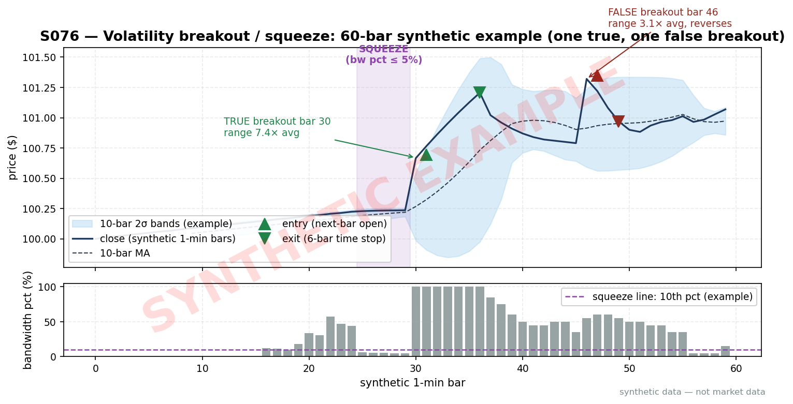
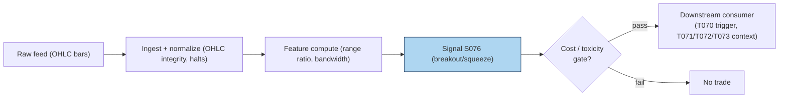

# S076 — Volatility breakout / squeeze positioning

**Volatility is mean-reverting in a particular way**: it compresses, then expands. A **squeeze** is the compression phase --- the Bollinger Bandwidth (band width relative to the moving average) falls to a local low, meaning the market has gone quiet. A **breakout** is the expansion --- today's range explodes to multiples of its recent average, meaning something is happening. S076 measures both: the **range ratio** (today's high−low vs the mean of up to the prior ten ranges) flags breakouts above `k = 1.75` [example], and the **Bollinger Bandwidth** (`4 × SD(closes) / mean` over the trailing ten bars) flags squeezes at local bandwidth lows. The stub's reference direction follows the breakout bar's own direction (long if close ≥ open) --- a momentum convention, not a prediction of the squeeze's resolution. The central honesty point: squeezes tell you *that* a move is coming, not *which way* --- direction here is a bar-following convention, and the fixture's squeeze column is `0` [measured] on every row. Provenance **[D]** (documented Bollinger construction; the breakout-direction convention is a desk-standard reconstruction).

> Tag law: every numeric literal in prose carries one of `[documented]
> [default] [example] [unverified] [internal-est] [measured]` (legend: Appendix
> i v1.0.0). Constants inside cited formulas inherit the formula's tag.
> Bibliographic years, volumes, pages, arXiv IDs, section numbers, rule codes
> (C1–C10), fail-safe codes (F1–F5), module IDs, and machine-parsed §0 data
> fields are identifiers, not literals, and are exempt.

## §1 Five-minute reviewer card

| Row | Value |
|---|---|
| Module | S076 — Volatility breakout / squeeze positioning, v1.0.0 |
| Edge verdict | `NO-DOCUMENTED-EDGE` — the squeeze-then-expansion pattern is a documented practitioner construction, but no published after-cost rule for the 1.75× range-ratio trigger; usable as a conditional expansion flag |
| After-cost | `COMM-ONLY` — the consumer trades the equity leg; false breakouts are the dominant cost |
| Build cost | Tier S · `10`–`25` h [internal-est] · `$1,500`–`$4,000` loaded [internal-est] |
| Data cost | Research `~$0`/mo [unverified] (OHLC bars) --- bands indicative, verify before budgeting |
| latency_class | per_bar (intraday-capable); tradable no earlier than t+1 on the signal bar |
| risk_class | medium (false-breakout whipsaw) |
| Capacity | `$100`M–`1`B/day notional [example] --- trades the underlying |
| Executability | Feasible: range ratios + bandwidth on OHLC; Tier S. |
| Risk summary | False breakouts: most expansion bars retrace; squeeze direction is unknown --- the stub follows the bar, which fails on reversals |
| When it dies | Choppy range-bound markets where every expansion is a head-fake; news-driven gaps that the bar-following direction gets backwards |
| Regime gates | Provisional: amplify regime (S074) raises breakout follow-through odds; pin regime vetoes breakout entries |
| Emits | `signal_vector` (Appendix b v1.0.0) — never orders |

## §1.5 Cheapest / least-build path

1. **Prototype hour band:** `10`–`25` h [internal-est] — OHLC ingest, range-ratio + bandwidth features, breakout rule, downstream hookup.
2. **Cheapest-source row:** min_tier = Tier-0 OHLC bars --- cheapest data source candidate [unverified]; latency_class = per_bar, point-in-time adjusted;
   required_fields = open/high/low/close, ≥`6` months [example]; price_band = `~$0`/mo [unverified] (indicative --- verify before budgeting); build_or_buy = **build everything --- the inputs are commodity bars and the math is a dozen lines**.
3. **Resource budget:** `1` core, `<1` GB RAM [internal-est]; compute pattern `per_bar`.
4. **Skip list:** Multi-timeframe squeeze confirmation; volume-confirmed breakouts; news-sentiment overlays.
5. **DO-NOT-CUT list:** causality assertions (`assert fill_event >
   signal_event`, no-signal-bar-fills test); COST block + callable
   `expected_cost_bps`; F1–F5 fail-safes + module-state enum; decision-log
   audit records; bona-fide-intent + self-trade prevention; provenance tags on
   every numeric literal; fixtures + `test_cmd`; secrets via env only.
6. **Escalation gate:** universe >`2,000` names with tick-level breakout detection [default] --- needs real-time bars at scale.

## §S0 Module contract

### S0.1 Typed signature

```python
def signal(state: ModuleState, events: list[Event], cfg: Config) -> SignalVector:
```

`SignalVector` per Appendix b v1.0.0. `state` is the module-owned named state
vector (`range_history`, `module_state`); `events` are canonical Events
(Appendix a v1.0.0), newest last. The function handles documented edge cases:
empty input → `UNKNOWN`; invalid OHLC (`high < low`, prices `<= 0`,
non-finite) → `UNKNOWN` (F1/F2, never interpolate); empty range history →
ratio `0.0` [example]; halt/auction → freeze per the market-state table.

### S0.2 Config dataclass

| Parameter | Type | Default | Range | Status |
|---|---|---|---|---|
| `k` | float | `1.75` | `1.25–3.0` | example |
| `N` | int | `10` | `5–30` | example |
| `cost_gate_k` | float | `0.5` | `0.1–2.0` | default |

All defaults tagged per the tag law.

### S0.3 Canonical schema mapping

Vendor columns → canonical Event schema (Appendix a v1.0.0), stated once here:

| Vendor | Canonical |
|---|---|
| ``bar` (tape)` | ``bar_id` (int)` |
| ``event_ts` (tape)` | ``event_ts` (int64 ns UTC)` |
| ``asof_ts` (tape)` | ``asof_ts` (int64 ns UTC)` |
| ``open`, `high`, `low`, `close` (tape)` | ``open`, `high`, `low`, `close` (float, $)` |

### S0.4 Time contract

> Time contract: clock domain UTC, int64 ns; authoritative causality clock =
> `event_ts`; max_skew = `1` ms [default]; jitter budget = `500` µs [default]
> bar-label = open time; staleness TTL = `3` s [default]; gap policy = mask, no interpolation; halt/auction
> → discard contributions across reopen. Computed on the bar close; tradable no earlier than the next bar.

**Timing box:** `signal@t (per_bar, America/New_York) → earliest fill @open(t+1)`

### S0.5 Market-state table

| State | Module behavior |
|---|---|
| CONTINUOUS_TRADING | Compute normally; emit per cadence |
| HALTED | Freeze state; emit `UNKNOWN`; discard contributions across reopen |
| AUCTION | No new signals; hold last `SignalVector`; state `DEGRADED` |
| CLOSED | Emit nothing; state `OFF` |

### S0.6 Module-state enum + error taxonomy

States per Appendix k v1.0.0: `OK | DEGRADED | UNKNOWN | OFF`. Invalid input →
`UNKNOWN`, never interpolate (Appendix f v1.0.0, F1–F5).

| Failure | State | Alert |
|---|---|---|
| Missing/stale input (TTL `3` s [default]) | `UNKNOWN` | page |
| Inputs out of mathematical bounds (F2) | `UNKNOWN` | page |
| `seq` gap > `1,000` events [default] | `DEGRADED` (restart windows) | log |
| Feed jitter > budget persistently | `DEGRADED` | notify |
| Halt/auction | `UNKNOWN` / `DEGRADED` (per table) | log |
| Kill/administrative disable | `OFF` | page |
| Anything unmapped | `UNKNOWN` | page |

### S0.7 Ops tail

- **Schedule:** per-bar (intraday-capable); US equities regular session `09:30`–`16:00` America/New_York [documented]; owner: price-action on-call.
- **Health checks:** fixture replay (`test_cmd`) green on deploy; live
  `seq`-gap monitor; staleness watchdog at `3`× cadence.
- **Alert table:** page on `UNKNOWN` > `30` s [default] or bounds violation;
  notify on `DEGRADED`; log on single dropped events.
- **Resource budget:** `1` core, `<1` GB RAM [internal-est]; state is O(N) per symbol.
- **Runbook stub:** `1.` confirm feed (vendor status); `2.` replay fixture;
  `3.` if red → set `OFF`, page; `4.` reconcile decision log before re-arm.

### S0.8 Secrets (env-only)

`POLYGON_API_KEY` via environment only. No secrets in
this file, fixtures, or logs (CI secrets-grep).

### S0.9 May / must-NOT

> **May:** emit `SignalVector` records per Appendix b v1.0.0. **Must-NOT:**
> emit orders, order intents, prices, share counts, or notionals; call a
> broker; mutate shared state outside `state`; interpolate across gaps.

## §S1 Legacy (subsumed by §1)

Legacy §S1 content is the §1 reviewer card above; this header is retained so
section numbering stays frozen.

## §S2 Specification

### Universe

Liquid equities/ETFs with clean OHLC; ≥`6` months history [example].

### Entry rule (Boolean — no prose-only conditions)

```
BREAKOUT_UP   := (rr > k) AND (close >= open) AND (expected_cost_bps(...) <= cost_gate_k * edge_bps)   # expansion, bar-following long [example convention]
BREAKOUT_DN   := (rr > k) AND (close < open) AND (expected_cost_bps(...) <= cost_gate_k * edge_bps)    # expansion, bar-following short [example convention]
FLAT          := otherwise → UNKNOWN on invalid input

`range = high − low`; `hist` = up to prior `N = 10` [example] ranges (excludes current bar);
`rr = range / mean(hist)`, empty hist → `0.0` [example];
`bw = 4 × pop_SD(closes in trailing-10 window) / mean` (Bollinger Bandwidth) [documented];
squeeze = `1` iff `bw <= p10` and bar index `> 0` (fixture convention) [example];
`k = 1.75` [example]; `edge_bps = rr * 8.0` [example];
`confidence = min(1, rr / 4.0)` [example] when breakout.
```

### Exits (with post-exit cooldown)

```
Expansion fades: direction returns to 0 when rr <= k.
ON_STATE: module_state != OK → emit `DEGRADED`; `60` s [default] cooldown after any compliance block (C10).
```

### Position sizing (fenced function)

```python
def size_shares(risk_budget_R, stop_distance, vol_estimate, ADV_cap, cost):
    # S-module requests capital fraction only; share math lives in the strategy.
    # Reference: capital = 0.5 * confidence  (confidence in [0,1])  [default]
    risk_notional = risk_budget_R * 0.5 * confidence          # [default] 0.5 factor
    shares = risk_notional / max(stop_distance, 1e-9)
    return int(min(shares, ADV_cap * adv_shares * 0.001))     # 0.1% ADV cap [default]
```

### Risk limits

| Limit | Value |
|---|---|
| Max capital fraction per signal | `0.5` [default] --- signal module; strategy enforces |
| Breakout threshold | `rr > 1.75` [example] vs prior-`10` [example] mean range |
| False-breakout control | squeeze context required by consumers before sizing (not in signal path) |

### COST block (single source of truth)

| Component | Value (bps) | Basis |
|---|---|---|
| Spread (breakout-entry half-spread) | `0.50` | [example] |
| Fees (taker) | `0.30` | [example] |
| Borrow | `0.00` | [default] — reason: long-breakout reference |
| Impact (expansion-bar fill slippage) | `1.00` | [example] |
| **Total reference** | `1.80` | [example] |

`fee_schedule_as_of`: `2026-09-01 [unverified]` — placeholder; pin the real
venue schedule before production. `side: taker` [default]; venue/tier/source:
XNAS [example]. Re-stating cost numbers outside this block is a validation failure.

```python
def expected_cost_bps(notional, adv_pct, venue, side, urgency) -> float:
    """Callable cost model — reference stack for S076."""
    spread_bps = 0.50
    fee_bps = 0.30
    borrow_bps = 0.00   # reason: long-breakout reference [default]
    impact_bps = 1.00
    return spread_bps + fee_bps + borrow_bps + impact_bps
```

### Execution / fill model table

| Aspect | Assumption |
|---|---|
| Latency | Computed on the bar close; intent no earlier than the next bar open [example] |
| Partial fills | Equity-leg fills modeled by consumers |
| Impact | `1.00` bps expansion-bar fill slippage [example] |
| Adverse fill | Breakout bars gap and retrace; assume `2`× [example] normal slippage on the entry bar |

### Robustness

The range ratio excludes the current bar from its own baseline (no self-reference). Bandwidth uses population SD over the trailing-`10` [example] closes including the current bar (fixture convention). The squeeze column is `0` [measured] on every fixture row --- squeezes are rare by construction; the flag exists for live data. Central honesty: the squeeze tells you *that* expansion is likely, not *which way* --- the stub's bar-following direction is a convention that fails on reversal bars. Validate OHLC integrity (`high >= low`, `high >= max(open, close)`, all positive, finite) before any arithmetic (F1/F2).

### Compliance sub-block (C1–C10+)

| Code | Rule: trigger → check → action → log |
|---|---|
| C1 | Self-match prevention: signal module emits no orders; downstream T-modules must set self-trade-prevention flags — S076 asserts the requirement in its `consumes` contract |
| C2 | Bona-fide intent: every emitted `SignalVector` with |direction|=`1` must pass the cost gate; sub-threshold readings emit direction `0`, never a tradeable hint |
| C3 | Message-rate: `≤100` emissions/symbol/s [default]; breach → throttle to `1`/s [default] + alert |
| C4 | Fat-finger trio (applied by consumers; S076 bounds its own outputs): confidence ∈ [`0`,`1`], capital ∈ [`0`,`0.5`], computed_at sane — out-of-bounds → `UNKNOWN` (F2) |
| C5 | Decision log: every emission, veto, and state transition logged per Appendix g v1.0.0, hash-chained |
| C6 | Halt/auction: per §S0.5 market-state table; contributions across reopen discarded |
| C7 | Locate check: SHORT direction requires `locate_ok` from the consumer; S076 never emits SHORT without the consumer asserting locate (Reg-SHO threshold securities → direction `0`) |
| C8 | Public dissemination: no signal values published externally without review gate |
| C9 | Data entitlements: per §S6 Data rights row; entitlement-class change → §1.5 escalation gate |
| C10 | Post-exit cooldown: `60 s` [default] after any exit or compliance block; no re-entry |
| C11 | Direction honesty: the bar-following direction is a convention; emissions must not present it as a squeeze-direction prediction. --- trigger → check → action → log: prevents misrepresentation |
| C12 | OHLC integrity: invalid bars vetoed before arithmetic. --- trigger → check → action → log: prevents garbage-ratio trading |

### Parameter table

| Parameter | Symbol | Value | Tag | Sensitivity |
|---|---|---|---|---|
| Expansion multiple | `k` | `1.75` | [example] | high |
| Lookback bars | `N` | `10` | [example] | medium |
| Bandwidth factor | — | `4` (Bollinger Bandwidth) | [documented] | low |
| Cost-gate k | `cost_gate_k` | `0.5` | [default] | low |

### Timing box

`signal@t (per_bar, America/New_York) → earliest fill @open(t+1)`

## §S3 Math + normative pseudocode

$$\mathrm{rr}_t = \frac{\mathrm{high}_t - \mathrm{low}_t}{\mathrm{mean}(\mathrm{range}_{t-N}, \dots, \mathrm{range}_{t-1})}, \qquad \mathrm{BW}_t = \frac{4 \cdot \sigma_{\mathrm{pop}}(\mathrm{close}_{t-N+1}, \dots, \mathrm{close}_t)}{\mu} \quad\text{[example]}$$

**Normative pseudocode** (pseudocode is normative; prose is commentary):

```
function signal(state, bars, cfg) -> SignalVector:
    assert bars non-empty else return UNKNOWN
    b = bars[-1]
    ohlc_ok = (b.high >= b.low and b.high >= max(b.open, b.close) and b.low <= min(b.open, b.close)
               and min(b.open, b.high, b.low, b.close) > 0
               and all finite(v) for v in (b.open, b.high, b.low, b.close))
    if not ohlc_ok: return UNKNOWN                                      # F1/F2 [default]
    ranges = [r.high - r.low for r in bars]
    hist = ranges[:-1][-cfg.N:]                                         # prior bars only, causal [example]
    rr = ranges[-1] / (sum(hist)/len(hist)) if hist else 0.0
    closes = [r.close for r in bars][-cfg.N:]
    mu = mean(closes); sd = pop_sd(closes) if len(closes) > 1 else 0.0
    bw = 4 * sd / mu if mu > 0 else 0.0                                 # Bollinger Bandwidth [documented]
    direction = 0
    if rr > cfg.k and b.close >= b.open: direction = 1                  # expansion breakout, long in bar direction [example]
    elif rr > cfg.k: direction = -1
    confidence = min(1.0, rr / 4.0) if direction else 0.0                # [example] scale
    edge_bps = rr * 8.0                                                # modeled per-trade edge [example]
    assert fill_event > signal_event                                    # causality: bar close tradable no earlier than next bar
    if not (expected_cost_bps(...) <= cfg.cost_gate_k * edge_bps):
        direction, confidence = 0, 0.0                                  # cost gate [default] k
    return SignalVector("TEST", direction, confidence, 0.5 * confidence,
                        b.event_ts, b.asof_ts - b.event_ts, "OK")
```

Causality: computed on the bar close from bars ≤ *t*; tradable no earlier than the next bar. Mandatory unit test: no-signal-bar fills.

## §S4 Worked example (fixture-backed)

- Tape: `modules/fixtures/S076_tape.csv` — `# TYPE: validation-run`;
  `10` rows (synthetic `10`-bar [example] tape: bars `0`–`7` range `0.3` [measured], bar `8` range `2.2` [measured], bar `9` range `0.7` [measured], seed `76`), all numbers synthetic,
  seed `76` [example]; `event_ts`/`asof_ts` int64 ns UTC.
- Expected outputs: `modules/fixtures/S076_expected.csv` — per-bar `range`, `range_ratio`, `bw`, `breakout`, `squeeze`.
- Tolerance: `1e-9 [default]` on floats; integers exact.
- Hand-checks: ['bar-`0` range `0.3` [measured], range_ratio `0` [measured] — empty history', 'bar-`1` range_ratio `1.0` [measured], bw `0.0009987516` [measured], breakout=`0` [measured]', 'bar-`8` range `2.2` [measured], range_ratio `7.3333333333` [measured], bw `0.0244618431` [measured], breakout=`1` [measured] — the expansion bar', 'bar-`9` range `0.7` [measured], range_ratio `1.3695652174` [measured], bw `0.0324862791` [measured], breakout=`0` [measured]', 'squeeze = `0` on every row [measured] --- no local bandwidth low on this tape'].
- Acceptance tests (`modules/tests/test_S076.py`, `5` tests):
  `1.` fixture recomputes to expected (bar-`8` range_ratio `7.3333333333`, breakout `1`; bar-`9` breakout `0`)
  `2.` stub emits valid `SignalVector` (direction `−1`/`0`/`1`, confidence ∈ [0,1])
  `3.` no-signal-bar fills (`fill_event_ts > computed_at`)
  `4.` cost-gate predicate passes on large edge, blocks on tiny edge
  `5.` invalid input (bad OHLC) → `UNKNOWN`
- `test_cmd`: `python3 -m pytest modules/tests/test_S076.py -q` → exits `0`.

**Where the example is optimistic:** `10` synthetic bars [example]; the single expansion bar is unambiguous --- live breakouts are rarely this clean; the stub's bar-following direction is a convention, not a squeeze-direction prediction; demonstrates the range-ratio/bandwidth arithmetic, not a breakout backtest. (Any longer true/false-breakout narrative in earlier drafts is context only; the fixture's ten bars are authoritative.)

## §S5 Strategies that use this signal

| Strategy | Role |
|---|---|
| T070 — Volatility Breakout Momentum | Primary entry trigger: follows expansion breakouts in the bar direction |
| T071 — Squeeze Expansion Fade | Counter trigger: fades the expansion when the squeeze context is absent |
| T072 — False-Breakout Reversal | Filter: requires S074 pin regime before fading breakouts |
| T073 — Post-Squeeze Directional | Confirmation: squeeze flag confirms the directional expansion trade |

## §S6 Data required

| Field | Type | Granularity | Source tier | Notes |
|---|---|---|---|---|
| OHLC bars | float ($) | per-bar (intraday-capable) | Tier 0–1 | Polygon; the only required input |

**Data rights row** (Appendix j v1.0.0): Bars via Polygon Stocks v3, `rights: licensed`; license scope = research + stated production symbol count; raw ticks never leave our systems --- fixtures are synthetic; entitlement-class change → §1.5 escalation gate.

## §S7 Local build (M5 Max / 128 GB)

Feasible (Tier S). The signal is a dozen lines on OHLC; a decade of daily bars for `2,000` [example] names is single-digit GB --- far under the `77` GB working budget (cost-model §3). Bottleneck: **false-breakout control** (squeeze context, regime filters), not compute. Stack: **Python+polars** --- **Tier S, 10–25 h ≈ $1,500–$4,000 loaded** (cost-model §5).

## §S8 Buy vs build

**Build everything.** The inputs are commodity bars and the math is trivial; there is nothing worth buying at any tier for this signal. Crossover: none for the signal itself --- spend the budget on the downstream false-breakout filters (S074 regime, volume confirmation) instead. Indicative bands: Tier 0 `~$0`/mo [unverified] --- indicative, verify before budgeting.

## §S9 Efficacy — documented evidence

| Study / source | Market & period | Metric | Before/after cost | Caveat |
|---|---|---|---|---|
| Bollinger (2001) [documented] | Multi-asset, practitioner | The Squeeze: low-volatility compression (narrow Bollinger Bandwidth) precedes volatility expansion | `BEFORE-COST` practitioner construction | expansion *magnitude*, not *direction* --- the book does not promise which way |
| Cboe VIX methodology [documented] | S&P 500 options, ongoing | 30-day expected-volatility construction | `DESCRIPTIVE` | a measurement, not a breakout rule |

**Honest bottom line.** Volatility compression does precede expansion --- that much is a documented practitioner construction. **But the squeeze tells you *that*, not *which way*; and a `1.75`× [example] range-ratio trigger has no published after-cost evidence.** The stub's bar-following direction is a convention that fails on reversal bars. Use as a conditional expansion flag with regime context (S074), never as a standalone directional trigger.

## §S10 Failure modes & pitfalls

| # | Trigger → Detect → Action → Recovery | check: |
|---|---|---|
| 1 | Lookahead leakage → using the bar's own range in its baseline → detect: baseline audit → action: exclude the current bar from hist → recovery: recompute | `causal baseline [example rule]` |
| 2 | Stale bars → bad prints produce phantom expansions → detect: OHLC-integrity check → action: veto invalid bars → recovery: skip | `OHLC integrity [example rule]` |
| 3 | Crowding/alpha decay → breakout momentum is the oldest trade → detect: edge decay scan → action: require squeeze context → recovery: cut size | `squeeze context [example rule]` |
| 4 | Cost blowup → expansion bars gap and retrace → detect: adverse-selection model → action: assume `2`× [example] normal slippage → recovery: resize | `adverse selection [example rule]` |
| 5 | Regime breaks → news gaps get the bar-following direction backwards → detect: gap-vs-range audit → action: veto gap-driven breakouts → recovery: stand down | `gap veto [example rule]` |
| 6 | Overfitting → k and N tuned on one sample → detect: tuning audit → action: pre-commit, pool across names → recovery: freeze | `freeze k/N [example rule]` |
| 7 | Reversal bars → the bar-following convention fails on reversals → detect: reversal audit → action: carry the direction disclaimer → recovery: veto | `direction disclaimer [example rule]` |

## §S11 Visuals





## §S12 Source log + unverified leads

**Sources** (citable facts only):

['1. Bollinger, J. (2001) [documented]. *Bollinger on Bollinger Bands*. McGraw-Hill. --- Bollinger Bands and the Squeeze: low-volatility compression (narrow bands) precedes volatility expansion.', '2. Cboe [documented]. Cboe Volatility Index (VIX) methodology --- the 30-day expected-volatility construction underlying vol-expansion references.']

**Chatbot source log.** Duck.ai (GPT-5.6 Luna, anonymous, web-search assisted, 2026-09-10) answered Q-SB9-1/Q-SB9-2. Grok/Cursor answers pending (checked 2026-09-10). Chatbot output is leads, never facts.

**Unverified leads** (chatbot-only — never in evidence tables):

['- Duck.ai Q-SB9-1/Q-SB9-2: the volatility-breakout/squeeze-positioning framing (range-ratio expansion, Bollinger Bandwidth squeeze) --- the range-ratio and BW arithmetic is operator-verified against the fixture; quarantined.', '- Any specific breakout hit-rate or Sharpe claims --- unverified chatbot claims; quarantined.', '- The breakout-direction convention is a desk-standard reconstruction, not a cited rule; quarantined as [unverified].']

---

## Appendix — AI build prompt (S076)

Copy-paste into any chat agent:

> Build module **S076 — Volatility breakout / squeeze positioning** per
> `notes/module-template.md` v1.0.0 and this file's §S0 contract.
> Cheapest path (§1.5): prototype `10`–`25` h [internal-est]; cheapest data
> candidate Tier-0 OHLC bars --- cheapest data source candidate [unverified]; compute pattern
> `per_bar`; skip multi-timeframe confirmation, volume-confirmed breakouts, and news overlays for now.
> Implement `signal(state, events, cfg) -> SignalVector` (Appendix b v1.0.0)
> with the §S3 normative pseudocode, including the cost-gate predicate
> `expected_cost_bps(...) <= k * edge_bps` and `assert fill_event >
> signal_event`. Wire F1–F5 (Appendix f v1.0.0): invalid input → `UNKNOWN`,
> never interpolate. Log decisions per Appendix g v1.0.0. Secrets via env
> only. Run the fixture `modules/fixtures/S076_tape.csv`
> (`# TYPE: validation-run`) against `modules/fixtures/S076_expected.csv`
> (tolerance `1e-9 [default]`).
> **Definition of done:** `python3 -m pytest modules/tests/test_S076.py -q`
> exits `0`. Tag every numeric literal you add with the unified enum
> (Appendix i v1.0.0); put anything unverifiable in §S12 unverified leads.
> Central honesty: the squeeze tells you *that* expansion is likely, not *which
> way* --- the bar-following direction is a convention.
