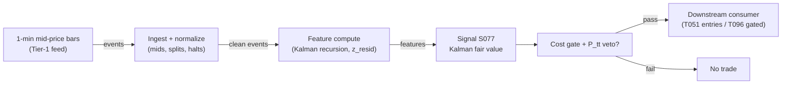

# S077 — Kalman-filtered fair value

Splits each observed price into a latent efficient (fair-value) price plus microstructure noise with a Kalman filter; trades the gap (fade) or the fair-value trend (momentum). Provenance **[D]**.

> Tag law: every numeric literal in prose carries one of `[documented]
> [default] [example] [unverified] [internal-est] [measured]` (legend: Appendix
> i v1.0.0). Constants inside cited formulas inherit the formula's tag.
> Bibliographic years, volumes, pages, arXiv IDs, section numbers, rule codes (C1–C10),
> fail-safe codes (F1–F5), module IDs, and machine-parsed §0 data fields are identifiers,
> not literals, and are exempt.

## §1 Five-minute reviewer card

| Row | Value |
|---|---|
| Module | S077 — Kalman-filtered fair value, v1.0.0 |
| Edge verdict | `PREDICTIVE-FEATURE-ONLY` |
| After-cost | `BEFORE-COST` — documented filter mechanics and an in-sample-optimized toy P&L; no published after-cost Sharpe for the standalone rule; one-sentence verdict: best-in-class noise filter, the edge lives in Q/R calibration |
| Build cost | Tier M · `20–60` h [internal-est] · `$3,000–9,000` loaded [internal-est] |
| Data cost | Research `~$30–200`/mo (Tier-1 1-min bars) [unverified]; production `~$200`/mo + usage (Tier-2 L1 for quote-mid R calibration) [unverified] — indicative, verify before budgeting |
| latency_class | intraday / minutes |
| risk_class | low (signal-only; no order placement) |
| Capacity | `$10–50`M/day notional [example] — illustrative; calibrate per venue |
| Executability | Feasible: vectorized numpy/polars; `500`-symbol 1-min batch update `~1–20` ms [internal-est]; no GPU |
| Risk summary | Calibration-dominated; dies on Q/R miscalibration, trade-price bounce contamination, Gaussianity violations (jumps), microstructure regime change |
| When it dies | Q/R miscalibrated (too smooth lags every turn; too fast chases noise); fit on raw trade prices instead of mids; structural break the local-level model never saw |
| Regime gates | Provisional: R-volatility elevated amplifies fade entries (noise share rises); R-trend amplifies fair-value momentum; jump regimes invert the fade |
| Emits | `signal_vector` (Appendix b v1.0.0) — never orders |

## §1.5 Cheapest / least-build path

1. **Prototype hour band:** `20–60` h [internal-est] — filter loop + R-from-bounce calibration + walk-forward Q/R validation against the fixture — reference implementation + gates + fixture validation.
2. **Cheapest-source row:** min_tier = Polygon.io Stocks Advanced (Tier-1 1-min bars) — cheapest data source candidate [internal-est]; latency_class = SIP-delayed;
   required_fields = 1-min mid-price bars, spread series, corporate actions; price_band = `~$30–200`/mo [unverified] (indicative — verify before budgeting); build_or_buy = **build the filter, buy the bar feed** (the filter is `~20` lines [internal-est]; Q/R calibration is the value, which no vendor sells).
3. **Resource budget:** `1` core, `<2` GB RAM [internal-est]; compute pattern `per_bar`.
4. **Skip list:** pairs form (S052 bridge) — phase 2; local-linear-trend variant — phase 2; EM/maximum-likelihood calibration — start with bounce/variance heuristics; Rust ingest; colocated deployment.
5. **DO-NOT-CUT list:** causality assertions (`assert fill_event > signal_event`, no-signal-bar-fills test); COST block + callable
   `expected_cost_bps`; F1–F5 fail-safes + module-state enum; decision-log audit records; bona-fide-intent + self-trade prevention; provenance tags on
   every numeric literal; fixtures + `test_cmd`; secrets via env only.
6. **Escalation gate:** upgrade from cheapest when any holds — measured innovation variance persistently outside `[0.5, 2.0]`× predicted [default] → re-estimate Q/R or stand down; universe `>500` symbols [default] → batch scheduler; tick-level R calibration required → Tier-2 L1 (cost-model §2).

## §S0 Module contract

### S0.1 Typed signature

```python
def signal(state: ModuleState, events: list[Event], cfg: Config) -> SignalVector:
```

`SignalVector` per Appendix b v1.0.0. `state` is the module-owned named state
vector; `events` are canonical Events (Appendix a v1.0.0), newest last. The
function handles documented edge cases: empty events → `UNKNOWN`; invalid
prices/inputs → `UNKNOWN` (F1, never interpolate); halt/auction events → freeze
per the market-state table.

### S0.2 Config dataclass

| Parameter | Type | Default | Range | Status |
|---|---|---|---|---|
| `q` | float | `0.04` | `1e-6`–`1e-2` | example |
| `r` | float | `0.16` | `1e-5`–`1e-1` | example |
| `z_entry` | float | `2.0` | `0.5`–`5.0` | default |
| `z_exit` | float | `0.5` | `0.0`–z_entry | default |
| `p0_mult` | float | `1.0` | `1`–`100` | example |
| `p_max` | float | `0.25` | `0.05`–`1.0` | default |
| `mode` | str | `fade` | {fade, momentum} | default |
| `cooldown_s` | float | `300.0` | `0`–`3,600` | default |
| `cost_gate_k` | float | `0.5` | `0.1`–`2.0` | default |

All defaults tagged per the tag law (status `default` ⇒ `[default]`, `example` ⇒ `[example]`, `calibrate` set at fit time).

### S0.3 Canonical schema mapping

Vendor columns → canonical Event schema (Appendix a v1.0.0), stated once here:

| Source field | Canonical |
|---|---|
| bar/event timestamp (exchange) | `event_ts` (int64 ns UTC) |
| ingest timestamp | `asof_ts` (int64 ns UTC) |
| symbol | `symbol` |
| mid | `mid` (module feature input) |

### S0.4 Time contract

> Time contract: clock domain UTC, int64 ns; authoritative causality clock =
> `event_ts`; max_skew = `1` ms [default]; jitter budget = `500` µs [default];
> bar-label = open time; staleness TTL = `180` s [default] (`3`× the `1`-min bar cadence per F4); gap policy = mask, no interpolation;
> halt/auction → discard contributions across reopen.

**Timing box:** `signal@t (per_bar (1-min), America/New_York) → earliest fill @open(t+1)`

### S0.5 Market-state table

| State | Module behavior |
|---|---|
| CONTINUOUS_TRADING | Compute normally; emit per cadence |
| HALTED | Freeze state; emit `UNKNOWN`; discard contributions across reopen |
| AUCTION | No new signals; hold last `SignalVector`; state `DEGRADED` |
| CLOSED | Emit nothing; state `OFF` |

### S0.6 Module-state enum + error taxonomy

States per Appendix k v1.0.0: `OK | DEGRADED | UNKNOWN | OFF`. Invalid input →
`UNKNOWN`, never interpolate (Appendix f v1.0.0, F1–F5).

| Failure | State | Alert |
|---|---|---|
| Missing/stale input (TTL `180` s [default] (`3`× the `1`-min bar cadence per F4)) | `UNKNOWN` | page |
| Invalid price/input reaching module (NaN, ≤ 0, non-finite) | `UNKNOWN` | log |
| Feature out of mathematical bounds (F2) | `UNKNOWN` | page |
| `seq` gap > `1,000` events [default] | `DEGRADED` (restart windows) | log |
| Jitter > budget persistently | `DEGRADED` | notify |
| Halt/auction | `UNKNOWN` / `DEGRADED` (per table) | log |
| Kill/administrative disable | `OFF` | page |
| Anything unmapped | `UNKNOWN` | page |

### S0.7 Ops tail

- **Schedule:** continuous during US equities regular session `09:30`–`16:00` America/New_York [documented]; owner: signals on-call.
- **Health checks:** fixture replay (`test_cmd`) green on deploy; live
  `seq`-gap monitor; staleness watchdog at `3`× cadence.
- **Alert table:** page on `UNKNOWN` > `30` s [default] or bounds violation;
  notify on `DEGRADED`; log on single dropped events.
- **Resource budget:** `1` vCPU, `2` GB RAM [internal-est]; state is O(window) per symbol.
- **Runbook stub:** `1.` confirm feed (vendor status); `2.` replay fixture;
  `3.` if red → set `OFF`, page; `4.` reconcile decision log before re-arm.

### S0.8 Secrets (env-only)

`POLYGON_API_KEY` via environment only. No secrets in this file, fixtures, or
logs (CI secrets-grep).

### S0.9 May / must-NOT

> **May:** emit `SignalVector` records per Appendix b v1.0.0. **Must-NOT:**
> emit orders, order intents, prices, share counts, or notionals; call a
> broker; mutate shared state outside `state`; interpolate across gaps.

## §S1 Legacy (subsumed by §1)

Legacy §S1 content is the §1 reviewer card above; this header is retained so
section numbering stays intact.

## §S2 Specification

### Universe

US common stocks, 1-min bars, top-`500` by trailing-`20`-day dollar volume [example]; mid-price or microprice inputs only — never raw trade prints

### Entry rule (Boolean — no prose-only conditions)

```
ENTER_FADE_LONG  := (z_resid <= -z_entry) AND (P_tt <= P_max) AND (now >= cooldown_until)
                  AND (expected_cost_bps(...) <= cost_gate_k * edge_bps)
ENTER_FADE_SHORT := (z_resid >= +z_entry) AND (P_tt <= P_max) AND (now >= cooldown_until)
                  AND (locate_ok) AND (expected_cost_bps(...) <= cost_gate_k * edge_bps)
ENTER_MOM_LONG   := (mode == "momentum") AND (dx_hat >= mom_entry)
                  AND (now >= cooldown_until) AND (expected_cost_bps(...) <= cost_gate_k * edge_bps)
FLAT             := otherwise

`z_resid = e_t / sqrt(P_{t|t} + R)`; `e_t = y_t - x_{t|t}`; `dx_hat = x_{t|t} - x_{t-1|t-1}`;
`edge_bps = |z_resid| * 5.0` [example] modeled per-trade edge.
```

### Exits (with post-exit cooldown)

```
EXIT := (direction == +1 AND z_resid > -z_exit) OR (direction == -1 AND z_resid < z_exit)
        OR (P_tt > P_max) OR (module_state != OK)
ON_EXIT: cooldown_until = now + cooldown_s   # 300 s [default]; C10
```

### Position sizing (fenced function)

```python
def size_shares(risk_budget_R, stop_distance, vol_estimate, ADV_cap, cost):
    # S-module requests capital fraction only; share math lives in the strategy.
    # Reference: capital = 0.5 * confidence  (confidence in [0,1])  [default]
    risk_notional = risk_budget_R * 0.5 * confidence          # [default] 0.5 factor
    shares = risk_notional / max(stop_distance, 1e-9)
    return int(min(shares, ADV_cap * adv_shares * 0.001))     # 0.1% ADV cap [default]
```

### Risk limits

| Limit | Value |
|---|---|
| Max capital fraction per signal | `0.5` [default] |
| Max adverse excursion before `UNKNOWN` review | `2.0`× stop [default] |
| Staleness kill | TTL `180` s [default] (`3`× the `1`-min bar cadence per F4) → `UNKNOWN` |

### COST block (single source of truth)

| Component | Value (bps) | Tag | Basis |
|---|---|---|---|
| Spread (half-spread, liquid large-cap) | `1.0` | [example] | 1-min mid, Tier-1 |
| Fees (taker incl. regulatory) | `0.30` | [example] | venue schedule placeholder |
| Borrow | `0.0` | [default] | reason: reference build long-biased; shorts add C7 locate cost |
| Impact | `0.0` | [example] | flagged; calibrate per venue at scale-up |
| **Total reference** | `1.30` [example] | | |

`fee_schedule_as_of`: `2026-09-01` [unverified] — placeholder; pin the real venue schedule before production. `side`: taker [default]; venue/tier/source: XNAS / Tier-1 SIP 1-min bars [example]. Re-stating cost numbers outside this block is a validation failure.

```python
def expected_cost_bps(notional, adv_pct, venue, side, urgency) -> float:
    # Callable cost model - constant stack (impact flagged [example]).
    spread_bps = 1.0   # [example]
    fee_bps = 0.3      # [example]
    borrow_bps = 0.0    # [default] reason in table
    impact_bps = 0.0    # [example] flagged; calibrate per venue at scale-up
    if side == "maker":
        fee_bps = -0.20  # rebate [example]
    return spread_bps + fee_bps + borrow_bps + impact_bps
```

### Execution / fill model table

| Aspect | Assumption |
|---|---|
| Latency | Signal→intent within the 1-min bar cadence [example]; SIP path latency-simulated-only |
| Partial fills | N/A (signal-only; T-module policy: Appendix c v1.0.0) |
| Impact | `0.0` bps reference [example]; stress ×`5` [example] |
| Adverse fill | Bounce haircut `0.5` bps per `1.0` |z| [example] — fade entries buy into the bounce |

### Robustness

Q/R is the only high-sensitivity knob: `Q/R` in `10^{-4}`–`1` [documented range]; estimate R from bid–ask bounce variance, Q from low-frequency variance minus the noise component; walk-forward recalibration weekly [example]; never select Q/R on the evaluation window (Benhamou in-sample caveat [documented]).

### Compliance sub-block (C1–C10+)

| Code | Rule: trigger → check → action → log |
|---|---|
| C1 | Self-match prevention: S077 emits no orders; downstream T-modules must set self-trade-prevention flags — S077 asserts the requirement in its `consumes` contract: trigger → check → action → log record |
| C2 | Bona-fide intent: every emitted `SignalVector` with |direction|=`1` must pass the cost gate; sub-threshold scores emit direction `0`, never a tradeable hint: trigger → check → action → log record |
| C3 | Message-rate: `≤100` emissions/symbol/s [default]; breach → throttle to `1`/s [default] + alert: trigger → check → action → log record |
| C4 | Fat-finger trio (applied by consumers; S077 bounds its own outputs): confidence ∈ [`0`,`1`], capital ∈ [`0`,`0.5`], computed_at sane — out-of-bounds → `UNKNOWN` (F2): trigger → check → action → log record |
| C5 | Decision log: every emission, veto, and state transition logged per Appendix g v1.0.0, hash-chained: trigger → check → action → log record |
| C6 | Halt/auction: per §S0.5 market-state table; contributions across reopen discarded: trigger → check → action → log record |
| C7 | Locate check: SHORT direction requires `locate_ok` from the consumer; S077 never emits SHORT without the consumer asserting locate (Reg-SHO threshold securities → direction `0`): trigger → check → action → log record |
| C8 | Public dissemination: no signal values published externally without review gate: trigger → check → action → log record |
| C9 | Data entitlements: per §S6 Data rights row; entitlement-class change → §1.5 escalation gate: trigger → check → action → log record |
| C10 | Post-exit cooldown: `cooldown_s` after any exit or compliance block; no re-entry: trigger → check → action → log record |
| C11 | Model-mining hygiene: the variant (local-level vs local-linear-trend vs pairs) is chosen a priori from the horizon; all tried variants are reported — trigger: variant switch → check: pre-registered choice → action: block unregistered switches → log record: trigger → check → action → log record |

### Parameter table

| Parameter | Symbol | Value | Tag | Sensitivity |
|---|---|---|---|---|
| Process-noise variance | `Q` | `0.04` | [example] | high — the tuning knob |
| Observation-noise variance | `R` | `0.16` | [example] | high — calibrate from bounce |
| Smooth↔fast ratio | `Q/R` | `0.25` | [example] | high |
| Initial variance | `P_0` | `= R` | [example] | low — burn-in only |
| Fade entry z | `z_entry` | `2.0` | [default] | high |
| Fade exit z | `z_exit` | `0.5` | [default] | medium |
| Momentum entry | `mom_entry` | `0.10` price units | [example] | medium |
| Max estimate variance | `P_max` | `0.25` | [default] | medium — veto when the filter distrusts itself |
| Post-exit cooldown | `cooldown_s` | `300` s | [default] | low |
| Cost-gate k | `cost_gate_k` | `0.5` | [default] | high |

### Timing box

`signal@t (per_bar (1-min), America/New_York) → earliest fill @open(t+1)`

## §S3 Math + normative pseudocode

Local-level state space on log-prices $y_t$, latent fair value $x_t$ [documented]:

$$x_t = x_{t-1} + \eta_t, \quad \eta_t \sim \mathcal{N}(0, Q) \qquad \text{(state)}$$ [documented]
$$y_t = x_t + \varepsilon_t, \quad \varepsilon_t \sim \mathcal{N}(0, R) \qquad \text{(observation)}$$ [documented]

**Predict:** $\hat{x}_{t|t-1} = \hat{x}_{t-1|t-1}$, $\quad P_{t|t-1} = P_{t-1|t-1} + Q$

**Update:** $K_t = \dfrac{P_{t|t-1}}{P_{t|t-1} + R}, \quad \hat{x}_{t|t} = \hat{x}_{t|t-1} + K_t\,(y_t - \hat{x}_{t|t-1}), \quad P_{t|t} = (1 - K_t)\,P_{t|t-1}$

**Tradeable objects:** fade residual $e_t = y_t - \hat{x}_{t|t}$, z-scored as $z^{resid}_t = e_t/\sqrt{P_{t|t} + R}$; fair-value momentum $\Delta\hat{x}_{t|t} = \hat{x}_{t|t} - \hat{x}_{t-1|t-1}$; one-step surprise $s_t = y_t - \hat{x}_{t|t-1}$. Scale-free knob: $\lambda = Q/R$. Variants: local linear trend (adds a slope state); pairs form (the S052 bridge); innovation-gated entries.

Causal timing: the update at `t` uses only data `≤ t`; tradable no earlier than `t+1`. Constants inside cited formulas inherit the formula's tag (`[documented]`).

**Normative pseudocode** (pseudocode is normative; prose is commentary):

```
function signal(state, events, cfg) -> SignalVector:
    assert events non-empty else return UNKNOWN                    # F1
    e = events[-1]
    assert e.mid > 0 and isfinite(e.mid) else return UNKNOWN       # F1/F2: never interpolate
    Pp = state.P + cfg.q; K = Pp / (Pp + cfg.r)                    # predict + gain
    x = state.x + K * (e.mid - state.x); P = (1 - K) * Pp          # update
    resid = e.mid - x; z = resid / sqrt(P + cfg.r)                 # z-scored fade object
    assert isfinite(z) and P >= 0 else return UNKNOWN              # F2
    edge_bps = abs(z) * 5.0                                        # [example]
    cost_ok = expected_cost_bps(notional, adv_pct, venue, side, urgency) <= cfg.cost_gate_k * edge_bps
    # ^^^ normative cost-gate predicate: expected_cost_bps(...) <= k * edge_bps
    direction = 0
    if cost_ok and e.event_ts >= state.cooldown_until and P <= cfg.p_max:
        if cfg.mode == "fade":
            direction = -1 if z >= cfg.z_entry else (+1 if z <= -cfg.z_entry else 0)
        else:
            dx = x - state.x
            direction = +1 if dx >= cfg.mom_entry else (-1 if dx <= -cfg.mom_entry else 0)
    if direction == -1 and not locate_ok: direction = 0             # C7
    confidence = min(1, abs(z) / (2*cfg.z_entry)) if direction != 0 else 0
    capital = 0.5 * confidence                                     # [default]
    state.x, state.P = x, P
    sig = SignalVector(symbol=e.symbol, direction, confidence, capital,
                       computed_at=e.event_ts, module_state=state.module_state)
    log_decision(sig, inputs_hash, params_hash)                    # C5 / Appendix g
    assert fill_event > signal_event for any fill                  # t→t+1 causality
    assert fill_event.event_ts > sig.computed_at for any fill      # machine form
    return sig
```

Causality: the computation at `t` uses only data `≤ t`; earliest reaction is
`t+1`. Mandatory unit test: no-signal-bar fills.

## §S4 Worked example (fixture-backed)

- Tape: `modules/fixtures/S077_tape.csv` — `# TYPE: validation-run`; `9` rows (t=`1`..`9`), the chapter's hand-checked synthetic series: `Q = 0.04`, `R = 0.16`, `x_{0|0} = 100.00`, `P_{0|0} = 0.16` [example]; `event_ts` int64 ns UTC, 1-min spacing.
- Expected outputs: `modules/fixtures/S077_expected.csv` — per-bar `x_hat`, `P`, `K`, `z_resid`, signal fields; hand-checked against the chapter's S4 arithmetic: `K_1 = 0.5556`, `x_{1|1} = 100.2222` [example]; `P_{1|1} = 0.0889` [example]; `e_3 = 0.0980` [example]; gain decays `0.5556 → 0.3904` toward steady-state `P ≈ 0.0625` [example].
- Tolerance: `1e-9` [default] on floats.
- Acceptance tests (`modules/tests/test_S077.py`, `6` tests): `1.` fixture loads with TYPE headers; `2.` fixture recomputes to expected (Kalman hand-checks); `3.` stub emits valid `SignalVector`; `4.` no-signal-bar fills (`fill_event_ts > computed_at`); `5.` cost-gate predicate passes on large edge, blocks on tiny edge (`k = 0.5` [default]); `6.` invalid input (NaN mid) → `UNKNOWN`.
- `test_cmd`: `python3 -m pytest modules/tests/test_S077.py -q` → exits `0`.

**Where the example is optimistic:** known Q/R, no fees, no latency, no jumps, Gaussian noise — arithmetic illustration, not a backtest. Production estimates Q/R with error, which shrinks the edge further.

## §S5 Strategies that use this signal

Generated from `deps.yaml` (CI symmetry); hand-listed here for this module:

| Strategy | Role |
|---|---|
| T051 — Kalman Fair-Value Trend | primary trigger — S077 *is* the entry logic; direction from `dx_hat`, sized by `1/sqrt(P)` [example] |
| T096 — Kalman + HMM Adaptive Trend | regime-gated variant — S077 entries gated by the S079 HMM state, timed by S078 |

## §S6 Data required

| Field | Type | Granularity | Source tier | Notes |
|---|---|---|---|---|
| Trade/quote prices | float | tick or 1-min bars [example] | Tier 1 | mid-prices preferred over last prints |
| Bid–ask spread | float | 1-min | Tier 1 | for R calibration from bounce |
| Pair leg prices (pairs form) | float | 1-min bar closes | Tier 1 | two cointegrated names; phase 2 |
| Halt / auction flags | bool | per bar | Tier 1 | exclude halt bars from the recursion |

**Data rights row** (Appendix j v1.0.0): US equities 1-min bars via Tier-1 vendor, `rights: licensed`; license scope = research + stated production symbol count (`≤500` [default]); raw bars never leave our systems — fixtures are synthetic; derived features ours; retention per vendor terms, purge path in runbook.

## §S7 Local build (M5 Max / 128 GB)

Feasible (Tier M, `20–60` h ≈ `$3,000–9,000` loaded [internal-est]; cost-model §5). Per cost-model §2: `500` scalar Kalman updates run in `<10` ms compiled [internal-est]; a `500`-symbol 1-min batch update is `~1–20` ms vectorized [internal-est]. Per cost-model §3: filter state is two floats per symbol; a `500 × 252` estimation panel is `~1` MiB [internal-est] — noise against the `77` GB working budget. Bottleneck: calibration design, not compute.

## §S8 Buy vs build

Build the filter (`~20` lines [internal-est]), buy the bar feed. Verdict: Tier-1 retail 1-min bars (`~$30–200`/mo [unverified]) carry everything the filter needs; Tier-2 L1 (`~$200`/mo + usage [unverified]) only if quote-mid R calibration is required. Prices indicative — verify before budgeting.

## §S9 Efficacy — documented evidence

| Study / source | Market & period | Metric | Before/after cost | Caveat |
|---|---|---|---|---|
| Benhamou (2016), SSRN | S&P 500 mini-future | `4` KF models: models 1–2 ≈ `$20k` net/`1`yr; model 4 (short/long-term split + extremum) ≈ `$40k` net/`1`yr, max drawdown `-$7.3k → -$2.6k` [documented] | `BEFORE-COST (reported "net", cost detail unavailable — research lead)` | parameters "obtained by general optimization… best possible choice" = in-sample optimization; overfit risk flagged by the paper itself |
| Bel Hadj Ayed et al. (2015), arXiv:1504.03934 | latent OU trend | closed-form likelihood + online estimation; quantifies damage from bad calibration of a misspecified filter [documented] | `N/A — methodology` | confirms the chapter's core warning: calibration is the product |
| Bruder, Dao, Richard & Roncalli (2011), SSRN | multi-asset momentum | trend-filtering (incl. Kalman-type) methods improve momentum strategy construction [documented] | `before/after-cost detail unverified — research lead` | cited via reference list; full text not independently opened |

Selection disclosure: these are the sources surfaced by the chapter's research
pass. Fails in: the regimes named in §S10; crowded/overfit calibrations.

## §S10 Failure modes & pitfalls

| # | Trigger → Detect → Action → Recovery | check: |
|---|---|
| 1 | Q/R miscalibration — the dominant failure: too smooth lags turns, too fast chases noise → detect: live innovation variance outside `[0.5, 2.0]`× predicted [default] → action: re-estimate Q/R on a rolling window; halve size meanwhile → recovery: walk-forward re-validation before full size | ``check: 0.5 <= innov_var_ratio <= 2.0`` |
| 2 | In-sample parameter optimism (Benhamou caveat) → detect: Q/R selected on the evaluation window → action: discard the selection; re-run purged/embargoed walk-forward (S088) → recovery: out-of-sample confirmation | ``check: selection_window < evaluation_window`` |
| 3 | Gaussianity violation (jumps) → detect: |innovation| `> 5`× predicted sd [default] → action: jump-robust pre-filter (S064); `UNKNOWN` on unmodeled jumps → recovery: resume when innovations re-normalize | ``check: abs(innov) <= 5*sd_pred`` |
| 4 | Stale-quote inputs (last prints, not mids) → detect: input schema shows trade-price feed → action: `UNKNOWN`; switch to mid/microprice → recovery: replay on mids | ``check: input_kind in {mid, microprice}`` |
| 5 | Cost blowup: per-bar edge below round-trip cost → detect: cost gate failing on `[measured]` costs → action: stand down; widen `k` only with evidence → recovery: re-pin fee schedule | ``check: expected_cost_bps(...) <= k * edge_bps`` |
| 6 | Microstructure regime change (spread/tick-size shifts alter R) → detect: rolling R estimate drifts `>50`% [default] → action: `DEGRADED`; re-estimate R → recovery: R stable `5` days [default] | ``check: R_drift <= 0.5`` |
| 7 | Lookahead leakage: filter updated with bar `t+1` data → detect: causality audit flags `fill_event ≤ signal_event` → action: halt, fix bar finalization → recovery: re-run no-signal-bar-fills test | ``check: all(fill_ts > computed_at)`` |
| 8 | Anything unmapped → detect: — → action: `UNKNOWN` + page → recovery: runbook | ``check: module_state in {OK, DEGRADED, UNKNOWN, OFF}`` |

## §S11 Visuals

`../../images/S077_example.png` — synthetic worked-example chart (seed `77` [example]).



## §S12 Source log + unverified leads

**Sources** (citable facts only):

1. Benhamou, E. (2016) [documented]. "Trend Without Hiccups — A Kalman Filter Approach." SSRN. https://papers.ssrn.com/sol3/papers.cfm?abstract_id=2747102 — 4 KF models on the S&P 500 mini-future; the combined smoothing+extremum model roughly doubles reported net profit vs. basic models while cutting max drawdown; parameters optimized in-sample (overfit caveat).
2. Bel Hadj Ayed, A. et al. (2015) [documented]. "Forecasting trends with asset prices." arXiv:1504.03934. https://arxiv.org/abs/1504.03934 — latent trend as unobservable Ornstein–Uhlenbeck process; closed-form likelihood and the cost of bad calibration in a misspecified filter.
3. Bruder, B., Dao, T.-L., Richard, J.-C. & Roncalli, T. (2011) [documented]. "Trend Filtering Methods for Momentum Strategies." SSRN. http://papers.ssrn.com/sol3/papers.cfm?abstract_id=2289097 — trend-filtering methods (including Kalman-type filters) applied to momentum strategy construction.

**Chatbot source log.** Duck.ai (GPT-5.6 Luna, `2026-09-10`) answered Q-SB9-1–Q-SB9-3; the operator hand-checked the Kalman recursion to 4th-decimal accuracy (rounding noise only, no material errors) [measured]. Grok/Cursor answers pending (checked `2026-09-10`).

**Unverified leads** (chatbot-only — never in evidence tables):

- Kalman, R.E. (1960) original filter paper and Harvey, A.C. (1989) *Forecasting, Structural Time Series Models and the Kalman Filter* — canonical references per the signal report; specific editions/URLs not verified in this pass.
- HF stat-arb reference arXiv 2210.15448 cited in the signal report — not independently opened.
- Duck.ai Q-SB9-2 planning ranges (Kalman/HMM/ARMA prototype `40–80` h; data `$50–2,000`/mo illustrative) — model-flagged estimates; §1/§1.5 use `[internal-est]`/`[unverified]` instead.

---

## Appendix — AI build prompt (S077)

Copy-paste into any chat agent:

> Build module **S077 — Kalman-filtered fair value** per `notes/module-template.md` v1.0.0 and this file's §S0 contract.
> Cheapest path (§1.5): prototype `20–60` h [internal-est] — filter loop + R-from-bounce calibration + walk-forward Q/R validation against the fixture; compute pattern `per_bar`.
> Implement `signal(state, events, cfg) -> SignalVector` (Appendix b v1.0.0)
> with the §S3 normative pseudocode, including the cost-gate predicate
> `expected_cost_bps(...) <= k * edge_bps` and `assert fill_event >
> signal_event`. Wire F1–F5 (Appendix f v1.0.0): invalid input → `UNKNOWN`,
> never interpolate. Log decisions per Appendix g v1.0.0. Secrets via env
> only. Run the fixture `modules/fixtures/S077_tape.csv`
> (`# TYPE: validation-run`) against `modules/fixtures/S077_expected.csv`
> (tolerance `1e-9` [default]).
> **Definition of done:** `python3 -m pytest modules/tests/test_S077.py -q`
> exits `0`. Tag every numeric literal you add with the unified enum
> (Appendix i v1.0.0); put anything unverifiable in §S12 unverified leads.
