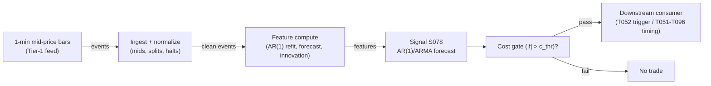

# S078 — AR(1)/ARMA short-horizon forecast

AR(1)/ARMA forecast of 1–5 min [example] mid-price returns; trades the forecast direction (only past the cost gate) or the standardized forecast error (innovation). Provenance **[D]** for the Box–Jenkins machinery; the innovation-trading z-rule is **[SR]** (research framing, not a paper rule).

> Tag law: every numeric literal in prose carries one of `[documented]
> [default] [example] [unverified] [internal-est] [measured]` (legend: Appendix
> i v1.0.0). Constants inside cited formulas inherit the formula's tag.
> Bibliographic years, volumes, pages, arXiv IDs, section numbers, rule codes (C1–C10),
> fail-safe codes (F1–F5), module IDs, and machine-parsed §0 data fields are identifiers,
> not literals, and are exempt.

## §1 Five-minute reviewer card

| Row | Value |
|---|---|
| Module | S078 — AR(1)/ARMA short-horizon forecast, v1.1.0 |
| Edge verdict | `PREDICTIVE-FEATURE-ONLY` |
| After-cost | `BEFORE-COST` — the literature documents autocorrelation structure, not a profitable AR(1) rule; no published after-cost Sharpe for standalone forecast trading; one-sentence verdict: strong filter and innovation extractor, weak standalone trigger |
| Build cost | Tier L · `4–12` h [internal-est] · `$600–1,800` loaded [internal-est] |
| Data cost | Research `$29`/mo 15-min delayed (Starter) [unverified — third-party summaries of the vendor pricing page; confirm before budgeting]; production `$199`/mo Stocks Advanced [documented, as-of 2026-09-10, vendor pricing page] |
| latency_class | intraday / 1-min |
| risk_class | low (signal-only; no order placement) |
| Capacity | `$5–20`M/day notional [example] — illustrative; calibrate per venue |
| Executability | Trivial: refitting AR(1) on `60`-bar windows for `500` symbols is sub-millisecond per full-universe refit [internal-est] (cost-model §2: numpy `~50–200`M elements/s) |
| Risk summary | Edge-per-bar usually below round-trip cost; dies on bounce-contaminated inputs, φ sign flips in regime breaks, AIC/BIC overfitting, halt/split bars in the estimation window |
| When it dies | When the per-bar edge is below spread+fees; when the fitted φ flips sign in regime breaks; when run on trade prices without removing the bid–ask bounce |
| Regime gates | Machine records in §S10 (provisional): R001 elevated-vol → veto; R005 jump → veto; R007 calm-trend → amplify; R010 wide-spread → pause_entry; R035 earnings → pause_entry |
| Emits | `signal_vector` (Appendix b v1.0.0) — never orders |

## §1.5 Cheapest / least-build path

1. **Prototype hour band:** `4–12` h [internal-est] — OLS refit + cost gate + bounce hygiene against the fixture; `500`-symbol rolling harness is phase 2 — reference implementation + gates + fixture validation.
2. **Cheapest-source row:** min_tier = Massive (ex-Polygon.io) Stocks Advanced — `$199`/mo [documented, as-of 2026-09-10, vendor pricing page https://polygon.io/pricing] (research may start on the 15-min-delayed Starter tier at `$29`/mo [unverified — third-party summaries of the vendor pricing page; confirm before budgeting], research-only); latency_class = SIP-delayed 1-min (Starter, research) / real-time SIP 1-min (Advanced, live); required_fields = 1-min aggregate bars via `GET /v2/aggs/ticker/{ticker}/range/1/minute/{from}/{to}` (record fields `o,h,l,c,v,vw,n,t` [documented]) + NBBO quotes via `GET /v3/quotes/{stockTicker}` [documented] for quote-midpoint mids and the intraday spread series + corporate actions via `/v3/reference/splits` and `/v3/reference/dividends` [documented]; price_band = `$199`/mo production [documented], `$29`/mo research [unverified] — verify before budgeting; build_or_buy = **build the estimator, buy the bar feed** (OLS is a dozen lines [internal-est]; the value is the refit discipline and bounce hygiene, which no vendor sells).
3. **Resource budget:** `1` core, `<2` GB RAM [internal-est]; compute pattern `per_bar`.
4. **Skip list:** ARMA(p,q) order search — start AR(1); cap (p,q) ≤ 3; multi-symbol panel estimation; Rust ingest; tick-level refit.
5. **DO-NOT-CUT list:** causality assertions (`assert fill_event > signal_event`, no-signal-bar-fills test); COST block + callable
   `expected_cost_bps`; F1–F5 fail-safes + module-state enum; decision-log audit records; bona-fide-intent + self-trade prevention; provenance tags on
   every numeric literal; fixtures + `test_cmd`; secrets via env only.
6. **Escalation gate:** upgrade from cheapest when any holds — measured φ̂ sign unstable across sub-periods [measured] → stand down or widen estimation window; universe `>500` symbols [default]; cost gate fails on `[measured]` costs.

## §S0 Module contract

### S0.1 Typed signature

```python
def signal(state: ModuleState, events: list[Event], cfg: Config) -> SignalVector:
```

`SignalVector` per Appendix b v1.0.0. `state` is the module-owned named state
vector; `events` are canonical Events (Appendix a v1.0.0), newest last. The
function handles documented edge cases: empty events → `UNKNOWN`; invalid
prices/inputs → `UNKNOWN` (F1, never interpolate); halt/auction events → freeze
per the market-state table.

### S0.2 Config dataclass

| Parameter | Type | Default | Range | Status |
|---|---|---|---|---|
| `p` | int | `1` | `1`–`3` | example |
| `q` | int | `0` | `0`–`2` | example |
| `phi` | float | `0.28` | `-0.9`–`0.9` | calibrate |
| `sigma_eps_bp` | float | `4.5` | `>0` | calibrate |
| `W` | int | `60` | `30`–`240` | example |
| `c_thr_bp` | float | `2.5` | `1`–`5` | example |
| `c_exit_bp` | float | `1.0` | `0.5`–`2.0` | example |
| `innov_mode` | bool | `False` | {False, True} | default |
| `z_entry` | float | `2.0` | `1.5`–`3.0` | default |
| `cooldown_s` | float | `300.0` | `0`–`3,600` | default |
| `cost_gate_k` | float | `0.5` | `0.1`–`2.0` | default |

All defaults tagged per the tag law (status `default` ⇒ `[default]`, `example` ⇒ `[example]`, `calibrate` set at fit time).

### S0.2.1 Calibration recipe (fittable parameters)

Fittable: `phi`, `sigma_eps_bp` (status `calibrate`); grids are swept for `W`, `c_thr_bp`, `z_entry` (status `example`).

- **Estimands:** `phi` ← OLS slope of r_t on r_{t-1} over window `W` [documented method — Box–Jenkins]; `sigma_eps_bp` ← residual standard deviation of the same fit.
- **Grid:** `W` ∈ {`30`, `60`, `120`, `240`} [example]; `c_thr_bp` ∈ {`1.0`, `1.5`, …, `5.0`} [example]; `z_entry` ∈ {`1.5`, `2.0`, `2.5`, `3.0`} [example]; (`p`,`q`) held at (`1`,`0`) for the calibration pass [default].
- **Walk-forward design:** rolling fit on `20` trading days [example] → evaluate on the next `5` trading days [example]; step `5` days; minimum `8` OOS folds [example]; embargo `2` trading days [example] between fit and evaluation windows (no shared bars, no shared corporate actions).
- **Selection metric:** OOS mean net edge per emitted-signal bar = mean(`edge_bps` − `expected_cost_bps(...)`) [internal-est]; tie-break: lower cross-fold CV of the cost-gate pass rate.
- **Freeze rule:** freeze the winning grid cell only if its OOS metric is within `10`% [example] of its own fold-median AND it ranks in the top quartile in ≥ `6`/`8` folds [example]; otherwise revert to the §S0.2 defaults and demote the statuses to `default`.
- **Post-freeze:** `phi`, `sigma_eps_bp` → status `default`, stamped `calibrated_as_of` in the §0 changelog; refit `phi` weekly [example] (§S2 Robustness); φ̂ sign flip across sub-periods → stand down (§S10 row 4).

### S0.3 Canonical schema mapping

Vendor columns → canonical Event schema (Appendix a v1.0.0), stated once here:

| Source field | Canonical |
|---|---|
| bar/event timestamp (exchange) | `event_ts` (int64 ns UTC) |
| ingest timestamp | `asof_ts` (int64 ns UTC) |
| symbol | `symbol` |
| mid | `mid` (module feature input) |
| market state | `market_state` ∈ {CONTINUOUS_TRADING, HALTED, AUCTION, CLOSED} (from vendor market-status/session calendar; drives §S0.5) |

### S0.4 Time contract

> Time contract: clock domain UTC, int64 ns; authoritative causality clock =
> `event_ts`; max_skew = `1` ms [default]; jitter budget = `500` µs [default];
> bar-label = open time; staleness TTL = `180` s [default] (`3`× the `1`-min bar cadence per F4); gap policy = mask, no interpolation;
> halt/auction → discard contributions across reopen.

**Timing box:** `signal@t (per_bar (1-min), America/New_York) → earliest fill @open(t+1)`

### S0.5 Market-state table

| State | Module behavior |
|---|---|
| CONTINUOUS_TRADING | Compute normally; emit per cadence |
| HALTED | Freeze state; emit `UNKNOWN`; discard contributions across reopen |
| AUCTION | No new signals; hold last `SignalVector`; state `DEGRADED` |
| CLOSED | Emit nothing; state `OFF` |

### S0.6 Module-state enum + error taxonomy

States per Appendix k v1.0.0: `OK | DEGRADED | UNKNOWN | OFF`. Invalid input →
`UNKNOWN`, never interpolate (Appendix f v1.0.0, F1–F5).

| Failure | State | Alert |
|---|---|---|
| Missing/stale input (TTL `180` s [default] (`3`× the `1`-min bar cadence per F4)) | `UNKNOWN` | page |
| Invalid price/input reaching module (NaN, ≤ 0, non-finite) | `UNKNOWN` | log |
| Feature out of mathematical bounds (F2) | `UNKNOWN` | page |
| `seq` gap > `1,000` events [default] | `DEGRADED` (restart windows) | log |
| Jitter > budget persistently | `DEGRADED` | notify |
| Halt/auction | `UNKNOWN` / `DEGRADED` (per table) | log |
| Kill/administrative disable | `OFF` | page |
| Anything unmapped | `UNKNOWN` | page |

### S0.7 Ops tail

- **Schedule:** continuous during US equities regular session `09:30`–`16:00` America/New_York [documented]; owner: signals on-call.
- **Health checks:** fixture replay (`test_cmd`) green on deploy; live
  `seq`-gap monitor; staleness watchdog at `3`× cadence.
- **Alert table:** page on `UNKNOWN` > `30` s [default] or bounds violation;
  notify on `DEGRADED`; log on single dropped events.
- **Resource budget:** `1` vCPU, `2` GB RAM [internal-est]; state is O(window) per symbol.
- **Runbook stub:** `1.` confirm feed (vendor status); `2.` replay fixture;
  `3.` if red → set `OFF`, page; `4.` reconcile decision log before re-arm.

### S0.8 Secrets (env-only)

`POLYGON_API_KEY` via environment only. No secrets in this file, fixtures, or
logs (CI secrets-grep).

### S0.9 May / must-NOT

> **May:** emit `SignalVector` records per Appendix b v1.0.0. **Must-NOT:**
> emit orders, order intents, prices, share counts, or notionals; call a
> broker; mutate shared state outside `state`; interpolate across gaps.

## §S1 Legacy (subsumed by §1)

Legacy §S1 content is the §1 reviewer card above; this header is retained so
section numbering stays intact.

## §S2 Specification

### Universe

US common stocks, 1-min mid-price bars, liquid names with spread `≤2` ticks [example]; estimation window `W = 60` bars [example]

### Entry rule (Boolean — no prose-only conditions)

```
ENTER_LONG  := (f_hat > +c_thr) AND (now >= cooldown_until)
                  AND (expected_cost_bps(...) <= cost_gate_k * edge_bps)
ENTER_SHORT := (f_hat < -c_thr) AND (now >= cooldown_until)
                  AND (locate_ok) AND (expected_cost_bps(...) <= cost_gate_k * edge_bps)
ENTER_INNOV_LONG  := (innov_mode) AND (z_t < -z_entry) AND (now >= cooldown_until)   # [SR] framing
                  AND (expected_cost_bps(...) <= cost_gate_k * edge_bps)
ENTER_INNOV_SHORT := (innov_mode) AND (z_t > +z_entry) AND (now >= cooldown_until)
                  AND (locate_ok) AND (expected_cost_bps(...) <= cost_gate_k * edge_bps)
FLAT := otherwise

`f_hat = c + Σᵢ φᵢ·r_{t-ᵢ}` (one-step forecast, data `≤ t` only);
`z_t = (r_t - f_hat)/σ̂_ε` (innovation); `edge_bps = |f_hat|` [example].
```

### Exits (with post-exit cooldown)

```
EXIT := (direction == +1 AND f_hat < +c_exit) OR (direction == -1 AND f_hat > -c_exit)
        OR (innov_mode AND z_t crosses 0 against the position)
        OR (module_state != OK)
ON_EXIT: cooldown_until = now + cooldown_s   # 300 s [default]; C10
```

### Position sizing (fenced function)

```python
def size_shares(risk_budget_R, stop_distance, vol_estimate, ADV_cap, cost):
    # S-module requests capital fraction only; share math lives in the strategy.
    # Reference: capital = 0.5 * confidence  (confidence in [0,1])  [default]
    risk_notional = risk_budget_R * 0.5 * confidence          # [default] 0.5 factor
    shares = risk_notional / max(stop_distance, 1e-9)
    return int(min(shares, ADV_cap * adv_shares * 0.001))     # 0.1% ADV cap [default]
```

### Risk limits

| Limit | Value |
|---|---|
| Max capital fraction per signal | `0.5` [default] |
| Max adverse excursion before `UNKNOWN` review | `2.0`× stop [default] |
| Staleness kill | TTL `180` s [default] (`3`× the `1`-min bar cadence per F4) → `UNKNOWN` |

### COST block (single source of truth)

| Component | Value (bps) | Tag | Basis |
|---|---|---|---|
| Spread (half-spread, liquid large-cap) | `1.0` | [example] | 1-min mid, Tier-1 |
| Fees (taker incl. regulatory) | `0.30` | [example] | venue schedule placeholder |
| Borrow | `0.0` | [default] | reason: reference build long-biased; shorts add C7 locate cost |
| borrow_bps_per_day | `0.0` | [default] | reason: reference build long-biased; multi-day short holds must add a consumer-supplied borrow charge (typical easy-to-borrow `30–100` bps/yr [unverified] ≈ `0.08–0.27` bps/day is excluded by default) |
| Impact | `0.0` | [example] | flagged; calibrate per venue at scale-up |
| **Total reference** | `1.30` [example] | | |

`fee_schedule_as_of`: `2026-09-10` [unverified] — placeholder; pin the real venue schedule before production. `side`: taker [default]; venue/tier/source: XNAS / Tier-1 SIP 1-min bars [example]. `borrow_bps_per_day` is a separate constant for multi-day holds and is NOT inside the per-trade stack below. Re-stating cost numbers outside this block is a validation failure.

```python
def expected_cost_bps(notional, adv_pct, venue, side, urgency) -> float:
    """Callable cost model — L2 constant stack; mirrors the table above exactly.
    borrow_bps_per_day (0.0 [default], reason in table) is a separate constant
    for multi-day holds, not part of this per-trade stack."""
    spread_bps = 1.0    # [example]
    fee_bps = 0.30      # [example]
    borrow_bps = 0.0    # [default] reason in table
    impact_bps = 0.0    # [example] flagged; calibrate per venue at scale-up
    if side == "maker":
        fee_bps = -0.20  # rebate [example]
    return spread_bps + fee_bps + borrow_bps + impact_bps
```

### Execution / fill model table

| Aspect | Assumption |
|---|---|
| Latency | Signal→intent within the 1-min bar cadence [example]; SIP path latency-simulated-only |
| Partial fills | N/A (signal-only; T-module policy: Appendix c v1.0.0) |
| Impact | `0.0` bps reference [example]; stress ×`5` [example] |
| Adverse fill | Forecast-chasing haircut `0.5` bps per `1.0` bp |f_hat| [example] |

### Robustness

Fit on mid-price *returns*, never raw prices (non-stationary — φ̂ drifts to `1` [documented]); z-score the innovation for cross-name comparability; cap (p,q) `≤ 3` [default]; re-check order selection weekly [example]; exclude halt/auction/split bars from estimation.

### Compliance sub-block (C1–C10+)

| Code | Rule: trigger → check → action → log |
|---|---|
| C1 | Self-match prevention: S078 emits no orders; downstream T-modules must set self-trade-prevention flags — S078 asserts the requirement in its `consumes` contract: trigger → check → action → log record |
| C2 | Bona-fide intent: every emitted `SignalVector` with |direction|=`1` must pass the cost gate; sub-threshold scores emit direction `0`, never a tradeable hint: trigger → check → action → log record |
| C3 | Message-rate: `≤100` emissions/symbol/s [default]; breach → throttle to `1`/s [default] + alert: trigger → check → action → log record |
| C4 | Fat-finger trio (applied by consumers; S078 bounds its own outputs): confidence ∈ [`0`,`1`], capital ∈ [`0`,`0.5`], computed_at sane — out-of-bounds → `UNKNOWN` (F2): trigger → check → action → log record |
| C5 | Decision log: every emission, veto, and state transition logged per Appendix g v1.0.0, hash-chained: trigger → check → action → log record |
| C6 | Halt/auction: per §S0.5 market-state table; contributions across reopen discarded: trigger → check → action → log record |
| C7 | Locate check: SHORT direction requires `locate_ok` from the consumer; S078 never emits SHORT without the consumer asserting locate (Reg-SHO threshold securities → direction `0`): trigger → check → action → log record |
| C8 | Public dissemination: no signal values published externally without review gate: trigger → check → action → log record |
| C9 | Data entitlements: per §S6 Data rights row; entitlement-class change → §1.5 escalation gate: trigger → check → action → log record |
| C10 | Post-exit cooldown: `cooldown_s` after any exit or compliance block; no re-entry: trigger → check → action → log record |
| C11 | Bounce hygiene: inputs must be mid/quote-midpoint returns, never raw trade-price returns — trigger: trade-price feed detected → check: input_kind → action: UNKNOWN until mids → log record: trigger → check → action → log record |

### Parameter table

| Parameter | Symbol | Value | Tag | Sensitivity |
|---|---|---|---|---|
| AR order | `p` | `1` | [example] | medium — prefer 1 |
| MA order | `q` | `0` | [example] | low |
| AR coefficient | `φ` | `0.28` | [example] | high — estimated, rolling |
| Estimation window | `W` | `60` bars | [example] | medium |
| Cost threshold | `c_thr` | `2.5` bp | [example] | high — the gate that matters |
| Exit threshold | `c_exit` | `1.0` bp | [example] | medium — hysteresis vs `c_thr` |
| Innovation z-entry | `z_entry` | `2.0` | [default] | high — [SR] framing |
| Post-exit cooldown | `cooldown_s` | `300` s | [default] | low |
| Cost-gate k | `cost_gate_k` | `0.5` | [default] | high |

### Timing box

`signal@t (per_bar (1-min), America/New_York) → earliest fill @open(t+1)`

## §S3 Math + normative pseudocode

**AR(1)** [documented]: $r_t = c + \varphi\cdot r_{t-1} + \varepsilon_t$, $\varepsilon_t$ white noise, $E[\varepsilon_t]=0$, $Var(\varepsilon_t)=\sigma^2_\varepsilon$.

**ARMA(p,q)** [documented]: $r_t = c + \sum_{i=1}^{p}\varphi_i r_{t-i} + \sum_{j=1}^{q}\theta_j\varepsilon_{t-j} + \varepsilon_t$.

One-step forecast (causal, data $\le t$ only): $\hat{f}_t = c + \sum_i \varphi_i r_{t-i}$.

Innovation and standardization: $\hat{\varepsilon}_t = r_t - \hat{f}_t$, $\quad z_t = \hat{\varepsilon}_t/\hat{\sigma}_\varepsilon$.

**Forecast-direction rule** [D form]: direction = sign($\hat{f}_t$) only if $|\hat{f}_t| > c_{thr}$.

**Innovation rule** [SR \u2014 research framing, not a paper rule]: long when $z_t < -2$ [default], short when $z_t > +2$ [default], exit when $z_t$ crosses $0$ [default].

**Bid\u2013ask bounce (Roll 1984)** [documented]: under constant spread $s$, trade prices follow $\Delta p_t = m_t + (s/2)(q_t-q_{t-1})$, so $Cov(\Delta p_t,\Delta p_{t-1}) = -s^2/4$ \u2014 the AR(1) coefficient on *trade* prices is mechanically negative; use mid-prices.

Tradable no earlier than `t+1`. Constants inside cited formulas inherit the formula's tag (`[documented]`).

**Units and precision:** r_t, f̂, σ̂_ε, c_thr, c_exit in basis points of log mid-price return; φ dimensionless; timestamps int64 ns UTC; precision float64; fixture tolerance `1e-9` [default].

**Normative pseudocode** (pseudocode is normative; prose is commentary). All symbols are bound in the binding block; guards are inline:

```
# ── Symbol bindings (every symbol below is bound here) ──
e            := events[-1]                        # newest canonical Event (Appendix a), data ≤ t
now_ns       := e.asof_ts                         # causality clock (§S0.4)
TTL_NS       := 180_000_000_000                   # 180 s staleness TTL [default], §S0.4
notional     := 1_000_000.0                       # [example] reference notional for the gate
adv_pct      := 0.01                              # [example] 1% of ADV participation
venue        := "XNAS"                            # [example]
side         := "taker"                           # [default]
urgency      := "normal"                           # [default]
locate_ok    := consumer.locate_assertion(e.symbol)  # C7; False unless the consumer asserts locate
inputs_hash  := sha256(canonical_bytes(e))        # C5
params_hash  := sha256(canonical_bytes(cfg))      # C5
state        := {prev_mid, prev_r, cooldown_until, module_state, last_sig}  # §S0 named state vector

function signal(state, events, cfg) -> SignalVector:
    assert len(events) > 0 else return UNKNOWN_VECTOR          # F1
    e := events[-1]
    if e.market_state == "HALTED":                            # §S0.5
        state.prev_mid := None; state.prev_r := None          # discard contributions across reopen
        return UNKNOWN_VECTOR                                 # freeze; emit UNKNOWN
    if e.market_state == "AUCTION":                            # §S0.5
        state.module_state := DEGRADED
        return HOLD_LAST(state)                               # no new signals; hold last SignalVector
    if (e.asof_ts - e.event_ts) > TTL_NS:                     # F4 staleness
        return UNKNOWN_VECTOR                                 # never interpolate
    if not (isfinite(e.mid) and e.mid > 0):                   # F1/F2
        return UNKNOWN_VECTOR
    if state.prev_mid is None:                                # warmup: no return yet
        state.prev_mid := e.mid
        return FLAT(OK, computed_at=e.event_ts)
    r := log(e.mid / state.prev_mid) * 1e4                   # this bar's return, bp
    if state.prev_r is None:                                  # warmup: one return, no lag
        state.prev_mid := e.mid; state.prev_r := r
        return FLAT(OK, computed_at=e.event_ts)
    f := cfg.phi * state.prev_r                               # one-step AR(1) forecast, data ≤ t
    innov := r - f
    z := innov / cfg.sigma_eps_bp
    if not (isfinite(f) and isfinite(z)): return UNKNOWN_VECTOR   # F2
    edge_bps := abs(f)                                        # [example]
    cost_bps := expected_cost_bps(notional, adv_pct, venue, side, urgency)
    cost_ok := cost_bps <= cfg.cost_gate_k * edge_bps         # normative cost-gate predicate
    direction := 0
    if cost_ok and e.event_ts >= state.cooldown_until:        # cooldown guard (C10)
        if not cfg.innov_mode:
            direction := +1 if f > cfg.c_thr_bp else (-1 if f < -cfg.c_thr_bp else 0)
        else:                                                  # [SR] framing
            direction := +1 if z < -cfg.z_entry else (-1 if z > cfg.z_entry else 0)
    if direction == -1 and not locate_ok: direction := 0       # C7 locate
    confidence := min(1, abs(f) / (2 * cfg.c_thr_bp)) if direction != 0 else 0
    capital := 0.5 * confidence                               # [default]
    state.prev_mid := e.mid; state.prev_r := r
    sig := SignalVector(symbol=e.symbol, direction, confidence, capital,
                        computed_at=e.event_ts, module_state=state.module_state)
    state.last_sig := sig
    log_decision(sig, inputs_hash, params_hash)               # C5 / Appendix g
    assert forall fills fl: fl.event_ts > sig.computed_at     # t→t+1 causality (machine form)
    return sig
```

**ARMA(p,q) extension hook** [example] — the reference build runs (p=1, q=0). To extend: keep ring buffers `r_hist[0..p-1]`, `eps_hist[0..q-1]` in `state`, fit `phi_vec`/`theta_vec`/`c` per the §S0.2.1 recipe (then `calibrate` status), and replace the forecast line with `f := cfg.c + Σᵢ phi_vec[i]·r_hist[i] + Σⱼ theta_vec[j]·eps_hist[j]`; every guard above applies unchanged.

Causality: the computation at `t` uses only data `≤ t`; earliest reaction is
`t+1`. Mandatory unit test: no-signal-bar fills.

## §S4 Worked example (fixture-backed)

- Tape: `modules/fixtures/S078_tape.csv` — `# TYPE: validation-run`; `12` rows (t=`0`..`11`), the chapter's synthetic 1-min mid-return tape in bp — bar `0` has no return (no prior mid); bars `1`..`11` returns: `+0.93, -1.46, -5.33, +1.70, -1.07, -0.09, +3.23, +12.29, +1.28, +2.74, +4.77` [example]; `φ = 0.28` assumed already estimated on a prior `60`-bar window [example]; gate `|f| > 2.5` bp [example]; seed `78` [example]; `event_ts` int64 ns UTC, 1-min spacing.
- Edge fixture: `modules/fixtures/S078_edge_cases.csv` — `# TYPE: validation-run`; `9` designed rows: rows `0`–`2` put `|f| ≈ 2.59` bp [example] — above the `2.5` bp [example] emission threshold but vetoed by the normative cost-gate predicate → flat; rows `3`–`4` put `|f| ≈ 2.62` bp [example] — both gates pass → `+1`; row `5` NaN mid → `UNKNOWN`; row `6` asof lag `181` s [example] > TTL → `UNKNOWN`; row `7` HALTED → `UNKNOWN` + state reset; row `8` post-halt restart bar (window restarts).
- Expected outputs: `modules/fixtures/S078_expected.csv` — per-bar `f_hat`, `innovation`, `z`, signal fields; hand-checked: bar `9`: `f_9 = 0.28 × 12.29 = +3.44` bp [example] `> 2.5` → **BUY**, tradable at bar `10`'s open; bar `8`'s `+12.29` bp print produced a `+11.39` bp innovation [example] — the surprise was nine times the forecast, and the model did not trade it.
- Tolerance: `1e-9` [default] on floats.
- Acceptance tests (`modules/tests/test_S078.py`, `10` tests): `1.` fixtures exist with TYPE headers; `2.` fixture recomputes to expected (AR hand-checks); `3.` stub emits valid `SignalVector`; `4.` no-signal-bar fills (`fill_event_ts > computed_at`); `5.` earliest fill is the next bar's open (causality pin); `6.` cost-gate predicate passes on large edge, blocks on tiny edge (`k = 0.5` [default]); `7.` gate-veto path + boundary (`|f| ≈ 2.59` flat-vetoed, `|f| ≈ 2.62` emits); `8.` invalid input (NaN mid) → `UNKNOWN`; `9.` stale input (asof lag > TTL), HALTED freeze, and post-halt window restart; `10.` cooldown veto suppresses an otherwise valid emission.
- `test_cmd`: `python3 -m pytest modules/tests/test_S078.py -q` → exits `0`.

**Where the example is optimistic:** φ is *known* (`0.28` [example]) — a real deployment estimates φ with error, which shrinks the edge further; no fees, no latency, no partial fills — arithmetic illustration, not a backtest.

## §S5 Strategies that use this signal

Generated from `deps.yaml` (CI symmetry); hand-listed here for this module:

| Strategy | Role |
|---|---|
| T052 — AR/ARMA Innovation Trader | primary trigger — trades forecast innovations per the [SR] z-rule, validated by the trade–quote VAR (S084) |
| T040 — PCA Eigenportfolio Residual Reversal | timing — AR-innovation timing of residual-reversal entries (composes S080, S039, S078) |
| T051 — Kalman Fair-Value Trend | timing/refinement input alongside the Kalman fair-value deviation (S077) |
| T096 — Kalman + HMM Adaptive Trend | AR-innovation-timed entries inside the HMM regime book |
| T057 — Fractional-Differentiation Memory Trader | timing — entries on fractionally-differenced series |

## §S6 Data required

Vendor: Massive (formerly Polygon.io — the vendor pricing page now brands itself "Massive"; fetched 2026-09-10 [documented]), product Stocks Advanced, REST base `https://api.polygon.io` (legacy URLs continue to work [documented]).

| Field | Type | Granularity | Vendor endpoint / schema | Notes |
|---|---|---|---|---|
| 1-min aggregate bars | OHLCV floats | 1-min bars (or 5-min) [default] | `GET /v2/aggs/ticker/{ticker}/range/1/minute/{from}/{to}` — record fields `o,h,l,c,v,vw,n,t` [documented] | continuity input; the module's feature input is the quote midpoint, not the bar close |
| NBBO quotes → mid price | bid/ask floats | tick / 1-min | `GET /v3/quotes/{stockTicker}` (NBBO) [documented] → mid = (bid+ask)/2, spread series in bp | required for C11 bounce hygiene and the cost-gate spread series |
| Corporate actions / splits | events | daily | `GET /v3/reference/splits`, `GET /v3/reference/dividends` [documented] | adjust returns; splits break AR continuity |
| Halt / auction flags | bool | 1-min bars | vendor market-status (`GET /v1/marketstatus/now` [documented]) + market-events feed (Advanced tier) | exclude halt bars from estimation; drive `market_state` |

Price band (as-of 2026-09-10): Stocks Advanced `$199`/mo [documented — vendor pricing page]; research/backtest may run on the 15-min-delayed Starter tier at `$29`/mo [unverified — third-party summaries of the vendor pricing page]; NBBO quote history requires Advanced tier per third-party integration notes (quotes 403 on lower tiers [unverified]). Re-verify before budgeting.

**Data rights row** (Appendix j v1.0.0): US equities 1-min bars via Tier-1 vendor, `rights: licensed`; license scope = research + stated production symbol count (`≤500` [default]); raw bars never leave our systems — fixtures are synthetic; derived features ours; retention per vendor terms, purge path in runbook.

## §S7 Local build (M5 Max / 128 GB)

Trivial-to-feasible (Tier L, `4–12` h ≈ `$600–1,800` loaded [internal-est]; cost-model §5). Per cost-model §2: refitting AR(1) on `60`-bar windows for `500` symbols is a few million flops — sub-millisecond per full-universe refit [internal-est]; numpy `~50–200`M elements/sec. Per cost-model §3: `500` symbols × `60` days of 1-min bars ≈ `12` MB [internal-est] — noise against the `77` GB working budget. Bottleneck: the feed and the corporate-action pipeline, not the math.

## §S8 Buy vs build

Build the estimator (a dozen lines of OLS [internal-est]), buy the bar feed. Verdict: Massive (ex-Polygon.io) Stocks Advanced at `$199`/mo [documented, as-of 2026-09-10] is the production feed — real-time 1-min aggregates plus NBBO quotes for quote-midpoint mids and the spread series (quote history requires Advanced tier per third-party integration notes [unverified]); research/backtest can run on the 15-min-delayed Starter tier at `$29`/mo [unverified — third-party summaries of the vendor pricing page]. Prices indicative — re-verify before budgeting.

## §S9 Efficacy — documented evidence

| Study / source | Market & period | Metric | Before/after cost | Caveat |
|---|---|---|---|---|
| Roll (1984), *J. Finance* 39(4) | US equities, trade prices | bid–ask bounce ⇒ negative first-order serial covariance; spread = 2√(−cov) [documented] | `BEFORE-COST (it *is* a cost estimator)` | positive sample covariances break the estimator (imaginary spreads) |
| Hasbrouck (1991), *J. Finance* 46(1) | NYSE issues | trade **innovations** (not raw volume) forecast quote revisions with protracted lag; VAR(p) with `5–30` lags [documented] | `BEFORE-COST (documents impact, not P&L)` | information content ≠ tradable profit; impact is concave in size |
| Bouchaud, Gefen, Potters & Wyart (2004), *Quant. Finance* 4(2) | Paris Bourse | market orders long-range correlated (persistence); limit orders mean-reverting — the tension AR models exploit [documented] | `BEFORE-COST (structural fact)` | describes order flow, not an AR(1) trading rule |

Selection disclosure: these are the sources surfaced by the chapter's research
pass. Fails in: the regimes named in §S10; crowded/overfit calibrations.

## §S10 Failure modes & pitfalls

| # | Trigger → Detect → Action → Recovery | check: |
|---|---|
| 1 | Bounce contamination (trade prices, not mids) → detect: φ̂ sign contradicts Roll's prediction on mid data → action: switch to mid/quote-midpoint returns; `UNKNOWN` until clean → recovery: sanity-check φ̂ sign | ``check: input_kind in {mid, microprice}`` |
| 2 | Look-ahead in refit → detect: forecast at `t` uses data `> t` → action: halt; refit on strictly lagged window → recovery: re-run no-signal-bar-fills test | ``check: all(fill_ts > computed_at)`` |
| 3 | Cost-gate optimism (quoted half-spread instead of effective cost) → detect: cost gate failing on `[measured]` costs → action: model spread + fees + slippage explicitly; stand down → recovery: re-pin fee schedule | ``check: expected_cost_bps(...) <= k * edge_bps`` |
| 4 | Regime flips of φ → detect: φ̂ instability across sub-periods → action: stand down on breaks; widen window → recovery: φ̂ stable `5` days [default] | ``check: phi_stable`` |
| 5 | Overfitting (p,q) by AIC/BIC mining → detect: (p,q) `> 3` or unstable across sub-periods → action: cap (p,q) `≤ 3`; prefer p = `1` → recovery: re-validate | ``check: p <= 3 and q <= 2`` |
| 6 | Halt/auction/split bars in estimation → detect: corporate-action or halt flag in window → action: exclude bars; `UNKNOWN` if window invalid → recovery: backfill and replay | ``check: no flagged bars in window`` |
| 7 | Crowding of the innovation fade → detect: [SR] z-rule entries correlate with peer flow → action: size as timing overlay, not a book → recovery: review | ``check: capital <= 0.5`` |
| 8 | Anything unmapped → detect: — → action: `UNKNOWN` + page → recovery: runbook | ``check: module_state in {OK, DEGRADED, UNKNOWN, OFF}`` |
| 9 | Stale ingest (asof lag > TTL `180` s [default]) → detect: `asof_ts − event_ts > TTL_NS` → action: `UNKNOWN`, state does not advance, no interpolation → recovery: replay after the feed recovers | ``check: asof_lag_ns <= 180_000_000_000`` |

### Regime-gate machine records (provisional)

| regime_id | direction | mechanism | condition | action | min_lag | unknown_behavior |
|---|---|---|---|---|---|---|
| R001 | degrades | elevated realized volatility swamps the AR(1) φ in 1-min microstructure noise | RV_1d > `3`× trailing `20`d median [example] | veto | `1` session [example] | veto entries |
| R005 | degrades | jumps break AR continuity; innovations become jump artifacts, not forecasts | jump flag from R005, or \|r_t\| > `10`·σ̂_ε [example] | veto | `0` | veto entries |
| R007 | amplifies | calm persistent trends stabilize the φ̂ sign and shrink estimation error | R007 trend-strength high while R001 low [example] | double | `1` session [example] | hold last label |
| R010 | degrades | wide-spread regime pushes the per-bar edge below round-trip cost | spread_bp > `2`× trailing median [example] | pause_entry | `30` min [example] | veto entries |
| R035 | degrades | earnings proximity injects jumps and breaks the rolling fit | earnings within `2` sessions [example] | pause_entry | `0` | veto entries |

## §S11 Visuals

`../../images/S078_example.png` — synthetic worked-example chart (seed `78` [example]).



## §S12 Source log + unverified leads

**Sources** (citable facts only):

1. Roll, R. (1984) [documented]. "A Simple Implicit Measure of the Effective Bid-Ask Spread in an Efficient Market." *Journal of Finance*, 39(4), 1127–1139. https://authors.library.caltech.edu/records/afwsc-6bb61 — bid–ask bounce ⇒ negative first-order serial covariance; the de-bouncing argument.
2. Hasbrouck, J. (1991) [documented]. "Measuring the Information Content of Stock Trades." *Journal of Finance*, 46(1), 179–207. http://ideas.repec.org/a/bla/jfinan/v46y1991i1p179-207.html — trade innovations forecast quote revisions with protracted lag.
3. Bouchaud, J.-P., Gefen, Y., Potters, M. & Wyart, M. (2004) [documented]. "Fluctuations and response in financial markets: the subtle nature of 'random' price changes." *Quantitative Finance*, 4(2), 176–190. http://ideas.repec.org/p/arx/papers/cond-mat-0307332.html — order-flow persistence vs mean-reverting limit orders.
4. Box, G.E.P. & Jenkins, G.M. (1970) [documented]. *Time Series Analysis: Forecasting and Control*. Holden-Day. — canonical AR/ARMA reference for the documented [D] machinery.
5. Tsay, R.S. (2005) [documented]. *Analysis of Financial Time Series*. Wiley. — canonical intraday time-series reference.

**Chatbot source log.** Duck.ai (GPT-5.6 Luna, `2026-09-10`) answered Q-SB9-1–Q-SB9-3 [chapter QA]; verified the Kalman worked example to 4th-decimal accuracy and flagged the PCA worked example as internally inconsistent (see S080 disclosure). Grok/Cursor answers pending (checked `2026-09-10`).

**Unverified leads** (chatbot-only — never in evidence tables):

- Duck.ai Q-SB9-1: the [SR] innovation-trading z-rule (long z < `-2`, short z > `+2`, exit at `0`) — a research framing with no documented efficacy; must be validated out-of-sample.
- Duck.ai Q-SB9-2 planning ranges: Kalman/HMM/ARMA prototype `40–80` h; data `$50–2,000`/mo illustrative — model-flagged estimates; §1/§1.5 use `[internal-est]`/`[unverified]` instead.
- Vendor note (web research 2026-09-10): Polygon.io now brands as Massive — the vendor pricing page titles itself "Massive" and lists Stocks Advanced at `$199`/mo (fetched 2026-09-10 [documented]); the Oct 2025 rebrand date, the `api.massive.com` base URL, the `$29`/mo Starter tier, and NBBO quotes requiring Advanced tier come from third-party integration docs [unverified] — confirm against the vendor before budgeting or building ingest.
- Typical easy-to-borrow rates (`30–100` bps/yr [unverified]) used only as the reason for excluding borrow from the reference cost stack; pin real borrow before any short book.

---

## Appendix — AI build prompt (S078)

Copy-paste into any chat agent:

> Build module **S078 — AR(1)/ARMA short-horizon forecast** (v1.1.0) per `notes/module-template.md` v1.0.0 and this file's §S0 contract.
> Cheapest path (§1.5): prototype `4–12` h [internal-est] — OLS refit + cost gate + bounce hygiene against the fixture; `500`-symbol rolling harness is phase 2; compute pattern `per_bar`.
> Data: Massive (ex-Polygon.io) Stocks Advanced `$199`/mo [documented, as-of 2026-09-10] — 1-min bars via `GET /v2/aggs/ticker/{ticker}/range/1/minute/{from}/{to}`, NBBO mids via `GET /v3/quotes/{stockTicker}`, corporate actions via `/v3/reference/splits|dividends`.
> Implement `signal(state, events, cfg) -> SignalVector` (Appendix b v1.0.0)
> with the §S3 normative pseudocode: all symbols bound per the binding block,
> guards inline (locate / cooldown / staleness TTL / halt / auction), the
> cost-gate predicate `expected_cost_bps(...) <= k * edge_bps`, and
> `assert forall fills fl: fl.event_ts > sig.computed_at`. Fit `phi`/`sigma_eps_bp`
> per the §S0.2.1 calibration recipe (walk-forward, `2`-day embargo [example],
> freeze rule). Wire F1–F5 (Appendix f v1.0.0): invalid/stale/halted input →
> `UNKNOWN`, never interpolate. Enforce the §S10 regime-gate machine records
> (R001/R005/R007/R010/R035, provisional). Log decisions per Appendix g v1.0.0.
> Secrets via env only. Run the fixtures `modules/fixtures/S078_tape.csv` and
> `modules/fixtures/S078_edge_cases.csv` (`# TYPE: validation-run`) against
> `modules/fixtures/S078_expected.csv` (tolerance `1e-9` [default]).
> **Definition of done:** `python3 -m pytest modules/tests/test_S078.py -q`
> exits `0` (`10` tests). Tag every numeric literal you add with the unified enum
> (Appendix i v1.0.0); put anything unverifiable in §S12 unverified leads.
