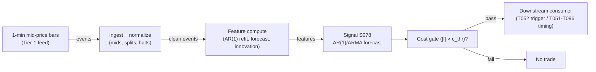

# S078 — AR(1)/ARMA short-horizon forecast

AR(1)/ARMA forecast of 1–5 min [example] mid-price returns; trades the forecast direction (only past the cost gate) or the standardized forecast error (innovation). Provenance **[D]** for the Box–Jenkins machinery; the innovation-trading z-rule is **[SR]** (research framing, not a paper rule).

> Tag law: every numeric literal in prose carries one of `[documented]
> [default] [example] [unverified] [internal-est] [measured]` (legend: Appendix
> i v1.0.0). Constants inside cited formulas inherit the formula's tag.
> Bibliographic years, volumes, pages, arXiv IDs, section numbers, rule codes (C1–C10),
> fail-safe codes (F1–F5), module IDs, and machine-parsed §0 data fields are identifiers,
> not literals, and are exempt.

## §1 Five-minute reviewer card

| Row | Value |
|---|---|
| Module | S078 — AR(1)/ARMA short-horizon forecast, v1.0.0 |
| Edge verdict | `PREDICTIVE-FEATURE-ONLY` |
| After-cost | `BEFORE-COST` — the literature documents autocorrelation structure, not a profitable AR(1) rule; no published after-cost Sharpe for standalone forecast trading; one-sentence verdict: strong filter and innovation extractor, weak standalone trigger |
| Build cost | Tier L · `4–12` h [internal-est] · `$600–1,800` loaded [internal-est] |
| Data cost | Research `~$30–200`/mo (Tier-1 1-min bars) [unverified]; production same — indicative, verify before budgeting |
| latency_class | intraday / 1-min |
| risk_class | low (signal-only; no order placement) |
| Capacity | `$5–20`M/day notional [example] — illustrative; calibrate per venue |
| Executability | Trivial: refitting AR(1) on `60`-bar windows for `500` symbols is sub-millisecond per full-universe refit [internal-est] (cost-model §2: numpy `~50–200`M elements/s) |
| Risk summary | Edge-per-bar usually below round-trip cost; dies on bounce-contaminated inputs, φ sign flips in regime breaks, AIC/BIC overfitting, halt/split bars in the estimation window |
| When it dies | When the per-bar edge is below spread+fees; when the fitted φ flips sign in regime breaks; when run on trade prices without removing the bid–ask bounce |
| Regime gates | Provisional: R-volatility elevated degrades (noise share swamps φ); calm persistent regimes amplify; jump regimes veto |
| Emits | `signal_vector` (Appendix b v1.0.0) — never orders |

## §1.5 Cheapest / least-build path

1. **Prototype hour band:** `4–12` h [internal-est] — OLS refit + cost gate + bounce hygiene against the fixture; `500`-symbol rolling harness is phase 2 — reference implementation + gates + fixture validation.
2. **Cheapest-source row:** min_tier = Polygon.io Stocks Advanced (Tier-1 1-min SIP bars) — cheapest data source candidate [internal-est]; latency_class = SIP-delayed;
   required_fields = 1-min mid-price (NBBO midpoint) bars, spread series (bp), corporate actions; price_band = `~$30–200`/mo [unverified] (indicative — verify before budgeting); build_or_buy = **build the estimator, buy the bar feed** (OLS is a dozen lines [internal-est]; the value is the refit discipline and bounce hygiene, which no vendor sells).
3. **Resource budget:** `1` core, `<2` GB RAM [internal-est]; compute pattern `per_bar`.
4. **Skip list:** ARMA(p,q) order search — start AR(1); cap (p,q) ≤ 3; multi-symbol panel estimation; Rust ingest; tick-level refit.
5. **DO-NOT-CUT list:** causality assertions (`assert fill_event > signal_event`, no-signal-bar-fills test); COST block + callable
   `expected_cost_bps`; F1–F5 fail-safes + module-state enum; decision-log audit records; bona-fide-intent + self-trade prevention; provenance tags on
   every numeric literal; fixtures + `test_cmd`; secrets via env only.
6. **Escalation gate:** upgrade from cheapest when any holds — measured φ̂ sign unstable across sub-periods [measured] → stand down or widen estimation window; universe `>500` symbols [default]; cost gate fails on `[measured]` costs.

## §S0 Module contract

### S0.1 Typed signature

```python
def signal(state: ModuleState, events: list[Event], cfg: Config) -> SignalVector:
```

`SignalVector` per Appendix b v1.0.0. `state` is the module-owned named state
vector; `events` are canonical Events (Appendix a v1.0.0), newest last. The
function handles documented edge cases: empty events → `UNKNOWN`; invalid
prices/inputs → `UNKNOWN` (F1, never interpolate); halt/auction events → freeze
per the market-state table.

### S0.2 Config dataclass

| Parameter | Type | Default | Range | Status |
|---|---|---|---|---|
| `p` | int | `1` | `1`–`3` | example |
| `q` | int | `0` | `0`–`2` | example |
| `phi` | float | `0.28` | `-0.9`–`0.9` | calibrate |
| `sigma_eps_bp` | float | `4.5` | `>0` | calibrate |
| `W` | int | `60` | `30`–`240` | example |
| `c_thr_bp` | float | `2.5` | `1`–`5` | example |
| `innov_mode` | bool | `False` | {False, True} | default |
| `z_entry` | float | `2.0` | `1.5`–`3.0` | default |
| `cooldown_s` | float | `300.0` | `0`–`3,600` | default |
| `cost_gate_k` | float | `0.5` | `0.1`–`2.0` | default |

All defaults tagged per the tag law (status `default` ⇒ `[default]`, `example` ⇒ `[example]`, `calibrate` set at fit time).

### S0.3 Canonical schema mapping

Vendor columns → canonical Event schema (Appendix a v1.0.0), stated once here:

| Source field | Canonical |
|---|---|
| bar/event timestamp (exchange) | `event_ts` (int64 ns UTC) |
| ingest timestamp | `asof_ts` (int64 ns UTC) |
| symbol | `symbol` |
| mid | `mid` (module feature input) |

### S0.4 Time contract

> Time contract: clock domain UTC, int64 ns; authoritative causality clock =
> `event_ts`; max_skew = `1` ms [default]; jitter budget = `500` µs [default];
> bar-label = open time; staleness TTL = `180` s [default] (`3`× the `1`-min bar cadence per F4); gap policy = mask, no interpolation;
> halt/auction → discard contributions across reopen.

**Timing box:** `signal@t (per_bar (1-min), America/New_York) → earliest fill @open(t+1)`

### S0.5 Market-state table

| State | Module behavior |
|---|---|
| CONTINUOUS_TRADING | Compute normally; emit per cadence |
| HALTED | Freeze state; emit `UNKNOWN`; discard contributions across reopen |
| AUCTION | No new signals; hold last `SignalVector`; state `DEGRADED` |
| CLOSED | Emit nothing; state `OFF` |

### S0.6 Module-state enum + error taxonomy

States per Appendix k v1.0.0: `OK | DEGRADED | UNKNOWN | OFF`. Invalid input →
`UNKNOWN`, never interpolate (Appendix f v1.0.0, F1–F5).

| Failure | State | Alert |
|---|---|---|
| Missing/stale input (TTL `180` s [default] (`3`× the `1`-min bar cadence per F4)) | `UNKNOWN` | page |
| Invalid price/input reaching module (NaN, ≤ 0, non-finite) | `UNKNOWN` | log |
| Feature out of mathematical bounds (F2) | `UNKNOWN` | page |
| `seq` gap > `1,000` events [default] | `DEGRADED` (restart windows) | log |
| Jitter > budget persistently | `DEGRADED` | notify |
| Halt/auction | `UNKNOWN` / `DEGRADED` (per table) | log |
| Kill/administrative disable | `OFF` | page |
| Anything unmapped | `UNKNOWN` | page |

### S0.7 Ops tail

- **Schedule:** continuous during US equities regular session `09:30`–`16:00` America/New_York [documented]; owner: signals on-call.
- **Health checks:** fixture replay (`test_cmd`) green on deploy; live
  `seq`-gap monitor; staleness watchdog at `3`× cadence.
- **Alert table:** page on `UNKNOWN` > `30` s [default] or bounds violation;
  notify on `DEGRADED`; log on single dropped events.
- **Resource budget:** `1` vCPU, `2` GB RAM [internal-est]; state is O(window) per symbol.
- **Runbook stub:** `1.` confirm feed (vendor status); `2.` replay fixture;
  `3.` if red → set `OFF`, page; `4.` reconcile decision log before re-arm.

### S0.8 Secrets (env-only)

`POLYGON_API_KEY` via environment only. No secrets in this file, fixtures, or
logs (CI secrets-grep).

### S0.9 May / must-NOT

> **May:** emit `SignalVector` records per Appendix b v1.0.0. **Must-NOT:**
> emit orders, order intents, prices, share counts, or notionals; call a
> broker; mutate shared state outside `state`; interpolate across gaps.

## §S1 Legacy (subsumed by §1)

Legacy §S1 content is the §1 reviewer card above; this header is retained so
section numbering stays intact.

## §S2 Specification

### Universe

US common stocks, 1-min mid-price bars, liquid names with spread `≤2` ticks [example]; estimation window `W = 60` bars [example]

### Entry rule (Boolean — no prose-only conditions)

```
ENTER_LONG  := (f_hat > +c_thr) AND (now >= cooldown_until)
                  AND (expected_cost_bps(...) <= cost_gate_k * edge_bps)
ENTER_SHORT := (f_hat < -c_thr) AND (now >= cooldown_until)
                  AND (locate_ok) AND (expected_cost_bps(...) <= cost_gate_k * edge_bps)
ENTER_INNOV_LONG  := (innov_mode) AND (z_t < -z_entry) AND (now >= cooldown_until)   # [SR] framing
                  AND (expected_cost_bps(...) <= cost_gate_k * edge_bps)
ENTER_INNOV_SHORT := (innov_mode) AND (z_t > +z_entry) AND (now >= cooldown_until)
                  AND (locate_ok) AND (expected_cost_bps(...) <= cost_gate_k * edge_bps)
FLAT := otherwise

`f_hat = c + Σᵢ φᵢ·r_{t-ᵢ}` (one-step forecast, data `≤ t` only);
`z_t = (r_t - f_hat)/σ̂_ε` (innovation); `edge_bps = |f_hat|` [example].
```

### Exits (with post-exit cooldown)

```
EXIT := (direction == +1 AND f_hat < +c_exit) OR (direction == -1 AND f_hat > -c_exit)
        OR (innov_mode AND z_t crosses 0 against the position)
        OR (module_state != OK)
ON_EXIT: cooldown_until = now + cooldown_s   # 300 s [default]; C10
```

### Position sizing (fenced function)

```python
def size_shares(risk_budget_R, stop_distance, vol_estimate, ADV_cap, cost):
    # S-module requests capital fraction only; share math lives in the strategy.
    # Reference: capital = 0.5 * confidence  (confidence in [0,1])  [default]
    risk_notional = risk_budget_R * 0.5 * confidence          # [default] 0.5 factor
    shares = risk_notional / max(stop_distance, 1e-9)
    return int(min(shares, ADV_cap * adv_shares * 0.001))     # 0.1% ADV cap [default]
```

### Risk limits

| Limit | Value |
|---|---|
| Max capital fraction per signal | `0.5` [default] |
| Max adverse excursion before `UNKNOWN` review | `2.0`× stop [default] |
| Staleness kill | TTL `180` s [default] (`3`× the `1`-min bar cadence per F4) → `UNKNOWN` |

### COST block (single source of truth)

| Component | Value (bps) | Tag | Basis |
|---|---|---|---|
| Spread (half-spread, liquid large-cap) | `1.0` | [example] | 1-min mid, Tier-1 |
| Fees (taker incl. regulatory) | `0.30` | [example] | venue schedule placeholder |
| Borrow | `0.0` | [default] | reason: reference build long-biased; shorts add C7 locate cost |
| Impact | `0.0` | [example] | flagged; calibrate per venue at scale-up |
| **Total reference** | `1.30` [example] | | |

`fee_schedule_as_of`: `2026-09-01` [unverified] — placeholder; pin the real venue schedule before production. `side`: taker [default]; venue/tier/source: XNAS / Tier-1 SIP 1-min bars [example]. Re-stating cost numbers outside this block is a validation failure.

```python
def expected_cost_bps(notional, adv_pct, venue, side, urgency) -> float:
    # Callable cost model - constant stack (impact flagged [example]).
    spread_bps = 1.0   # [example]
    fee_bps = 0.3      # [example]
    borrow_bps = 0.0    # [default] reason in table
    impact_bps = 0.0    # [example] flagged; calibrate per venue at scale-up
    if side == "maker":
        fee_bps = -0.20  # rebate [example]
    return spread_bps + fee_bps + borrow_bps + impact_bps
```

### Execution / fill model table

| Aspect | Assumption |
|---|---|
| Latency | Signal→intent within the 1-min bar cadence [example]; SIP path latency-simulated-only |
| Partial fills | N/A (signal-only; T-module policy: Appendix c v1.0.0) |
| Impact | `0.0` bps reference [example]; stress ×`5` [example] |
| Adverse fill | Forecast-chasing haircut `0.5` bps per `1.0` bp |f_hat| [example] |

### Robustness

Fit on mid-price *returns*, never raw prices (non-stationary — φ̂ drifts to `1` [documented]); z-score the innovation for cross-name comparability; cap (p,q) `≤ 3` [default]; re-check order selection weekly [example]; exclude halt/auction/split bars from estimation.

### Compliance sub-block (C1–C10+)

| Code | Rule: trigger → check → action → log |
|---|---|
| C1 | Self-match prevention: S078 emits no orders; downstream T-modules must set self-trade-prevention flags — S078 asserts the requirement in its `consumes` contract: trigger → check → action → log record |
| C2 | Bona-fide intent: every emitted `SignalVector` with |direction|=`1` must pass the cost gate; sub-threshold scores emit direction `0`, never a tradeable hint: trigger → check → action → log record |
| C3 | Message-rate: `≤100` emissions/symbol/s [default]; breach → throttle to `1`/s [default] + alert: trigger → check → action → log record |
| C4 | Fat-finger trio (applied by consumers; S078 bounds its own outputs): confidence ∈ [`0`,`1`], capital ∈ [`0`,`0.5`], computed_at sane — out-of-bounds → `UNKNOWN` (F2): trigger → check → action → log record |
| C5 | Decision log: every emission, veto, and state transition logged per Appendix g v1.0.0, hash-chained: trigger → check → action → log record |
| C6 | Halt/auction: per §S0.5 market-state table; contributions across reopen discarded: trigger → check → action → log record |
| C7 | Locate check: SHORT direction requires `locate_ok` from the consumer; S078 never emits SHORT without the consumer asserting locate (Reg-SHO threshold securities → direction `0`): trigger → check → action → log record |
| C8 | Public dissemination: no signal values published externally without review gate: trigger → check → action → log record |
| C9 | Data entitlements: per §S6 Data rights row; entitlement-class change → §1.5 escalation gate: trigger → check → action → log record |
| C10 | Post-exit cooldown: `cooldown_s` after any exit or compliance block; no re-entry: trigger → check → action → log record |
| C11 | Bounce hygiene: inputs must be mid/quote-midpoint returns, never raw trade-price returns — trigger: trade-price feed detected → check: input_kind → action: UNKNOWN until mids → log record: trigger → check → action → log record |

### Parameter table

| Parameter | Symbol | Value | Tag | Sensitivity |
|---|---|---|---|---|
| AR order | `p` | `1` | [example] | medium — prefer 1 |
| MA order | `q` | `0` | [example] | low |
| AR coefficient | `φ` | `0.28` | [example] | high — estimated, rolling |
| Estimation window | `W` | `60` bars | [example] | medium |
| Cost threshold | `c_thr` | `2.5` bp | [example] | high — the gate that matters |
| Innovation z-entry | `z_entry` | `2.0` | [default] | high — [SR] framing |
| Post-exit cooldown | `cooldown_s` | `300` s | [default] | low |
| Cost-gate k | `cost_gate_k` | `0.5` | [default] | high |

### Timing box

`signal@t (per_bar (1-min), America/New_York) → earliest fill @open(t+1)`

## §S3 Math + normative pseudocode

**AR(1)** [documented]: $r_t = c + \varphi\cdot r_{t-1} + \varepsilon_t$, $\varepsilon_t$ white noise, $E[\varepsilon_t]=0$, $Var(\varepsilon_t)=\sigma^2_\varepsilon$.

**ARMA(p,q)** [documented]: $r_t = c + \sum_{i=1}^{p}\varphi_i r_{t-i} + \sum_{j=1}^{q}\theta_j\varepsilon_{t-j} + \varepsilon_t$.

One-step forecast (causal, data $\le t$ only): $\hat{f}_t = c + \sum_i \varphi_i r_{t-i}$.

Innovation and standardization: $\hat{\varepsilon}_t = r_t - \hat{f}_t$, $\quad z_t = \hat{\varepsilon}_t/\hat{\sigma}_\varepsilon$.

**Forecast-direction rule** [D form]: direction = sign($\hat{f}_t$) only if $|\hat{f}_t| > c_{thr}$.

**Innovation rule** [SR \u2014 research framing, not a paper rule]: long when $z_t < -2$ [default], short when $z_t > +2$ [default], exit when $z_t$ crosses $0$ [default].

**Bid\u2013ask bounce (Roll 1984)** [documented]: under constant spread $s$, trade prices follow $\Delta p_t = m_t + (s/2)(q_t-q_{t-1})$, so $Cov(\Delta p_t,\Delta p_{t-1}) = -s^2/4$ \u2014 the AR(1) coefficient on *trade* prices is mechanically negative; use mid-prices.

Tradable no earlier than `t+1`. Constants inside cited formulas inherit the formula's tag (`[documented]`).

**Normative pseudocode** (pseudocode is normative; prose is commentary):

```
function signal(state, events, cfg) -> SignalVector:
    assert events non-empty else return UNKNOWN                    # F1
    e = events[-1]
    assert e.mid > 0 and isfinite(e.mid) else return UNKNOWN       # F1/F2: never interpolate
    r = log(e.mid / state.prev_mid) * 1e4                          # this bar's return, bp
    state.prev_mid = e.mid
    if state.prev_r is None: state.prev_r = r; return FLAT(OK, computed_at=e.event_ts)
    f = cfg.phi * state.prev_r                                     # one-step forecast, data <= t
    innov = r - f; z = innov / cfg.sigma_eps_bp
    assert isfinite(f) and isfinite(z) else return UNKNOWN         # F2
    edge_bps = abs(f)                                              # [example]
    cost_ok = expected_cost_bps(notional, adv_pct, venue, side, urgency) <= cfg.cost_gate_k * edge_bps
    # ^^^ normative cost-gate predicate: expected_cost_bps(...) <= k * edge_bps
    direction = 0
    if cost_ok and e.event_ts >= state.cooldown_until:
        if not cfg.innov_mode:
            direction = +1 if f > cfg.c_thr_bp else (-1 if f < -cfg.c_thr_bp else 0)
        else:                                                      # [SR] framing
            direction = +1 if z < -cfg.z_entry else (-1 if z > cfg.z_entry else 0)
    if direction == -1 and not locate_ok: direction = 0             # C7
    confidence = min(1, abs(f) / (2*cfg.c_thr_bp)) if direction != 0 else 0
    capital = 0.5 * confidence                                     # [default]
    state.prev_r = r
    sig = SignalVector(symbol=e.symbol, direction, confidence, capital,
                       computed_at=e.event_ts, module_state=state.module_state)
    log_decision(sig, inputs_hash, params_hash)                    # C5 / Appendix g
    assert fill_event > signal_event for any fill                  # t→t+1 causality
    assert fill_event.event_ts > sig.computed_at for any fill      # machine form
    return sig
```

Causality: the computation at `t` uses only data `≤ t`; earliest reaction is
`t+1`. Mandatory unit test: no-signal-bar fills.

## §S4 Worked example (fixture-backed)

- Tape: `modules/fixtures/S078_tape.csv` — `# TYPE: validation-run`; `12` rows (t=`0`..`11`), the chapter's synthetic 1-min mid-return tape in bp: `-3.04, +0.93, -1.46, -5.33, +1.70, -1.07, -0.09, +3.23, +12.29, +1.28, +2.74, +4.77` [example]; `φ = 0.28` assumed already estimated on a prior `60`-bar window [example]; gate `|f| > 2.5` bp [example]; seed `78` [example]; `event_ts` int64 ns UTC, 1-min spacing.
- Expected outputs: `modules/fixtures/S078_expected.csv` — per-bar `f_hat`, `innovation`, `z`, signal fields; hand-checked: bar `9`: `f_9 = 0.28 × 12.29 = +3.44` bp [example] `> 2.5` → **BUY**, tradable at bar `10`'s open; bar `8`'s `+12.29` bp print produced a `+11.39` bp innovation [example] — the surprise was nine times the forecast, and the model did not trade it.
- Tolerance: `1e-9` [default] on floats.
- Acceptance tests (`modules/tests/test_S078.py`, `6` tests): `1.` fixture loads with TYPE headers; `2.` fixture recomputes to expected (AR hand-checks); `3.` stub emits valid `SignalVector`; `4.` no-signal-bar fills (`fill_event_ts > computed_at`); `5.` cost-gate predicate passes on large edge, blocks on tiny edge (`k = 0.5` [default]); `6.` invalid input (NaN mid) → `UNKNOWN`.
- `test_cmd`: `python3 -m pytest modules/tests/test_S078.py -q` → exits `0`.

**Where the example is optimistic:** φ is *known* (`0.28` [example]) — a real deployment estimates φ with error, which shrinks the edge further; no fees, no latency, no partial fills — arithmetic illustration, not a backtest.

## §S5 Strategies that use this signal

Generated from `deps.yaml` (CI symmetry); hand-listed here for this module:

| Strategy | Role |
|---|---|
| T052 — AR/ARMA Innovation Trader | primary trigger — trades forecast innovations per the [SR] z-rule, validated by the trade–quote VAR (S084) |
| T040 — PCA Eigenportfolio Residual Reversal | timing — AR-innovation timing of residual-reversal entries (composes S080, S039, S078) |
| T051 — Kalman Fair-Value Trend | timing/refinement input alongside the Kalman fair-value deviation (S077) |
| T096 — Kalman + HMM Adaptive Trend | AR-innovation-timed entries inside the HMM regime book |
| T057 — Fractional-Differentiation Memory Trader | timing — entries on fractionally-differenced series |

## §S6 Data required

| Field | Type | Granularity | Source tier | Notes |
|---|---|---|---|---|
| Mid price / quote midpoint | float | 1-min bars (or 5-min) [default] | Tier 1–2 | prefer NBBO midpoint over trade price (de-bounced) |
| Bid–ask spread series | float (bp) | 1-min bars | Tier 1–2 | for the cost gate c_thr; intraday, not static |
| Corporate actions / splits | events | daily | Tier 0–1 | adjust returns; splits break AR continuity |
| Halt / auction flags | bool | 1-min bars | Tier 1–2 | exclude halt bars from estimation window |

**Data rights row** (Appendix j v1.0.0): US equities 1-min bars via Tier-1 vendor, `rights: licensed`; license scope = research + stated production symbol count (`≤500` [default]); raw bars never leave our systems — fixtures are synthetic; derived features ours; retention per vendor terms, purge path in runbook.

## §S7 Local build (M5 Max / 128 GB)

Trivial-to-feasible (Tier L, `4–12` h ≈ `$600–1,800` loaded [internal-est]; cost-model §5). Per cost-model §2: refitting AR(1) on `60`-bar windows for `500` symbols is a few million flops — sub-millisecond per full-universe refit [internal-est]; numpy `~50–200`M elements/sec. Per cost-model §3: `500` symbols × `60` days of 1-min bars ≈ `12` MB [internal-est] — noise against the `77` GB working budget. Bottleneck: the feed and the corporate-action pipeline, not the math.

## §S8 Buy vs build

Build the estimator (a dozen lines of OLS [internal-est]), buy the bar feed. Verdict: Tier-1 retail 1-min SIP bars (`~$30–200`/mo [unverified]) are good enough for 1-min mid returns; Tier-2 (`~$200`/mo + usage [unverified]) only for cleaner timestamps/depth. Prices indicative — verify before budgeting.

## §S9 Efficacy — documented evidence

| Study / source | Market & period | Metric | Before/after cost | Caveat |
|---|---|---|---|---|
| Roll (1984), *J. Finance* 39(4) | US equities, trade prices | bid–ask bounce ⇒ negative first-order serial covariance; spread = 2√(−cov) [documented] | `BEFORE-COST (it *is* a cost estimator)` | positive sample covariances break the estimator (imaginary spreads) |
| Hasbrouck (1991), *J. Finance* 46(1) | NYSE issues | trade **innovations** (not raw volume) forecast quote revisions with protracted lag; VAR(p) with `5–30` lags [documented] | `BEFORE-COST (documents impact, not P&L)` | information content ≠ tradable profit; impact is concave in size |
| Bouchaud, Gefen, Potters & Wyart (2004), *Quant. Finance* 4(2) | Paris Bourse | market orders long-range correlated (persistence); limit orders mean-reverting — the tension AR models exploit [documented] | `BEFORE-COST (structural fact)` | describes order flow, not an AR(1) trading rule |

Selection disclosure: these are the sources surfaced by the chapter's research
pass. Fails in: the regimes named in §S10; crowded/overfit calibrations.

## §S10 Failure modes & pitfalls

| # | Trigger → Detect → Action → Recovery | check: |
|---|---|
| 1 | Bounce contamination (trade prices, not mids) → detect: φ̂ sign contradicts Roll's prediction on mid data → action: switch to mid/quote-midpoint returns; `UNKNOWN` until clean → recovery: sanity-check φ̂ sign | ``check: input_kind in {mid, microprice}`` |
| 2 | Look-ahead in refit → detect: forecast at `t` uses data `> t` → action: halt; refit on strictly lagged window → recovery: re-run no-signal-bar-fills test | ``check: all(fill_ts > computed_at)`` |
| 3 | Cost-gate optimism (quoted half-spread instead of effective cost) → detect: cost gate failing on `[measured]` costs → action: model spread + fees + slippage explicitly; stand down → recovery: re-pin fee schedule | ``check: expected_cost_bps(...) <= k * edge_bps`` |
| 4 | Regime flips of φ → detect: φ̂ instability across sub-periods → action: stand down on breaks; widen window → recovery: φ̂ stable `5` days [default] | ``check: phi_stable`` |
| 5 | Overfitting (p,q) by AIC/BIC mining → detect: (p,q) `> 3` or unstable across sub-periods → action: cap (p,q) `≤ 3`; prefer p = `1` → recovery: re-validate | ``check: p <= 3 and q <= 2`` |
| 6 | Halt/auction/split bars in estimation → detect: corporate-action or halt flag in window → action: exclude bars; `UNKNOWN` if window invalid → recovery: backfill and replay | ``check: no flagged bars in window`` |
| 7 | Crowding of the innovation fade → detect: [SR] z-rule entries correlate with peer flow → action: size as timing overlay, not a book → recovery: review | ``check: capital <= 0.5`` |
| 8 | Anything unmapped → detect: — → action: `UNKNOWN` + page → recovery: runbook | ``check: module_state in {OK, DEGRADED, UNKNOWN, OFF}`` |

## §S11 Visuals

`../../images/S078_example.png` — synthetic worked-example chart (seed `78` [example]).



## §S12 Source log + unverified leads

**Sources** (citable facts only):

1. Roll, R. (1984) [documented]. "A Simple Implicit Measure of the Effective Bid-Ask Spread in an Efficient Market." *Journal of Finance*, 39(4), 1127–1139. https://authors.library.caltech.edu/records/afwsc-6bb61 — bid–ask bounce ⇒ negative first-order serial covariance; the de-bouncing argument.
2. Hasbrouck, J. (1991) [documented]. "Measuring the Information Content of Stock Trades." *Journal of Finance*, 46(1), 179–207. http://ideas.repec.org/a/bla/jfinan/v46y1991i1p179-207.html — trade innovations forecast quote revisions with protracted lag.
3. Bouchaud, J.-P., Gefen, Y., Potters, M. & Wyart, M. (2004) [documented]. "Fluctuations and response in financial markets: the subtle nature of 'random' price changes." *Quantitative Finance*, 4(2), 176–190. http://ideas.repec.org/p/arx/papers/cond-mat-0307332.html — order-flow persistence vs mean-reverting limit orders.
4. Box, G.E.P. & Jenkins, G.M. (1970) [documented]. *Time Series Analysis: Forecasting and Control*. Holden-Day. — canonical AR/ARMA reference for the documented [D] machinery.
5. Tsay, R.S. (2005) [documented]. *Analysis of Financial Time Series*. Wiley. — canonical intraday time-series reference.

**Chatbot source log.** Duck.ai (GPT-5.6 Luna, `2026-09-10`) answered Q-SB9-1–Q-SB9-3 [chapter QA]; verified the Kalman worked example to 4th-decimal accuracy and flagged the PCA worked example as internally inconsistent (see S080 disclosure). Grok/Cursor answers pending (checked `2026-09-10`).

**Unverified leads** (chatbot-only — never in evidence tables):

- Duck.ai Q-SB9-1: the [SR] innovation-trading z-rule (long z < `-2`, short z > `+2`, exit at `0`) — a research framing with no documented efficacy; must be validated out-of-sample.
- Duck.ai Q-SB9-2 planning ranges: Kalman/HMM/ARMA prototype `40–80` h; data `$50–2,000`/mo illustrative — model-flagged estimates; §1/§1.5 use `[internal-est]`/`[unverified]` instead.

---

## Appendix — AI build prompt (S078)

Copy-paste into any chat agent:

> Build module **S078 — AR(1)/ARMA short-horizon forecast** per `notes/module-template.md` v1.0.0 and this file's §S0 contract.
> Cheapest path (§1.5): prototype `4–12` h [internal-est] — OLS refit + cost gate + bounce hygiene against the fixture; `500`-symbol rolling harness is phase 2; compute pattern `per_bar`.
> Implement `signal(state, events, cfg) -> SignalVector` (Appendix b v1.0.0)
> with the §S3 normative pseudocode, including the cost-gate predicate
> `expected_cost_bps(...) <= k * edge_bps` and `assert fill_event >
> signal_event`. Wire F1–F5 (Appendix f v1.0.0): invalid input → `UNKNOWN`,
> never interpolate. Log decisions per Appendix g v1.0.0. Secrets via env
> only. Run the fixture `modules/fixtures/S078_tape.csv`
> (`# TYPE: validation-run`) against `modules/fixtures/S078_expected.csv`
> (tolerance `1e-9` [default]).
> **Definition of done:** `python3 -m pytest modules/tests/test_S078.py -q`
> exits `0`. Tag every numeric literal you add with the unified enum
> (Appendix i v1.0.0); put anything unverifiable in §S12 unverified leads.
