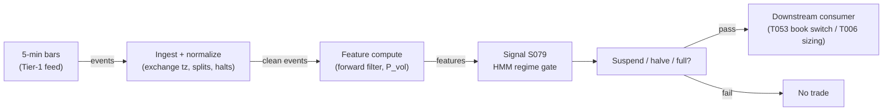

# S079 — HMM regime switching

A hidden Markov model infers the market's latent regime — calm vs. volatile — from returns, and gates other signals by the filtered regime probability. A meta-signal (risk dial / veto), not a directional trigger. Provenance **[D]** (Hamilton 1989 lineage; Christensen–Godsill–Turner 2020).

> Tag law: every numeric literal in prose carries one of `[documented]
> [default] [example] [unverified] [internal-est] [measured]` (legend: Appendix
> i v1.0.0). Constants inside cited formulas inherit the formula's tag.
> Bibliographic years, volumes, pages, arXiv IDs, section numbers, rule codes (C1–C10),
> fail-safe codes (F1–F5), module IDs, and machine-parsed §0 data fields are identifiers,
> not literals, and are exempt.

## §1 Five-minute reviewer card

| Row | Value |
|---|---|
| Module | S079 — HMM regime switching, v1.0.0 |
| Edge verdict | `PREDICTIVE-FEATURE-ONLY` |
| After-cost | `AFTER-COST` on monthly allocation (Nystrup et al. 2017, tx costs + delay modeled) but `BEFORE-COST` intraday (Christensen et al. 2020, no after-cost trading Sharpe); one-sentence verdict: documented regime allocator, weak standalone directional trigger — use as a gate |
| Build cost | Tier M · `20–60` h [internal-est] · `$3,000–9,000` loaded [internal-est] |
| Data cost | Research `~$30–200`/mo (Tier-1 1-min/5-min bars) [unverified]; production same — indicative, verify before budgeting |
| latency_class | intraday / 5-min |
| risk_class | low (signal-only; no order placement) |
| Capacity | `$50–200`M/day notional [example] — as a gate it scales with the book it governs |
| Executability | Trivial: forward filter O(K²) per bar is microseconds [internal-est]; Baum–Welch on `60` days of 5-min bars is seconds [internal-est]; `500`-symbol weekly refit in minutes, embarrassingly parallel |
| Risk summary | Meta-signal risk: detection lag (`1–2` periods [documented]) at every turn; label switching between refits; EM local maxima; smoothed-vs-filtered lookahead is the catastrophic bug class |
| When it dies | Fast regime whipsaws, structural breaks the model never saw, overfit state counts; `1–2` period detection lag at every turn |
| Regime gates | Provisional: this module *is* a regime gate for other modules; its own gates — R-volatility extreme inverts (labels flicker); R-trend amplifies persistence |
| Emits | `signal_vector` (Appendix b v1.0.0) — never orders |

## §1.5 Cheapest / least-build path

1. **Prototype hour band:** `20–60` h [internal-est] — forward filter + Baum–Welch + label-stability harness against the fixture — reference implementation + gates + fixture validation.
2. **Cheapest-source row:** min_tier = Polygon.io Stocks Advanced (Tier-1 1-min/5-min SIP bars) — cheapest data source candidate [internal-est]; latency_class = SIP-delayed;
   required_fields = 1-min or 5-min OHLC bars (exchange tz), volume, session/halt flags; price_band = `~$30–200`/mo [unverified] (indicative — verify before budgeting); build_or_buy = **build the filter, buy the bar feed** (forward filter is microseconds per bar [internal-est]; the value is the live/filtered discipline and label stability, which no vendor sells).
3. **Resource budget:** `1` core, `<2` GB RAM [internal-est]; compute pattern `per_bar`.
4. **Skip list:** Baum–Welch online refit — start with fixed true-style params, weekly batch refit; K `> 2` states — start 2-state; side-information extensions (Christensen et al.) — phase 2; Rust.
5. **DO-NOT-CUT list:** causality assertions (`assert fill_event > signal_event`, no-signal-bar-fills test); COST block + callable
   `expected_cost_bps`; F1–F5 fail-safes + module-state enum; decision-log audit records; bona-fide-intent + self-trade prevention; provenance tags on
   every numeric literal; fixtures + `test_cmd`; secrets via env only.
6. **Escalation gate:** upgrade from cheapest when any holds — label flicker: state flips `>3`×/day [default] → widen hysteresis or drop to 1-state; detection lag causes whipsaw losses [measured] → min-persistence bands; universe `>500` symbols [default].

## §S0 Module contract

### S0.1 Typed signature

```python
def signal(state: ModuleState, events: list[Event], cfg: Config) -> SignalVector:
```

`SignalVector` per Appendix b v1.0.0. `state` is the module-owned named state
vector; `events` are canonical Events (Appendix a v1.0.0), newest last. The
function handles documented edge cases: empty events → `UNKNOWN`; invalid
prices/inputs → `UNKNOWN` (F1, never interpolate); halt/auction events → freeze
per the market-state table.

### S0.2 Config dataclass

| Parameter | Type | Default | Range | Status |
|---|---|---|---|---|
| `K` | int | `2` | `2`–`4` | example |
| `p_halve` | float | `0.7` | `0.5`–`0.9` | example |
| `p_suspend` | float | `0.8` | `0.6`–`0.95` | example |
| `A` | matrix | `[[0.97,0.03],[0.08,0.92]]` | rows sum to 1 | calibrate |
| `mu` | vector | `[3.0,-5.0]` bp | real | calibrate |
| `sigma` | vector | `[40.0,120.0]` bp | `>0` | calibrate |
| `cooldown_s` | float | `300.0` | `0`–`3,600` | default |
| `cost_gate_k` | float | `0.5` | `0.1`–`2.0` | default |

All defaults tagged per the tag law (status `default` ⇒ `[default]`, `example` ⇒ `[example]`, `calibrate` set at fit time).

### S0.3 Canonical schema mapping

Vendor columns → canonical Event schema (Appendix a v1.0.0), stated once here:

| Source field | Canonical |
|---|---|
| bar/event timestamp (exchange) | `event_ts` (int64 ns UTC) |
| ingest timestamp | `asof_ts` (int64 ns UTC) |
| symbol | `symbol` |
| ret_bp | `ret_bp` (module feature input) |

### S0.4 Time contract

> Time contract: clock domain UTC, int64 ns; authoritative causality clock =
> `event_ts`; max_skew = `1` ms [default]; jitter budget = `500` µs [default];
> bar-label = open time; staleness TTL = `900` s [default] (`3`× the `5`-min bar cadence per F4); gap policy = mask, no interpolation;
> halt/auction → discard contributions across reopen.

**Timing box:** `signal@t (per_bar (5-min), America/New_York) → earliest fill @open(t+1)`

### S0.5 Market-state table

| State | Module behavior |
|---|---|
| CONTINUOUS_TRADING | Compute normally; emit per cadence |
| HALTED | Freeze state; emit `UNKNOWN`; discard contributions across reopen |
| AUCTION | No new signals; hold last `SignalVector`; state `DEGRADED` |
| CLOSED | Emit nothing; state `OFF` |

### S0.6 Module-state enum + error taxonomy

States per Appendix k v1.0.0: `OK | DEGRADED | UNKNOWN | OFF`. Invalid input →
`UNKNOWN`, never interpolate (Appendix f v1.0.0, F1–F5).

| Failure | State | Alert |
|---|---|---|
| Missing/stale input (TTL `900` s [default] (`3`× the `5`-min bar cadence per F4)) | `UNKNOWN` | page |
| Invalid price/input reaching module (NaN, ≤ 0, non-finite) | `UNKNOWN` | log |
| Feature out of mathematical bounds (F2) | `UNKNOWN` | page |
| `seq` gap > `1,000` events [default] | `DEGRADED` (restart windows) | log |
| Jitter > budget persistently | `DEGRADED` | notify |
| Halt/auction | `UNKNOWN` / `DEGRADED` (per table) | log |
| Kill/administrative disable | `OFF` | page |
| Anything unmapped | `UNKNOWN` | page |

### S0.7 Ops tail

- **Schedule:** continuous during US equities regular session `09:30`–`16:00` America/New_York [documented]; owner: signals on-call.
- **Health checks:** fixture replay (`test_cmd`) green on deploy; live
  `seq`-gap monitor; staleness watchdog at `3`× cadence.
- **Alert table:** page on `UNKNOWN` > `30` s [default] or bounds violation;
  notify on `DEGRADED`; log on single dropped events.
- **Resource budget:** `1` vCPU, `2` GB RAM [internal-est]; state is O(window) per symbol.
- **Runbook stub:** `1.` confirm feed (vendor status); `2.` replay fixture;
  `3.` if red → set `OFF`, page; `4.` reconcile decision log before re-arm.

### S0.8 Secrets (env-only)

`POLYGON_API_KEY` via environment only. No secrets in this file, fixtures, or
logs (CI secrets-grep).

### S0.9 May / must-NOT

> **May:** emit `SignalVector` records per Appendix b v1.0.0. **Must-NOT:**
> emit orders, order intents, prices, share counts, or notionals; call a
> broker; mutate shared state outside `state`; interpolate across gaps.

## §S1 Legacy (subsumed by §1)

Legacy §S1 content is the §1 reviewer card above; this header is retained so
section numbering stays intact.

## §S2 Specification

### Universe

US equities / ES futures, 5-min bars [example]; liquid names; `20–120` days training [example]

### Entry rule (Boolean — no prose-only conditions)

```
GATE_CALM     := (P_vol < p_halve)            # full risk for downstream signals
GATE_ELEVATED := (p_halve <= P_vol < p_suspend)  # halve downstream size
GATE_VOLATILE := (P_vol >= p_suspend)           # SUSPEND downstream entries
DIRECTION := +1 if GATE_CALM else (0 if GATE_ELEVATED else -1)   # risk-on / neutral / risk-off
EMIT := (module_state == OK) AND (expected_cost_bps(...) <= cost_gate_k * edge_bps)
FLAT := otherwise

`P_vol` = filtered P(volatile | data `≤ t`) via the forward algorithm (never the smoother);
`edge_bps = 2.0` [example] modeled per-bar risk-avoidance value.
```

### Exits (with post-exit cooldown)

```
EXIT := (P_vol crosses above p_suspend while DIRECTION != -1)   # gate flips are the exits
        OR (module_state != OK)
ON_EXIT: cooldown_until = now + cooldown_s   # 300 s [default]; C10
```

### Position sizing (fenced function)

```python
def size_shares(risk_budget_R, stop_distance, vol_estimate, ADV_cap, cost):
    # S-module requests capital fraction only; share math lives in the strategy.
    # Reference: capital = 0.5 * confidence  (confidence in [0,1])  [default]
    risk_notional = risk_budget_R * 0.5 * confidence          # [default] 0.5 factor
    shares = risk_notional / max(stop_distance, 1e-9)
    return int(min(shares, ADV_cap * adv_shares * 0.001))     # 0.1% ADV cap [default]
```

### Risk limits

| Limit | Value |
|---|---|
| Max capital fraction per signal | `0.5` [default] |
| Max adverse excursion before `UNKNOWN` review | `2.0`× stop [default] |
| Staleness kill | TTL `900` s [default] (`3`× the `5`-min bar cadence per F4) → `UNKNOWN` |

### COST block (single source of truth)

| Component | Value (bps) | Tag | Basis |
|---|---|---|---|
| Spread (half-spread, liquid large-cap) | `1.0` | [example] | 5-min bars, Tier-1 |
| Fees (taker incl. regulatory) | `0.30` | [example] | venue schedule placeholder |
| Borrow | `0.0` | [default] | reason: meta-signal; no direct position |
| Impact | `0.0` | [example] | flagged; the gate itself trades nothing |
| **Total reference** | `1.30` [example] | | |

`fee_schedule_as_of`: `2026-09-01` [unverified] — placeholder; pin the real venue schedule before production. `side`: taker [default]; venue/tier/source: XNAS / Tier-1 SIP 5-min bars [example]. Re-stating cost numbers outside this block is a validation failure.

```python
def expected_cost_bps(notional, adv_pct, venue, side, urgency) -> float:
    # Callable cost model - constant stack (impact flagged [example]).
    spread_bps = 1.0   # [example]
    fee_bps = 0.3      # [example]
    borrow_bps = 0.0    # [default] reason in table
    impact_bps = 0.0    # [example] flagged; calibrate per venue at scale-up
    if side == "maker":
        fee_bps = -0.20  # rebate [example]
    return spread_bps + fee_bps + borrow_bps + impact_bps
```

### Execution / fill model table

| Aspect | Assumption |
|---|---|
| Latency | Signal→intent within the 5-min bar cadence [example]; SIP path latency-simulated-only |
| Partial fills | N/A (signal-only; T-module policy: Appendix c v1.0.0) |
| Impact | `0.0` bps reference [example]; the gate sizes others, it does not trade |
| Adverse fill | Detection-lag haircut: `1–2` bars of wrong-regime exposure [documented] |

### Robustness

Two states, relabel by estimated σ ascending after every fit (label switching); multiple random EM inits, keep best likelihood; hysteresis bands `0.7`/`0.8` [example] around the suspend line; min-persistence before flips; **live code must call only the forward filter — never the forward–backward smoother**.

### Compliance sub-block (C1–C10+)

| Code | Rule: trigger → check → action → log |
|---|---|
| C1 | Self-match prevention: S079 emits no orders; downstream T-modules must set self-trade-prevention flags — S079 asserts the requirement in its `consumes` contract: trigger → check → action → log record |
| C2 | Bona-fide intent: every emitted `SignalVector` with |direction|=`1` must pass the cost gate; sub-threshold scores emit direction `0`, never a tradeable hint: trigger → check → action → log record |
| C3 | Message-rate: `≤100` emissions/symbol/s [default]; breach → throttle to `1`/s [default] + alert: trigger → check → action → log record |
| C4 | Fat-finger trio (applied by consumers; S079 bounds its own outputs): confidence ∈ [`0`,`1`], capital ∈ [`0`,`0.5`], computed_at sane — out-of-bounds → `UNKNOWN` (F2): trigger → check → action → log record |
| C5 | Decision log: every emission, veto, and state transition logged per Appendix g v1.0.0, hash-chained: trigger → check → action → log record |
| C6 | Halt/auction: per §S0.5 market-state table; contributions across reopen discarded: trigger → check → action → log record |
| C7 | Locate check: SHORT direction requires `locate_ok` from the consumer; S079 never emits SHORT without the consumer asserting locate (Reg-SHO threshold securities → direction `0`): trigger → check → action → log record |
| C8 | Public dissemination: no signal values published externally without review gate: trigger → check → action → log record |
| C9 | Data entitlements: per §S6 Data rights row; entitlement-class change → §1.5 escalation gate: trigger → check → action → log record |
| C10 | Post-exit cooldown: `cooldown_s` after any exit or compliance block; no re-entry: trigger → check → action → log record |
| C11 | Smoother ban: live code paths must call only the forward filter — trigger: backward-pass call in live path → check: static audit + unit test → action: halt → log record: trigger → check → action → log record |

### Parameter table

| Parameter | Symbol | Value | Tag | Sensitivity |
|---|---|---|---|---|
| States | `K` | `2` | [example] | high — overfit K memorizes noise |
| Halve threshold | `p_halve` | `0.7` | [example] | medium |
| Suspend threshold | `p_suspend` | `0.8` | [example] | high |
| Transition matrix | `A` | `[[0.97,0.03],[0.08,0.92]]` | [example] | high — E[D_calm]≈`33.3`, E[D_vol]=`12.5` bars [example] |
| Calm emission | `μ_c, σ_c` | `+3` bp, `40` bp | [example] | high |
| Vol emission | `μ_v, σ_v` | `-5` bp, `120` bp | [example] | high |
| Post-exit cooldown | `cooldown_s` | `300` s | [default] | low |
| Cost-gate k | `cost_gate_k` | `0.5` | [default] | medium |

### Timing box

`signal@t (per_bar (5-min), America/New_York) → earliest fill @open(t+1)`

## §S3 Math + normative pseudocode

Two-state Gaussian HMM on bar returns $r_t$ (bp) [documented, Hamilton 1989 lineage]:

$$r_t \mid s_t = k \sim \mathcal{N}(\mu_k, \sigma_k^2), \qquad P(s_t=j \mid s_{t-1}=i) = A_{ij}$$ [documented]

**Forward (filtered) recursion** \u2014 the only recursion live code may use:

$$\alpha_t(j) = \phi(r_t;\mu_j,\sigma_j)\sum_i \alpha_{t-1}(i)\,A_{ij}, \qquad P(s_t=j \mid r_{1:t}) = \frac{\alpha_t(j)}{\sum_k \alpha_t(k)}$$

Expected durations: $E[D_k] = 1/(1-A_{kk})$ (operator-verified correction [documented-as-observation]): $E[D_{calm}] \approx 33.3$ bars, $E[D_{vol}] = 12.5$ bars [example]. **Smoothed probabilities (forward\u2013backward) use future data \u2014 research plots only, never live signals.** Baum\u2013Welch (EM) estimates $(A,\mu,\sigma)$ from history; relabel states by $\sigma$ ascending after every fit.

Filtered probabilities use data `≤ t` only; tradable no earlier than `t+1`. Constants inside cited formulas inherit the formula's tag (`[documented]`).

**Normative pseudocode** (pseudocode is normative; prose is commentary):

```
function signal(state, events, cfg) -> SignalVector:
    assert events non-empty else return UNKNOWN                    # F1
    e = events[-1]
    assert isfinite(e.ret_bp) else return UNKNOWN                  # F1/F2: never interpolate
    # forward filter ONLY — the smoother is banned in live code (S10 failure 1)
    pred = [sum(state.alpha[i]*cfg.A[i][j] for i in (0,1)) for j in (0,1)]
    like = [gauss_pdf(e.ret_bp, cfg.mu[j], cfg.sigma[j]) for j in (0,1)]
    num = [pred[j]*like[j] for j in (0,1)]; tot = sum(num)
    assert tot > 0 and all(isfinite(v) for v in num) else return UNKNOWN  # F2
    alpha = [num[0]/tot, num[1]/tot]                               # filtered P(calm), P(vol)
    state.alpha = alpha
    p_vol = alpha[1]
    edge_bps = 2.0                                                 # [example]
    cost_ok = expected_cost_bps(notional, adv_pct, venue, side, urgency) <= cfg.cost_gate_k * edge_bps
    # ^^^ normative cost-gate predicate: expected_cost_bps(...) <= k * edge_bps
    direction = +1 if p_vol < cfg.p_halve else (0 if p_vol < cfg.p_suspend else -1)
    if not cost_ok or e.event_ts < state.cooldown_until: direction = 0
    confidence = abs(p_vol - 0.5) * 2                              # [example]
    capital = 0.5 * confidence                                     # [default]
    sig = SignalVector(symbol=e.symbol, direction, confidence, capital,
                       computed_at=e.event_ts, module_state=state.module_state)
    log_decision(sig, inputs_hash, params_hash)                    # C5 / Appendix g
    assert fill_event > signal_event for any fill                  # t→t+1 causality
    assert fill_event.event_ts > sig.computed_at for any fill      # machine form
    return sig
```

Causality: the computation at `t` uses only data `≤ t`; earliest reaction is
`t+1`. Mandatory unit test: no-signal-bar fills.

## §S4 Worked example (fixture-backed)

- Tape: `modules/fixtures/S079_tape.csv` — `# TYPE: validation-run`; `12` rows (bars `40`..`51`), the chapter's synthetic 5-min tape: calm `N(+3 bp, 40 bp)`, volatile `N(-5 bp, 120 bp)`, `A = [[0.97,0.03],[0.08,0.92]]` [example]; seed `79` [example]; `event_ts` int64 ns UTC, 5-min spacing. The demo filter is initialized at the stationary distribution `(0.7273, 0.2727)` [example]; production uses Baum–Welch.
- Expected outputs: `modules/fixtures/S079_expected.csv` — per-bar filtered `P_vol`, gate action, signal fields; hand-checked properties: the `+218` bp shock (bar `44`) snaps `P_vol → ≈ 1` within one bar [example] (the lag-free entry Christensen et al. emphasize [documented]); exit lags `1–2` bars — bar `46` stays above the `0.8` suspend line [example] even though the true state flipped back to calm (chapter hand-check: `P_vol = 0.8317` [documented] from the chapter's own bar-45 prior).
- Tolerance: `1e-9` [default] on floats.
- Acceptance tests (`modules/tests/test_S079.py`, `6` tests): `1.` fixture loads with TYPE headers; `2.` fixture recomputes to expected (forward-filter checks); `3.` stub emits valid `SignalVector`; `4.` no-signal-bar fills (`fill_event_ts > computed_at`); `5.` cost-gate predicate passes on large edge, blocks on tiny edge (`k = 0.5` [default]); `6.` invalid input (NaN return) → `UNKNOWN`.
- `test_cmd`: `python3 -m pytest modules/tests/test_S079.py -q` → exits `0`.

**Where the example is optimistic:** known-true parameters (production: Baum–Welch with label switching and local maxima), no fees, no label flicker — a mechanics demo, not a backtest.

## §S5 Strategies that use this signal

Generated from `deps.yaml` (CI symmetry); hand-listed here for this module:

| Strategy | Role |
|---|---|
| T053 — Regime switch | primary — the HMM state decides which book trades: momentum in trend states, reversal in range states [example] |
| T006 — Vol-regime allocator | sizing/filter — scales intraday momentum by `1/σ̂` of the inferred state; stands down above the suspend threshold |
| T096 — Kalman+HMM adaptive trend | gate — HMM regime gates the Kalman fair-value trend (S077) |
| T043 — GARCH regime filter | cross-check — independent regime read alongside the GARCH vol regime |

## §S6 Data required

| Field | Type | Granularity | Source tier | Notes |
|---|---|---|---|---|
| Bar timestamp (exchange) | datetime64 | 1-min or 5-min [example] | Tier 1–2 | normalize to exchange tz; handle DST |
| Open/high/low/close | float | 1-min or 5-min | Tier 1–2 | splits/dividends adjusted |
| Volume | int | 1-min or 5-min | Tier 1–2 | for RV-pair emission variant |
| Session/halt flags | bool | per bar | Tier 1–2 | drop halted bars before fitting |

**Data rights row** (Appendix j v1.0.0): US equities / futures bars via Tier-1 vendor, `rights: licensed`; license scope = research + stated production symbol count (`≤500` [default]); raw bars never leave our systems — fixtures are synthetic; derived features ours; retention per vendor terms, purge path in runbook.

## §S7 Local build (M5 Max / 128 GB)

Trivial (Tier M, `20–60` h ≈ `$3,000–9,000` loaded [internal-est]; cost-model §5 — the hours are the label-stability harness, not the math). Per cost-model §2: the forward filter is O(K²) per bar — microseconds [internal-est]; Baum–Welch on `60` days of 5-min bars is seconds [internal-est]; numpy does `~50–200`M elements/sec. `500` symbols refit weekly in minutes, embarrassingly parallel [internal-est]. Bottleneck: bar ingest, never the HMM.

## §S8 Buy vs build

Build the filter, buy the bar feed. Verdict: Tier-1 1-min SIP bars (`~$30–200`/mo [unverified]) carry everything; `hmmlearn` is free. Prices indicative — verify before budgeting.

## §S9 Efficacy — documented evidence

| Study / source | Market & period | Metric | Before/after cost | Caveat |
|---|---|---|---|---|
| Nystrup, Madsen & Lindström (2017), *Quantitative Finance* | major stock indices | HMM time-varying parameters + model-predictive-control allocation beats static rule and buy-and-hold on return and risk [documented] | `AFTER-COST (transaction costs + 1-day delay modeled)` | monthly-ish; intraday spread/impact not modeled |
| Haase & Neuenkirch (2020), Univ. of Trier | US, weekly, 1989–2021 (`864`-week OOS) | regime forecasts timely; beat benchmarks risk-adjusted [documented] | `AFTER-COST (lags, revisions, transaction costs in backtest)` | return forecasts did *not* beat benchmarks — regimes yes, returns no |
| Christensen, Godsill & Turner (2020), arXiv:2006.08307 | ES-style futures (intraday) | lag-free sign flips at change points vs digital filters [documented] | `BEFORE-COST (no after-cost trading Sharpe reported)` | offline learning + fast inference; side-information extensions untested live |

Selection disclosure: these are the sources surfaced by the chapter's research
pass. Fails in: the regimes named in §S10; crowded/overfit calibrations.

## §S10 Failure modes & pitfalls

| # | Trigger → Detect → Action → Recovery | check: |
|---|---|
| 1 | Smoothed vs filtered lookahead — the big one → detect: live output path calls the backward pass (code audit / unit test) → action: separate `filter_live()` from `smooth_research()`; halt on violation → recovery: re-run no-signal-bar-fills + smoother-ban test | ``check: no backward pass in live path`` |
| 2 | State label switching between refits → detect: σ ordering flips after refit → action: relabel by estimated σ ascending after every fit → recovery: replay | ``check: sigma[0] <= sigma[1]`` |
| 3 | EM local maxima → detect: likelihood drops vs prior fit → action: multiple random inits, keep best likelihood → recovery: refit | ``check: loglik >= prev_loglik - tol`` |
| 4 | Detection lag (`1–2` periods) → detect: whipsaw around turns → action: min-persistence + hysteresis bands; never pretend the lag away → recovery: widen bands | ``check: flips_per_day <= 3`` |
| 5 | Overfit K (`3`+ states on short windows) → detect: penalized likelihood prefers K=`2` → action: penalized-likelihood / CV state-count selection → recovery: drop to 2-state | ``check: K <= 2 on short windows`` |
| 6 | Cost blowup on gated book churn → detect: cost gate failing on `[measured]` costs → action: widen hysteresis; stand down → recovery: re-pin fee schedule | ``check: expected_cost_bps(...) <= k * edge_bps`` |
| 7 | Lookahead leakage: smoothed probs in live gate → detect: causality audit flags `fill_event ≤ signal_event` → action: halt, fix → recovery: re-run causality test | ``check: all(fill_ts > computed_at)`` |
| 8 | Anything unmapped → detect: — → action: `UNKNOWN` + page → recovery: runbook | ``check: module_state in {OK, DEGRADED, UNKNOWN, OFF}`` |

## §S11 Visuals

`../../images/S079_example.png` — synthetic worked-example chart (seed `79` [example]).



## §S12 Source log + unverified leads

**Sources** (citable facts only):

1. Nystrup, P., Madsen, H. & Lindström, E. (2017) [documented]. "Dynamic portfolio optimization across hidden market regimes." *Quantitative Finance*. https://backend.orbit.dtu.dk/ws/files/139272081/Dynamic_Portfolio_Optimization_Across_Hidden_Market_Regimes_ACCEPTED.pdf — HMM time-varying parameters + MPC allocation; beats static rule and buy-and-hold after modeled costs.
2. Haase, F. & Neuenkirch, M. (2020) [documented]. "Predictability of Bull and Bear Markets." *Research Papers in Economics* No. 1/20, University of Trier. https://www.uni-trier.de/fileadmin/fb4/prof/VWL/EWF/Research_Papers/2020-01.pdf — Markov-switching with time-varying transitions; regime forecasts timely, return forecasts not.
3. Christensen, H., Godsill, S. & Turner, R. E. (2020) [documented]. "Hidden Markov Models Applied to Intraday Momentum Trading with Side Information." arXiv:2006.08307. https://arxiv.org/abs/2006.08307 — intraday momentum HMM; lag-free sign flips at change points.
4. Ang, A. & Timmermann, A. (2011) [documented]. "Regime Changes and Financial Markets." NBER Working Paper 17182. https://www.nber.org/papers/w17182 — volatility clustering and fat tails via regime mixing.
5. Hamilton, J. D. (1989) [documented]. "A New Approach to the Economic Analysis of Nonstationary Time Series and the Business Cycle." *Econometrica*, 57(2), 357–384. https://doi.org/10.2307/1912559 — the Markov-switching foundation.
6. Guidolin, M. & Timmermann, A. (2007) [documented]. "Asset allocation under multivariate regime switching." *Journal of Economic Dynamics and Control*, 31(11), 3503–3544. https://doi.org/10.1016/j.jedc.2006.12.004 — four regimes drive optimal allocation; ignoring regimes carries substantial welfare costs.

**Chatbot source log.** Duck.ai (GPT-5.6 Luna, `2026-09-10`) answered Q-SB3-1–Q-SB3-3 [chapter QA]: two-state HMM procedure, Baum–Welch/forward formulas, practical ranges (bars `1–30` min, train `20–120` d, trigger `0.6–0.8`) [unverified]; the `E[D_i]` page-render was operator-corrected to `1/(1 − A_ii)` [documented-as-observation]. Grok/Cursor answers pending (checked `2026-09-10`).

**Unverified leads** (chatbot-only — never in evidence tables):

- Duck.ai Q-SB3-2: imbalance-bar close rule `|Σθ_i| > E_0[|θ|]·n` — *unverified chatbot claim*, relevant to bar sampling (S083 family).
- "HMM compute negligible" (Duck.ai) — the cost model takes precedence on any conflict; §1/§1.5 use `[internal-est]` instead.

---

## Appendix — AI build prompt (S079)

Copy-paste into any chat agent:

> Build module **S079 — HMM regime switching** per `notes/module-template.md` v1.0.0 and this file's §S0 contract.
> Cheapest path (§1.5): prototype `20–60` h [internal-est] — forward filter + Baum–Welch + label-stability harness against the fixture; compute pattern `per_bar`.
> Implement `signal(state, events, cfg) -> SignalVector` (Appendix b v1.0.0)
> with the §S3 normative pseudocode, including the cost-gate predicate
> `expected_cost_bps(...) <= k * edge_bps` and `assert fill_event >
> signal_event`. Wire F1–F5 (Appendix f v1.0.0): invalid input → `UNKNOWN`,
> never interpolate. Log decisions per Appendix g v1.0.0. Secrets via env
> only. Run the fixture `modules/fixtures/S079_tape.csv`
> (`# TYPE: validation-run`) against `modules/fixtures/S079_expected.csv`
> (tolerance `1e-9` [default]).
> **Definition of done:** `python3 -m pytest modules/tests/test_S079.py -q`
> exits `0`. Tag every numeric literal you add with the unified enum
> (Appendix i v1.0.0); put anything unverifiable in §S12 unverified leads.
