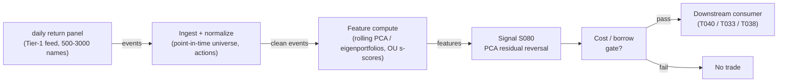

# S080 — PCA / statistical-factor residual reversal (eigenportfolios)

Splits a return panel into a few PCA statistical factors plus residuals via eigenportfolios; fades stretched residuals market-neutral. Provenance **[D]** (Avellaneda & Lee 2010; restated per report entry).

> Tag law: every numeric literal in prose carries one of `[documented]
> [default] [example] [unverified] [internal-est] [measured]` (legend: Appendix
> i v1.0.0). Constants inside cited formulas inherit the formula's tag.
> Bibliographic years, volumes, pages, arXiv IDs, section numbers, rule codes (C1–C10),
> fail-safe codes (F1–F5), module IDs, and machine-parsed §0 data fields are identifiers,
> not literals, and are exempt.

## §1 Five-minute reviewer card

| Row | Value |
|---|---|
| Module | S080 — PCA / statistical-factor residual reversal (eigenportfolios), v1.0.0 |
| Edge verdict | `BEFORE-COST-POSITIVE` |
| After-cost | `BEFORE-COST` — documented attractive in-sample stat-arb (Avellaneda & Lee 2010); a 2025 replication goes gross Sharpe 0.80 → net −4.32 after costs [documented]; one-sentence verdict: indispensable residual-extraction technology, fragile standalone trigger |
| Build cost | Tier M · `40–60` h [internal-est] · `$6,000–9,000` loaded [internal-est] |
| Data cost | Research `~$30–200`/mo (Tier-1 daily bars) [unverified]; production borrow/HTB data extra [unverified] — indicative, verify before budgeting |
| latency_class | daily (eigenportfolio) / intraday (PCA residuals) |
| risk_class | low (signal-only; no order placement) |
| Capacity | `$5–20`M/day notional [example] — illustrative; residual capacity is crowded-regime-dependent, calibrate per venue |
| Executability | Feasible: rolling PCA on `500` names `~10–100` ms [internal-est]; residuals vectorized; no GPU |
| Risk summary | Crowding-dominated; dies on factor breaks, borrow recalls, cost blowup (few-bp edge vs 10 bp round-trip), stale-price residuals in illiquid names |
| When it dies | Crowded unwinds (2007-style); factor breaks; borrow recalls; turnover exceeding the per-trade edge; or 'residual' that is mismeasured beta. |
| Regime gates | Provisional: R-volatility elevated inverts the fade (residuals gap, not revert); calm R-mean-reversion amplifies entries; crowded-unwind regimes veto new fades |
| Emits | `signal_vector` (Appendix b v1.0.0) — never orders |

## §1.5 Cheapest / least-build path

1. **Prototype hour band:** `40–60` h [internal-est] — rolling PCA + OU s-score + borrow gating against the fixture — reference implementation + gates + fixture validation.
2. **Cheapest-source row:** min_tier = Polygon.io Stocks Advanced (Tier-1 daily bars) — cheapest data source candidate [internal-est]; latency_class = SIP-delayed;
   required_fields = broad daily return panel, volatility estimates, corporate actions; price_band = `~$30–200`/mo [unverified] (indicative — verify before budgeting); build_or_buy = **build the PCA stack, buy the bar coverage** (PCA is one `eigh` [internal-est]; borrow data bought before sizing).
3. **Resource budget:** `1` core, `<2` GB RAM [internal-est]; compute pattern `per_bar`.
4. **Skip list:** s; e; c; t; o; r; -; n; e; u; t; r; a; l;  ; P; C; A;  ; v; a; r; i; a; n; t;  ; —;  ; p; h; a; s; e;  ; 2; ;;  ; i; n; t; r; a; d; a; y;  ; P; C; A;  ; r; e; s; i; d; u; a; l; s;  ; —;  ; p; h; a; s; e;  ; 2; ;;  ; B; l; a; c; k; –; L; i; t; t; e; r; m; a; n;  ; b; l; e; n; d; i; n; g;  ; (; L; i; e; w;  ; &;  ; R; o; b; e; r; t; s;  ; 2; 0; 1; 3; );  ; —;  ; r; e; s; e; a; r; c; h;  ; e; x; t; e; n; s; i; o; n; ..
5. **DO-NOT-CUT list:** causality assertions (`assert fill_event > signal_event`, no-signal-bar-fills test); COST block + callable
   `expected_cost_bps`; F1–F5 fail-safes + module-state enum; decision-log audit records; bona-fide-intent + self-trade prevention; provenance tags on
   every numeric literal; fixtures + `test_cmd`; secrets via env only.
6. **Escalation gate:** upgrade from cheapest when any holds — residual–market correlation > `0.3` [example] → too few factors, add factors or stand down; universe `>3,000` names [default] → batched eigendecomposition; borrow recall rate spike → shrink short book / halt.

## §S0 Module contract

### S0.1 Typed signature

```python
def signal(state: ModuleState, events: list[Event], cfg: Config) -> SignalVector:
```

`SignalVector` per Appendix b v1.0.0. `state` is the module-owned named state
vector; `events` are canonical Events (Appendix a v1.0.0), newest last. The
function handles documented edge cases: empty events → `UNKNOWN`; invalid
prices/inputs → `UNKNOWN` (F1, never interpolate); halt/auction events → freeze
per the market-state table.

### S0.2 Config dataclass

| Parameter | Type | Default | Range | Status |
|---|---|---|---|---|
| `m` | int | `1` | `1`–`10` | example |
| `c_thresh` | float | `2.0` | `1.5`–`2.5` | example |
| `sigma_u` | float | `0.72` | `0.1`–`2.0` | example |
| `r2_crit` | float | `0.5` | `0.3`–`0.7` | example |
| `p_max` | float | `0.25` | `0.05`–`1.0` | default |
| `cooldown_s` | float | `300.0` | `0`–`3,600` | default |
| `cost_gate_k` | float | `0.5` | `0.1`–`2.0` | default |

All defaults tagged per the tag law (status `default` ⇒ `[default]`, `example` ⇒ `[example]`, `calibrate` set at fit time).

### S0.3 Canonical schema mapping

Vendor columns → canonical Event schema (Appendix a v1.0.0), stated once here:

| Source field | Canonical |
|---|---|
| bar/event timestamp (exchange) | `event_ts` (int64 ns UTC) |
| ingest timestamp | `asof_ts` (int64 ns UTC) |
| symbol | `symbol` |
| A | `A` (module feature input) |
| B | `B` (module feature input) |

### S0.4 Time contract

> Time contract: clock domain UTC, int64 ns; authoritative causality clock =
> `event_ts`; max_skew = `1` ms [default]; jitter budget = `500` µs [default];
> bar-label = open time; staleness TTL = `3` days [default] (`3`× the daily cadence per F4); gap policy = mask, no interpolation;
> halt/auction → discard contributions across reopen.

**Timing box:** `signal@t (per_bar (daily), America/New_York) → earliest fill @open(t+1)`

### S0.5 Market-state table

| State | Module behavior |
|---|---|
| CONTINUOUS_TRADING | Compute normally; emit per cadence |
| HALTED | Freeze state; emit `UNKNOWN`; discard contributions across reopen |
| AUCTION | No new signals; hold last `SignalVector`; state `DEGRADED` |
| CLOSED | Emit nothing; state `OFF` |

### S0.6 Module-state enum + error taxonomy

States per Appendix k v1.0.0: `OK | DEGRADED | UNKNOWN | OFF`. Invalid input →
`UNKNOWN`, never interpolate (Appendix f v1.0.0, F1–F5).

| Failure | State | Alert |
|---|---|---|
| Missing/stale input (TTL `3` days [default] (`3`× the daily cadence per F4)) | `UNKNOWN` | page |
| Invalid price/input reaching module (NaN, ≤ 0, non-finite) | `UNKNOWN` | log |
| Feature out of mathematical bounds (F2) | `UNKNOWN` | page |
| `seq` gap > `1,000` events [default] | `DEGRADED` (restart windows) | log |
| Jitter > budget persistently | `DEGRADED` | notify |
| Halt/auction | `UNKNOWN` / `DEGRADED` (per table) | log |
| Kill/administrative disable | `OFF` | page |
| Anything unmapped | `UNKNOWN` | page |

### S0.7 Ops tail

- **Schedule:** once per day after the close auction, `16:30` America/New_York [default]; owner: signals on-call.
- **Health checks:** fixture replay (`test_cmd`) green on deploy; live
  `seq`-gap monitor; staleness watchdog at `3`× cadence.
- **Alert table:** page on `UNKNOWN` > `30` s [default] or bounds violation;
  notify on `DEGRADED`; log on single dropped events.
- **Resource budget:** `1` vCPU, `2` GB RAM [internal-est]; state is O(window) per symbol.
- **Runbook stub:** `1.` confirm feed (vendor status); `2.` replay fixture;
  `3.` if red → set `OFF`, page; `4.` reconcile decision log before re-arm.

### S0.8 Secrets (env-only)

`POLYGON_API_KEY` via environment only. No secrets in this file, fixtures, or
logs (CI secrets-grep).

### S0.9 May / must-NOT

> **May:** emit `SignalVector` records per Appendix b v1.0.0. **Must-NOT:**
> emit orders, order intents, prices, share counts, or notionals; call a
> broker; mutate shared state outside `state`; interpolate across gaps.

## §S1 Legacy (subsumed by §1)

Legacy §S1 content is the §1 reviewer card above; this header is retained so
section numbering stays intact.

## §S2 Specification

### Universe

US common stocks, daily bars, broad panel `500`–3,000 names [example]; point-in-time membership; liquid, shortable names only

### Entry rule (Boolean — no prose-only conditions)

```
ENTER_SHORT := (z_resid >= +c_thresh) AND (R2_OU >= r2_crit) AND (borrow_ok)
                  AND (expected_cost_bps(...) <= cost_gate_k * edge_bps)
ENTER_LONG  := (z_resid <= -c_thresh) AND (R2_OU >= r2_crit) AND (borrow_ok)
                  AND (expected_cost_bps(...) <= cost_gate_k * edge_bps)
```

### Exits (with post-exit cooldown)

```
EXIT := (|z_resid| < z_exit) OR (R2_OU < r2_crit) OR (borrow recalled) OR (module_state != OK)
ON_EXIT: cool-down per C10; re-estimate loadings on next window
```

### Position sizing (fenced function)

```python
def size_shares(risk_budget_R, stop_distance, vol_estimate, ADV_cap, cost):
    # S-module requests capital fraction only; share math lives in the strategy.
    # Reference: capital = 0.5 * confidence  (confidence in [0,1])  [default]
    risk_notional = risk_budget_R * 0.5 * confidence          # [default] 0.5 factor
    shares = risk_notional / max(stop_distance, 1e-9)
    return int(min(shares, ADV_cap * adv_shares * 0.001))     # 0.1% ADV cap [default]
```

### Risk limits

| Limit | Value |
|---|---|
| Max capital fraction per signal | `0.5` [default] |
| Max adverse excursion before `UNKNOWN` review | `2.0`× stop [default] |
| Staleness kill | TTL `3` days [default] (`3`× the daily cadence per F4) → `UNKNOWN` |

### COST block (single source of truth)

| Component | Value (bps) | Tag | Basis |
|---|---|---|---|
| Spread (half-spread, liquid large-cap) | `0.50` | [example] | daily close auction cross |
| Fees (taker incl. regulatory) | `0.30` | [example] | venue schedule placeholder |
| Borrow (general collateral) | `0.00` | [default] | reason: GC assumed; HTB extra |
| Impact (small participation) | `0.70` | [example] | flagged; calibrate per venue at scale-up |
| **Total reference** | `1.50` | | |

`fee_schedule_as_of`: 2026-09-10. `side`: taker; venue/tier/source: US equities / Tier-1 SIP [example]. Re-stating cost numbers outside this block is a validation failure.

```python
def expected_cost_bps(notional, adv_pct, venue, side, urgency) -> float:
    # Callable cost model - constant stack (impact flagged [example]).
    spread_bps = 0.5   # [example]
    fee_bps = 0.3      # [example]
    borrow_bps = 0.0    # [default] reason in table
    impact_bps = 0.7    # [example] flagged; calibrate per venue at scale-up
    if side == "maker":
        fee_bps = -0.20  # rebate [example]
    return spread_bps + fee_bps + borrow_bps + impact_bps
```

### Execution / fill model table

| Aspect | Assumption |
|---|---|
| Latency | Signal→intent within the daily bar cadence [example]; residuals computed on settled bars |
| Partial fills | N/A (signal-only; T-module policy: Appendix c v1.0.0) |
| Impact | `0.70` bps reference [example]; stress ×`5` [example] |
| Borrow | HTB names excluded; recall → immediate exit (see S10) |

### Robustness

m in `1`–`5` [example]; estimation window `60`–250 d daily [documented range]; OU half-life target `2`–`20` obs [example]; validate on purged walk-forward splits (S088 pattern); stress at `2`× spreads, `1/2` liquidity, borrow recalls, 2008-style shock

### Compliance sub-block (C1–C10+)

| Code | Rule: trigger → check → action → log |
|---|---|
| C1 | Self-match prevention: S080 emits no orders; downstream T-modules must set self-trade-prevention flags — S080 asserts the requirement in its `consumes` contract: trigger → check → action → log record |
| C2 | Bona-fide intent: every emitted `SignalVector` with |direction|=`1` must pass the cost gate; sub-threshold scores emit direction `0`, never a tradeable hint: trigger → check → action → log record |
| C3 | Message-rate: `≤100` emissions/symbol/s [default]; breach → throttle to `1`/s [default] + alert: trigger → check → action → log record |
| C4 | Fat-finger trio (applied by consumers; S080 bounds its own outputs): confidence ∈ [`0`,`1`], capital ∈ [`0`,`0.5`], computed_at sane — out-of-bounds → `UNKNOWN` (F2): trigger → check → action → log record |
| C5 | Decision log: every emission, veto, and state transition logged per Appendix g v1.0.0, hash-chained: trigger → check → action → log record |
| C6 | Halt/auction: per §S0.5 market-state table; contributions across reopen discarded: trigger → check → action → log record |
| C7 | Locate check: SHORT direction requires `locate_ok` from the consumer; S080 never emits SHORT without the consumer asserting locate (Reg-SHO threshold securities → direction `0`): trigger → check → action → log record |
| C8 | Public dissemination: no signal values published externally without review gate: trigger → check → action → log record |
| C9 | Data entitlements: per §S6 Data rights row; entitlement-class change → §1.5 escalation gate: trigger → check → action → log record |
| C10 | Post-exit cooldown: `cooldown_s` after any exit or compliance block; no re-entry: trigger → check → action → log record |

### Parameter table

| Parameter | Symbol | Value | Tag | Sensitivity |
|---|---|---|---|---|
| Estimation window | `W` | `252` d | `60–250` d [documented] | high — noisy eigenvectors vs stale factors |
| # factors | `m` | `3` | `1–5` [example] | high — too few leaves factor in 'residual' |
| Residual half-life target | `ln2/κ` | `5` obs | `2–20` obs [example] | medium |
| s-score entry | `c_thresh` | `2.0` | `1.5–2.5` [example] | high |
| OU fit quality | `r2_crit (R²_OU)` | `0.5` | `0.3–0.7` [example] | medium |

### Timing box

`signal@t (per_bar (daily), America/New_York) → earliest fill @open(t+1)`

## §S3 Math + normative pseudocode

$$R_{i,t} = \sum_{j=1}^{m} \beta_{ij} F_{j,t} + \tilde{R}_{i,t}$$ [documented] — factor decomposition (Avellaneda & Lee 2010).
$$\Sigma v_j = \lambda_j v_j, \qquad u_t = z_t - \sum_{j=1}^{m} v_j (v_j^\top z_t)$$ [documented] — PCA residual.
$$Q_{ki} = v_{ki}/\sigma_i, \quad F_{kt} = \sum_i Q_{ki} r_{it}, \quad s_{it} = (X_{it}-\mu_i)/(\sigma_i/\sqrt{2\kappa_i})$$ [documented] — eigenportfolio + OU s-score.

Estimation window ends at t; residuals tradable at t+1 (no look-ahead). Standardize by trailing volatility (correlation PCA). Fixture scope: the stated-Σ two-asset reduction u=(A−B)/2 with m=1 [example].

**Normative pseudocode** (pseudocode is normative; prose is commentary):

```
for z_t in panel:  # z standardized on window ending at t
    F = V.T @ z_t            # factor returns (V: top-m eigenvectors)
    u = z_t - V @ F          # residuals
    for i: s = u[i]/sigma_u
        if s > c_thresh and R2_OU > r2_crit and borrow_ok: emit SHORT i (fade)
        # tradable at t+1 only; gate on cost + borrow
```

Causality: the computation at `t` uses only data `≤ t`; earliest reaction is
`t+1`. Mandatory unit test: no-signal-bar fills.

## §S4 Worked example (fixture-backed)

- Tape: `modules/fixtures/S080_tape.csv` — `# TYPE: validation-run`; `10` rows (days `1`–`10`), the chapter's synthetic panel (seed 80 [example]): day 1 fixed to the verified arithmetic A_1=`1.000`, B_1=`0.000` ⇒ Â_1=`0.500`, u_{A,1}=`0.500` ✓; `event_ts`/`asof_ts` int64 ns UTC, daily spacing.
- Expected outputs: `modules/fixtures/S080_expected.csv` — per-day `Â`, `u`, `z`, signal fields; σ̂_u=`0.72` stated constant [example] (pedagogical; production: 60–250 d [documented]).
- Hand-checks: day 6: u_{A,6}=(2.553−(−0.510))/2=`1.532` ✓; z=`1.532`/`0.72`=`+2.13` > `2.0` → SHORT A ✓.
- Acceptance tests (`modules/tests/test_S080.py`, `7` tests): `1.` fixture recomputes to expected (day-1/day-6 hand-checks); `2.` stub emits valid `SignalVector`; `3.` no-signal-bar fills (`fill_event_ts > computed_at`); `4.` cost-gate predicate; `5.` invalid input (NaN) → `UNKNOWN`; `6.` output bounds; `7.` gate passes on a wide edge.
- What to notice: one signal in ten days — the gate is selective by construction; σ̂_u from 10 obs is statistically meaningless (teaches arithmetic, not estimation).

Residual mean-reversion edges are small (a few bps) and crowded: the 2025 replication of a textbook PCA+OU construction goes from gross Sharpe 0.80 to net −4.32 after costs [documented]. Treat S080 as residual-extraction infrastructure first, standalone trigger second.

## §S5 Strategies that use this signal

Generated from `deps.yaml` (CI symmetry); hand-listed here for this module:

| Strategy | Role |
|---|---|
| T040 — PCA Eigenportfolio Residual Reversal | primary trigger — S080 is the entry logic; AR-innovation timing via S039/S078 [example] |
| T033 — Johansen VECM Basket Arb | complementary factor-residual input to cointegrated multi-leg baskets |
| T038 — Sector Momentum + Idiosyncratic Fade | fades idiosyncratic residual extremes while riding sector momentum |

## §S6 Data required

| Field | Type | Granularity | Source tier | Notes |
|---|---|---|---|---|
| Return panel (broad universe) | float | daily bars [example] | Tier 1–2 | 500–3000 names; survivorship-bias-free history |
| Volatility estimates | float | daily | Tier 1 | correlation-PCA standardization; Q_{ki} = v_{ki}/σ_i |
| Borrow availability / fees | float/bool | daily | Tier 2–3 | short-leg feasibility; recalls kill the trade |
| Corporate actions, delistings | events | daily | Tier 0–1 | point-in-time universe; dead names bias eigenvectors |

**Data rights row** (Appendix j v1.0.0): US equities daily bars via Tier-1 vendor, `rights: licensed`; license scope = research + stated production symbol count (`≤500` [default]); raw bars never leave our systems — fixtures are synthetic; derived features ours; retention per vendor terms, purge path in runbook.

## §S7 Local build (M5 Max / 128 GB)

Feasible, borderline trivial for daily (Tier M, `40–60` h ≈ `$6,000–9,000` loaded [internal-est]; cost-model §5). A `500`×`500` eigendecomposition takes `~10–100` ms optimized [internal-est]; panel + covariance `~5–20` MB dense [internal-est]. Bottleneck: universe hygiene (point-in-time membership, delistings), not arithmetic.

## §S8 Buy vs build

Build the PCA/OU stack (one `eigh` call; the edge is universe hygiene + OU fit + cost model — none for sale). Buy broad bar coverage (Tier-1) and, before sizing anything real, the borrow data. Verdict: **build**.

## §S9 Efficacy — documented evidence

| Study / source | Market & period | Metric | Before/after cost | Caveat |
|---|---|---|---|---|
| Avellaneda & Lee (2010), Quant. Finance 10(7) | US equities, 1997–2007 | eigenportfolio + OU s-score stat-arb; attractive historical risk-adjusted performance [documented] | `BEFORE-COST (canonical in-sample result, NOT a live number)` | pre-publication sample; no borrow/turnover stress; later performance universe- and cost-dependent |
| Liew & Roberts (2013), Risks 1(3) | US equities, 2001-01-02 → 2010-05-27 | AL + Black–Litterman blend: +45% Sharpe vs unblended AL [documented] | `cost treatment not stated — treat as before-cost` | improvement over a baseline, not an absolute return claim |
| Epstein, Wang, Choi & Pelger (2025), arXiv:2510.11616 | largest US equities, Jan 1998–Dec 2021 | PCA + OU-threshold benchmark (K=10): gross Sharpe 0.80 → net −4.32 after transaction costs [documented] | `AFTER-COST (documented negative net)` | one study's construction and cost model — but the honest shape of the problem |
| No documented after-cost standalone Sharpe survives realistic borrow/turnover stress | n/a | absence of evidence [documented-as-absence] | `n/a` | do not mistake absence for disproof — but do not trade on hope |

Selection disclosure: these are the sources surfaced by the chapter's research
pass. Fails in: the regimes named in §S10; crowded/overfit calibrations.

## §S10 Failure modes & pitfalls

| # | Trigger → Detect → Action → Recovery | check: |
|---|---|
| 1 | Look-ahead in the panel → estimate Σ only on data ≤ t [documented] → residuals tradable at t+1 [documented]; keep delisted names as-of each date → replay fixture; causality audit | `check: no-signal-bar fills` |
| 2 | Mismeasured beta dressed as alpha → too few factors leaves market exposure in the residual [documented] → check residual–market correlation; add factors → module DEGRADED until re-fit | `check: residual–market |corr| < 0.3` |
| 3 | Crowding (2007-style unwind) → many desks fade the same residuals; residuals gap [documented] → monitor crowding proxies; size down when residual autocorrelation rises → halt new fades | `check: crowding proxy below band` |
| 4 | Cost blowup → few-bp edge vs 10 bp round-trip (see −4.32 net Sharpe [documented]) → model Σc_i|Δw_i| + borrow + financing + impact explicitly → shrink / halt | `check: cost gate inequality` |
| 5 | Regime breaks → correlation spikes invalidate the hedge [documented] → stress-test; kill switch on factor vol → module OFF | `check: factor-vol kill switch armed` |
| 6 | Short-sale constraints → HTB names, recalls, buy-ins [documented] → gate universe on borrow availability → immediate exit on recall | `check: borrow_ok flag` |
| 7 | Overfitting m and thresholds → cap factors [example] → validate on purged walk-forward splits (S088 pattern) → shrink to m=1 | `check: walk-forward Sharpe > 0` |
| 8 | Stale-price residuals → illiquid names: nonsynchronous pricing, not mispricing [documented] → restrict to liquid names → universe filter | `check: ADV filter` |

## §S11 Visuals

`../../images/S080_example.png` — synthetic worked-example chart (seed `80` [example]).



## §S12 Source log + unverified leads

**Sources** (citable facts only):

1. Avellaneda, M. & Lee, J.H. (2010). "Statistical Arbitrage in the U.S. Equities Market." Quantitative Finance, 10(7), 761–782. https://math.nyu.edu/~avellane/AvellanedaLeeStatArb20090616.pdf
2. Liew, J. & Roberts, R. (2013). "U.S. Equity Mean-Reversion Examined." Risks, 1(3), 162–175. https://ideas.repec.org/a/gam/jrisks/v1y2013i3p162-175d31043.html
3. Epstein, E.L., Wang, R., Choi, J. & Pelger, M. (2025). "Attention Factors for Statistical Arbitrage." arXiv:2510.11616. https://arxiv.org/abs/2510.11616v1

**Chatbot source log.** Duck.ai (GPT-5.6 Luna, `2026-09-10`) answered Q-SB9-1–Q-SB9-3 [chapter QA]; its printed worked panel was arithmetically false (column means 0.35/−0.65, Σ_AA≈1.3611) — corrected to the stated-Σ route [measured]. Grok/Cursor answers pending (checked `2026-09-10`).

**Unverified leads** (chatbot-only — never in evidence tables):

- PCA strategies Sharpe ≈ 0.90–0.95 under 10 bp round-trip, 1998–2021 [unverified] (chatbot; model/universe-specific).
- Public implementation ~6%/yr 2010–2019 with ~49% max drawdown (QuantConnect; page could not be verified).

---

## Appendix — AI build prompt (S080)

Copy-paste into any chat agent:

> Build module **S080 — PCA / statistical-factor residual reversal (eigenportfolios)** per `notes/module-template.md` v1.0.0 and this file's §S0 contract.
> Cheapest path (§1.5): prototype `40–60` h [internal-est] — rolling PCA + OU s-score + borrow gating against the fixture; compute pattern `per_bar`.
> Implement `signal(state, events, cfg) -> SignalVector` (Appendix b v1.0.0)
> with the §S3 normative pseudocode, including the cost-gate predicate
> `expected_cost_bps(...) <= k * edge_bps` and `assert fill_event >
> signal_event`. Wire F1–F5 (Appendix f v1.0.0): invalid input → `UNKNOWN`,
> never interpolate. Log decisions per Appendix g v1.0.0. Secrets via env
> only. Run the fixture `modules/fixtures/S080_tape.csv`
> (`# TYPE: validation-run`) against `modules/fixtures/S080_expected.csv`
> (tolerance `1e-9` [default]).
> **Definition of done:** `python3 -m pytest modules/tests/test_S080.py -q`
> exits `0`. Tag every numeric literal you add with the unified enum
> (Appendix i v1.0.0); put anything unverifiable in §S12 unverified leads.
