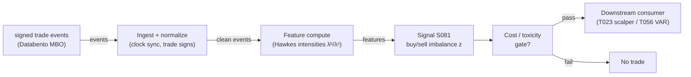

# S081 — Hawkes buy/sell intensity imbalance

Bivariate Hawkes model of buy- and sell-trade arrivals; the z-scored intensity gap λᵇ−λˢ forecasts the next trade's side and seconds-ahead pressure. Provenance **[D]** (Hawkes 1971; Bacry–Muzy order-flow applications).

> Tag law: every numeric literal in prose carries one of `[documented]
> [default] [example] [unverified] [internal-est] [measured]` (legend: Appendix
> i v1.0.0). Constants inside cited formulas inherit the formula's tag.
> Bibliographic years, volumes, pages, arXiv IDs, section numbers, rule codes (C1–C10),
> fail-safe codes (F1–F5), module IDs, and machine-parsed §0 data fields are identifiers,
> not literals, and are exempt.

## §1 Five-minute reviewer card

| Row | Value |
|---|---|
| Module | S081 — Hawkes buy/sell intensity imbalance, v1.1.0 |
| Edge verdict | `UNPROVEN-STANDALONE` |
| After-cost | `UNPROVEN` — no documented after-cost standalone Sharpe for the raw intensity-imbalance signal [documented-as-absence]; the chapter's own gross-to-net sketch is net −$1.20 at retail costs [example]; one-sentence verdict: documented microstructure feature, unproven standalone trigger |
| Build cost | Tier M · `20–60` h [internal-est] · `$3,000–9,000` loaded [internal-est] |
| Data cost | Research: Databento MBO pay-as-you-go `~$2.00`/GB historical [documented, Databento unit pricing 2024-12-11 — verify current] + subscriptions; retail fallback Polygon `$29–199`/mo tiers [measured, third-party observations 2026-09-10 — verify at polygon.io/pricing] |
| latency_class | intraday / seconds |
| risk_class | low (signal-only; no order placement) |
| Capacity | `$1–5`M/day notional [example] — illustrative; seconds-horizon capacity is latency- and book-depth-bound |
| Executability | Feasible per-symbol: O(1)/event recursion; `~500` symbols × `500` events/sec ≈ `250`k/sec is borderline in Python [internal-est] — batch in numpy or move to Rust at scale |
| Risk summary | Latency-dominated; dies when reaction time exceeds the signal half-life; kernel misspecification; signing error; cost blowup (pays spread every round trip into the thinnest book) |
| When it dies | Two-sided bursts with no directional resolution; stale kernels after regime shifts; any horizon where spread + fees + impact exceed the few-bp edge. |
| Regime gates | Machine records in §S10 (R004/R005/R011/R012/R013/R014/R038/R050, provisional); restrictive default: unknown regime → veto |
| Emits | `signal_vector` (Appendix b v1.0.0) — never orders |

## §1.5 Cheapest / least-build path

1. **Prototype hour band:** `20–60` h [internal-est] — Hawkes MLE + recursion + z-deseasonalization against the fixture — reference implementation + gates + fixture validation.
2. **Cheapest-source row:** min_tier = Polygon trades + quotes (Tier-1) — cheapest data source candidate [internal-est]; latency_class = SIP-delayed;
   required_fields = trade timestamps (ns), prices/sizes, L1 quotes for Lee–Ready signing; price_band = `$29–199`/mo tiers [measured] (indicative — verify before budgeting); build_or_buy = **buy the feed (Tier-1), build the estimator** (kernel MLE is the value [internal-est]; upgrade to Databento MBO pay-as-you-go `~$2.00`/GB historical [documented, 2024-12-11] when signing error flips z).
3. **Resource budget:** `1` core, `<2` GB RAM [internal-est]; compute pattern `per_event`.
4. **Skip list:** power-law kernels — phase 2 (Bacry et al. find exponential underfits long-memory tails [documented]); price-jump Hawkes variant — phase 2; multi-symbol joint calibration — phase 2; intraday kernel refits — run daily first, escalate only if ρ(N) drifts..
5. **DO-NOT-CUT list:** causality assertions (`assert fill_event > signal_event`, no-signal-bar-fills test); COST block + callable
   `expected_cost_bps`; F1–F5 fail-safes + module-state enum; decision-log audit records; bona-fide-intent + self-trade prevention; provenance tags on
   every numeric literal; fixtures + `test_cmd`; secrets via env only.
6. **Escalation gate:** upgrade from cheapest when any holds — signing-accuracy audit fails vs MBO aggressor → upgrade feed or halt; kernel ρ(N) approaching `1` [example] → near-critical, widen windows / halt; universe `>20` symbols [default] → numpy-batched recursion or Rust.

## §S0 Module contract

### S0.1 Typed signature

```python
def signal(state: ModuleState, events: list[Event], cfg: Config) -> SignalVector:
```

`SignalVector` per Appendix b v1.0.0. `state` is the module-owned named state
vector; `events` are canonical Events (Appendix a v1.0.0), newest last. The
function handles documented edge cases: empty events → `UNKNOWN`; invalid
prices/inputs → `UNKNOWN` (F1, never interpolate); halt/auction events → freeze
per the market-state table.

### S0.2 Config dataclass

| Parameter | Type | Default | Range | Status |
|---|---|---|---|---|
| `mu` | float | `0.4` | `0.1`–`2.0` | calibrate |
| `alpha_self` | float | `0.9` | `0.2`–`1.5` | calibrate |
| `beta_self` | float | `1.5` | `0.5`–`5.0` | calibrate |
| `alpha_cross` | float | `0.25` | `0`–`0.5` | calibrate |
| `beta_cross` | float | `1.0` | `0.5`–`5.0` | calibrate |
| `kappa` | float | `2.0` | `1.5`–`3.0` | calibrate |
| `kappa_exit` | float | `1.5` | `1.0`–`2.0` | calibrate |
| `z_window_s` | float | `300.0` | `60`–`900` | calibrate |
| `m_d` | float | `0.1458` | n/a | example |
| `s_d` | float | `1.2217` | n/a | example |
| `persist_n` | int | `3` | `2`–`5` | default |
| `p_max` | float | `0.25` | `0.05`–`1.0` | default |
| `cooldown_s` | float | `60.0` | `0`–`3,600` | default |
| `cost_gate_k` | float | `0.5` | `0.1`–`2.0` | default |
| `locate_ok` | bool | `False` | — | default |
| `edge_per_z` | float | `1.0` | `0.25`–`4.0` | example |

`m_d`/`s_d` are fixture constants [example]; live, they are the trailing-`z_window_s` sample moments of `d_t`. `locate_ok` is asserted by the consumer per C7 (default `False` = never emit SHORT). All defaults tagged per the tag law (status `default` ⇒ `[default]`, `example` ⇒ `[example]`, `calibrate` set at fit time).

**Calibration recipe (per fittable parameter — walk-forward OOS):**

| Parameter | Grid [example] | Fit method |
|---|---|---|
| `mu` | `{0.2, 0.4, 0.8}` | MLE on fit window |
| `alpha_self` | `{0.5, 0.9, 1.3}` | MLE on fit window |
| `beta_self` | `{1.0, 1.5, 2.5}` | MLE on fit window |
| `alpha_cross` | `{0.1, 0.25, 0.4}` | MLE on fit window |
| `beta_cross` | `{0.5, 1.0, 2.0}` | MLE on fit window |
| `kappa` | `{1.5, 2.0, 2.5}` | grid on eval window |
| `kappa_exit` | `{1.0, 1.5}` | grid on eval window |
| `z_window_s` | `{120, 300, 600}` | grid on eval window |

- **Fold design:** `5` expanding-window folds [example]; each fold = fit window `40` trading days [example] → embargo `1` trading day [example] → eval window `10` trading days [example]. Kernels refit per fold; no eval data leaks into any fit.
- **Selection metric:** primary = OOS hit rate of `sign(z_t)` vs the next trade's side on burst events (`|z_t| > κ`); tie-break = stability (selected point's `ρ(N) < 0.95` [example] in every fold and |z| burst count within `2`× across folds [example]).
- **Freeze rule:** freeze the grid point that wins `≥3` of `5` folds [example] with positive OOS lift over the `κ=2.0` [default] baseline; otherwise revert to defaults, set module `DEGRADED`, and re-run next session.
- **Guardrail:** any candidate with `ρ(N) ≥ 1` is discarded before selection (stationarity assert, §S3); log the discard per Appendix g v1.0.0.

### S0.3 Canonical schema mapping

Vendor columns → canonical Event schema (Appendix a v1.0.0), stated once here. Primary source: Databento MBO (`DBEQ.BASIC`, DBN v2, rtype `160` [documented]); endpoint: `databento` Python client `Historical.timeseries.get_range(dataset=..., schema="mbo", symbols=[...], start=..., end=...)` [documented].

| Source field | Canonical | Notes |
|---|---|---|
| `ts_event` | `event_ts` (int64 ns UTC) | exchange timestamp [documented] |
| `ts_recv` | `asof_ts` (int64 ns UTC) | capture timestamp [documented] |
| `symbol` | `symbol` | raw symbology [documented] |
| `action` | ingest filter | only `action='T'` (trade) becomes an Event; `A`/`C`/`M`/`R` maintain book state only [default] |
| `side` (`B`/`A`/`N`) | `side` = `+1`/`−1`/`0` | `A` (ask-lifting) → buy `+1`; `B` → sell `−1`; `N` → drop event [internal-est mapping of documented enum] |
| `price` (int64, 1e-9) | `price` | fixed-point → decimal ÷ 1e9 [documented] |
| `size` | `size` | shares/contracts [documented] |
| `order_id` | dedup key | same `order_id` + `ts_event` twice → drop duplicate [default] |
| `sequence` | `seq` | gap > `1,000` [default] → §S0.6 DEGRADED path |
| `flags` | market-state hints | combine with the status schema; halt/auction per §S0.5 [example] |

Retail fallback (Polygon): `Trades` endpoint → `t` (ns timestamp), `p`, `s`; `Quotes` endpoint (Developer tier and above [measured]) → NBBO for Lee–Ready signing [internal-est]. `lam_b`/`lam_s` are **module-internal state**, not vendor fields — they never appear in a vendor mapping.

### S0.4 Time contract

> Time contract: clock domain UTC, int64 ns; authoritative causality clock =
> `event_ts`; max_skew = `1` ms [default]; jitter budget = `500` µs [default];
> bar-label = open time; staleness TTL = `3` s [default] (`3`× the `1`-s reference cadence per F4); gap policy = mask, no interpolation;
> halt/auction → discard contributions across reopen.

**Timing box:** `signal@t (per_event (trades), America/New_York) → earliest fill @open(t+1)`

### S0.5 Market-state table

| State | Module behavior |
|---|---|
| CONTINUOUS_TRADING | Compute normally; emit per cadence |
| HALTED | Freeze state; emit `UNKNOWN`; discard contributions across reopen |
| AUCTION | No new signals; hold last `SignalVector`; state `DEGRADED` |
| CLOSED | Emit nothing; state `OFF` |

### S0.6 Module-state enum + error taxonomy

States per Appendix k v1.0.0: `OK | DEGRADED | UNKNOWN | OFF`. Invalid input →
`UNKNOWN`, never interpolate (Appendix f v1.0.0, F1–F5).

| Failure | State | Alert |
|---|---|---|
| Missing/stale input (TTL `3` s [default] (`3`× the `1`-s reference cadence per F4)) | `UNKNOWN` | page |
| Invalid price/input reaching module (NaN, ≤ 0, non-finite) | `UNKNOWN` | log |
| Feature out of mathematical bounds (F2) | `UNKNOWN` | page |
| `seq` gap > `1,000` events [default] | `DEGRADED` (restart windows) | log |
| Jitter > budget persistently | `DEGRADED` | notify |
| Halt/auction | `UNKNOWN` / `DEGRADED` (per table) | log |
| Kill/administrative disable | `OFF` | page |
| Anything unmapped | `UNKNOWN` | page |

### S0.7 Ops tail

- **Schedule:** continuous during US equities regular session `09:30`–`16:00` America/New_York [documented]; owner: signals on-call.
- **Health checks:** fixture replay (`test_cmd`) green on deploy; live
  `seq`-gap monitor; staleness watchdog at `3`× cadence.
- **Alert table:** page on `UNKNOWN` > `30` s [default] or bounds violation;
  notify on `DEGRADED`; log on single dropped events.
- **Resource budget:** `1` vCPU, `2` GB RAM [internal-est]; state is O(window) per symbol.
- **Runbook stub:** `1.` confirm feed (vendor status); `2.` replay fixture;
  `3.` if red → set `OFF`, page; `4.` reconcile decision log before re-arm.

### S0.8 Secrets (env-only)

`DATABENTO_API_KEY` via environment only. No secrets in this file, fixtures, or
logs (CI secrets-grep).

### S0.9 May / must-NOT

> **May:** emit `SignalVector` records per Appendix b v1.0.0. **Must-NOT:**
> emit orders, order intents, prices, share counts, or notionals; call a
> broker; mutate shared state outside `state`; interpolate across gaps.

## §S1 Legacy (subsumed by §1)

Legacy §S1 content is the §1 reviewer card above; this header is retained so
section numbering stays intact.

## §S2 Specification

### Universe

US common stocks, per-trade events, liquid names with `>100` trades/day [example]; regular session only

### Entry rule (Boolean — no prose-only conditions)

```
BURST    := (|z_t| > κ)                                  # strict; |z| == κ is NOT a burst
PERSIST  := (n_consec_same_sign >= persist_n)            # persist_n = 3 [default]
FRESH    := (t - t_last_event <= staleness_ttl) AND (market_state == CONTINUOUS_TRADING)
LOCATED  := (sign(z_t) > 0) OR locate_ok                 # C7: SHORT needs consumer locate_ok
COOLED   := (t - t_last_exit > cooldown_s)               # post-exit / post-block cooldown
GATE     := (expected_cost_bps(notional, adv_pct, venue, side, urgency) <= cost_gate_k * edge_bps)
ENTER    := BURST AND PERSIST AND FRESH AND LOCATED AND COOLED AND GATE
```

`GATE` usually fails — S081 is a toxicity/burst filter first, a trigger second. `edge_bps = |z_t| * edge_per_z`, `edge_per_z = 1.0` [example].

### Exits (with post-exit cooldown)

```
EXIT := (|z_t| < κ_exit) OR (module_state != OK)
ON EXIT: t_last_exit := t; direction := 0   # cooldown_s = 60.0 s [default] before any re-entry
```

`κ_exit = 1.5` [default] < `κ` gives the burst hysteresis band; exits also fire on any compliance block (C1–C10), which starts the same cooldown.

### Position sizing (fenced function)

```python
def size_shares(risk_budget_R, stop_distance, vol_estimate, ADV_cap, cost):
    # S-module requests capital fraction only; share math lives in the strategy.
    # Reference: capital = 0.5 * confidence  (confidence in [0,1])  [default]
    # All inputs are consumer-provided: risk_budget_R ($), stop_distance ($/sh),
    # vol_estimate (annualized decimal), ADV_cap (fraction), adv_shares (sh/day),
    # confidence = this module's emitted confidence in [0,1].
    risk_notional = risk_budget_R * 0.5 * confidence          # [default] 0.5 factor
    shares = risk_notional / max(stop_distance, 1e-9)
    return int(min(shares, ADV_cap * adv_shares * 0.001))     # 0.1% ADV cap [default]
```

### Risk limits

| Limit | Value |
|---|---|
| Max capital fraction per signal | `0.5` [default] |
| Max adverse excursion before `UNKNOWN` review | `2.0`× stop [default] |
| Staleness kill | TTL `3` s [default] (`3`× the `1`-s reference cadence per F4) → `UNKNOWN` |

### COST block (single source of truth)

Reference: `100` sh of a `$50` stock, `1`¢ quoted spread, taker, round trip. All components in bps on per-leg notional (`$5,000`).

| Component | Value (bps) | Tag | Basis |
|---|---|---|---|
| Spread (cross the `1`¢ spread each leg) | `4.00` | [example] | `$2.00`/100sh round trip ÷ `$5,000` |
| Commission (taker) | `1.40` | [example] | IBKR tiered `$0.0035`/sh, min `$0.35`/order [documented]; `$0.70`/200sh round trip |
| Borrow | `0.00` | [default] | reason: `~1` s hold; borrow accrues per day — prorated to seconds it is `~0` |
| Slippage (burst entries into the thinnest book) | `2.00` | [example] | `0.5`¢/sh/leg allowance |
| **Total reference** | `7.40` | | |

`borrow_bps_per_day`: `0.00` [default] — reason: expected hold `~1` s [example]; even a `5`%/yr hard-to-borrow name accrues `~1.37` bps/day, i.e. `~1.6e-5` bps over the hold [example] — negligible.
`fee_schedule_as_of`: 2026-09-10. `side`: taker; venue/tier/source: US equities / Databento MBO [example]. Re-stating cost numbers outside this block is a validation failure.

```python
def expected_cost_bps(notional, adv_pct, venue, side, urgency) -> float:
    # Callable cost model - mirrors the COST block exactly (taker path).
    spread_bps = 4.00  # [example] from block
    fee_bps = 1.40     # [example] from block
    borrow_bps = 0.00  # [default] from block; borrow_bps_per_day = 0.0
    impact_bps = 2.00  # [example] from block (slippage line)
    if side == "maker":
        fee_bps = -0.80  # [example] maker rebate ~$0.0020/sh
    return spread_bps + fee_bps + borrow_bps + impact_bps  # 7.40 taker
```

### Execution / fill model table

| Aspect | Assumption |
|---|---|
| Latency | reaction time must be < signal half-life (seconds) [documented]; SIP path is simulated-only |
| Partial fills | N/A (signal-only; T-module policy: Appendix c v1.0.0) |
| Impact | burst-triggered entries arrive when the book is thinnest — impact dominates; model explicitly |
| Adverse selection | the burst IS the adverse-selection flag: assume the other side is informed |

### Robustness

Kernels refit per regime (walk-forward); time-of-day μ or short rolling windows for the U-shaped session curve; require sign persistence (consecutive same-sign z) before entry; never trade bursts off SIP-signed data alone

### Compliance sub-block (C1–C10+)

| Code | Rule: trigger → check → action → log |
|---|---|
| C1 | Self-match prevention: S081 emits no orders; downstream T-modules must set self-trade-prevention flags — S081 asserts the requirement in its `consumes` contract: trigger → check → action → log record |
| C2 | Bona-fide intent: every emitted `SignalVector` with |direction|=`1` must pass the cost gate; sub-threshold scores emit direction `0`, never a tradeable hint: trigger → check → action → log record |
| C3 | Message-rate: `≤100` emissions/symbol/s [default]; breach → throttle to `1`/s [default] + alert: trigger → check → action → log record |
| C4 | Fat-finger trio (applied by consumers; S081 bounds its own outputs): confidence ∈ [`0`,`1`], capital ∈ [`0`,`0.5`], computed_at sane — out-of-bounds → `UNKNOWN` (F2): trigger → check → action → log record |
| C5 | Decision log: every emission, veto, and state transition logged per Appendix g v1.0.0, hash-chained: trigger → check → action → log record |
| C6 | Halt/auction: per §S0.5 market-state table; contributions across reopen discarded: trigger → check → action → log record |
| C7 | Locate check: SHORT direction requires `locate_ok` from the consumer; S081 never emits SHORT without the consumer asserting locate (Reg-SHO threshold securities → direction `0`): trigger → check → action → log record |
| C8 | Public dissemination: no signal values published externally without review gate: trigger → check → action → log record |
| C9 | Data entitlements: per §S6 Data rights row; entitlement-class change → §1.5 escalation gate: trigger → check → action → log record |
| C10 | Post-exit cooldown: `cooldown_s` after any exit or compliance block; no re-entry: trigger → check → action → log record |

### Parameter table

| Parameter | Symbol | Value | Tag | Sensitivity |
|---|---|---|---|---|
| Base intensity | `μ_b, μ_s` | `0.4`/s | `0.1–2.0`/s [example] | medium — mis-set biases z by time of day |
| Self jump | `α_bb, α_ss` | `0.9` | `0.2–1.5` [example] | high — overfit → phantom bursts |
| Self decay | `β_bb, β_ss` | `1.5`/s | `0.5–5.0`/s [example] | high — slow: stale; fast: no memory |
| Cross jump | `α_sb, α_bs` | `0.25` | `0–0.5` [example] | medium |
| Cross decay | `β_sb, β_bs` | `1.0`/s | `0.5–5.0`/s [example] | medium |
| Burst threshold | `κ` | `2.0` | `1.5–3.0` [example] | high |
| Exit threshold | `κ_exit` | `1.5` | `1.0–2.0` [default] | medium — hysteresis band vs κ |
| Sign persistence | `persist_n` | `3` events | `2`–`5` [default] | medium — `1` whipsaws, `5` misses the burst |

### Timing box

`signal@t (per_event (trades), America/New_York) → earliest fill @open(t+1)`

## §S3 Math + normative pseudocode

$$\lambda^b_t = \mu + \sum_{t^b_i<t}\alpha_{self}e^{-\beta_{self}(t-t^b_i)} + \sum_{t^s_j<t}\alpha_{cross}e^{-\beta_{cross}(t-t^s_j)}$$ [documented] — Hawkes buy intensity (Hawkes 1971; Bacry et al. 2013); sell intensity symmetric.
$$\rho(N) < 1, \quad N = \begin{pmatrix}\alpha_{self}/\beta_{self} & \alpha_{cross}/\beta_{cross} \\ \alpha_{cross}/\beta_{cross} & \alpha_{self}/\beta_{self}\end{pmatrix}$$ [documented] — stationarity is the branching matrix's spectral radius; eigenvalues are `α_self/β_self ± α_cross/β_cross`.
$$d_t = \lambda^b_t-\lambda^s_t, \qquad z_t = (d_t-m_d)/s_d$$ [documented] — z-scored imbalance; burst at |z_t|>κ (strict).

Exponential kernels (power-law variants are phase 2 [documented]). Live, `m_d`/`s_d` are the trailing-`z_window_s` sample moments of `d_t` (U-shaped session curve handled by the window, §S10.3); the fixture pins them as constants [example]. The O(1) recursion below is normative; the fixture tests the z-score/burst layer on stated intensities.

**Normative pseudocode** (pseudocode is normative; prose is commentary). All symbols are `Config` (§S0.2) or module state; nothing is free.

```
# ---- config-load guard (fail closed) ----
eig1 = alpha_self/beta_self + alpha_cross/beta_cross
eig2 = alpha_self/beta_self - alpha_cross/beta_cross
assert max(eig1, eig2) < 1.0, "stationarity violated"   # -> module OFF, page
staleness_ttl = 3.0            # s [default]; 3x the 1-s reference cadence per F4

# ---- module state (named vector) ----
state = { t_last, lam_b, lam_s,          # intensities just after t_last
          z_prev, n_consec,              # sign-persistence tracker
          t_last_exit,                   # post-exit cooldown anchor
          module_state }                  # OK | DEGRADED | UNKNOWN | OFF

function on_event(e):                    # e: canonical Event, e.event_ts int64 ns UTC
    # F1: invalid input -> UNKNOWN, never interpolate
    if e is None or not is_finite(e.event_ts) or e.event_ts <= 0:
        return UNKNOWN_VECTOR(e)
    # market-state table (§S0.5)
    if market_state(e) == HALTED:
        freeze(state); return UNKNOWN_VECTOR(e)          # discard contributions across reopen
    if market_state(e) == AUCTION:
        state.module_state = DEGRADED; return HOLD_VECTOR
    # staleness + ordering guards
    if state.t_last is not None:
        if e.event_ts < state.t_last: return UNKNOWN_VECTOR(e)      # out-of-order
        if (e.event_ts - state.t_last)/1e9 > staleness_ttl: reset_intensities()
    # only events strictly before t enter intensities at t (causality)
    dt = (e.event_ts - state.t_last)/1e9 if state.t_last else +inf
    lam_b = mu + (state.lam_b - mu)*exp(-beta_self*dt)   if state.t_last else mu
    lam_s = mu + (state.lam_s - mu)*exp(-beta_self*dt)   if state.t_last else mu
    # ...plus cross-decay components folded in per the two-intensity form above;
    # equivalently maintain (sb_self, sb_cross, ss_self, ss_cross) decayed by
    # beta_self / beta_cross respectively, then lam_b = mu + sb_self + sb_cross.
    if e.side == +1:  lam_b += alpha_self; lam_s += alpha_cross
    elif e.side == -1: lam_s += alpha_self; lam_b += alpha_cross
    else: return UNKNOWN_VECTOR(e)                        # side N/0: cannot sign
    d = lam_b - lam_s
    z = (d - m_d)/s_d
    # sign persistence
    sgn = sign(z)                                        # in {-1, 0, +1}
    state.n_consec = state.n_consec + 1 if sgn == state.z_prev_sgn and sgn != 0 else 1
    state.z_prev_sgn = sgn
    burst = abs(z) > kappa                               # STRICT: |z| == kappa -> 0
    # exit + cooldown
    if abs(z) < kappa_exit or state.module_state != OK:
        state.t_last_exit = e.event_ts                   # re-arms after cooldown_s
    edge_bps = abs(z) * edge_per_z                       # edge_per_z = 1.0 [example]
    cost_bps = expected_cost_bps(notional, adv_pct, venue, side, urgency)
    gate  = cost_bps <= cost_gate_k * edge_bps           # executable cost-gate predicate
    fresh = (state.t_last is None) or ((e.event_ts - state.t_last)/1e9 <= staleness_ttl)
    cooled = (state.t_last_exit is None) or ((e.event_ts - state.t_last_exit)/1e9 > cooldown_s)
    located = (sgn >= 0) or locate_ok                    # C7 locate gate
    persist_ok = state.n_consec >= persist_n
    if burst and persist_ok and gate and fresh and cooled and located:
        direction = +1 if sgn > 0 else -1
    else:
        direction = 0                                    # veto path: burst is a toxicity flag
    confidence = min(1.0, abs(z)/4.0)                     # 4.0 divisor [default]
    capital = min(p_max, confidence * p_max) if direction != 0 else 0.0
    computed_at = e.event_ts
    fill_event_ts = computed_at + min_reaction_ns         # earliest fill @open(t+1)
    assert fill_event_ts > computed_at                    # t -> t+1 causality
    state.t_last, state.lam_b, state.lam_s = e.event_ts, lam_b, lam_s
    return SignalVector(symbol, direction, confidence, capital,
                        computed_at, module_state=state.module_state,
                        edge_bps=edge_bps, cost_bps=cost_bps,
                        fill_event_ts=fill_event_ts)

function check_staleness(now_ns):        # watchdog, called per wall-clock tick
    if state.t_last and (now_ns - state.t_last)/1e9 > staleness_ttl:
        state.module_state = UNKNOWN     # no signal emitted until fresh events resume
```

Causality: the computation at `t` uses only data `< t` (jumps applied from the event at `t` itself are excluded — the event's own contribution enters at `t+ε`); earliest reaction is `t+1`. Mandatory unit test: no-signal-bar fills.

## §S4 Worked example (fixture-backed)

- Tape: `modules/fixtures/S081_tape.csv` — `# TYPE: validation-run`; `14` rows [measured] (events `69`–`82`), the chapter's synthetic burst-window tape around the largest |z| burst (seed 81 [example]): μ=`0.4`/s, α_self=`0.9`, β_self=`1.5`/s, α_cross=`0.25`, β_cross=`1.0`/s; branching eigenvalues `0.85`/`0.35`, ρ(N)=`0.85`<`1` [example]; `event_ts`/`asof_ts` int64 ns UTC, per-event. Rows `81`–`82` are boundary rows: |z| just below κ (burst `0`) and just above κ (burst `1`).
- Expected outputs: `modules/fixtures/S081_expected.csv` — per-event `d`, `z`, `burst`, signal fields; m_d=`0.1458`, s_d=`1.2217` are the chapter's stated sample moments [example].
- Hand-check: event 76: d=`8.749`−`11.511`=`−2.762` ✓; z=(`−2.762`−`0.1458`)/`1.2217`=`−2.38` ✓ → burst=1; cost gate blocks (direction 0) — the honest outcome.
- Acceptance tests (`modules/tests/test_S081.py`, `14` tests [measured]): `1.` fixtures exist and carry `# TYPE:` headers; `2.` fixture recomputes to expected incl. the event-76 hand-check; `3.` stub emits a valid `SignalVector`; `4.` no-signal-bar fills (causality pin); `5.` cost-gate predicate pass/fail; `6.` cost callable mirrors the §S2 block (`7.40` bps taker); `7.` boundary |z| at κ (rows 81/82 + ±`1e-6` strictness); `8.` invalid input (NaN, unsigned side) → `UNKNOWN`; `9.` out-of-order `event_ts` → `UNKNOWN`; `10.` persistence veto (lone burst suppressed, 3rd consecutive emits); `11.` post-exit cooldown veto and re-arm; `12.` locate veto (C7: SHORT needs `locate_ok`); `13.` halt → `UNKNOWN`, auction → `DEGRADED`; `14.` supercritical config fails closed.
- What to notice: a genuine sell burst builds over `~0.5` s (events 69→75 [example]); z crosses `−2` at event 74 — the adverse-selection flag.

No documented after-cost standalone Sharpe exists for the raw intensity-imbalance signal [documented-as-absence]. The chapter's own sketch is net negative at retail costs; treat S081 as a toxicity/burst feature first.

## §S5 Strategies that use this signal

Generated from `deps.yaml` (CI symmetry); hand-listed here for this module:

| Strategy | Role |
|---|---|
| T023 — Hawkes Burst Scalper | primary entry trigger — S081 is the entry logic |
| T056 — Hasbrouck Trade–Quote VAR | predictor input: imbalance as exogenous state; veto on extreme adverse-selection intensity |

## §S6 Data required

| Field | Type | Granularity | Source tier | Notes |
|---|---|---|---|---|
| Trade timestamp (exchange) | datetime64 (µs) | per trade [example] | Tier 2–3 | clock-sync across venues; SIP vs direct labeled |
| Trade price / size | float / int | per trade | Tier 2–3 | size optional for volume-weighted variants |
| Trade side sign | ±1 | per trade | derived | Lee–Ready/BVC on quotes; MBO gives aggressor directly |
| Quote book (for signing) | L1/L2 | event | Tier 2–3 | needed when side must be inferred |

**Data rights row** (Appendix j v1.0.0): US equities trades via Databento MBO, `rights: licensed`; license scope = research + stated production symbol count (`≤20` [default]); raw events never leave our systems — fixtures are synthetic; derived features ours; retention per vendor terms, purge path in runbook.

## §S7 Local build (M5 Max / 128 GB)

Feasible (Tier M, `20–60` h ≈ `$3,000–9,000` loaded [internal-est]; cost-model §5). The intensity recursion is O(1) per event — a Python loop handles `~100–500`k events/sec [internal-est]; kernel MLE refits are the batch cost (minutes per symbol-day). RAM: trades-only events for one symbol-day `~0.1–0.5` GB [internal-est].

## §S8 Buy vs build

Hybrid: buy the signed-trade feed, build the estimator — the kernel parameters are the edge. Crossover: buy Databento MBO the moment SIP signing error starts flipping the z.

## §S9 Efficacy — documented evidence

| Study / source | Market & period | Metric | Before/after cost | Caveat |
|---|---|---|---|---|
| Bacry, Delattre, Hoffmann & Muzy (2013), Quant. Finance | Euro-Bund / Euro-Bobl futures | 2-D Hawkes on up/down price jumps reproduces microstructure noise and the Epps effect; fits match data [documented] | `n/a (descriptive fit, not a trading P&L)` | models price jumps, not signed trades; no P&L claimed |
| Sjogren & DeLise (2021), arXiv:2110.07075 | futures and stock LOB data | general compound Hawkes predicts mid-price direction and volatility [documented] | `BEFORE-COST (prediction study, not net trading)` | accuracy ≠ tradable edge after spread/fees |
| Muni Toke & Yoshida (2017), Quant. Finance 17(5):683–701 | Euronext Paris stocks (authors' empirical program) | multivariate Hawkes intensities of limit-order-book order flows; strong self- and cross-excitation across event types [documented] | `n/a (structural estimation)` | descriptive; no trading rule evaluated |
| No documented after-cost standalone Sharpe for the raw intensity-imbalance signal | n/a | absence of evidence [documented-as-absence] | `n/a` | the literature documents fit quality and prediction, not net P&L |

Selection disclosure: these are the sources surfaced by the chapter's research
pass. Fails in: the regimes named in §S10; crowded/overfit calibrations.

## §S10 Failure modes & pitfalls

| # | Trigger → Detect → Action → Recovery | check: |
|---|---|
| 1 | Latency vs horizon → signal lives seconds [documented] → trade only where latency is measured; SIP-only is simulated-only → module OFF on SIP data | `check: latency budget < half-life` |
| 2 | Kernel misspecification → exponential underfits power-law tails [documented] → test exponential vs power-law OOS → refit per regime | `check: OOS kernel comparison` |
| 3 | Nonstationarity → U-shaped session curve biases static μ [documented] → time-of-day μ or short rolling windows → DEGRADED at open/close | `check: deseasonalized z` |
| 4 | Trade-signing error → Lee–Ready errors rise in fast markets [documented] → audit vs MBO aggressor data → halt on audit failure | `check: signing-accuracy audit` |
| 5 | Burst ≠ direction → largest |z| sometimes two-sided panics [documented] → require sign persistence → no entry | `check: 3 consecutive same-sign z` |
| 6 | MLE fragility → local optima, window sensitivity [documented] → multiple inits; walk-forward refits → DEGRADED | `check: refit stability` |
| 7 | Cost blowup → spread paid every round trip into the thinnest book [documented] → explicit stack; most calibrations fail the gate → no trade (honest) | `check: cost gate inequality` |
| 8 | Overlapping bursts → parent order excites multiple child bursts [documented] → parent-order-aware clustering → per-symbol accounting | `check: cluster dedup` |

### Regime gates (machine-readable)

Provisional cross-references to the R-series (see §0 `regime_ids`). Restrictive default: any gate whose regime state is unknown → `veto` (direction forced to `0`).

```yaml
regime_gates:
  - regime_id: R014  # informed-flow toxicity (VPIN)
    direction: amplifies
    mechanism: burst z aligned with toxic flow carries more information per event
    condition: "R014.state == TOXIC and sign(z_t) == sign(toxic_imbalance)"
    action: double
    min_lag: 0        # per-event module; no lag
    unknown_behavior: veto
  - regime_id: R004  # volatility clustering / persistence
    direction: amplifies
    mechanism: persistent excitation raises burst frequency while kernels stay subcritical
    condition: "R004.state == CLUSTERED and rho(N) < 0.95"
    action: double
    min_lag: 0
    unknown_behavior: veto
  - regime_id: R013  # abnormal volume / participation
    direction: amplifies
    mechanism: high-participation bursts resolve direction faster (sign persistence cleaner)
    condition: "R013.state == ELEVATED"
    action: double
    min_lag: 0
    unknown_behavior: veto
  - regime_id: R005  # jump regime
    direction: inverts
    mechanism: two-sided jumps break sign persistence; bursts become whipsaws
    condition: "R005.state == JUMP"
    action: veto
    min_lag: 0
    unknown_behavior: veto
  - regime_id: R011  # depth / liquidity-provision
    direction: degrades
    mechanism: thin book means bursts coincide with maximum adverse selection
    condition: "R011.state == THIN"
    action: halve
    min_lag: 0
    unknown_behavior: veto
  - regime_id: R012  # price-impact / Amihud illiquidity
    direction: degrades
    mechanism: impact dominates the few-bp edge; cost gate already fails
    condition: "R012.state == HIGH_IMPACT"
    action: pause_entry
    min_lag: 0
    unknown_behavior: veto
  - regime_id: R038  # thin liquidity regime
    direction: degrades
    mechanism: burst entries arrive when the book is thinnest
    condition: "R038.state == THIN"
    action: veto
    min_lag: 0
    unknown_behavior: veto
  - regime_id: R050  # SIP-vs-direct divergence
    direction: inverts
    mechanism: signing error flips z on SIP data; bursts point the wrong way
    condition: "R050.state == DIVERGED"
    action: veto
    min_lag: 0
    unknown_behavior: veto
```

## §S11 Visuals

`../../images/S081_example.png` — synthetic worked-example chart (seed `81` [example]).



## §S12 Source log + unverified leads

**Sources** (citable facts only):

1. Bacry, E., Mastromatteo, I. & Muzy, J.-F. (2015). "Hawkes processes in finance." arXiv:1502.04592. https://arxiv.org/abs/1502.04592v2
2. Bacry, E., Delattre, S., Hoffmann, M. & Muzy, J.-F. (2013). "Modelling microstructure noise with mutually exciting point processes." Quantitative Finance. arXiv:1101.3422. https://arxiv.org/abs/1101.3422
3. Hawkes, A. G. (1971). "Spectra of Some Self-Exciting and Mutually Exciting Point Processes." Biometrika, 58(1), 83–90. https://www.jstor.org/stable/2334319
4. Sjogren, M. & DeLise, T. (2021). "General Compound Hawkes Processes for Mid-Price Prediction." arXiv:2110.07075. https://arxiv.org/abs/2110.07075 — verified 2026-09-10: direction/volatility prediction on futures and stock LOB data [documented].
5. Muni Toke, I. & Yoshida, N. (2017). "Modelling intensities of order flows in a limit order book." Quantitative Finance, 17(5), 683–701 — verified 2026-09-10: multivariate Hawkes intensities of LOB order flows, Euronext Paris program [documented]. (Prior draft claimed "XETRA DAX 30, Feb–Apr 2016" — could not verify; removed from the evidence table, see unverified leads.)
6. Databento MBO schema: `ts_event`/`ts_recv` ns UTC, `action` ∈ {A,C,M,T,F,R}, `side` ∈ {B,A,N}, `price` int64 1e-9, `size`, `order_id`, `flags`, `sequence` [documented, schema references 2026-09-10]; `Historical.timeseries.get_range(dataset, schema="mbo", ...)` endpoint [documented, Databento blog 2026]. Unit pricing: DBEQ.BASIC MBO `$2.00`/GB historical pay-as-you-go [documented, Databento unit-pricing sheet 2024-12-11 — verify current before budgeting].
7. Polygon tiers: Starter `$29`/mo (delayed), Developer `$99`/mo (real-time), Advanced `$199`/mo [measured, third-party observations 2026-09-10 — verify at polygon.io/pricing]; tick data on Developer and above [measured].
8. IBKR tiered commission: `$0.0035`/share, min `$0.35`/order, max `1`% of trade value [documented, IBKR commissions page 2026-09-10].

**Chatbot source log.** Duck.ai (GPT-5.6 Luna, `2026-09-10`) answered Q-SB3-1–Q-SB3-3 [chapter QA] (historical batch label SB3; module batch is ID-driven SB9) [measured]. Grok/Cursor answers pending (checked `2026-09-10`).

**Unverified leads** (chatbot-only — never in evidence tables):

- Imbalance-bar close rule |Σθ_i| > E_0[|θ|]·n [unverified] (chatbot Q-SB3-2 claim).
- "Hawkes compute" bands and eng-hour estimates for the pairs+HMM+ML stack (chatbot; cost-model.md governs on conflict).
- "XETRA DAX 30, Feb–Apr 2016, 8-dim Hawkes" — appeared in the prior draft's §S9; no citable source found (2026-09-10 web check); removed from evidence, do not re-add without a citation [unverified].
- Lee–Ready trade-signing accuracy on modern US SIP data vs MBO aggressor side (misclassification rate in fast markets) [unverified] — vendor/audit-specific; needs a signing-accuracy audit (§S10.4).
- Published walk-forward calibration grids for bivariate buy/sell Hawkes on US equities (α/β ranges, refit windows) [unverified] — literature grids are futures/European; the §S0.2 grids are chapter defaults.
- Databento live MBO subscription tiers for a ≤`20`-symbol [default] research universe [unverified] — quoted per account; the `$2.00`/GB figure is historical pay-as-you-go only.

---

## Appendix — AI build prompt (S081)

Copy-paste into any chat agent:

> Build module **S081 — Hawkes buy/sell intensity imbalance** (v1.1.0) per `notes/module-template.md` v1.0.0 and this file's §S0 contract.
> Cheapest path (§1.5): prototype `20–60` h [internal-est] — Hawkes MLE + recursion + z-deseasonalization against the fixture; compute pattern `per_event`. Cheapest feed: Polygon `$29–199`/mo tiers [measured]; escalate to Databento MBO (`~$2.00`/GB historical pay-as-you-go [documented, 2024-12-11]) when signing error flips z.
> Implement `signal(state, events, cfg) -> SignalVector` (Appendix b v1.0.0)
> with the §S3 normative pseudocode: bind every symbol to `Config`
> (mu, alpha_self, beta_self, alpha_cross, beta_cross, kappa, kappa_exit,
> persist_n, locate_ok, cooldown_s, cost_gate_k, edge_per_z); config-load
> stationarity assert (ρ(N) < 1); guards inline — invalid/out-of-order input →
> `UNKNOWN`, halt → freeze/`UNKNOWN`, auction → `DEGRADED`, staleness TTL `3` s
> [default], post-exit cooldown `60` s [default], C7 locate gate on SHORT,
> sign-persistence `persist_n=3` [default]; executable cost-gate predicate
> `expected_cost_bps(...) <= k * edge_bps` (`7.40` bps taker reference);
> `assert fill_event > signal_event`. Wire F1–F5 (Appendix f v1.0.0): invalid
> input → `UNKNOWN`, never interpolate. Calibrate per the §S0.2 walk-forward
> recipe (`5` folds [example], `40`-day fit / `1`-day embargo / `10`-day eval
> [example], OOS burst hit-rate selection, `3`-of-`5` freeze rule). Log
> decisions per Appendix g v1.0.0. Secrets via env only. Run the fixture
> `modules/fixtures/S081_tape.csv` (`# TYPE: validation-run`, `14` rows
> [measured] incl. |z| boundary rows) against
> `modules/fixtures/S081_expected.csv` (tolerance `1e-9` [default]).
> **Definition of done:** `python3 -m pytest modules/tests/test_S081.py -q`
> exits `0` (`14` tests [measured]). Tag every numeric literal you add with the unified enum
> (Appendix i v1.0.0); put anything unverifiable in §S12 unverified leads.
