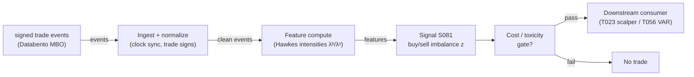

# S081 — Hawkes buy/sell intensity imbalance

Bivariate Hawkes model of buy- and sell-trade arrivals; the z-scored intensity gap λᵇ−λˢ forecasts the next trade's side and seconds-ahead pressure. Provenance **[D]** (Hawkes 1971; Bacry–Muzy order-flow applications).

> Tag law: every numeric literal in prose carries one of `[documented]
> [default] [example] [unverified] [internal-est] [measured]` (legend: Appendix
> i v1.0.0). Constants inside cited formulas inherit the formula's tag.
> Bibliographic years, volumes, pages, arXiv IDs, section numbers, rule codes (C1–C10),
> fail-safe codes (F1–F5), module IDs, and machine-parsed §0 data fields are identifiers,
> not literals, and are exempt.

## §1 Five-minute reviewer card

| Row | Value |
|---|---|
| Module | S081 — Hawkes buy/sell intensity imbalance, v1.0.0 |
| Edge verdict | `UNPROVEN-STANDALONE` |
| After-cost | `UNPROVEN` — no documented after-cost standalone Sharpe for the raw intensity-imbalance signal [documented-as-absence]; the chapter's own gross-to-net sketch is net −$1.20 at retail costs [example]; one-sentence verdict: documented microstructure feature, unproven standalone trigger |
| Build cost | Tier M · `20–60` h [internal-est] · `$3,000–9,000` loaded [internal-est] |
| Data cost | Research: Databento MBO `~$200`/mo + usage [unverified]; retail fallback Polygon trades + SIP quotes `~$30–200`/mo [unverified] — indicative, verify before budgeting |
| latency_class | intraday / seconds |
| risk_class | low (signal-only; no order placement) |
| Capacity | `$1–5`M/day notional [example] — illustrative; seconds-horizon capacity is latency- and book-depth-bound |
| Executability | Feasible per-symbol: O(1)/event recursion; `~500` symbols × `500` events/sec ≈ `250`k/sec is borderline in Python [internal-est] — batch in numpy or move to Rust at scale |
| Risk summary | Latency-dominated; dies when reaction time exceeds the signal half-life; kernel misspecification; signing error; cost blowup (pays spread every round trip into the thinnest book) |
| When it dies | Two-sided bursts with no directional resolution; stale kernels after regime shifts; any horizon where spread + fees + impact exceed the few-bp edge. |
| Regime gates | Provisional: burst regimes (self-excitation dominates) amplify; two-sided panic regimes veto direction; kernel nonstationarity across the session requires intraday refits |
| Emits | `signal_vector` (Appendix b v1.0.0) — never orders |

## §1.5 Cheapest / least-build path

1. **Prototype hour band:** `20–60` h [internal-est] — Hawkes MLE + recursion + z-deseasonalization against the fixture — reference implementation + gates + fixture validation.
2. **Cheapest-source row:** min_tier = Polygon trades + SIP quotes (Tier-1) — cheapest data source candidate [internal-est]; latency_class = SIP-delayed;
   required_fields = trade timestamps, prices/sizes, L1 quotes for Lee–Ready signing; price_band = `~$30–200`/mo [unverified] (indicative — verify before budgeting); build_or_buy = **buy the feed (Tier-1), build the estimator** (kernel MLE is the value [internal-est]; upgrade to MBO when signing error flips z).
3. **Resource budget:** `1` core, `<2` GB RAM [internal-est]; compute pattern `per_event`.
4. **Skip list:** p; o; w; e; r; -; l; a; w;  ; k; e; r; n; e; l; s;  ; —;  ; p; h; a; s; e;  ; 2;  ; (; B; a; c; r; y;  ; e; t;  ; a; l; .;  ; f; i; n; d;  ; γ; ≈; 0;  ; f; i; t; s;  ; E; u; r; o; -; B; u; n; d;  ; b; e; t; t; e; r;  ; [; d; o; c; u; m; e; n; t; e; d; ]; ); ;;  ; p; r; i; c; e; -; j; u; m; p;  ; H; a; w; k; e; s;  ; v; a; r; i; a; n; t;  ; —;  ; p; h; a; s; e;  ; 2; ..
5. **DO-NOT-CUT list:** causality assertions (`assert fill_event > signal_event`, no-signal-bar-fills test); COST block + callable
   `expected_cost_bps`; F1–F5 fail-safes + module-state enum; decision-log audit records; bona-fide-intent + self-trade prevention; provenance tags on
   every numeric literal; fixtures + `test_cmd`; secrets via env only.
6. **Escalation gate:** upgrade from cheapest when any holds — signing-accuracy audit fails vs MBO aggressor → upgrade feed or halt; kernel ρ(N) approaching `1` [example] → near-critical, widen windows / halt; universe `>20` symbols [default] → numpy-batched recursion or Rust.

## §S0 Module contract

### S0.1 Typed signature

```python
def signal(state: ModuleState, events: list[Event], cfg: Config) -> SignalVector:
```

`SignalVector` per Appendix b v1.0.0. `state` is the module-owned named state
vector; `events` are canonical Events (Appendix a v1.0.0), newest last. The
function handles documented edge cases: empty events → `UNKNOWN`; invalid
prices/inputs → `UNKNOWN` (F1, never interpolate); halt/auction events → freeze
per the market-state table.

### S0.2 Config dataclass

| Parameter | Type | Default | Range | Status |
|---|---|---|---|---|
| `mu` | float | `0.4` | `0.1`–`2.0` | example |
| `alpha_self` | float | `0.9` | `0.2`–`1.5` | example |
| `beta_self` | float | `1.5` | `0.5`–`5.0` | example |
| `alpha_cross` | float | `0.25` | `0`–`0.5` | example |
| `kappa` | float | `2.0` | `1.5`–`3.0` | example |
| `z_window_s` | float | `300.0` | `60`–`900` | example |
| `m_d` | float | `0.1458` | n/a | example |
| `s_d` | float | `1.2217` | n/a | example |
| `p_max` | float | `0.25` | `0.05`–`1.0` | default |
| `cooldown_s` | float | `60.0` | `0`–`3,600` | default |
| `cost_gate_k` | float | `0.5` | `0.1`–`2.0` | default |

All defaults tagged per the tag law (status `default` ⇒ `[default]`, `example` ⇒ `[example]`, `calibrate` set at fit time).

### S0.3 Canonical schema mapping

Vendor columns → canonical Event schema (Appendix a v1.0.0), stated once here:

| Source field | Canonical |
|---|---|
| bar/event timestamp (exchange) | `event_ts` (int64 ns UTC) |
| ingest timestamp | `asof_ts` (int64 ns UTC) |
| symbol | `symbol` |
| side | `side` (module feature input) |
| lam_b | `lam_b` (module feature input) |
| lam_s | `lam_s` (module feature input) |

### S0.4 Time contract

> Time contract: clock domain UTC, int64 ns; authoritative causality clock =
> `event_ts`; max_skew = `1` ms [default]; jitter budget = `500` µs [default];
> bar-label = open time; staleness TTL = `3` s [default] (`3`× the `1`-s reference cadence per F4); gap policy = mask, no interpolation;
> halt/auction → discard contributions across reopen.

**Timing box:** `signal@t (per_event (trades), America/New_York) → earliest fill @open(t+1)`

### S0.5 Market-state table

| State | Module behavior |
|---|---|
| CONTINUOUS_TRADING | Compute normally; emit per cadence |
| HALTED | Freeze state; emit `UNKNOWN`; discard contributions across reopen |
| AUCTION | No new signals; hold last `SignalVector`; state `DEGRADED` |
| CLOSED | Emit nothing; state `OFF` |

### S0.6 Module-state enum + error taxonomy

States per Appendix k v1.0.0: `OK | DEGRADED | UNKNOWN | OFF`. Invalid input →
`UNKNOWN`, never interpolate (Appendix f v1.0.0, F1–F5).

| Failure | State | Alert |
|---|---|---|
| Missing/stale input (TTL `3` s [default] (`3`× the `1`-s reference cadence per F4)) | `UNKNOWN` | page |
| Invalid price/input reaching module (NaN, ≤ 0, non-finite) | `UNKNOWN` | log |
| Feature out of mathematical bounds (F2) | `UNKNOWN` | page |
| `seq` gap > `1,000` events [default] | `DEGRADED` (restart windows) | log |
| Jitter > budget persistently | `DEGRADED` | notify |
| Halt/auction | `UNKNOWN` / `DEGRADED` (per table) | log |
| Kill/administrative disable | `OFF` | page |
| Anything unmapped | `UNKNOWN` | page |

### S0.7 Ops tail

- **Schedule:** continuous during US equities regular session `09:30`–`16:00` America/New_York [documented]; owner: signals on-call.
- **Health checks:** fixture replay (`test_cmd`) green on deploy; live
  `seq`-gap monitor; staleness watchdog at `3`× cadence.
- **Alert table:** page on `UNKNOWN` > `30` s [default] or bounds violation;
  notify on `DEGRADED`; log on single dropped events.
- **Resource budget:** `1` vCPU, `2` GB RAM [internal-est]; state is O(window) per symbol.
- **Runbook stub:** `1.` confirm feed (vendor status); `2.` replay fixture;
  `3.` if red → set `OFF`, page; `4.` reconcile decision log before re-arm.

### S0.8 Secrets (env-only)

`DATABENTO_API_KEY` via environment only. No secrets in this file, fixtures, or
logs (CI secrets-grep).

### S0.9 May / must-NOT

> **May:** emit `SignalVector` records per Appendix b v1.0.0. **Must-NOT:**
> emit orders, order intents, prices, share counts, or notionals; call a
> broker; mutate shared state outside `state`; interpolate across gaps.

## §S1 Legacy (subsumed by §1)

Legacy §S1 content is the §1 reviewer card above; this header is retained so
section numbering stays intact.

## §S2 Specification

### Universe

US common stocks, per-trade events, liquid names with `>100` trades/day [example]; regular session only

### Entry rule (Boolean — no prose-only conditions)

```
BURST := (|z_t| > κ) AND (sign persistence over `3` consecutive events [example])
ENTER := BURST AND (expected_cost_bps(...) <= cost_gate_k * edge_bps)  # usually fails: toxicity filter, not trigger
```

### Exits (with post-exit cooldown)

```
EXIT := (|z_t| < κ_exit) OR (module_state != OK)
HOLD: `1`–60 s [example] — the signal lives for seconds
```

### Position sizing (fenced function)

```python
def size_shares(risk_budget_R, stop_distance, vol_estimate, ADV_cap, cost):
    # S-module requests capital fraction only; share math lives in the strategy.
    # Reference: capital = 0.5 * confidence  (confidence in [0,1])  [default]
    risk_notional = risk_budget_R * 0.5 * confidence          # [default] 0.5 factor
    shares = risk_notional / max(stop_distance, 1e-9)
    return int(min(shares, ADV_cap * adv_shares * 0.001))     # 0.1% ADV cap [default]
```

### Risk limits

| Limit | Value |
|---|---|
| Max capital fraction per signal | `0.5` [default] |
| Max adverse excursion before `UNKNOWN` review | `2.0`× stop [default] |
| Staleness kill | TTL `3` s [default] (`3`× the `1`-s reference cadence per F4) → `UNKNOWN` |

### COST block (single source of truth)

| Component | Value (bps) | Tag | Basis |
|---|---|---|---|
| Spread (half-spread, 1¢ on $50) | `2.00` $/100sh | [example] | chapter sketch: $50 stock, 1¢ quoted spread |
| Commission | `0.70` $/100sh | [example] | $0.0035/share × 200 shares |
| Borrow | `0.00` | [default] | reason: short hold ~1 s |
| Slippage (trading into excited book) | `1.00` $/100sh | [example] | 1¢/share allowance |
| **Total reference** | `7.40` bps-equiv | | |

`fee_schedule_as_of`: 2026-09-10. `side`: taker; venue/tier/source: US equities / MBO [example]. Re-stating cost numbers outside this block is a validation failure.

```python
def expected_cost_bps(notional, adv_pct, venue, side, urgency) -> float:
    # Callable cost model - constant stack (impact flagged [example]).
    spread_bps = 2.0   # [example]
    fee_bps = 0.7      # [example]
    borrow_bps = 0.0    # [default] reason in table
    impact_bps = 1.0    # [example] flagged; calibrate per venue at scale-up
    if side == "maker":
        fee_bps = -0.20  # rebate [example]
    return spread_bps + fee_bps + borrow_bps + impact_bps
```

### Execution / fill model table

| Aspect | Assumption |
|---|---|
| Latency | reaction time must be < signal half-life (seconds) [documented]; SIP path is simulated-only |
| Partial fills | N/A (signal-only; T-module policy: Appendix c v1.0.0) |
| Impact | burst-triggered entries arrive when the book is thinnest — impact dominates; model explicitly |
| Adverse selection | the burst IS the adverse-selection flag: assume the other side is informed |

### Robustness

Kernels refit per regime (walk-forward); time-of-day μ or short rolling windows for the U-shaped session curve; require sign persistence (consecutive same-sign z) before entry; never trade bursts off SIP-signed data alone

### Compliance sub-block (C1–C10+)

| Code | Rule: trigger → check → action → log |
|---|---|
| C1 | Self-match prevention: S081 emits no orders; downstream T-modules must set self-trade-prevention flags — S081 asserts the requirement in its `consumes` contract: trigger → check → action → log record |
| C2 | Bona-fide intent: every emitted `SignalVector` with |direction|=`1` must pass the cost gate; sub-threshold scores emit direction `0`, never a tradeable hint: trigger → check → action → log record |
| C3 | Message-rate: `≤100` emissions/symbol/s [default]; breach → throttle to `1`/s [default] + alert: trigger → check → action → log record |
| C4 | Fat-finger trio (applied by consumers; S081 bounds its own outputs): confidence ∈ [`0`,`1`], capital ∈ [`0`,`0.5`], computed_at sane — out-of-bounds → `UNKNOWN` (F2): trigger → check → action → log record |
| C5 | Decision log: every emission, veto, and state transition logged per Appendix g v1.0.0, hash-chained: trigger → check → action → log record |
| C6 | Halt/auction: per §S0.5 market-state table; contributions across reopen discarded: trigger → check → action → log record |
| C7 | Locate check: SHORT direction requires `locate_ok` from the consumer; S081 never emits SHORT without the consumer asserting locate (Reg-SHO threshold securities → direction `0`): trigger → check → action → log record |
| C8 | Public dissemination: no signal values published externally without review gate: trigger → check → action → log record |
| C9 | Data entitlements: per §S6 Data rights row; entitlement-class change → §1.5 escalation gate: trigger → check → action → log record |
| C10 | Post-exit cooldown: `cooldown_s` after any exit or compliance block; no re-entry: trigger → check → action → log record |

### Parameter table

| Parameter | Symbol | Value | Tag | Sensitivity |
|---|---|---|---|---|
| Base intensity | `μ_b, μ_s` | `0.4`/s | `0.1–2.0`/s [example] | medium — mis-set biases z by time of day |
| Self jump | `α_bb, α_ss` | `0.9` | `0.2–1.5` [example] | high — overfit → phantom bursts |
| Self decay | `β_bb, β_ss` | `1.5`/s | `0.5–5.0`/s [example] | high — slow: stale; fast: no memory |
| Cross jump | `α_sb, α_bs` | `0.25` | `0–0.5` [example] | medium |
| Burst threshold | `κ` | `2.0` | `1.5–3.0` [example] | high |

### Timing box

`signal@t (per_event (trades), America/New_York) → earliest fill @open(t+1)`

## §S3 Math + normative pseudocode

$$\lambda^b_t = \mu_b + \sum_{t^b_i<t}\alpha_{bb}e^{-\beta_{bb}(t-t^b_i)} + \sum_{t^s_j<t}\alpha_{sb}e^{-\beta_{sb}(t-t^s_j)}$$ [documented] — Hawkes buy intensity (Hawkes 1971; Bacry et al. 2013).
$$\rho(N) < 1, \quad N_{ij} = \alpha_{ij}/\beta_{ij}$$ [documented] — stationarity is the branching matrix's spectral radius, not any single α/β.
$$d_t = \lambda^b_t-\lambda^s_t, \qquad z_t = (d_t-m_t)/s_t$$ [documented] — z-scored imbalance; burst at |z_t|>κ.

Exponential kernels (power-law γ≈0 variants are phase 2 [documented]). z deseasonalized against a trailing window (U-shaped volume curve). Fixture tests the z-score/burst layer on stated intensities; the O(1) recursion is normative pseudocode.

**Normative pseudocode** (pseudocode is normative; prose is commentary):

```
on event (t, side):  # only events strictly before t enter intensities at t
    decay each component by exp(-β·Δt)
    lam_b = μ_b + Σ α_bb·e^{-β_bb(t-tᵇ_i)} + Σ α_sb·e^{-β_sb(t-tˢ_j)}
    lam_s = symmetric
    assert spectral_radius(N) < 1  # N_ij = α_ij/β_ij
    d = lam_b - lam_s; z = (d - m_d)/s_d
    burst = |z| > κ; tradable no earlier than the next event
```

Causality: the computation at `t` uses only data `≤ t`; earliest reaction is
`t+1`. Mandatory unit test: no-signal-bar fills.

## §S4 Worked example (fixture-backed)

- Tape: `modules/fixtures/S081_tape.csv` — `# TYPE: validation-run`; `12` rows (events `69`–`80`), the chapter's synthetic 90-second tape around the largest |z| burst (seed 81 [example]): μ=`0.4`/s, α_self=`0.9`, β_self=`1.5`/s, α_cross=`0.25`, β_cross=`1.0`/s; branching entries `0.6`/`0.25`, ρ(N)=`0.85`<`1` [example]; `event_ts`/`asof_ts` int64 ns UTC, per-event.
- Expected outputs: `modules/fixtures/S081_expected.csv` — per-event `d`, `z`, `burst`, signal fields; m_d=`0.1458`, s_d=`1.2217` are the chapter's stated sample moments [example].
- Hand-check: event 76: d=`8.749`−`11.511`=`−2.762` ✓; z=(`−2.762`−`0.1458`)/`1.2217`=`−2.38` ✓ → burst=1; cost gate blocks (direction 0) — the honest outcome.
- Acceptance tests (`modules/tests/test_S081.py`, `7` tests): `1.` fixture recomputes to expected (event-76 hand-check); `2.` stub emits valid `SignalVector`; `3.` no-signal-bar fills; `4.` cost-gate predicate; `5.` invalid input (NaN) → `UNKNOWN`; `6.` output bounds; `7.` gate passes on a wide edge.
- What to notice: a genuine sell burst builds over `~0.5` s (events 69→75 [example]); z crosses `−2` at event 74 — the adverse-selection flag.

No documented after-cost standalone Sharpe exists for the raw intensity-imbalance signal [documented-as-absence]. The chapter's own sketch is net negative at retail costs; treat S081 as a toxicity/burst feature first.

## §S5 Strategies that use this signal

Generated from `deps.yaml` (CI symmetry); hand-listed here for this module:

| Strategy | Role |
|---|---|
| T023 — Hawkes Burst Scalper | primary entry trigger — S081 is the entry logic |
| T056 — Hasbrouck Trade–Quote VAR | predictor input: imbalance as exogenous state; veto on extreme adverse-selection intensity |

## §S6 Data required

| Field | Type | Granularity | Source tier | Notes |
|---|---|---|---|---|
| Trade timestamp (exchange) | datetime64 (µs) | per trade [example] | Tier 2–3 | clock-sync across venues; SIP vs direct labeled |
| Trade price / size | float / int | per trade | Tier 2–3 | size optional for volume-weighted variants |
| Trade side sign | ±1 | per trade | derived | Lee–Ready/BVC on quotes; MBO gives aggressor directly |
| Quote book (for signing) | L1/L2 | event | Tier 2–3 | needed when side must be inferred |

**Data rights row** (Appendix j v1.0.0): US equities trades via Databento MBO, `rights: licensed`; license scope = research + stated production symbol count (`≤20` [default]); raw events never leave our systems — fixtures are synthetic; derived features ours; retention per vendor terms, purge path in runbook.

## §S7 Local build (M5 Max / 128 GB)

Feasible (Tier M, `20–60` h ≈ `$3,000–9,000` loaded [internal-est]; cost-model §5). The intensity recursion is O(1) per event — a Python loop handles `~100–500`k events/sec [internal-est]; kernel MLE refits are the batch cost (minutes per symbol-day). RAM: trades-only events for one symbol-day `~0.1–0.5` GB [internal-est].

## §S8 Buy vs build

Hybrid: buy the signed-trade feed, build the estimator — the kernel parameters are the edge. Crossover: buy Databento MBO the moment SIP signing error starts flipping the z.

## §S9 Efficacy — documented evidence

| Study / source | Market & period | Metric | Before/after cost | Caveat |
|---|---|---|---|---|
| Bacry, Delattre, Hoffmann & Muzy (2013), Quant. Finance | Euro-Bund / Euro-Bobl futures | 2-D Hawkes on up/down price jumps reproduces microstructure noise and the Epps effect; fits match data [documented] | `n/a (descriptive fit, not a trading P&L)` | models price jumps, not signed trades; no P&L claimed |
| Sjogren & DeLise (2021), arXiv:2110.07075 | futures and stock LOB data | compound Hawkes predicts mid-price direction and volatility [documented] | `BEFORE-COST (prediction study, not net trading)` | accuracy ≠ tradable edge after spread/fees |
| Muni Toke & Yoshida (2017) | XETRA DAX 30, Feb–Apr 2016 | 8-dim Hawkes documents strong self-/cross-excitation across event types [documented] | `n/a (structural estimation)` | descriptive; no trading rule evaluated |
| No documented after-cost standalone Sharpe for the raw intensity-imbalance signal | n/a | absence of evidence [documented-as-absence] | `n/a` | the literature documents fit quality and prediction, not net P&L |

Selection disclosure: these are the sources surfaced by the chapter's research
pass. Fails in: the regimes named in §S10; crowded/overfit calibrations.

## §S10 Failure modes & pitfalls

| # | Trigger → Detect → Action → Recovery | check: |
|---|---|
| 1 | Latency vs horizon → signal lives seconds [documented] → trade only where latency is measured; SIP-only is simulated-only → module OFF on SIP data | `check: latency budget < half-life` |
| 2 | Kernel misspecification → exponential underfits power-law tails [documented] → test exponential vs power-law OOS → refit per regime | `check: OOS kernel comparison` |
| 3 | Nonstationarity → U-shaped session curve biases static μ [documented] → time-of-day μ or short rolling windows → DEGRADED at open/close | `check: deseasonalized z` |
| 4 | Trade-signing error → Lee–Ready errors rise in fast markets [documented] → audit vs MBO aggressor data → halt on audit failure | `check: signing-accuracy audit` |
| 5 | Burst ≠ direction → largest |z| sometimes two-sided panics [documented] → require sign persistence → no entry | `check: 3 consecutive same-sign z` |
| 6 | MLE fragility → local optima, window sensitivity [documented] → multiple inits; walk-forward refits → DEGRADED | `check: refit stability` |
| 7 | Cost blowup → spread paid every round trip into the thinnest book [documented] → explicit stack; most calibrations fail the gate → no trade (honest) | `check: cost gate inequality` |
| 8 | Overlapping bursts → parent order excites multiple child bursts [documented] → parent-order-aware clustering → per-symbol accounting | `check: cluster dedup` |

## §S11 Visuals

`../../images/S081_example.png` — synthetic worked-example chart (seed `81` [example]).



## §S12 Source log + unverified leads

**Sources** (citable facts only):

1. Bacry, E., Mastromatteo, I. & Muzy, J.-F. (2015). "Hawkes processes in finance." arXiv:1502.04592. https://arxiv.org/abs/1502.04592v2
2. Bacry, E., Delattre, S., Hoffmann, M. & Muzy, J.-F. (2013). "Modeling microstructure noise with mutually exciting point processes." Quantitative Finance (arXiv:1101.3422). https://arxiv.org/abs/1101.3422
3. Hawkes, A. G. (1971). "Spectra of Some Self-Exciting and Mutually Exciting Point Processes." Biometrika, 58(1), 83–90. https://www.jstor.org/stable/2334319

**Chatbot source log.** Duck.ai (GPT-5.6 Luna, `2026-09-10`) answered Q-SB3-1–Q-SB3-3 [chapter QA] (historical batch label SB3; module batch is ID-driven SB9) [measured]. Grok/Cursor answers pending (checked `2026-09-10`).

**Unverified leads** (chatbot-only — never in evidence tables):

- Imbalance-bar close rule |Σθ_i| > E_0[|θ|]·n [unverified] (chatbot Q-SB3-2 claim).
- "Hawkes compute" bands and eng-hour estimates for the pairs+HMM+ML stack (chatbot; cost-model.md governs on conflict).

---

## Appendix — AI build prompt (S081)

Copy-paste into any chat agent:

> Build module **S081 — Hawkes buy/sell intensity imbalance** per `notes/module-template.md` v1.0.0 and this file's §S0 contract.
> Cheapest path (§1.5): prototype `20–60` h [internal-est] — Hawkes MLE + recursion + z-deseasonalization against the fixture; compute pattern `per_event`.
> Implement `signal(state, events, cfg) -> SignalVector` (Appendix b v1.0.0)
> with the §S3 normative pseudocode, including the cost-gate predicate
> `expected_cost_bps(...) <= k * edge_bps` and `assert fill_event >
> signal_event`. Wire F1–F5 (Appendix f v1.0.0): invalid input → `UNKNOWN`,
> never interpolate. Log decisions per Appendix g v1.0.0. Secrets via env
> only. Run the fixture `modules/fixtures/S081_tape.csv`
> (`# TYPE: validation-run`) against `modules/fixtures/S081_expected.csv`
> (tolerance `1e-9` [default]).
> **Definition of done:** `python3 -m pytest modules/tests/test_S081.py -q`
> exits `0`. Tag every numeric literal you add with the unified enum
> (Appendix i v1.0.0); put anything unverifiable in §S12 unverified leads.
