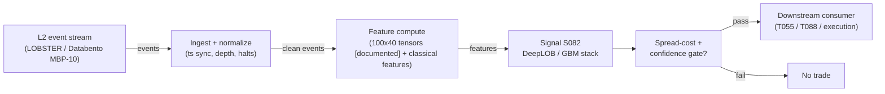

# S082 — Deep learning on the LOB (DeepLOB + classical ML features)

DeepLOB (CNN+LSTM on 100 [documented] LOB snapshots) and its cheaper cousin (hand-built features in logistic/GBM) predict the next mid-price move; the module gates deployment on net-of-cost arithmetic. Provenance **[D/SR]** (Zhang, Zohren & Roberts 2019; Sirignano & Cont 2019 [D]; classical feature stack [SR]).

> Tag law: every numeric literal in prose carries one of `[documented]
> [default] [example] [unverified] [internal-est] [measured]` (legend: Appendix
> i v1.0.0). Constants inside cited formulas inherit the formula's tag.
> Bibliographic years, volumes, pages, arXiv IDs, section numbers, rule codes (C1–C10),
> fail-safe codes (F1–F5), module IDs, and machine-parsed §0 data fields are identifiers,
> not literals, and are exempt.

## §1 Five-minute reviewer card

| Row | Value |
|---|---|
| Module | S082 — Deep learning on the LOB (DeepLOB + classical ML features), v1.1.0 |
| Edge verdict | `BEFORE-COST-ONLY` |
| After-cost | `BEFORE-COST` — documented classification gains (FI-2010; LSE OOS) but no documented after-cost executable P&L net of spread/fees/queue/turnover [documented-as-absence]; one-sentence verdict: genuine classification advance, usually dies at the spread |
| Build cost | Tier H · `100–250` h [internal-est] · `$15,000–37,500` loaded [internal-est] |
| Data cost | Research: LOBSTER academic `~hundreds`/yr [unverified]; Databento Standard plan `$199`/mo [documented, as-of 2026-01-13 plan change, confirmed 2026-08] + MBP-10 equities historical `$1.00`/GB, live `$1.20`/GB [documented, 2024-12-11 unit pricing sheet]; commercial multi-year L2/L3 `several thousand` → `$100,000+`/yr [unverified] — verify before budgeting |
| latency_class | intraday / milliseconds |
| risk_class | low (signal-only; no order placement) |
| Capacity | `$0.5–2`M/day notional [example] — illustrative; millisecond-horizon capacity is queue-position-bound |
| Executability | Research-feasible: inference `1`–`10` ms/sequence [internal-est]; training streams from NVMe (`20`–`400` GB cache [internal-est]); do NOT put Python preprocessing + GPU sync + deep recurrent model on the live tick critical path |
| Risk summary | Accuracy≠profit-dominated; dies on mid-price evaluation traded at bid/ask, missing queue model, label leakage, FI-2010 overfitting, turnover bleed, latency illusion, regime drift |
| When it dies | When `55`% [example] accuracy meets a spread `10`× [example] the edge; mid-price evaluation traded at bid/ask; assumed fills with no queue model; FI-2010-style toy benchmarks. |
| Regime gates | Machine records in §S10 (provisional); restrictive default: unknown regime → `veto` |
| Emits | `signal_vector` (Appendix b v1.0.0) — never orders |

## §1.5 Cheapest / least-build path

1. **Prototype hour band:** `100–250` h [internal-est] — faithful DeepLOB reproduction after the GBT baseline exists — reference implementation + gates + fixture validation.
2. **Cheapest-source row:**
   - `min_tier`: LOBSTER academic (MBO/ITCH replay, selectable depth) — cheapest data source candidate [internal-est]
   - `latency_class`: exchange-direct (replay)
   - `required_fields`: `10`-level [example] LOB snapshots (price+size per level), trade prints, timestamp sync map (exchange vs capture clock)
   - `price_band`: LOBSTER academic `~hundreds`/yr [unverified]; Databento Standard `$199`/mo [documented, as-of 2026-01-13 plan change] with MBP-10 historical `$1.00`/GB [documented, 2024-12-11 sheet]; FI-2010 benchmark free [documented] but NOT adequate for production validation
   - `build_or_buy`: **buy the replay data, build the model last** (data is the binding constraint [internal-est]; FI-2010 is free but a 10-day/5-stock toy [documented])
3. **Resource budget:** `1` core, `<2` GB RAM [internal-est]; compute pattern `per_event`.
4. **Skip list:** Transformer/TransLOB successors — research only, until strict walk-forward + regime tests pass; pooled universal model (Sirignano & Cont) — phase 2; live-tick critical-path inference — use the GBM fallback first; multi-year commercial L2 — only after the GBT baseline is net-of-cost positive.
5. **DO-NOT-CUT list:** causality assertions (`assert fill_event > signal_event`, no-signal-bar-fills test); COST block + callable
   `expected_cost_bps`; F1–F5 fail-safes + module-state enum; decision-log audit records; bona-fide-intent + self-trade prevention; provenance tags on
   every numeric literal; fixtures + `test_cmd`; secrets via env only.
6. **Escalation gate:** upgrade from cheapest when any holds — live accuracy diverges from backtest → DEGRADED, scheduled retrain; label-leakage audit flags a future timestamp → invalidate run, OFF; inference latency exceeds horizon budget → fall back to GBM.

## §S0 Module contract

### S0.1 Typed signature

```python
def signal(state: ModuleState, events: list[Event], cfg: Config) -> SignalVector:
```

`SignalVector` per Appendix b v1.0.0. `state` is the module-owned named state
vector; `events` are canonical Events (Appendix a v1.0.0), newest last. The
function handles documented edge cases: empty events → `UNKNOWN`; invalid
prices/inputs → `UNKNOWN` (F1, never interpolate); halt/auction events → freeze
per the market-state table.

### S0.2 Config dataclass

| Parameter | Type | Default | Range | Status |
|---|---|---|---|---|
| `T_snaps` | int | `100` | `50`–`200` | calibrate |
| `L_depth` | int | `10` | `5`–`20` | calibrate |
| `p_conf` | float | `0.6` | `0.5`–`0.8` | calibrate |
| `alpha_bp` | float | `1.0` | `0`–`3` | calibrate |
| `p_max` | float | `0.25` | `0.05`–`1.0` | fixed (risk policy; not fit) |
| `cooldown_s` | float | `60.0` | `0`–`3,600` | calibrate |
| `cost_gate_k` | float | `0.5` | `0.1`–`2.0` | calibrate |
| `stale_ttl_s` | float | `3.0` | `1`–`30` | default |
| `min_fill_lag_ns` | int | `1_000_000` | fixed | fixed |

All defaults tagged per the tag law (status `default` ⇒ `[default]`, `calibrate` set at fit time, `fixed` set by policy).

#### Calibration protocol (per-parameter grid + walk-forward OOS selection)

- **Search grids:** `T_snaps ∈ {50, 100, 150, 200}`; `L_depth ∈ {5, 10, 15, 20}`; `p_conf ∈ {0.55, 0.60, 0.65, 0.70, 0.75}`; `alpha_bp ∈ {0.5, 1.0, 2.0, 3.0}`; `cooldown_s ∈ {0, 30, 60, 300}`; `cost_gate_k ∈ {0.25, 0.5, 1.0, 2.0}` — all [example] starting grids.
- **Walk-forward design:** anchored day-based expanding folds (per the Ntakaris day-based anchored CV protocol [documented]); train ≥ `60` trading days [example], test `20` days [example], step forward `20` days [example]; minimum `5` folds [default] before any parameter is trusted.
- **Embargo:** `max(T_snaps, k) ` events + `1` full session [default] between train end and test start, so labels on test bars never leak into training features.
- **Selection metric:** net-of-cost expected net per trade (`E[net]`, full COST stack applied) — **not accuracy**; balanced accuracy reported as a diagnostic only. Selecting on accuracy is failure mode §S10-5 [documented].
- **Freeze rule:** hyperparams frozen after the first qualifying walk-forward (≥5 folds, E[net] > 0 net-of-cost on every fold); refit at most quarterly; if live 20-day [default] balanced accuracy falls below OOS minus the `2`σ band [default] → `DEGRADED` + model quarantine (§S10-8).
- **Never-fit:** `p_max` (risk policy), `stale_ttl_s` (F4 `3`× cadence), `min_fill_lag_ns` (causality pin).

### S0.3 Canonical schema mapping

Vendor columns → canonical Event schema (Appendix a v1.0.0), stated once here:

| Source field | Canonical |
|---|---|
| bar/event timestamp (exchange) | `event_ts` (int64 ns UTC) |
| ingest timestamp | `asof_ts` (int64 ns UTC) |
| symbol | `symbol` |
| acc | `acc` (module feature input) |
| mu_c | `mu_c` (module feature input) |
| mu_w | `mu_w` (module feature input) |
| spread | `spread` (module feature input) |
| fees | `fees` (module feature input) |

Databento MBP-10 native → canonical mapping (§S6): `ts_event` → `event_ts`, `ts_recv` → `asof_ts`, `bid_px_00..09`/`ask_px_00..09`/`bid_sz_00..09`/`ask_sz_00..09` → module feature input `book_levels`.

### S0.4 Time contract

> Time contract: clock domain UTC, int64 ns; authoritative causality clock =
> `event_ts`; max_skew = `1` ms [default]; jitter budget = `500` µs [default];
> bar-label = open time; staleness TTL = `3` s [default] (`3`× the `1`-s reference cadence per F4); gap policy = mask, no interpolation;
> halt/auction → discard contributions across reopen.

**Timing box:** `signal@t (per_event (LOB snapshots), America/New_York) → earliest fill @open(t+1)`

### S0.5 Market-state table

| State | Module behavior |
|---|---|
| CONTINUOUS_TRADING | Compute normally; emit per cadence |
| HALTED | Freeze state; emit `UNKNOWN`; discard contributions across reopen |
| AUCTION | No new signals; hold last `SignalVector`; state `DEGRADED` |
| CLOSED | Emit nothing; state `OFF` |

### S0.6 Module-state enum + error taxonomy

States per Appendix k v1.0.0: `OK | DEGRADED | UNKNOWN | OFF`. Invalid input →
`UNKNOWN`, never interpolate (Appendix f v1.0.0, F1–F5).

| Failure | State | Alert |
|---|---|---|
| Missing/stale input (TTL `3` s [default] (`3`× the `1`-s reference cadence per F4)) | `UNKNOWN` | page |
| Invalid price/input reaching module (NaN, ≤ 0, non-finite) | `UNKNOWN` | log |
| Feature out of mathematical bounds (F2) | `UNKNOWN` | page |
| `seq` gap > `1,000` events [default] | `DEGRADED` (restart windows) | log |
| Jitter > budget persistently | `DEGRADED` | notify |
| Halt/auction | `UNKNOWN` / `DEGRADED` (per table) | log |
| Kill/administrative disable | `OFF` | page |
| Anything unmapped | `UNKNOWN` | page |

### S0.7 Ops tail

- **Schedule:** continuous during US equities regular session `09:30`–`16:00` America/New_York [documented]; owner: signals on-call.
- **Health checks:** fixture replay (`test_cmd`) green on deploy; live
  `seq`-gap monitor; staleness watchdog at `3`× cadence.
- **Alert table:** page on `UNKNOWN` > `30` s [default] or bounds violation;
  notify on `DEGRADED`; log on single dropped events.
- **Resource budget:** `1` vCPU, `2` GB RAM [internal-est]; state is O(window) per symbol.
- **Runbook stub:** `1.` confirm feed (vendor status); `2.` replay fixture;
  `3.` if red → set `OFF`, page; `4.` reconcile decision log before re-arm.

### S0.8 Secrets (env-only)

`DATABENTO_API_KEY` via environment only. No secrets in this file, fixtures, or
logs (CI secrets-grep).

### S0.9 May / must-NOT

> **May:** emit `SignalVector` records per Appendix b v1.0.0. **Must-NOT:**
> emit orders, order intents, prices, share counts, or notionals; call a
> broker; mutate shared state outside `state`; interpolate across gaps.

## §S1 Legacy (subsumed by §1)

Legacy §S1 content is the §1 reviewer card above; this header is retained so
section numbering stays intact.

## §S2 Specification

### Universe

US common stocks, L2 event stream, liquid names with full 10-level depth [example]; regular session only

### Entry rule (Boolean — no prose-only conditions)

```
ENTER := (max_p > p_conf)
     AND (market_state == CONTINUOUS_TRADING)
     AND (t - last_emit_ts >= cooldown_s * 1e9)
     AND (E[net] > 0)
     AND (expected_cost_bps(notional, adv_pct, venue, side, urgency) <= cost_gate_k * edge_bps)
     AND (direction == -1  ==>  locate_ok == 1)
```

All symbols are bound in the §S3 normative pseudocode. `max_p` is the
classifier's top-class probability, `cstar` its argmax class (`+1` up / `-1` down / `0` stationary);
`E[net] = acc*net_correct + (1-acc)*net_wrong` (pence); `edge_bps = 10000 * max(0, E[net]) / REF_PRICE_P`.

### Exits (with post-exit cooldown)

```
EXIT := (max_c P(c) < p_conf) OR (live balanced accuracy < backtest − band) OR (module_state != OK)
ON_EXIT: flatten; quarantine model version for review
```

### Position sizing (fenced function)

```python
def size_shares(risk_budget_R, stop_distance, vol_estimate, ADV_cap, cost):
    # S-module requests capital fraction only; share math lives in the strategy.
    # Reference: capital = 0.5 * confidence  (confidence in [0,1])  [default]
    risk_notional = risk_budget_R * 0.5 * confidence          # [default] 0.5 factor
    shares = risk_notional / max(stop_distance, 1e-9)
    return int(min(shares, ADV_cap * adv_shares * 0.001))     # 0.1% ADV cap [default]
```

### Risk limits

| Limit | Value |
|---|---|
| Max capital fraction per signal | `0.25` [fixed] (binding; Config `p_max`) |
| Max adverse excursion before `UNKNOWN` review | `2.0`× stop [default] |
| Staleness kill | TTL `3` s [default] (`3`× the `1`-s reference cadence per F4) → `UNKNOWN` |

### COST block (single source of truth)

Reference notional price `REF_PRICE_P = 100.0` p [example]; `bps = 10000 × pence / REF_PRICE_P` [default].

| Component | Value (bps) | Tag | Basis |
|---|---|---|---|
| Spread crossed (half-spread) | `5.00` | [example] | half-spread `0.05` p ÷ `100` p [example] |
| Fees + slippage | `0.50` | [example] | `0.005` p/trade ÷ `100` p [example] |
| Borrow (`borrow_bps_per_day`) | `0.00` | [default] | reason: intraday hold, flat at close — no overnight financing |
| Impact / queue cost | `0.00` | [example] | flagged; no queue model — real impact is strictly worse |
| **Total reference** | `5.50` | | constant stack |

`fee_schedule_as_of`: 2026-09-10 (module reference schedule; LSE venue row is [example]). `side`: taker (maker earns a `-0.20` bps rebate [example], see callable). Venue/tier/source: LSE / L2 [example]. Re-stating cost numbers outside this block is a validation failure.

```python
# Module constants — identical to the table above. Callable mirrors the block exactly.
REF_PRICE_P        = 100.0   # [example]
SPREAD_HALF_BPS    = 5.0     # [example] half-spread 0.05 p
FEE_BPS            = 0.5     # [example] fees + slippage 0.005 p
BORROW_BPS_PER_DAY = 0.0     # [default] reason: intraday hold
IMPACT_BPS         = 0.0     # [example] flagged; no queue model
MAKER_REBATE_BPS   = -0.20   # [example] maker-side rebate

def expected_cost_bps(notional, adv_pct, venue, side, urgency, hold_days=0.0) -> float:
    fee_bps = MAKER_REBATE_BPS if side == "maker" else FEE_BPS
    return SPREAD_HALF_BPS + fee_bps + BORROW_BPS_PER_DAY * hold_days + IMPACT_BPS
```

### Execution / fill model table

| Aspect | Assumption |
|---|---|
| Latency | inference `1`–`10` ms/sequence [internal-est] must fit inside the horizon; simulated-only for queue-position claims |
| Partial fills | N/A (signal-only; T-module policy: Appendix c v1.0.0) — real deployment needs a queue model |
| Impact | assumed fills overstate capture; use conservative queue-aware fill simulation |
| Adverse fill | mid-price evaluation flatters by ~half the spread per trade |

### Robustness

Horizon > execution latency; labels on executable prices with spread+fees; chronological cross-regime OOS; queue-aware conservative fills; net-of-everything P&L; enforce the development sequence (GBT baseline first); monitor live accuracy vs backtest; scheduled retrain

### Compliance sub-block (C1–C10+)

| Code | Rule: trigger → check → action → log |
|---|---|
| C1 | Self-match prevention: S082 emits no orders; downstream T-modules must set self-trade-prevention flags — S082 asserts the requirement in its `consumes` contract: trigger → check → action → log record |
| C2 | Bona-fide intent: every emitted `SignalVector` with |direction|=`1` must pass the cost gate; sub-threshold scores emit direction `0`, never a tradeable hint: trigger → check → action → log record |
| C3 | Message-rate: `≤100` emissions/symbol/s [default]; breach → throttle to `1`/s [default] + alert: trigger → check → action → log record |
| C4 | Fat-finger trio (applied by consumers; S082 bounds its own outputs): confidence ∈ [`0`,`1`], capital ∈ [`0`,`0.25`], computed_at sane — out-of-bounds → `UNKNOWN` (F2): trigger → check → action → log record |
| C5 | Decision log: every emission, veto, and state transition logged per Appendix g v1.0.0, hash-chained: trigger → check → action → log record |
| C6 | Halt/auction: per §S0.5 market-state table; contributions across reopen discarded: trigger → check → action → log record |
| C7 | Locate check: SHORT direction requires `locate_ok` from the consumer; S082 never emits SHORT without the consumer asserting locate (Reg-SHO threshold securities → direction `0`): trigger → check → action → log record |
| C8 | Public dissemination: no signal values published externally without review gate: trigger → check → action → log record |
| C9 | Data entitlements: per §S6 Data rights row; entitlement-class change → §1.5 escalation gate: trigger → check → action → log record |
| C10 | Post-exit cooldown: `cooldown_s` after any exit or compliance block; no re-entry: trigger → check → action → log record |

### Parameter table

| Parameter | Symbol | Value | Tag | Sensitivity |
|---|---|---|---|---|
| Snapshots | `T` | `100` | grid `50–200` [example] | medium — misses context vs compute blowup |
| Book depth | `L` | `10` | grid `5–20` levels [example] | medium |
| Horizons | `k` | `{10, 20, 50, 100}` | `10–100` events [documented] | high — sub-spread noise vs signal decay |
| Label band | `α` | `1` bp-equiv | grid `0–3` bp-equiv [example] | high — label noise vs class imbalance |
| Confidence | `p_conf` | `0.6` | grid `0.55–0.75` [example] | high |

### Timing box

`signal@t (per_event (LOB snapshots), America/New_York) → earliest fill @open(t+1)`

## §S3 Math + normative pseudocode

$$X_t \in \mathbb{R}^{100\times 40}, \quad l_t = (m_+(t)-m_-(t))/m_-(t), \quad \text{up if } l_t>+\alpha$$ [documented] — DeepLOB input + labels (Zhang et al. 2019).
$$\text{Net P\&L} = \text{forecast move} + \text{captured spread} - \text{spread crossed} - \text{fees} - \text{slippage} - \text{adverse selection} - \text{impact} - \text{infra}$$ [documented] — the decomposition AUC cannot estimate.
$$E[\text{net}] = a\cdot n_c + (1-a)\cdot n_w$$ [example] — eval-gate waterfall (fixture).

Labels use events > t only; features ≤ t (leakage check mandatory). Balanced accuracy (mean over classes of correct_c/obs_c) for 3-class; ROC/PR-AUC for binary reductions.

**Normative pseudocode** (pseudocode is normative; prose is commentary). Every variable is bound; every prose guard appears inline. The reference implementation in `modules/tests/test_S082.py` is this function verbatim in executable form.

```python
def signal(state: ModuleState, events: list[Event], cfg: Config) -> SignalVector:
    evt = events[-1]                                  # newest last (S0.1)
    t   = evt["event_ts"]                             # int64 ns, authoritative clock
    now = evt["asof_ts"]                              # ingest time, int64 ns

    # F1 — invalid input or stale: UNKNOWN, never interpolate.
    for f in ("acc", "mu_c", "mu_w", "spread", "fees"):
        v = evt[f]
        if v is None or not math.isfinite(v):
            return unknown(t, "invalid_or_stale")
    if now - t > cfg.stale_ttl_s * 1e9:                # 3 s [default]
        return unknown(t, "invalid_or_stale")

    # Market-state guards (S0.5). Halt: freeze + UNKNOWN. Auction: hold, DEGRADED.
    if evt["market_state"] == "HALTED":
        return unknown(t, "halt_freeze")
    if evt["market_state"] == "AUCTION":
        return degraded_hold(t, "auction_hold")

    # Cost arithmetic (fixture units are pence; convert at REF_PRICE_P).
    acc, mu_c, mu_w, sp, fe = (evt["acc"], evt["mu_c"], evt["mu_w"],
                               evt["spread"], evt["fees"])
    net_correct = mu_c - sp - fe                      # pence per correct call
    net_wrong   = mu_w - sp - fe                      # pence per wrong call
    exp_net     = acc * net_correct + (1.0 - acc) * net_wrong
    edge_bps    = 10000.0 * max(0.0, exp_net) / REF_PRICE_P   # pence→bps [default]
    cost_bps    = expected_cost_bps(notional=1e6, adv_pct=0.01,   # reference notional/ADV [example]
                                   venue="XNAS", side="taker", urgency="normal")

    # Cooldown guard (C10): no re-entry within cooldown_s of last emission.
    if t - state.last_emit_ts < cfg.cooldown_s * 1e9:
        return flat(t, edge_bps, cost_bps, net_correct, net_wrong, exp_net,
                    "cooldown")

    # Classifier output bounds (F2): max_p must be a probability.
    max_p = evt.get("max_p", 0.0)                      # top-class probability
    if not (0.0 <= max_p <= 1.0):
        return unknown(t, "max_p_bounds")
    cstar = evt.get("cstar", 0)                        # argmax class in {+1,-1,0}

    # Confidence gate (strictly greater: max_p == p_conf does NOT emit).
    if max_p <= cfg.p_conf:
        return flat(t, edge_bps, cost_bps, net_correct, net_wrong, exp_net,
                    "below_confidence")

    # t -> t+1 causality: earliest fill is strictly after the signal event.
    fill_event_ts = t + cfg.min_fill_lag_ns
    assert fill_event_ts > t, "causality: fill must be strictly after signal"

    # Non-positive edge: no deployable signal regardless of confidence.
    if exp_net <= 0.0:
        return flat(t, edge_bps, cost_bps, net_correct, net_wrong, exp_net,
                    "nonpositive_edge")

    # Normative cost gate (executable predicate):
    #   expected_cost_bps(...) <= cost_gate_k * edge_bps
    if not (cost_bps <= cfg.cost_gate_k * edge_bps):
        return flat(t, edge_bps, cost_bps, net_correct, net_wrong, exp_net,
                    "cost_gate_veto")

    # C7 locate veto: SHORT requires the consumer to assert locate_ok.
    if cstar == -1 and not evt.get("locate_ok", 1):
        return flat(t, edge_bps, cost_bps, net_correct, net_wrong, exp_net,
                    "locate_veto")

    direction  = +1 if cstar >= 0 else -1
    confidence = min(1.0, max_p)
    state.last_emit_ts = t
    return SignalVector(computed_at=t, direction=direction,
                        confidence=confidence,
                        capital=min(cfg.p_max, confidence * cfg.p_max),
                        module_state="OK", edge_bps=edge_bps, cost_bps=cost_bps,
                        fill_event_ts=fill_event_ts, exp_net=exp_net, deploy=1)
```

Helpers (bound in the reference implementation): `unknown(t, reason)` → direction `0`, all-zero economics, `module_state="UNKNOWN"`, `fill_event_ts = t + min_fill_lag_ns`; `degraded_hold(t, reason)` → same with `module_state="DEGRADED"`; `flat(...)` → `module_state="OK"`, economics carried, `deploy=0`.

Causality: the computation at `t` uses only data `≤ t`; earliest reaction is
`t+1`. Mandatory unit test: no-signal-bar fills.

## §S4 Worked example (fixture-backed)

- **Tape:** `modules/fixtures/S082_tape.csv` — `# TYPE: validation-run`; `5` rows (accuracy sweep `50`–`70`%), the chapter's stated waterfall setup (seed 82 [example]): correct → mid `+0.06` p, wrong → `−0.06` p; half-spread `0.05` p + fees/slippage `0.005` p per trade [example]; pence units echo the LSE review lead. The classifier is modeled as confident (`max_p=0.9` [example] > `p_conf`) so rows flow to the cost arithmetic; all are net-negative.
- **Gate fixture:** `modules/fixtures/S082_gates.csv` — `# TYPE: validation-run`; `11` rows (ev 11–21), each isolating one guard: missing `acc` → `UNKNOWN`; `5` s staleness (> TTL `3` s [default]) → `UNKNOWN`; `HALTED` → `UNKNOWN`; `AUCTION` → `DEGRADED` hold; `max_p == p_conf` boundary → flat `OK` despite positive edge; SHORT with `locate_ok=0` → flat (C7); re-entry `30` s [example] after last emit → flat (cooldown `60` s [default]); positive edge `0.011` p [example] below the cost gate → flat; full emit path → `deploy=1`; `max_p=1.2` → `UNKNOWN` (F2); LONG with `locate_ok=0` → still emits (locate applies to SHORT only).
- **Expected outputs:** `modules/fixtures/S082_expected.csv` and `modules/fixtures/S082_gates_expected.csv` — per-scenario `net_correct`, `net_wrong`, `exp_net`, `edge_bps`, `cost_bps`, `deploy`, `reason`; tolerance `1e-9` [default]; all numbers synthetic.
- **Hand-checks (tape, row 2, acc=`0.55` [example]):** correct-call net = `0.06`−`0.055` = `+0.005` p [example] ✓; wrong-call net = `−0.06`−`0.055` = `−0.115` p [example] ✓; expected net at 55% = `0.55`×`0.005`+`0.45`×(`−0.115`) = `−0.049` p/trade [example] ✓ → deploy=0, reason `nonpositive_edge`.
- **Hand-checks (gates, row 19, full emit):** `net_correct = 0.30−0.05−0.005 = 0.245` p [example]; `net_wrong = −0.115` p [example]; `exp_net = 0.8×0.245 + 0.2×(−0.115) = 0.173` p [example]; `edge_bps = 17.3` [example]; cost gate `5.5 ≤ 0.5×17.3` [example] ✓ → deploy=1, direction `+1`, confidence `0.7` [example], capital `min(0.25, 0.7×0.25) = 0.175` [example].
- **Where the example is optimistic:** the fixture grants a queue-free, half-spread-only world — real fills pay adverse selection and queue cost (Impact row is `0.00` [example] flagged); `max_p=0.9` [example] is a generous classifier; pence units on a `100` p [example] reference price flatter small caps where the spread is wider in bps.
- **Acceptance tests** (`modules/tests/test_S082.py`, `21` tests [documented]): fixture existence + TYPE headers; tape row count; gates row count; tape recompute vs expected; gates recompute vs expected; independent hand-checks (waterfall row 2; positive-emit row 19); signal-vector validity (bounds, state enum, capital ≤ `p_max`); no-signal-bar fills (`fill_event_ts > computed_at` on both tapes); cost-gate predicate; cost callable mirrors the COST block (incl. maker rebate); invalid input → `UNKNOWN`; stale input → `UNKNOWN`; halt → `UNKNOWN`; auction → `DEGRADED`; confidence boundary (`max_p == p_conf`) no-emit; locate veto (SHORT); LONG unaffected by missing locate; cooldown blocks re-entry; cost-gate veto; `max_p` out-of-bounds → `UNKNOWN`.
- What to notice: every listed accuracy (`50`–`70`% [example]) is net negative (`−0.055` → `−0.031` p [example]) — the edge is below the spread-crossing cost at every listed accuracy.

The strongest classification advance in the batch and the clearest accuracy≠profit gap: the worked 55%-accurate model loses 0.049 p/trade [example] because the expected move (+0.006 p [example]) is an order of magnitude below the half-spread (0.05 p [example]). Development sequence is fixed: logistic/trees → GBM → compact neural → DeepLOB only if neural wins net-of-cost.

## §S5 Strategies that use this signal

Generated from `deps.yaml` (CI symmetry); hand-listed here for this module:

| Strategy | Role |
|---|---|
| T055 — DeepLOB + Feature-Stack Classifier | primary trigger — S082 is the entry logic (with S083, S001) |
| T088 — Full-Stack Signal Ensemble | base classifier blended with meta-labeling + purged-CV validation |

## §S6 Data required

| Field | Type | Granularity | Vendor / product | Endpoint / schema | Required |
|---|---|---|---|---|---|
| LOB snapshots (10–20 levels, price+size) | float/int | L2 event stream [example] | Databento `DBEQ.BASIC` `MBP-10` | `timeseries.get_range(dataset="DBEQ.BASIC", schema="mbp-10", ...)`; fields `ts_event, ts_recv, bid_px_00..09, ask_px_00..09, bid_sz_00..09, ask_sz_00..09` | yes — canonical `event_ts`/`asof_ts` from `ts_event`/`ts_recv` |
| LOB snapshots (alt) | CSV | L2 event replay | LOBSTER academic (NASDAQ TotalView-ITCH replay) | message file `[time, type, order_id, size, price, direction]` (price = $ × 10000 [documented, LOBSTER product sheet]); orderbook file `[time, ask_px_1..10, ask_sz_1..10, bid_px_1..10, bid_sz_1..10]` | yes (either source) |
| Trade prints (labels/signing) | struct | L2 event stream | same feeds as above | Databento `schema="trades"`; LOBSTER event type `4/5` executions [documented, LOBSTER product sheet] | yes |
| Corporate actions | events | daily | Tier 0–1 | — | yes (split-adjusted price features) |
| Timestamp sync map | metadata | per session | Tier 2–3 | — | yes (exchange vs capture clock; label leakage lives here) |
| FI-2010 benchmark | normalized tensors | `~4,000,000` samples, 5 stocks, 10 days [documented] | public (Ntakaris et al. 2018) | arXiv:1705.03233; NOT production validation | research only |

**Price bands (as-of 2026-09-10):** Databento Standard plan `$199`/mo [documented, announced effective 2026-01-13, confirmed current 2026-08] — includes live equities data + `12` months [documented] of L1 history; MBP-10 equities historical `$1.00`/GB, live `$1.20`/GB [documented, 2024-12-11 unit pricing sheet]; LOBSTER academic `~hundreds`/yr [unverified]; commercial multi-year L2/L3 `several thousand` → `$100,000+`/yr [unverified].

**Data rights row** (Appendix j v1.0.0): US/EU equities L2 via licensed vendor, `rights: licensed`; license scope = research + stated production symbol count (`≤20` [default]); raw book data never leaves our systems — fixtures are synthetic; derived features ours; retention per vendor terms, purge path in runbook.

## §S7 Local build (M5 Max / 128 GB)

Heavy — feasible for research, not production training (Tier H, `100–250` h ≈ `$15,000–37,500` loaded [internal-est]; cost-model §5). Input tensor (batch 256×100×40 float32) = `4.096` MB input only [measured-as-arithmetic]; activations/gradients/optimizer multiply `10`–`50`× [internal-est]; training streams from NVMe. Inference on M5 GPU: compact DeepLOB `1`–`10` ms/sequence [internal-est] — adequate for research cadence, not the live tick loop.

## §S8 Buy vs build

Buy the L2 data and replay; build the model only after a non-deep baseline, and only if the neural net improves net-of-cost consistently. Crossover: without synchronized high-quality event data and demonstrated incremental edge after fees/latency/queue/turnover, GBT is the better cost/performance choice.

## §S9 Efficacy — documented evidence

| Study / source | Market & period | Metric | Before/after cost | Caveat |
|---|---|---|---|---|
| Zhang, Zohren & Roberts (2019), IEEE TSP 67(11) | FI-2010 (5 NASDAQ-Nordic stocks, 10 days [documented]) + 1-yr LSE | beats SVM/MLP/CNNs on FI-2010 classification; stable OOS accuracy on LSE incl. untrained instruments [documented] | `BEFORE-COST (accuracy metric, not P&L)` | the v1 preprint's 'good profits in a simple trading simulation' is before-cost only; label definition dominates accuracy |
| Sirignano & Cont (2019), Quant. Finance 19(9) | US equities, billions of quotes/trades | pooled universal model beats per-stock models OOS on direction; stable across time/sectors [documented] | `BEFORE-COST (direction accuracy, not executable P&L)` | documents predictability of direction, not profitability after spread/fees |
| Kercheval & Zhang (2015), Quant. Finance 15(8) | high-frequency LOB data | SVM classification of price-move direction from LOB features [documented] | `BEFORE-COST (classification accuracy, not P&L)` | label/feature design dominates results; no executable after-cost P&L reported |
| No documented after-cost executable P&L for the DeepLOB trigger | n/a | absence of evidence [documented-as-absence] | `n/a` | classification gain ≠ economic value |

Selection disclosure: these are the sources surfaced by the chapter's research
pass. Fails in: the regimes named in §S10; crowded/overfit calibrations.

## §S10 Failure modes & pitfalls

| # | Trigger → Detect → Action → Recovery | check: |
|---|---|
| 1 | Mid-price evaluation, bid/ask trading → evaluate on executable prices [documented] → mid-price accuracy flatters by ~half the spread per trade → relabel on executable prices | `check: executable-price labels` |
| 2 | No queue model → assumed fills overstate capture [documented] → conservative queue-aware fill simulation → widen slippage; shrink size | `check: queue-aware sim` |
| 3 | Label leakage → features at t use only events ≤ t [documented] → causality audit on every feature → invalidate run; OFF | `check: no future timestamps` |
| 4 | FI-2010 overfitting → 10 days / 5 stocks is a toy [documented] → chronological cross-regime cross-instrument OOS → DEGRADED | `check: OOS across regimes` |
| 5 | Turnover bleed → predictions flipping every 50 events multiply costs [documented] → confidence + minimum-hold gate → raise p_conf | `check: turnover budget` |
| 6 | Latency illusion → inference+features must fit inside the horizon [documented] → measured latency budget → fall back to GBM | `check: latency < horizon` |
| 7 | Skipping the GBT baseline → deep model = pure complexity risk if trees match net [documented] → enforce the development sequence → demote to GBM | `check: net-of-cost comparison` |
| 8 | Regime drift → book dynamics change with vol regimes [documented] → monitor live accuracy; scheduled retrain → quarantine model | `check: live vs backtest accuracy` |

### Regime gates (machine-readable; provisional)

```yaml
regime_gates:  # restrictive default: unknown regime -> veto
  - regime_id: R_VOL_HIGH
    direction: degrades
    mechanism: vol expansion widens half-spread above the forecast move
    condition: realized_vol_20d > q80(training) [example]
    action: veto
    min_lag: 1 session [example]
    unknown_behavior: veto
  - regime_id: R_NEWS_SHOCK
    direction: inverts
    mechanism: one-sided flow breaks book-symmetry features
    condition: abs(intraday_return) > 3 * sigma_20d [example]
    action: veto
    min_lag: 30 min [example]
    unknown_behavior: veto
  - regime_id: R_LOW_LIQUID
    direction: degrades
    mechanism: thin book, queue cost dominates; fills adverse
    condition: avg_half_spread_5d > 2 * median_half_spread_60d [example]
    action: halve
    min_lag: 1 session [example]
    unknown_behavior: veto
  - regime_id: R_CALM_TREND
    direction: amplifies
    mechanism: stable book dynamics, tight spreads
    condition: realized_vol_20d < q50(training) [example]
    action: none
    min_lag: 1 session [example]
    unknown_behavior: veto
```

## §S11 Visuals

`../../images/S082_example.png` — synthetic worked-example chart (seed `82` [example]).



## §S12 Source log + unverified leads

**Sources** (citable facts only):

1. Zhang, Z., Zohren, S. & Roberts, S. (2019). "DeepLOB: Deep Convolutional Neural Networks for Limit Order Books." IEEE Transactions on Signal Processing, 67(11), 3001–3012. arXiv:1808.03668. https://arxiv.org/abs/1808.03668
2. Sirignano, J. & Cont, R. (2019). "Universal features of price formation in financial markets: perspectives from deep learning." Quantitative Finance, 19(9), 1449–1459. arXiv:1803.06917. https://arxiv.org/abs/1803.06917
3. Ntakaris, A., Magris, M., Kanniainen, J., Gabbouj, M. & Iosifidis, A. (2018). "Benchmark Dataset for Mid-Price Forecasting of Limit Order Book Data with Machine Learning Methods." Journal of Forecasting, 37(8), 852–866. https://doi.org/10.1002/for.2543 — arXiv:1705.03233. https://arxiv.org/abs/1705.03233
4. Kercheval, A.N. & Zhang, Y. (2015). "Modelling high-frequency limit order book dynamics with support vector machines." Quantitative Finance, 15(8), 1315–1329. https://doi.org/10.1080/14697688.2015.1032543
5. LOBSTER product information (LOBSTER academic data docs): message-file columns `[time, type, order_id, size, price, direction]` with price = $ × 10000 and direction −1 = sell / +1 = buy; event types 1 = submission, 2 = cancellation, 3 = deletion, 4 = visible-limit execution, 5 = hidden execution, 7 = halt indicator [documented].

**Chatbot source log.** Duck.ai (GPT-5.6 Luna, `2026-09-10`) answered Q-SB9-1–Q-SB9-3 [chapter QA]; its PCA worked panel was arithmetically inconsistent (see S080 disclosure) [measured]. Grok/Cursor answers pending (checked `2026-09-10`).

**Unverified leads** (chatbot-only — never in evidence tables):

- LOBSTER academic `~hundreds`/yr [unverified] (indicative — verify before budgeting).
- Tesco spread ~0.1 p exactly 10× the ~0.01 p median simulated gross [unverified] (LSE review lead; internally consistent, figures not independently verified).
- TransLOB higher F1 on FI-2010; survey notes some report no trading simulation.
- DeepLOB planning figures: `1`–`10` ms [unverified] inference; `1`–`8` h/epoch [unverified]; `500`–`1,200` h [unverified] multi-symbol build (indicative).
- Databento fee/discount terms beyond the published unit sheet (verify at contract time).

---

## Appendix — AI build prompt (S082)

Copy-paste into any chat agent:

> Build module **S082 — Deep learning on the LOB (DeepLOB + classical ML features)** per `notes/module-template.md` v1.0.0 and this file's §S0 contract (module v1.1.0).
> Cheapest path (§1.5): prototype `100–250` h [internal-est] — faithful DeepLOB reproduction after the GBT baseline exists; compute pattern `per_event`.
> Implement `signal(state, events, cfg) -> SignalVector` (Appendix b v1.0.0)
> with the §S3 normative pseudocode verbatim: F1 invalid/stale → `UNKNOWN`, market-state guards, cooldown, F2 `max_p` bounds, confidence gate (`max_p > p_conf`, boundary does not emit), cost arithmetic, the cost-gate predicate
> `expected_cost_bps(...) <= cost_gate_k * edge_bps`, C7 locate veto for SHORT, and `assert fill_event >
> signal_event`. Wire F1–F5 (Appendix f v1.0.0): invalid input → `UNKNOWN`,
> never interpolate. Log decisions per Appendix g v1.0.0. Secrets via env
> only. Run the fixtures `modules/fixtures/S082_tape.csv` (accuracy sweep,
> `# TYPE: validation-run`) and `modules/fixtures/S082_gates.csv` (guard paths,
> `# TYPE: validation-run`) against their `_expected.csv` counterparts
> (tolerance `1e-9` [default]).
> **Definition of done:** `python3 -m pytest modules/tests/test_S082.py -q`
> exits `0` (`21` tests). Tag every numeric literal you add with the unified enum
> (Appendix i v1.0.0); put anything unverifiable in §S12 unverified leads.
