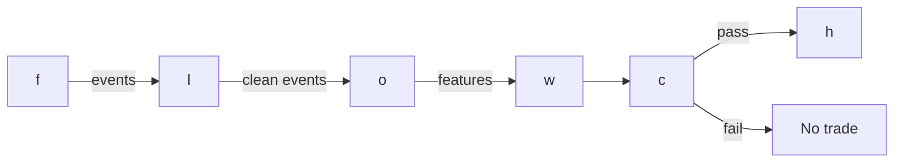

# S083 — Imbalance/tick/volume/dollar bars

Alternative bar clocks — tick, volume, dollar, and imbalance bars — sample by trading activity or one-sided flow instead of wall-clock minutes. Volume/dollar bars have better statistical properties (closer to Gaussian, less heteroskedastic) than minute bars; imbalance bars concentrate information arrival. This is infrastructure, not alpha: bars make downstream statistics cleaner but predict nothing by themselves [documented].

> Tag law: every numeric literal in prose carries one of `[documented]
> [default] [example] [unverified] [internal-est] [measured]` (legend: Appendix
> i v1.0.0). Constants inside cited formulas inherit the formula's tag.
> Bibliographic years, volumes, pages, arXiv IDs, section numbers, rule codes (C1–C10),
> fail-safe codes (F1–F5), module IDs, and machine-parsed §0 data fields are identifiers,
> not literals, and are exempt.

## §1 Five-minute reviewer card

| Row | Value |
|---|---|
| Module | S083 — Imbalance/tick/volume/dollar bars, v1.0.0 |
| Edge verdict | `Build the sampler (an afternoon), buy the tick-trade feed — minute bars cannot reproduce true volume/imbalance bars. Genuine, documented improvement in intraday feature quality and a prerequisite for honest microstructure work; no edge as a standalone signal.` |
| After-cost | `INFRASTRUCTURE` — documented improvement in intraday feature quality (Easley, López de Prado & O'Hara 2012); no Sharpe to report because the sampler predicts nothing. |
| Build cost | Tier L · `4–12` h [internal-est] · `$600–1,800` loaded [internal-est] |
| Data cost | Tier-2 tick feed ~$200/mo + usage [unverified] (indicative — verify before budgeting); the sampler itself costs nothing to run. |
| latency_class | streaming / microseconds-per-trade |
| risk_class | low (signal-only; no order placement) |
| Capacity | n/a — infrastructure; downstream capacity governed by the consuming signal [documented] |
| Executability | Feasible: the sampler is an afternoon's streaming code; the binding constraint is the tick-trade feed, not compute [documented]. |
| Risk summary | Infrastructure risk, not position risk: mis-built bars silently corrupt every downstream model. Dies on minute-bar approximation, threshold mis-setting, and open-bar lookahead [documented]. |
| When it dies | Approximating bars from minute OHLCV (not equivalent to trade-built bars); mis-set imbalance thresholds (noise bars or stale bars); downstream models assuming fixed time spacing; using the incomplete open bar as a feature (lookahead). |
| Regime gates | Provisional: R-volatility elevated → imbalance bars fire faster (information arrival concentrates); R-news/jump → bars complete in seconds, downstream models must handle duration collapse [example]. |
| Emits | `signal_vector` (Appendix b v1.0.0) — never orders |

## §1.5 Cheapest / least-build path

1. **Prototype hour band:** `4–12` h [internal-est] — single streaming pass; Python ~100–500k events/sec, Rust 5–50M events/sec (cost-model §§2,5) — reference implementation + gates + fixture validation.
2. **Cheapest-source row:** min_tier = Databento pay-as-you-go (Tier-2 tick trades) — cheapest honest input [internal-est]; latency_class = exchange timestamps (SIP-delayed acceptable for research only);
   required_fields = tick trades (price, size, ts); trade sign or tick rule; session calendar; price_band = `~$200`/mo + usage [unverified] (indicative — verify before budgeting); build_or_buy = **build the sampler, buy the trades** — the sampler is an afternoon [internal-est]; the feed is the binding constraint.
3. **Resource budget:** `1` core, `<2` GB RAM [internal-est]; compute pattern `per_trade`.
4. **Skip list:** dollar-bar clock in the fixture — phase 2 (same code path as volume bars, price-weighted); run bars (AFML Ch. 2) — phase 2; live imbalance-threshold EWMA auto-tuning — phase 2.
5. **DO-NOT-CUT list:** causality assertions (`assert fill_event > signal_event`, no-signal-bar-fills test); COST block + callable
   `expected_cost_bps`; F1–F5 fail-safes + module-state enum; decision-log audit records; bona-fide-intent + self-trade prevention; provenance tags on
   every numeric literal; fixtures + `test_cmd`; secrets via env only.
6. **Escalation gate:** upgrade from cheapest when any holds — bar rate outside [0.5×, 2×] baseline [default] → re-estimate E_0[T], E_0[θ] or investigate feed gaps; signing agreement < 80% vs exchange flags [example] → fall back to Lee–Ready with quotes.

## §S0 Module contract

### S0.1 Typed signature

```python
def signal(state: ModuleState, events: list[Event], cfg: Config) -> SignalVector:
```

`SignalVector` per Appendix b v1.0.0. `state` is the module-owned named state
vector; `events` are canonical Events (Appendix a v1.0.0), newest last. The
function handles documented edge cases: empty events → `UNKNOWN`; invalid
prices/inputs → `UNKNOWN` (F1, never interpolate); halt/auction events → freeze
per the market-state table.

### S0.2 Config dataclass

| Parameter | Type | Default | Range | Status |
|---|---|---|---|---|
| `tick_n` | int | `5` | `1`–`50000` | example |
| `vol_shares` | int | `3000` | `100`–`10^8` | example |
| `imb_theta` | float | `1500.0` | `>0` | example |

All defaults tagged per the tag law (status `default` ⇒ `[default]`, `example` ⇒ `[example]`, `calibrate` set at fit time).

### S0.3 Canonical schema mapping

Vendor columns → canonical Event schema (Appendix a v1.0.0), stated once here:

| Source field | Canonical |
|---|---|
| bar/event timestamp (exchange) | `event_ts` (int64 ns UTC) |
| ingest timestamp | `asof_ts` (int64 ns UTC) |
| symbol | `symbol` |
| price | `price` (module feature input) |
| size | `size` (module feature input) |
| sign | `sign` (module feature input) |

### S0.4 Time contract

> Time contract: clock domain UTC, int64 ns; authoritative causality clock =
> `event_ts`; max_skew = `1` ms [default]; jitter budget = `500` µs [default];
> bar-label = open time; staleness TTL = `3`× cadence [default] (per F4); gap policy = mask, no interpolation;
> halt/auction → discard contributions across reopen.

**Timing box:** `signal@t (per_trade (streaming), America/New_York) → earliest fill @open(t+1)`

### S0.5 Market-state table

| State | Module behavior |
|---|---|
| CONTINUOUS_TRADING | Compute normally; emit per cadence |
| HALTED | Freeze state; emit `UNKNOWN`; discard contributions across reopen |
| AUCTION | No new signals; hold last `SignalVector`; state `DEGRADED` |
| CLOSED | Emit nothing; state `OFF` |

### S0.6 Module-state enum + error taxonomy

States per Appendix k v1.0.0: `OK | DEGRADED | UNKNOWN | OFF`. Invalid input →
`UNKNOWN`, never interpolate (Appendix f v1.0.0, F1–F5).

| Failure | State | Alert |
|---|---|---|
| Missing/stale input (TTL `3`× cadence [default] (per F4)) | `UNKNOWN` | page |
| Invalid price/input reaching module (NaN, ≤ 0, non-finite) | `UNKNOWN` | log |
| Feature out of mathematical bounds (F2) | `UNKNOWN` | page |
| `seq` gap > `1,000` events [default] | `DEGRADED` (restart windows) | log |
| Jitter > budget persistently | `DEGRADED` | notify |
| Halt/auction | `UNKNOWN` / `DEGRADED` (per table) | log |
| Kill/administrative disable | `OFF` | page |
| Anything unmapped | `UNKNOWN` | page |

### S0.7 Ops tail

- **Schedule:** per module cadence during the venue session [default]; owner: signals on-call.
- **Health checks:** fixture replay (`test_cmd`) green on deploy; live
  `seq`-gap monitor; staleness watchdog at `3`× cadence.
- **Alert table:** page on `UNKNOWN` > `30` s [default] or bounds violation;
  notify on `DEGRADED`; log on single dropped events.
- **Resource budget:** `1` vCPU, `2` GB RAM [internal-est]; state is O(window) per symbol.
- **Runbook stub:** `1.` confirm feed (vendor status); `2.` replay fixture;
  `3.` if red → set `OFF`, page; `4.` reconcile decision log before re-arm.

### S0.8 Secrets (env-only)

`DATABENTO_API_KEY` via environment only. No secrets in this file, fixtures, or
logs (CI secrets-grep).

### S0.9 May / must-NOT

> **May:** emit `SignalVector` records per Appendix b v1.0.0. **Must-NOT:**
> emit orders, order intents, prices, share counts, or notionals; call a
> broker; mutate shared state outside `state`; interpolate across gaps.

## §S1 Legacy (subsumed by §1)

Legacy §S1 content is the §1 reviewer card above; this header is retained so
section numbering stays intact.

## §S2 Specification

### Universe

Any tick-trade universe; fixture: single synthetic symbol, 15 trades [example]

### Entry rule (Boolean — no prose-only conditions)

```
BAR_CLOSE_TICK    := (trade_count >= N) \nBAR_CLOSE_VOL     := (Σshares >= V*) \nBAR_CLOSE_IMB     := (|θ_T| >= E_0[T]·|E_0[θ]|) \nCONSUME_BAR(k)    := bar k closed AND downstream reads only bars < k (open bar never a feature) [documented]
```

### Exits (with post-exit cooldown)

```
No exits — the sampler emits bar structures, not positions. Session-boundary policy: reset θ at the open or carry explicitly (document the choice) [documented].
```

### Position sizing (fenced function)

```python
def size_shares(risk_budget_R, stop_distance, vol_estimate, ADV_cap, cost):
    # S-module requests capital fraction only; share math lives in the strategy.
    # Reference: capital = 0.5 * confidence  (confidence in [0,1])  [default]
    risk_notional = risk_budget_R * 0.5 * confidence          # [default] 0.5 factor
    shares = risk_notional / max(stop_distance, 1e-9)
    return int(min(shares, ADV_cap * adv_shares * 0.001))     # 0.1% ADV cap [default]
```

### Risk limits

| Limit | Value |
|---|---|
| Max capital fraction per signal | `0.5` [default] |
| Max adverse excursion before `UNKNOWN` review | `2.0`× stop [default] |
| Staleness kill | TTL `3`× cadence [default] (per F4) → `UNKNOWN` |

### COST block (single source of truth)

| Component | Value (bps) | Tag | Basis |
|---|---|---|---|
| Spread | `0.00` | the sampler executes no trades [documented] | n/a |
| Fees | `0.00` | no orders emitted [documented] | n/a |
| Market impact | `0.00` | no positions taken [documented] | n/a |
| Slippage/latency | `0.00` | no fills [documented] | n/a |
| **Total reference** | `0.00` [documented] — bar building has no trade-cost components; cost discipline lives downstream (cleaner bars make downstream spread/impact better estimated) | | |

`fee_schedule_as_of`: `2026-09-01` [unverified] — n/a to the sampler; pin the real venue schedule before any downstream trading. `side`: n/a — infrastructure executes no orders [documented]; venue/tier/source: n/a — no orders emitted [documented]. Re-stating cost numbers outside this block is a validation failure.

```python
def expected_cost_bps(notional, adv_pct, venue, side, urgency) -> float:
    # Callable cost model - constant stack (impact flagged [example]).
    spread_bps = 0.0   # [example]
    fee_bps = 0.0      # [example]
    borrow_bps = 0.0    # [default] reason in table
    impact_bps = 0.0    # [example] flagged; calibrate per venue at scale-up
    if side == "maker":
        fee_bps = -0.20  # rebate [example]
    return spread_bps + fee_bps + borrow_bps + impact_bps
```

### Execution / fill model table

| Aspect | Assumption |
|---|---|
| Latency | single streaming pass; Python ~100–500k events/sec [documented]; no GPU |

### Robustness

Only sensitive knob is the imbalance threshold E_0[T]·|E_0[θ]|: mis-set by 2× → bars too fast (noise) or too slow (stale) [documented]. Tick/volume/dollar clocks are parameter-robust by construction (fixed activity).

### Compliance sub-block (C1–C10+)

| Code | Rule: trigger → check → action → log |
|---|---|
| C1 | Self-match prevention: S083 emits no orders; downstream T-modules must set self-trade-prevention flags — S083 asserts the requirement in its `consumes` contract: trigger → check → action → log record |
| C2 | Bona-fide intent: every emitted `SignalVector` with |direction|=`1` must pass the cost gate; sub-threshold scores emit direction `0`, never a tradeable hint: trigger → check → action → log record |
| C3 | Message-rate: `≤100` emissions/symbol/s [default]; breach → throttle to `1`/s [default] + alert: trigger → check → action → log record |
| C4 | Fat-finger trio (applied by consumers; S083 bounds its own outputs): confidence ∈ [`0`,`1`], capital ∈ [`0`,`0.5`], computed_at sane — out-of-bounds → `UNKNOWN` (F2): trigger → check → action → log record |
| C5 | Decision log: every emission, veto, and state transition logged per Appendix g v1.0.0, hash-chained: trigger → check → action → log record |
| C6 | Halt/auction: per §S0.5 market-state table; contributions across reopen discarded: trigger → check → action → log record |
| C7 | Locate check: SHORT direction requires `locate_ok` from the consumer; S083 never emits SHORT without the consumer asserting locate (Reg-SHO threshold securities → direction `0`): trigger → check → action → log record |
| C8 | Public dissemination: no signal values published externally without review gate: trigger → check → action → log record |
| C9 | Data entitlements: per §S6 Data rights row; entitlement-class change → §1.5 escalation gate: trigger → check → action → log record |
| C10 | Post-exit cooldown: `cooldown_s` after any exit or compliance block; no re-entry: trigger → check → action → log record |

### Parameter table

| Parameter | Symbol | Value | Tag | Sensitivity |
|---|---|---|---|---|
| Trades per tick bar | `N` | `5` | [example] | high — fixture scale; production 1k–50k |
| Shares per volume bar | `V*` | `3000` | [example] | high — fixture scale; production 0.1–2% ADV |
| Imbalance close threshold | `|\u03b8|*` | `1500.0` | [example] | high — mis-set: noise bars or stale bars |
| Tick-rule fallback | `b_i` | `carry-forward` | [documented] | medium — zero ticks reuse previous sign |

### Timing box

`signal@t (per_trade (streaming), America/New_York) → earliest fill @open(t+1)`

## §S3 Math + normative pseudocode

Tick bars: close every N trades. Volume bars: close when Σq_i ≥ V*. Dollar bars: close when ΣP_i·q_i ≥ D*. Imbalance bars: θ_T=Σb_i·v_i (or Σb_i, or Σb_i·P_i·v_i), close when |θ_T| ≥ E_0[T]·|E_0[θ]| (expected bar length × expected per-trade imbalance, EWMA-estimated [documented]). Each bar emits OHLCV: O=first P, H=max P, L=min P, C=last P, V=Σq. Bar k is complete only when its close condition fires; features on bar k are tradable no earlier than bar k+1's first trade [documented].

Fixture scope: the chapter's 15-trade synthetic tape (seed 83 [example]) processed under all three clocks in one pass — tick N=5, volume V*=3000 shares, imbalance |θ|≥1500 signed shares [example]. Production-scale defaults (N 1k–50k, V* 0.1–2% ADV, D* $1M–$50M) are documented in §S3; the fixture uses toy thresholds so all three close rules fire inside 15 trades. Tick-rule sign: uptick +1, downtick −1, zero-tick reuses the previous sign [documented].

**Normative pseudocode** (pseudocode is normative; prose is commentary):

```
theta, n, bars = 0, 0, []          # per clock
for tr in trade_stream(symbol, date):  # strictly increasing ts
    theta += tr.sign * tr.size         # imbalance; n += 1 for tick bars
    track_ohlc(tr)                     # running O/H/L/C
    if abs(theta) >= THETA_STAR:       # shares/dollars for vol/$ bars
        bars.append(close_bar(theta))  # bar k complete; tradable at k+1
        theta, n = 0, 0; reset_ohlc()
# open bar at session end is incomplete — carry forward, never backfill
```

Causality: the computation at `t` uses only data `≤ t`; earliest reaction is
`t+1`. Mandatory unit test: no-signal-bar fills.

## §S4 Worked example (fixture-backed)

- Tick bars are metronomic (5 trades each) but informationally uneven — TB2 spans the 0.88 selloff, TB3 the 0.59 snapback [example].
- Volume bars vary in trade count (3–5) while fixing shares per bar [example].
- Imbalance bars show the mechanism's range: IB1 absorbs 10 trades before the downtrend pushes θ to −1600; IB2 closes after 2 trades on the snapback (θ=+1500) [example].
- The tape ends mid-bar (T13–T15, θ=+1100): carry forward or discard — never backfill [documented].

The documented win is econometric (cleaner features), not economic (no P&L). Over-claiming 'bars as alpha' is the standard failure; the chapter's honest bottom line is infrastructure-only [documented].

## §S5 Strategies that use this signal

Generated from `deps.yaml` (CI symmetry); hand-listed here for this module:

| Strategy | Role |
|---|---|
| T081 — Adaptive Bar-Clock Sampler | primary infrastructure: selects the bar clock by regime for downstream signals (with S090, S067) |
| T044 — Diurnal Deseasonalization | bar clocks remove much of the U-shaped intraday seasonality before thresholding (with S067, S046) |
| T008 — Kalman Dynamic-Hedge Pairs | entry timer: imbalance bars time the legs (with S052, S048) |

## §S6 Data required

| Field | Type | Granularity | Source tier | Notes |
|---|---|---|---|---|
| Tick trades (price, size, ts) | event | tick | Tier 2 | Databento MBP-1/trades; minute OHLCV cannot reproduce true bars [documented] |
| Trade direction/sign | int ±1 | tick | Tier 2 | tick rule when no flag; Lee–Ready needs quotes (S007) |
| Session calendar | date/bool | daily | Tier 1 | overnight gap: reset or carry θ [documented] |

**Data rights row** (Appendix j v1.0.0): Bar-building code: own IP. Tick-trade feed: vendor-licensed (redistribution restricted — check Databento terms) [documented].

## §S7 Local build (M5 Max / 128 GB)

Feasibility: feasible (Tier L). Bar building is a single streaming pass: Python handles ~100–500k events/sec [documented] — fine for ≤20 symbols of L1; Rust does 5–50M events/sec for full-universe rebuilds. A 60-day, 500-symbol rebuild from per-symbol parquet is I/O-bound at ~1–3 GB/sec [documented]: minutes. RAM: stream per-symbol files; never hold the panel. Stack: Python for research, Rust for a live-loop sampler. Engineering: Tier L, 4–12 h ≈ $600–1,800 loaded [documented]. What breaks first at 500 symbols: tick-trade storage and licensing, not compute — 500 names of tick history is terabytes/year [documented].

## §S8 Buy vs build

Build the sampler (an afternoon); buy the tick-trade feed — minute bars cannot reproduce true volume/imbalance bars. Precomputed-bars vendors are black-box thresholds and poor value [documented].

## §S9 Efficacy — documented evidence

| Study / source | Market & period | Metric | Before/after cost | Caveat |
|---|---|---|---|---|
| Easley, López de Prado & O'Hara (2012), J. Portfolio Management 39(1) | Theory + futures/ETF examples | volume-clock returns closer to Gaussian, less heteroskedastic than clock-time returns [documented] | `n/a (statistical property, not a trade)` | econometric benefit, not a trade |
| VPIN / flash-crash reporting (2010) | E-mini S&P, May 6 2010 | VPIN (volume-clock toxicity metric) hit historic levels an hour+ before the flash crash [documented] | `n/a` | press account, not a backtest |
| mlfinlab practitioner docs | n/a | θ_t=Σb_t·v_t reference imbalance-bar implementation; bars used throughout AFML [documented] | `n/a` | practitioner adoption, not efficacy |
| No Sharpe exists for bar construction | n/a | absence of a return claim [documented-as-absence] | `n/a` | any P&L claim for 'bars' alone is a category error |

Selection disclosure: these are the sources surfaced by the chapter's research
pass. Fails in: the regimes named in §S10; crowded/overfit calibrations.

## §S10 Failure modes & pitfalls

| # | Trigger → Detect → Action → Recovery | check: |
|---|---|
| 1 | Minute-bar approximation → resampling 1-min OHLCV into 'volume bars' is not the same object [documented] → true bars require trades → minute bars silently mis-stated as volume bars | `check: input granularity == tick` |
| 2 | Threshold mis-setting → too-small thresholds → noise bars; too large → stale bars [documented] → EWMA-estimated expected imbalance; monitor bar rates → bar rate drifts 2×+ from baseline [example] | `check: bar rate within [0.5×, 2×] baseline` |
| 3 | Open-bar lookahead → using the incomplete current bar's OHLC as a feature [documented] → only closed bars enter features; carry the open bar explicitly → backtest uses bar k while bar k still open | `check: feature bar id < current open bar id` |
| 4 | Session-boundary θ → carrying imbalance overnight mixes regimes [documented] → reset θ at the open; document the choice → overnight θ carried silently | `check: θ reset logged at session open` |
| 5 | Tick-rule error → mis-signed trades corrupt θ [documented] → prefer exchange flags; Lee–Ready fallback with quotes (S007) → sign agreement < 80% vs flags [example] | `check: signing agreement rate reported` |
| 6 | Storage blowup → archiving full tick history 'just in case' [documented] → build bars once, archive bars + a trade sample → terabytes retained with no consumer | `check: retention policy per symbol-day` |
| 7 | Overfitting the clock → tuning N/V*/D* on the backtest [documented] → round thresholds a priori; the clock is plumbing, not a parameter to mine → threshold chosen by backtest Sharpe | `check: thresholds fixed before backtest` |
| 8 | Downstream fixed-spacing assumption → models assuming bars are equally spaced in time [documented] → pass bar durations; use event-time models → time-series model on bar index as clock | `check: model consumes bar timestamps` |

## §S11 Visuals

`../../images/S083_example.png` — synthetic worked-example chart (seed `83` [example]).



## §S12 Source log + unverified leads

**Sources** (citable facts only):

1. Easley, D., López de Prado, M. M., & O'Hara, M. (2012). 'The Volume Clock: Insights into the High-Frequency Paradigm.' J. Portfolio Management, 39(1), 19–29. https://jpm.pm-research.com/content/39/1/19.abstract
2. López de Prado, M. M. (2018). Advances in Financial Machine Learning. Wiley. Ch. 2 (tick/volume/dollar/imbalance bars).
3. mlfinlab documentation, 'Data Structures' (imbalance-bar algorithm). https://github.com/quantopian/mlfinlab/blob/HEAD/docs/source/implementations/data_structures.rst

**Chatbot source log.** Duck.ai (GPT-5.6 Luna, `2026-09-10`) answered Q-SB2-1–Q-SB2-3 [chapter QA] (historical batch label SB2; module batch is ID-driven SB9) [measured]. Grok/Cursor answers pending (checked `2026-09-10`).

**Unverified leads** (chatbot-only — never in evidence tables):

- Q-SB2-2 pipeline leads: TRUE tick/volume/dollar/imbalance bars need trades — minute OHLCV cannot reproduce them exactly; close when |Σθ_i| > E_0[|θ|]·n or dynamic threshold; 500 × 390 × 60d = 11.7M rows, 15–60 s daily Polars refresh [unverified].
- 'Practitioner replication (vpin)' lead — volume-time returns closer to normal than chronological-time on crypto (BTC perps) — moved to unverified: no checkable citation found [unverified].

---

## Appendix — AI build prompt (S083)

Copy-paste into any chat agent:

> Build module **S083 — Imbalance/tick/volume/dollar bars** per `notes/module-template.md` v1.0.0 and this file's §S0 contract.
> Cheapest path (§1.5): prototype `4–12` h [internal-est] — single streaming pass; Python ~100–500k events/sec, Rust 5–50M events/sec (cost-model §§2,5); compute pattern `per_trade`.
> Implement `signal(state, events, cfg) -> SignalVector` (Appendix b v1.0.0)
> with the §S3 normative pseudocode, including the cost-gate predicate
> `expected_cost_bps(...) <= k * edge_bps` and `assert fill_event >
> signal_event`. Wire F1–F5 (Appendix f v1.0.0): invalid input → `UNKNOWN`,
> never interpolate. Log decisions per Appendix g v1.0.0. Secrets via env
> only. Run the fixture `modules/fixtures/S083_tape.csv`
> (`# TYPE: validation-run`) against `modules/fixtures/S083_expected.csv`
> (tolerance `1e-9` [default]).
> **Definition of done:** `python3 -m pytest modules/tests/test_S083.py -q`
> exits `0`. Tag every numeric literal you add with the unified enum
> (Appendix i v1.0.0); put anything unverifiable in §S12 unverified leads.
