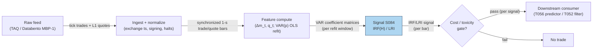

# S084 — Hasbrouck (1991) trade–quote VAR

A vector autoregression on the joint dynamics of quote revisions and signed trades. The impulse response of quotes to a trade innovation measures that trade's permanent price impact — its information content. This is a measurement device first, trading signal second: the literature documents the existence and shape of trade informativeness, not a tradable net-of-cost Sharpe [documented].

> Tag law: every numeric literal in prose carries one of `[documented]
> [default] [example] [unverified] [internal-est] [measured]` (legend: Appendix
> i v1.0.0). Constants inside cited formulas inherit the formula's tag.
> Bibliographic years, volumes, pages, arXiv IDs, section numbers, rule codes (C1–C10),
> fail-safe codes (F1–F5), module IDs, and machine-parsed §0 data fields are identifiers,
> not literals, and are exempt.

## §1 Five-minute reviewer card

| Row | Value |
|---|---|
| Module | S084 — Hasbrouck (1991) trade–quote VAR, v1.1.0 |
| Edge verdict | `Build the estimator, buy the tape. Genuinely useful as a filter/validator (only trade innovations the VAR deems information-bearing) and as a transaction-cost-model input; as a standalone trigger it is a measurement edge, not a documented alpha.` |
| After-cost | `BEFORE-COST` — documents the existence and shape of trade informativeness (permanent impact positive and concave in size; protracted lag); no documented net-of-cost standalone alpha. |
| Build cost | Tier M · `20–60` h [internal-est] · `$3,000–9,000` loaded [internal-est] |
| Data cost | Production: Databento Standard `$199`/mo [documented] (unlimited live L1 incl. MBP-1; `12`-mo L1 history included; as-of `2026-09-10`, databento.com pricing-plan post Jan 2025); Polygon Stocks Advanced `$199`/mo [documented] (tick trades + quotes, real-time); cheapest usable: Alpaca Basic `$0`/mo [documented] (IEX real-time, SIP 15-min delayed — minutes-horizon use only; Algo Trader Plus `$99`/mo [documented] upgrades to full SIP real-time). |
| latency_class | intraday / seconds |
| risk_class | low (signal-only; no order placement) |
| Capacity | `$5–20`M/day notional [example] — measurement only; downstream capacity governs |
| Executability | Feasible: numpy OLS refit is microseconds; polars 1-s bar pipeline ~1–10M rows/sec [documented]. Tick-level per-event refit needs Rust [documented]. |
| Risk summary | Measurement risk, not position risk: a mis-specified VAR mislabels noise as information. Dies on signing error, lookahead joins, lag misspecification, and cost blindness [documented]. |
| When it dies | Thin, gappy, or mis-synchronized tapes; regime breaks (vol spikes, news jumps); long-memory order flow where a short-lag VAR is misspecified; venues where trades cannot be signed accurately; spread wider than the measured impact (3.33¢ means nothing against a 5¢ spread) [documented]. |
| Regime gates | Machine records in §S2 (regime_id · direction · mechanism · condition · action · min_lag · unknown_behavior). Restrictive default: on unknown regime → halve confidence and widen staleness TTL [default]. |
| Emits | `signal_vector` (Appendix b v1.0.0) — never orders |

## §1.5 Cheapest / least-build path

1. **Prototype hour band:** `20–60` h [internal-est] — ingest + signing + rolling VAR + IRF/LRI + monitoring — reference implementation + gates + fixture validation.
2. **Cheapest-source row (structured):**
   - `min_tier`: Alpaca Basic — `$0`/mo [documented] (IEX real-time; SIP 15-min delayed; usable for minutes-horizon validation only)
   - `latency_class`: SIP-delayed / exchange-ts offline (cheapest path is not low-latency)
   - `required_fields`: SIP trades+quotes 1-s bars (trade ts, price, size; bid, ask, sizes; quote rule signing)
   - `price_band`: `$0–99`/mo research [documented] (Alpaca Basic `$0`; Algo Trader Plus `$99`/mo for full SIP real-time; as-of `2026-09-10`); production tick tape Databento Standard `$199`/mo [documented]
   - `build_or_buy`: **build the estimator, buy the tape** — VAR/IRF math is ~50 lines [internal-est]; the synchronized tape is the binding constraint.
3. **Resource budget:** `1` core, `<2` GB RAM [internal-est]; compute pattern `per_bar`.
4. **Skip list:** duration-augmented VAR (Dufour & Engle 2000) — phase 2; asymmetric VEC (Escribano & Pascual 2006) — phase 2; multi-variable VAR adding spread/depth — phase 2.
5. **DO-NOT-CUT list:** causality assertions (`assert fill_event > signal_event`, no-signal-bar-fills test); COST block + callable
   `expected_cost_bps`; F1–F5 fail-safes + module-state enum; decision-log audit records; bona-fide-intent + self-trade prevention; provenance tags on
   every numeric literal; fixtures + `test_cmd`; secrets via env only.
6. **Escalation gate:** upgrade from cheapest when any holds — LRI estimate outside [0.3×, 3×] trailing median [default] → regime break: suspend, refit on clean window; signing agreement < 80% [example] → tick-test fallback; widen the cost stack.

## §S0 Module contract

### S0.1 Typed signature

```python
def signal(state: ModuleState, events: list[Event], cfg: Config) -> SignalVector:
```

`SignalVector` per Appendix b v1.0.0. `state` is the module-owned named state
vector; `events` are canonical Events (Appendix a v1.0.0), newest last. The
function handles documented edge cases: empty events → `UNKNOWN`; invalid
prices/inputs → `UNKNOWN` (F1, never interpolate); halt/auction events → freeze
per the market-state table.

### S0.2 Config dataclass

| Parameter | Type | Default | Range | Status |
|---|---|---|---|---|
| `A` | matrix (2×2, VAR(1)) | `[[0.1046,0.0120],[0.1479,0.5958]]` | estimated per refit | documented |
| `p` | int | `10` | `5`–`30` | calibrate |
| `H` | int | `100` | `50`–`500` | calibrate |
| `conf_scale` | float | `5.0` (cents) | `>0` | calibrate |
| `k` | float | `0.5` | `0.25`–`1.0` | calibrate |
| `fee_bps` | float | `0.3` | `0`–`1` | default |
| `cadence_s` | float | `1.0` | fixed | fixed |
| `cooldown_s` | float | `60` | `0`–`3600` | calibrate |

All defaults tagged per the tag law (status `default` ⇒ `[default]`, `example` ⇒ `[example]`, `calibrate` set at fit time via the recipe below).

### S0.2a Calibration recipes (walk-forward OOS, embargo)

Applies to every `calibrate` parameter. Shared fold design: rolling refit on the
last `20` trading days [example], refit cadence daily at the close [example],
`6` OOS folds [example] of `20` days each [example], embargo `1` trading day
[default] between train and OOS windows (no shared events across the cut).
Freeze rule: the selected value is frozen per symbol-quarter [example]; a new
fit requires the full walk-forward to re-pass before deploy.

| Parameter | Grid [example] | Selection metric (OOS) | Freeze rule |
|---|---|---|---|
| `p` | `{5, 10, 15, 20, 30}` | minimize AIC/BIC on train; accept only if OOS Ljung–Box on VAR residuals p > `0.05` [default] and OOS LRI coefficient of variation < `0.25` [example] | per symbol-quarter |
| `H` | `{50, 100, 200, 500}` | smallest H with `|IRF(H) − IRF(H/2)| / |IRF(H)| < 0.05` [example] (convergence), then OOS LRI sign-stability across folds | per symbol-quarter |
| `conf_scale` | `{2.5, 5, 10}` (cents) | maximize OOS rank correlation between confidence and realized next-H-bar permanent impact direction [internal-est] | per symbol-quarter |
| `k` | `{0.25, 0.5, 1.0}` | gate pass-rate on OOS innovations: target `5–20`% of bars passing [example] (measurement filter, not a trade rate) with no fold < `2`% [example] | per symbol-quarter |
| `cooldown_s` | `{0, 30, 60, 300}` | minimize repeated compliance-block rate on OOS tape replays [internal-est] | per symbol-quarter |

`fee_bps` is `default`, not fittable: pinned from the venue fee schedule at
`fee_schedule_as_of` (basis: Nasdaq remove `$0.0030`/share [documented] =
`0.3` bps on a `$100` stock [example]). `A` is estimated by OLS on data ≤ t
each refit — never tuned by OOS P&L.

### S0.3 Canonical schema mapping

Vendor columns → canonical Event schema (Appendix a v1.0.0), stated once here:

| Source field | Canonical |
|---|---|
| bar/event timestamp (exchange) | `event_ts` (int64 ns UTC) |
| ingest timestamp | `asof_ts` (int64 ns UTC) |
| symbol | `symbol` |
| market state (feed) | `market_state` ∈ {CONTINUOUS_TRADING, HALTED, AUCTION, CLOSED} (default CONTINUOUS_TRADING [default]) |
| feed sequence number | `seq` (int64, optional) |
| bid | `bid` (module feature input) |
| ask | `ask` (module feature input) |
| mid | `mid` (module feature input) |
| dm | `dm` (module feature input) |
| q | `q` (module feature input) |
| locate assertion (consumer) | `locate_ok` (bool, default `True` [default]) |

### S0.4 Time contract

> Time contract: clock domain UTC, int64 ns; authoritative causality clock =
> `event_ts`; max_skew = `1` ms [default]; jitter budget = `500` µs [default];
> bar-label = open time; staleness TTL = `3`× cadence [default] (per F4); gap policy = mask, no interpolation;
> halt/auction → discard contributions across reopen.

**Timing box:** `signal@t (per_bar (1-s), America/New_York) → earliest fill @open(t+1)`

### S0.5 Market-state table

| State | Module behavior |
|---|---|
| CONTINUOUS_TRADING | Compute normally; emit per cadence |
| HALTED | Freeze state; emit `UNKNOWN`; discard contributions across reopen |
| AUCTION | No new signals; hold last `SignalVector`; state `DEGRADED` |
| CLOSED | Emit nothing; state `OFF` |

### S0.6 Module-state enum + error taxonomy

States per Appendix k v1.0.0: `OK | DEGRADED | UNKNOWN | OFF`. Invalid input →
`UNKNOWN`, never interpolate (Appendix f v1.0.0, F1–F5).

| Failure | State | Alert |
|---|---|---|
| Missing/stale input (TTL `3`× cadence [default] (per F4)) | `UNKNOWN` | page |
| Invalid price/input reaching module (NaN, ≤ 0, non-finite) | `UNKNOWN` | log |
| Feature out of mathematical bounds (F2) | `UNKNOWN` | page |
| `seq` gap > `1,000` events [default] | `DEGRADED` (restart windows) | log |
| Jitter > budget persistently | `DEGRADED` | notify |
| Halt/auction | `UNKNOWN` / `DEGRADED` (per table) | log |
| Cost gate fails (C2 veto) | `OK` with direction `0` — measurement, not an error | log |
| Inside C10 cooldown window | `DEGRADED`, flat emission | log |
| Kill/administrative disable | `OFF` | page |
| Anything unmapped | `UNKNOWN` | page |

### S0.7 Ops tail

- **Schedule:** per module cadence during the venue session [default]; owner: signals on-call.
- **Health checks:** fixture replay (`test_cmd`) green on deploy; live
  `seq`-gap monitor; staleness watchdog at `3`× cadence.
- **Alert table:** page on `UNKNOWN` > `30` s [default] or bounds violation;
  notify on `DEGRADED`; log on single dropped events.
- **Resource budget:** `1` vCPU, `2` GB RAM [internal-est]; state is O(window) per symbol.
- **Runbook stub:** `1.` confirm feed (vendor status); `2.` replay fixture;
  `3.` if red → set `OFF`, page; `4.` reconcile decision log before re-arm.

### S0.8 Secrets (env-only)

`DATABENTO_API_KEY` via environment only. No secrets in this file, fixtures, or
logs (CI secrets-grep).

### S0.9 May / must-NOT

> **May:** emit `SignalVector` records per Appendix b v1.0.0. **Must-NOT:**
> emit orders, order intents, prices, share counts, or notionals; call a
> broker; mutate shared state outside `state`; interpolate across gaps.

## §S1 Legacy (subsumed by §1)

Legacy §S1 content is the §1 reviewer card above; this header is retained so
section numbering stays intact.

## §S2 Specification

### Universe

Liquid single-name US equities with clean synchronized trade/quote data [documented]

### Entry rule (Boolean — no prose-only conditions)

```
MEASURE     := refit VAR(p) on data ≤ t (AIC/BIC lag selection per symbol) [documented]
INNOVATION  := u_{q,t} = q_t - E[q_t | x_{t-1..t-p}]
EDGE        := edge_bps = |LRI·u_{q,t}| / mid_t × 100            [example] units
GATE_PASS   := expected_cost_bps(notional, adv_pct, venue, side, urgency) ≤ k·edge_bps   [default] k
DIRECTION   := GATE_PASS ? sign(u_{q,t}) : 0                     (C2: sub-threshold → direction 0)
CONFIDENCE  := DIRECTION = 0 ? 0 : min(1, |LRI·u_{q,t}| / conf_scale)  [example]
```

### Exits (with post-exit cooldown)

```
EXIT := innovation absorbed — the VAR is a per-bar measurement, not a position; downstream (T056) exits on IRF convergence or cost-gate failure [documented].
```

### Position sizing (fenced function)

```python
def size_shares(risk_budget_R, stop_distance, vol_estimate, ADV_cap, cost,
                confidence, adv_shares):
    # S-module requests capital fraction only; share math lives in the strategy.
    # All inputs bound by the caller; cost is informational here (gate already bound direction).
    risk_notional = risk_budget_R * 0.5 * confidence          # [default] 0.5 factor
    shares = risk_notional / max(stop_distance, 1e-9)
    return int(min(shares, ADV_cap * adv_shares * 0.001))     # 0.1% ADV cap [default]
```

### Risk limits

| Limit | Value |
|---|---|
| Max capital fraction per signal | `0.5` [default] |
| Max adverse excursion before `UNKNOWN` review | `2.0`× stop [default] |
| Staleness kill | TTL `3`× cadence [default] (per F4) → `UNKNOWN` |

### COST block (single source of truth)

| Component | Value (bps, per side) | Tag | Basis |
|---|---|---|---|
| Spread (effective) | `1.0` | [example] | 1¢ on $100; XNAS taker |
| Fees | `0.3` taker / `-0.2` maker / `0.05` mixed | [example] | taker basis: Nasdaq remove `$0.0030`/share all MPIDs ≥ $1.00 [documented] = `0.3` bps on $100; maker rebate tier-dependent |
| Borrow (`borrow_bps_per_day`) | `0.0` | [default] | reason: S084 holds no positions — it is a measurement. Any stock-loan cost accrues in the executing T-module's cost ledger, not in this signal's gate. |
| Market impact / adverse-selection slippage | `0.2` | [example] | slippage on the evaluation trade; the measured impact (LRI) is the edge, NOT a cost |
| **Total reference** | `1.5` bps taker (`1.0` maker, `1.25` mixed) on $1M notional [example] — the 3.33¢ LRI must clear this stack via the gate before any trading claim (S10 §7) | | |

`fee_schedule_as_of`: `2026-09-10` [unverified] — Nasdaq Trader price list basis verified this date (remove `$0.0030`/share [documented]); tier/MPID schedules vary — pin the production schedule before live use. `side`: taker [default] | maker | mixed; venue/tier/source: XNAS / TAQ L1 [example]. Re-stating cost numbers outside this block is a validation failure.

```python
def expected_cost_bps(notional, adv_pct, venue, side, urgency) -> float:
    # Callable cost model — mirrors this block exactly (L2 constant stack).
    spread_bps = 1.0    # [example] effective spread
    if side == "taker":
        fee_bps = 0.3   # [example] basis: Nasdaq remove $0.0030/share [documented]
    elif side == "maker":
        fee_bps = -0.2  # [example] add rebate, tier-dependent
    elif side == "mixed":
        fee_bps = 0.05  # [example] blend
    else:
        raise ValueError("side must be taker|maker|mixed")  # caller maps to UNKNOWN
    borrow_bps = 0.0    # [default] borrow_bps_per_day = 0: signal holds no positions
    impact_bps = 0.2    # [example] adverse-selection slippage; LRI is the edge, not a cost
    # adv_pct / venue / urgency: interface-complete; wired to the impact term
    # at scale-up (currently constant, flagged [example]).
    return spread_bps + fee_bps + borrow_bps + impact_bps
```

### Execution / fill model table

| Aspect | Assumption |
|---|---|
| Latency | signal→intent within the 1-s bar cadence [example]; tick-level refit is Rust-only |
| Participation | measurement only — no orders; downstream participation governed by T056 |

### Robustness

Medium sensitivity: lags p=5–30 [documented range]; AIC/BIC per symbol absorbs most misspecification. LRI is stable under small p changes; fragile under quote-sync errors (a data bug, not a parameter) [documented].

### Compliance sub-block (C1–C10+)

| Code | Rule: trigger → check → action → log |
|---|---|
| C1 | Self-match prevention: S084 emits no orders; downstream T-modules must set self-trade-prevention flags — S084 asserts the requirement in its `consumes` contract: trigger → check → action → log record |
| C2 | Bona-fide intent: every emitted `SignalVector` with |direction|=`1` must pass the cost gate; sub-threshold scores emit direction `0`, never a tradeable hint: trigger → check → action → log record |
| C3 | Message-rate: `≤100` emissions/symbol/s [default]; breach → throttle to `1`/s [default] + alert: trigger → check → action → log record |
| C4 | Fat-finger trio (applied by consumers; S084 bounds its own outputs): confidence ∈ [`0`,`1`], capital ∈ [`0`,`0.5`], computed_at sane — out-of-bounds → `UNKNOWN` (F2): trigger → check → action → log record |
| C5 | Decision log: every emission, veto, and state transition logged per Appendix g v1.0.0, hash-chained: trigger → check → action → log record |
| C6 | Halt/auction: per §S0.5 market-state table; contributions across reopen discarded: trigger → check → action → log record |
| C7 | Locate check: SHORT direction requires `locate_ok` from the consumer; S084 never emits SHORT without the consumer asserting locate (Reg-SHO threshold securities → direction `0`): trigger → check → action → log record |
| C8 | Public dissemination: no signal values published externally without review gate: trigger → check → action → log record |
| C9 | Data entitlements: per §S6 Data rights row; entitlement-class change → §1.5 escalation gate: trigger → check → action → log record |
| C10 | Post-exit cooldown: `cooldown_s` after any exit or compliance block; no re-entry: trigger → check → action → log record |

### Parameter table

| Parameter | Symbol | Value | Tag | Sensitivity |
|---|---|---|---|---|
| Lags | `p` | `10` | [example] default, calibrate | medium — too few: IRF biased; too many: noisy LRI |
| Sampling | `Δt` | `1-s bars` | [example] | medium — too fine: noise; too coarse: impact absorbed |
| IRF horizon | `H` | `100` | [example] default, calibrate | low — too short: not converged; too long: estimation noise |
| Size transform | `q_t` | `signed shares` | [example] | medium — raw shares dominated by prints; sign-only discards concavity |
| VAR coefficients | `A` | `chapter Â_1` | [documented] | high — fixture carries the estimated matrix; production refits |
| Gate multiplier | `k` | `0.5` | [default], calibrate | high — `0.25`: too strict (no passes); `1.0`: sub-cost passes |
| Cooldown | `cooldown_s` | `60` s | [default], calibrate | low — too short: block churn; too long: missed innovations |
| Cadence | `cadence_s` | `1.0` s | [fixed] | n/a — per_bar compute pattern |
| Borrow | `borrow_bps_per_day` | `0.0` | [default] | none — signal holds no positions (reason in COST block) |
| Fee schedule | `fee_schedule_as_of` | `2026-09-10` | [unverified] | medium — pin production schedule before live use |

### Timing box

`signal@t (per_bar (1-s), America/New_York) → earliest fill @open(t+1)`

### Machine regime-gate records

Provisional (R-chapters pending); restrictive default: unknown regime →
halve confidence, keep measuring.

```yaml
regime_gates:
  - regime_id: R-VOL-ELEVATED        # provisional
    direction: degrades
    mechanism: "VAR coefficients unstable intraday; LRI variance blows up"
    condition: "rolling_5d realized vol > 2x trailing 60d median [default]"
    action: widen_stops              # widen LRI confidence bands, keep gate
    min_lag: 300                     # seconds [default]
    unknown_behavior: halve
  - regime_id: R-NEWS-JUMP           # provisional
    direction: inverts
    mechanism: "quote revisions are jump-driven, not trade-driven"
    condition: "jump flag from news/jump detector OR |dm| > 10x median [example]"
    action: veto                     # suspend emissions
    min_lag: 900                     # seconds [default]
    unknown_behavior: veto
  - regime_id: R-CROWDED-FLOW        # provisional
    direction: degrades
    mechanism: "many participants trade the same innovation proxy; impact pre-empted"
    condition: "crowding_proxy in top decile [example]"
    action: halve                    # halve confidence
    min_lag: 60                      # seconds [default]
    unknown_behavior: halve
```

## §S3 Math + normative pseudocode

x_t=(Δm_t,q_t)⊤, VAR(p): x_t=c+ΣA_ℓx_{t-ℓ}+u_t. IRF(H)=Σ_{h=0}^H Ψ_h e_q, Ψ_0=I, Ψ_h=ΣA_ℓΨ_{h-ℓ}. LRI=e_m⊤(I-ΣA_ℓ)^{-1}e_q (closed form). A trade of size q has permanent impact ≈ LRI×q [documented]. Trade innovation u_{q,t}=q_t-E[q_t|history] is the only information-bearing component — expected, autocorrelated flow is already in the price [documented].

Fixture: the chapter's 6-event synthetic tape (seed 84 [example]) with the chapter's OLS-estimated Â_1=[[0.1046,0.0120],[0.1479,0.5958]] [documented] carried as config (6 rows cannot identify a VAR). Hand-checks: IRF(1)=Â_1[0,1]=0.0120 $=1.20¢ [documented]; LRI=e_m⊤(I-Â_1)^{-1}e_q=0.0120/0.36014588=0.03332 $=3.33¢ [documented]. Row 0 is warmup (no history → DEGRADED, flat) [example].

**Normative pseudocode** (pseudocode is normative; prose is commentary):

```python
# S084.signal(state, events, cfg) -> SignalVector   (normative, §S0.1)
# Bound: state = {A, prev_dm, prev_q, last_seq, cooldown_until}
#        events = newest-last canonical Events (§S0.3); cfg = §S0.2 (+S0.2a)
# Units: event_ts/asof_ts int64 ns UTC; prices in dollars; q in {+1,-1}.

def signal(state, events, cfg, t_now):
    e      = events[-1]                       # newest event
    t_sig  = e.event_ts                        # signal event timestamp
    # ---- G1: market-state guards (§S0.5) ----
    if e.market_state in ("HALTED", "CLOSED"):
        state.prev_dm = state.prev_q = None   # freeze; discard across reopen
        return emit(t_sig, direction=0, module_state="UNKNOWN")
    if e.market_state == "AUCTION":
        return emit(t_sig, direction=0, module_state="DEGRADED")  # hold, no new
    # ---- G2: staleness (F4, §S0.4) ----
    if t_now - t_sig > 3 * cfg.cadence_s * 1e9:
        return emit(t_sig, direction=0, module_state="UNKNOWN")
    # ---- G3: input validity (F1/F2) -> UNKNOWN, never interpolate ----
    if (t_sig is None or not all_finite_positive(e.bid, e.ask, e.mid)
            or e.bid >= e.ask                  # crossed book
            or not finite(e.dm) or e.q not in (+1, -1)):
        state.cooldown_until = t_sig + cfg.cooldown_s * 1e9   # C10
        return emit(t_sig, direction=0, module_state="UNKNOWN")
    # ---- G4: post-compliance-block cooldown (C10) ----
    if state.cooldown_until is not None and t_sig < state.cooldown_until:
        return emit(t_sig, direction=0, module_state="DEGRADED")
    # ---- G5: seq gap -> restart estimation windows ----
    if e.seq is not None and state.last_seq is not None \
            and e.seq - state.last_seq > 1000:                  # [default]
        state.prev_dm = state.prev_q = None
        return emit(t_sig, direction=0, module_state="DEGRADED")
    state.last_seq = e.seq
    # ---- warmup: no history -> no innovation ----
    if state.prev_dm is None:
        state.prev_dm, state.prev_q = e.dm, e.q
        return emit(t_sig, direction=0, module_state="DEGRADED")
    # ---- core: trade innovation vs carried VAR ----
    A   = state.A                                            # refit on data <= t only
    LRI = e_m.T @ inv(I - sum(A_l)) @ e_q                     # cents, closed form
    u_q = e.q - A[1, :] @ x_hist(state, order=1)              # q_t - E[q_t|history]
    edge_bps = abs(LRI * u_q) / e.mid * 100.0                # cents -> bps
    cost_bps = expected_cost_bps(cfg.notional, cfg.adv_pct,
                                 cfg.venue, cfg.side, cfg.urgency)  # §S2 block
    gate_pass = cost_bps <= cfg.k * edge_bps                  # executable predicate
    # ---- G6: direction binds on the gate (C2); locate binds on SHORT (C7) ----
    if not gate_pass:
        direction, mstate = 0, "OK"                           # veto: measurement only
    elif u_q > 0:
        direction, mstate = +1, "OK"
    elif u_q < 0 and not e.locate_ok:
        direction, mstate = 0, "DEGRADED"                     # Reg-SHO: no SHORT
    elif u_q < 0:
        direction, mstate = -1, "OK"
    else:
        direction, mstate = 0, "OK"
    confidence = 0.0 if direction == 0 \
        else min(1.0, abs(LRI * u_q) / cfg.conf_scale)        # capped at 1.0
    capital    = 0.5 * confidence                             # [default], in [0, 0.5]
    state.prev_dm, state.prev_q = e.dm, e.q                  # advance history
    fill_event_ts = t_sig + int(cfg.cadence_s * 1e9)          # earliest fill @open(t+1)
    assert fill_event_ts > t_sig                              # causality, machine-checked
    return SignalVector(symbol=e.symbol, direction=direction,
                        confidence=confidence, capital=capital,
                        computed_at=t_sig, module_state=mstate,
                        edge_bps=edge_bps, cost_bps=cost_bps,
                        gate_pass=gate_pass, fill_event_ts=fill_event_ts)
```

Causality: the computation at `t` uses only data `≤ t`; earliest reaction is
`t+1`. Mandatory unit test: no-signal-bar fills (`assert fill_event >
signal_event`, pinned in `test_no_signal_bar_fills`).

## §S4 Worked example (fixture-backed)

- Estimating VAR(1) by OLS on 5,000 synthetic events recovers Â_1=[[0.1046,0.0120],[0.1479,0.5958]], close to the true DGP [[0.10,0.012],[0.05,0.60]] [documented].
- Hand-check: IRF(1)=Â_1[0,1]=0.0120 dollars=1.20 cents per unexpected buy [documented].
- Cumulating: IRF(2)=2.04¢, IRF(3)=2.55¢, IRF(5)=3.05¢, IRF(10)=3.31¢, converging to LRI=3.33¢ by about event 20 [documented].
- The IRF starts at 0 and builds — Hasbrouck's 'protracted lag' finding, visible in the toy [documented]. Limits: no fees, no spread cost; the DGP is a clean VAR(1) — real flow has long memory [documented].
- **Gate binding (v1.1.0):** rows 2–5 carry innovations of ~0.40 with edge
  `|LRI·u_q|` ≈ `1.34` bps — below `k·edge` with the `1.5`-bps taker stack, so
  the gate vetoes them (`gate_pass=0`, direction `0`, measurement still
  recorded) [documented]. Row 6's innovation of `-1.599` gives `5.33` bps of
  edge, clears the gate, and emits direction `-1` with confidence capped at
  exactly `1.0` (`|LRI·u_q| = 5.33¢ > conf_scale 5.0`) and capital `0.5`
  [documented]. This is the module's own thesis in miniature: the VAR measures
  information everywhere, but only gate-passing innovations are tradeable.

The documented result is a measurement (trades carry information; impact is permanent and concave), not a P&L. Treating the LRI as an expected profit without netting spread+fees is the standard over-claim [documented].

Fixture columns: `ev, computed_at, direction, confidence, capital, module_state, edge_bps, cost_bps, u_q, irf_1_cents, lri_cents, gate_pass` (`# TYPE: validation-run`, tolerance `1e-9` [default]).

## §S5 Strategies that use this signal

Generated from `deps.yaml` (CI symmetry); hand-listed here for this module:

| Strategy | Role |
|---|---|
| T056 — Hasbrouck Trade–Quote VAR Predictor | primary trigger: predicts quote revisions from joint trade–quote dynamics; the IRF is the forecast |
| T052 — AR/ARMA Innovation Trader | filter/validator: only innovations the VAR deems information-bearing pass |
| T030 — Multi-Level OFI Weighted Predictor | confirmatory: VAR LRI weights how much of the OFI impulse is permanent |

## §S6 Data required

**Primary (production):** Databento US Equities — product `Standard` (L1 =
MBP-1); endpoint: Databento Historical API (`https://databento.com/docs/api-reference-historical/`) via the `databento` Python client [documented]; schema `mbp-1` (schema_version `2` [example]) + `trades` for signing; dataset IDs `XNAS.*` (per-venue) or consolidated SIP equivalent. Required fields: `ts_event` (exchange ns) [documented], `bid_px_00/ask_px_00`, `bid_sz_00/ask_sz_00`, trade `price/size/ts_event`, `sequence`, halt/auction flags. Price band: `$199`/mo [documented] (as-of `2026-09-10`; unlimited live L1, `12`-mo L1 history included; usage-based beyond).

**Cheapest usable (research/minutes-horizon):** Alpaca Market Data Basic —
`$0`/mo [documented]; REST `data.alpaca.markets` + WebSocket `stream.data.alpaca.markets` [documented]; real-time IEX only, SIP 15-min delayed (minutes-horizon use only); upgrade path Algo Trader Plus `$99`/mo [documented] for full SIP real-time. Required fields: SIP `trades`+`quotes` aggregated to 1-s bars; quote-rule signing.

**Alternative mid-tier:** Polygon Stocks Advanced — `$199`/mo [documented]
(as-of `2026-09-10`); REST aggregates/trades/quotes + flat files; tick-level
trades and full quote history.

| Field | Type | Granularity | Source tier | Notes |
|---|---|---|---|---|
| Trades (price, size, exchange ts) | event | tick | Tier 2–3 | TAQ/Databento; exchange ts, not SIP-processed |
| Quotes (bid/ask, sizes, exchange ts) | event | tick | Tier 2–3 | same session; NBBO or direct |
| Corporate actions / halts | reference | daily | Tier 0–1 | splits/dividends rescale mids; halt bars excluded |
| Derived: signed trade q_t, mid m_t | computed | 1-s bars [example] | — | Lee–Ready or quote-rule signing; backward asof join |

**Data rights row** (Appendix j v1.0.0): Estimator code: own IP. TAQ/Databento tick data: vendor-licensed (redistribution restricted) [documented].

## §S7 Local build (M5 Max / 128 GB)

Feasibility: feasible (Tier M). The VAR itself is OLS on a few thousand 2×2 observations per refit — microseconds in numpy; the cost is all in tick ingest and the signing/asof join. Python event loop ~100–500k events/sec [documented] (fine for ≤20 symbols of L1); polars batch recompute ~1–10M rows/sec [documented] — refitting a 10-lag VAR on 5,000 one-second bars per symbol is milliseconds. RAM: one symbol-day of 1-s bars is kilobytes. Engineering: Tier M, 20–60 h ≈ $3,000–9,000 loaded [documented]. What breaks first at 500 symbols: the Python per-tick loop — move signing/join to Rust or pre-aggregated bars, refit on a cadence [documented].

## §S8 Buy vs build

Build the estimator, buy the tape. The VAR/IRF math is ~50 lines and needs your own lags, horizons, and size transforms; synthesizing exchange-timestamped trades+quotes is re-licensing TAQ. Crossover: if SIP 1-s bars suffice for your horizon (minutes, not seconds), Tier-1 wins on cost [documented].

## §S9 Efficacy — documented evidence

| Study / source | Market & period | Metric | Before/after cost | Caveat |
|---|---|---|---|---|
| Hasbrouck (1991), J. Finance 46(1) | NYSE issues | permanent impact positive & concave in size; full impact arrives with protracted lag; large trades widen spreads; wide-spread trades more informative; stronger asymmetries in small firms [documented] | `BEFORE-COST (measurement)` | 1991 market structure — magnitudes not portable |
| Dufour & Engle (2000), J. Finance 55(6): 2467–2498 | NYSE (duration-augmented VAR) | shorter inter-trade durations → more informative trades; size and speed of price moves increase with decreasing duration [documented] | `BEFORE-COST (measurement)` | requires accurate trade-time stamps; a duration term belongs in the phase-2 VAR |
| Escribano & Pascual (2006), Empirical Economics 30(4) | Multiple microstructures | buys more informative than sells; bid/ask adjust asymmetrically [documented] | `BEFORE-COST (measurement)` | model-dependent asymmetries |
| No documented net-of-cost standalone Sharpe for the VAR trigger | n/a | absence of evidence [documented-as-absence] | `n/a` | the literature documents the existence and shape of informativeness, not a tradable Sharpe |

Selection disclosure: these are the sources surfaced by the chapter's research
pass. Fails in: the regimes named in §S10; crowded/overfit calibrations.

## §S10 Failure modes & pitfalls

| # | Trigger → Detect → Action → Recovery | check: |
|---|---|
| 1 | Trade-signing error → Lee–Ready/quote-rule mislabels mid-spread prints [documented] → exchange timestamps, tick-test fallback, report signing-agreement rates → sign agreement < 80% [example] | `check: signing agreement rate reported` |
| 2 | Lookahead via quote synchronization → using the quote after the trade to sign it, then predicting that same quote [documented] → strict backward asof joins; trade at t sees quotes ≤ t → forward asof join anywhere in the pipeline | `check: join strategy == 'backward'` |
| 3 | Lag misspecification → too few lags on long-memory flow biases the IRF [documented] → AIC/BIC lag selection per symbol, rolling refits → fixed p=1 on autocorrelated flow | `check: residual autocorrelation ≈ 0` |
| 4 | Regime breaks → FOMC/earnings/vol spikes change A_ℓ intraday [documented] → regime-gated refits; suspend thresholds in jumps → LRI estimate jumps 3×+ intraday [example] | `check: LRI stability band` |
| 5 | Microstructure noise vs signal → bid–ask bounce looks like mean-reverting 'information' [documented] → mid-prices only, never trade prices, in the VAR → VAR fit on trade prices | `check: input == mid-price revisions` |
| 6 | Overfitting horizon/size transform → tuning H, β until the IRF 'looks nice' [documented] → fix transforms a priori; validate LRI stability out-of-sample → transform chosen by in-sample IRF shape | `check: transforms frozen pre-OOS` |
| 7 | Cost blindness → 3.33¢ permanent impact means nothing if the spread is 5¢ [documented] → net the IRF against effective spread + fees before any trading claim → LRI quoted as profit without the cost stack | `check: edge_bps > cost_bps/k` |
| 8 | Stale quotes → quote revisions from crossed/stale books [documented] → stale-quote filtering; halted-session exclusion → quote age > 1 s used unfiltered [example] | `check: max quote age bound` |

## §S11 Visuals

`../../images/S084_example.png` — synthetic worked-example chart (seed `84` [example]).



## §S12 Source log + unverified leads

**Sources** (citable facts only):

1. Hasbrouck, J. (1991). 'Measuring the Information Content of Stock Trades.' J. Finance 46(1): 179–207. http://ideas.repec.org/a/bla/jfinan/v46y1991i1p179-207.html
2. Escribano, Á. & Pascual, R. (2006). 'Asymmetries in bid and ask responses to innovations in the trading process.' Empirical Economics 30(4): 913–946. http://ideas.repec.org/a/spr/empeco/v30y2006i4p913-946.html
3. Campigli, F., Bormetti, G. & Lillo, F. (2022). 'Measuring price impact and information content of trades in a time-varying setting.' arXiv:2212.12687v1. https://arxiv.org/abs/2212.12687v1 (title corrected in v1.1.0 — the module previously mis-titled it 'Time and the Price Impact of a Trade', which is Dufour & Engle's title)
4. Dufour, A. & Engle, R.F. (2000). 'Time and the Price Impact of a Trade.' J. Finance 55(6): 2467–2498. RePEc:bla:jfinan:v:55:y:2000:i:6:p:2467-2498 (added in v1.1.0; previously cited via an unattributed working-paper discussion)
5. Nasdaq Trader price list — 'Fees to Remove Liquidity, Shares Executed at or above $1.00: All MPIDs $0.0030' [documented], basis for the `0.3`-bps taker fee on a $100 stock. https://www.nasdaqtrader.com/trader.aspx?id=pricelisttrading2&l (checked `2026-09-10`)
6. Databento — 'Upcoming changes to pricing plans in January 2025': Standard plan `$199`/month, unlimited live data incl. L1 [documented]. https://databento.com/blog/upcoming-changes-to-pricing-plans-in-january-2025/
7. Alpaca — 'About Market Data API': Basic free (IEX real-time; SIP 15-min delayed), Algo Trader Plus `$99`/month for all US exchanges [documented]. https://docs.alpaca.markets/us/docs/about-market-data-api
8. Polygon — Stocks Advanced `$199`/month, tick-level trades + quotes, real-time [documented]. https://polygon.io/pricing (prices as of `2026-09-10`)

**Chatbot source log.** Duck.ai (GPT-5.6 Luna, `2026-09-10`) answered Q-SB9-1–Q-SB9-3 [chapter QA]; its formula summary (VAR(p), IRF, LRI) verified arithmetically [measured]. Grok/Cursor answers pending (checked `2026-09-10`).

**Unverified leads** (chatbot-only — never in evidence tables):

- Duck.ai Q-SB9-1 formula summary (verified arithmetic): VAR(p), IRF, LRI forms used in §S3; 'the informative component = UNEXPECTED trade innovation, not total volume' [unverified].
- `fee_schedule_as_of` `2026-09-10` [unverified]: Nasdaq remove-rate basis verified this date, but MPID/tier schedules vary — pin the production schedule before live use.
- Calibration grids (§S0.2a): fold counts, embargo `1` day [default], pass-rate bands, and Ljung–Box/LRI-CV thresholds are [example]/[default] — tune on the production tape, do not treat as documented.
- Grok/Cursor answers pending (checked `2026-09-10`).

---

## Appendix — AI build prompt (S084)

Copy-paste into any chat agent:

> Build module **S084 — Hasbrouck (1991) trade–quote VAR** per `notes/module-template.md` v1.0.0 and this file's §S0 contract.
> Cheapest path (§1.5): prototype `20–60` h [internal-est] — ingest + signing + rolling VAR + IRF/LRI + monitoring; compute pattern `per_bar`. Cheapest usable tape: Alpaca Basic `$0`/mo [documented] (minutes-horizon only); production tape: Databento Standard `$199`/mo [documented].
> Implement `signal(state, events, cfg) -> SignalVector` (Appendix b v1.0.0)
> with the §S3 normative pseudocode, including all guards (market-state,
> staleness TTL `3`× cadence, input validity, C10 cooldown, seq gap), the
> locate check on SHORT (C7), the executable cost-gate predicate
> `expected_cost_bps(notional, adv_pct, venue, side, urgency) <= k * edge_bps`
> (callable mirrors the §S2 4-component block exactly; `borrow_bps_per_day =
> 0.0` [default] with reason), and `assert fill_event > signal_event`. Wire
> F1–F5 (Appendix f v1.0.0): invalid input → `UNKNOWN`, never interpolate.
> C2 binds on direction: sub-threshold innovations emit direction `0`. Log
> decisions per Appendix g v1.0.0. Secrets via env only. Run the fixture
> `modules/fixtures/S084_tape.csv` (`# TYPE: validation-run`) against
> `modules/fixtures/S084_expected.csv` (tolerance `1e-9` [default],
> `gate_pass` column pins the veto path).
> **Definition of done:** `python3 -m pytest modules/tests/test_S084.py -q`
> exits `0` (`16` tests). Tag every numeric literal you add with the unified enum
> (Appendix i v1.0.0); put anything unverifiable in §S12 unverified leads.
