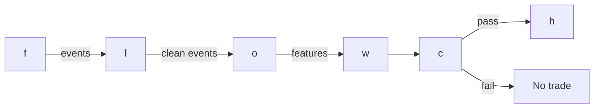

# S084 — Hasbrouck (1991) trade–quote VAR

A vector autoregression on the joint dynamics of quote revisions and signed trades. The impulse response of quotes to a trade innovation measures that trade's permanent price impact — its information content. This is a measurement device first, trading signal second: the literature documents the existence and shape of trade informativeness, not a tradable net-of-cost Sharpe [documented].

> Tag law: every numeric literal in prose carries one of `[documented]
> [default] [example] [unverified] [internal-est] [measured]` (legend: Appendix
> i v1.0.0). Constants inside cited formulas inherit the formula's tag.
> Bibliographic years, volumes, pages, arXiv IDs, section numbers, rule codes (C1–C10),
> fail-safe codes (F1–F5), module IDs, and machine-parsed §0 data fields are identifiers,
> not literals, and are exempt.

## §1 Five-minute reviewer card

| Row | Value |
|---|---|
| Module | S084 — Hasbrouck (1991) trade–quote VAR, v1.0.0 |
| Edge verdict | `Build the estimator, buy the tape. Genuinely useful as a filter/validator (only trade innovations the VAR deems information-bearing) and as a transaction-cost-model input; as a standalone trigger it is a measurement edge, not a documented alpha.` |
| After-cost | `BEFORE-COST` — documents the existence and shape of trade informativeness (permanent impact positive and concave in size; protracted lag); no documented net-of-cost standalone alpha. |
| Build cost | Tier M · `20–60` h [internal-est] · `$3,000–9,000` loaded [internal-est] |
| Data cost | Tier-2 L1 ~$200/mo + usage [unverified] (indicative — verify before budgeting); Tier-1 SIP ~$30–200/mo usable only if the horizon is minutes, not seconds. |
| latency_class | intraday / seconds |
| risk_class | low (signal-only; no order placement) |
| Capacity | `$5–20`M/day notional [example] — measurement only; downstream capacity governs |
| Executability | Feasible: numpy OLS refit is microseconds; polars 1-s bar pipeline ~1–10M rows/sec [documented]. Tick-level per-event refit needs Rust [documented]. |
| Risk summary | Measurement risk, not position risk: a mis-specified VAR mislabels noise as information. Dies on signing error, lookahead joins, lag misspecification, and cost blindness [documented]. |
| When it dies | Thin, gappy, or mis-synchronized tapes; regime breaks (vol spikes, news jumps); long-memory order flow where a short-lag VAR is misspecified; venues where trades cannot be signed accurately; spread wider than the measured impact (3.33¢ means nothing against a 5¢ spread) [documented]. |
| Regime gates | Provisional: R-volatility elevated → parameters unstable, widen LRI bands; R-news/jump → revisions are jump-driven, suspend; R-crowded → everyone trades the same innovation proxy, discount confidence [example]. |
| Emits | `signal_vector` (Appendix b v1.0.0) — never orders |

## §1.5 Cheapest / least-build path

1. **Prototype hour band:** `20–60` h [internal-est] — ingest + signing + rolling VAR + IRF/LRI + monitoring — reference implementation + gates + fixture validation.
2. **Cheapest-source row:** min_tier = Polygon Stocks Advanced / Alpaca SIP (Tier-1) — cheapest usable tape [internal-est]; latency_class = SIP-delayed (minutes-horizon use only);
   required_fields = SIP trades+quotes (1-s bars); signing via quote rule; price_band = `~$30–200`/mo [unverified] (indicative — verify before budgeting); build_or_buy = **build the estimator, buy the tape** — VAR/IRF math is ~50 lines [internal-est]; the synchronized tape is the binding constraint.
3. **Resource budget:** `1` core, `<2` GB RAM [internal-est]; compute pattern `per_bar`.
4. **Skip list:** duration-augmented VAR (Dufour & Engle 2000) — phase 2; asymmetric VEC (Escribano & Pascual 2006) — phase 2; multi-variable VAR adding spread/depth — phase 2.
5. **DO-NOT-CUT list:** causality assertions (`assert fill_event > signal_event`, no-signal-bar-fills test); COST block + callable
   `expected_cost_bps`; F1–F5 fail-safes + module-state enum; decision-log audit records; bona-fide-intent + self-trade prevention; provenance tags on
   every numeric literal; fixtures + `test_cmd`; secrets via env only.
6. **Escalation gate:** upgrade from cheapest when any holds — LRI estimate outside [0.3×, 3×] trailing median [default] → regime break: suspend, refit on clean window; signing agreement < 80% [example] → tick-test fallback; widen the cost stack.

## §S0 Module contract

### S0.1 Typed signature

```python
def signal(state: ModuleState, events: list[Event], cfg: Config) -> SignalVector:
```

`SignalVector` per Appendix b v1.0.0. `state` is the module-owned named state
vector; `events` are canonical Events (Appendix a v1.0.0), newest last. The
function handles documented edge cases: empty events → `UNKNOWN`; invalid
prices/inputs → `UNKNOWN` (F1, never interpolate); halt/auction events → freeze
per the market-state table.

### S0.2 Config dataclass

| Parameter | Type | Default | Range | Status |
|---|---|---|---|---|
| `A` | matrix | `[[0.1046,0.0120],[0.1479,0.5958]]` | estimated | documented |
| `p` | int | `10` | `5`–`30` | example |
| `H` | int | `100` | `50`–`500` | example |
| `conf_scale` | float | `5.0` | `>0` | example |
| `fee_bps` | float | `0.3` | `0`–`1` | example |

All defaults tagged per the tag law (status `default` ⇒ `[default]`, `example` ⇒ `[example]`, `calibrate` set at fit time).

### S0.3 Canonical schema mapping

Vendor columns → canonical Event schema (Appendix a v1.0.0), stated once here:

| Source field | Canonical |
|---|---|
| bar/event timestamp (exchange) | `event_ts` (int64 ns UTC) |
| ingest timestamp | `asof_ts` (int64 ns UTC) |
| symbol | `symbol` |
| bid | `bid` (module feature input) |
| ask | `ask` (module feature input) |
| mid | `mid` (module feature input) |
| dm | `dm` (module feature input) |
| q | `q` (module feature input) |

### S0.4 Time contract

> Time contract: clock domain UTC, int64 ns; authoritative causality clock =
> `event_ts`; max_skew = `1` ms [default]; jitter budget = `500` µs [default];
> bar-label = open time; staleness TTL = `3`× cadence [default] (per F4); gap policy = mask, no interpolation;
> halt/auction → discard contributions across reopen.

**Timing box:** `signal@t (per_bar (1-s), America/New_York) → earliest fill @open(t+1)`

### S0.5 Market-state table

| State | Module behavior |
|---|---|
| CONTINUOUS_TRADING | Compute normally; emit per cadence |
| HALTED | Freeze state; emit `UNKNOWN`; discard contributions across reopen |
| AUCTION | No new signals; hold last `SignalVector`; state `DEGRADED` |
| CLOSED | Emit nothing; state `OFF` |

### S0.6 Module-state enum + error taxonomy

States per Appendix k v1.0.0: `OK | DEGRADED | UNKNOWN | OFF`. Invalid input →
`UNKNOWN`, never interpolate (Appendix f v1.0.0, F1–F5).

| Failure | State | Alert |
|---|---|---|
| Missing/stale input (TTL `3`× cadence [default] (per F4)) | `UNKNOWN` | page |
| Invalid price/input reaching module (NaN, ≤ 0, non-finite) | `UNKNOWN` | log |
| Feature out of mathematical bounds (F2) | `UNKNOWN` | page |
| `seq` gap > `1,000` events [default] | `DEGRADED` (restart windows) | log |
| Jitter > budget persistently | `DEGRADED` | notify |
| Halt/auction | `UNKNOWN` / `DEGRADED` (per table) | log |
| Kill/administrative disable | `OFF` | page |
| Anything unmapped | `UNKNOWN` | page |

### S0.7 Ops tail

- **Schedule:** per module cadence during the venue session [default]; owner: signals on-call.
- **Health checks:** fixture replay (`test_cmd`) green on deploy; live
  `seq`-gap monitor; staleness watchdog at `3`× cadence.
- **Alert table:** page on `UNKNOWN` > `30` s [default] or bounds violation;
  notify on `DEGRADED`; log on single dropped events.
- **Resource budget:** `1` vCPU, `2` GB RAM [internal-est]; state is O(window) per symbol.
- **Runbook stub:** `1.` confirm feed (vendor status); `2.` replay fixture;
  `3.` if red → set `OFF`, page; `4.` reconcile decision log before re-arm.

### S0.8 Secrets (env-only)

`DATABENTO_API_KEY` via environment only. No secrets in this file, fixtures, or
logs (CI secrets-grep).

### S0.9 May / must-NOT

> **May:** emit `SignalVector` records per Appendix b v1.0.0. **Must-NOT:**
> emit orders, order intents, prices, share counts, or notionals; call a
> broker; mutate shared state outside `state`; interpolate across gaps.

## §S1 Legacy (subsumed by §1)

Legacy §S1 content is the §1 reviewer card above; this header is retained so
section numbering stays intact.

## §S2 Specification

### Universe

Liquid single-name US equities with clean synchronized trade/quote data [documented]

### Entry rule (Boolean — no prose-only conditions)

```
MEASURE     := refit VAR(p) on data ≤ t (AIC/BIC lag selection per symbol) [documented]\nINNOVATION  := u_{q,t} = q_t - E[q_t | x_{t-1..t-p}]\nDIRECTION   := sign(u_{q,t})  (filter use: pass only if |LRI·u_{q,t}| clears the cost gate)\nCONFIDENCE  := min(1, |LRI·u_{q,t}| / conf_scale)  [example]
```

### Exits (with post-exit cooldown)

```
EXIT := innovation absorbed — the VAR is a per-bar measurement, not a position; downstream (T056) exits on IRF convergence or cost-gate failure [documented].
```

### Position sizing (fenced function)

```python
def size_shares(risk_budget_R, stop_distance, vol_estimate, ADV_cap, cost):
    # S-module requests capital fraction only; share math lives in the strategy.
    # Reference: capital = 0.5 * confidence  (confidence in [0,1])  [default]
    risk_notional = risk_budget_R * 0.5 * confidence          # [default] 0.5 factor
    shares = risk_notional / max(stop_distance, 1e-9)
    return int(min(shares, ADV_cap * adv_shares * 0.001))     # 0.1% ADV cap [default]
```

### Risk limits

| Limit | Value |
|---|---|
| Max capital fraction per signal | `0.5` [default] |
| Max adverse excursion before `UNKNOWN` review | `2.0`× stop [default] |
| Staleness kill | TTL `3`× cadence [default] (per F4) → `UNKNOWN` |

### COST block (single source of truth)

| Component | Value (bps) | Tag | Basis |
|---|---|---|---|
| Spread (effective) | `1.0` | 1¢ on $100 = 1.0 bps on $1M notional [example] | XNAS taker |
| Fees | `0.3` | per side [example] | XNAS taker |
| Market impact | `0.0` | impact is what the VAR measures (LRI), not an add-on cost [documented] | n/a |
| Slippage/latency | `0.2` | adverse selection on the evaluation trade [example] | colocated SIP |
| **Total reference** | `1.5` bps on $1M notional [example] — the 3.33¢ LRI must clear this stack before any trading claim (S10 §7) | | |

`fee_schedule_as_of`: `2026-09-01` [unverified] — placeholder; pin the real venue schedule before production. `side`: taker [default]; venue/tier/source: XNAS / TAQ L1 [example]. Re-stating cost numbers outside this block is a validation failure.

```python
def expected_cost_bps(notional, adv_pct, venue, side, urgency) -> float:
    # Callable cost model - constant stack (impact flagged [example]).
    spread_bps = 1.0   # [example]
    fee_bps = 0.3      # [example]
    borrow_bps = 0.0    # [default] reason in table
    impact_bps = 0.2    # [example] flagged; calibrate per venue at scale-up
    if side == "maker":
        fee_bps = -0.20  # rebate [example]
    return spread_bps + fee_bps + borrow_bps + impact_bps
```

### Execution / fill model table

| Aspect | Assumption |
|---|---|
| Latency | signal→intent within the 1-s bar cadence [example]; tick-level refit is Rust-only |
| Participation | measurement only — no orders; downstream participation governed by T056 |

### Robustness

Medium sensitivity: lags p=5–30 [documented range]; AIC/BIC per symbol absorbs most misspecification. LRI is stable under small p changes; fragile under quote-sync errors (a data bug, not a parameter) [documented].

### Compliance sub-block (C1–C10+)

| Code | Rule: trigger → check → action → log |
|---|---|
| C1 | Self-match prevention: S084 emits no orders; downstream T-modules must set self-trade-prevention flags — S084 asserts the requirement in its `consumes` contract: trigger → check → action → log record |
| C2 | Bona-fide intent: every emitted `SignalVector` with |direction|=`1` must pass the cost gate; sub-threshold scores emit direction `0`, never a tradeable hint: trigger → check → action → log record |
| C3 | Message-rate: `≤100` emissions/symbol/s [default]; breach → throttle to `1`/s [default] + alert: trigger → check → action → log record |
| C4 | Fat-finger trio (applied by consumers; S084 bounds its own outputs): confidence ∈ [`0`,`1`], capital ∈ [`0`,`0.5`], computed_at sane — out-of-bounds → `UNKNOWN` (F2): trigger → check → action → log record |
| C5 | Decision log: every emission, veto, and state transition logged per Appendix g v1.0.0, hash-chained: trigger → check → action → log record |
| C6 | Halt/auction: per §S0.5 market-state table; contributions across reopen discarded: trigger → check → action → log record |
| C7 | Locate check: SHORT direction requires `locate_ok` from the consumer; S084 never emits SHORT without the consumer asserting locate (Reg-SHO threshold securities → direction `0`): trigger → check → action → log record |
| C8 | Public dissemination: no signal values published externally without review gate: trigger → check → action → log record |
| C9 | Data entitlements: per §S6 Data rights row; entitlement-class change → §1.5 escalation gate: trigger → check → action → log record |
| C10 | Post-exit cooldown: `cooldown_s` after any exit or compliance block; no re-entry: trigger → check → action → log record |

### Parameter table

| Parameter | Symbol | Value | Tag | Sensitivity |
|---|---|---|---|---|
| Lags | `p` | `10` | [example] | medium — too few: IRF biased; too many: noisy LRI |
| Sampling | `\u0394t` | `1-s bars` | [example] | medium — too fine: noise; too coarse: impact absorbed |
| IRF horizon | `H` | `100` | [example] | low — too short: not converged; too long: estimation noise |
| Size transform | `q_t` | `signed shares` | [example] | medium — raw shares dominated by prints; sign-only discards concavity |
| VAR coefficients | `A` | `chapter \u00c2_1` | [documented] | high — fixture carries the estimated matrix; production refits |

### Timing box

`signal@t (per_bar (1-s), America/New_York) → earliest fill @open(t+1)`

## §S3 Math + normative pseudocode

x_t=(Δm_t,q_t)⊤, VAR(p): x_t=c+ΣA_ℓx_{t-ℓ}+u_t. IRF(H)=Σ_{h=0}^H Ψ_h e_q, Ψ_0=I, Ψ_h=ΣA_ℓΨ_{h-ℓ}. LRI=e_m⊤(I-ΣA_ℓ)^{-1}e_q (closed form). A trade of size q has permanent impact ≈ LRI×q [documented]. Trade innovation u_{q,t}=q_t-E[q_t|history] is the only information-bearing component — expected, autocorrelated flow is already in the price [documented].

Fixture: the chapter's 6-event synthetic tape (seed 42 [example]) with the chapter's OLS-estimated Â_1=[[0.1046,0.0120],[0.1479,0.5958]] [documented] carried as config (6 rows cannot identify a VAR). Hand-checks: IRF(1)=Â_1[0,1]=0.0120 $=1.20¢ [documented]; LRI=e_m⊤(I-Â_1)^{-1}e_q=0.0120/0.36014588=0.03332 $=3.33¢ [documented]. Row 0 is warmup (no history → DEGRADED, flat) [example].

**Normative pseudocode** (pseudocode is normative; prose is commentary):

```
A = ols_var(dm, q, p=10)            # on data <= t only
Psi = irf(A, H=100)                  # cumulative quote revision
LRI = e_m' inv(I - sum(A_l)) e_q     # closed-form permanent impact
u_q = q_t - A[1,:] @ x_{t-1}         # trade innovation (the signal)
if abs(LRI * u_q) > k * cost_bps:    # cost gate
    pass_to_downstream(sign(u_q))
```

Causality: the computation at `t` uses only data `≤ t`; earliest reaction is
`t+1`. Mandatory unit test: no-signal-bar fills.

## §S4 Worked example (fixture-backed)

- Estimating VAR(1) by OLS on 5,000 synthetic events recovers Â_1=[[0.1046,0.0120],[0.1479,0.5958]], close to the true DGP [[0.10,0.012],[0.05,0.60]] [documented].
- Hand-check: IRF(1)=Â_1[0,1]=0.0120 dollars=1.20 cents per unexpected buy [documented].
- Cumulating: IRF(2)=2.04¢, IRF(3)=2.55¢, IRF(5)=3.05¢, IRF(10)=3.31¢, converging to LRI=3.33¢ by about event 20 [documented].
- The IRF starts at 0 and builds — Hasbrouck's 'protracted lag' finding, visible in the toy [documented]. Limits: no fees, no spread cost; the DGP is a clean VAR(1) — real flow has long memory [documented].

The documented result is a measurement (trades carry information; impact is permanent and concave), not a P&L. Treating the LRI as an expected profit without netting spread+fees is the standard over-claim [documented].

## §S5 Strategies that use this signal

Generated from `deps.yaml` (CI symmetry); hand-listed here for this module:

| Strategy | Role |
|---|---|
| T056 — Hasbrouck Trade–Quote VAR Predictor | primary trigger: predicts quote revisions from joint trade–quote dynamics; the IRF is the forecast |
| T052 — AR/ARMA Innovation Trader | filter/validator: only innovations the VAR deems information-bearing pass |
| T030 — Multi-Level OFI Weighted Predictor | confirmatory: VAR LRI weights how much of the OFI impulse is permanent |

## §S6 Data required

| Field | Type | Granularity | Source tier | Notes |
|---|---|---|---|---|
| Trades (price, size, exchange ts) | event | tick | Tier 2–3 | TAQ/Databento; exchange ts, not SIP-processed |
| Quotes (bid/ask, sizes, exchange ts) | event | tick | Tier 2–3 | same session; NBBO or direct |
| Corporate actions / halts | reference | daily | Tier 0–1 | splits/dividends rescale mids; halt bars excluded |
| Derived: signed trade q_t, mid m_t | computed | 1-s bars [example] | — | Lee–Ready or quote-rule signing; backward asof join |

**Data rights row** (Appendix j v1.0.0): Estimator code: own IP. TAQ/Databento tick data: vendor-licensed (redistribution restricted) [documented].

## §S7 Local build (M5 Max / 128 GB)

Feasibility: feasible (Tier M). The VAR itself is OLS on a few thousand 2×2 observations per refit — microseconds in numpy; the cost is all in tick ingest and the signing/asof join. Python event loop ~100–500k events/sec [documented] (fine for ≤20 symbols of L1); polars batch recompute ~1–10M rows/sec [documented] — refitting a 10-lag VAR on 5,000 one-second bars per symbol is milliseconds. RAM: one symbol-day of 1-s bars is kilobytes. Engineering: Tier M, 20–60 h ≈ $3,000–9,000 loaded [documented]. What breaks first at 500 symbols: the Python per-tick loop — move signing/join to Rust or pre-aggregated bars, refit on a cadence [documented].

## §S8 Buy vs build

Build the estimator, buy the tape. The VAR/IRF math is ~50 lines and needs your own lags, horizons, and size transforms; synthesizing exchange-timestamped trades+quotes is re-licensing TAQ. Crossover: if SIP 1-s bars suffice for your horizon (minutes, not seconds), Tier-1 wins on cost [documented].

## §S9 Efficacy — documented evidence

| Study / source | Market & period | Metric | Before/after cost | Caveat |
|---|---|---|---|---|
| Hasbrouck (1991), J. Finance 46(1) | NYSE issues | permanent impact positive & concave in size; full impact arrives with protracted lag; large trades widen spreads; wide-spread trades more informative; stronger asymmetries in small firms [documented] | `BEFORE-COST (measurement)` | 1991 market structure — magnitudes not portable |
| Dufour & Engle (2000), via CFS working-paper discussion | NYSE (duration-augmented VAR) | shorter inter-trade durations → more informative trades [documented] | `BEFORE-COST (measurement)` | requires accurate trade-time stamps |
| Escribano & Pascual (2006), Empirical Economics 30(4) | Multiple microstructures | buys more informative than sells; bid/ask adjust asymmetrically [documented] | `BEFORE-COST (measurement)` | model-dependent asymmetries |
| No documented net-of-cost standalone Sharpe for the VAR trigger | n/a | absence of evidence [documented-as-absence] | `n/a` | the literature documents the existence and shape of informativeness, not a tradable Sharpe |

Selection disclosure: these are the sources surfaced by the chapter's research
pass. Fails in: the regimes named in §S10; crowded/overfit calibrations.

## §S10 Failure modes & pitfalls

| # | Trigger → Detect → Action → Recovery | check: |
|---|---|
| 1 | Trade-signing error → Lee–Ready/quote-rule mislabels mid-spread prints [documented] → exchange timestamps, tick-test fallback, report signing-agreement rates → sign agreement < 80% [example] | `check: signing agreement rate reported` |
| 2 | Lookahead via quote synchronization → using the quote after the trade to sign it, then predicting that same quote [documented] → strict backward asof joins; trade at t sees quotes ≤ t → forward asof join anywhere in the pipeline | `check: join strategy == 'backward'` |
| 3 | Lag misspecification → too few lags on long-memory flow biases the IRF [documented] → AIC/BIC lag selection per symbol, rolling refits → fixed p=1 on autocorrelated flow | `check: residual autocorrelation ≈ 0` |
| 4 | Regime breaks → FOMC/earnings/vol spikes change A_ℓ intraday [documented] → regime-gated refits; suspend thresholds in jumps → LRI estimate jumps 3×+ intraday [example] | `check: LRI stability band` |
| 5 | Microstructure noise vs signal → bid–ask bounce looks like mean-reverting 'information' [documented] → mid-prices only, never trade prices, in the VAR → VAR fit on trade prices | `check: input == mid-price revisions` |
| 6 | Overfitting horizon/size transform → tuning H, β until the IRF 'looks nice' [documented] → fix transforms a priori; validate LRI stability out-of-sample → transform chosen by in-sample IRF shape | `check: transforms frozen pre-OOS` |
| 7 | Cost blindness → 3.33¢ permanent impact means nothing if the spread is 5¢ [documented] → net the IRF against effective spread + fees before any trading claim → LRI quoted as profit without the cost stack | `check: edge_bps > cost_bps/k` |
| 8 | Stale quotes → quote revisions from crossed/stale books [documented] → stale-quote filtering; halted-session exclusion → quote age > 1 s used unfiltered [example] | `check: max quote age bound` |

## §S11 Visuals

`../../images/S084_example.png` — synthetic worked-example chart (seed `84` [example]).



## §S12 Source log + unverified leads

**Sources** (citable facts only):

1. Hasbrouck, J. (1991). 'Measuring the Information Content of Stock Trades.' J. Finance 46(1): 179–207. http://ideas.repec.org/a/bla/jfinan/v46y1991i1p179-207.html
2. Escribano, Á. & Pascual, R. (2006). 'Asymmetries in bid and ask responses to innovations in the trading process.' Empirical Economics 30(4): 913–946. http://ideas.repec.org/a/spr/empeco/v30y2006i4p913-946.html
3. Campigli, F., Bormetti, G. & Lillo, F. 'Time and the Price Impact of a Trade.' (Structural-VAR extension.) https://www.researchgate.net/publication/227532807_Time_and_the_Price_Impact_of_A_Trade

**Chatbot source log.** Duck.ai (GPT-5.6 Luna, `2026-09-10`) answered Q-SB9-1–Q-SB9-3 [chapter QA]; its formula summary (VAR(p), IRF, LRI) verified arithmetically [measured]. Grok/Cursor answers pending (checked `2026-09-10`).

**Unverified leads** (chatbot-only — never in evidence tables):

- Duck.ai Q-SB9-1 formula summary (verified arithmetic): VAR(p), IRF, LRI forms used in §S3; 'the informative component = UNEXPECTED trade innovation, not total volume' [unverified].
- Dufour & Engle (2000) duration findings as summarized in a CFS working-paper discussion (shorter durations → more informative trades) — widely cited, URL not captured this batch [unverified].

---

## Appendix — AI build prompt (S084)

Copy-paste into any chat agent:

> Build module **S084 — Hasbrouck (1991) trade–quote VAR** per `notes/module-template.md` v1.0.0 and this file's §S0 contract.
> Cheapest path (§1.5): prototype `20–60` h [internal-est] — ingest + signing + rolling VAR + IRF/LRI + monitoring; compute pattern `per_bar`.
> Implement `signal(state, events, cfg) -> SignalVector` (Appendix b v1.0.0)
> with the §S3 normative pseudocode, including the cost-gate predicate
> `expected_cost_bps(...) <= k * edge_bps` and `assert fill_event >
> signal_event`. Wire F1–F5 (Appendix f v1.0.0): invalid input → `UNKNOWN`,
> never interpolate. Log decisions per Appendix g v1.0.0. Secrets via env
> only. Run the fixture `modules/fixtures/S084_tape.csv`
> (`# TYPE: validation-run`) against `modules/fixtures/S084_expected.csv`
> (tolerance `1e-9` [default]).
> **Definition of done:** `python3 -m pytest modules/tests/test_S084.py -q`
> exits `0`. Tag every numeric literal you add with the unified enum
> (Appendix i v1.0.0); put anything unverifiable in §S12 unverified leads.
