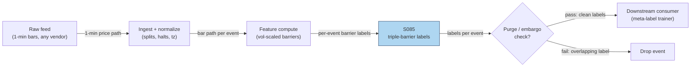

# S085 — Triple-barrier labeling

A labeling procedure (not a signal): each candidate trade is labeled +1/−1/0 by whichever barrier — profit, stop, or time — the price path touches first. Labels are for training only: computing a label requires future data (up to the vertical barrier), so a label must never be a live feature. As an alpha source it is nothing — it cannot create edge, only reveal whether the primary has one under honest validation [documented].

> Tag law: every numeric literal in prose carries one of `[documented]
> [default] [example] [unverified] [internal-est] [measured]` (legend: Appendix
> i v1.0.0). Constants inside cited formulas inherit the formula's tag.
> Bibliographic years, volumes, pages, arXiv IDs, section numbers, rule codes (C1–C10),
> fail-safe codes (F1–F5), module IDs, and machine-parsed §0 data fields are identifiers,
> not literals, and are exempt.

## §1 Five-minute reviewer card

| Row | Value |
|---|---|
| Module | S085 — Triple-barrier labeling, v1.1.0 |
| Edge verdict | `Always build: labeling is research IP, a few dozen lines of code. The efficacy of the stack (barriers + meta-labeling, S086) is bounded by the primary: a weak primary cannot be rescued — the darufinance replication found meta-model profit-factor lifts in 38/42 instruments but 0/42 cleared the Deflated Sharpe Ratio bar [documented].` |
| After-cost | `INFRASTRUCTURE` — a documented improvement over fixed-horizon/next-bar labels (path-aware, cost-aware targets); zero alpha content of its own. |
| Build cost | Tier L · `4–12` h [internal-est] · `$600–1,800` loaded [internal-est] |
| Data cost | ~$0 (Tier-0 Stooq daily) to ~$199/mo (Polygon Stocks Advanced 1-min) [unverified], as-of 2026-09-10; the labeler itself costs nothing to run. |
| latency_class | batch / offline |
| risk_class | low (signal-only; no order placement) |
| Capacity | n/a — training infrastructure; no positions [documented] |
| Executability | Trivial: vectorized numpy scan; 100k events in seconds [documented]. Nothing else is justified. |
| Risk summary | Research-integrity risk, not position risk: leaked or overfit labels silently train the model on the answer key. Dies on leakage, overlap, barrier overfit, and cost-blind labels [documented]. |
| When it dies | Labels leak the future into features (σ̂ estimated over the label window); barriers overfit on the test set (overfitting the answer key); asked to manufacture alpha from a primary with none; same-bar touch ambiguity unresolved; costs ignored in the label (a +1 that nets −2 bps teaches the model to love losers) [documented]. |
| Regime gates | Provisional (machine records below): R001-volatility elevated → vol-scaled barriers adapt automatically (the point of σ̂-scaling); R005/R036 news/jump → first-touch ordering unreliable on coarse bars, prefer tick resolution [example]. |
| Emits | `signal_vector` (Appendix b v1.0.0) — never orders |

**Regime gates — machine records** (provisional; ride the R001–R050 annotation pass):

```yaml
regime_gates:
  - regime_id: R001   # Realized-volatility level regime
    direction: amplifies
    mechanism: "barriers in vol units; elevated vol widens barriers automatically via sigma-hat scaling"
    condition: "R001.state == ELEVATED"
    action: widen_stops
    min_lag: 5   # bars [default]
    unknown_behavior: widen_stops   # restrictive: assume elevated until measured
  - regime_id: R005   # Jump regime (discontinuity state)
    direction: degrades
    mechanism: "jumps break first-touch ordering on coarse bars"
    condition: "R005.state == JUMP"
    action: pause_entry
    min_lag: 1   # bars [default]
    unknown_behavior: pause_entry   # restrictive default
  - regime_id: R036  # Macro announcement windows
    direction: degrades
    mechanism: "scheduled macro/news jumps break first-touch ordering"
    condition: "R036.state in (PRE_WINDOW, POST_WINDOW)"
    action: pause_entry
    min_lag: 1   # bars [default]
    unknown_behavior: pause_entry   # restrictive default
  - regime_id: R038  # Thin liquidity regime
    direction: degrades
    mechanism: "thin liquidity: touch ordering unreliable on coarse bars; prefer tick resolution"
    condition: "R038.state == THIN"
    action: veto
    min_lag: 3   # bars [default]
    unknown_behavior: veto   # restrictive default
  - regime_id: R022  # Hard-to-borrow / short-squeeze regime
    direction: degrades
    mechanism: "hard-to-borrow: short-side labels unusable without locate (C7)"
    condition: "side == -1 and R022.state == STRESSED"
    action: veto
    min_lag: 1   # bars [default]
    unknown_behavior: veto   # restrictive default
  - regime_id: R033  # Systemic tail-risk / crisis regime
    direction: degrades
    mechanism: "crisis: barrier diffusion-like path assumptions break down"
    condition: "R033.state == CRISIS"
    action: pause_entry
    min_lag: 1   # bars [default]
    unknown_behavior: pause_entry   # restrictive default
```

## §1.5 Cheapest / least-build path

1. **Prototype hour band:** `4–12` h [internal-est] — vectorized path scan over events (a labeled chatbot lead estimated 10–25 h; the cost model takes precedence) — reference implementation + gates + fixture validation.
2. **Cheapest-source row (structured):**

   | min_tier | latency_class | required_fields | price_band | build_or_buy |
   |---|---|---|---|---|
   | Stooq daily CSV (Tier 0) | n/a — batch training procedure | daily OHLC + entry timestamps (from the primary) + σ̂ input (ATR, computed in-module) | `$0`/mo [unverified]; historical-range queries need an on-site CAPTCHA-issued API key since early 2026 [unverified] | **build** — labeling is a few dozen lines of research IP [documented]; buy at most the finer price path |
3. **Resource budget:** `1` core, `<2` GB RAM [internal-est]; compute pattern `per_event`.
4. **Skip list:** asymmetric barriers (1.5:1 reward:risk) — phase 2; keep-vs-drop zero-class ablation — phase 2; meta-labeling target variant (S086) — separate module.
5. **DO-NOT-CUT list:** causality assertions (`assert fill_event > signal_event`, no-signal-bar-fills test); COST block + callable
   `expected_cost_bps`; F1–F5 fail-safes + module-state enum; decision-log audit records; bona-fide-intent + self-trade prevention; provenance tags on
   every numeric literal; fixtures + `test_cmd`; secrets via env only.
6. **Escalation gate:** upgrade from cheapest when any holds — label overlap fraction > 20% [example] → purge + embargo (S088), increase event spacing; barrier touch rate at vertical > 80% [example] → barriers too wide or H too short; retune on training folds.

## §S0 Module contract

### S0.1 Typed signature

```python
def signal(state: ModuleState, events: list[Event], cfg: Config) -> SignalVector:
```

`SignalVector` per Appendix b v1.0.0. `state` is the module-owned named state
vector; `events` are canonical Events (Appendix a v1.0.0), newest last. The
function handles documented edge cases: empty events → `UNKNOWN`; invalid
prices/inputs → `UNKNOWN` (F1, never interpolate); halt/auction events → freeze
per the market-state table.

### S0.2 Config dataclass

| Parameter | Type | Default | Range | Status |
|---|---|---|---|---|
| `event_day` | int | `15` | `1`–`20` | example (fixture) |
| `side` | int | `+1` | `+1`/`−1` | example (fixture) |
| `k_u` | float | `1.0` | `0.5`–`2.0` | calibrate |
| `k_l` | float | `1.0` | `0.5`–`2.0` | calibrate |
| `sig_cfg` | float | `1.0` | `>0` | example — vol scale reproducing the chapter's ±1.0pt barriers on the fixture tape; production uses `sig_hat` |
| `sig_hat` | float | `1.2978` | estimated per event | calibrate — estimated via `estimate_sigma` (§S3) on data strictly before t_0; chapter constant is the reference [documented] |
| `H` | int | `5` | `1`–`20` | calibrate |
| `vol_lookback` | int | `30` | `5`–`120` | calibrate — bars of pre-event history for `estimate_sigma` |
| `event_spacing` | int | `5` | `1`–`20` | calibrate — minimum bars between label events (overlap control) |
| `zero_class_policy` | str | `drop` | `drop`/`keep` | calibrate |
| `tie_rule` | str | `adverse_first` | `adverse_first`/`exclude` | default — same-bar tie-break (§S3); `exclude` drops ambiguous events |
| `cooldown_s` | float | `300` | `≥0` | default — post-compliance-block cooldown (C10) |
| `k_gate` | float | `0.5` | `0.25`–`2.0` | calibrate — cost-gate multiplier; 0.5 vs T002-style 2 pending calibration data [unverified] |
| `barrier_mode` | str | `additive` | `additive`/`relative` | default — `additive` on spread points (fixture-exercised); `relative` = de Prado's P·(1±kσ̂) for price paths [documented] |

All defaults tagged per the tag law (status `default` ⇒ `[default]`, `example` ⇒ `[example]`, `calibrate` set at fit time).

**Calibration recipe** (all `calibrate`-status parameters; never fit on the test fold — §S10 mode 3):

```yaml
calibration:
  fold_design: "anchored walk-forward, 5 folds [default]; train 60% / validate 20% of history per fold"
  embargo: "H + event_spacing bars [default]; overlapping labels purged per S088 [documented]"
  selection_metric: "purged/embargoed meta-model DSR on training-fold OOS only [documented]; never test Sharpe"
  stability_guardrails: "vertical touch rate in [0.10, 0.60] [example]; max class imbalance 3:1 [example]"
  freeze_rule: "parameters frozen before the test fold is ever touched [documented]; refit at most quarterly [example]; any refit re-runs test_cmd green and logs provenance in the §0 changelog"
  grids:
    k_u:            {grid: [0.5, 1.0, 1.5, 2.0], select: "argmax DSR s.t. guardrails"}   # [example] grid
    k_l:            {grid: [0.5, 1.0, 1.5, 2.0], select: "argmax DSR s.t. guardrails"}   # [example] grid
    H:              {grid: [3, 5, 10, 20], unit: days, select: "argmax DSR s.t. guardrails"}  # [example] grid
    vol_lookback:   {grid: [15, 30, 60], unit: bars, select: "argmax DSR s.t. guardrails"}   # [example] grid
    event_spacing:  {grid: [3, 5, 10], unit: bars, select: "argmax DSR s.t. guardrails"}      # [example] grid
    zero_class_policy: {grid: [drop, keep], select: "policy of the argmax-DSR config"}      # [example] grid
    k_gate:         {grid: [0.25, 0.5, 1.0, 2.0], select: "argmax DSR; 0.5 vs T002-style 2 open [unverified]"}  # [example] grid
```

### S0.3 Canonical schema mapping

Vendor columns → canonical Event schema (Appendix a v1.0.0), stated once here:

| Source field | Canonical |
|---|---|
| bar/event timestamp (exchange) | `event_ts` (int64 ns UTC) |
| ingest timestamp | `asof_ts` (int64 ns UTC) |
| symbol | `symbol` |
| day | `day` (module feature input) |
| spread | `spread` (module feature input) |

### S0.4 Time contract

> Time contract: clock domain UTC, int64 ns; authoritative causality clock =
> `event_ts`; max_skew = `1` ms [default]; jitter budget = `500` µs [default];
> bar-label = open time; staleness TTL = `3` s [default] (`3`× the `1`-s reference cadence per F4); gap policy = mask, no interpolation;
> halt/auction → discard contributions across reopen.

**Timing box:** `signal@t (per_event (batch), America/New_York) → earliest fill @open(t+1)`

### S0.5 Market-state table

| State | Module behavior |
|---|---|
| CONTINUOUS_TRADING | Compute normally; emit per cadence |
| HALTED | Freeze state; emit `UNKNOWN`; discard contributions across reopen |
| AUCTION | No new signals; hold last `SignalVector`; state `DEGRADED` |
| CLOSED | Emit nothing; state `OFF` |

### S0.6 Module-state enum + error taxonomy

States per Appendix k v1.0.0: `OK | DEGRADED | UNKNOWN | OFF`. Invalid input →
`UNKNOWN`, never interpolate (Appendix f v1.0.0, F1–F5).

| Failure | State | Alert |
|---|---|---|
| Missing/stale input (TTL `3` s [default] (`3`× the `1`-s reference cadence per F4)) | `UNKNOWN` | page |
| Invalid price/input reaching module (NaN, ≤ 0, non-finite) | `UNKNOWN` | log |
| Feature out of mathematical bounds (F2) | `UNKNOWN` | page |
| `seq` gap > `1,000` events [default] | `DEGRADED` (restart windows) | log |
| Jitter > budget persistently | `DEGRADED` | notify |
| Halt/auction | `UNKNOWN` / `DEGRADED` (per table) | log |
| Kill/administrative disable | `OFF` | page |
| Anything unmapped | `UNKNOWN` | page |

### S0.7 Ops tail

- **Schedule:** continuous during US equities regular session `09:30`–`16:00` America/New_York [documented]; owner: signals on-call.
- **Health checks:** fixture replay (`test_cmd`) green on deploy; live
  `seq`-gap monitor; staleness watchdog at `3`× cadence.
- **Alert table:** page on `UNKNOWN` > `30` s [default] or bounds violation;
  notify on `DEGRADED`; log on single dropped events.
- **Resource budget:** `1` vCPU, `2` GB RAM [internal-est]; state is O(window) per symbol.
- **Runbook stub:** `1.` confirm feed (vendor status); `2.` replay fixture;
  `3.` if red → set `OFF`, page; `4.` reconcile decision log before re-arm.

### S0.8 Secrets (env-only)

`POLYGON_API_KEY` via environment only. No secrets in this file, fixtures, or
logs (CI secrets-grep).

### S0.9 May / must-NOT

> **May:** emit `SignalVector` records per Appendix b v1.0.0. **Must-NOT:**
> emit orders, order intents, prices, share counts, or notionals; call a
> broker; mutate shared state outside `state`; interpolate across gaps.

## §S1 Legacy (subsumed by §1)

Legacy §S1 content is the §1 reviewer card above; this header is retained so
section numbering stays intact.

## §S2 Specification

### Universe

Any price-path universe; fixture: single synthetic 20-day spread tape [example]

### Entry rule (Boolean — no prose-only conditions)

```
LABEL_EVENT := at t_0: event_ts[t_0], side s ∈ {+1,−1}, entry level P_{t_0} [documented]
BARRIERS    := profit = P_{t_0} + s·k_u·σ̂ ; stop = P_{t_0} − s·k_ℓ·σ̂ ; vertical = t_0+H ;
               σ̂ from data strictly < t_0 [documented]
FIRST_TOUCH := τ* = min{τ∈1..H : side·(P_{t_0+τ}−P_{t_0}) ≥ k_u·σ̂  (profit)
                                  or ≤ −k_ℓ·σ̂  (stop)} ;
               intrabar H/L ordering; same-bar tie → adverse-first [example]
LABEL       := +1 if profit touched first ; −1 if stop touched first ;
               0 if neither by H (de Prado's vertical→0 standard) [documented]
CAUSALITY   := label known only at event_ts[t_0+min(τ*,H)] ; never a feature at t ≤ t_0 [documented]
```

### Exits (with post-exit cooldown)

```
No exits — labels are training targets, not positions. Label consumption happens in batch (purged/embargoed CV, S088) [documented].
```

### Position sizing (fenced function)

```python
def size_shares(risk_budget_R, stop_distance, vol_estimate, ADV_cap, cost):
    # S-module requests capital fraction only; share math lives in the strategy.
    # Reference: capital = 0.5 * confidence  (confidence in [0,1])  [default]
    risk_notional = risk_budget_R * 0.5 * confidence          # [default] 0.5 factor
    shares = risk_notional / max(stop_distance, 1e-9)
    return int(min(shares, ADV_cap * adv_shares * 0.001))     # 0.1% ADV cap [default]
```

### Risk limits

| Limit | Value |
|---|---|
| Max capital fraction per signal | `0.5` [default] |
| Max adverse excursion before `UNKNOWN` review | `2.0`× stop [default] |
| Staleness kill | TTL `3` s [default] (`3`× the `1`-s reference cadence per F4) → `UNKNOWN` |

### COST block (single source of truth)

| Component | Value (bps) | Tag | Basis |
|---|---|---|---|
| Spread | `0.00` | [documented] | labeling executes no trades |
| Fees | `0.00` | [documented] | no orders emitted |
| Borrow (`borrow_bps_per_day`) | `0.00` | [documented] | reason: the labeler takes no positions; borrow cost lives in the consuming T-module's cost block |
| Market impact | `0.00` | [documented] | no positions taken |
| **Total reference** | `0.00` [documented] | | the cost discipline lives one layer up: round-trip cost is subtracted from the profit barrier before labeling, so +1 means 'profitable after costs' |

`fee_schedule_as_of`: `2026-09-01` [unverified] — n/a to the labeler; the live venue schedule is pinned in the consuming T-module before any live trading. `side`: n/a — labels carry the primary's side; the labeler takes none [documented]; venue/tier/source: n/a — no orders emitted [documented]. Re-stating cost numbers outside this block is a validation failure.

```python
def expected_cost_bps(notional, adv_pct, venue, side, urgency) -> float:
    # Callable cost model — mirrors the COST block exactly (labeling executes no trades).
    spread_bps = 0.00   # [documented] — labeler emits no orders
    fee_bps    = 0.00   # [documented] — no orders emitted
    borrow_bps = 0.00   # [documented] — borrow_bps_per_day = 0.00; no positions taken; reason in table
    impact_bps = 0.00   # [documented] — no positions taken
    return spread_bps + fee_bps + borrow_bps + impact_bps   # == 0.00
```

### Execution / fill model table

| Aspect | Assumption |
|---|---|
| Latency | n/a — batch training procedure; labels consumed in purged/embargoed CV [documented] |

### Robustness

Low sensitivity by design: barriers in vol units adapt to regimes; the fragile choices are procedural (leakage, overlap, zero-class) not parametric [documented].

### Compliance sub-block (C1–C10+)

| Code | Rule: trigger → check → action → log |
|---|---|
| C1 | Self-match prevention: S085 emits no orders; downstream T-modules must set self-trade-prevention flags — S085 asserts the requirement in its `consumes` contract: trigger → check → action → log record |
| C2 | Bona-fide intent: every emitted `SignalVector` with |direction|=`1` must pass the cost gate; sub-threshold scores emit direction `0`, never a tradeable hint: trigger → check → action → log record |
| C3 | Message-rate: `≤100` emissions/symbol/s [default]; breach → throttle to `1`/s [default] + alert: trigger → check → action → log record |
| C4 | Fat-finger trio (applied by consumers; S085 bounds its own outputs): confidence ∈ [`0`,`1`], capital ∈ [`0`,`0.5`], computed_at sane — out-of-bounds → `UNKNOWN` (F2): trigger → check → action → log record |
| C5 | Decision log: every emission, veto, and state transition logged per Appendix g v1.0.0, hash-chained: trigger → check → action → log record |
| C6 | Halt/auction: per §S0.5 market-state table; contributions across reopen discarded: trigger → check → action → log record |
| C7 | Locate check: SHORT direction requires `locate_ok` from the consumer; S085 never emits SHORT without the consumer asserting locate (Reg-SHO threshold securities → direction `0`): trigger → check → action → log record |
| C8 | Public dissemination: no signal values published externally without review gate: trigger → check → action → log record |
| C9 | Data entitlements: per §S6 Data rights row; entitlement-class change → §1.5 escalation gate: trigger → check → action → log record |
| C10 | Post-exit cooldown: `cooldown_s` after any exit or compliance block; no re-entry: trigger → check → action → log record |

### Parameter table

| Parameter | Symbol | Value | Tag | Sensitivity | Calibration |
|---|---|---|---|---|---|
| Barrier width | `k_u, k_ℓ` | `1.0` / `1.0` | [example] | medium — tiny: noise labels; huge: everything hits vertical | grid {0.5,1,1.5,2} ×2, §S0.2 recipe |
| Horizon | `H` | `5` d | [example] | medium — short: all vertical; long: overlapping labels | grid {3,5,10,20}d, §S0.2 recipe |
| Vol lookback | `L` | `30` bars | [example] | medium — short: jumpy σ̂; long: stale | grid {15,30,60} bars, §S0.2 recipe |
| Event spacing | `—` | `5` bars | [example] | medium — dense: correlated labels → purge needed | grid {3,5,10} bars, §S0.2 recipe |
| Zero-class | `—` | `drop 0s` | [example] | medium — keep: 'hold' class; drop: cleaner binary | grid {drop,keep}, §S0.2 recipe |
| Tie-break | `—` | `adverse_first` | [default] | low — `exclude` drops ambiguous events instead | fixed default; ablation in phase 2 |
| Cost-gate k | `k_gate` | `0.5` | [default] | low — labeler cost is 0; gate is vacuous here | grid {0.25,0.5,1,2}, open item |

### Timing box

`signal@t (per_event (batch), America/New_York) → earliest fill @open(t+1)`

## §S3 Math + normative pseudocode

Event at t_0, path level P_{t_0}, side s∈{+1,−1}, vol σ̂_{t_0} estimated from data
strictly before t_0 (see `estimate_sigma`), horizon H bars [documented]. The
module's canonical form is **additive on spread points** (pair-trading, per Fu et
al. [documented]; this is the form the fixture exercises): profit barrier
P_{t_0}+s·k_u·σ̂, stop barrier P_{t_0}−s·k_ℓ·σ̂, vertical barrier t_0+H. De Prado's
price-path form is multiplicative, P_{t_0}·(1±k·σ̂) [documented] — select via
`barrier_mode: additive | relative` (`additive` [default]). Side-signed
displacement r^s_τ = s·(P_{t_0+τ}−P_{t_0}) (log-return form under
`barrier_mode: relative`): y=+1 if r^s first ≥ k_u·σ̂ (profit), −1 if first ≤
−k_ℓ·σ̂ (stop), 0 if neither by H (vertical — de Prado's standard) [documented].
The label for event t_0 is known only at min(first-touch, t_0+H) — a training
target, never a live input [documented]. First-touch ordering uses intrabar H/L
when available; on close-only input the adverse-first tie-break below applies
[example].

Fixture: the chapter's 20-day synthetic spread tape (seed 85 [example]) with the day-15 long-spread event. The chapter's vol estimate σ̂=√(32/19)≈1.2978 [documented] is carried for z-scores (z_15=−2/1.2978≈−1.541 [documented]); the barrier widths reproduce the chapter's stated ±1.0-point barriers via k_u=k_ℓ=1.0 on unit vol-scale [example]. Day 16: S=−1.0, r^s=+1.0≥+1.0 → PROFIT HIT, y_15=+1, 1-day exit [documented]. A fixed-horizon label at day 20 would score 0 (S_20=0) — the path-aware label records the executable win [documented].

**Normative pseudocode** (pseudocode is normative; prose is commentary). All
variables bound; guards inline:

```python
def estimate_sigma(changes, L):
    # changes: pre-event spread/log-return changes, oldest first, strictly before t_0.
    # L = vol_lookback. Anything including data >= t_0 is a LEAK (§S10 mode 1).
    w = changes[-L:]
    assert len(w) >= 2, "insufficient pre-event history -> UNKNOWN"
    mu = sum(w) / len(w)
    sig_hat = sqrt(sum((x - mu) ** 2 for x in w) / (len(w) - 1))
    assert isfinite(sig_hat) and sig_hat > 0, "degenerate vol -> UNKNOWN"
    return sig_hat          # in the same units as `changes` (points for spreads)

def triple_barrier(px, hi, lo, ts, asof_ts, t0, side, ku, kl, sig, H,
                   tie_rule, locate_ok, now_ns, last_block_ns, cooldown_s,
                   ttl_ns, market_state, edge_bps, k_gate,
                   notional, adv_pct, venue, urg_side, urgency):
    # px/hi/lo/ts: aligned path arrays; asof_ts[t0]: ingest time of the event bar.
    # Returns (label, tau, status) with label ∈ {+1, -1, 0} or (None, None, state).
    # --- guards: locate / cooldown / staleness / halt (all bound before any math) ---
    assert market_state in ("CONTINUOUS_TRADING", "HALTED", "AUCTION", "CLOSED")
    if market_state in ("HALTED", "CLOSED"):
        return (None, None, "UNKNOWN")        # freeze per §S0.5; discard across reopen
    if market_state == "AUCTION":
        return (None, None, "DEGRADED")       # no new labels; hold last SignalVector
    if side not in (+1, -1):
        return (None, None, "UNKNOWN")        # invalid side (F2)
    if side == -1 and not locate_ok:
        return (None, None, "UNKNOWN")        # C7: locate gate for SHORT labels
    if (now_ns - last_block_ns) < cooldown_s:
        return (None, None, "UNKNOWN")        # C10: post-compliance-block cooldown
    if (asof_ts[t0] - ts[t0]) > ttl_ns:
        return (None, None, "UNKNOWN")        # F4: staleness TTL
    if not (isfinite(px[t0]) and px[t0] > 0):
        return (None, None, "UNKNOWN")        # invalid price (F1)
    if t0 + H >= len(px):
        return (None, None, "UNKNOWN")        # path shorter than horizon
    for i in range(1, H + 1):
        if not (isfinite(px[t0+i]) and px[t0+i] > 0):
            return (None, None, "UNKNOWN")
        assert ts[t0+i] > ts[t0+i-1], "non-monotonic event time -> UNKNOWN"
    # --- barriers (additive spread form; see barrier_mode) ---
    profit_px = px[t0] + side * ku * sig      # +s·k_u·σ̂
    stop_px   = px[t0] - side * kl * sig      # −s·k_ℓ·σ̂
    for tau in range(1, H + 1):
        if side == +1:
            profit_hit = hi[t0+tau] >= profit_px
            stop_hit   = lo[t0+tau] <= stop_px
        else:  # side == -1: short profits when the path falls
            profit_hit = lo[t0+tau] <= profit_px
            stop_hit   = hi[t0+tau] >= stop_px
        if profit_hit and stop_hit:
            assert tie_rule == "adverse_first", "tie rule must be configured -> UNKNOWN"
            return (-1, tau, "tie_adverse_first")   # adverse-first tie-break [example]
        if profit_hit:
            return (+1, tau, "profit_hit")
        if stop_hit:
            return (-1, tau, "stop_hit")
    label, tau, status = 0, H, "vertical"     # vertical barrier -> 0 [documented]
    # --- causality pins (machine assertions) ---
    label_known_ts = ts[t0 + tau]
    assert label_known_ts > ts[t0], "label cannot be known at or before the event"
    # earliest reaction to the label is at event t_0+tau+1 or later:
    assert fill_event_ts > signal_event_ts, "no-signal-bar fills (mandatory unit test)"
    # --- cost gate: executable predicate (bona-fide intent, C2) ---
    cost_ok = (expected_cost_bps(notional, adv_pct, venue, urg_side, urgency)
               <= k_gate * edge_bps) if edge_bps is not None else True
    assert cost_ok or label == 0, "sub-threshold edge -> direction 0, never a tradeable hint"
    return (label, tau, status)
```

Causality restated: the computation at event `t_0` uses only data `≤ t_0` for
σ̂ and the event bar itself; the label is decided strictly after t_0 and may be
consumed no earlier than the next event. Mandatory unit tests: no-signal-bar
fills; label-not-known-at-event-time; σ̂-from-pre-event-data-only (§S10
mode-1 leakage pin).

## §S4 Worked example (fixture-backed)

- Synthetic 20-day spread tape, seed 85: S_t=−2,−1,0,1,2,1,0,−1,−2,0,2,1,0,−1,−2,−1,0,1,2,0; σ̂=√(32/19)≈1.298 [documented].
- Operator-verified correction: the raw chatbot tape reported z_15≈−1.378 from a wrong σ̂; correct z_15=−2/1.2978≈−1.541 [documented].
- Event: day-15 long spread, entry −2.0, upper barrier −1.0, lower −3.0, horizon 5 d → vertical day 20 [documented].
- Day 16: S=−1.0 → PROFIT HIT (+1.0). Label y_15=+1, first touch day 16, 1-day exit [documented].
- Limits of the toy: real barriers apply to dollar-neutral portfolio MTM returns, not raw spread points; same-bar ambiguity assumed away; no costs — a real labeler subtracts round-trip cost from the barriers first [documented].

What de Prado documents the barriers add is labeling quality — path-aware, cost-aware targets — not alpha. Apparent Sharpe jumps in weak-primary stacks (e.g., 'weak primary Sharpe 0.2 → 2.0') are a red flag for leakage, overlapping labels, or contamination [documented].

## §S5 Strategies that use this signal

Generated from `deps.yaml` (CI symmetry); hand-listed here for this module:

| Strategy | Role |
|---|---|
| T020 — Triple-Barrier + Meta-Labeling Overlay | primary training target: S085 labels train the meta-model that vetoes and sizes the primary signal's bets |
| T087 — Purged-CV Strategy Selector | validation input: ranks sub-strategies on models trained with S085 labels |

## §S6 Data required

| Field | Type | Granularity | Vendor / product / endpoint | Schema | Required fields |
|---|---|---|---|---|---|
| Price path OHLC(V) | float | daily (Tier 0) | Stooq daily CSV — `GET https://stooq.com/q/d/l/?s={SYM}.US&d1=YYYYMMDD&d2=YYYYMMDD&i=d` [unverified] | columns `Date,Open,High,Low,Close,Volume` [unverified]; bulk ZIP snapshots at `https://stooq.com/db/h/` [unverified] | Date, Open, High, Low, Close |
| Price path OHLC(V) | float | 1-min (Tier 1) | Polygon Stocks Advanced — `GET /v2/aggs/ticker/{ticker}/range/1/minute/{from}/{to}` [unverified] | Polygon v2 aggregates schema v2: `t,o,h,l,c,v,vw,n` [unverified] | t, o, h, l, c |
| Entry timestamps | datetime64 | per event | derived from the primary signal's triggers [documented] | canonical `Event.event_ts` (int64 ns UTC), Appendix a v1.0.0 | event_ts |
| Volatility estimate input | float | daily or intraday | computed in-module from the price path (ATR or daily σ), data strictly before each event [documented] | n/a — per-event scalar | σ̂ per event |

**Price bands (as-of 2026-09-10):** Stooq daily CSV `$0`/mo [unverified] — free tier; historical-range queries (`d1`/`d2`) require an on-site CAPTCHA-issued API key since early 2026 [unverified] with a daily request cap [unverified]. Polygon Stocks Advanced `~$199`/mo [unverified] — real-time data + 15 years history, unlimited calls [unverified]. The labeler itself costs nothing to run; the only spend is the finer price path for first-touch accuracy [documented]. intrabar H/L needed for first-touch honesty; close-only input falls back to the adverse-first tie-break (§S3) [example].

**Data rights row** (Appendix j v1.0.0): Labeling code: own research IP. AFML text: purchased book (ISBN 9781119482086). Price data: vendor-licensed (Stooq free tier / Polygon paid) [documented].

## §S7 Local build (M5 Max / 128 GB)

Feasibility: trivial (Tier L). Labeling is Tier L: 4–12 h ≈ $600–1,800 loaded [documented] — a vectorized path scan over events. Throughput: numpy vectorized math ~50–200M elements/sec [documented] — labeling 100k events is seconds. Stack: Python + numpy/polars. RAM: labels are a per-event table — megabytes. Calibration: the §S0.2 grid (`4,608` configs × `5` folds) [example] vectorizes the same scan; expect minutes on this box, not hours [internal-est]. What breaks first at 500 symbols / full OPRA: nothing in the labeler — the cost is the tick data volume, handled with per-symbol daily files + streaming [documented].

## §S8 Buy vs build

Always build. Labeling is a few dozen lines and embodies your research choices (barrier widths, zero-class handling, event definition) — buying it would mean outsourcing your target variable. Buy at most the finer price path (Tier 1/2) for touch accuracy [documented].

## §S9 Efficacy — documented evidence

| Study / source | Market & period | Metric | Before/after cost | Caveat |
|---|---|---|---|---|
| Grądzki, Wójcik & Lessmann (2025), Financial Innovation | BTCUSDT, Binance | TBL gives 'more authentic reflection of trading reality' vs next-bar labeling; next-bar 'often leads to excessive trading… costs can quickly erode any potential gains' [documented] | `BEFORE-COST (labeling-quality comparison, not a net Sharpe)` | crypto; documents label quality, not standalone alpha |
| Fu et al. (2024), Mathematics 12(5):780 | Crypto, 2017–2022 train / 2022–2023 test | HRHP labels: +51.42% profitability vs traditional pairs; LRLP: −73.24% max drawdown [documented] | `BEFORE-COST / cost treatment unclear` | crypto; baseline loosely specified |
| darufinance AFML replication (2026), project 03_meta_labeling | Crypto + US equities + FX, 42 instruments | meta-model lifts profit factor in 38/42 instruments, but 0/42 clear the Deflated Sharpe Ratio bar [documented] | `AFTER-COST (net-of-cost; DSR headline)` | practitioner replication, not peer-reviewed — but methodologically careful |
| No alpha content in the labeling procedure itself | n/a | absence of a return claim [documented-as-absence] | `n/a` | labeling quality ≠ alpha; the primary supplies the edge |

Selection disclosure: these are the sources surfaced by the chapter's research
pass. Fails in: the regimes named in §S10; crowded/overfit calibrations.

## §S10 Failure modes & pitfalls

| # | Trigger → Detect → Action → Recovery | check: |
|---|---|
| 1 | Label leakage into features → the label needs data up to t_0+H; any feature using post-entry data (incl. σ̂ over the label window) leaks [documented] → σ̂ and all features from data strictly before t_0 → feature asof > t_0 for a t_0 event | `check: max feature asof <= t_0` |
| 2 | Overlapping labels → events spaced closer than H share path data → correlated labels → inflated CV scores [documented] → purge + embargo (S088); event spacing ≥ H where affordable → mean label overlap > 20% [example] | `check: label overlap fraction` |
| 3 | Barrier-parameter overfit → tuning (k_u,k_ℓ,H) on the test set = overfitting the answer key [documented] → tune on training folds only; report sensitivity → barriers chosen by test Sharpe | `check: barriers frozen before test` |
| 4 | Same-bar touch ambiguity → on coarse bars both barriers 'hit' in one bar [documented] → intrabar H/L resolution; closes-only → adverse-first convention [example] or exclusion → ambiguous touches silently signed | `check: touch-resolution rule logged` |
| 5 | Zero-class mishandling → dropping all 0s inflates win rates; keeping them changes the model [documented] → decide by use (meta-labeling usually drops); report the choice → 0-class handling unreported | `check: zero-class policy stated` |
| 6 | Vertical-barrier sign noise → fallback sign(r_H) labels tiny drifts ±1 — pure noise [documented] → keep the 0 label; require minimum |r_H| for ±1 → sign(r_H) fallback in the labeler | `check: vertical → 0 enforced` |
| 7 | Ignoring costs in the label → a +1 that nets −2 bps teaches the model to love losers [documented] → subtract round-trip cost from barriers before labeling → gross-barrier labels | `check: barriers net of cost` |
| 8 | Survivorship in the event set → labels only exist for symbols still listed at label time [documented] → point-in-time universe (delisted included) → survivor-only event set | `check: universe as-of t_0` |

## §S11 Visuals

`../../images/S085_example.png` — synthetic worked-example chart (seed `85` [example]).



## §S12 Source log + unverified leads

**Sources** (citable facts only):

1. López de Prado, M. (2018). Advances in Financial Machine Learning. Wiley, 1st ed., ch. 3 (Labeling). ISBN 9781119482086. https://openlibrary.org/books/OL26950595M/Advances_in_financial_machine_learning
2. Grądzki, P., Wójcik, P. & Lessmann, S. (2025). 'Algorithmic crypto trading using information-driven bars, triple barrier labeling and deep learning.' Financial Innovation. https://link.springer.com/article/10.1186/s40854-025-00866-w
3. Fu, N., Kang, M., Hong, J. & Kim, S. (2024). 'Enhanced Genetic-Algorithm-Driven Triple Barrier Labeling Method and Machine Learning Approach for Pair Trading Strategy in Cryptocurrency Markets.' Mathematics 12(5):780. https://www.mdpi.com/2227-7390/12/5/780/
4. darufinance (2026). 'Triple-barrier labeling and meta-labeling' replication (purged CV, 42 instruments, DSR headline). https://github.com/darufinance/lopez-de-prado-work-review/blob/HEAD/Process%20Over%20Edge/projects/03_meta_labeling/README.md
5. López de Prado, M. & Lewis, M. (2018). 'Detection of False Investment Strategies Using Unsupervised Learning Methods.' SSRN 3167017. https://ssrn.com/abstract=3167017
6. Bailey, D. H., Borwein, J. M., López de Prado, M. & Zhu, Q. J. (2014). 'Pseudo-Mathematics and Financial Charlatanism.' Notices of the AMS, 61(5), 458–471. https://doi.org/10.1090/noti1105

**Chatbot source log.** Duck.ai (GPT-5.6 Luna, `2026-09-10`) answered Q-SB3-1–Q-SB3-3 [chapter QA] (historical batch label SB3; module batch is ID-driven SB9); its tape contained z-score arithmetic errors, corrected by operator to the stated-σ̂ route [measured]. Grok/Cursor answers pending (checked `2026-09-10`).

**Unverified leads** (chatbot-only — never in evidence tables):

- Duck.ai (GPT-5.6 Luna, 2026-09-10), Q-SB3-3: the primary supplies the side; meta-labeling filters false positives and sizes bets; 'weak primary Sharpe 0.2 → 2.0 = implausible' is a red flag — apparent improvements may be leakage, overlapping labels, or contamination [unverified].
- Duck.ai Q-SB3-2: triple-barrier prototype eng estimate 10–25 h — cost-model.md §5 (Tier L, 4–12 h) takes precedence [unverified].
- Vendor pricing (2026-09-10 web pass): Polygon Stocks Advanced ~$199/mo and Stooq $0/mo with CAPTCHA-gated historical ranges are corroborated by third-party sources only (GitHub READMEs, pricing roundups); neither was confirmed on the vendor's own pricing page in this pass [unverified]. Confirm before budgeting; the labeler itself costs nothing to run.

---

## Appendix — AI build prompt (S085)

Copy-paste into any chat agent:

> Build module **S085 — Triple-barrier labeling** (v1.1.0) per `notes/module-template.md` v1.0.0 and this file's §S0 contract.
> Cheapest path (§1.5): prototype `4–12` h [internal-est] — vectorized path scan over events (a labeled chatbot lead estimated 10–25 h; the cost model takes precedence); compute pattern `per_event`. Cheapest source: Stooq daily CSV (Tier 0, `$0`/mo [unverified]) — see the structured cheapest-source row.
> Calibrate `k_u, k_l, H, vol_lookback, event_spacing, zero_class_policy, k_gate` per the §S0.2 recipe (anchored walk-forward, 5 folds [default], embargo `H + event_spacing` bars [default], freeze before test).
> Implement `signal(state, events, cfg) -> SignalVector` (Appendix b v1.0.0)
> with the §S3 normative pseudocode — all guards inline (locate for SHORT labels, post-block cooldown, staleness TTL, halt/auction states), adverse-first tie-break — including the executable cost-gate predicate
> `expected_cost_bps(notional, adv_pct, venue, side, urgency) <= k_gate * edge_bps`
> and `assert fill_event_ts > signal_event_ts`. σ̂ comes from `estimate_sigma`
> on data strictly before t_0 (leakage = §S10 mode 1). Wire F1–F5 (Appendix f v1.0.0): invalid input → `UNKNOWN`,
> never interpolate. Log decisions per Appendix g v1.0.0. Secrets via env
> only. Run the fixture `modules/fixtures/S085_tape.csv`
> (`# TYPE: validation-run`) against `modules/fixtures/S085_expected.csv`
> (tolerance `1e-9` [default]).
> **Definition of done:** `python3 -m pytest modules/tests/test_S085.py -q`
> exits `0`. Tag every numeric literal you add with the unified enum
> (Appendix i v1.0.0); put anything unverifiable in §S12 unverified leads.
