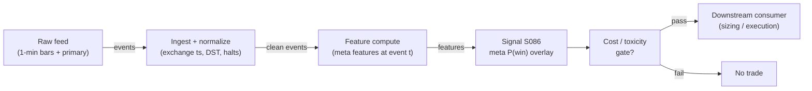

# S086 — Meta-labeling

A second model predicts whether the primary model's bet will win, then sizes or vetoes the bet. The primary supplies the side; the meta supplies the conviction. Meta-labeling converts a directional signal into a bet-sizing function: skip low-probability bets, size the rest by confidence. It cannot create edge — it can only conserve it: fewer bad bets, better-sized good ones. Garbage primary in, garbage meta out [documented].

> Tag law: every numeric literal in prose carries one of `[documented]
> [default] [example] [unverified] [internal-est] [measured]` (legend: Appendix
> i v1.0.0). Constants inside cited formulas inherit the formula's tag.
> Bibliographic years, volumes, pages, arXiv IDs, section numbers, rule codes (C1–C10),
> fail-safe codes (F1–F5), module IDs, and machine-parsed §0 data fields are identifiers,
> not literals, and are exempt.

## §1 Five-minute reviewer card

| Row | Value |
|---|---|
| Module | S086 — Meta-labeling, v1.0.0 |
| Edge verdict | `Build — the meta-model must train on your primary's realized mistakes; there is no off-the-shelf substitute. Prove the primary is net-positive out-of-sample (purged) before building the meta layer.` |
| After-cost | `BEFORE-COST` — as a standalone trigger this is a zero edge (an overlay, not a signal); as a filter/sizer it is a conditional, real edge, conditional on a primary with genuine net-of-cost out-of-sample performance. |
| Build cost | Tier L · `4–12` h [internal-est] · `$600–1,800` loaded [internal-est] |
| Data cost | Event table tiny (~20 MB for 100k events × 50 float32 features); the 1-min bars behind feature history dominate (~50 MB/day per 500 symbols, cost-model §4) [documented]. Feature feed: Tier-1 ~$30–200/mo [unverified]. |
| latency_class | event / microseconds (inference) |
| risk_class | low (signal-only; no order placement) |
| Capacity | `$20–100`M/day notional [example] — overlay only; primary governs |
| Executability | Feasible: sklearn/XGBoost at 100k×50 trains in ~1–10 min [documented]; inference microseconds. |
| Risk summary | Overlay risk: a miscalibrated or leaked meta-model vetoes good bets and sizes bad ones. Dies on garbage primaries, leakage, and cost-blind labels [documented]. |
| When it dies | The primary has no edge at all; too few labeled bets for the feature count; label leakage into the meta-features; overlapping labels validated with naive K-fold; meta-model tuned on the same folds used to select the primary (double-dipping); regime shift in the primary's error pattern [documented]. |
| Regime gates | Provisional: R-volatility elevated → primary error pattern shifts; R-news → adverse-selection regimes the meta-model should veto [example]. |
| Emits | `signal_vector` (Appendix b v1.0.0) — never orders |

## §1.5 Cheapest / least-build path

1. **Prototype hour band:** `4–12` h [internal-est] — meta classifier + calibration + purged validation — reference implementation + gates + fixture validation.
2. **Cheapest-source row:** min_tier = Polygon Stocks Advanced class (Tier-1) — cheapest feature feed [internal-est]; latency_class = 1-min bars (Tier-1);
   required_fields = primary sides; triple-barrier labels; meta features (spread, participation, failure rate); price_band = `~$30–200`/mo [unverified] (indicative — verify before budgeting); build_or_buy = **build** — the meta-model must train on your primary's mistakes [internal-est]; buy only the feature feed.
3. **Resource budget:** `1` core, `<2` GB RAM [internal-est]; compute pattern `per_event`.
4. **Skip list:** continuous sizing calibration (Platt/isotonic) — phase 2; per-side meta-models — phase 2; per-regime meta-models — phase 2.
5. **DO-NOT-CUT list:** causality assertions (`assert fill_event > signal_event`, no-signal-bar-fills test); COST block + callable
   `expected_cost_bps`; F1–F5 fail-safes + module-state enum; decision-log audit records; bona-fide-intent + self-trade prevention; provenance tags on
   every numeric literal; fixtures + `test_cmd`; secrets via env only.
6. **Escalation gate:** upgrade from cheapest when any holds — live filtered precision < validation precision − 2σ [default] → regime shift: refit meta-model on rolling window; taken-bet count < minimum-class floor [default] → primary too weak: drop, do not lower τ.

## §S0 Module contract

### S0.1 Typed signature

```python
def signal(state: ModuleState, events: list[Event], cfg: Config) -> SignalVector:
```

`SignalVector` per Appendix b v1.0.0. `state` is the module-owned named state
vector; `events` are canonical Events (Appendix a v1.0.0), newest last. The
function handles documented edge cases: empty events → `UNKNOWN`; invalid
prices/inputs → `UNKNOWN` (F1, never interpolate); halt/auction events → freeze
per the market-state table.

### S0.2 Config dataclass

| Parameter | Type | Default | Range | Status |
|---|---|---|---|---|
| `tau` | float | `0.55` | `0.5`–`0.7` | example |
| `win_net` | float | `16.0` | `>0` | example |
| `loss_net` | float | `-16.0` | `<0` | example |

All defaults tagged per the tag law (status `default` ⇒ `[default]`, `example` ⇒ `[example]`, `calibrate` set at fit time).

### S0.3 Canonical schema mapping

Vendor columns → canonical Event schema (Appendix a v1.0.0), stated once here:

| Source field | Canonical |
|---|---|
| bar/event timestamp (exchange) | `event_ts` (int64 ns UTC) |
| ingest timestamp | `asof_ts` (int64 ns UTC) |
| symbol | `symbol` |
| side | `side` (module feature input) |
| rvol_z | `rvol_z` (module feature input) |
| sprd_z | `sprd_z` (module feature input) |
| barrier | `barrier` (module feature input) |
| p_hat | `p_hat` (module feature input) |

### S0.4 Time contract

> Time contract: clock domain UTC, int64 ns; authoritative causality clock =
> `event_ts`; max_skew = `1` ms [default]; jitter budget = `500` µs [default];
> bar-label = open time; staleness TTL = `3` s [default] (`3`× the `1`-s reference cadence per F4); gap policy = mask, no interpolation;
> halt/auction → discard contributions across reopen.

**Timing box:** `signal@t (per_event, America/New_York) → earliest fill @open(t+1)`

### S0.5 Market-state table

| State | Module behavior |
|---|---|
| CONTINUOUS_TRADING | Compute normally; emit per cadence |
| HALTED | Freeze state; emit `UNKNOWN`; discard contributions across reopen |
| AUCTION | No new signals; hold last `SignalVector`; state `DEGRADED` |
| CLOSED | Emit nothing; state `OFF` |

### S0.6 Module-state enum + error taxonomy

States per Appendix k v1.0.0: `OK | DEGRADED | UNKNOWN | OFF`. Invalid input →
`UNKNOWN`, never interpolate (Appendix f v1.0.0, F1–F5).

| Failure | State | Alert |
|---|---|---|
| Missing/stale input (TTL `3` s [default] (`3`× the `1`-s reference cadence per F4)) | `UNKNOWN` | page |
| Invalid price/input reaching module (NaN, ≤ 0, non-finite) | `UNKNOWN` | log |
| Feature out of mathematical bounds (F2) | `UNKNOWN` | page |
| `seq` gap > `1,000` events [default] | `DEGRADED` (restart windows) | log |
| Jitter > budget persistently | `DEGRADED` | notify |
| Halt/auction | `UNKNOWN` / `DEGRADED` (per table) | log |
| Kill/administrative disable | `OFF` | page |
| Anything unmapped | `UNKNOWN` | page |

### S0.7 Ops tail

- **Schedule:** continuous during US equities regular session `09:30`–`16:00` America/New_York [documented]; owner: signals on-call.
- **Health checks:** fixture replay (`test_cmd`) green on deploy; live
  `seq`-gap monitor; staleness watchdog at `3`× cadence.
- **Alert table:** page on `UNKNOWN` > `30` s [default] or bounds violation;
  notify on `DEGRADED`; log on single dropped events.
- **Resource budget:** `1` vCPU, `2` GB RAM [internal-est]; state is O(window) per symbol.
- **Runbook stub:** `1.` confirm feed (vendor status); `2.` replay fixture;
  `3.` if red → set `OFF`, page; `4.` reconcile decision log before re-arm.

### S0.8 Secrets (env-only)

`DATA_VENDOR_API_KEY` via environment only. No secrets in this file, fixtures, or
logs (CI secrets-grep).

### S0.9 May / must-NOT

> **May:** emit `SignalVector` records per Appendix b v1.0.0. **Must-NOT:**
> emit orders, order intents, prices, share counts, or notionals; call a
> broker; mutate shared state outside `state`; interpolate across gaps.

## §S1 Legacy (subsumed by §1)

Legacy §S1 content is the §1 reviewer card above; this header is retained so
section numbering stays intact.

## §S2 Specification

### Universe

Any primary's bet events; fixture: 12 synthetic trades [example]

### Entry rule (Boolean — no prose-only conditions)

```
META_SCORE := p̂_t = f̂(x_t, s_t)   (features timestamped ≤ t; label never a feature) [documented]\nVETO       := BET s_t  iff  p̂_t > τ   (else SKIP)\nSIZING      := position = s_t · min(0.5, p̂_t − τ)   [example]\nDIRECTION   := s_t if BET else FLAT  (the meta-model produces no direction of its own)
```

### Exits (with post-exit cooldown)

```
EXIT := the primary's exits (triple-barrier: profit/stop/vertical). The overlay only decides whether the bet is taken and at what size [documented].
```

### Position sizing (fenced function)

```python
def size_shares(risk_budget_R, stop_distance, vol_estimate, ADV_cap, cost):
    # S-module requests capital fraction only; share math lives in the strategy.
    # Reference: capital = 0.5 * confidence  (confidence in [0,1])  [default]
    risk_notional = risk_budget_R * 0.5 * confidence          # [default] 0.5 factor
    shares = risk_notional / max(stop_distance, 1e-9)
    return int(min(shares, ADV_cap * adv_shares * 0.001))     # 0.1% ADV cap [default]
```

### Risk limits

| Limit | Value |
|---|---|
| Max capital fraction per signal | `0.5` [default] |
| Max adverse excursion before `UNKNOWN` review | `2.0`× stop [default] |
| Staleness kill | TTL `3` s [default] (`3`× the `1`-s reference cadence per F4) → `UNKNOWN` |

### COST block (single source of truth)

| Component | Value (bps) | Tag | Basis |
|---|---|---|---|
| Spread | `1.0` | $1.00 round-trip at the $10k example notional = 1.0 bps [example] | XNAS taker |
| Fees | `0.5` | $0.50 commissions/fees = 0.5 bps [example] | venue schedule |
| Borrow | `0.0` | [default] | n/a — no borrow in the chapter's sketch |
| Market impact/slippage | `0.5` | $0.50 adverse selection + execution slippage = 0.5 bps [example] | XNAS taker |
| **Total reference** | `2.0` bps round-trip at the $10k example notional ($2.00) [example] — the chapter's own stack; the overlay places no trades of its own, so this is the primary's cost stack | | |

`fee_schedule_as_of`: `2026-09-01` [unverified] — placeholder; pin the real venue schedule before production. `side`: inherits the primary's side [documented]; venue/tier/source: inherits the primary's venue [example]. Re-stating cost numbers outside this block is a validation failure.

```python
def expected_cost_bps(notional, adv_pct, venue, side, urgency) -> float:
    # Callable cost model - constant stack (impact flagged [example]).
    spread_bps = 1.0   # [example]
    fee_bps = 0.5      # [example]
    borrow_bps = 0.0    # [default] reason in table
    impact_bps = 0.5    # [example] flagged; calibrate per venue at scale-up
    if side == "maker":
        fee_bps = -0.20  # rebate [example]
    return spread_bps + fee_bps + borrow_bps + impact_bps
```

### Execution / fill model table

| Aspect | Assumption |
|---|---|
| Latency | inference microseconds per event [documented]; veto/sizing before order construction |
| Participation | overlay only — participation governed by the primary |

### Robustness

Medium sensitivity: τ=0.5–0.7 [documented range]; the fragile knob is the primary's OOS validity, not τ [documented].

### Compliance sub-block (C1–C10+)

| Code | Rule: trigger → check → action → log |
|---|---|
| C1 | Self-match prevention: S086 emits no orders; downstream T-modules must set self-trade-prevention flags — S086 asserts the requirement in its `consumes` contract: trigger → check → action → log record |
| C2 | Bona-fide intent: every emitted `SignalVector` with |direction|=`1` must pass the cost gate; sub-threshold scores emit direction `0`, never a tradeable hint: trigger → check → action → log record |
| C3 | Message-rate: `≤100` emissions/symbol/s [default]; breach → throttle to `1`/s [default] + alert: trigger → check → action → log record |
| C4 | Fat-finger trio (applied by consumers; S086 bounds its own outputs): confidence ∈ [`0`,`1`], capital ∈ [`0`,`0.5`], computed_at sane — out-of-bounds → `UNKNOWN` (F2): trigger → check → action → log record |
| C5 | Decision log: every emission, veto, and state transition logged per Appendix g v1.0.0, hash-chained: trigger → check → action → log record |
| C6 | Halt/auction: per §S0.5 market-state table; contributions across reopen discarded: trigger → check → action → log record |
| C7 | Locate check: SHORT direction requires `locate_ok` from the consumer; S086 never emits SHORT without the consumer asserting locate (Reg-SHO threshold securities → direction `0`): trigger → check → action → log record |
| C8 | Public dissemination: no signal values published externally without review gate: trigger → check → action → log record |
| C9 | Data entitlements: per §S6 Data rights row; entitlement-class change → §1.5 escalation gate: trigger → check → action → log record |
| C10 | Post-exit cooldown: `cooldown_s` after any exit or compliance block; no re-entry: trigger → check → action → log record |

### Parameter table

| Parameter | Symbol | Value | Tag | Sensitivity |
|---|---|---|---|---|
| Profit barrier multiple | `u` | `1.0` | [example] | medium — small: noisy; large: few wins |
| Stop barrier multiple | `ℓ` | `1.0` | [example] | medium — small: all losses; large: time-barrier dominates |
| Vertical barrier | `h` | `1 session` | [example] | medium — small: truncated; large: overlapping labels |
| Meta threshold | `τ` | `0.55` | [example] | high — small: no filtering; large: too few bets |
| Meta features | `x_t` | `20–50` | [example] | high — few: underfit; many: overfit on few events |

### Timing box

`signal@t (per_event, America/New_York) → earliest fill @open(t+1)`

## §S3 Math + normative pseudocode

At bet event t the primary emits side s_t∈{−1,+1}. Triple-barrier (S085) resolves the bet: y_t=1 if the profit barrier is touched first, else 0. The meta-model is a classifier f̂ on features x_t available at t plus side s_t: p̂_t=f̂(x_t,s_t)≈P(y_t=1|x_t,s_t). Position rule: VETO — bet s_t only if p̂_t>τ; or SIZING — position=s_t·g(p̂_t), e.g. a fractional-Kelly fraction [documented]. p̂_t uses only data ≤t — the label y_t is unknown until the barriers resolve, so it can never be a feature [documented].

Fixture: the chapter's 12-trade synthetic tape (seed 86086 [example]) with the chapter's meta probabilities carried as the model output (the fixture exercises the overlay decision rule, not classifier training). Economics: win +$18, loss −$14, $2 round-trip → taken win +$16, taken loss −$16 [example]. τ=0.55 [example]. Hand-checks: raw precision 4/12=0.333 [documented]; 4 bets clear τ (trades 3,4,6,9); filtered precision 4/4=1.000 [documented]; primary takes all 12 → −$64; filtered takes 4 → +$64 [documented]. The toy is suspiciously clean — a real meta-labeler never reaches 1.000 precision; if yours does, suspect label leakage [documented].

**Normative pseudocode** (pseudocode is normative; prose is commentary):

```
p_hat = meta_model.predict_proba(x_t, s_t)  # features <= t only
if p_hat > TAU:                          # 0.55 [example]
    size = min(0.5, p_hat - TAU)         # fractional sizing [example]
    take_bet(side=s_t, size=size)        # direction from the PRIMARY
else:
    skip()                               # the overlay's value is the skips
```

Causality: the computation at `t` uses only data `≤ t`; earliest reaction is
`t+1`. Mandatory unit test: no-signal-bar fills.

## §S4 Worked example (fixture-backed)

- The primary fires on all 12; raw precision (win fraction) = 4/12 = 0.333 [documented].
- 4 bets clear τ=0.55 (trades 3, 4, 6, 9); filtered precision = 4/4 = 1.000 [documented].
- Primary takes all 12 → 4×(+16)+8×(−16) = −$64; filtered takes 4 → +$64 [documented].
- The value comes from the skips (8 avoided losses), not from better direction [documented].
- P&L sketch is arithmetic, not a backtest [documented].

The P&L sketch (+$64 vs −$64) is arithmetic on a suspiciously clean toy, not a backtest. The honest claim is mechanism (value from skips) plus the replication's filter behavior — never a precision promise [documented].

## §S5 Strategies that use this signal

Generated from `deps.yaml` (CI symmetry); hand-listed here for this module:

| Strategy | Role |
|---|---|
| T020 — Triple-Barrier + Meta-Labeling Overlay | primary overlay: triple-barrier labels train a meta-model over any primary signal (sizing + veto) |
| T088 — Full-Stack Signal Ensemble | primary component: blends S001–S100 with meta-labeling on top and purged-CV validation |
| T092 — PIN/Toxicity Stand-Down | veto: the stand-down rule is itself meta-labeled |
| T025 — Trade-Classification Trend Filter | filter: meta-labels confirm or veto momentum entries |

## §S6 Data required

| Field | Type | Granularity | Source tier | Notes |
|---|---|---|---|---|
| Primary side s_t | int8 ±1 | event | inherits primary | the deployed primary's real signals, not a research version |
| Triple-barrier labels y_t | bool | event | computed locally | causal σ̂; store event intervals [t_0,t_1] |
| Meta features x_t | float32 | event | Tier 1–2 | spread state, participation, recent primary failure rate, regime |
| Event timestamps | ms int64 | event | Tier 1–2 | exchange ts; label interval end t_1 is NOT a feature |
| Corporate actions / halts | calendar | daily/event | Tier 1 | barriers must respect halts and splits |

**Data rights row** (Appendix j v1.0.0): Meta-model code and labels: own research IP. AFML text: purchased book. Feature data: vendor-licensed [documented].

## §S7 Local build (M5 Max / 128 GB)

Feasibility: feasible — one of the lightest ML workloads in the stack. Training on ~100k events × 50 features takes minutes [documented]; inference is microseconds per event. Working set 10–600 MB base, 0.5–5 GB with fold copies [documented] — far under the ~77 GB budget. Stack: Python + polars + XGBoost/scikit-learn (AFML reference stack); Rust buys nothing here. Engineering: Tier L, 4–12 h → $600–1,800 loaded [documented]. Bottleneck is feature quality, not compute; nothing breaks at 500 symbols [documented].

## §S8 Buy vs build

Build. The meta-model must train on your primary's realized mistakes — a prebuilt meta-labeler trained on someone else's strategy is incoherent. Buy only the data feed for the features [documented].

## §S9 Efficacy — documented evidence

| Study / source | Market & period | Metric | Before/after cost | Caveat |
|---|---|---|---|---|
| López de Prado, AFML (2018), ch. 3 §3.6 | Methodological | claim: a secondary classifier raises bet precision and enables probability-proportional sizing [documented] | `BEFORE-COST (design claim, no measured return)` | the book presents the architecture, not a published Sharpe |
| Practitioner replication: lopez-de-prado-work-review (GitHub, 2026) | US ETFs, EMA(20/60) crossover primary | after a 2 bp round-trip cost, XLF/XLV produced <50 net-profitable bets and were dropped by the minimum-class floor [documented] | `AFTER-COST (2 bp)` | not peer-reviewed; the harness acted as a filter, rejecting weak primaries |
| No documented standalone Sharpe for meta-labeling | n/a | absence of evidence [documented-as-absence] | `n/a` | it is an overlay, not a signal — the condition is a primary with genuine net-of-cost OOS performance |

Selection disclosure: these are the sources surfaced by the chapter's research
pass. Fails in: the regimes named in §S10; crowded/overfit calibrations.

## §S10 Failure modes & pitfalls

| # | Trigger → Detect → Action → Recovery | check: |
|---|---|
| 1 | Garbage primary — the cardinal sin → meta-labeling cannot manufacture alpha [documented] → prove the primary net-positive OOS (purged) before the meta layer → primary Sharpe ≤ 0 with meta 'lift' | `check: primary purged Sharpe > 0` |
| 2 | Label leakage into features → any feature using data past event t [documented] → causality audit: every feature timestamped ≤ t → feature asof > t | `check: max feature asof <= t` |
| 3 | Overlapping labels without purging → triple-barrier labels overlap; naive K-fold leaks [documented] → purged/embargoed CV (S088) for all meta validation → plain K-fold on overlapping labels | `check: CV scheme == purged` |
| 4 | Meta-overfitting → grids mined on a few hundred events [documented] → shallow trees; tune only inside train folds → deep grid on <500 events | `check: events/features ratio` |
| 5 | Class imbalance → 80% lose → model predicts 'skip everything' [documented] → class weights; judge by PR-AUC and net P&L, never raw accuracy → accuracy-gated selection | `check: metric == PR-AUC/P&L` |
| 6 | Miscalibrated probabilities → sizing on uncalibrated p̂ overbets [documented] → calibrate (Platt/isotonic) on out-of-fold predictions → raw classifier scores sized directly | `check: calibration curve` |
| 7 | Regime shift in error pattern → meta-model memorizes last year's failure modes [documented] → refit on rolling window; monitor live vs validation precision → static meta-model, no monitoring | `check: live-vs-validation precision` |
| 8 | Cost blindness → labels trained on gross outcomes while the desk pays spread+fees [documented] → train labels on net-of-cost outcomes (2 bp in the replication) → gross-barrier labels | `check: labels net of cost` |

## §S11 Visuals

`../../images/S086_example.png` — synthetic worked-example chart (seed `86` [example]).



## §S12 Source log + unverified leads

**Sources** (citable facts only):

1. López de Prado, M. (2018). Advances in Financial Machine Learning. Wiley. Ch. 3 (§3.6 meta-labeling) and ch. 7 (cross-validation). https://www.wiley.com/go/advancedmachinelearningfinance
2. darufinance (2026). 'lopez-de-prado-work-review — Project 09' (EMA(20/60) primary, triple-barrier labels, bagging meta-labelers, 2 bp cost). https://github.com/darufinance/lopez-de-prado-work-review/blob/HEAD/projects/09_ensembles_importance/writeup/README.md
3. Bailey, D. H., Borwein, J., López de Prado, M., & Zhu, Q. J. (2017). 'The Probability of Backtest Overfitting.' J. Computational Finance 20(4). https://scholarworks.wmich.edu/math_pubs/42/
4. Harvey, C. R. & Liu, Y. (2015). 'Backtesting.' SSRN 2345489. https://papers.ssrn.com/sol3/papers.cfm?abstract_id=2345489

**Chatbot source log.** Duck.ai (GPT-5.6 Luna, `2026-09-10`) answered Q-SB3-1–Q-SB3-3 [chapter QA] (historical batch label SB3; module batch is ID-driven SB9) [measured]. Grok/Cursor answers pending (checked `2026-09-10`).

**Unverified leads** (chatbot-only — never in evidence tables):

- Duck.ai (GPT-5.6 Luna, 2026-09-10), Q-SB3-2: meta-labeler RAM 10–600 MB base, fold copies 0.5–5 GB, cap n_jobs at 4–6 (cost model takes precedence) [unverified].
- Duck.ai (same), Q-SB3-3: 'PRIMARY SUPPLIES THE SIDE'; Sharpe 0.2 → 2.0 via meta-labeling is implausible; triple-barrier/meta-labeling only after the primary shows positive purged OOS [unverified].

---

## Appendix — AI build prompt (S086)

Copy-paste into any chat agent:

> Build module **S086 — Meta-labeling** per `notes/module-template.md` v1.0.0 and this file's §S0 contract.
> Cheapest path (§1.5): prototype `4–12` h [internal-est] — meta classifier + calibration + purged validation; compute pattern `per_event`.
> Implement `signal(state, events, cfg) -> SignalVector` (Appendix b v1.0.0)
> with the §S3 normative pseudocode, including the cost-gate predicate
> `expected_cost_bps(...) <= k * edge_bps` and `assert fill_event >
> signal_event`. Wire F1–F5 (Appendix f v1.0.0): invalid input → `UNKNOWN`,
> never interpolate. Log decisions per Appendix g v1.0.0. Secrets via env
> only. Run the fixture `modules/fixtures/S086_tape.csv`
> (`# TYPE: validation-run`) against `modules/fixtures/S086_expected.csv`
> (tolerance `1e-9` [default]).
> **Definition of done:** `python3 -m pytest modules/tests/test_S086.py -q`
> exits `0`. Tag every numeric literal you add with the unified enum
> (Appendix i v1.0.0); put anything unverifiable in §S12 unverified leads.
