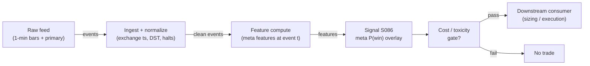

# S086 — Meta-labeling

A second model predicts whether the primary model's bet will win, then sizes or vetoes the bet. The primary supplies the side; the meta supplies the conviction. Meta-labeling converts a directional signal into a bet-sizing function: skip low-probability bets, size the rest by confidence. It cannot create edge — it can only conserve it: fewer bad bets, better-sized good ones. Garbage primary in, garbage meta out [documented].

> Tag law: every numeric literal in prose carries one of `[documented]
> [default] [example] [unverified] [internal-est] [measured]` (legend: Appendix
> i v1.0.0). Constants inside cited formulas inherit the formula's tag.
> Bibliographic years, volumes, pages, arXiv IDs, section numbers, rule codes (C1–C10),
> fail-safe codes (F1–F5), module IDs, and machine-parsed §0 data fields are identifiers,
> not literals, and are exempt.

## §1 Five-minute reviewer card

| Row | Value |
|---|---|
| Module | S086 — Meta-labeling, v1.1.0 |
| Edge verdict | `Build — the meta-model must train on your primary's realized mistakes; there is no off-the-shelf substitute. Prove the primary is net-positive out-of-sample (purged) before building the meta layer.` |
| After-cost | `BEFORE-COST` — as a standalone trigger this is a zero edge (an overlay, not a signal); as a filter/sizer it is a conditional, real edge, conditional on a primary with genuine net-of-cost out-of-sample performance. |
| Build cost | Tier L · `4–12` h [internal-est] · `$600–1,800` loaded [internal-est] |
| Data cost | Event table tiny (~20 MB for 100k events × 50 float32 features); the 1-min bars behind feature history dominate (~50 MB/day per 500 symbols, cost-model §4) [documented]. Feature feed: Massive (Polygon.io) Stocks Developer/Advanced `~$79–199`/mo by tier [unverified] as of `2026-09-10` — indicative; verify at polygon.io/pricing before budgeting. |
| latency_class | event / microseconds (inference) |
| risk_class | low (signal-only; no order placement) |
| Capacity | `$20–100`M/day notional [example] — overlay only; primary governs |
| Executability | Feasible: sklearn/XGBoost at 100k×50 trains in ~1–10 min [documented]; inference microseconds. |
| Risk summary | Overlay risk: a miscalibrated or leaked meta-model vetoes good bets and sizes bad ones. Dies on garbage primaries, leakage, and cost-blind labels [documented]. |
| When it dies | The primary has no edge at all; too few labeled bets for the feature count; label leakage into the meta-features; overlapping labels validated with naive K-fold; meta-model tuned on the same folds used to select the primary (double-dipping); regime shift in the primary's error pattern [documented]. |
| Regime gates | Machine records (provisional — pending the R001–R050 annotation pass): |
```yaml
regime_gates:
  - regime_id: R-volatility
    direction: degrades
    mechanism: elevated volatility shifts the primary's error pattern; the meta-model memorizes last year's failure modes [documented]
    condition: realized_vol_z > 2.0 [example]
    action: halve
    min_lag: 1 session [default]
    unknown_behavior: veto   # [default] restrictive default per template
  - regime_id: R-news
    direction: degrades
    mechanism: news-driven adverse-selection regimes where the primary's fills are toxic [example]
    condition: news_toxicity_flag == true [example]
    action: veto
    min_lag: 0 [default]
    unknown_behavior: veto   # [default] restrictive default per template
``` |
| Emits | `signal_vector` (Appendix b v1.0.0) — never orders |

## §1.5 Cheapest / least-build path

1. **Prototype hour band:** `4–12` h [internal-est] — meta classifier + calibration + purged validation — reference implementation + gates + fixture validation.
2. **Cheapest-source row (structured):**

| min_tier | latency_class | required_fields | price_band | build_or_buy |
|---|---|---|---|---|
| Massive (Polygon.io) Stocks Developer (Tier-1) [unverified as cheapest adequate tier — verify entitlements] | 1-min bars, 15-min delayed acceptable at Developer; real-time requires Advanced | primary sides `s_t`; triple-barrier labels with intervals `[t_0,t_1]`; meta features (spread state, participation, primary failure rate); corporate-action calendar; halt calendar | `~$79–199`/mo by tier [unverified] as of `2026-09-10` — indicative; verify at polygon.io/pricing before budgeting | **build** the meta-model (it must train on your primary's realized mistakes [documented]); **buy** only the feature feed |
3. **Resource budget:** `1` core, `<2` GB RAM [internal-est]; compute pattern `per_event`.
4. **Skip list:** continuous sizing calibration (Platt/isotonic) — phase 2; per-side meta-models — phase 2; per-regime meta-models — phase 2.
5. **DO-NOT-CUT list:** causality assertions (`assert fill_event > signal_event`, no-signal-bar-fills test); COST block + callable
   `expected_cost_bps`; F1–F5 fail-safes + module-state enum; decision-log audit records; bona-fide-intent + self-trade prevention; provenance tags on
   every numeric literal; fixtures + `test_cmd`; secrets via env only.
6. **Escalation gate:** upgrade from cheapest when any holds — live filtered precision < validation precision − 2σ [default] → regime shift: refit meta-model on rolling window; taken-bet count < minimum-class floor [default] → primary too weak: drop, do not lower τ.

## §S0 Module contract

### S0.1 Typed signature

```python
def signal(state: ModuleState, events: list[Event], cfg: Config) -> SignalVector:
```

`SignalVector` per Appendix b v1.0.0. `state` is the module-owned named state
vector; `events` are canonical Events (Appendix a v1.0.0), newest last. The
function handles documented edge cases: empty events → `UNKNOWN`; invalid
prices/inputs → `UNKNOWN` (F1, never interpolate); halt/auction events → freeze
per the market-state table.

### S0.2 Config dataclass

| Parameter | Type | Default | Range | Status |
|---|---|---|---|---|
| `tau` | float | `0.55` | `0.5`–`0.7` | calibrate |
| `win_net` | float | `16.0` | `>0` | calibrate |
| `loss_net` | float | `-16.0` | `<0` | calibrate |
| `cost_gate_k` | float | `0.5` | `0`–`2` | calibrate |

All defaults tagged per the tag law (status `default` ⇒ `[default]`, `example` ⇒ `[example]`, `calibrate` set at fit time — the values above are the chapter's starting points [example], frozen only after the §S2 calibration recipe runs).

### S0.3 Canonical schema mapping

Vendor columns → canonical Event schema (Appendix a v1.0.0), stated once here:

| Source field | Canonical |
|---|---|
| bar/event timestamp (exchange) | `event_ts` (int64 ns UTC) |
| ingest timestamp | `asof_ts` (int64 ns UTC) |
| symbol | `symbol` |
| side | `side` (module feature input) |
| rvol_z | `rvol_z` (module feature input) |
| sprd_z | `sprd_z` (module feature input) |
| barrier | `barrier` (module feature input) |
| p_hat | `p_hat` (module feature input) |

### S0.4 Time contract

> Time contract: clock domain UTC, int64 ns; authoritative causality clock =
> `event_ts`; max_skew = `1` ms [default]; jitter budget = `500` µs [default];
> bar-label = open time; staleness TTL = `3` s [default] (`3`× the `1`-s reference cadence per F4); gap policy = mask, no interpolation;
> halt/auction → discard contributions across reopen.

**Timing box:** `signal@t (per_event, America/New_York) → earliest fill @open(t+1)`

### S0.5 Market-state table

| State | Module behavior |
|---|---|
| CONTINUOUS_TRADING | Compute normally; emit per cadence |
| HALTED | Freeze state; emit `UNKNOWN`; discard contributions across reopen |
| AUCTION | No new signals; hold last `SignalVector`; state `DEGRADED` |
| CLOSED | Emit nothing; state `OFF` |

### S0.6 Module-state enum + error taxonomy

States per Appendix k v1.0.0: `OK | DEGRADED | UNKNOWN | OFF`. Invalid input →
`UNKNOWN`, never interpolate (Appendix f v1.0.0, F1–F5).

| Failure | State | Alert |
|---|---|---|
| Missing/stale input (TTL `3` s [default] (`3`× the `1`-s reference cadence per F4)) | `UNKNOWN` | page |
| Invalid price/input reaching module (NaN, ≤ 0, non-finite) | `UNKNOWN` | log |
| Feature out of mathematical bounds (F2) | `UNKNOWN` | page |
| `seq` gap > `1,000` events [default] | `DEGRADED` (restart windows) | log |
| Jitter > budget persistently | `DEGRADED` | notify |
| Halt/auction | `UNKNOWN` / `DEGRADED` (per table) | log |
| Kill/administrative disable | `OFF` | page |
| Anything unmapped | `UNKNOWN` | page |

### S0.7 Ops tail

- **Schedule:** continuous during US equities regular session `09:30`–`16:00` America/New_York [documented]; owner: signals on-call.
- **Health checks:** fixture replay (`test_cmd`) green on deploy; live
  `seq`-gap monitor; staleness watchdog at `3`× cadence.
- **Alert table:** page on `UNKNOWN` > `30` s [default] or bounds violation;
  notify on `DEGRADED`; log on single dropped events.
- **Resource budget:** `1` vCPU, `2` GB RAM [internal-est]; state is O(window) per symbol.
- **Runbook stub:** `1.` confirm feed (vendor status); `2.` replay fixture;
  `3.` if red → set `OFF`, page; `4.` reconcile decision log before re-arm.

### S0.8 Secrets (env-only)

`DATA_VENDOR_API_KEY` via environment only. No secrets in this file, fixtures, or
logs (CI secrets-grep).

### S0.9 May / must-NOT

> **May:** emit `SignalVector` records per Appendix b v1.0.0. **Must-NOT:**
> emit orders, order intents, prices, share counts, or notionals; call a
> broker; mutate shared state outside `state`; interpolate across gaps.

## §S1 Legacy (subsumed by §1)

Legacy §S1 content is the §1 reviewer card above; this header is retained so
section numbering stays intact.

## §S2 Specification

### Universe

Any primary's bet events; fixture: 12 synthetic trades [example]

### Entry rule (Boolean — no prose-only conditions)

```
META_SCORE := p̂_t = f̂(x_t, s_t)   (features timestamped ≤ t; label never a feature) [documented]
TAU_GATE   := p̂_t > τ              (strict inequality; p̂_t = τ → SKIP) [default]
COST_GATE  := expected_cost_bps(notional_ref, adv_pct, venue, side, urgency) ≤ k · edge_bps,
              k = 0.5 [default], edge_bps = (2·p̂_t − 1) · 16.0 [example]
VETO       := BET s_t  iff  TAU_GATE AND COST_GATE   (else SKIP)
SIZING     := capital = min(0.5, p̂_t − τ)   [example]
DIRECTION  := s_t if BET else FLAT  (the meta-model produces no direction of its own)
```

### Exits (with post-exit cooldown)

```
EXIT := the primary's exits (triple-barrier: profit/stop/vertical). The overlay only decides whether the bet is taken and at what size [documented].
```

### Position sizing (fenced function)

```python
def size_shares(risk_budget_R, stop_distance, vol_estimate, ADV_cap, cost,
                confidence, adv_shares):
    # S-module requests capital fraction only; share math lives in the strategy.
    # All symbols are bound by the signature. Reference: capital = 0.5 * confidence
    # (confidence in [0,1])  [default]
    risk_notional = risk_budget_R * 0.5 * confidence          # [default] 0.5 factor
    shares = risk_notional / max(stop_distance, 1e-9)
    return int(min(shares, ADV_cap * adv_shares * 0.001))     # 0.1% ADV cap [default]
```

### Risk limits

| Limit | Value |
|---|---|
| Max capital fraction per signal | `0.5` [default] |
| Max adverse excursion before `UNKNOWN` review | `2.0`× stop [default] |
| Staleness kill | TTL `3` s [default] (`3`× the `1`-s reference cadence per F4) → `UNKNOWN` |

### COST block (single source of truth)

| Component | Value (bps) | Tag | Basis |
|---|---|---|---|
| Spread | `1.0` | [example] | $1.00 round-trip at the $10k example notional; XNAS taker |
| Fees | `0.5` | [example] | $0.50 commissions/fees at the $10k example notional; venue schedule |
| Borrow | `0.0` | [default] | `borrow_bps_per_day` = `0.0` [default] — reason: the overlay emits no orders and holds no inventory; any borrow accrues to the primary's cost stack, not this module [documented] |
| Market impact/slippage | `0.5` | [example] | $0.50 adverse selection + execution slippage at the $10k example notional; XNAS taker; calibrate per venue at scale-up |
| **Total reference** | `2.0` bps round-trip at the $10k example notional ($2.00) [example] — constant-stack reference from the Project 09 replication; the overlay places no trades of its own |

`fee_schedule_as_of`: `2026-09-01` [unverified] — placeholder; pin the primary's real venue schedule before production and restack here (and only here). `side`: `taker` [example] — the 2.0 bp reference stack mirrors the Project 09 replication's XNAS taker fills; when the primary's execution style is known, override `side` and restack this block. venue/tier/source: inherits the primary's venue [example]. Re-stating cost numbers outside this block is a validation failure.

```python
def expected_cost_bps(notional, adv_pct, venue, side, urgency) -> float:
    # Callable cost model — constant stack; mirrors the COST block exactly.
    spread_bps = 1.0   # [example]
    fee_bps    = 0.5   # [example]
    borrow_bps = 0.0   # [default] reason: overlay places no trades and holds no
                       # inventory; any borrow belongs to the primary's cost stack
    impact_bps = 0.5   # [example] flagged; calibrate per venue at scale-up
    return spread_bps + fee_bps + borrow_bps + impact_bps
    # == 2.0 bps round-trip at the $10k example notional [example]
```

### Execution / fill model table

| Aspect | Assumption |
|---|---|
| Latency | inference microseconds per event [documented]; veto/sizing before order construction |
| Participation | overlay only — participation governed by the primary |

### Robustness

Medium sensitivity: τ=0.5–0.7 [documented range]; the fragile knob is the primary's OOS validity, not τ [documented].

### Compliance sub-block (C1–C10+)

| Code | Rule: trigger → check → action → log |
|---|---|
| C1 | Self-match prevention: S086 emits no orders; downstream T-modules must set self-trade-prevention flags — S086 asserts the requirement in its `consumes` contract: trigger → check → action → log record |
| C2 | Bona-fide intent: every emitted `SignalVector` with |direction|=`1` must pass the cost gate; sub-threshold scores emit direction `0`, never a tradeable hint: trigger → check → action → log record |
| C3 | Message-rate: `≤100` emissions/symbol/s [default]; breach → throttle to `1`/s [default] + alert: trigger → check → action → log record |
| C4 | Fat-finger trio (applied by consumers; S086 bounds its own outputs): confidence ∈ [`0`,`1`], capital ∈ [`0`,`0.5`], computed_at sane — out-of-bounds → `UNKNOWN` (F2): trigger → check → action → log record |
| C5 | Decision log: every emission, veto, and state transition logged per Appendix g v1.0.0, hash-chained: trigger → check → action → log record |
| C6 | Halt/auction: per §S0.5 market-state table; contributions across reopen discarded: trigger → check → action → log record |
| C7 | Locate check: SHORT direction requires `locate_ok` from the consumer; S086 never emits SHORT without the consumer asserting locate (Reg-SHO threshold securities → direction `0`): trigger → check → action → log record |
| C8 | Public dissemination: no signal values published externally without review gate: trigger → check → action → log record |
| C9 | Data entitlements: per §S6 Data rights row; entitlement-class change → §1.5 escalation gate: trigger → check → action → log record |
| C10 | Post-exit cooldown: `cooldown_s` after any exit or compliance block; no re-entry: trigger → check → action → log record |

### Parameter table

| Parameter | Symbol | Value | Tag | Sensitivity |
|---|---|---|---|---|
| Profit barrier multiple | `u` | `1.0` | [example] | medium — small: noisy; large: few wins |
| Stop barrier multiple | `ℓ` | `1.0` | [example] | medium — small: all losses; large: time-barrier dominates |
| Vertical barrier | `h` | `1 session` | [example] | medium — small: truncated; large: overlapping labels |
| Meta threshold | `τ` | `0.55` | calibrate — see recipe below | high — small: no filtering; large: too few bets |
| Cost-gate multiplier | `k` | `0.5` | calibrate — see recipe below | medium — small: gate binds too often; large: gate never binds |
| Meta features | `x_t` | `20–50` | [example] | high — few: underfit; many: overfit on few events |
| Win/loss accounting | `win_net` / `loss_net` | `+16.0` / `−16.0` | calibrate — recomputed from purged net-of-cost barrier outcomes | low — accounting identity, not a tuning knob |

### Calibration recipe (per-parameter grid + walk-forward OOS selection)

`τ` (and `k`, `win_net`/`loss_net`) are fittable — status `calibrate` in §S0.2. The
recipe below is normative for the fit step; the fixture uses the chapter's starting
points (`τ=0.55`, `k=0.5`, `win_net=16.0`, `loss_net=−16.0` [example]).

| Parameter | Grid | Fold design | Embargo / purge | Selection metric | Freeze rule |
|---|---|---|---|---|---|
| `τ` | `0.50`–`0.70` step `0.01` (`11` pts) [default] | expanding-window walk-forward, `5` folds [default] | purge: drop train events whose label interval `[t_0,t_1]` overlaps the validation fold; embargo: `1` session after each validation fold [default] | max filtered net-of-cost P&L with filtered precision > raw precision; tie-break: higher taken-bet count [default] | freeze `τ` for `1` quarter [default]; refit only when live filtered precision < validation precision − `2`σ |
| `cost_gate_k` | `0.25`, `0.5`, `1.0`, `2.0` [default] | same folds as `τ` | same purge/embargo | max filtered net P&L subject to every taken bet passing the gate [default] | freeze with `τ` |
| `win_net` / `loss_net` | derived — recompute from purged calibration-window barrier outcomes net of cost | same folds as `τ` | same purge/embargo | n/a — accounting identity | recompute at each refit |

Minimum-data guard: do not fit `τ` unless taken-bet candidates ≥ `10`× grid points (`110` bets) [default] — below that, hold the chapter default `0.55` [default] (see §1.5 escalation gate).

### Timing box

`signal@t (per_event, America/New_York) → earliest fill @open(t+1)`

## §S3 Math + normative pseudocode

At bet event t the primary emits side s_t∈{−1,+1}. Triple-barrier (S085) resolves the bet: y_t=1 if the profit barrier is touched first, else 0. The meta-model is a classifier f̂ on features x_t available at t plus side s_t: p̂_t=f̂(x_t,s_t)≈P(y_t=1|x_t,s_t). Position rule: VETO — bet s_t only if p̂_t>τ; or SIZING — position=s_t·g(p̂_t), e.g. a fractional-Kelly fraction [documented]. p̂_t uses only data ≤t — the label y_t is unknown until the barriers resolve, so it can never be a feature [documented].

Fixture: the chapter's 12-trade synthetic tape (seed 86086 [example]) with the chapter's meta probabilities carried as the model output (the fixture exercises the overlay decision rule, not classifier training). Economics: win +$18, loss −$14, $2 round-trip → taken win +$16, taken loss −$16 [example]. τ=0.55 [example]. Hand-checks: raw precision 4/12=0.333 [documented]; 4 bets clear τ (trades 3,4,6,9); filtered precision 4/4=1.000 [documented]; primary takes all 12 → −$64; filtered takes 4 → +$64 [documented]. The toy is suspiciously clean — a real meta-labeler never reaches 1.000 precision; if yours does, suspect label leakage [documented].

**Normative pseudocode** (pseudocode is normative; prose is commentary). Every
symbol is bound below; every prose guard appears inline.

```
function signal(state, events, cfg) -> SignalVector:
    # ---- bound inputs ----
    e        = last(events)                       # canonical Event (Appendix a v1.0.0)
    s_t      = e.side                             # in {-1, +1}; the PRIMARY's side
    x_t      = e.meta_features                    # float32 vector; every feature timestamped <= e.event_ts
    t        = e.event_ts                         # int64 ns UTC; authoritative causality clock
    now      = ingest_now_ns()                    # wall clock; used for staleness only
    meta     = state.meta_model                   # classifier f̂; fitted offline on purged labels only
    tau      = cfg.tau                            # 0.55 [default]
    k        = cfg.cost_gate_k                    # 0.5 [default]
    TTL      = 3_000_000_000                      # staleness TTL 3 s [default] (3x the 1-s reference cadence, F4)
    REF_BPS  = 16.0                               # win_net at the $10k reference notional, in bps [example]

    # ---- guards (fail-closed; any violation -> UNKNOWN, never interpolate; F1) ----
    if state.admin_off:
        return SV(t, 0, 0.0, 0.0, OFF)            # kill/administrative disable
    if e.market_state == HALTED:                  # §S0.5: freeze; discard contributions across reopen
        state.freeze()
        state.discard_across_reopen = true
        return SV(t, 0, 0.0, 0.0, UNKNOWN)
    if e.market_state == AUCTION:                 # §S0.5: no new signals; hold last; DEGRADED
        return hold_last(state) with state = DEGRADED
    if now - e.asof_ts > TTL:                     # staleness; never interpolate across gaps
        return SV(t, 0, 0.0, 0.0, UNKNOWN)
    if not finite(t) or s_t not in {-1, +1}:      # invalid timestamp/side (F2)
        return SV(t, 0, 0.0, 0.0, UNKNOWN)
    if any(not finite(v) for v in x_t):           # invalid features (F2)
        return SV(t, 0, 0.0, 0.0, UNKNOWN)
    if s_t == -1 and not state.locate_ok:         # locate gate (C7, Reg-SHO)
        return SV(t, 0, 0.0, 0.0, OK)             # veto the SHORT, not an error: direction 0
    if t <= state.cooldown_until_ns:              # post-exit / compliance cooldown (C10)
        return SV(t, 0, 0.0, 0.0, UNKNOWN)

    # ---- core: meta probability from data <= t only ----
    p_hat = meta.predict_proba(x_t, s_t)          # the label y_t is unknown until the
                                                  # barriers resolve, so it can never be a feature
    if not (0.0 <= p_hat <= 1.0):                 # probability bounds (F2)
        return SV(t, 0, 0.0, 0.0, UNKNOWN)

    # ---- gates ----
    tau_gate  = (p_hat > tau)                     # strict inequality [default]; p_hat == tau -> SKIP
    edge_bps  = (2 * p_hat - 1) * REF_BPS         # expected edge per bet, in bps [example]
    cost_bps  = expected_cost_bps(notional=10000.0, adv_pct=state.adv_pct,
                                  venue=state.primary_venue, side=s_t, urgency="normal")
    cost_gate = (cost_bps <= k * edge_bps)        # executable fee-covering predicate [default]

    if tau_gate and cost_gate:
        direction, capital, decision = s_t, min(0.5, p_hat - tau), 1   # fractional sizing [example]
    else:
        direction, capital, decision = 0, 0.0, 0  # the overlay's value is the skips

    # ---- causality: a signal computed at t can only fill after t ----
    signal_event = t
    fill_event   = next_bar_open_ns(t)            # earliest fill @open(t+1); per_event cadence
    assert fill_event > signal_event, "no signal-bar fills"

    return SignalVector(symbol=e.symbol, computed_at=t, direction=direction,
                        confidence=p_hat, capital=capital, state=OK,
                        edge_bps=edge_bps * decision, cost_bps=cost_bps, decision=decision)

# SV(t, direction, confidence, capital, state) builds a canonical SignalVector
# (Appendix b v1.0.0) stamped computed_at=t. hold_last(state) re-emits the
# previous SignalVector unchanged.
```

Causality: the computation at `t` uses only data `≤ t`; earliest reaction is
`t+1`. Mandatory unit test: no-signal-bar fills (`test_no_signal_bar_fills`,
`test_causality_pin` in `tests/test_S086.py`).

## §S4 Worked example (fixture-backed)

- The primary fires on all 12; raw precision (win fraction) = 4/12 = 0.333 [documented].
- 4 bets clear τ=0.55 (trades 3, 4, 6, 9); filtered precision = 4/4 = 1.000 [documented].
- Primary takes all 12 → 4×(+16)+8×(−16) = −$64; filtered takes 4 → +$64 [documented].
- The value comes from the skips (8 avoided losses), not from better direction [documented].
- P&L sketch is arithmetic, not a backtest [documented].

The P&L sketch (+$64 vs −$64) is arithmetic on a suspiciously clean toy, not a backtest. The honest claim is mechanism (value from skips) plus the replication's filter behavior — never a precision promise [documented].

Cost-gate check on the 4 taken bets: `edge_bps` ∈ {`14.08`, `13.44`, `10.88`, `6.40`} [example], `k·edge_bps` ≥ `3.20` > `2.0` cost in every case — the gate never binds on this toy [documented]. Bets with `τ < p̂_t < 0.625` would clear `τ` but be vetoed by the gate (covered by `test_cost_gate_veto_path`).

## §S5 Strategies that use this signal

Generated from `deps.yaml` (CI symmetry); hand-listed here for this module:

| Strategy | Role |
|---|---|
| T020 — Triple-Barrier + Meta-Labeling Overlay | primary overlay: triple-barrier labels train a meta-model over any primary signal (sizing + veto) |
| T088 — Full-Stack Signal Ensemble | primary component: blends S001–S100 with meta-labeling on top and purged-CV validation |
| T092 — PIN/Toxicity Stand-Down | veto: the stand-down rule is itself meta-labeled |
| T025 — Trade-Classification Trend Filter | filter: meta-labels confirm or veto momentum entries |

## §S6 Data required

| Field | Type | Granularity | Vendor / product | Endpoint / schema | Required fields | Notes |
|---|---|---|---|---|---|---|
| 1-min bars (feature history) | float32 OHLCV | 1-min | Massive (Polygon.io — rebranded 2026 [unverified]) Stocks Developer, Tier-1 | `GET /v2/aggs/ticker/{symbol}/range/1/minute/{from}/{to}`; response schema: `T` (ticker), `o/h/l/c` (OHLC), `v` (volume), `vw` (VWAP), `t` (ms timestamp), `n` (tx count) | `c`, `v`, `vw`, `t` | price band `~$79–199`/mo by tier [unverified] as of `2026-09-10` — indicative from third-party docs; verify at polygon.io/pricing before budgeting. 15-min delayed at Developer tier is acceptable for end-of-session feature builds; real-time requires Advanced. |
| Primary side s_t | int8 ±1 | event | own — the deployed primary's event store (parquet) | internal; mapped to canonical `side` in §S0.3 | `side`, `event_ts` | the deployed primary's real signals, not a research version [documented] |
| Triple-barrier labels y_t | bool | event | computed locally | own labeler; store event interval `[t_0, t_1]` and barrier hit | `t_0`, `t_1`, `barrier_hit` | causal σ̂; label interval end `t_1` is NOT a feature |
| Meta features x_t | float32 | event | computed locally from the bar feed | internal feature store | spread state, participation, recent primary failure rate | `20–50` features [example]; see §S2 |
| Corporate actions (splits/dividends) | calendar | daily | Massive reference endpoints, Tier-1 (same vendor as bars) | `GET /v3/reference/splits`, `GET /v3/reference/dividends` | `execution_date`, `split_from`/`split_for` | barriers must respect splits and halts [documented] |
| Halts / market status | calendar/event | event | vendor market-status endpoint; exchange halt notices [unverified] | vendor-specific | halt start/end | contributions across reopen discarded (§S0.5) |

**Data rights row** (Appendix j v1.0.0): Meta-model code and labels: own research IP. AFML text: purchased book. Feature data: vendor-licensed (Massive/Polygon.io Stocks Developer, Tier-1) [documented].

## §S7 Local build (M5 Max / 128 GB)

Feasibility: feasible — one of the lightest ML workloads in the stack. Training on ~100k events × 50 features takes minutes [documented]; inference is microseconds per event. Working set 10–600 MB base, 0.5–5 GB with fold copies [documented] — far under the ~77 GB budget. Stack: Python + polars + XGBoost/scikit-learn (AFML reference stack); Rust buys nothing here. Engineering: Tier L, 4–12 h → $600–1,800 loaded [documented]. Bottleneck is feature quality, not compute; nothing breaks at 500 symbols [documented].

## §S8 Buy vs build

Build. The meta-model must train on your primary's realized mistakes — a prebuilt meta-labeler trained on someone else's strategy is incoherent. Buy only the data feed for the features [documented].

## §S9 Efficacy — documented evidence

| Study / source | Market & period | Metric | Before/after cost | Caveat |
|---|---|---|---|---|
| López de Prado, AFML (2018), ch. 3 §3.6 | Methodological | claim: a secondary classifier raises bet precision and enables probability-proportional sizing [documented] | `BEFORE-COST (design claim, no measured return)` | the book presents the architecture, not a published Sharpe |
| darufinance (2026), Project 09: ensembles + meta-labeling on an EMA(20/60) crossover primary, triple-barrier labels, purged k-fold + embargo, 2 bp round-trip cost | 40 instruments × 3 markets (27 crypto perp dollar-bars, 5 US-equity ETF dollar-bars, 8 FX tick-bars); ~20k bars/instrument | DSR net of cost (headline); OOS log-loss | `AFTER-COST (2 bp)` | bagging OOS log-loss `0.68` vs boosting `0.81` (worse than coin-flip ln2≈`0.693`); bagging generalization gap ~`5`× smaller (Wilcoxon p=`1.8e-12`); median bet Sharpe negative for both; `0/40` DSR>`0.95`; XLF/XLV dropped by the minimum-class floor (<`50` net-profitable bets) [documented] |
| darufinance (2026), Project 03b (via Project 04 synthesis): meta-label on an edged primary | 2 crypto perp pairs (focused sample), then 6 edges × 26 pairs (156 configs) | profit factor; per-trade bp; DSR | `AFTER-COST` | with the precondition met (2-pair sample): PF `1.26`→`1.79`, per-trade `47`→`148` bp, DSR `0.64`→`0.78`; at scale (154 traded configs): pooled DSR `0.0`, median per-trade lift only +`4.7` bp — the lift washes out under deflation [documented] |
| No documented standalone Sharpe for meta-labeling | n/a | absence of evidence [documented-as-absence] | `n/a` | it is an overlay, not a signal — the condition is a primary with genuine net-of-cost OOS performance |

Selection disclosure: these are the sources surfaced by the chapter's research
pass. Fails in: the regimes named in §S10; crowded/overfit calibrations.

## §S10 Failure modes & pitfalls

| # | Trigger → Detect → Action → Recovery | check: |
|---|---|
| 1 | Garbage primary — the cardinal sin → meta-labeling cannot manufacture alpha [documented] → prove the primary net-positive OOS (purged) before the meta layer → primary Sharpe ≤ 0 with meta 'lift' | `check: primary purged Sharpe > 0` |
| 2 | Label leakage into features → any feature using data past event t [documented] → causality audit: every feature timestamped ≤ t → feature asof > t | `check: max feature asof <= t` |
| 3 | Overlapping labels without purging → triple-barrier labels overlap; naive K-fold leaks [documented] → purged/embargoed CV (S088) for all meta validation → plain K-fold on overlapping labels | `check: CV scheme == purged` |
| 4 | Meta-overfitting → grids mined on a few hundred events [documented] → shallow trees; tune only inside train folds → deep grid on <500 events | `check: events/features ratio` |
| 5 | Class imbalance → 80% lose → model predicts 'skip everything' [documented] → class weights; judge by PR-AUC and net P&L, never raw accuracy → accuracy-gated selection | `check: metric == PR-AUC/P&L` |
| 6 | Miscalibrated probabilities → sizing on uncalibrated p̂ overbets [documented] → calibrate (Platt/isotonic) on out-of-fold predictions → raw classifier scores sized directly | `check: calibration curve` |
| 7 | Regime shift in error pattern → meta-model memorizes last year's failure modes [documented] → refit on rolling window; monitor live vs validation precision → static meta-model, no monitoring | `check: live-vs-validation precision` |
| 8 | Cost blindness → labels trained on gross outcomes while the desk pays spread+fees [documented] → train labels on net-of-cost outcomes (2 bp in the replication) → gross-barrier labels | `check: labels net of cost` |

## §S11 Visuals

`../../images/S086_example.png` — synthetic worked-example chart (seed `86` [example]).



## §S12 Source log + unverified leads

**Sources** (citable facts only):

1. López de Prado, M. (2018). Advances in Financial Machine Learning. Wiley. Ch. 3 (§3.6 meta-labeling, §3.7 how to use meta-labeling) and ch. 7 (cross-validation, purged/embargoed K-fold). https://www.wiley.com/go/advancedmachinelearningfinance
2. darufinance (2026). 'lopez-de-prado-work-review — Project 09' (EMA(20/60) primary, triple-barrier labels, bagging vs boosting meta-labelers, purged k-fold + embargo, 2 bp cost; XLF/XLV dropped by minimum-class floor). https://github.com/darufinance/lopez-de-prado-work-review/blob/HEAD/projects/09_ensembles_importance/writeup/README.md
3. darufinance (2026). 'lopez-de-prado-work-review — Project 04' (meta-label correction synthesis incl. Project 03b: meta-label on an edged primary — PF 1.26→1.79, per-trade 47→148 bp, DSR 0.64→0.78 on the 2-pair sample; pooled DSR 0.0 at scale). https://github.com/darufinance/lopez-de-prado-work-review/blob/HEAD/projects/04_cross_validation/writeup/README.md
4. Bailey, D. H., Borwein, J., López de Prado, M., & Zhu, Q. J. (2017). 'The Probability of Backtest Overfitting.' J. Computational Finance 20(4), 39–69. DOI 10.21314/JCF.2016.322. SSRN 2326253. https://scholarworks.wmich.edu/math_pubs/42/
5. Harvey, C. R. & Liu, Y. (2015). 'Backtesting.' SSRN 2345489 (date written July 28, 2015; first posted Oct 2013; revised July 2015). https://papers.ssrn.com/sol3/papers.cfm?abstract_id=2345489

**Chatbot source log.** Duck.ai (GPT-5.6 Luna, `2026-09-10`) answered Q-SB3-1–Q-SB3-3 [chapter QA] (historical batch label SB3; module batch is ID-driven SB9) [measured]. Grok/Cursor answers pending (checked `2026-09-10`).

**Unverified leads** (chatbot-only — never in evidence tables):

- Duck.ai (GPT-5.6 Luna, 2026-09-10), Q-SB3-2: meta-labeler RAM 10–600 MB base, fold copies 0.5–5 GB, cap n_jobs at 4–6 (cost model takes precedence) [unverified].
- Duck.ai (same), Q-SB3-3: 'PRIMARY SUPPLIES THE SIDE'; Sharpe 0.2 → 2.0 via meta-labeling is implausible; triple-barrier/meta-labeling only after the primary shows positive purged OOS [unverified].
- Massive (Polygon.io) Stocks Developer/Advanced price band `~$79–199`/mo as of 2026-09-10 is indicative from third-party docs (official pricing page not reachable in this review) — verify at polygon.io/pricing before budgeting; the 2026 Polygon→Massive rebrand is likewise single-sourced [unverified].
- Production fee-schedule pin: `fee_schedule_as_of` is a placeholder (`2026-09-01` [unverified]); the primary's real venue schedule must be pinned and the COST block restacked before production [unverified].
- GROK-NEEDED: (1) practitioner embargo convention for τ calibration on overlapping triple-barrier labels — one full label-span vs one session, and τ sensitivity to the choice; (2) whether the Project 09 minimum-class floor (<50 net-profitable bets) is a documented practitioner consensus or project-specific; (3) a documented basis for the cost-gate multiplier k (0.5 vs 2) in the AFML/practitioner literature. Web search could not answer these; do not guess.

---

## Appendix — AI build prompt (S086)

Copy-paste into any chat agent:

> Build module **S086 — Meta-labeling** (v1.1.0) per `notes/module-template.md` v1.0.0 and this file's §S0 contract.
> Cheapest path (§1.5): prototype `4–12` h [internal-est] — meta classifier + calibration + purged validation; compute pattern `per_event`.
> Implement `signal(state, events, cfg) -> SignalVector` (Appendix b v1.0.0)
> with the §S3 normative pseudocode: all symbols bound; fail-closed guards
> (locate / cooldown / staleness / halt → `UNKNOWN`, never interpolate); the
> executable cost-gate predicate `expected_cost_bps(...) <= k * edge_bps`
> (k = `cost_gate_k` = `0.5` [default]); and `assert fill_event > signal_event`.
> Fit `τ`/`k`/`win_net`/`loss_net` with the §S2 calibration recipe (purged/
> embargoed walk-forward OOS) — do not hand-tune them. Wire F1–F5 (Appendix f
> v1.0.0): invalid input → `UNKNOWN`, never interpolate. Log decisions per
> Appendix g v1.0.0. Secrets via env only. Run the fixture
> `modules/fixtures/S086_tape.csv` (`# TYPE: validation-run`) against
> `modules/fixtures/S086_expected.csv` (tolerance `1e-9` [default]).
> **Definition of done:** `python3 -m pytest modules/tests/test_S086.py -q`
> exits `0`. Tag every numeric literal you add with the unified enum
> (Appendix i v1.0.0); put anything unverifiable in §S12 unverified leads.
