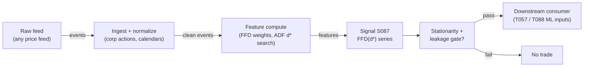

# S087 — Fractional differentiation (memory-retaining stationarization)

A preprocessing transform: differentiate a price series to a fractional order d — just enough to make it stationary while preserving the long memory that integer differencing (returns) destroys. Find the smallest d (d*) at which an ADF test first rejects nonstationarity, while the transformed series still correlates strongly with the original log prices. This is plumbing, not alpha: it never generates a trading signal by itself [documented].

> Tag law: every numeric literal in prose carries one of `[documented]
> [default] [example] [unverified] [internal-est] [measured]` (legend: Appendix
> i v1.0.0). Constants inside cited formulas inherit the formula's tag.
> Bibliographic years, volumes, pages, arXiv IDs, section numbers, rule codes (C1–C10),
> fail-safe codes (F1–F5), module IDs, and machine-parsed §0 data fields are identifiers,
> not literals, and are exempt.

## §1 Five-minute reviewer card

| Row | Value |
|---|---|
| Module | S087 — Fractional differentiation (memory-retaining stationarization), v1.1.0 |
| Edge verdict | `Always build the transform; buy only the price feed. FFD is a published 15-line binomial-weight formula — there is nothing to license. The trading value flows entirely through the models it feeds (T057, T088).` |
| After-cost | `INFRASTRUCTURE` — no documented standalone Sharpe exists for fractional differentiation; it is a preprocessing step and the literature treats it that way. |
| Build cost | Tier M · `20–40` h [internal-est] · `$3,000–6,000` loaded [internal-est] |
| Data cost | Tier-0 research: `$0`/mo (Stooq daily CSV [documented]; Alpaca Basic free tier, 200 req/min IEX [documented]) · production 1-min: Polygon (now Massive) Stocks Advanced `$199`/mo [documented, as-of 2026-06-05] · 500 symbols × 1-min ≈ 50 MB/day parquet; 60-day panel ≈ 3 GB [documented] |
| latency_class | batch / offline |
| risk_class | low (signal-only; no order placement) |
| Capacity | n/a — feature transform; no positions [documented] |
| Executability | Trivial: numpy convolution; the d* search is seconds per universe [documented]. |
| Risk summary | Feature-integrity risk: leaked or mis-tuned d* silently degrades every downstream model. Dies on lookahead, d mis-setting, and unadjusted prices [documented]. |
| When it dies | d fitted on the full sample (lookahead); d too high (memory erased — expensive returns) or too low (nonstationary inputs silently break the model); structural breaks the ADF test cannot see; truncation too aggressive (large τ cuts the long tail that is the memory); unadjusted prices across corporate actions [documented]. |
| Regime gates | Machine records (provisional IDs; map to R001–R050 on the R-annotation pass) [default]: |
```yaml
regime_gates:
  - regime_id: R-structural-break
    direction: degrades
    mechanism: "d* fitted under the old regime is meaningless; the ADF test cannot see the break"
    condition: "break date inside the production window"
    action: veto
    min_lag: "immediate — gate the features out (UNKNOWN) until refit on post-break data"
    unknown_behavior: "regime state unknown -> emit UNKNOWN; features gated out of every model"
  - regime_id: R-volatility-elevated
    direction: degrades
    mechanism: "ADF power falls under heteroskedasticity; the corr(x, log-price) monitor is noisy"
    condition: "realized vol above the 90th percentile of the trailing 252d [default]"
    action: pause_entry
    min_lag: "keep last good d*; start no d* refit while the regime holds"
    unknown_behavior: "regime state unknown -> widen the d* search grid on the next scheduled refit"
``` |
| Emits | `signal_vector` (Appendix b v1.0.0) — never orders |

## §1.5 Cheapest / least-build path

1. **Prototype hour band:** `20–40` h [internal-est] — standalone filter is an afternoon; leakage-safe rolling version with stationarity testing + purged d* selection is the rest — reference implementation + gates + fixture validation.
2. **Cheapest-source row** (structured; §1.5 mandatory fields):

   | Field | Value |
   |---|---|
   | min_tier | Tier 0 — Stooq daily CSV (free) or Alpaca Basic free tier (IEX, 200 req/min) [internal-est] |
   | latency_class | batch [documented] — offline feature transform; no intraday latency constraint |
   | required_fields | `timestamp` (exchange, ms), `close` adjusted for splits/dividends [default] |
   | price_band | `$0`/mo at Tier 0 (Stooq free [documented]; Alpaca Basic free [documented]); production 1-min: Polygon Stocks Advanced `$199`/mo [documented, as-of 2026-06-05] |
   | build_or_buy | **build** the transform — 15-line binomial-weight filter [internal-est]; **buy** only the price feed |
3. **Resource budget:** `1` core, `<2` GB RAM [internal-est]; compute pattern `per_bar`.
4. **Skip list:** expanding-window variant — deprecated in favor of FFD (phase 2); ARFIMA-style d estimation — phase 2; per-regime d refit — phase 2.
5. **DO-NOT-CUT list:** causality assertions (`assert fill_event > signal_event`, no-signal-bar-fills test); COST block + callable
   `expected_cost_bps`; F1–F5 fail-safes + module-state enum; decision-log audit records; bona-fide-intent + self-trade prevention; provenance tags on
   every numeric literal; fixtures + `test_cmd`; secrets via env only.
6. **Escalation gate:** upgrade from cheapest when any holds — corr(x̃, log-price) < 0.3 at d* [example] → d too high: re-search d* on clean training window; ADF p ≥ 0.05 at selected d* [default] → gate the features out of every model until resolved.

## §S0 Module contract

### S0.1 Typed signature

```python
def signal(state: ModuleState, events: list[Event], cfg: Config) -> SignalVector:
```

`SignalVector` per Appendix b v1.0.0. `state` is the module-owned named state
vector; `events` are canonical Events (Appendix a v1.0.0), newest last. The
function handles documented edge cases: empty events → `UNKNOWN`; invalid
prices/inputs → `UNKNOWN` (F1, never interpolate); halt/auction events → freeze
per the market-state table.

### S0.2 Config dataclass

| Parameter | Type | Default | Range | Status | Calibration |
|---|---|---|---|---|---|
| `d` | float | `0.4` | `0`–`1` | calibrate | §S2 recipe: coarse grid `{0.05, 0.10, …, 0.95}` [default], refine `±0.05` at `0.01` [default]; selection = smallest d with ADF p < 0.05 on the purged training block [documented] |
| `L` | int | `5` | `>=2` | default | fixed `5` for the hand-check/fixture [example]; production: derived from `(d*, tau)` via `ffd_weights` [default] |
| `tau` | float | `1e-3` | `1e-5`–`1e-3` | calibrate | §S2 recipe: grid `{1e-3, 1e-4, 1e-5}` [default]; production freeze at `1e-5` [default] |

All defaults tagged per the tag law (status `default` ⇒ `[default]`, `example` ⇒ `[example]`, `calibrate` ⇒ fit-time values recorded with `[documented]` measurement tags in the decision log).

### S0.3 Canonical schema mapping

Vendor columns → canonical Event schema (Appendix a v1.0.0), stated once here:

| Source field | Canonical |
|---|---|
| bar/event timestamp (exchange) | `event_ts` (int64 ns UTC) |
| ingest timestamp | `asof_ts` (int64 ns UTC) |
| symbol | `symbol` |
| price | `price` (module feature input) |

### S0.4 Time contract

> Time contract: clock domain UTC, int64 ns; authoritative causality clock =
> `event_ts`; max_skew = `1` ms [default]; jitter budget = `500` µs [default];
> bar-label = open time; staleness TTL = `3`× cadence [default] (per F4); gap policy = mask, no interpolation;
> halt/auction → discard contributions across reopen.

**Timing box:** `signal@t (per_bar (batch), America/New_York) → earliest fill @open(t+1)`

### S0.5 Market-state table

| State | Module behavior |
|---|---|
| CONTINUOUS_TRADING | Compute normally; emit per cadence |
| HALTED | Freeze state; emit `UNKNOWN`; discard contributions across reopen |
| AUCTION | No new signals; hold last `SignalVector`; state `DEGRADED` |
| CLOSED | Emit nothing; state `OFF` |

### S0.6 Module-state enum + error taxonomy

States per Appendix k v1.0.0: `OK | DEGRADED | UNKNOWN | OFF`. Invalid input →
`UNKNOWN`, never interpolate (Appendix f v1.0.0, F1–F5).

| Failure | State | Alert |
|---|---|---|
| Missing/stale input (TTL `3`× cadence [default] (per F4)) | `UNKNOWN` | page |
| Invalid price/input reaching module (NaN, ≤ 0, non-finite) | `UNKNOWN` | log |
| Feature out of mathematical bounds (F2) | `UNKNOWN` | page |
| `seq` gap > `1,000` events [default] | `DEGRADED` (restart windows) | log |
| Jitter > budget persistently | `DEGRADED` | notify |
| Halt/auction | `UNKNOWN` / `DEGRADED` (per table) | log |
| Kill/administrative disable | `OFF` | page |
| Anything unmapped | `UNKNOWN` | page |

### S0.7 Ops tail

- **Schedule:** per module cadence during the venue session [default]; owner: signals on-call.
- **Health checks:** fixture replay (`test_cmd`) green on deploy; live
  `seq`-gap monitor; staleness watchdog at `3`× cadence.
- **Alert table:** page on `UNKNOWN` > `30` s [default] or bounds violation;
  notify on `DEGRADED`; log on single dropped events.
- **Resource budget:** `1` vCPU, `2` GB RAM [internal-est]; state is O(window) per symbol.
- **Runbook stub:** `1.` confirm feed (vendor status); `2.` replay fixture;
  `3.` if red → set `OFF`, page; `4.` reconcile decision log before re-arm.

### S0.8 Secrets (env-only)

`POLYGON_API_KEY` via environment only. No secrets in this file, fixtures, or
logs (CI secrets-grep).

### S0.9 May / must-NOT

> **May:** emit `SignalVector` records per Appendix b v1.0.0. **Must-NOT:**
> emit orders, order intents, prices, share counts, or notionals; call a
> broker; mutate shared state outside `state`; interpolate across gaps.

## §S1 Legacy (subsumed by §1)

Legacy §S1 content is the §1 reviewer card above; this header is retained so
section numbering stays intact.

## §S2 Specification

### Universe

Any price series; fixture: 10 synthetic daily prices [example]

### Entry rule (Boolean — no prose-only conditions)

```
WEIGHTS := w_0=1, w_k=−w_{k−1}(d−k+1)/k for k=1..L−1 (|w_{L−1}|<τ stops) [documented]\nFILTER  := x̃_t = Σ_{k=0}^{L−1} w_k x_{t−k}   (causal; drop first L−1 as warmup)\nD_STAR  := smallest d with ADF p<0.05 on TRAINING window only (purged/embargoed, S088)\nGATE    := corr(x̃, log-price) monitored — collapse means d too high [documented]
```

### Exits (with post-exit cooldown)

```
No exits — a feature transform, not a position. Refit d* on a fixed cadence on non-overlapping training blocks [documented].
```

### Position sizing (fenced function)

```python
def size_shares(risk_budget_R, stop_distance, vol_estimate, ADV_cap, cost):
    # S-module requests capital fraction only; share math lives in the strategy.
    # Reference: capital = 0.5 * confidence  (confidence in [0,1])  [default]
    risk_notional = risk_budget_R * 0.5 * confidence          # [default] 0.5 factor
    shares = risk_notional / max(stop_distance, 1e-9)
    return int(min(shares, ADV_cap * adv_shares * 0.001))     # 0.1% ADV cap [default]
```

### Risk limits

| Limit | Value |
|---|---|
| Max capital fraction per signal | `0.5` [default] |
| Max adverse excursion before `UNKNOWN` review | `2.0`× stop [default] |
| Staleness kill | TTL `3`× cadence [default] (per F4) → `UNKNOWN` |

### COST block (single source of truth)

| Component | Value (bps) | Tag | Basis |
|---|---|---|---|
| Spread | `0.0` | [documented] | the transform executes no trades |
| Fees | `0.0` | [documented] | no orders emitted |
| Borrow | `0.0` | [documented] | no positions held; borrow applies at the downstream strategy level only |
| Market impact | `0.0` | [documented] | no fills |
| **Total reference** | `0.0` | [documented] | preprocessing has no trade-cost components |

`borrow_bps_per_day`: `0.0` [documented] — the transform holds no positions and never shorts (reason recorded); any borrow accrues in the downstream strategy module (T057, T088), never here. `fee_schedule_as_of`: n/a — no orders emitted; downstream strategy modules carry their own fee as-of dates [documented]. `side`: n/a — the transform takes no side [documented]. venue/tier/source: n/a — no orders emitted [documented]. Re-stating cost numbers outside this block is a validation failure.

```python
def expected_cost_bps(notional, adv_pct, venue, side, urgency) -> float:
    # Callable cost model — mirrors the COST block exactly: all four
    # components are zero because the transform executes no trades. [documented]
    spread_bps = 0.0  # [documented] no trades executed
    fee_bps    = 0.0  # [documented] no orders emitted (no maker rebate possible)
    borrow_bps = 0.0  # [documented] no positions held; see borrow_bps_per_day
    impact_bps = 0.0  # [documented] no fills
    return spread_bps + fee_bps + borrow_bps + impact_bps
```

### Execution / fill model table

| Aspect | Assumption |
|---|---|
| Latency | n/a — batch feature transform; sub-ms per 500-symbol panel [documented] |

### Robustness

Low sensitivity at fixed d: the binomial weights are exact arithmetic. The fragile choice is d* selection discipline, not the filter [documented].

### Compliance sub-block (C1–C10+)

| Code | Rule: trigger → check → action → log |
|---|---|
| C1 | Self-match prevention: S087 emits no orders; downstream T-modules must set self-trade-prevention flags — S087 asserts the requirement in its `consumes` contract: trigger → check → action → log record |
| C2 | Bona-fide intent: every emitted `SignalVector` with |direction|=`1` must pass the cost gate; sub-threshold scores emit direction `0`, never a tradeable hint: trigger → check → action → log record |
| C3 | Message-rate: `≤100` emissions/symbol/s [default]; breach → throttle to `1`/s [default] + alert: trigger → check → action → log record |
| C4 | Fat-finger trio (applied by consumers; S087 bounds its own outputs): confidence ∈ [`0`,`1`], capital ∈ [`0`,`0.5`], computed_at sane — out-of-bounds → `UNKNOWN` (F2): trigger → check → action → log record |
| C5 | Decision log: every emission, veto, and state transition logged per Appendix g v1.0.0, hash-chained: trigger → check → action → log record |
| C6 | Halt/auction: per §S0.5 market-state table; contributions across reopen discarded: trigger → check → action → log record |
| C7 | Locate check: SHORT direction requires `locate_ok` from the consumer; S087 never emits SHORT without the consumer asserting locate (Reg-SHO threshold securities → direction `0`): trigger → check → action → log record |
| C8 | Public dissemination: no signal values published externally without review gate: trigger → check → action → log record |
| C9 | Data entitlements: per §S6 Data rights row; entitlement-class change → §1.5 escalation gate: trigger → check → action → log record |
| C10 | Post-exit cooldown: `cooldown_s` after any exit or compliance block; no re-entry: trigger → check → action → log record |

### Parameter table

| Parameter | Symbol | Value | Tag | Sensitivity |
|---|---|---|---|---|
| Fractional order | `d` | `0.4` | [example] | high — too small: ADF fails; too large: memory erased |
| Truncation tolerance | `τ` | `1e-3` | [example] | medium — fixture uses 1e-3; production ≤1e-5 |
| Window | `L` | `5` | [example] | medium — fixed-width; first L−1 bars are warmup |
| Input | `x_t` | `price levels` | [example] | medium — chapter hand-check uses levels; production uses log prices |

### Calibration recipe (walk-forward, purged) — for `d` and `tau` (status `calibrate`)

| Parameter | Grid | Selection rule |
|---|---|---|
| `d` | coarse `{0.05, 0.10, …, 0.95}` [default]; refine `±0.05` at `0.01` [default] around the first-rejecting d | smallest d with ADF p < 0.05 on the purged training block [documented]; require OOS corr(x̃, log-price) ≥ `0.3` [example] on the following block |
| `tau` | `{1e-3, 1e-4, 1e-5}` [default] | largest τ with OOS corr(x̃ truncated, x̃ full-tail) ≥ `0.999` [default]; production freeze at `1e-5` [default] unless compute-bound |
| `L` | derived from `(d*, tau)` via `ffd_weights` [default] | n/a — no separate fit |

- **Fold design:** anchored walk-forward, `5` folds [default]: each fold = train block `252` trading days + embargo gap + OOS block `63` trading days [default].
- **Embargo:** `max(10 trading days, 2×L(d*, τ) bars)` [default] — covers the FFD memory tail and the ADF lag order `12·(nobs/100)^{1/4}` [documented].
- **Selection metric:** (i) ADF p < 0.05 on train [documented]; (ii) OOS corr(x̃, log-price) ≥ `0.3` [example]; (iii) downstream model OOS metric not degraded vs the d=`1` baseline [default].
- **Freeze rule:** freeze `(d*, tau, L)` for one production quarter; refit only on non-overlapping training blocks; any refit → fixture replay + decision-log record + §1.5 escalation review [default].
- **ADF settings:** `statsmodels==0.14.6` `adfuller(x, maxlag=None, regression='c', autolag='AIC')` [documented]; pin `maxlag` explicitly to `12·(nobs/100)^{1/4}` [documented] for reproducibility across refits.

### Timing box

`signal@t (per_bar (batch), America/New_York) → earliest fill @open(t+1)`

## §S3 Math + normative pseudocode

Fractional difference operator (1−L)^d = Σ_{k=0}^∞ w_k L^k with w_0=1, w_k=−w_{k−1}(d−k+1)/k [documented]. The chapter's fixed-width implementation applies the weights **in window order — w_0 on the earliest bar of the L-bar window**: x̃_t(d,L) = Σ_{k=0}^{L−1} w_k x_{t−L+1+k} [documented]. τ-truncation keeps terms with |w_k| ≥ τ and drops the first sub-τ term [documented]. For d∈(0,1), −1<w_k<0 for all k>0 [documented]. x̃_t uses only x_{t−L+1},…,x_t — causal by construction; d* must be selected on a strictly-prior training window [documented].

Fixture: d=0.4 [example], fixed window L=5 [example] on the chapter's hand-check window (100 earliest, …, 96 latest). Weights: w_1=−0.4; w_2=−(−0.4)(0.4−1)/2=−0.12; w_3=−(−0.12)(0.4−2)/3=−0.064; w_4=−0.0416 [documented]. x̃=100−0.4(99)−0.12(98)−0.064(97)−0.0416(96)=100−39.6−11.76−6.208−3.9936=38.438 [documented]. (At least one popular online explainer prints 30.576 for this arithmetic — recompute it yourself [documented].) Sanity boundaries (τ-truncation mode, numerically verified): d=0 → w=(1), L=1: identity, x̃_t = x_t [documented]; d=1 → w=(1,−1), L=2: x̃_t = x_{t−1} − x_t, the negated one-bar difference [documented]. Note: with a fixed L, d=0 gives x̃_t = x_{t−L+1} (the lagged level), not the identity — use τ-mode for the identity boundary [documented]. First L−1=4 bars are warmup (DEGRADED) per the chapter's ingest sketch [documented].

**Normative pseudocode** (pseudocode is normative; prose is commentary). Every guard
below is executable; `decision_log(...)` writes one hash-chained record per
Appendix g v1.0.0; `consumer.locate_ok` is asserted by the consuming strategy.

```python
def ffd_weights(d, tau=1e-5, L=None):
    # Binomial weights of (1-L)^d: w_0 = 1, w_k = -w_{k-1} * (d-k+1)/k. [documented]
    assert 0.0 <= d <= 1.0, "d outside [0,1]"
    if L is not None:                            # fixed-width mode (hand-check / fixture)
        assert L >= 1, "fixed width needs L >= 1"
        w = [1.0]
        for k in range(1, L):
            w.append(-w[-1] * (d - k + 1) / k)
        return w
    w, k = [1.0], 1                              # tau-truncation mode (production)
    while True:
        w_k = -w[-1] * (d - k + 1) / k
        if abs(w_k) < tau:
            break
        w.append(w_k)
        k += 1
        assert k < 100_000, "weight series failed to converge"
    return w                                     # |w_last| >= tau; first excluded term < tau

def signal(state, events, cfg):
    # state: ModuleState{hist: list[Event], seq: int, cooldown_until_ns: int,
    #                    module_state: str, last_vector: SignalVector|None}
    # cfg:   Config{d, L, tau, adf_p, cadence_ns, ttl_mult=3, k=0.5, cooldown_s}
    # events: canonical Events (Appendix a v1.0.0), newest last. Input may be
    #         log prices (production) or price levels (hand-check) per §S2.
    # returns: SignalVector{symbol, direction, confidence, capital, computed_at,
    #          module_state, edge_bps, cost_bps, ffd, d, L, signal_event, fill_event_ts}
    e = events[-1]                                        # newest canonical Event
    event_ts, asof_ts, symbol = e.event_ts, e.asof_ts, e.symbol   # int64 ns UTC
    assert event_ts > 0 and asof_ts >= event_ts, "timestamps unbound"
    px = e.price
    out = {"symbol": symbol, "direction": 0, "confidence": 0.0, "capital": 0.0,
           "computed_at": event_ts, "module_state": "UNKNOWN",
           "edge_bps": 0.0, "cost_bps": 0.0, "ffd": float("nan"),
           "d": cfg.d, "L": cfg.L, "signal_event": event_ts, "fill_event_ts": None}
    # F1: invalid input -> UNKNOWN, never interpolate
    if px is None or not isfinite(px) or px <= 0:
        state.module_state = "UNKNOWN"; decision_log("invalid-input", e); return out
    out["fill_event_ts"] = event_ts + 1                   # earliest reaction is t+1
    # F4: staleness — a gap wider than TTL masks the window (no interpolation)
    if state.hist and (event_ts - state.hist[-1].event_ts) > cfg.ttl_mult * cfg.cadence_ns:
        state.hist.clear()
        state.module_state = "UNKNOWN"; decision_log("stale-gap", e); return out
    # Market-state gates (§S0.5)
    if e.market_state == "HALTED":
        state.module_state = "UNKNOWN"; decision_log("halt-freeze", e); return out
    if e.market_state == "AUCTION":
        state.module_state = "DEGRADED"; return state.last_vector   # hold, no new signal
    if e.market_state == "CLOSED":
        state.module_state = "OFF"; out["fill_event_ts"] = None; return out  # emit nothing
    # C10: post-exit / post-block cooldown
    if event_ts < state.cooldown_until_ns:
        state.module_state = "DEGRADED"; return state.last_vector
    # Stationarity gate (veto path): ADF p >= 0.05 -> features gated out of every model
    if cfg.adf_p >= 0.05:
        state.module_state = "UNKNOWN"; decision_log("adf-veto", e); return out
    # Warmup: the first L-1 bars are DEGRADED (no ffd emitted)
    state.hist.append(e); state.seq += 1
    if len(state.hist) < cfg.L:
        state.module_state = "DEGRADED"; out["module_state"] = "DEGRADED"; return out
    w = ffd_weights(cfg.d, cfg.tau, L=cfg.L)
    xs = [h.price for h in state.hist[-cfg.L:]]            # chronological, oldest first
    x_tilde = sum(w_k * x_k for w_k, x_k in zip(w, xs))    # w_0 on EARLIEST bar (§S4 convention)
    # C7: locate — S087 never emits SHORT (direction is always 0); a future
    # variant emitting -1 requires consumer.locate_ok, else direction := 0
    direction = 0
    if direction == -1 and not consumer.locate_ok:
        direction = 0
    # Cost gate — executable predicate (vacuous for infrastructure, still normative)
    k = cfg.k                                             # 0.5 [default]
    edge_bps = 0.0
    cost_bps = expected_cost_bps(notional=0.0, adv_pct=0.0, venue="none",
                                 side="taker", urgency=0.0)
    assert cost_bps <= k * edge_bps, "cost gate failed"    # 0.0 <= 0.0: passes
    # Causality: x̃_t uses only data <= t; no fill may occur on the signal bar
    signal_event, fill_event = event_ts, out["fill_event_ts"]
    assert fill_event > signal_event, "causality violated"
    out.update({"ffd": x_tilde, "direction": direction, "module_state": "OK",
                "edge_bps": edge_bps, "cost_bps": cost_bps})
    state.module_state = "OK"; state.last_vector = out
    decision_log("emit", e, out)
    return out

# d* selection (offline, per §S2 calibration recipe — never on the evaluation window):
#   d* = smallest d in the grid with ADF p < 0.05 on the purged/embargoed TRAINING
#   window only (S088), then OOS corr(x̃, log-price) >= 0.3 [example].
```

Causality: the computation at `t` uses only data `≤ t`; earliest reaction is
`t+1`. Mandatory unit test: no-signal-bar fills. Prefix-invariance test: the
first `n` outputs of a run on the full tape are bit-identical to a run on the
`n`-bar prefix — future data cannot leak into earlier outputs.

## §S4 Worked example (fixture-backed)

- Weights for d=0.4 (τ=10^{\u22123} illustrative): 1.000000, −0.400000, −0.120000, −0.064000, −0.041600, −0.029952, −0.022963, −0.018371, −0.015156, −0.012798 [documented].
- Hand-check on (100,99,98,97,96): x̃ = 38.438 [documented].
- Truncation: at τ=10^{\u22125}, L=3382 for d=0.2, L=927 for d=0.5, L=228 for d=0.8 — smaller d → slower decay → longer window [documented].
- Tradeoff scan on a 5,000-bar random walk: d*=0.30 first rejects (ADF p=0.0267<0.05) with corr(x̃,log-price)=0.882; d=1 gives corr 0.015 — pure amnesia [documented].

The documented win is methodological (stationarity + retained memory), not economic. Its trading value flows entirely through the models it feeds [documented].

## §S5 Strategies that use this signal

Generated from `deps.yaml` (CI symmetry); hand-listed here for this module:

| Strategy | Role |
|---|---|
| T057 — Fractional-Differentiation Memory Trader | primary trigger: trades fractionally-differenced series preserving long memory — this signal is the feature pipeline |
| T088 — Full-Stack Signal Ensemble | feature preprocessing: FFD applied to price-based ML inputs before the ensemble (a preprocessing role, not a trigger) |

## §S6 Data required

| Field | Type | Granularity | Vendor / product / endpoint | Required fields | Price |
|---|---|---|---|---|---|
| Log prices (production) | numeric | 1-min | Polygon (now Massive) Stocks Advanced — `GET /v2/aggs/ticker/{ticker}/range/1/minute/{from}/{to}?adjusted=true` [documented] | `t` (ms), `o`, `h`, `l`, `c`, `v`, `n`, `vw` [documented] | `$199`/mo [documented, as-of 2026-06-05] |
| Log prices (cheapest) | numeric | daily | Stooq free CSV — `https://stooq.com/q/d/l/?s={sym}.us&d1={YYYYMMDD}&d2={YYYYMMDD}&i=d` (free CAPTCHA API key required for automated downloads as of early 2026) [documented] | `Date`, `Open`, `High`, `Low`, `Close`, `Volume` [documented] | `$0` [documented] |
| Bars (alt Tier 0) | numeric | 1-min / daily | Alpaca free tier — `GET /v2/stocks/{symbol}/bars?timeframe=1Min&feed=iex&adjustment=all` [documented] | `t`, `o`, `h`, `l`, `c`, `v`, `n`, `vw` [documented] | `$0` Basic (200 req/min, IEX only); full SIP `$99`/mo Algo Trader Plus [documented] |
| ADF test statistics | computed | per d candidate | `statsmodels==0.14.6` — `statsmodels.tsa.stattools.adfuller(x, maxlag=None, regression='c', autolag='AIC')` [documented] | statistic, pvalue, usedlag, nobs, critical_values [documented] | `$0` (open source) [documented] |
| d*, τ, L | fitted | per training block | fit per the §S2 calibration recipe [default] | d*, τ, L, ADF p, OOS corr [default] | n/a |

Corporate actions: Polygon `adjusted=true` handles splits and dividends [documented]; Alpaca `adjustment=all` = split + dividend + spin-off [documented]; Stooq daily is split-adjusted — its dividend-adjustment policy is unpublished, verify on ingest [unverified].

**Data rights row** (Appendix j v1.0.0): Filter code: own IP (published formula). AFML text: purchased book. Price data: vendor-licensed (Polygon) or public-free (Stooq/Alpaca free tier) [documented].

## §S7 Local build (M5 Max / 128 GB)

Feasibility: trivial (Tier M, low end — the transform is a convolution). Numpy vectorized math ~50–200M elements/sec [documented]: a 500-symbol × 252-bar panel convolved with a 1,000-weight kernel is sub-millisecond to milliseconds. The d* search (one ADF per d candidate per symbol per refit) is seconds for a full universe. RAM: tens of MB [documented]. Engineering: Tier M low end, ~20–40 h ≈ $3,000–6,000 loaded [documented]. What breaks first at 500 symbols: nothing in compute — what breaks is discipline: refitting d* on overlapping windows without purging (S088) [documented].

## §S8 Buy vs build

Always build the transform; buy only the price feed. There is nothing to license — FFD is a published formula. The crossover question is which frequency of bars to buy for the d* search: daily (free) to learn; 1-min (Tier 1) for production [documented].

## §S9 Efficacy — documented evidence

| Study / source | Market & period | Metric | Before/after cost | Caveat |
|---|---|---|---|---|
| López de Prado (2018), AFML Ch. 5 | Equities/FX (book examples) | d* typically well below 1 (often ~0.3–0.6), with high correlation to the original level at d* [documented] | `n/a (feature transform)` | book examples, not a trading backtest |
| Practitioner reproduction at scale (Binance USD-M perpetuals, 568 pairs, hourly) | Crypto, hourly | FFD reproduced causally with no lookahead; fixed-width truncation stable across the cross-section [documented] | `n/a (replication)` | crypto cross-section; method validation, not P&L |
| Ritchie Ng / RAPIDS explainer | Illustrative | hand-worked weight arithmetic for d=0.4 [documented] | `n/a` | pedagogical; recompute the arithmetic yourself |
| Said, S. E. & Dickey, D. A. (1984), 'Testing for unit roots in autoregressive-moving average models of unknown order', Biometrika 71(3) | Econometric theory | ADF test theory: unit-root test via AR approximation of ARMA(p,q) with lag order growing in n [documented] | `n/a (theory)` | theory paper, not a trading backtest |
| statsmodels `adfuller` implementation (stable docs) | Software | MacKinnon approximate p-values; defaults `maxlag=12·(nobs/100)^{1/4}`, `regression='c'`, `autolag='AIC'` [documented] | `n/a` | implementation reference, not evidence of edge |
| No documented standalone Sharpe for fractional differentiation | n/a | absence of evidence [documented-as-absence] | `n/a` | the literature treats it as preprocessing, not a signal |

Selection disclosure: these are the sources surfaced by the chapter's research
pass. Fails in: the regimes named in §S10; crowded/overfit calibrations.

## §S10 Failure modes & pitfalls

| # | Trigger → Detect → Action → Recovery | check: |
|---|---|
| 1 | Lookahead in d* selection → choosing d on the full sample, then 'predicting' in-sample [documented] → select d* on a strictly prior training window with purging/embargo (S088) → d* fit on evaluation window | `check: fit window < application window` |
| 2 | d too high → memory erased — expensive returns [documented] → monitor corr(x̃, log-price) at d*; collapse → d too high → corr < 0.3 at d* [example] | `check: corr(x̃, levels) reported` |
| 3 | d too low → ADF fails — nonstationary inputs silently break downstream models [documented] → hard gate on the ADF p-value before features enter any model → p ≥ 0.05 admitted | `check: ADF p < 0.05` |
| 4 | Truncation too aggressive → large τ cuts the long tail that is the memory [documented] → production τ ≤ `1e-5` [default]; `1e-3` only in fixture/hand-check contexts [example] → τ above `1e-5` in production | `check: tau <= 1e-5 in production` |
| 5 | Corporate actions / unadjusted prices → a split looks like a permanent shock the weights smear across L bars [documented] → log prices from an adjusted feed, always → raw prices across a split | `check: adjusted-price flag` |
| 6 | Refitting d* on overlapping windows → churn and implicit lookahead [documented] → refit on a fixed cadence on non-overlapping training blocks → rolling refit, overlapping | `check: refit blocks disjoint` |
| 7 | ADF test fragility → size/power issues, heteroskedasticity, breaks [documented] → complement with a KPSS check; never one statistic as the only gate → ADF-only gate | `check: KPSS complement` |

## §S11 Visuals

`../../images/S087_example.png` — synthetic worked-example chart (seed `87` [example]).



## §S12 Source log + unverified leads

**Sources** (citable facts only):

1. López de Prado, M. (2018). Advances in Financial Machine Learning. Wiley, Ch. 5 'Fractionally Differentiated Features.' ISBN 978-1-119-48208-6. https://biblio.com.au/9781119482086
2. Practitioner reproduction: 'Fractional Differentiation at Scale (AFML Ch. 5)' (568 Binance USD-M perpetuals, causal). https://github.com/darufinance/lopez-de-prado-work-review/blob/HEAD/projects/02_fractional_differentiation/writeup/README.md
3. Ng, R. 'Fractional Differencing to Minimize Memory Loss While Making a Time Series Stationary.' RAPIDS AI (Medium). https://medium.com/rapids-ai/rapid-fractional-differencing-to-minimize-memory-loss-while-making-a-time-series-stationary-2052f6c060a4
4. AFML practitioner skill summary. https://github.com/nutdnuy/afml-book-skill/blob/HEAD/.github/skills/lopez-de-prado-financial-ml/SKILL.md
5. Said, S. E. & Dickey, D. A. (1984). 'Testing for unit roots in autoregressive-moving average models of unknown order.' Biometrika, 71(3), 599–608. (ADF test theory behind the d* selection rule.)
6. statsmodels `tsa.stattools.adfuller` — stable documentation (signature, `maxlag=12·(nobs/100)^{1/4}` default, `regression='c'`, `autolag='AIC'`, MacKinnon p-values). https://www.statsmodels.org/stable/generated/statsmodels.tsa.stattools.adfuller.html (verified 2026-09-10).
7. Polygon (rebranded Massive) Stocks Advanced pricing: `$199`/mo — verified 2026-09-10 via the Massive Stocks Advanced subscription playbook (2026-06-05) and the Polygon API review noting the Advanced tier gates tick-level data at `$199`/mo. https://github.com/pruthviraja/alpha_radar/blob/HEAD/POLYGON_NEXT.md · https://pickuma.com/for-dev/financial-data-apis-compared-alpha-vantage-polygon-yahoo-finance-2026/
8. Alpaca market data: free tier = IEX feed only (`feed=iex`, `$0`/mo Basic, 200 req/min); full SIP requires Algo Trader Plus `$99`/mo; bars endpoint supports `adjustment=all` (split+dividend+spin-off); trailing ~15 min withheld on the free tier. https://github.com/alpacahq/alpaca-skills/blob/HEAD/skills/broker-api/market-data/SKILL.md · https://github.com/ml4t/data/blob/HEAD/docs/providers/alpaca.md (verified 2026-09-10).
9. Stooq free daily CSV: `https://stooq.com/q/d/l/?s={sym}.us&d1={YYYYMMDD}&d2={YYYYMMDD}&i=d` → `Date,Open,High,Low,Close,Volume`; no paid tier; free CAPTCHA API key required for automated downloads as of early 2026. https://github.com/api-evangelist/stooq/blob/HEAD/README.md (verified 2026-09-10).

**Chatbot source log.** Duck.ai (GPT-5.6 Luna, `2026-09-10`) answered Q-SB9-1–Q-SB9-3 [chapter QA]; its formula summary verified arithmetically [measured]. Grok/Cursor answers pending (checked `2026-09-10`).

**Unverified leads** (chatbot-only — never in evidence tables):

- Duck.ai Q-SB9-1 formula summary (verified arithmetic): (1−L)^d expansion, w_k recursion, fixed-width form, truncation rule, d bands (0.1–0.4 / 0.4–0.8), 'smallest d passing stationarity while retaining price correlation' [unverified].
- 'd* often ~0.3–0.6 on equities/FX' per the reproduction README's summary of the book — literature summary, not an independent measurement [unverified].
- Stooq daily dividend-adjustment policy: unpublished — verify on ingest before using Stooq closes for the d* search [unverified].
- Alpaca IEX free-tier volume coverage (~2.5% of consolidated volume per third-party notes) vs the d* ADF selection: whether IEX-only bars bias d* on less-liquid names is untested [unverified].

---

## Appendix — AI build prompt (S087)

Copy-paste into any chat agent:

> Build module **S087 — Fractional differentiation (memory-retaining stationarization)** per `notes/module-template.md` v1.0.0 and this file's §S0 contract.
> Cheapest path (§1.5): prototype `20–40` h [internal-est] — standalone filter is an afternoon; leakage-safe rolling version with stationarity testing + purged d* selection is the rest; compute pattern `per_bar`.
> Implement `signal(state, events, cfg) -> SignalVector` (Appendix b v1.0.0)
> with the §S3 normative pseudocode, including the cost-gate predicate
> `expected_cost_bps(...) <= k * edge_bps` and `assert fill_event >
> signal_event`. Wire F1–F5 (Appendix f v1.0.0): invalid input → `UNKNOWN`,
> never interpolate. Log decisions per Appendix g v1.0.0. Secrets via env
> only. Run the fixture `modules/fixtures/S087_tape.csv`
> (`# TYPE: validation-run`) against `modules/fixtures/S087_expected.csv`
> (tolerance `1e-9` [default]).
> **Definition of done:** `python3 -m pytest modules/tests/test_S087.py -q`
> exits `0`. Tag every numeric literal you add with the unified enum
> (Appendix i v1.0.0); put anything unverifiable in §S12 unverified leads.
