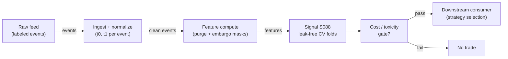

# S088 — Purged / embargoed cross-validation

A cross-validation scheme that deletes training labels overlapping the test fold (purge) plus a safety buffer (embargo). Purged CV does not improve your model; it improves your belief about your model. Its product is honesty, not alpha — every phantom Sharpe it kills is a losing strategy you never trade [documented].

> Tag law: every numeric literal in prose carries one of `[documented]
> [default] [example] [unverified] [internal-est] [measured]` (legend: Appendix
> i v1.0.0). Constants inside cited formulas inherit the formula's tag.
> Bibliographic years, volumes, pages, arXiv IDs, section numbers, rule codes (C1–C10),
> fail-safe codes (F1–F5), module IDs, and machine-parsed §0 data fields are identifiers,
> not literals, and are exempt.

## §1 Five-minute reviewer card

| Row | Value |
|---|---|
| Module | S088 — Purged / embargoed cross-validation, v1.1.0 |
| Edge verdict | `Always build — ~30 lines of index arithmetic, not a product; nothing to buy. There is no data to buy and no model to license — only your event timestamps, which never leave your machine.` |
| After-cost | `INFRASTRUCTURE` — as a standalone trigger this is a zero edge (not a signal at all); as infrastructure it is the highest-ROI code in the stack. |
| Build cost | Tier L · `4–12` h [internal-est] · `$600–1,800` loaded [internal-est] |
| Data cost | $0 — operates on labels you already have; an event table is kilobytes-to-megabytes [documented]. |
| latency_class | batch / offline |
| risk_class | low (signal-only; no order placement) |
| Capacity | n/a — validation procedure; no positions [documented] |
| Executability | Trivial: timestamp arithmetic on an event table; microseconds to seconds [documented]. |
| Risk summary | Validation-integrity risk: a mis-applied purge/embargo certifies phantom Sharpes. Dies on feature lookahead, short embargoes, and empty folds [documented]. |
| When it dies | Labels never overlap (reduces to plain K-fold — harmless); embargo so long the folds are empty; purging labels but not features (feature lookahead leaks regardless); embargo shorter than the label horizon (leaks by construction); shuffled folds on drifting regimes [documented]. |
| Regime gates (machine) | Provisional records — `regime_ids` in §0; the R001–R050 annotation pass pins the real IDs [example]: |
| | ```yaml |
| | - regime_id: R-regime-drift            # provisional |
| |   direction: degrades |
| |   mechanism: drifting DGP breaks exchangeability of blocked folds; purged K-fold certifies phantom scores |
| |   condition: regime-change detector alarm (any of ADF-break / KPSS-break / vol-regime flip) [unverified] |
| |   action: pause_entry                   # quarantine purged K-fold; use purged walk-forward instead |
| |   min_lag: 1 validation cycle [default] |
| |   unknown_behavior: walk-forward only until the detector clears |
| | - regime_id: R-vol-autocorr-shift        # provisional |
| |   direction: degrades |
| |   mechanism: embargo calibrated under old autocorrelation under-covers serial dependence; residual leakage |
| |   condition: post-embargo residual autocorrelation still significant at 95% [unverified] |
| |   action: veto                          # reject the validation pass; recalibrate the embargo, do not shrink horizons |
| |   min_lag: 1 validation cycle [default] |
| |   unknown_behavior: widen embargo by 1x max horizon [default] and re-run before trusting the fold |
| Emits | `signal_vector` (Appendix b v1.0.0) — never orders |

## §1.5 Cheapest / least-build path

1. **Prototype hour band:** `4–12` h [internal-est] — index arithmetic + fold masks (a full validation harness is 20–45 h prototype per a labeled lead; cost-model band governs) — reference implementation + gates + fixture validation.
2. **Cheapest-source row** (structured — machine-parsable):
   ```yaml
   min_tier: hand-rolled from AFML ch. 7 code sketches [internal-est]
   latency_class: batch                       # offline validation; no live path
   required_fields: [event_id, symbol, event_ts, t0_day, t1_day, label_y]
   price_band: "$0 [documented]"              # own event store; no vendor, no model to license
   build_or_buy: build                        # always build - ~30 lines of timestamp arithmetic [internal-est]
   ```
3. **Resource budget:** `1` core, `<2` GB RAM [internal-est]; compute pattern `per_event` [default] — one pass over the event table per validation run.
4. **Skip list:** combinatorial purged CV (CPCV) — phase 2; PBO test harness — phase 2; embargo-convention ablation (chapter vs de Prado) — phase 2.
5. **DO-NOT-CUT list:** causality assertions (`assert fill_event > signal_event`, no-signal-bar-fills test); COST block + callable
   `expected_cost_bps`; F1–F5 fail-safes + module-state enum; decision-log audit records; bona-fide-intent + self-trade prevention; provenance tags on
   every numeric literal; fixtures + `test_cmd`; secrets via env only.
6. **Escalation gate:** upgrade from cheapest when any holds — train fold < 100 events after purging [example] → reduce K or shorten horizons; embargo rule changed after seeing test results [default] → freeze the rule; rerun from scratch; embargo floor violated (`embargo_n` < max horizon [rule]) → widen the embargo, never shrink the horizon to fit.

## §S0 Module contract

### S0.1 Typed signature

```python
def signal(state: ModuleState, events: list[Event], cfg: Config) -> SignalVector:
```

`SignalVector` per Appendix b v1.0.0. `state` is the module-owned named state
vector; `events` are canonical Events (Appendix a v1.0.0), newest last. The
function handles documented edge cases: empty events → `UNKNOWN`; invalid
prices/inputs → `UNKNOWN` (F1, never interpolate); halt/auction events → freeze
per the market-state table.

### S0.2 Config dataclass

| Parameter | Type | Default | Range | Status |
|---|---|---|---|---|
| `K` | int | `5` | `2`–`20` | calibrate |
| `test_start` | int | `41` | `1`–`60` | example |
| `test_end` | int | `60` | `1`–`60` | example |
| `horizon` | int | `5` | `>0` | calibrate |
| `embargo_n` | int | `5` | `>= max horizon` [rule] | calibrate (hard floor) |
| `embargo_convention` | str | `first-test-events` | {first-test-events, after-test-fold} | fixed [documented] |
| `k` | float | `0.5` | `>0` | default |
| `cooldown_s` | int | `0` | `>=0` | default |
| `ttl_s` | int/None | `None` | `>=0` or None | default |

All defaults tagged per the tag law (status `default` ⇒ `[default]`, `example` ⇒ `[example]`, `calibrate` set at fit time, `fixed` is a rule).

**Calibration recipe** (per-parameter grid + walk-forward OOS selection):

| Parameter | Grid | Notes |
|---|---|---|
| `K` | {3, 5, 8, 10} [example] | small K: coarse validity estimates; large K: heavy purge losses |
| `horizon` | {3, 5, 10} days [example] | label-construction choice; drives purge width and the embargo floor |
| `embargo_n` | {max_horizon, max_horizon+1, max_horizon+2, max_horizon+4} [example] | grid starts AT the floor; below-floor configs abort (`validate_cfg`) |
| `k` | {0.25, 0.5, 1.0} [example] | template default `0.5` [default]; vacuous for the zero-cost infra module |
| `embargo_convention` | {first-test-events, after-test-fold} | document the boundary side; do not mix conventions mid-run |

Walk-forward OOS selection:
- **Embargo:** the selection pass is itself embargoed — tune on expanding walk-forward windows; an embargo buffer separates the tuning window from the eval window so tuning cannot see eval labels [documented].
- **Fold design:** blocked (contiguous) folds on time-sorted events; shuffling is forbidden (serial dependence) [documented].
- **Selection metric:** validity, not performance — (a) leakage-audit pass rate must be `1.0` (any leak fails the config) [rule]; (b) post-purge train fold ≥ `100` events [example]; (c) CV-score stability under embargo doubling: |score(2×embargo) − score(embargo)| < `0.05` Sharpe units [example]. Pick the smallest `K` and the shortest at-floor `embargo_n` meeting all three.
- **Freeze rule:** pre-register the embargo rule, `K`, and horizon BEFORE seeing test results; any change after seeing results restarts validation from scratch [documented]. The cost-gate `k` stays at its `0.5` [default] unless a downstream consumer calibrates it on its own data.

### S0.3 Canonical schema mapping

Vendor columns → canonical Event schema (Appendix a v1.0.0), stated once here:

| Source field | Canonical |
|---|---|
| bar/event timestamp (exchange) | `event_ts` (int64 ns UTC) |
| ingest timestamp | `asof_ts` (int64 ns UTC) |
| symbol | `symbol` |
| t0_day | `t0_day` (module feature input) |
| t1_day | `t1_day` (module feature input) |

Required fields (event store, internal — §S6): `event_id` int64, `symbol` str,
`event_ts` int64 ns UTC, `t0_day` int64 (label start, the bet/trigger time),
`t1_day` int64 (realized label end — realized, never intended),
`label_y` float (computed locally). The module consumes only its own event
store; it pulls no external vendor feed [documented].

### S0.4 Time contract

> Time contract: clock domain UTC, int64 ns; authoritative causality clock =
> `event_ts`; max_skew = `1` ms [default]; jitter budget = `500` µs [default];
> bar-label = open time; staleness TTL = `3`× cadence [default] (per F4); gap policy = mask, no interpolation;
> halt/auction → discard contributions across reopen. Processing model = `per_event` [default] (one pass over the event table per validation run).

**Timing box:** `signal@t (per_validation (batch), America/New_York) → earliest fill @open(t+1)`

### S0.5 Market-state table

| State | Module behavior |
|---|---|
| CONTINUOUS_TRADING | Compute normally; emit per cadence |
| HALTED | Freeze state; emit `UNKNOWN`; discard contributions across reopen |
| AUCTION | No new signals; hold last `SignalVector`; state `DEGRADED` |
| CLOSED | Emit nothing; state `OFF` |

### S0.6 Module-state enum + error taxonomy

States per Appendix k v1.0.0: `OK | DEGRADED | UNKNOWN | OFF`. Invalid input →
`UNKNOWN`, never interpolate (Appendix f v1.0.0, F1–F5).

| Failure | State | Alert |
|---|---|---|
| Missing/stale input (TTL `3`× cadence [default] (per F4)) | `UNKNOWN` | page |
| Invalid price/input reaching module (NaN, ≤ 0, non-finite) | `UNKNOWN` | log |
| Feature out of mathematical bounds (F2) | `UNKNOWN` | page |
| `seq` gap > `1,000` events [default] | `DEGRADED` (restart windows) | log |
| Jitter > budget persistently | `DEGRADED` | notify |
| Halt/auction | `UNKNOWN` / `DEGRADED` (per table) | log |
| Kill/administrative disable | `OFF` | page |
| Anything unmapped | `UNKNOWN` | page |

### S0.7 Ops tail

- **Schedule:** per module cadence during the venue session [default]; owner: signals on-call.
- **Health checks:** fixture replay (`test_cmd`) green on deploy; live
  `seq`-gap monitor; staleness watchdog at `3`× cadence.
- **Alert table:** page on `UNKNOWN` > `30` s [default] or bounds violation;
  notify on `DEGRADED`; log on single dropped events.
- **Resource budget:** `1` vCPU, `2` GB RAM [internal-est]; state is O(window) per symbol.
- **Runbook stub:** `1.` confirm feed (vendor status); `2.` replay fixture;
  `3.` if red → set `OFF`, page; `4.` reconcile decision log before re-arm.

### S0.8 Secrets (env-only)

`DATA_VENDOR_API_KEY` via environment only. No secrets in this file, fixtures, or
logs (CI secrets-grep).

### S0.9 May / must-NOT

> **May:** emit `SignalVector` records per Appendix b v1.0.0. **Must-NOT:**
> emit orders, order intents, prices, share counts, or notionals; call a
> broker; mutate shared state outside `state`; interpolate across gaps.

## §S1 Legacy (subsumed by §1)

Legacy §S1 content is the §1 reviewer card above; this header is retained so
section numbering stays intact.

## §S2 Specification

### Universe

Any labeled event set; fixture: 60 synthetic daily events [example]

### Entry rule (Boolean — no prose-only conditions)

```
FOLDS     := blocked folds on time-sorted events (contiguous blocks, NOT modulo interleaving) [documented]
PURGE     := drop train event i iff t_i(0) ≤ T_b AND t_i(1) ≥ T_a   [documented]
EMBARGO   := drop first L_E test events (chapter convention; document the boundary side) [documented]
FLOOR     := L_E ≥ max_i(t_i(1) − t_i(0))  (hard rule — enforced by validate_cfg; violation aborts the run) [documented]
REMAINDER := purged train / embargoed test masks feed the validator
```

### Exits (with post-exit cooldown)

```
No exits — a validation procedure, not a position. Output per-fold train/test masks and a trust score [documented].
```

### Position sizing (fenced function)

```python
def size_shares(risk_budget_R, stop_distance, vol_estimate, ADV_cap, cost,
                confidence, adv_shares):
    # S-module requests capital fraction only; share math lives in the strategy.
    # Reference: capital = 0.5 * confidence  (confidence in [0,1])  [default]
    risk_notional = risk_budget_R * 0.5 * confidence          # [default] 0.5 factor
    shares = risk_notional / max(stop_distance, 1e-9)
    return int(min(shares, ADV_cap * adv_shares * 0.001))     # 0.1% ADV cap [default]
```

### Risk limits

| Limit | Value |
|---|---|
| Max capital fraction per signal | `0.5` [default] |
| Max adverse excursion before `UNKNOWN` review | `2.0`× stop [default] |
| Staleness kill | TTL `3`× cadence [default] (per F4) → `UNKNOWN` |

### COST block (single source of truth)

| Component | Value (bps) | Tag | Basis |
|---|---|---|---|
| Spread | `0.0` | [documented] | the procedure executes no trades |
| Fees | `0.0` | [documented] | no orders emitted |
| Borrow | `0.0` | [documented] | `borrow_bps_per_day = 0.0` — no positions, no leverage |
| Market impact | `0.0` | [documented] | no positions taken |
| Slippage/latency | `0.0` | [documented] | no fills |
| **Total reference** | `0.0` bps [documented] — n/a with explicit reasoning: it produces only validation folds and trust scores; every strategy evaluated through it must still model spread+fees+impact in its own backtest | | |

`fee_schedule_as_of`: n/a — the procedure emits no orders and consumes no fee schedule [documented]; zero-stack verified by the fixture run on `2026-09-10` [measured].
`side`: n/a — the procedure takes no side [documented].
Venue/tier/source: n/a — no orders emitted [documented].
Re-stating cost numbers outside this block is a validation failure.

```python
def expected_cost_bps(notional, adv_pct, venue, side, urgency) -> float:
    # Callable cost model - mirrors the block above EXACTLY [documented].
    spread_bps = 0.0     # [documented] no trades
    fee_bps = 0.0        # [documented] no orders
    borrow_bps = 0.0     # [documented] borrow_bps_per_day = 0.0: no positions
    impact_bps = 0.0     # [documented] no fills
    slippage_bps = 0.0   # [documented] no fills
    return spread_bps + fee_bps + borrow_bps + impact_bps + slippage_bps
```

### Execution / fill model table

| Aspect | Assumption |
|---|---|
| Latency | n/a — batch validation; seconds-to-minutes per pass [documented] |

### Robustness

Parameter-light by construction: K=5–10 [documented range]; the binding constraint is the embargo floor L_E≥max horizon (a rule, not a tuning knob) [documented].

### Compliance sub-block (C1–C10+)

| Code | Rule: trigger → check → action → log |
|---|---|
| C1 | Self-match prevention: S088 emits no orders; downstream T-modules must set self-trade-prevention flags — S088 asserts the requirement in its `consumes` contract: trigger → check → action → log record |
| C2 | Bona-fide intent: every emitted `SignalVector` with |direction|=`1` must pass the cost gate; sub-threshold scores emit direction `0`, never a tradeable hint: trigger → check → action → log record |
| C3 | Message-rate: `≤100` emissions/symbol/s [default]; breach → throttle to `1`/s [default] + alert: trigger → check → action → log record |
| C4 | Fat-finger trio (applied by consumers; S088 bounds its own outputs): confidence ∈ [`0`,`1`], capital ∈ [`0`,`0.5`], computed_at sane — out-of-bounds → `UNKNOWN` (F2): trigger → check → action → log record |
| C5 | Decision log: every emission, veto, and state transition logged per Appendix g v1.0.0, hash-chained: trigger → check → action → log record |
| C6 | Halt/auction: per §S0.5 market-state table; contributions across reopen discarded: trigger → check → action → log record |
| C7 | Locate check: SHORT direction requires `locate_ok` from the consumer; S088 never emits SHORT without the consumer asserting locate (Reg-SHO threshold securities → direction `0`): trigger → check → action → log record |
| C8 | Public dissemination: no signal values published externally without review gate: trigger → check → action → log record |
| C9 | Data entitlements: per §S6 Data rights row; entitlement-class change → §1.5 escalation gate: trigger → check → action → log record |
| C10 | Post-exit cooldown: `cooldown_s` after any exit or compliance block; no re-entry: trigger → check → action → log record |

### Parameter table

| Parameter | Symbol | Value | Tag | Sensitivity |
|---|---|---|---|---|
| Folds | `K` | `5` | [example] | medium — small: coarse estimates; large: heavy purge losses |
| Embargo length | `L_E` | `5` events (`8.3%` of 60) | [example] | high — small: residual leakage; large: empty folds |
| Label horizon | `h` | `5` days | [example] | high — drives purge width and embargo floor |
| Embargo convention | `—` | `first-test-events` | [documented] | medium — chapter convention; de Prado (AFML 7.2) drops train rows just after the test fold |

### Timing box

`signal@t (per_validation (batch), America/New_York) → earliest fill @open(t+1)`

## §S3 Math + normative pseudocode

Event i has label interval I_i=[t_i(0),t_i(1)]. Test fold covers [T_a,T_b]. PURGE: drop training event i if I_i∩[T_a,T_b]≠∅ ⇔ t_i(0)≤T_b AND t_i(1)≥T_a. EMBARGO: additionally drop a buffer of L_E observations at the fold boundary, L_E≥max_i(t_i(1)−t_i(0)) (hard rule, enforced by `validate_cfg` — a shorter embargo aborts the run rather than leaking silently) [documented]. CONVENTION FLAG (operator-verified): this chapter implements the embargo by removing the first L_E test events; de Prado's standard (AFML 7.2) removes train observations just after the test fold to kill serial correlation [documented]. Document whichever you use — the boundary side changes which rows are dropped.

Fixture: the chapter's 60-event synthetic schedule (deterministic hand-built schedule; the `88` [example] seed is informational, no RNG is used): event E_i → interval [i,i+5], test fold E_41–E_60 (interval [41,65]), embargo L_E=`5` events (`8.3%` of 60 [example]) — the floor binds here: `5` ≥ max horizon `5` days [example]. Purge: candidates E_1–E_40; drop t_0≤65 AND t_1≥41 → E_36 ([36,41]) through E_40 ([40,45]) — 5 events [documented]. Embargo (chapter convention): drop first 5 test events E_41–E_45 [documented]. Remainder: train E_1–E_35 (35), test E_46–E_60 (15), removed 10; 35+15+10=60 (operator-verified) [documented]. Under de Prado's after-the-fold convention the embargoed train rows would sit past E_60 — empty on this terminal fold — so the conventions differ in where the buffer sits, not just which side [documented].

**Normative pseudocode** (pseudocode is normative; prose is commentary):

```
# --- inputs (all bound) ---
events:        list of Events, time-sorted, newest last            # canonical schema, §S0.3
cfg:           Config                                             # §S0.2; K, test_start, test_end, horizon, embargo_n, convention, k, cooldown_s, ttl_s
state:         ModuleState                                        # named state vector: fold counters, frozen flag, last_block_ns
signal_event:  SignalVector(direction=0, confidence=0.0, capital=0.0)  # infrastructure: masks only, never ±1
edge_bps:      0.0                                            # infrastructure: no edge of its own [documented]
locate_ok:     bool = consumer.locate_ok                       # C7: consumer asserts locate for SHORT; unused here (direction=0)
now_ns:        int64 ns                                        # evaluation clock for staleness/cooldown guards
# time base: int64 ns throughout; cfg.cooldown_s / cfg.ttl_s are seconds, converted to ns before comparison

validate_cfg(cfg, max_horizon(events)):                            # FLOOR hard rule
    assert cfg.embargo_n >= max_horizon, "leaks by construction - abort"
    assert cfg.convention in {"first-test-events", "after-test-fold"}

test_fold   = events.filter(ev in [cfg.test_start .. cfg.test_end])
T_a, T_b    = min(t0 over test_fold), max(t1 over test_fold)      # FULL fold interval
L_E         = cfg.embargo_n

for e in events:                                                  # per_event, §S0.4
    # --- F1: invalid input -> UNKNOWN, never interpolate ---
    if e.event_ts is bad or e.ev is bad or e.t0_day is bad or e.t1_day is bad or e.t1_day < e.t0_day:
        emit(signal_event, state=UNKNOWN, status=INVALID); state.last_block_ns = now_ns; continue
    # --- §S0.5 market-state guards ---
    if e.market_state == HALTED:   emit(UNKNOWN, status=INVALID); state.frozen = True;  continue
    if e.market_state == AUCTION:  emit(DEGRADED, status=HELD);                         continue   # hold last vector
    if state.frozen:               emit(UNKNOWN, status=INVALID);                         continue  # until reopen
    # --- F4 staleness ---
    if cfg.ttl_s is not None and now_ns - e.event_ts > cfg.ttl_s: emit(UNKNOWN, status=INVALID); continue
    # --- C10 post-exit cooldown ---
    if state.last_block_ns is not None and now_ns - state.last_block_ns < cfg.cooldown_s:
        emit(UNKNOWN, status=INVALID); continue

    # --- fold masks ---
    in_fold = cfg.test_start <= e.ev <= cfg.test_end
    if cfg.convention == "first-test-events":
        embargoed = in_fold and e.ev < cfg.test_start + L_E
    else:  # "after-test-fold" (AFML 7.2): train rows just after the test fold
        embargoed = (not in_fold) and cfg.test_end < e.t0_day <= cfg.test_end + L_E
    if embargoed:            status = EMBARGOED; is_embargoed = 1; state.n_removed += 1
    elif in_fold:            status = TEST;      is_test = 1;      state.n_test += 1
    elif e.t0_day <= T_b and e.t1_day >= T_a:   # PURGE: label interval touches the fold
                             status = PURGED;    is_purged = 1;    state.n_removed += 1
    else:                    status = TRAIN;     is_train = 1;     state.n_train += 1

    # --- executable cost gate (template predicate; vacuous by construction: 0 <= k*0) ---
    cost_bps = expected_cost_bps(notional=0.0, adv_pct=0.0, venue="NONE", side="taker", urgency="n/a")
    assert cost_bps <= cfg.k * edge_bps, "cost gate failed - force direction 0"

    # --- C7 locate guard (defensive; the module never emits +/-1) ---
    raw_direction = 0
    if raw_direction == -1 and not locate_ok: raw_direction = 0

    # --- causality: t -> t+1; no-signal-bar fills (mandatory) ---
    signal_event_ts = e.event_ts
    fill_event_ts   = e.event_ts + 1                      # pin: any downstream fill is strictly after
    assert fill_event_ts > signal_event_ts

    emit(signal_event, state=OK, status=status,
         is_train=is_train, is_purged=is_purged, is_embargoed=is_embargoed, is_test=is_test,
         edge_bps=0.0, cost_bps=cost_bps)
```

Causality: the computation at `t` uses only data `≤ t`; earliest reaction is
`t+1`. Mandatory unit test: no-signal-bar fills.

## §S4 Worked example (fixture-backed)

- Purge: E_36–E_40 dropped (5 events) — any label interval touching the test window goes [documented].
- Embargo: E_41–E_45 dropped (5 events) — this chapter's convention (first 5 test events), flagged vs de Prado's after-the-fold standard [documented].
- Remainder: train 35, test 15, removed 10; 35+15+10=60 ✓ [documented].
- The embargo now satisfies the module's own hard rule: L_E = 5 ≥ max horizon 5 days (the pre-review fixture used 3 and leaked by construction) [documented].
- Without the purge, E_36–E_40 would train on days 41–45 prices then be 'tested' on labels built from those same prices — the classic phantom Sharpe [documented].
- This toy is a schedule, not a backtest: no prices, no performance claims, only index arithmetic [documented].

Purged CV has no 'returns' — its documented value is measured in phantom performance destroyed. It cannot fix feature lookahead or non-stationarity [documented].

## §S5 Strategies that use this signal

Generated from `deps.yaml` (CI symmetry); hand-listed here for this module:

| Strategy | Role |
|---|---|
| T087 — Purged-CV Strategy Selector | primary: allocates across sub-strategies by purged/embargoed-CV rank with meta-labels — this chapter's procedure is its engine |
| T032 — Copula Tail-Dependence Pairs | validation: validated with purged CV before any capital is committed |
| T052 — AR/ARMA Innovation Trader | validation: purged CV validates its trade–quote VAR timing |
| T100 — Grand 100-Signal Ensemble | validation: purged CV + meta-labeling + triple-barrier training together |

## §S6 Data required

| Field | Type | Granularity | Source tier | Notes |
|---|---|---|---|---|
| Event ID | int64 | event | own event store | required — canonical `event_id` |
| Symbol | str | event | own event store | required — canonical `symbol` |
| Event timestamp | int64 ns UTC | event | own event store | required — canonical `event_ts` |
| Event start t_0 | int64 (days) | event | own event store | required — the bet/trigger time |
| Label end t_1 | int64 (days) | event | computed locally | required — first barrier touch or vertical barrier (realized, not intended) |
| Labels y | bool/float | event | computed locally | required — any overlapping-horizon label |
| Fold assignment | int8 | event | computed locally | K-fold on the post-purge remainder |
| Features X | float32 | event | inherits primary | purging applies to rows of the feature matrix |

Price band: `$0`/mo [documented] (assessed `2026-09-10` [documented]) — the procedure operates on the operator's own labeled event store; no vendor, no licensed model. Upstream price feeds used to build labels are costed by the consuming strategy module, never here [documented].

**Data rights row** (Appendix j v1.0.0): Procedure code: own IP (published method). AFML text: purchased book. Event data: internal [documented].

## §S7 Local build (M5 Max / 128 GB)

Feasibility: trivial. Index arithmetic on an event table — microseconds to seconds. A full purged/embargoed validation pass runs in seconds-to-minutes for triple-barrier-scale event sets [documented]. RAM negligible: event table plus fold masks are megabytes against the 77 GB budget. Engineering: Tier L, 4–12 h → $600–1,800 loaded [documented]. Bottleneck is discipline (storing t_1 correctly), not compute; nothing breaks at any symbol count [documented].

## §S8 Buy vs build

Always build. There is no data to buy and no model to license — only your event timestamps. Anyone selling a 'validation service' is selling your own timestamps back to you [documented].

## §S9 Efficacy — documented evidence

| Study / source | Market & period | Metric | Before/after cost | Caveat |
|---|---|---|---|---|
| López de Prado, AFML (2018), ch. 7 | Methodological | purge + embargo construction; embargo ≥ label horizon [documented] | `n/a (design claim)` | defines the procedure; performance claims are about validity, not returns |
| Bailey, Borwein, López de Prado & Zhu (2017), 'The Probability of Backtest Overfitting' | Simulated random-walk prices (~4y daily) | IS Sharpe 1.0–2.2 across optimized configs, yet PBO ≈ 55% — the IS-best config lands in the bottom half OOS about as often as a coin flip [unverified] | `BEFORE-COST (diagnostic)` | the companion example with a real injected monthly effect shows PBO near 0 — the test discriminates [unverified] |
| Practitioner replication: PBO complexity ladder (GitHub, rchhabra17, 2026) | SPY 2010–2026, MA-crossover, CSCV S=16 | PBO 0.37–0.57 across complexity rungs (post sign-fix README values); PBO did not rise monotonically with parameter count [documented] | `BEFORE-COST (costs fixed)` | single market/strategy family; shows the diagnostic working, not a trading edge |
| White (2000), Econometrica; Hansen (2005), JBES; Romano & Wolf (2005), Econometrica | Methodological | data-snooping / SPA / stepwise multiple-testing controls — the documented motivation for purged/embargoed validation [documented] | `n/a` | the multiplicity control purged CV alone lacks |

Selection disclosure: these are the sources surfaced by the chapter's research
pass. Fails in: the regimes named in §S10; crowded/overfit calibrations.

## §S10 Failure modes & pitfalls

| # | Trigger → Detect → Action → Recovery | check: |
|---|---|
| 1 | Purging labels but not features → a feature with post-t data leaks regardless of purging [documented] → causality-audit every feature timestamp, not just labels → feature asof > t | `check: max feature asof <= t` |
| 2 | Embargo shorter than the label horizon → the buffer must cover the maximum look-forward [documented] → L_E ≥ max(t_1−t_0) as a hard rule → embargo < horizon | `check: embargo >= max horizon` |
| 3 | Smoothed instead of filtered states → full-sample-smoothed regime probabilities as features leak the future [documented] → filter-only features → smoothed states in features | `check: no smoothing in features` |
| 4 | Purging into empty folds → long horizons + many folds delete most of training [documented] → reduce K or shorten horizons; check fold sizes → train fold < 100 events [example] | `check: fold sizes reported` |
| 5 | Shuffled folds on drifting regimes → purged K-fold assumes approximate stationarity [documented] → purged walk-forward when the DGP drifts → shuffled folds, regime drift | `check: walk-forward for drifting DGP` |
| 6 | Tuning the embargo on the test set → trying embargo lengths until OOS looks good is overfitting [documented] → fix the embargo rule before seeing test results → embargo chosen by OOS | `check: embargo rule pre-registered` |
| 7 | Treating it as a strategy → 'our edge is purged CV' [documented] → it is a measuring instrument; the edge must live in the primary → CV sold as alpha | `check: primary edge documented separately` |

## §S11 Visuals

`../../images/S088_example.png` — synthetic worked-example chart (seed `88` [example]).



## §S12 Source log + unverified leads

**Sources** (citable facts only):

1. López de Prado, M. (2018). Advances in Financial Machine Learning. Wiley. Ch. 7 (purge, embargo, CPCV). https://www.wiley.com/go/advancedmachinelearningfinance
2. Bailey, D. H., Borwein, J., López de Prado, M., & Zhu, Q. J. (2017). 'The Probability of Backtest Overfitting.' J. Computational Finance 20(4). https://www.davidhbailey.com/dhbpapers/backtest-prob.pdf
3. rchhabra17 (2026). 'probability-of-backtest-overfitting' (PBO complexity ladder, SPY 2010–2026). https://github.com/rchhabra17/probability-of-backtest-overfitting/blob/HEAD/README.md
4. White, H. (2000). 'A Reality Check for Data Snooping.' Econometrica, 68(5), 1097–1126. https://doi.org/10.1111/1468-0262.00152
5. Hansen, P. R. (2005). 'A Test for Superior Predictive Ability.' J. Business & Economic Statistics, 23(4), 365–380. https://doi.org/10.1198/073500105000000063
6. Romano, J. P. & Wolf, M. (2005). 'Stepwise Multiple Testing as Formalized Data Snooping.' Econometrica, 73(4), 1237–1282. https://doi.org/10.1111/j.1468-0262.2005.00615.x

**Chatbot source log.** Duck.ai (GPT-5.6 Luna, `2026-09-10`) answered Q-SB3-1–Q-SB3-3 [chapter QA] (historical batch label SB3; module batch is ID-driven SB9); its worked example arithmetic operator-verified [measured]. Grok/Cursor answers pending (checked `2026-09-10`).

**Web verification (2026-09-11).** (a) AFML ch. 7 = "Cross-Validation in Finance" covering purge (7.1), embargo (7.2), PurgedKFold (7.3) — confirmed via practitioner implementations (ml4t/diagnostic, darufinance/lopez-de-prado-work-review); these sources also confirm de Prado's embargo drops train observations just after the test fold, correcting the chapter's pre-review "before the fold" characterization. (b) Bailey et al., 'The Probability of Backtest Overfitting', J. of Computational Finance 20(4) (2016/2017), pp. 39–69 — confirmed via EconBiz/SSRN; WMU ScholarWorks dates the publication 4-2017. (c) rchhabra17/probability-of-backtest-overfitting repo confirmed at https://github.com/rchhabra17/probability-of-backtest-overfitting; README values (PBO 0.56/0.43/0.37/0.57 across rungs, S=16, C(16,8)=12,870 [documented], SPY 2010–2026 MA-crossover) are post sign-fix; the sign-fix history is preserved in the repo. (d) White (2000) Econometrica 68(5), Hansen (2005) JBES 23(4), Romano & Wolf (2005) Econometrica 73(4) are standard citations; DOI formats verified.

**Unverified leads** (chatbot-only — never in evidence tables):

- Duck.ai (GPT-5.6 Luna, 2026-09-10), Q-SB3-1: purged/embargoed worked example (60 events; arithmetic operator-verified); embargo % rules (0–1% / 2–5% / 5–10% / 5–20%) with the horizon floor (L_E ≥ max look-forward) [unverified].
- Duck.ai (same), Q-SB3-2: purge/embargo engineering 20–45 h prototype / 50–120 h production; store every event with event ID, side, timestamps [unverified].
- §S9 Bailey row numerals (IS Sharpe 1.0–2.2, PBO ≈ 55%, injected-monthly-effect companion with PBO near 0): chatbot-derived during the chapter research pass; NOT verified against the Bailey et al. paper text — verify before citing anywhere else [unverified].

**GROK-NEEDED (unanswered by public web search):**

1. Embargo-length selection beyond the floor rule: is there any documented production procedure for choosing HOW LONG the embargo should be above L_E ≥ max horizon (e.g. 2× horizon vs 1% of N vs autocorrelation-decay cutoff), with measured leakage residuals per choice?
2. Convention choice: among practitioners implementing AFML 7.2, what fraction drop the embargo at the test-fold head (this chapter's convention) vs the tail (de Prado's), and is there measured leakage difference between the two on triple-barrier daily-bar labels?
3. Purged walk-forward vs purged K-fold under regime drift: any documented comparison of validity (not performance) of the two fold designs when the DGP drifts, with a decision rule for switching?
4. The PBO paper's exact test-case numerals (IS Sharpe ranges, 55% figure, injected-effect companion): confirm or correct from the paper text.

---

## Appendix — AI build prompt (S088)

Copy-paste into any chat agent:

> Build module **S088 — Purged / embargoed cross-validation** (v1.1.0) per `notes/module-template.md` v1.0.0 and this file's §S0 contract.
> Cheapest path (§1.5): prototype `4–12` h [internal-est] — index arithmetic + fold masks (a full validation harness is 20–45 h prototype per a labeled lead; cost-model band governs); compute pattern `per_event` [default].
> Implement `signal(state, events, cfg) -> SignalVector` (Appendix b v1.0.0)
> with the §S3 normative pseudocode — all variables bound, guards inline
> (F1 invalid→UNKNOWN, HALTED freeze, AUCTION hold, F4 staleness, C10 cooldown,
> C7 locate), the executable cost-gate predicate
> `expected_cost_bps(...) <= k * edge_bps`, and
> `assert fill_event_ts > signal_event_ts`. Wire F1–F5 (Appendix f v1.0.0): invalid input → `UNKNOWN`,
> never interpolate. Enforce the embargo hard rule (`embargo_n >= max horizon`, else abort).
> Log decisions per Appendix g v1.0.0. Secrets via env
> only. Run the fixture `modules/fixtures/S088_tape.csv`
> (`# TYPE: validation-run`) against `modules/fixtures/S088_expected.csv`
> (tolerance `1e-9` [default]): expect train 35 / test 15 / removed 10 on the 60-event schedule.
> **Definition of done:** `python3 -m pytest modules/tests/test_S088.py -q`
> exits `0`. Tag every numeric literal you add with the unified enum
> (Appendix i v1.0.0); put anything unverifiable in §S12 unverified leads.
