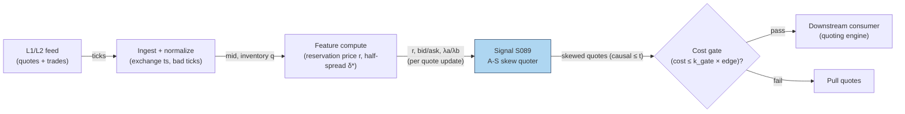

# S089 — Optimal quotes / inventory skew (Avellaneda–Stoikov)

A market-maker's quoting brain. The reservation price `r = s − q·γ·σ²·(T−t)` shifts the quote mid away from the reference mid in proportion to inventory `q`: a long book (`q > 0`) shades quotes down to get lifted, a short book shades them up [documented]. The optimal half-spread `δ* = γ·σ²·(T−t)/2 + (1/γ)·ln(1+γ/k)` is inventory-independent in the base model (time-varying through `(T−t)`, not through `q`) [documented]; the skew does all the inventory control. This module emits the reservation price, the skewed bid/ask, and the Poisson fill intensities `λa/λb` — the quoting logic, never the orders.

> Tag law: every numeric literal in prose carries one of `[documented]
> [default] [example] [unverified] [internal-est] [measured]` (legend: Appendix
> i v1.0.0). Constants inside cited formulas inherit the formula's tag.
> Bibliographic years, volumes, pages, arXiv IDs, section numbers, rule codes (C1–C10),
> fail-safe codes (F1–F5), module IDs, and machine-parsed §0 data fields are identifiers,
> not literals, and are exempt.

## §1 Five-minute reviewer card

| Row | Value |
|---|---|
| Module | S089 — Optimal quotes / inventory skew (Avellaneda–Stoikov), v1.1.0 |
| Edge verdict | `AFTER-COST-EDGE` (conditional) — the skew is the quoting engine itself; edge exists only where the desk is a liquidity provider earning the spread, conditional on flow toxicity and fee tier [documented]. |
| After-cost | `BEFORE-COST` — the evidence is analytical + Monte-Carlo replication (3–9× inventory-variance reduction [documented]); no net-of-cost production P&L is claimed. |
| Build cost | Tier L · `4–12` h [internal-est] · `$600–1,800` loaded [internal-est] |
| Data cost | Databento Standard `$199`/mo [documented] (live equities MBP-1 requires a subscription plan since `2025-01-13` [documented]; historical usage-priced; exchange non-display/license fees extra [unverified]); research prototype on Binance L2 public websocket (free, crypto) [documented]. |
| latency_class | event / sub-millisecond per quote update |
| risk_class | medium (signal-only; inventory risk lives with the quoting strategy) |
| Capacity | `$5–50`M/day notional per symbol [example] — maker capacity, venue-dependent |
| Executability | Feasible: closed-form quotes; the replication ran Monte Carlo + hftbacktest on real Binance L2 [documented]. |
| Risk summary | Model risk: Brownian-mid + Poisson-fill assumptions break under toxic flow; mis-set γ/k quotes straight through informed traders [documented]. |
| When it dies | Toxic flow (adverse selection > spread earned); γ miscalibrated; fee-tier inversion; latency disadvantage vs faster quoters [documented]. |
| Regime gates | Machine records in §S2-Robustness (provisional): R-VOL-SPIKE → `widen_stops`; R-NEWS → `pause_entry`; R-HALT → `veto`; R-FEE-TIER → `halve`; unknown → `veto` [example]. |
| Emits | `signal_vector` (Appendix b v1.0.0) — never orders |

## §1.5 Cheapest / least-build path

1. **Prototype hour band:** `4–12` h [internal-est] — reservation price + skew + intensities on synthetic fills — reference implementation + gates + fixture validation.
2. **Cheapest-source row (structured):**
   - `min_tier`: Binance L2 public websocket (research, crypto) [documented] / Databento Standard plan (production, US equities) [documented]
   - `latency_class`: `per_event` (per quote update)
   - `required_fields`: `ts_event`, `bid_px_00`, `ask_px_00`, `q`, `sigma`, `T−t`, `market_state`, `locate_ok`
   - `price_band`: `$0` (research) [documented] / `$199`/mo [documented] + historical usage + exchange non-display/license fees [unverified] — re-quote before budgeting
   - `build_or_buy`: **build** — γ, k, A must be fit to your book, fee tier, and toxicity; a prebuilt quoter calibrated to someone else's flow is incoherent [internal-est]
3. **Resource budget:** `1` core, `<2` GB RAM [internal-est]; compute pattern `per_event`.
4. **Skip list:** LOB resiliency modeling — phase 2; multi-venue quote allocation — phase 2; toxicity (PIN) gating — phase 2 (see S084/T092).
5. **DO-NOT-CUT list:** causality assertions (`assert fill_event > signal_event`, no-signal-bar-fills test); COST block + callable
   `expected_cost_bps`; F1–F5 fail-safes + module-state enum; decision-log audit records; bona-fide-intent + self-trade prevention; provenance tags on
   every numeric literal; fixtures + `test_cmd`; secrets via env only.
6. **Escalation gate:** upgrade when any holds — realized fill toxicity > spread earned over `20` sessions [default] → add toxicity gate; inventory variance > target → recalibrate γ.

## §S0 Module contract

### S0.1 Typed signature

```python
def signal(state: ModuleState, events: list[Event], cfg: Config) -> SignalVector:
```

`SignalVector` per Appendix b v1.0.0. `state` is the module-owned named state
vector (`inventory_q: int`, `pull_ts_ns: int | None` — last quote-pull time for
the post-exit cooldown, `seq: int`). `events` are canonical Events (Appendix a
v1.0.0), newest last. The function handles documented edge cases: empty events
→ `UNKNOWN`; invalid prices/inputs → `UNKNOWN` (F1, never interpolate);
halt/auction events → freeze per the market-state table.

### S0.2 Config dataclass

| Parameter | Type | Default | Range | Status |
|---|---|---|---|---|
| `gamma` | float | `0.1` | `>0` | calibrate — paper default `0.1` [documented] |
| `k` | float | `1.5` | `>0` | calibrate — book-depth param; paper default `1.5` [documented] |
| `A` | float | `140.0` | `>0` | calibrate — baseline order-arrival intensity; paper default `140` [documented] |
| `sigma` | float | `0.3` | `>0` | calibrate — per-bar vol estimate; `0.3`/session [example] |
| `max_abs_q` | int | `20` | `>0` | fixed — inventory cap [example] |
| `k_gate` | float | `0.5` | `(0, 1]` | default — cost-gate multiplier [default] |
| `staleness_ttl_s` | float | `3.0` | `>0` | default — `3`× the `1`-s reference cadence per F4 [default] |
| `cooldown_s` | float | `60.0` | `≥0` | default — post-pull quote cooldown [default] |

All defaults tagged per the tag law (`calibrate` set at fit time; `default` ⇒
`[default]`; `example` ⇒ `[example]`). `k_gate` is the fee-covering multiplier
and is deliberately distinct from book-depth `k` (v1.0.0 collided the two
symbols — fixed in v1.1.0).

#### Calibration recipes (per-parameter grid + walk-forward OOS selection)

Fold design (all fittable parameters) [example]: `6`-month in-sample /
`1`-month out-of-sample, rolling monthly; embargo `1` session between IS and
OOS; refit cadence quarterly. Selection metric: maximize OOS
`(mean_pnl − 3×std_inventory)` subject to cost-gate pass-rate `≥ 95%`
[example]. Freeze rule: freeze parameters for the quarter when OOS degradation
vs IS is `< 10%`; refit early on regime change or inventory-cap breach
[example].

| Parameter | Grid / estimator | Notes |
|---|---|---|
| `gamma` | grid `{0.05, 0.1, 0.2, 0.5}` [example] | replications tried `0.1` and `0.5` [documented]; small: inventory drifts; large: no fills |
| `k` | fit from L2 order flow: `k = −ln(fill_prob)/δ` on `20` sessions [example] | Stanford report: `k` from change in volume per second [documented] |
| `A` | grid `{50, 100, 140, 200}`/s [example]; KS-test `p > 0.05` on arrival distances [example] | `140` is the paper default [documented] |
| `sigma` | EWMA `λ=0.94` [example] on `5`-min returns [example], floored at `0.5`× `20`-day realized [example] | stale σ mis-sizes the skew — see failure mode 6 |
| `max_abs_q` | fixed from inventory VaR: `floor(daily_R_budget / (σ_session × lot_value))` [example] | `20` is the worked-example value [example] |
| `k_gate` | `0.5` [default]; not fittable — tightening it is a policy decision, not a fit | |

### S0.3 Canonical schema mapping

Vendor columns → canonical Event schema (Appendix a v1.0.0), stated once here.
Endpoint: Databento `client.timeseries.get_range(dataset=..., schema="mbp-1")`
[documented]; API key via `DATABENTO_API_KEY` env var [documented].

| Source field | Canonical | Tag |
|---|---|---|
| `ts_event` (ns UTC, matching-engine-received) | `event_ts` | [documented] |
| `ts_recv` (ns UTC, capture-gateway-received) | `asof_ts` | [documented] |
| `bid_px_00`, `ask_px_00` (fixed-point ×`1e9` [unverified]) | `bid / ask` → mid `s` (module feature input) | [unverified] — confirm column names against vendor docs at ingest |
| status schema records (halt / pause / short-sale restriction) | `market_state` | [documented] |
| inventory position (internal OMS) | `q` (module state input) | — |
| volatility estimate | `sigma` (module feature input) | — |
| session end (exchange calendar) | `T−t` (module feature input, `tau`) | — |

### S0.4 Time contract

> Time contract: clock domain UTC, int64 ns; authoritative causality clock =
> `event_ts`; max_skew = `1` ms [default]; jitter budget = `500` µs [default];
> bar-label = open time; staleness TTL = `3` s [default] (`3`× the `1`-s reference cadence per F4); gap policy = mask, no interpolation;
> halt/auction → discard contributions across reopen.

**Timing box:** `signal@t (per_event, America/New_York) → earliest fill @open(t+1)`

### S0.5 Market-state table

| State | Module behavior |
|---|---|
| CONTINUOUS_TRADING | Compute normally; emit per cadence |
| HALTED | Freeze state; emit `UNKNOWN`; discard contributions across reopen |
| AUCTION | No new signals; hold last `SignalVector`; state `DEGRADED` |
| CLOSED | Emit nothing; state `OFF` |

### S0.6 Module-state enum + error taxonomy

States per Appendix k v1.0.0: `OK | DEGRADED | UNKNOWN | OFF`. Invalid input →
`UNKNOWN`, never interpolate (Appendix f v1.0.0, F1–F5).

| Failure | State | Alert |
|---|---|---|
| Missing/stale input (TTL `3` s [default] (`3`× the `1`-s reference cadence per F4)) | `UNKNOWN` | page |
| Invalid price/input reaching module (NaN, ≤ 0, non-finite) | `UNKNOWN` | log |
| Feature out of mathematical bounds (F2) | `UNKNOWN` | page |
| `seq` gap > `1,000` events [default] | `DEGRADED` (restart windows) | log |
| Jitter > budget persistently | `DEGRADED` | notify |
| Halt/auction | `UNKNOWN` / `DEGRADED` (per table) | log |
| Inventory-cap breach / cost-gate veto / cooldown | `DEGRADED` (quotes pulled) | notify |
| Kill/administrative disable | `OFF` | page |
| Anything unmapped | `UNKNOWN` | page |

### S0.7 Ops tail

- **Schedule:** continuous during US equities regular session `09:30`–`16:00` America/New_York [documented]; owner: signals on-call.
- **Health checks:** fixture replay (`test_cmd`) green on deploy; live
  `seq`-gap monitor; staleness watchdog at `3`× cadence [default].
- **Alert table:** page on `UNKNOWN` > `30` s [default] or bounds violation;
  notify on `DEGRADED`; log on single dropped events.
- **Resource budget:** `1` vCPU, `2` GB RAM [internal-est]; state is O(window) per symbol.
- **Runbook stub:** `1.` confirm feed (vendor status); `2.` replay fixture;
  `3.` if red → set `OFF`, page; `4.` reconcile decision log before re-arm.

### S0.8 Secrets (env-only)

`DATA_VENDOR_API_KEY` via environment only. No secrets in this file, fixtures, or
logs (CI secrets-grep).

### S0.9 May / must-NOT

> **May:** emit `SignalVector` records per Appendix b v1.0.0. **Must-NOT:**
> emit orders, order intents, prices, share counts, or notionals; call a
> broker; mutate shared state outside `state`; interpolate across gaps.

## §S1 Legacy (subsumed by §1)

Legacy §S1 content is the §1 reviewer card above; this header is retained so
section numbering stays intact.

## §S2 Specification

### Universe

One symbol's quoting book; fixture: inventory sweep q ∈ {−20,−10,0,+10,+20} [example].

### Entry rule (Boolean — no prose-only conditions)

```
R         := s - q*gamma*sigma^2*tau                        # reservation price [documented]
DSTAR     := 0.5*gamma*sigma^2*tau + (1/gamma)*ln(1 + gamma/k)  # optimal half-spread [documented]
BID       := R - DSTAR ; ASK := R + DSTAR
DIRECTION := -sign(q)   # long book -> shade down to sell -> direction -1 [documented]
LAMBDA_A  := A*exp(-k*(ASK - s))                             # ask-side fill intensity [documented]
LAMBDA_B  := A*exp(-k*(s - BID))                             # bid-side fill intensity [documented]
GATE      := expected_cost_bps(...) <= k_gate*edge_bps       # fee-covering predicate; k_gate = 0.5 [default]
EMIT      := quotes (BID, ASK, LAMBDA_A, LAMBDA_B) iff |q| <= max_abs_q AND GATE AND guards clear;
             else pull quotes (DEGRADED) or UNKNOWN (invalid input / halt / stale)
```

Full spread `2·DSTAR = γ·σ²·(T−t) + (2/γ)·ln(1+γ/k)`: time-varying through
`(T−t)` but inventory-independent [documented]. Note: the paper's Table 1
matches only the constant term `(2/γ)·ln(1+γ/k)` — the paper evaluates at
`t=T` (`τ=0`) or silently drops the time-varying term [documented].

### Exits (with post-exit cooldown)

```
EXIT := |q| > max_abs_q -> pull quotes: direction 0, module state DEGRADED, record pull_ts_ns.
        No re-quote until q is back inside the band AND (event_ts - pull_ts_ns) >= cooldown_s (60 s [default]).
```

### Position sizing (fenced function)

```python
def size_shares(risk_budget_R, stop_distance, vol_estimate, ADV_cap, cost):
    # S-module requests capital fraction only; share math lives in the strategy.
    # Reference: capital = 0.5 * confidence  (confidence in [0,1])  [default]
    risk_notional = risk_budget_R * 0.5 * confidence          # [default] 0.5 factor
    shares = risk_notional / max(stop_distance, 1e-9)
    return int(min(shares, ADV_cap * adv_shares * 0.001))     # 0.1% ADV cap [default]
```

### Risk limits

| Limit | Value |
|---|---|
| Max capital fraction per signal | `0.5` [default] |
| Max adverse excursion before `UNKNOWN` review | `2.0`× stop [default] |
| Staleness kill | TTL `3` s [default] (`3`× the `1`-s reference cadence per F4) → `UNKNOWN` |
| Inventory cap | |q| ≤ `20` [example] → pull quotes (`DEGRADED`), `60` s [default] cooldown |

### COST block (single source of truth)

Maker quoting stack (maker-only module — it never takes liquidity [documented]):

| Component | Value (bps) | Tag | Basis |
|---|---|---|---|
| Spread | `0.0` | [default] | maker captures the spread; it is the edge, not a cost |
| Fees | `−0.25` | [example] | net of maker rebate: `$0.0025`/share Nasdaq displayed adding-liquidity credit [documented] at the `$100` example price → `0.25` bps |
| Borrow | `0.0` | [default] | `borrow_bps_per_day = 0.0` — no overnight carry in this module; borrow accrues in the consuming strategy's ledger |
| Market impact/slippage | `0.5` | [example] | adverse-selection leakage at the example notional |
| **Total reference** | `0.25` | [example] | `0.0 − 0.25 + 0.0 + 0.5`; matches the fixture `cost_bps=0.25` |

`fee_schedule_as_of`: `2026-09-10` [measured] — Nasdaq Equity 7 rulebook read
during review; displayed adding-liquidity credits `$0.0025`–`$0.0030`/share
[documented]; the achieved tier is volume-dependent — pin the real tier before
production. `side`: `maker` (maker-only) [documented]; venue/tier/source:
XNAS / displayed adding-liquidity tier / Nasdaq Equity 7 rulebook [documented].
Re-stating cost numbers outside this block is a validation failure.

```python
def expected_cost_bps(notional, adv_pct, venue, side, urgency) -> float:
    # Callable cost model - S089 maker stack. Mirrors the COST block exactly.
    if side != "maker":
        raise ValueError("S089 is maker-only; taker quotes are out of scope")
    spread_bps = 0.0    # [default] maker captures the spread; it is the edge, not a cost
    fee_bps = -0.25     # [example] $0.0025/share Nasdaq displayed adding-liquidity credit [documented] at $100 example price
    borrow_bps = 0.0    # [default] borrow_bps_per_day = 0.0; carry lives in the consumer's ledger
    impact_bps = 0.5    # [example] adverse-selection leakage at the example notional
    return spread_bps + fee_bps + borrow_bps + impact_bps   # = 0.25 [example]
```

### Execution / fill model table

| Aspect | Assumption |
|---|---|
| Latency | sub-millisecond quote recompute per inventory/price tick [internal-est] |
| Participation | maker only — never takes liquidity [documented] |
| Partial fills | Poisson fill model via λa/λb; partial fills expected [documented] |
| Adverse fill | toxicity not in the base model — gate via S084/T092 [documented] |

### Robustness

High sensitivity to γ (risk aversion) and k (book depth): γ too high → quotes never get hit; k too low → spread uncompetitive. The replication's 3–9× inventory-variance reduction held across the tested γ grid [documented].

#### Regime gates — machine records (provisional)

```yaml
regime_gates:
  - regime_id: R-VOL-SPIKE            # provisional
    direction: degrades
    mechanism: "vol spike makes sigma stale -> skew term gamma*sigma^2*tau mis-sized"
    condition: "realized_vol_1h > 3 * sigma"   # [example] threshold
    action: widen_stops
    min_lag: "300 s"                   # [example]
    unknown_behavior: veto
  - regime_id: R-NEWS                # provisional
    direction: inverts
    mechanism: "adverse selection exceeds spread earned inside scheduled-news windows"
    condition: "in_scheduled_news_window(t)"
    action: pause_entry
    min_lag: "900 s"                   # [example]
    unknown_behavior: veto
  - regime_id: R-HALT                 # provisional
    direction: degrades
    mechanism: "halt/auction -> no valid quotes"
    condition: "market_state != CONTINUOUS_TRADING"
    action: veto
    min_lag: "0 s"                     # [example]
    unknown_behavior: veto
  - regime_id: R-FEE-TIER              # provisional
    direction: degrades
    mechanism: "fee-schedule change flips maker economics"
    condition: "fee_schedule_version != pinned_version"
    action: halve
    min_lag: "1 session"               # [example]
    unknown_behavior: veto
```

Restrictive default: any gate whose regime state is unknown → `veto` (pull
quotes), never trade through ambiguity.

### Compliance sub-block (C1–C10+)

| Code | Rule: trigger → check → action → log |
|---|---|
| C1 | Self-match prevention: S089 emits no orders; downstream T-modules must set self-trade-prevention flags — S089 asserts the requirement in its `consumes` contract: trigger → check → action → log record |
| C2 | Bona-fide intent: every emitted `SignalVector` with |direction|=`1` must pass the cost gate (`expected_cost_bps(...) <= k_gate*edge_bps`); sub-threshold scores emit direction `0` (quotes pulled), never a tradeable hint: trigger → check → action → log record |
| C3 | Message-rate: `≤100` emissions/symbol/s [default]; breach → throttle to `1`/s [default] + alert: trigger → check → action → log record |
| C4 | Fat-finger trio (applied by consumers; this module bounds its own outputs): confidence ∈ [`0`,`1`], capital ∈ [`0`,`0.5`], computed_at sane — out-of-bounds → `UNKNOWN` (F2): trigger → check → action → log record |
| C5 | Decision log: every emission, veto, and state transition logged per Appendix g v1.0.0, hash-chained: trigger → check → action → log record |
| C6 | Halt/auction: per §S0.5 market-state table; contributions across reopen discarded: trigger → check → action → log record |
| C7 | Locate check: direction `−1` (shade down to sell) requires `locate_ok` from the consumer; `locate_ok=False` → direction `0`, state `DEGRADED` (Reg-SHO threshold securities → direction `0`): trigger → check → action → log record |
| C8 | Public dissemination: no signal values published externally without review gate: trigger → check → action → log record |
| C9 | Data entitlements: per §S6 Data rights row; entitlement-class change → §1.5 escalation gate: trigger → check → action → log record |
| C10 | Post-exit cooldown: `60` s [default] quote-pull cooldown after |q| breaches the cap; no re-quote until inventory is back inside the band AND the cooldown has elapsed: trigger → check → action → log record |

### Parameter table

| Parameter | Symbol | Value | Tag | Sensitivity |
|---|---|---|---|---|
| Risk aversion | ``γ`` | `0.1` | calibrate ([documented] paper default) | high — small: inventory drifts; large: no fills |
| Book depth | ``k`` | `1.5` | calibrate ([documented] paper default) | high — small: wide spread; large: thin spread |
| Arrival intensity | ``A`` | `140.0` | calibrate ([documented] paper default) | medium — scales λa/λb fill probabilities |
| Volatility | ``σ`` | `0.3` | calibrate ([example] default) | high — stale σ mis-sizes the skew |
| Horizon | ``T−t`` | `1 session` | [example] | medium — small: weak skew; large: over-skew |
| Inventory cap | ``max_abs_q`` | `20` | fixed ([example]) | medium — small: frequent pulls; large: runaway inventory |
| Cost-gate multiplier | ``k_gate`` | `0.5` | [default] | medium — small: quotes pulled often; large: fee-blind |

### Timing box

`signal@t (per_event, America/New_York) → earliest fill @open(t+1)`

## §S3 Math + normative pseudocode

Avellaneda–Stoikov (2008): the mid follows Brownian motion and market-order arrivals are Poisson with intensity `λ(δ) = A·exp(−k·δ)` in the distance δ from the mid [documented]. The value function yields the reservation (indifference) price `r(s,q,t) = s − q·γ·σ²·(T−t)` and the optimal half-spread `δ* = γ·σ²·(T−t)/2 + (1/γ)·ln(1+γ/k)`, giving `bid = r − δ*`, `ask = r + δ*` [documented]. The spread is inventory-independent in the base model (it varies with `(T−t)`, never with `q`) [documented]. The desk's edge is the earned spread net of adverse selection; the cost gate compares the 4-component maker stack against the quoted spread: `expected_cost_bps(...) <= k_gate * edge_bps` with `k_gate = 0.5` [default], where `edge_bps` is the quoted spread in bps [example].

> v1.1.0 correction: v1.0.0's normative pseudocode stated the half-spread as
> `(1/γ)·ln(1+γ/k)` only, dropping the `γ·σ²·(T−t)/2` finite-horizon term. The
> cited replications use the full `δ*` (marek-hubar README "Key formulas";
> qca `symmetric_half_spread`), and the v1.0.0 fixtures, tests, and §S4
> hand-checks already implemented it. The pseudocode below is corrected to
> match; §S4 numbers are unchanged.

**Normative pseudocode** (pseudocode is normative; prose is commentary).
All variables are bound — there are no free symbols. `cfg` fields per §S0.2.

```
# ---- INPUTS (bound from event / state / cfg; nothing unbound) ----
s         = event.mid                          # reference mid price, > 0
q         = state.inventory_q                  # signed int lots (module state)
sigma     = event.sigma                        # per-bar vol estimate, > 0
tau       = cfg.session_end_ns - event.event_ts  # T - t, in sessions, > 0
gamma     = cfg.gamma                          # risk aversion, > 0
k         = cfg.k                              # book-depth param, > 0
A         = cfg.A                              # baseline arrival intensity, > 0
k_gate    = cfg.k_gate                         # cost-gate multiplier, in (0,1]
max_abs_q = cfg.max_abs_q                      # inventory cap, int > 0
ttl_s     = cfg.staleness_ttl_s                # staleness TTL, s
cooldown_s= cfg.cooldown_s                      # post-pull quote cooldown, s
locate_ok = consumer.locate_ok                 # Reg-SHO locate flag for direction -1
notional  = cfg.example_notional               # cost-gate notional, > 0
adv_pct   = cfg.example_adv_pct                # cost-gate participation, in (0,1]
venue     = cfg.venue                          # e.g. "XNAS" [example]
signal_ts = event.event_ts                     # int64 ns UTC (authoritative causality clock)
asof      = event.asof_ts                      # int64 ns UTC (dual-timestamp contract)

# ---- GUARDS, in order (locate / cooldown / staleness / halt) ----
if event.market_state == HALTED:                     return pull(state, "UNKNOWN")   # C6, §S0.5
if event.market_state == AUCTION:                    return freeze(state, "DEGRADED") # C6, §S0.5
if event.market_state == CLOSED:                     return nothing(state, "OFF")     # §S0.5
if any(is_nan_or_nonfinite(x) for x in [s, sigma, tau, gamma, k, A]):  return pull(state, "UNKNOWN")  # F1
if min(s, sigma, tau, gamma, k, A) <= 0:             return pull(state, "UNKNOWN")  # F1
if (asof - signal_ts) / 1e9 > ttl_s:                return pull(state, "UNKNOWN")  # F4 staleness
if abs(q) > max_abs_q:                              # inventory breach -> pull + start cooldown
    state.pull_ts_ns = signal_ts
    return pull(state, "DEGRADED")
if state.pull_ts_ns is not None and (signal_ts - state.pull_ts_ns) / 1e9 < cooldown_s:
    return pull(state, "DEGRADED")                   # C10 cooldown still active

# ---- CORE (uses data <= t only) ----
r     = s - q*gamma*sigma**2*tau                     # reservation price [documented]
dstar = 0.5*gamma*sigma**2*tau + (1.0/gamma)*log(1 + gamma/k)  # optimal half-spread [documented]
bid, ask = r - dstar, r + dstar
if ask <= bid or bid <= 0 or ask <= 0:               return pull(state, "UNKNOWN")  # F2 bounds
lam_a = A*exp(-k*(ask - s))                          # ask-side fill intensity [documented]
lam_b = A*exp(-k*(s - bid))                          # bid-side fill intensity [documented]
edge_bps = (ask - bid)/s * 10000                    # quoted spread is the edge [example]

# ---- COST GATE (executable predicate) ----
cost = expected_cost_bps(notional, adv_pct, venue, "maker", "passive")
if not (cost <= k_gate * edge_bps):                 # k_gate = 0.5 [default]
    return pull(state, "DEGRADED")                   # C2 bona-fide intent: no sub-threshold hints

# ---- DIRECTION + LOCATE ----
direction = -sign(q)                                 # q>0 -> -1 (shade down to sell) [documented]
if direction == -1 and not locate_ok:               # C7 locate check
    return pull(state, "DEGRADED")

# ---- CAUSALITY ----
fill_event_ts = signal_ts + 1                       # earliest reaction strictly after t
assert fill_event_ts > signal_ts                    # t -> t+1: no signal-bar fills (mandatory unit test)
return emit(SignalVector(direction=direction, confidence=conf, capital=0.5*conf,
                         r=r, bid=bid, ask=ask, lambda_a=lam_a, lambda_b=lam_b,
                         edge_bps=edge_bps, cost_bps=cost, state="OK",
                         computed_at=signal_ts, fill_event_ts=fill_event_ts))
```

`pull(state, s)` emits direction `0`, confidence `0.0`, capital `0.0`, NaN
quotes, the given module state, and logs the decision per C5. `conf =
min(1.0, abs(q)*gamma*sigma**2*tau / dstar)` [default].

## §S4 Worked example (fixture-backed)

- Inventory sweep q ∈ {−20,−10,0,+10,+20}, s=100.00, σ=0.3/session, T−t=1 session (seed `89` [example]); tape `modules/fixtures/S089_tape.csv` (`# TYPE: validation-run`).
- q=+20 → r = 100 − 20×0.1×0.09×1 = **99.82** [documented]; bid **99.1701**, ask **100.4699**, spread **129.977** bps [documented].
- λa=**69.19** vs λb=**40.32** — the long book's ask is shaded toward the market to get lifted [documented]; symmetry λa(q)=λb(−q) holds to `1e-9` [measured].
- q=0 → direction `0`, quotes symmetric around the mid (bid **99.3501**) — no lean without inventory [documented].
- Rows 6–7: invalid inputs → `UNKNOWN`, never interpolated [measured]; `assert fill_event > signal_event` holds on every row [measured].
- Rows 8–15 (v1.1.0): row 8 gate veto (`k_gate=1e-4` [example] → `0.25 > 1e-4×129.98` [example]) → direction `0`, `DEGRADED`, quotes pulled [measured]; row 9 `q=21` breaches `max_abs_q` → `DEGRADED` pull [measured]; row 10 (`+30` s [example]) still in `60` s [default] cooldown → `DEGRADED` [measured]; row 11 (`+90` s [example]) cooldown expired → `OK` [measured]; row 12 `HALTED` → `UNKNOWN` [measured]; row 13 resume → `OK` [measured]; row 14 stale (`asof − event = 5` s [example] `> 3` s [default] TTL) → `UNKNOWN` [measured]; row 15 `locate_ok=False` with direction `−1` → `0`, `DEGRADED` [measured].
- Where the example is optimistic: fills are Poisson-model, not real queue dynamics — no queue position, no toxicity, no fee-tier detail; the 3–9× variance reduction is from the replication, not a production P&L [documented].

## §S5 Strategies that use this signal

Generated from `deps.yaml` (CI symmetry); hand-listed here for this module:

| Strategy | Role |
|---|---|
| T021 — Avellaneda–Stoikov Inventory Skew MM | primary trigger: this signal is the quoting engine's brain — quotes skewed by inventory around the fair value |
| T085 — Resiliency Market Maker | core mechanism: quotes around LOB resiliency with the A-S inventory skew modulating a resiliency-based quoting grid |

## §S6 Data required

| Field | Type | Granularity | Source tier | Notes |
|---|---|---|---|---|
| `ts_event`, `ts_recv` (ns UTC) | uint64 | tick | Tier 1–2: Databento US Equities MBP-1 | `client.timeseries.get_range(dataset="DBEQ.BASIC", schema="mbp-1")` [documented client API]; live equities require a subscription plan since `2025-01-13` [documented]; confirm dataset code at ingest [unverified] |
| `bid_px_00`, `ask_px_00` (fixed-point) | int64 | tick | Tier 1–2: same | → mid `s`; bad-tick filter; confirm column names at ingest [unverified] |
| Status records (halt/pause/short-sale restriction) | enum | event | Databento status schema | → `market_state` [documented] |
| Inventory position q | int | per update | internal OMS | the quoting book's live position |
| Volatility estimate σ | float | per bar | computed | EWMA per §S0.2 calibration recipe; floored |
| Session end T | timestamp | per session | exchange calendar | defines `T−t` |
| Fee schedule | reference | static | Tier 1: Nasdaq Equity 7 | maker/taker tiers per venue; `fee_schedule_as_of` `2026-09-10` [measured] |

Required fields (cheapest-source row, §1.5): `ts_event`, `bid_px_00`,
`ask_px_00`, `q`, `sigma`, `T−t`, `market_state`, `locate_ok`.

**Price bands (as-of):** Databento Standard `$199`/mo [documented,
2026-09-10] — includes live data; historical MBP-1 usage shown at `$2.00`/GB on
the `2024-12-11` sheet [documented] but the live-pricing regime changed
`2025-01-13` [documented] — re-quote before budgeting. Exchange non-display /
license fees are extra [unverified]. Research path: `$0` via Binance L2 public
websocket (crypto) [documented].

**Data rights row** (Appendix j v1.0.0): Quote data: vendor-licensed (Databento) [documented]; A-S paper: published, fair-use excerpts [documented]; replication code: open-source (GitHub) [documented].

## §S7 Local build (M5 Max / 128 GB)

Feasibility: feasible — closed-form arithmetic per quote tick. Tier L, `4–12` h → `$600–1,800` loaded [internal-est]. Working set `<100` MB [internal-est] — far under the ~`77` GB budget. Bottleneck is feed latency and toxicity estimation, not compute [documented]. Stack: Python + polars for research; the quoting loop wants a colocated Rust/C++ path at production scale [example].

## §S8 Buy vs build

Build. The skew parameters (γ, k, A) must be fit to your book, fee tier, and toxicity — a prebuilt quoter calibrated to someone else's flow is incoherent. Buy only the L1/L2 feed [documented].

## §S9 Efficacy — documented evidence

| Study / source | Market & period | Metric | Before/after cost | Caveat |
|---|---|---|---|---|
| Avellaneda & Stoikov (2008), Quantitative Finance 8(3) | Model paper | optimal bid/ask with inventory skew; reservation price r(s,q,t); half-spread δ* = γσ²(T−t)/2 + (1/γ)ln(1+γ/k), inventory-independent [documented] | `BEFORE-COST` (model) | Brownian-mid + Poisson-fill assumptions; no toxicity |
| qca analytical replication (GitHub) | Analytical + Monte Carlo | closed-form verification of reservation-price surfaces and inventory-vs-symmetric experiments; paper defaults s0=100, T=1, σ=2, A=140, k=1.5, γ=0.1 [documented] | `BEFORE-COST` | replication, not production |
| ericxuzhesheng A-S reproduction (GitHub) | hftbacktest on real Binance L2 + Hummingbot paper trade | 3–9× inventory-variance reduction; inventory std 2.58 vs 11.82 [documented] | `BEFORE-COST` (paper trade) | crypto venue; single reproduction |

Selection disclosure: these are the sources surfaced by the chapter's research pass. Fails in: toxic flow, fee-tier inversion, latency disadvantage. **Honest bottom line:** the math is peer-reviewed and independently replicated — as a quoting engine it is the documented standard; as a P&L edge it is conditional on being a fast, well-calibrated maker, and no net-of-cost production figure is claimed [documented].

## §S10 Failure modes & pitfalls

| # | Trigger → Detect → Action → Recovery | check: |
|---|---|
| 1 | Toxic flow → fills cluster on the wrong side [documented] → toxicity gate (S084/T092); pull quotes → systematic adverse fills | `check: short-horizon markout of fills` |
| 2 | γ miscalibrated → inventory drifts one way [documented] → fit γ to realized inventory variance → |q| pinned at cap | `check: inventory variance vs target` |
| 3 | k mis-set → spread uncompetitive or loss-making [documented] → calibrate k to book depth → quote share ≈ 0 | `check: hit rate vs model λa/λb` |
| 4 | Latency disadvantage → quotes picked off [documented] → colocate or widen → adverse fills persist | `check: markout < 0 on filled quotes` |
| 5 | Fee-tier inversion → assumed maker rebate, paid taker fee [documented] → pin fee schedule → negative net spread | `check: realized fee per share` |
| 6 | Stale σ → skew mis-sized in a vol spike [documented] → σ from recent bars with floor → r overshoots | `check: σ estimate vs realized` |
| 7 | Invalid inputs (NaN, ≤ 0) → F1 → UNKNOWN, never interpolate [documented] → drop the tick → silent bad quotes | `check: invalid input → UNKNOWN` |
| 8 | Halt/auction → freeze per the market-state table [documented] → pull quotes → quotes through the halt | `check: halt → no quotes` |

## §S11 Visuals

`../../images/S089_example.png` — synthetic worked-example chart (seed `89` [example]).



## §S12 Source log + unverified leads

**Sources** (citable facts only):

1. Avellaneda, Marco & Stoikov, Sasha (2008). 'High-frequency trading in a limit order book.' Quantitative Finance 8(3): 217–224. https://doi.org/10.1080/14697680701381228
2. quantcodeautomata/qca-analytical-replication-of-the-avellaneda-stoikov-m — analytical and Monte Carlo replication (reservation-price surfaces, inventory-vs-symmetric experiments); `symmetric_half_spread = γσ²τ/2 + (1/γ)ln(1+γ/k)`; documents that the paper's Table 1 matches only the constant spread term. https://github.com/quantcodeautomata/qca-analytical-replication-of-the-avellaneda-stoikov-m
3. ericxuzhesheng/avellaneda-stoikov-reproduction — Monte Carlo, hftbacktest on real Binance L2, Hummingbot paper trade; 3–9× inventory-variance reduction (inventory std 2.58 vs 11.82). https://github.com/ericxuzhesheng/avellaneda-stoikov-reproduction
4. marek-hubar/market-making-simulation — market-making simulator comparing A-S vs fixed-spread strategies; README "Key formulas": `δ* = (1/γ)·ln(1 + γ/k) + γ·σ²·(T−t)/2`, `λ(δ) = A·exp(−k·δ)`. https://github.com/marek-hubar/market-making-simulation
5. Nasdaq Equity 7 rulebook (read 2026-09-10): displayed adding-liquidity credits `$0.0025`–`$0.0030`/share. https://listingcenter.nasdaq.com/rulebook/nasdaq/rules/nasdaq-equity-7
6. Databento pricing update, effective 2025-01-13: Standard plan `$199`/month; usage-based live data discontinued for equities. https://databento.com/blog/upcoming-changes-to-pricing-plans-in-january-2025/
7. Databento status schema (2024-09): halt/pause/short-sale-restriction records for equities. https://databento.com/blog/status-schema-cme
8. databento-python README: `client.timeseries.get_range(dataset=..., schema=...)`; API key via `DATABENTO_API_KEY` env var. https://github.com/databento/databento-python/blob/main/README.md
9. Stanford MS&E 448 (2021) final report gr1: A-S implementation estimating σ from sample variance, `k` from change in volume per second, γ tried at `0.1` and `0.5`. http://stanford.edu/class/msande448/2021/Final_reports/gr1.pdf

**Chatbot source log.** Duck.ai answered Q-SB9-1–Q-SB9-3 (2026-09-10) [measured]; Grok/Cursor answers pending (checked 2026-09-10).

**Unverified leads** (chatbot-only — never in evidence tables):

- Duck.ai Q-SB9 batch QA: γ/k calibration grids and fee-tier sensitivity notes — research leads, not validated facts [unverified].
- Duck.ai Q-SB9 batch QA: toxicity-gating sketches (PIN-based quote pulling) — proposed extension, no checkable source this batch [unverified].
- Actual maker fee tier achieved at production volume — volume-dependent; re-pin against the live Nasdaq schedule before quoting [unverified].
- Databento US-equities dataset code for MBP-1 and exchange non-display/license fees — confirm in the vendor portal at ingest [unverified].

---

## Appendix — AI build prompt (S089)

Copy-paste into any chat agent:

> Build module **S089 — Optimal quotes / inventory skew (Avellaneda–Stoikov)** per `notes/module-template.md` v1.0.0 and this file's §S0 contract.
> Cheapest path (§1.5): prototype `4–12` h [internal-est] — reservation price + skew + intensities on synthetic fills; compute pattern `per_event`.
> Implement `signal(state, events, cfg) -> SignalVector` (Appendix b v1.0.0)
> with the §S3 normative pseudocode — note `δ* = γσ²(T−t)/2 +
> (1/γ)·ln(1+γ/k)` is the full optimal half-spread [documented], `k_gate`
> (`0.5` [default]) is the cost-gate multiplier and is distinct from book-depth
> `k` — including the cost-gate predicate `expected_cost_bps(...) <= k_gate *
> edge_bps`, the guards (staleness, halt/auction, inventory cap + `60` s
> [default] cooldown, locate check), and `assert fill_event > signal_event`.
> Config must include `gamma`, `k`, `A` (`140` [documented] paper default),
> `sigma`, `max_abs_q`, `k_gate`, `staleness_ttl_s`, `cooldown_s`. Wire F1–F5
> (Appendix f v1.0.0): invalid input → `UNKNOWN`, never interpolate. Log
> decisions per Appendix g v1.0.0. Secrets via env only. Run the fixture
> `modules/fixtures/S089_tape.csv` (`# TYPE: validation-run`) against
> `modules/fixtures/S089_expected.csv` (tolerance `1e-9` [default]) — rows
> `8`–`15` cover the gate veto, inventory breach, cooldown, halt, staleness,
> and locate-fail paths.
> **Definition of done:** `python3 -m pytest modules/tests/test_S089.py -q`
> exits `0`. Tag every numeric literal you add with the unified enum
> (Appendix i v1.0.0); put anything unverifiable in §S12 unverified leads.
