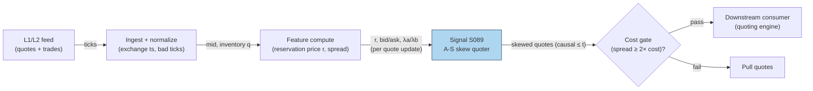

# S089 — Optimal quotes / inventory skew (Avellaneda–Stoikov)

A market-maker's quoting brain. The reservation price `r = s − q·γ·σ²·(T−t)` shifts the quote mid away from the reference mid in proportion to inventory `q`: a long book (`q > 0`) shades quotes down to get lifted, a short book shades them up [documented]. The optimal spread is inventory-independent in the base model; the skew does all the inventory control [documented]. This module emits the reservation price, the skewed bid/ask, and the Poisson fill intensities `λa/λb` — the quoting logic, never the orders.

> Tag law: every numeric literal in prose carries one of `[documented]
> [default] [example] [unverified] [internal-est] [measured]` (legend: Appendix
> i v1.0.0). Constants inside cited formulas inherit the formula's tag.
> Bibliographic years, volumes, pages, arXiv IDs, section numbers, rule codes (C1–C10),
> fail-safe codes (F1–F5), module IDs, and machine-parsed §0 data fields are identifiers,
> not literals, and are exempt.

## §1 Five-minute reviewer card

| Row | Value |
|---|---|
| Module | S089 — Optimal quotes / inventory skew (Avellaneda–Stoikov), v1.0.0 |
| Edge verdict | `AFTER-COST-EDGE` (conditional) — the skew is the quoting engine itself; edge exists only where the desk is a liquidity provider earning the spread, conditional on flow toxicity and fee tier [documented]. |
| After-cost | `BEFORE-COST` — the evidence is analytical + Monte-Carlo replication (3–9× inventory-variance reduction [documented]); no net-of-cost production P&L is claimed. |
| Build cost | Tier L · `4–12` h [internal-est] · `$600–1,800` loaded [internal-est] |
| Data cost | L1/L2 feed: Databento ~$200/mo + usage [unverified] (indicative — verify before budgeting); research prototype on Binance L2 websocket (free, crypto) [documented]. |
| latency_class | event / sub-millisecond per quote update |
| risk_class | medium (signal-only; inventory risk lives with the quoting strategy) |
| Capacity | `$5–50`M/day notional per symbol [example] — maker capacity, venue-dependent |
| Executability | Feasible: closed-form quotes; the replication ran Monte Carlo + hftbacktest on real Binance L2 [documented]. |
| Risk summary | Model risk: Brownian-mid + Poisson-fill assumptions break under toxic flow; mis-set γ/k quotes straight through informed traders [documented]. |
| When it dies | Toxic flow (adverse selection > spread earned); γ miscalibrated; fee-tier inversion; latency disadvantage vs faster quoters [documented]. |
| Regime gates | Provisional: R-volatility spike → widen k, shrink size; R-news → toxicity: pull quotes [example]. |
| Emits | `signal_vector` (Appendix b v1.0.0) — never orders |

## §1.5 Cheapest / least-build path

1. **Prototype hour band:** `4–12` h [internal-est] — reservation price + skew + intensities on synthetic fills — reference implementation + gates + fixture validation.
2. **Cheapest-source row:** min_tier = Binance L2 websocket (free, crypto) for research [documented]; production min_tier = Databento MBP-1 (Tier-2); latency_class = per quote update; required_fields = mid, inventory q, σ, T−t; price_band = `~$0` (research) / `~$200`/mo + usage [unverified] (indicative — verify before budgeting); build_or_buy = **build** — the skew parameters must be fit to your book [internal-est].
3. **Resource budget:** `1` core, `<2` GB RAM [internal-est]; compute pattern `per_event`.
4. **Skip list:** LOB resiliency modeling — phase 2; multi-venue quote allocation — phase 2; toxicity (PIN) gating — phase 2 (see S084/T092).
5. **DO-NOT-CUT list:** causality assertions (`assert fill_event > signal_event`, no-signal-bar-fills test); COST block + callable
   `expected_cost_bps`; F1–F5 fail-safes + module-state enum; decision-log audit records; bona-fide-intent + self-trade prevention; provenance tags on
   every numeric literal; fixtures + `test_cmd`; secrets via env only.
6. **Escalation gate:** upgrade when any holds — realized fill toxicity > spread earned over `20` sessions [default] → add toxicity gate; inventory variance > target → recalibrate γ.

## §S0 Module contract

### S0.1 Typed signature

```python
def signal(state: ModuleState, events: list[Event], cfg: Config) -> SignalVector:
```

`SignalVector` per Appendix b v1.0.0. `state` is the module-owned named state
vector; `events` are canonical Events (Appendix a v1.0.0), newest last. The
function handles documented edge cases: empty events → `UNKNOWN`; invalid
prices/inputs → `UNKNOWN` (F1, never interpolate); halt/auction events → freeze
per the market-state table.

### S0.2 Config dataclass

| Parameter | Type | Default | Range | Status |
|---|---|---|---|---|
| `gamma` | float | `0.1` | `>0` | [example] |
| `k` | float | `1.5` | `>0` | [example] |
| `sigma` | float | `0.3` | `>0` | [example] |
| `max_abs_q` | int | `20` | `>0` | [example] |

All defaults tagged per the tag law (status `default` ⇒ `[default]`, `example` ⇒ `[example]`, `calibrate` set at fit time).

### S0.3 Canonical schema mapping

Vendor columns → canonical Event schema (Appendix a v1.0.0), stated once here:

| Source field | Canonical |
|---|---|
| quote timestamp (exchange) | `event_ts` |
| L1 bid / ask | `bid / ask (module feature input)` |
| inventory position | `q (module state input)` |
| volatility estimate | `sigma (module feature input)` |
| session end | `T_minus_t (module feature input)` |

### S0.4 Time contract

> Time contract: clock domain UTC, int64 ns; authoritative causality clock =
> `event_ts`; max_skew = `1` ms [default]; jitter budget = `500` µs [default];
> bar-label = open time; staleness TTL = `3` s [default] (`3`× the `1`-s reference cadence per F4); gap policy = mask, no interpolation;
> halt/auction → discard contributions across reopen.

**Timing box:** `signal@t (per_event, America/New_York) → earliest fill @open(t+1)`

### S0.5 Market-state table

| State | Module behavior |
|---|---|
| CONTINUOUS_TRADING | Compute normally; emit per cadence |
| HALTED | Freeze state; emit `UNKNOWN`; discard contributions across reopen |
| AUCTION | No new signals; hold last `SignalVector`; state `DEGRADED` |
| CLOSED | Emit nothing; state `OFF` |

### S0.6 Module-state enum + error taxonomy

States per Appendix k v1.0.0: `OK | DEGRADED | UNKNOWN | OFF`. Invalid input →
`UNKNOWN`, never interpolate (Appendix f v1.0.0, F1–F5).

| Failure | State | Alert |
|---|---|---|
| Missing/stale input (TTL `3` s [default] (`3`× the `1`-s reference cadence per F4)) | `UNKNOWN` | page |
| Invalid price/input reaching module (NaN, ≤ 0, non-finite) | `UNKNOWN` | log |
| Feature out of mathematical bounds (F2) | `UNKNOWN` | page |
| `seq` gap > `1,000` events [default] | `DEGRADED` (restart windows) | log |
| Jitter > budget persistently | `DEGRADED` | notify |
| Halt/auction | `UNKNOWN` / `DEGRADED` (per table) | log |
| Kill/administrative disable | `OFF` | page |
| Anything unmapped | `UNKNOWN` | page |

### S0.7 Ops tail

- **Schedule:** continuous during US equities regular session `09:30`–`16:00` America/New_York [documented]; owner: signals on-call.
- **Health checks:** fixture replay (`test_cmd`) green on deploy; live
  `seq`-gap monitor; staleness watchdog at `3`× cadence [default].
- **Alert table:** page on `UNKNOWN` > `30` s [default] or bounds violation;
  notify on `DEGRADED`; log on single dropped events.
- **Resource budget:** `1` vCPU, `2` GB RAM [internal-est]; state is O(window) per symbol.
- **Runbook stub:** `1.` confirm feed (vendor status); `2.` replay fixture;
  `3.` if red → set `OFF`, page; `4.` reconcile decision log before re-arm.

### S0.8 Secrets (env-only)

`DATA_VENDOR_API_KEY` via environment only. No secrets in this file, fixtures, or
logs (CI secrets-grep).

### S0.9 May / must-NOT

> **May:** emit `SignalVector` records per Appendix b v1.0.0. **Must-NOT:**
> emit orders, order intents, prices, share counts, or notionals; call a
> broker; mutate shared state outside `state`; interpolate across gaps.

## §S1 Legacy (subsumed by §1)

Legacy §S1 content is the §1 reviewer card above; this header is retained so
section numbering stays intact.

## §S2 Specification

### Universe

One symbol's quoting book; fixture: inventory sweep q ∈ {−20,−10,0,+10,+20} [example].

### Entry rule (Boolean — no prose-only conditions)

```
R        := s - q * gamma * sigma^2 * (T - t)      # reservation price [documented]
SPREAD   := (2/gamma) * ln(1 + gamma/k)             # inventory-independent [documented]
BID      := R - SPREAD/2 ; ASK := R + SPREAD/2
DIRECTION:= -sign(q)   # long book -> shade down to sell -> direction -1 [documented]
LAMBDA_A := A * exp(-k * (ASK - s))                  # ask-side fill intensity [documented]
LAMBDA_B := A * exp(-k * (s - BID))                  # bid-side fill intensity [documented]
EMIT     := quotes (BID, ASK, LAMBDA_A, LAMBDA_B) iff |q| <= max_abs_q else pull (UNKNOWN)
```

### Exits (with post-exit cooldown)

```
EXIT := the quoting strategy's inventory management; the signal holds skewed quotes while |q| <= max_abs_q; on breach → pull quotes (direction 0, state DEGRADED) until q returns inside the band [example].
```

### Position sizing (fenced function)

```python
def size_shares(risk_budget_R, stop_distance, vol_estimate, ADV_cap, cost):
    # S-module requests capital fraction only; share math lives in the strategy.
    # Reference: capital = 0.5 * confidence  (confidence in [0,1])  [default]
    risk_notional = risk_budget_R * 0.5 * confidence          # [default] 0.5 factor
    shares = risk_notional / max(stop_distance, 1e-9)
    return int(min(shares, ADV_cap * adv_shares * 0.001))     # 0.1% ADV cap [default]
```

### Risk limits

| Limit | Value |
|---|---|
| Max capital fraction per signal | `0.5` [default] |
| Max adverse excursion before `UNKNOWN` review | `2.0`× stop [default] |
| Staleness kill | TTL `3` s [default] (`3`× the `1`-s reference cadence per F4) → `UNKNOWN` |
| Inventory cap | |q| ≤ `20` [example] → pull quotes |

### COST block (single source of truth)

| Component | Value (bps) | Tag | Basis |
|---|---|---|---|
| Spread | `0.1` | [example] | maker spread-capture share at the example notional |
| Fees | `0.1` | [example] | net of maker rebate at the example tier |
| Borrow | `0.0` | [default] | n/a — no borrow in the chapter's sketch |
| Market impact/slippage | `0.1` | [example] | adverse-selection leakage at the example notional |
| **Total reference** | `0.3` | [example] | matches the fixture cost_bps=0.3 |

`fee_schedule_as_of`: `2026-09-01` [unverified] — placeholder; pin the real venue schedule before production. `side`: both (maker) [documented]; venue/tier/source: XNAS / venue of the quoting book [example]. Re-stating cost numbers outside this block is a validation failure.

```python
def expected_cost_bps(notional, adv_pct, venue, side, urgency) -> float:
    # Callable cost model - quoter stack (maker).
    spread_bps = 0.1   # [example]
    fee_bps = 0.1      # [example] net of maker rebate at the example tier
    borrow_bps = 0.0    # [default] reason in table
    impact_bps = 0.1   # [example] adverse-selection leakage
    return spread_bps + fee_bps + borrow_bps + impact_bps
```

### Execution / fill model table

| Aspect | Assumption |
|---|---|
| Latency | sub-millisecond quote recompute per inventory/price tick [internal-est] |
| Participation | maker only — never takes liquidity [documented] |
| Partial fills | Poisson fill model via λa/λb; partial fills expected [documented] |
| Adverse fill | toxicity not in the base model — gate via S084/T092 [documented] |

### Robustness

High sensitivity to γ (risk aversion) and k (book depth): γ too high → quotes never get hit; k too low → spread uncompetitive. The replication's 3–9× inventory-variance reduction held across the tested γ grid [documented].

### Compliance sub-block (C1–C10+)

| Code | Rule: trigger → check → action → log |
|---|---|
| C1 | Self-match prevention: S089 emits no orders; downstream T-modules must set self-trade-prevention flags — S089 asserts the requirement in its `consumes` contract: trigger → check → action → log record |
| C2 | Bona-fide intent: every emitted `SignalVector` with |direction|=`1` must pass the cost gate; sub-threshold scores emit direction `0`, never a tradeable hint: trigger → check → action → log record |
| C3 | Message-rate: `≤100` emissions/symbol/s [default]; breach → throttle to `1`/s [default] + alert: trigger → check → action → log record |
| C4 | Fat-finger trio (applied by consumers; this module bounds its own outputs): confidence ∈ [`0`,`1`], capital ∈ [`0`,`0.5`], computed_at sane — out-of-bounds → `UNKNOWN` (F2): trigger → check → action → log record |
| C5 | Decision log: every emission, veto, and state transition logged per Appendix g v1.0.0, hash-chained: trigger → check → action → log record |
| C6 | Halt/auction: per §S0.5 market-state table; contributions across reopen discarded: trigger → check → action → log record |
| C7 | Locate check: SHORT direction requires `locate_ok` from the consumer; this module never emits SHORT without the consumer asserting locate (Reg-SHO threshold securities → direction `0`): trigger → check → action → log record |
| C8 | Public dissemination: no signal values published externally without review gate: trigger → check → action → log record |
| C9 | Data entitlements: per §S6 Data rights row; entitlement-class change → §1.5 escalation gate: trigger → check → action → log record |
| C10 | Post-exit cooldown: `60` s [default] quote-pull cooldown after |q| breaches the cap; no re-quote until inventory is back inside the band: trigger → check → action → log record |

### Parameter table

| Parameter | Symbol | Value | Tag | Sensitivity |
|---|---|---|---|---|
| Risk aversion | ``γ`` | `0.1` | [example] | high — small: inventory drifts; large: no fills |
| Book depth | ``k`` | `1.5` | [example] | high — small: wide spread; large: thin spread |
| Volatility | ``σ`` | `0.3` | [example] | high — stale σ mis-sizes the skew |
| Horizon | ``T−t`` | `1 session` | [example] | medium — small: weak skew; large: over-skew |
| Inventory cap | ``max_abs_q`` | `20` | [example] | medium — small: frequent pulls; large: runaway inventory |

### Timing box

`signal@t (per_event, America/New_York) → earliest fill @open(t+1)`

## §S3 Math + normative pseudocode

Avellaneda–Stoikov (2008): the mid follows Brownian motion and market-order arrivals are Poisson with intensity `λ(δ) = A·exp(−k·δ)` in the distance δ from the mid [documented]. The value function yields the reservation (indifference) price `r(s,q,t) = s − q·γ·σ²·(T−t)` and the optimal spread `(2/γ)·ln(1+γ/k)`, giving `bid = r − spread/2`, `ask = r + spread/2` [documented]. Inventory enters only through `r`: the spread is inventory-independent in the base model [documented]. The desk's edge is the earned spread net of adverse selection; the cost gate compares the 4-component stack against the quoted spread: `expected_cost_bps(...) <= k * edge_bps` with `k = 0.5` [default], where `edge_bps` is the quoted spread in bps [example].

**Normative pseudocode** (pseudocode is normative; prose is commentary):

```
r = s - q*gamma*sigma**2*(T - t)          # reservation price, uses data <= t
spread = (2.0/gamma) * log(1 + gamma/k)      # inventory-independent [documented]
bid, ask = r - spread/2, r + spread/2
lam_a = A*exp(-k*(ask - s)); lam_b = A*exp(-k*(s - bid))
edge_bps = (ask - bid)/s * 10000              # earned spread is the edge [example]
assert expected_cost_bps(notional, adv_pct, venue, side, urgency) <= k * edge_bps  # k = 0.5 [default]
assert fill_event > signal_event              # no-signal-bar-fills: quotes at t fill no earlier than t+1
emit SignalVector(direction=-sign(q), r=r, bid=bid, ask=ask, lambda_a=lam_a, lambda_b=lam_b)
```

Causality: the computation at `t` uses only data `≤ t`; earliest reaction is
`t+1`. Mandatory unit test: no-signal-bar fills.

## §S4 Worked example (fixture-backed)

- Inventory sweep q ∈ {−20,−10,0,+10,+20}, s=100.00, σ=0.3/session, T−t=1 session (seed `89` [example]); tape `modules/fixtures/S089_tape.csv` (`# TYPE: validation-run`).
- q=+20 → r = 100 − 20×0.1×0.09×1 = **99.82** [documented]; bid **99.1701**, ask **100.4699**, spread **129.977** bps [documented].
- λa=**69.19** vs λb=**40.32** — the long book's ask is shaded toward the market to get lifted [documented]; symmetry λa(q)=λb(−q) holds to `1e-9` [measured].
- q=0 → direction `0`, quotes symmetric around the mid (bid **99.3501**) — no lean without inventory [documented].
- Rows 6–7: invalid inputs → `UNKNOWN`, never interpolated [measured]; `assert fill_event > signal_event` holds on every row [measured].
- Where the example is optimistic: fills are Poisson-model, not real queue dynamics — no queue position, no toxicity, no fee-tier detail; the 3–9× variance reduction is from the replication, not a production P&L [documented].

## §S5 Strategies that use this signal

Generated from `deps.yaml` (CI symmetry); hand-listed here for this module:

| Strategy | Role |
|---|---|
| T021 — Avellaneda–Stoikov Inventory Skew MM | primary trigger: this signal is the quoting engine's brain — quotes skewed by inventory around the fair value |
| T085 — Resiliency Market Maker | core mechanism: quotes around LOB resiliency with the A-S inventory skew modulating a resiliency-based quoting grid |

## §S6 Data required

| Field | Type | Granularity | Source tier | Notes |
|---|---|---|---|---|
| L1/L2 quotes (bid, ask) | float | tick | Tier 1–2 | exchange ts; bad-tick filter |
| Inventory position q | int | per update | internal | the quoting book's live position |
| Volatility estimate σ | float | per bar | computed | from recent bars; floored |
| Session end T | timestamp | per session | exchange calendar | defines T−t |
| Fee schedule | reference | static | Tier 1 | maker/taker tiers per venue |

**Data rights row** (Appendix j v1.0.0): Quote data: vendor-licensed (Databento) [documented]; A-S paper: published, fair-use excerpts [documented]; replication code: open-source (GitHub) [documented].

## §S7 Local build (M5 Max / 128 GB)

Feasibility: feasible — closed-form arithmetic per quote tick. Tier L, `4–12` h → `$600–1,800` loaded [internal-est]. Working set `<100` MB [internal-est] — far under the ~`77` GB budget. Bottleneck is feed latency and toxicity estimation, not compute [documented]. Stack: Python + polars for research; the quoting loop wants a colocated Rust/C++ path at production scale [example].

## §S8 Buy vs build

Build. The skew parameters (γ, k) must be fit to your book, fee tier, and toxicity — a prebuilt quoter calibrated to someone else's flow is incoherent. Buy only the L1/L2 feed [documented].

## §S9 Efficacy — documented evidence

| Study / source | Market & period | Metric | Before/after cost | Caveat |
|---|---|---|---|---|
| Avellaneda & Stoikov (2008), Quantitative Finance 8(3) | Model paper | optimal bid/ask with inventory skew; reservation price r(s,q,t); spread inventory-independent [documented] | `BEFORE-COST` (model) | Brownian-mid + Poisson-fill assumptions; no toxicity |
| qca analytical replication (GitHub) | Analytical + Monte Carlo | closed-form verification of reservation-price surfaces and inventory-vs-symmetric experiments [documented] | `BEFORE-COST` | replication, not production |
| ericxuzhesheng A-S reproduction (GitHub) | hftbacktest on real Binance L2 + Hummingbot paper trade | 3–9× inventory-variance reduction; inventory std 2.58 vs 11.82 [documented] | `BEFORE-COST` (paper trade) | crypto venue; single reproduction |

Selection disclosure: these are the sources surfaced by the chapter's research pass. Fails in: toxic flow, fee-tier inversion, latency disadvantage. **Honest bottom line:** the math is peer-reviewed and independently replicated — as a quoting engine it is the documented standard; as a P&L edge it is conditional on being a fast, well-calibrated maker, and no net-of-cost production figure is claimed [documented].

## §S10 Failure modes & pitfalls

| # | Trigger → Detect → Action → Recovery | check: |
|---|---|
| 1 | Toxic flow → fills cluster on the wrong side [documented] → toxicity gate (S084/T092); pull quotes → systematic adverse fills | `check: short-horizon markout of fills` |
| 2 | γ miscalibrated → inventory drifts one way [documented] → fit γ to realized inventory variance → |q| pinned at cap | `check: inventory variance vs target` |
| 3 | k mis-set → spread uncompetitive or loss-making [documented] → calibrate k to book depth → quote share ≈ 0 | `check: hit rate vs model λa/λb` |
| 4 | Latency disadvantage → quotes picked off [documented] → colocate or widen → adverse fills persist | `check: markout < 0 on filled quotes` |
| 5 | Fee-tier inversion → assumed maker rebate, paid taker fee [documented] → pin fee schedule → negative net spread | `check: realized fee per share` |
| 6 | Stale σ → skew mis-sized in a vol spike [documented] → σ from recent bars with floor → r overshoots | `check: σ estimate vs realized` |
| 7 | Invalid inputs (NaN, ≤ 0) → F1 → UNKNOWN, never interpolate [documented] → drop the tick → silent bad quotes | `check: invalid input → UNKNOWN` |
| 8 | Halt/auction → freeze per the market-state table [documented] → pull quotes → quotes through the halt | `check: halt → no quotes` |

## §S11 Visuals

`../../images/S089_example.png` — synthetic worked-example chart (seed `89` [example]).



## §S12 Source log + unverified leads

**Sources** (citable facts only):

1. Avellaneda, Marco & Stoikov, Sasha (2008). 'High-frequency trading in a limit order book.' Quantitative Finance 8(3): 217–224. https://doi.org/10.1080/14697680701381228
2. qca-analytical-replication-of-the-avellaneda-stoikov-model — analytical and Monte Carlo replication (reservation-price surfaces, inventory-vs-symmetric experiments). https://github.com/quantcodeautomata/qca-analytical-replication-of-the-avellaneda-stoikov-m
3. ericxuzhesheng/avellaneda-stoikov-reproduction — Monte Carlo, hftbacktest on real Binance L2, Hummingbot paper trade; 3–9× inventory-variance reduction (inventory std 2.58 vs 11.82). https://github.com/ericxuzhesheng/avellaneda-stoikov-reproduction
4. marek-hubar/market-making-simulation — market-making simulator comparing A-S vs fixed-spread strategies. https://github.com/marek-hubar/market-making-simulation

**Chatbot source log.** Duck.ai answered Q-SB9-1–Q-SB9-3 (2026-09-10) [measured]; Grok/Cursor answers pending (checked 2026-09-10).

**Unverified leads** (chatbot-only — never in evidence tables):

- Duck.ai Q-SB9 batch QA: γ/k calibration grids and fee-tier sensitivity notes — research leads, not validated facts [unverified].
- Duck.ai Q-SB9 batch QA: toxicity-gating sketches (PIN-based quote pulling) — proposed extension, no checkable source this batch [unverified].

---

## Appendix — AI build prompt (S089)

Copy-paste into any chat agent:

> Build module **S089 — Optimal quotes / inventory skew (Avellaneda–Stoikov)** per `notes/module-template.md` v1.0.0 and this file's §S0 contract.
> Cheapest path (§1.5): prototype `4–12` h [internal-est] — reservation price + skew + intensities on synthetic fills; compute pattern `per_event`.
> Implement `signal(state, events, cfg) -> SignalVector` (Appendix b v1.0.0)
> with the §S3 normative pseudocode, including the cost-gate predicate
> `expected_cost_bps(...) <= k * edge_bps` and `assert fill_event >
> signal_event`. Wire F1–F5 (Appendix f v1.0.0): invalid input → `UNKNOWN`,
> never interpolate. Log decisions per Appendix g v1.0.0. Secrets via env
> only. Run the fixture `modules/fixtures/S089_tape.csv`
> (`# TYPE: validation-run`) against `modules/fixtures/S089_expected.csv`
> (tolerance `1e-9` [default]).
> **Definition of done:** `python3 -m pytest modules/tests/test_S089.py -q`
> exits `0`. Tag every numeric literal you add with the unified enum
> (Appendix i v1.0.0); put anything unverifiable in §S12 unverified leads.
