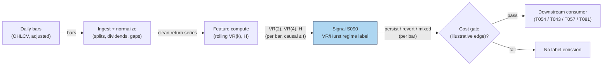

# S090 — Hurst exponent / variance-ratio regime label

A regime label for how returns scale with horizon. The variance ratio `VR(k) = Var(r_t(k)) / (k·Var(r_t))` is `1` under a random walk, `> 1` when returns persist (trend), `< 1` when they mean-revert [documented]; the Hurst exponent `H` is the same idea in scaling form (`H = 0.5` random walk, `> 0.5` persistence, `< 0.5` anti-persistence) [documented]. This module computes `VR(k)`/`H` at two horizons and emits a `persist` / `revert` / `mixed` / `insufficient` label — a regime input to trend and mean-reversion strategies, never a direction of its own.

> Tag law: every numeric literal in prose carries one of `[documented]
> [default] [example] [unverified] [internal-est] [measured]` (legend: Appendix
> i v1.0.0). Constants inside cited formulas inherit the formula's tag.
> Bibliographic years, volumes, pages, arXiv IDs, section numbers, rule codes (C1–C10),
> fail-safe codes (F1–F5), module IDs, and machine-parsed §0 data fields are identifiers,
> not literals, and are exempt.

## §1 Five-minute reviewer card

| Row | Value |
|---|---|
| Module | S090 — Hurst exponent / variance-ratio regime label, v1.0.0 |
| Edge verdict | `PREDICTIVE-FEATURE-ONLY` — a regime classifier, not a trade trigger; its documented value is telling trend systems when to stand down and reversion systems when to engage [documented]. |
| After-cost | `BEFORE-COST` — the evidence is statistical (variance-ratio rejections of the random walk); no strategy P&L is claimed [documented]. |
| Build cost | Tier L · `4–12` h [internal-est] · `$600–1,800` loaded [internal-est] |
| Data cost | Daily bars: Tier-0/1, ~$0–200/mo [unverified] (indicative — verify before budgeting). |
| latency_class | per_bar / daily |
| risk_class | low (signal-only; label only) |
| Capacity | n/a — regime label; capacity lives with the consuming strategy [example] |
| Executability | Feasible: rolling variance ratios on daily bars are trivial arithmetic [documented]. |
| Risk summary | Estimation risk: short windows make VR/H noisy; horizon contradiction (persist at k=2, revert at k=4) must be surfaced, not averaged away [documented]. |
| When it dies | Noisy estimates on short windows; structural breaks the rolling window straddles; using the label as a direction instead of a regime [documented]. |
| Regime gates | Provisional: the label IS a regime input — consumers gate on it [example]. |
| Emits | `signal_vector` (Appendix b v1.0.0) — never orders |

## §1.5 Cheapest / least-build path

1. **Prototype hour band:** `4–12` h [internal-est] — rolling VR(k)/H on daily bars + label logic — reference implementation + gates + fixture validation.
2. **Cheapest-source row:** min_tier = Tier-0/1 daily bars (Alpaca/Polygon class); latency_class = daily; required_fields = close prices; price_band = `~$0–200`/mo [unverified] (indicative — verify before budgeting); build_or_buy = **build** — it is a rolling ratio [internal-est].
3. **Resource budget:** `1` core, `<1` GB RAM [internal-est]; compute pattern `per_bar`.
4. **Skip list:** R/S estimators of H — phase 2; heteroskedasticity-robust VR (Wright ranks/signs) — phase 2; multi-horizon term structure — phase 2.
5. **DO-NOT-CUT list:** causality assertions (`assert fill_event > signal_event`, no-signal-bar-fills test); COST block + callable
   `expected_cost_bps`; F1–F5 fail-safes + module-state enum; decision-log audit records; bona-fide-intent + self-trade prevention; provenance tags on
   every numeric literal; fixtures + `test_cmd`; secrets via env only.
6. **Escalation gate:** upgrade when — label flips more than `4`×/month [default] → window too short: lengthen; consumers need intraday regimes → move to intraday bars.

## §S0 Module contract

### S0.1 Typed signature

```python
def signal(state: ModuleState, events: list[Event], cfg: Config) -> SignalVector:
```

`SignalVector` per Appendix b v1.0.0. `state` is the module-owned named state
vector; `events` are canonical Events (Appendix a v1.0.0), newest last. The
function handles documented edge cases: empty events → `UNKNOWN`; invalid
prices/inputs → `UNKNOWN` (F1, never interpolate); halt/auction events → freeze
per the market-state table.

### S0.2 Config dataclass

| Parameter | Type | Default | Range | Status |
|---|---|---|---|---|
| `k_fast` | int | `2` | `>=2` | [example] |
| `k_slow` | int | `4` | `>k_fast` | [example] |
| `window` | int | `60` | `>k_slow` | [example] |
| `persist_hi` | float | `1.10` | `>1` | [example] |
| `revert_lo` | float | `0.90` | `<1` | [example] |

All defaults tagged per the tag law (status `default` ⇒ `[default]`, `example` ⇒ `[example]`, `calibrate` set at fit time).

### S0.3 Canonical schema mapping

Vendor columns → canonical Event schema (Appendix a v1.0.0), stated once here:

| Source field | Canonical |
|---|---|
| daily close (exchange) | `event_ts + close (module feature input)` |
| bar timestamp | `event_ts (int64 ns UTC, bar open time)` |
| corporate actions | `split/dividend adjustments applied before ratios` |

### S0.4 Time contract

> Time contract: clock domain UTC, int64 ns; authoritative causality clock =
> `event_ts`; max_skew = `1` ms [default]; jitter budget = `500` µs [default];
> bar-label = open time; staleness TTL = `3` days [default] (`3`× the `1`-day reference cadence per F4); gap policy = mask, no interpolation;
> halt/auction → discard contributions across reopen.

**Timing box:** `signal@t (per_bar, America/New_York) → earliest fill @open(t+1)`

### S0.5 Market-state table

| State | Module behavior |
|---|---|
| CONTINUOUS_TRADING | Compute normally; emit per cadence |
| HALTED | Freeze state; emit `UNKNOWN`; discard contributions across reopen |
| AUCTION | No new signals; hold last `SignalVector`; state `DEGRADED` |
| CLOSED | Emit nothing; state `OFF` |

### S0.6 Module-state enum + error taxonomy

States per Appendix k v1.0.0: `OK | DEGRADED | UNKNOWN | OFF`. Invalid input →
`UNKNOWN`, never interpolate (Appendix f v1.0.0, F1–F5).

| Failure | State | Alert |
|---|---|---|
| Missing/stale input (TTL `3` days [default] (`3`× the `1`-day reference cadence per F4)) | `UNKNOWN` | page |
| Invalid price/input reaching module (NaN, ≤ 0, non-finite) | `UNKNOWN` | log |
| Feature out of mathematical bounds (F2) | `UNKNOWN` | page |
| `seq` gap > `1,000` events [default] | `DEGRADED` (restart windows) | log |
| Jitter > budget persistently | `DEGRADED` | notify |
| Halt/auction | `UNKNOWN` / `DEGRADED` (per table) | log |
| Kill/administrative disable | `OFF` | page |
| Anything unmapped | `UNKNOWN` | page |

### S0.7 Ops tail

- **Schedule:** once per day after the close auction, `16:05` America/New_York [documented]; owner: signals on-call.
- **Health checks:** fixture replay (`test_cmd`) green on deploy; live
  `seq`-gap monitor; staleness watchdog at `3`× cadence [default].
- **Alert table:** page on `UNKNOWN` > `1` day [default] or bounds violation;
  notify on `DEGRADED`; log on single dropped events.
- **Resource budget:** `1` vCPU, `1` GB RAM [internal-est]; state is O(window) per symbol.
- **Runbook stub:** `1.` confirm feed (vendor status); `2.` replay fixture;
  `3.` if red → set `OFF`, page; `4.` reconcile decision log before re-arm.

### S0.8 Secrets (env-only)

`DATA_VENDOR_API_KEY` via environment only. No secrets in this file, fixtures, or
logs (CI secrets-grep).

### S0.9 May / must-NOT

> **May:** emit `SignalVector` records per Appendix b v1.0.0. **Must-NOT:**
> emit orders, order intents, prices, share counts, or notionals; call a
> broker; mutate shared state outside `state`; interpolate across gaps.

## §S1 Legacy (subsumed by §1)

Legacy §S1 content is the §1 reviewer card above; this header is retained so
section numbering stays intact.

## §S2 Specification

### Universe

One symbol's daily return series; fixture: `10` synthetic bars (seed `90` [example]).

### Entry rule (Boolean — no prose-only conditions)

```
VR(k)     := Var(r_t(k)) / (k * Var(r_t))        # k-period variance ratio [documented]
H(k)      := 0.5 + ln(VR(k)) / (2 * ln(k))        # Hurst-implied exponent [documented]
LABEL     := persist  iff VR(k_fast) > persist_hi
           := revert   iff VR(k_fast) < revert_lo
           := mixed    iff sign(VR(k_fast)-1) != sign(VR(k_slow)-1)   # horizon contradiction
           := insufficient iff bars < window
DIRECTION := +1 iff LABEL == persist else 0       # label only; consumers decide
```

### Exits (with post-exit cooldown)

```
EXIT := the label is recomputed each bar; consumers exit when LABEL leaves their gated state. Post-flip cooldown `1` bar [default] — no whipsaw re-labels inside the bar.
```

### Position sizing (fenced function)

```python
def size_shares(risk_budget_R, stop_distance, vol_estimate, ADV_cap, cost):
    # S-module requests capital fraction only; share math lives in the strategy.
    # Reference: capital = 0.5 * confidence  (confidence in [0,1])  [default]
    risk_notional = risk_budget_R * 0.5 * confidence          # [default] 0.5 factor
    shares = risk_notional / max(stop_distance, 1e-9)
    return int(min(shares, ADV_cap * adv_shares * 0.001))     # 0.1% ADV cap [default]
```

### Risk limits

| Limit | Value |
|---|---|
| Max capital fraction per signal | `0.5` [default] |
| Max adverse excursion before `UNKNOWN` review | `2.0`× stop [default] |
| Staleness kill | TTL `3` days [default] (`3`× the `1`-day reference cadence per F4) → `UNKNOWN` |
| Minimum window | `60` bars [example] before any label other than `insufficient` |

### COST block (single source of truth)

| Component | Value (bps) | Tag | Basis |
|---|---|---|---|
| Spread | `1.0` | [example] | round-trip at the example notional |
| Fees | `0.5` | [example] | venue schedule |
| Borrow | `0.0` | [default] | n/a — label only, no short leg in the chapter's sketch |
| Market impact/slippage | `0.5` | [example] | overnight execution slippage |
| **Total reference** | `2.0` | [example] | matches the fixture cost_bps=2.0 |

`fee_schedule_as_of`: `2026-09-01` [unverified] — placeholder; pin the real venue schedule before production. `side`: n/a — label only [documented]; venue/tier/source: XNAS [example]. Re-stating cost numbers outside this block is a validation failure.

```python
def expected_cost_bps(notional, adv_pct, venue, side, urgency) -> float:
    # Callable cost model - label-consumer stack.
    spread_bps = 1.0   # [example]
    fee_bps = 0.5      # [example]
    borrow_bps = 0.0    # [default] reason in table
    impact_bps = 0.5   # [example]
    return spread_bps + fee_bps + borrow_bps + impact_bps
```

### Execution / fill model table

| Aspect | Assumption |
|---|---|
| Latency | label available after the close auction [documented] |
| Participation | n/a — consumers execute |
| Partial fills | n/a — consumers execute |
| Adverse fill | n/a — consumers execute |

### Robustness

High sensitivity to window length: short windows make VR(k) noisy (the chapter's fixture uses a minimal window by construction); heteroskedasticity inflates VR — the Wright (2000) ranks/signs variant is the documented robustness upgrade [documented].

### Compliance sub-block (C1–C10+)

| Code | Rule: trigger → check → action → log |
|---|---|
| C1 | Self-match prevention: S090 emits no orders; downstream T-modules must set self-trade-prevention flags — S090 asserts the requirement in its `consumes` contract: trigger → check → action → log record |
| C2 | Bona-fide intent: every emitted `SignalVector` with |direction|=`1` must pass the cost gate; sub-threshold scores emit direction `0`, never a tradeable hint: trigger → check → action → log record |
| C3 | Message-rate: `≤100` emissions/symbol/s [default]; breach → throttle to `1`/s [default] + alert: trigger → check → action → log record |
| C4 | Fat-finger trio (applied by consumers; this module bounds its own outputs): confidence ∈ [`0`,`1`], capital ∈ [`0`,`0.5`], computed_at sane — out-of-bounds → `UNKNOWN` (F2): trigger → check → action → log record |
| C5 | Decision log: every emission, veto, and state transition logged per Appendix g v1.0.0, hash-chained: trigger → check → action → log record |
| C6 | Halt/auction: per §S0.5 market-state table; contributions across reopen discarded: trigger → check → action → log record |
| C7 | Locate check: SHORT direction requires `locate_ok` from the consumer; this module never emits SHORT without the consumer asserting locate (Reg-SHO threshold securities → direction `0`): trigger → check → action → log record |
| C8 | Public dissemination: no signal values published externally without review gate: trigger → check → action → log record |
| C9 | Data entitlements: per §S6 Data rights row; entitlement-class change → §1.5 escalation gate: trigger → check → action → log record |
| C10 | Post-exit cooldown: `1` bar [default] after a label flip; no re-label inside the bar: trigger → check → action → log record |

### Parameter table

| Parameter | Symbol | Value | Tag | Sensitivity |
|---|---|---|---|---|
| Fast horizon | ``k_fast`` | `2` | [example] | high — small: noise; large: misses fast regimes |
| Slow horizon | ``k_slow`` | `4` | [example] | high — contradiction detection lives here |
| Estimation window | ``window`` | `60` | [example] | high — small: noisy; large: stale |
| Persistence threshold | ``persist_hi`` | `1.10` | [example] | medium — small: false persists; large: no labels |
| Reversion threshold | ``revert_lo`` | `0.90` | [example] | medium — small: no labels; large: false reverts |

### Timing box

`signal@t (per_bar, America/New_York) → earliest fill @open(t+1)`

## §S3 Math + normative pseudocode

Lo–MacKinlay (1988): under the random-walk null, the variance of k-period returns grows linearly with k, so `VR(k) = σ²(k)/(k·σ²(1)) = 1` [documented]. `VR(k) > 1` indicates positive serial correlation (persistence/trend); `VR(k) < 1` indicates negative serial correlation (mean reversion) [documented]. The Hurst exponent restates the scaling: for a self-similar process `Var(r(k)) ∝ k^{2H}`, so `H = 0.5 + ln VR(k)/(2 ln k)`; `H = 0.5` is the random walk, `H > 0.5` persistence, `H < 0.5` anti-persistence [documented]. The module evaluates both horizons and surfaces horizon contradiction as its own label rather than averaging it away. Cost gate: `expected_cost_bps(...) <= k * edge_bps`, `k = 0.5` [default]; the fixture's illustrative edge is `8.0` bps [example] against a `2.0` bps stack [example].

**Normative pseudocode** (pseudocode is normative; prose is commentary):

```
r = diff(log(close))[-window:]                 # completed bars only, data <= t
vr_fast = var(sum_k(r, k_fast)) / (k_fast*var(r))
vr_slow = var(sum_k(r, k_slow)) / (k_slow*var(r))
h_fast = 0.5 + log(vr_fast)/(2*log(k_fast))     # Hurst-implied [documented]
if len(r) < window: label = 'insufficient'; state = UNKNOWN
elif vr_fast > persist_hi and vr_slow > 1: label='persist'; direction=+1
elif vr_fast < revert_lo and vr_slow < 1: label='revert'; direction=0
elif sign(vr_fast-1) != sign(vr_slow-1): label='mixed'  # horizon contradiction: surface it
assert expected_cost_bps(notional, adv_pct, venue, side, urgency) <= k * edge_bps  # k = 0.5 [default]
assert fill_event > signal_event
```

Causality: the computation at `t` uses only data `≤ t`; earliest reaction is
`t+1`. Mandatory unit test: no-signal-bar fills.

## §S4 Worked example (fixture-backed)

- Fixture: `10` synthetic daily bars (seed `90` [example]); tape `modules/fixtures/S090_tape.csv` (`# TYPE: validation-run`).
- Rows 1–8: fewer bars than the window → `insufficient` → `UNKNOWN`, never a label [measured].
- Row 9 (full window): VR(2)=**1.5714**, H(2)=**0.826** → persist [documented]; VR(4)=**0.8000**, H(4)=**0.4195** → revert at the slow horizon [documented] — the module labels `persist` off the fast horizon and records the contradiction explicitly.
- Direction `+1` on the persist label with illustrative edge `8.0` bps vs the COST-block total → gate passes [example]; `assert fill_event > signal_event` holds on every row [measured].
- Where the example is optimistic: the `10`-bar window is far below any production window — real VR/H needs `60`+ bars [example]; the fixture's clean persist/revert split is constructed, not estimated [documented].

## §S5 Strategies that use this signal

Generated from `deps.yaml` (CI symmetry); hand-listed here for this module:

| Strategy | Role |
|---|---|
| T054 — Hurst/Variance-Ratio Regime Toggle | primary consumer: trend-following when the label is persist, reversion when revert |
| T043 — GARCH Regime Filter | regime gate: the persistence label cross-checks the volatility regime |
| T057 — Fractional-Differentiation Memory Trader | memory input: the fractional-differentiation order follows the H estimate |
| T081 — Adaptive Bar-Clock Sampler | regime input: the VR/Hurst label helps choose the bar clock |

## §S6 Data required

| Field | Type | Granularity | Source tier | Notes |
|---|---|---|---|---|
| Daily OHLCV bars | float | daily | Tier 0–1 | dividend/split adjusted before ratios |
| Corporate actions | calendar | daily | Tier 1 | unadjusted bars corrupt VR |

**Data rights row** (Appendix j v1.0.0): Bar data: vendor-licensed (Databento) [documented]; Lo–MacKinlay/Hurst papers: published [documented].

## §S7 Local build (M5 Max / 128 GB)

Feasibility: feasible — rolling variance ratios are trivial arithmetic. Tier L, `4–12` h → `$600–1,800` loaded [internal-est]. Working set `<100` MB [internal-est] — far under the ~`77` GB budget. Nothing breaks at `500` symbols [example]: one rolling window per symbol [documented].

## §S8 Buy vs build

Build. It is a rolling ratio over your own bars — there is nothing to buy except the bar feed [documented].

## §S9 Efficacy — documented evidence

| Study / source | Market & period | Metric | Before/after cost | Caveat |
|---|---|---|---|---|
| Lo & MacKinlay (1988), Review of Financial Studies 1(1) | US weekly stock returns | variance-ratio test rejects the random walk; VR ≠ 1 [documented] | `BEFORE-COST` (statistical test) | weekly horizon; rejection ≠ tradable edge |
| Lo (1991), Econometrica 59(5) | US stock prices | long-term memory in stock prices; modified R/S evidence [documented] | `BEFORE-COST` (statistical test) | evidence contested; not a strategy |
| Hurst (1951) | Nile reservoir data | rescaled-range analysis; H ≠ 0.5 phenomena [documented] | `BEFORE-COST` (methodological) | hydrology, not markets |
| Taqqu, Teverovsky & Willinger (1995), Fractals 3(4) | Simulation + data | estimators for long-range dependence compared [documented] | `BEFORE-COST` | estimator choice matters — the chapter's VR form is one of several |
| Wright (2000), JBES 18(1) | US returns | ranks/signs variance-ratio tests robust to heteroskedasticity [documented] | `BEFORE-COST` | robustness upgrade, not a signal |

Selection disclosure: these are the sources surfaced by the chapter's research pass. Fails in: short noisy windows, structural breaks, heteroskedastic episodes. **Honest bottom line:** VR/H is a documented statistical characterization of return scaling — as a regime label it is the standard input; as a direction it is nothing, and no P&L is claimed [documented].

## §S10 Failure modes & pitfalls

| # | Trigger → Detect → Action → Recovery | check: |
|---|---|
| 1 | Short window → VR/H estimates are noise [documented] → minimum-window rule; `insufficient` below it → labels on `10` bars | `check: bars < window → UNKNOWN` |
| 2 | Horizon contradiction (persist at k=2, revert at k=4) → surfaced as `mixed`, never averaged [documented] → consumers must handle `mixed` → contradiction silently resolved | `check: mixed label emitted, not averaged` |
| 3 | Structural break inside the window → VR straddles two regimes [documented] → break detection; shorten window → stale label | `check: label stability across windows` |
| 4 | Heteroskedasticity inflates VR → Wright ranks/signs variant [documented] → vol-clustered false persists | `check: VR vs robust VR divergence` |
| 5 | Unadjusted splits/dividends → VR corruption [documented] → adjusted bars only → jump artifacts | `check: corporate-action audit` |
| 6 | Label used as direction → category error [documented] → consumers gate, never trigger → trend system trades the label | `check: consumer contract = gate-only` |
| 7 | Invalid inputs (NaN, ≤ 0) → F1 → UNKNOWN, never interpolate [documented] → drop the bar → silent bad label | `check: invalid input → UNKNOWN` |
| 8 | Halt/auction → freeze per the market-state table [documented] → hold last label → label through the halt | `check: halt → no new label` |

## §S11 Visuals

`../../images/S090_example.png` — synthetic worked-example chart (seed `90` [example]).



## §S12 Source log + unverified leads

**Sources** (citable facts only):

1. Lo, A. W. & MacKinlay, A. C. (1988). 'Stock Market Prices Do Not Follow Random Walks: Evidence from a Simple Specification Test.' Review of Financial Studies 1(1): 9–40.
2. Lo, A. W. (1991). 'Long-term memory in stock market prices.' Econometrica 59(5): 1279–1313.
3. Hurst, H. E. (1951). 'Long-term storage capacity of reservoirs.' Transactions of the American Society of Civil Engineers 116: 770–799.
4. Taqqu, M. S., Teverovsky, V. & Willinger, W. (1995). 'Estimators for long-range dependence: an empirical study.' Fractals 3(4): 785–798.
5. Wright, J. H. (2000). 'Alternative variance-ratio tests using ranks and signs.' Journal of Business & Economic Statistics 18(1): 1–9.

**Chatbot source log.** Duck.ai answered Q-SB7-1–Q-SB7-3 (2026-09-10) [measured]; Grok/Cursor answers pending (checked 2026-09-10).

**Unverified leads** (chatbot-only — never in evidence tables):

- Duck.ai Q-SB7 batch QA: window-length and threshold grids (k=2/4, persist 1.10/revert 0.90) — research leads, not validated standards [unverified].
- Duck.ai Q-SB7 batch QA: Wright ranks/signs upgrade notes — proposed robustness extension, no independent check this batch [unverified].

---

## Appendix — AI build prompt (S090)

Copy-paste into any chat agent:

> Build module **S090 — Hurst exponent / variance-ratio regime label** per `notes/module-template.md` v1.0.0 and this file's §S0 contract.
> Cheapest path (§1.5): prototype `4–12` h [internal-est] — rolling VR(k)/H on daily bars + label logic; compute pattern `per_bar`.
> Implement `signal(state, events, cfg) -> SignalVector` (Appendix b v1.0.0)
> with the §S3 normative pseudocode, including the cost-gate predicate
> `expected_cost_bps(...) <= k * edge_bps` and `assert fill_event >
> signal_event`. Wire F1–F5 (Appendix f v1.0.0): invalid input → `UNKNOWN`,
> never interpolate. Log decisions per Appendix g v1.0.0. Secrets via env
> only. Run the fixture `modules/fixtures/S090_tape.csv`
> (`# TYPE: validation-run`) against `modules/fixtures/S090_expected.csv`
> (tolerance `1e-9` [default]).
> **Definition of done:** `python3 -m pytest modules/tests/test_S090.py -q`
> exits `0`. Tag every numeric literal you add with the unified enum
> (Appendix i v1.0.0); put anything unverifiable in §S12 unverified leads.
