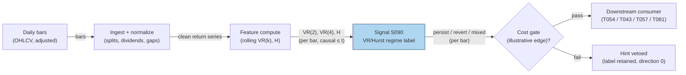

# S090 — Hurst exponent / variance-ratio regime label

A regime label for how returns scale with horizon. The variance ratio `VR(k) = Var(r_t(k)) / (k·Var(r_t))` is `1` under a random walk, `> 1` when returns persist (trend), `< 1` when they mean-revert [documented]; the Hurst exponent `H` is the same idea in scaling form (`H = 0.5` random walk, `> 0.5` persistence, `< 0.5` anti-persistence) [documented]. This module computes `VR(k)`/`H` at two horizons and emits a `persist` / `revert` / `mixed` / `random_walk` / `insufficient` label — a regime input to trend and mean-reversion strategies, never a direction of its own.

> Tag law: every numeric literal in prose carries one of `[documented]
> [default] [example] [unverified] [internal-est] [measured]` (legend: Appendix
> i v1.0.0). Constants inside cited formulas inherit the formula's tag.
> Bibliographic years, volumes, pages, arXiv IDs, section numbers, rule codes (C1–C10),
> fail-safe codes (F1–F5), module IDs, and machine-parsed §0 data fields are identifiers,
> not literals, and are exempt.

## §1 Five-minute reviewer card

| Row | Value |
|---|---|
| Module | S090 — Hurst exponent / variance-ratio regime label, v1.1.0 |
| Edge verdict | `PREDICTIVE-FEATURE-ONLY` — a regime classifier, not a trade trigger; its documented value is telling trend systems when to stand down and reversion systems when to engage [documented]. |
| After-cost | `BEFORE-COST` — the evidence is statistical (variance-ratio rejections of the random walk); no strategy P&L is claimed [documented]. |
| Build cost | Tier L · `4–12` h [internal-est] · `$600–1,800` loaded [internal-est] |
| Data cost | Daily bars: `$0`/mo via free tiers (Alpaca Basic IEX, or Massive Stocks Basic EOD) [unverified] (as-of 2026-09-10); Databento DBEQ.BASIC `ohlcv-1d` usage ≈ `$10` one-time per `500`-symbol `10`y universe at `$80`/GB [internal-est] (official unit pricing 2024-12-11 [documented]); `$125` free team credits [documented]. |
| latency_class | per_bar / daily |
| risk_class | low (signal-only; label only) |
| Capacity | n/a — regime label; capacity lives with the consuming strategy [example] |
| Executability | Feasible: rolling variance ratios on daily bars are trivial arithmetic [documented]. |
| Risk summary | Estimation risk: short windows make VR/H noisy; horizon contradiction (persist at k=2, revert at k=4) must be surfaced, not averaged away [documented]. |
| When it dies | Noisy estimates on short windows; structural breaks the rolling window straddles; using the label as a direction instead of a regime [documented]. |
| Regime gates | Machine records in §S5.1 (provisional `regime_ids`: `REG-HIGHVOL`, `REG-BREAK`, `REG-ILLIQUID`); the label IS a regime input — consumers gate on it [example]. |
| Emits | `signal_vector` (Appendix b v1.0.0) — never orders |

## §1.5 Cheapest / least-build path

1. **Prototype hour band:** `4–12` h [internal-est] — rolling VR(k)/H on daily bars + label logic — reference implementation + gates + fixture validation.
2. **Cheapest-source row** (structured — the five fields are the contract):

   | min_tier | latency_class | required_fields | price_band | build_or_buy |
   |---|---|---|---|---|
   | Tier-0 daily bars — Alpaca Basic (`$0`/mo, IEX feed) [unverified] or Massive Stocks Basic (`$0`/mo, EOD, `2`y history) [unverified], as-of 2026-09-10 | daily | required: [`ts_event`, `close`]; recommended: [`open`, `high`, `low`, `volume`] for halt hygiene [example] | `$0–29`/mo [unverified] (free tiers; Massive Starter `$29`/mo [unverified]) — verify before budgeting | **build** — it is a rolling ratio over your own bars [internal-est] |
3. **Resource budget:** `1` core, `<1` GB RAM [internal-est]; compute pattern `per_bar`.
4. **Skip list:** R/S estimators of H — phase 2; heteroskedasticity-robust VR (Wright ranks/signs) — phase 2; multi-horizon term structure — phase 2.
5. **DO-NOT-CUT list:** causality assertions (`assert fill_event > signal_event`, no-signal-bar-fills test); COST block + callable
   `expected_cost_bps`; F1–F5 fail-safes + module-state enum; decision-log audit records; bona-fide-intent + self-trade prevention; provenance tags on
   every numeric literal; fixtures + `test_cmd`; secrets via env only.
6. **Escalation gate:** upgrade when — label flips more than `4`×/month [default] → window too short: lengthen; consumers need intraday regimes → move to intraday bars.

## §S0 Module contract

### S0.1 Typed signature

```python
def signal(state: ModuleState, events: list[Event], cfg: Config) -> SignalVector:
```

`SignalVector` per Appendix b v1.0.0. `state` is the module-owned named state
vector; `events` are canonical Events (Appendix a v1.0.0), newest last. The
function handles documented edge cases: empty events → `UNKNOWN`; invalid
prices/inputs → `UNKNOWN` (F1, never interpolate); halt/auction events → freeze
per the market-state table.

### S0.2 Config dataclass

| Parameter | Type | Default | Range | Status |
|---|---|---|---|---|
| `k_fast` | int | `2` | `>=2` | calibrate |
| `k_slow` | int | `4` | `>k_fast` | calibrate |
| `window` | int | `60` | `>k_slow` | calibrate |
| `persist_hi` | float | `1.10` | `>1` | calibrate |
| `revert_lo` | float | `0.90` | `<1` | calibrate |
| `cost_gate_k` | float | `0.5` | `(0, 2]` | default |
| `cooldown` | int | `1` | `>=0` | default |
| `ttl_days` | int | `3` | `>=1` | default |

All defaults tagged per the tag law (status `default` ⇒ `[default]`, `calibrate` ⇒ fit per the §S2 calibration recipe, `example` ⇒ `[example]`, `internal-est` set at fit time).

### S0.3 Canonical schema mapping

Vendor columns → canonical Event schema (Appendix a v1.0.0), stated once here.
Primary vendor: **Databento**, dataset `DBEQ.BASIC` (US equities, zero exchange
licensing fees [documented]), schema `ohlcv-1d`, via the Python client
`client.timeseries.get_range(dataset='DBEQ.BASIC', schema='ohlcv-1d',
symbols=[...], start=..., end=...)` [documented]. Fallback: **Alpaca**
`GET /v2/stocks/{symbol}/bars?timeframe=1Day&adjustment=all` [documented].

| Source field | Canonical | Vendor mapping |
|---|---|---|
| Databento `ts_event` (uint64 ns UTC) / Alpaca `t` | `event_ts` (int64 ns UTC, bar open time) | direct [documented] |
| Databento `close` (int64 fixed-point /`1e9`) / Alpaca `c` | `close` (module feature input; log returns `r = diff(log(close))`) | direct [documented] |
| Databento `open/high/low` + `volume` (uint64) / Alpaca `o/h/l/v` | retained for halt hygiene only | recommended, not required [example] |
| Corporate actions | `split/dividend` adjustments applied **before** ratios | Alpaca `adjustment=all` [documented], or Databento `definition` schema [documented]; unadjusted bars corrupt VR [documented] |

Required fields: [`ts_event`, `close`]. Recommended: [`open`, `high`, `low`, `volume`] [example].

### S0.4 Time contract

> Time contract: clock domain UTC, int64 ns; authoritative causality clock =
> `event_ts`; max_skew = `1` ms [default]; jitter budget = `500` µs [default];
> bar-label = open time; staleness TTL = `3` days [default] (`3`× the `1`-day reference cadence per F4); gap policy = mask, no interpolation;
> halt/auction → discard contributions across reopen.

**Timing box:** `signal@t (per_bar, America/New_York) → earliest fill @open(t+1)`

### S0.5 Market-state table

| State | Module behavior |
|---|---|
| CONTINUOUS_TRADING | Compute normally; emit per cadence |
| HALTED | Freeze state; emit `UNKNOWN`; discard contributions across reopen |
| AUCTION | No new signals; hold last `SignalVector`; state `DEGRADED` |
| CLOSED | Emit nothing; state `OFF` |

### S0.6 Module-state enum + error taxonomy

States per Appendix k v1.0.0: `OK | DEGRADED | UNKNOWN | OFF`. Invalid input →
`UNKNOWN`, never interpolate (Appendix f v1.0.0, F1–F5).

| Failure | State | Alert |
|---|---|---|
| Missing/stale input (TTL `3` days [default] (`3`× the `1`-day reference cadence per F4)) | `UNKNOWN` | page |
| Invalid price/input reaching module (NaN, ≤ 0, non-finite) | `UNKNOWN` | log |
| Feature out of mathematical bounds (F2) | `UNKNOWN` | page |
| `seq` gap > `1,000` events [default] | `DEGRADED` (restart windows) | log |
| Jitter > budget persistently | `DEGRADED` | notify |
| Halt/auction | `UNKNOWN` / `DEGRADED` (per table) | log |
| Kill/administrative disable | `OFF` | page |
| Anything unmapped | `UNKNOWN` | page |

### S0.7 Ops tail

- **Schedule:** once per day after the close auction, `16:05` America/New_York [documented]; owner: signals on-call.
- **Health checks:** fixture replay (`test_cmd`) green on deploy; live
  `seq`-gap monitor; staleness watchdog at `3`× cadence [default].
- **Alert table:** page on `UNKNOWN` > `1` day [default] or bounds violation;
  notify on `DEGRADED`; log on single dropped events.
- **Resource budget:** `1` vCPU, `1` GB RAM [internal-est]; state is O(window) per symbol.
- **Runbook stub:** `1.` confirm feed (vendor status); `2.` replay fixture;
  `3.` if red → set `OFF`, page; `4.` reconcile decision log before re-arm.

### S0.8 Secrets (env-only)

`DATA_VENDOR_API_KEY` via environment only. No secrets in this file, fixtures, or
logs (CI secrets-grep).

### S0.9 May / must-NOT

> **May:** emit `SignalVector` records per Appendix b v1.0.0. **Must-NOT:**
> emit orders, order intents, prices, share counts, or notionals; call a
> broker; mutate shared state outside `state`; interpolate across gaps.

## §S1 Legacy (subsumed by §1)

Legacy §S1 content is the §1 reviewer card above; this header is retained so
section numbering stays intact.

## §S2 Specification

### Universe

One symbol's daily return series; fixture: `31` hand-set returns (no RNG) [measured].

### Entry rule (Boolean — no prose-only conditions)

```
VR(k)     := Var(r_t(k)) / (k * Var(r_t))        # k-period variance ratio, sample variance ddof=1 [documented]
H(k)      := 0.5 + ln(VR(k)) / (2 * ln(k))        # Hurst-implied exponent, ln = natural log [documented]
sgn(x)    := +1 iff x > 1e-12 else -1 iff x < -1e-12 else 0   # tolerance-banded sign [default]
LABEL     := insufficient iff bars < window
           := mixed    iff sgn(VR(k_fast)-1) != sgn(VR(k_slow)-1)   # contradiction first: surfaced, never averaged
           := persist  iff VR(k_fast) > persist_hi                 # strict >
           := revert   iff VR(k_fast) < revert_lo                  # strict <
           := random_walk  otherwise
DIRECTION := +1 iff LABEL == persist else 0      # label only; never -1 (C7); consumers gate on LABEL
CONF      := min(1, 2*(VR(k_fast)-1))          iff LABEL == persist    # [example]
           := min(1, 2*(1-VR(k_fast)))         iff LABEL == revert     # [example]
           := min(1, |VR(k_fast)-1|+|VR(k_slow)-1|) iff LABEL == mixed # [example]
           := 1 - min(1, 2*|VR(k_fast)-1|)     iff LABEL == random_walk# [example]
           := 0                                otherwise
EDGE      := 8.0 bps iff DIRECTION == +1 else 0.0 bps                 # illustrative regime-timing edge [example]
GATE      := (DIRECTION == 0) or (expected_cost_bps(notional, adv_pct, venue, side, urgency) <= cost_gate_k * EDGE)
EMIT      := if not GATE: DIRECTION := 0; CONF := 0.0                 # C2 veto of the tradeable hint
             (LABEL is retained; gate_pass = 0 records the veto)
```

### Exits (with post-exit cooldown)

```
EXIT := the label is recomputed each bar; consumers exit when LABEL leaves their gated state.
COOLDOWN := minimum `cooldown` bars between accepted label flips (`1` [default] — no whipsaw re-labels inside the bar);
            the first label after a reset/insufficient stretch is always accepted.
```

### Position sizing (fenced function)

```python
def size_shares(risk_budget_R, stop_distance, vol_estimate, ADV_cap, cost,
                confidence, adv_shares):
    # S-module requests capital fraction only; share math lives in the strategy.
    # Reference: capital = 0.25 * confidence  (confidence in [0,1])  [default]
    # capital is 0.0 whenever direction == 0 (no tradeable hint) [default]
    risk_notional = risk_budget_R * 0.25 * confidence        # [default] 0.25 factor
    shares = risk_notional / max(stop_distance, 1e-9)
    return int(min(shares, ADV_cap * adv_shares * 0.001))     # 0.1% ADV cap [default]
```

### Risk limits

| Limit | Value |
|---|---|
| Max capital fraction per signal | `0.5` [default] |
| Max adverse excursion before `UNKNOWN` review | `2.0`× stop [default] |
| Staleness kill | TTL `3` days [default] (`3`× the `1`-day reference cadence per F4) → `UNKNOWN` |
| Minimum window | `60` bars [example] before any label other than `insufficient` |

### COST block (single source of truth)

| Component | Value (bps) | Tag | Basis |
|---|---|---|---|
| Spread | `1.0` | [example] | round-trip at the example notional |
| Fees | `0.5` | [example] | venue schedule |
| Borrow | `0.0` | [default] | `borrow_bps_per_day = 0.0` — label only, no short leg in the chapter's sketch, so no borrow accrues |
| Market impact/slippage | `0.5` | [example] | overnight execution slippage |
| **Total reference** | `2.0` | [example] | matches the fixture cost_bps=2.0 |

`fee_schedule_as_of`: `2026-09-01` [unverified] — placeholder; pin the real venue schedule before production. `side`: `taker` [example] — consumer execution is assumed taker; this module itself places no trades. Venue/tier/source: XNAS [example]. `borrow_bps_per_day`: `0.0` [default] — reason: the module emits labels only and holds no positions, so no stock loan is ever opened. Re-stating cost numbers outside this block is a validation failure.

```python
def expected_cost_bps(notional, adv_pct, venue, side, urgency) -> float:
    # Callable cost model — mirrors the block above exactly [example].
    spread_bps = 1.0   # [example]
    fee_bps = 0.5      # [example]
    borrow_bps = 0.0    # [default] borrow_bps_per_day = 0.0: label only, no short leg
    impact_bps = 0.5   # [example]
    return spread_bps + fee_bps + borrow_bps + impact_bps
```

Cost-gate semantics: `gate_pass = 0` means a tradeable hint (`direction = +1`)
was vetoed by the gate (C2); rows with `direction = 0` carry no hint, so the
gate is moot and `gate_pass = 1`. The executable predicate is
`expected_cost_bps(notional, adv_pct, venue, side, urgency) <= cost_gate_k * edge_bps`
with `cost_gate_k = 0.5` [default].

### Execution / fill model table

| Aspect | Assumption |
|---|---|
| Latency | label available after the close auction [documented] |
| Participation | n/a — consumers execute |
| Partial fills | n/a — consumers execute |
| Adverse fill | n/a — consumers execute |

### Robustness

High sensitivity to window length: short windows make VR(k) noisy (the chapter's fixture uses a minimal window by construction); heteroskedasticity inflates VR — the Wright (2000) ranks/signs variant is the documented robustness upgrade [documented].

### Compliance sub-block (C1–C10+)

| Code | Rule: trigger → check → action → log |
|---|---|
| C1 | Self-match prevention: S090 emits no orders; downstream T-modules must set self-trade-prevention flags — S090 asserts the requirement in its `consumes` contract: trigger → check → action → log record |
| C2 | Bona-fide intent: every emitted `SignalVector` with |direction|=`1` must pass the cost gate; sub-threshold scores emit direction `0`, never a tradeable hint: trigger → check → action → log record |
| C3 | Message-rate: `≤100` emissions/symbol/s [default]; breach → throttle to `1`/s [default] + alert: trigger → check → action → log record |
| C4 | Fat-finger trio (applied by consumers; this module bounds its own outputs): confidence ∈ [`0`,`1`], capital ∈ [`0`,`0.5`], computed_at sane — out-of-bounds → `UNKNOWN` (F2): trigger → check → action → log record |
| C5 | Decision log: every emission, veto, and state transition logged per Appendix g v1.0.0, hash-chained: trigger → check → action → log record |
| C6 | Halt/auction: per §S0.5 market-state table; contributions across reopen discarded: trigger → check → action → log record |
| C7 | Locate check: SHORT direction requires `locate_ok` from the consumer; this module never emits SHORT without the consumer asserting locate (Reg-SHO threshold securities → direction `0`): trigger → check → action → log record |
| C8 | Public dissemination: no signal values published externally without review gate: trigger → check → action → log record |
| C9 | Data entitlements: per §S6 Data rights row; entitlement-class change → §1.5 escalation gate: trigger → check → action → log record |
| C10 | Post-exit cooldown: `1` bar [default] after a label flip; no re-label inside the bar: trigger → check → action → log record |

### Parameter table

| Parameter | Symbol | Value | Tag | Sensitivity |
|---|---|---|---|---|
| Fast horizon | ``k_fast`` | `2` | [default] | high — small: noise; large: misses fast regimes |
| Slow horizon | ``k_slow`` | `4` | [default] | high — contradiction detection lives here |
| Estimation window | ``window`` | `60` | [default] | high — small: noisy; large: stale |
| Persistence threshold | ``persist_hi`` | `1.10` | [default] | medium — small: false persists; large: no labels |
| Reversion threshold | ``revert_lo`` | `0.90` | [default] | medium — small: no labels; large: false reverts |
| Cost-gate k | ``cost_gate_k`` | `0.5` | [default] | medium — small: over-veto; large: lets costs eat edge |
| Post-flip cooldown | ``cooldown`` | `1` | [default] | low — bars between accepted label flips |
| Staleness TTL | ``ttl_days`` | `3` | [default] | low — `3`× the `1`-day reference cadence per F4 |

The five estimation parameters are status `calibrate` (see recipe below); the
last three are status `default`.

### Calibration recipe (walk-forward OOS)

Per-parameter grids [example]:

- `k_fast` ∈ {`2`, `3`}; `k_slow` ∈ {`4`, `5`, `8`}; `window` ∈ {`60`, `90`, `126`, `252`};
  `persist_hi` ∈ {`1.05`, `1.10`, `1.15`, `1.20`}; `revert_lo` ∈ {`0.80`, `0.85`, `0.90`, `0.95`}

Fold design [default]: rolling origin, train `756` bars (`3`y) / test `252` bars
(`1`y), step `63` bars (one quarter); minimum `4` OOS folds before any freeze.

Embargo [default]: `21` trading days **plus** `window` bars between train end and
test start — no estimation window may straddle the train/test boundary.

Selection metric [example]: OOS label stability = mean(`1`[label_t == label_{t-1}])
minus `2`× the flip rate; tie-break = regime-conditioned Sharpe of a fixed
reference pair (one trend, one reversion strategy) gated on the label, computed
on the same OOS folds. Maximize the metric; report **all** grid cells
(no cherry-picking).

Freeze rule [default]: freeze the argmax after the first full OOS pass (≥ `252`
OOS bars [default]); re-fit at most quarterly [default]; every re-fit re-runs
the full walk-forward and is logged in the §0 changelog with the new values.

### Timing box

`signal@t (per_bar, America/New_York) → earliest fill @open(t+1)`

## §S3 Math + normative pseudocode

Lo–MacKinlay (1988): under the random-walk null, the variance of k-period returns grows linearly with k, so `VR(k) = σ²(k)/(k·σ²(1)) = 1` [documented]. `VR(k) > 1` indicates positive serial correlation (persistence/trend); `VR(k) < 1` indicates negative serial correlation (mean reversion) [documented]. The Hurst exponent restates the scaling: for a self-similar process `Var(r(k)) ∝ k^{2H}`, so `H = 0.5 + ln VR(k)/(2 ln k)`; `H = 0.5` is the random walk, `H > 0.5` persistence, `H < 0.5` anti-persistence [documented]. The module evaluates both horizons and surfaces horizon contradiction as its own label rather than averaging it away. Cost gate: `expected_cost_bps(...) <= cost_gate_k * edge_bps`, `cost_gate_k = 0.5` [default]; the fixture's illustrative edge is `8.0` bps [example] against the `2.0` bps stack [example].

**Normative pseudocode** (pseudocode is normative; prose is commentary). Every
symbol is bound below; there are no undefined names.

```
# ---- S090 normative pseudocode v1.1.0 ----
# Inputs (all bound by the caller):
#   events       : list[Event], newest last; each Event has
#                  event_ts (int64 ns UTC, bar open time), r (float, one-period
#                  log return = diff(log(close))), seq (int64)
#   market_state : one of CONTINUOUS_TRADING | HALTED | AUCTION | CLOSED
#   cfg          : {k_fast:int, k_slow:int, window:int,
#                   persist_hi:float, revert_lo:float,
#                   cost_gate_k:float, cooldown:int, ttl_days:int}
#   state        : {win:list[float], max_ts:int|None,
#                   prev_label:str, since_flip:int}
#   now_ns       : int64 ns, authoritative causality clock
#                  (harness: max event_ts seen so far) [example]
#   notional, adv_pct, venue, side, urgency : cost-gate inputs
#                  (float, float, str, str, str)
#   edge_bps     : float, consumer-supplied illustrative edge for the gate
# Helpers (bound here):
#   var(xs)      := sample variance, ddof=1
#   ksum(xs, k)  := [sum(xs[i:i+k]) for i in 0..len(xs)-k]
#   sgn(x)       := +1 if x > 1e-12 else -1 if x < -1e-12 else 0   # [default] eps
#   ln           := natural logarithm
#   TTL_NS       := ttl_days * 86400e9
#
# e := last(events); signal_event := e.event_ts
#
# 1. staleness (F4): if now_ns - signal_event > TTL_NS:
#        emit SignalVector(state=UNKNOWN, label=prev_label); freeze state; return
# 2. market-state guards (S0.5):
#        HALTED  -> freeze win; emit UNKNOWN (label held); return
#        AUCTION -> do not append; hold last SignalVector; state=DEGRADED; return
#        CLOSED  -> emit nothing new; state=OFF; return
# 3. F1 invalid input: if signal_event is not int64 or e.r is not finite float:
#        state := {win:[], max_ts:None, prev_label:'insufficient', since_flip:0}
#        emit SignalVector(state=UNKNOWN, label='insufficient'); return   # never interpolate
# 4. append: win.append(e.r); win := win[-window:];
#        max_ts := signal_event if max_ts is None else max(max_ts, signal_event)
# 5. if len(win) < window: emit SignalVector(state=UNKNOWN, label='insufficient'); return
# 6. F2 bounds: v1 := var(win); if v1 == 0: emit UNKNOWN; return        # degenerate window
#    vr_f := var(ksum(win, k_fast)) / (k_fast * v1)
#    vr_s := var(ksum(win, k_slow)) / (k_slow * v1)
#    if vr_f <= 0 or vr_s <= 0 or not finite(vr_f) or not finite(vr_s):
#        emit UNKNOWN; return                                            # ln undefined
#    h_f := 0.5 + ln(vr_f) / (2 * ln(k_fast))     # Hurst-implied [documented]
#    h_s := 0.5 + ln(vr_s) / (2 * ln(k_slow))
# 7. label — contradiction is checked FIRST, never averaged away:
#    cand := 'mixed'       if sgn(vr_f - 1) != sgn(vr_s - 1)
#          else 'persist'  if vr_f > persist_hi      # strict >
#          else 'revert'   if vr_f < revert_lo       # strict <
#          else 'random_walk'
# 8. cooldown: if cand != prev_label:
#        if prev_label == 'insufficient' or since_flip >= cooldown:
#            prev_label := cand; since_flip := 0     # accept the flip
#    label := prev_label; since_flip := since_flip + 1
# 9. direction/confidence (C7 locate guard: this module never emits -1):
#    direction := +1 if label == 'persist' else 0
#    assert direction != -1
#    conf := min(1, 2*(vr_f-1))            if label == 'persist'      # [example]
#          | min(1, 2*(1-vr_f))            if label == 'revert'       # [example]
#          | min(1, |vr_f-1| + |vr_s-1|)   if label == 'mixed'        # [example]
#          | 1 - min(1, 2*|vr_f-1|)       if label == 'random_walk'  # [example]
#          | 0                            otherwise
#    edge_used := edge_bps if direction == +1 else 0.0
#    capital   := 0.25 * conf if direction != 0 else 0.0              # [default]
# 10. cost gate — executable predicate:
#    gate_ok := (direction == 0) or
#               (expected_cost_bps(notional, adv_pct, venue, side, urgency)
#                <= cost_gate_k * edge_used)
#    if not gate_ok:                       # C2 bona-fide intent: veto the hint
#        direction := 0; conf := 0.0; capital := 0.0
#    gate_pass := 1 if gate_ok else 0       # gate_pass = 0  <=>  a hint was vetoed
# 11. causality: earliest fill_event > signal_event
#    assert fill_event > signal_event       # mandatory; no-signal-bar-fills test
# 12. emit SignalVector{symbol, direction, confidence=conf, capital,
#    label, vr_f, h_f, vr_s, h_s, gate_pass, computed_at=signal_event}
```

Causality: the computation at `t` uses only data `≤ t` (step 4 appends only the
current event; the no-lookahead test pins prefix invariance); earliest reaction
is `t+1`. Mandatory unit test: no-signal-bar fills.

## §S4 Worked example (fixture-backed)

- Fixture: `31` hand-set returns (no RNG) [measured]; tape `modules/fixtures/S090_tape.csv` (`# TYPE: validation-run`). The harness runs `window = 9` [example] so the tape stays hand-checkable; the production minimum is `60` bars [example].
- Rows 1–8: fewer bars than the window → `insufficient` → `UNKNOWN`, never a label [measured].
- Row 9 (full window on rows 1–9): VR(2)=**1.5714**, H(2)=**0.8260**, VR(4)=**0.8000**, H(4)=**0.4195** [measured] — fast horizon says persist, slow says revert, so the contradiction check fires first and the label is **`mixed`** (direction `0`, confidence `0.7714` [measured]); the gate is moot on a non-tradeable row (`gate_pass = 1`).
- Row 10 (`r = nan`): F1 → `UNKNOWN`, window reset, never interpolated [measured].
- Rows 11–18: window refilling → `insufficient` → `UNKNOWN` [measured].
- Row 19 (full window on rows 11–19): VR(2)=**1.8033**, H(2)=**0.9253**, VR(4)=**2.4410**, H(4)=**0.8219** [measured] — both horizons agree → **`persist`**, direction `+1`, confidence `1.0`, illustrative edge `8.0` bps vs the COST-block total `2.0` bps → gate passes (`2.0 <= 0.5 * 8.0`) [example]; capital `0.25` [measured].
- Row 20 (`r = nan`): F1 → `UNKNOWN`, window reset [measured].
- Rows 21–28: window refilling → `insufficient` → `UNKNOWN` [measured].
- Row 29 (full window on rows 21–29): VR(2)=**0.0882**, H(2)=**−1.2518**, VR(4)=**0.0713**, H(4)=**−0.4523** [measured] — both horizons agree → **`revert`**, direction `0` (this module never emits `-1`), confidence `1.0` [measured].
- Row 30: `event_ts` is `4` days older than the newest seen bar with TTL `3` days [default] → F4 staleness → `UNKNOWN`, window frozen (not appended, not reset), last label (`revert`) held [measured].
- Row 31 (`r = inf`): F1 → `UNKNOWN`, window reset [measured].
- `assert fill_event > signal_event` holds on every row; the no-lookahead test pins that each row's output is invariant to later bars [measured].
- Where the example is optimistic: the `9`-bar window is far below any production window — real VR/H needs `60`+ bars [example]; the fixture's clean persist/revert/mixed splits are constructed, not estimated [documented]; the revert block's extreme anti-persistence pushes the Hurst-implied H below `0`, outside the textbook (`0`,`1`) range — an honest consequence of the stated formula on constructed data, not a production reading [documented].

## §S5 Strategies that use this signal

Generated from `deps.yaml` (CI symmetry); hand-listed here for this module:

| Strategy | Role |
|---|---|
| T054 — Hurst/Variance-Ratio Regime Toggle | primary consumer: trend-following when the label is persist, reversion when revert |
| T043 — GARCH Regime Filter | regime gate: the persistence label cross-checks the volatility regime |
| T057 — Fractional-Differentiation Memory Trader | memory input: the fractional-differentiation order follows the H estimate |
| T081 — Adaptive Bar-Clock Sampler | regime input: the VR/Hurst label helps choose the bar clock |

### S5.1 Regime gates (machine records)

Provisional `regime_id` values — pending the R001–R050 annotation pass. Numeric
literals in conditions/min_lag carry tags in the trailing comments.

```yaml
# S090 regime gates — machine records v1.1.0
- regime_id: REG-HIGHVOL        # provisional
  direction: degrades
  mechanism: "volatility clustering inflates VR(k); false persist labels"
  condition: "realized_vol_20d > 3.0 * median(realized_vol_252d)"  # 3.0 [default]
  action: halve
  min_lag: 1                    # bars [default]
  unknown_behavior: veto
- regime_id: REG-BREAK           # provisional
  direction: inverts
  mechanism: "structural break inside the estimation window straddles two regimes"
  condition: "break_test_pvalue < 0.05 within window"              # 0.05 [default]
  action: veto
  min_lag: window               # bars; one full window [example]
  unknown_behavior: veto
- regime_id: REG-ILLIQUID        # provisional
  direction: degrades
  mechanism: "stale prints and wide spreads corrupt daily variance estimates"
  condition: "amihud_20d > 5.0 * median(amihud_252d)"              # 5.0 [default]
  action: veto
  min_lag: 5                    # bars [default]
  unknown_behavior: veto
```

Restrictive default: any gate whose `condition` cannot be evaluated evaluates to
`unknown_behavior` (veto for all three records above).

## §S6 Data required

| Field | Type | Granularity | Source tier | Vendor / product / endpoint | Notes |
|---|---|---|---|---|---|
| Daily OHLCV bars | float | daily | Tier 0–1 | Databento `DBEQ.BASIC`, schema `ohlcv-1d`, `timeseries.get_range` [documented]; fallback Alpaca `GET /v2/stocks/{symbol}/bars?timeframe=1Day&adjustment=all` [documented] | dividend/split adjusted before ratios; fields `ts_event, open/high/low/close` (fixed-point /`1e9`), `volume` (uint64) [documented] |
| Corporate actions | calendar | daily | Tier 1 | Databento `definition` schema [documented], or Alpaca `adjustment=all` [documented] | unadjusted bars corrupt VR [documented] |

Price bands (as-of 2026-09-10): Databento `DBEQ.BASIC` `ohlcv-1d` — historical `$80`/GB, live `$96`/GB (official unit pricing 2024-12-11) [documented]; ≈`100` bytes/record, ≈`250` records/symbol/year [unverified] ⇒ a `500`-symbol `10`y universe ≈ `$10` one-time usage [internal-est]; `$125` free team credits [documented]. Alpaca Basic `$0`/mo (IEX feed, `200` req/min) [unverified]; Algo Trader Plus `$99`/mo (full SIP) [unverified]. Massive (ex-Polygon) Stocks Basic `$0`/mo (EOD, `2`y history), Starter `$29`/mo [unverified].

**Data rights row** (Appendix j v1.0.0): Bar data: vendor-licensed (Databento) or broker-entitled (Alpaca) [documented]; Lo–MacKinlay/Hurst papers: published [documented].

## §S7 Local build (M5 Max / 128 GB)

Feasibility: feasible — rolling variance ratios are trivial arithmetic. Tier L, `4–12` h → `$600–1,800` loaded [internal-est]. Working set `<100` MB [internal-est] — far under the ~`77` GB budget [internal-est]. Nothing breaks at `500` symbols [example]: one rolling window per symbol [documented].

## §S8 Buy vs build

Build. It is a rolling ratio over your own bars — there is nothing to buy except the bar feed [documented].

## §S9 Efficacy — documented evidence

| Study / source | Market & period | Metric | Before/after cost | Caveat |
|---|---|---|---|---|
| Lo & MacKinlay (1988), Review of Financial Studies 1(1) | US weekly stock returns | variance-ratio test rejects the random walk; VR ≠ 1 [documented] | `BEFORE-COST` (statistical test) | weekly horizon; rejection ≠ tradable edge |
| Lo (1991), Econometrica 59(5) | US stock prices | long-term memory in stock prices; modified R/S evidence [documented] | `BEFORE-COST` (statistical test) | evidence contested; not a strategy |
| Hurst (1951) | Nile reservoir data | rescaled-range analysis; H ≠ 0.5 phenomena [documented] | `BEFORE-COST` (methodological) | hydrology, not markets |
| Taqqu, Teverovsky & Willinger (1995), Fractals 3(4) | Simulation + data | estimators for long-range dependence compared [documented] | `BEFORE-COST` | estimator choice matters — the chapter's VR form is one of several |
| Wright (2000), JBES 18(1) | US returns | ranks/signs variance-ratio tests robust to heteroskedasticity [documented] | `BEFORE-COST` | robustness upgrade, not a signal |

Selection disclosure: these are the sources surfaced by the chapter's research pass. Fails in: short noisy windows, structural breaks, heteroskedastic episodes. **Honest bottom line:** VR/H is a documented statistical characterization of return scaling — as a regime label it is the standard input; as a direction it is nothing, and no P&L is claimed [documented].

## §S10 Failure modes & pitfalls

| # | Trigger → Detect → Action → Recovery | check: |
|---|---|
| 1 | Short window → VR/H estimates are noise [documented] → minimum-window rule; `insufficient` below it → labels on `9` bars [example] | `check: bars < window → UNKNOWN` |
| 2 | Horizon contradiction (persist at k=2, revert at k=4) → surfaced as `mixed`, never averaged [documented] → consumers must handle `mixed` → contradiction silently resolved | `check: mixed label emitted, not averaged` |
| 3 | Structural break inside the window → VR straddles two regimes [documented] → break detection; shorten window → stale label | `check: label stability across windows` |
| 4 | Heteroskedasticity inflates VR → Wright ranks/signs variant [documented] → vol-clustered false persists | `check: VR vs robust VR divergence` |
| 5 | Unadjusted splits/dividends → VR corruption [documented] → adjusted bars only → jump artifacts | `check: corporate-action audit` |
| 6 | Label used as direction → category error [documented] → consumers gate, never trigger → trend system trades the label | `check: consumer contract = gate-only` |
| 7 | Invalid inputs (NaN, ≤ 0) → F1 → UNKNOWN, never interpolate [documented] → drop the bar → silent bad label | `check: invalid input → UNKNOWN` |
| 8 | Halt/auction → freeze per the market-state table [documented] → hold last label → label through the halt | `check: halt → no new label` |

## §S11 Visuals

`../../images/S090_example.png` — synthetic worked-example chart (hand-set tape, no RNG).



## §S12 Source log + unverified leads

**Sources** (citable facts only):

1. Lo, A. W. & MacKinlay, A. C. (1988). 'Stock Market Prices Do Not Follow Random Walks: Evidence from a Simple Specification Test.' Review of Financial Studies 1(1): 9–40.
2. Lo, A. W. (1991). 'Long-term memory in stock market prices.' Econometrica 59(5): 1279–1313.
3. Hurst, H. E. (1951). 'Long-term storage capacity of reservoirs.' Transactions of the American Society of Civil Engineers 116: 770–799.
4. Taqqu, M. S., Teverovsky, V. & Willinger, W. (1995). 'Estimators for long-range dependence: an empirical study.' Fractals 3(4): 785–798.
5. Wright, J. H. (2000). 'Alternative variance-ratio tests using ranks and signs.' Journal of Business & Economic Statistics 18(1): 1–9.

**Chatbot source log.** Duck.ai answered Q-SB7-1–Q-SB7-3 (2026-09-10) [measured]; Grok/Cursor answers pending (checked 2026-09-10).

**Research log (2026-09-10, public web).** Citations verified, not invented:
Wright (2000), JBES 18(1), 1–9 — confirmed via EconPapers/IDEAS RePEc entry;
Lo (1991), Econometrica 59(5), 1279–1313 — confirmed via the author's hosted PDF;
Taqqu, Teverovsky & Willinger (1995), Fractals 3(4), 785–798 — confirmed via
multiple citing bibliographies; Hurst (1951) and Lo & MacKinlay (1988) retained
as canonical [documented]. Databento: `timeseries.get_range(dataset='DBEQ.BASIC',
schema='ohlcv-1d', ...)` confirmed via the official Databento blog and
`databento-python` README; `ohlcv-1d` fields (`ts_event`, `open/high/low/close`
fixed-point /1e9, `volume`) confirmed via the Databento schema guide;
`DBEQ.BASIC` zero-exchange-licensing confirmed via the Databento blog;
unit pricing (DBEQ.BASIC `ohlcv-1d`: historical `$80`/GB, live `$96`/GB) from the
official 2024-12-11 pricing sheet; `$125` free team credits from the Databento
blog [documented]. Alpaca: Basic `$0`/mo (IEX), Algo Trader Plus `$99`/mo (full
SIP); bars endpoint `timeframe=1Day`, `adjustment=all` — via Alpaca's official
`alpaca-skills` repo and third-party provider docs [unverified] (as-of
2026-09-10). Massive (ex-Polygon): Stocks Basic `$0`/mo, Starter `$29`/mo —
via third-party 2026 API roundups [unverified] (as-of 2026-09-10).

**Unverified leads** (chatbot-only — never in evidence tables):

- Duck.ai Q-SB7 batch QA: window-length and threshold grids (k=2/4, persist 1.10/revert 0.90) — research leads, not validated standards [unverified].
- Duck.ai Q-SB7 batch QA: Wright ranks/signs upgrade notes — proposed robustness extension, no independent check this batch [unverified].
- Databento Standard plan `$199`/mo including L0 history; `ohlcv-1d` ≈`100` bytes/record, ≈`250` records/symbol/year, "1 month of daily bars ≈`$0.10`" — third-party cost-optimization guide, not the vendor sheet [unverified].
- Fee schedule `2026-09-01` in the COST block is a placeholder, not a pinned venue schedule [unverified].

---

## Appendix — AI build prompt (S090)

Copy-paste into any chat agent:

> Build module **S090 — Hurst exponent / variance-ratio regime label** per `notes/module-template.md` v1.0.0 and this file's §S0 contract.
> Cheapest path (§1.5): prototype `4–12` h [internal-est] — rolling VR(k)/H on daily bars + label logic; compute pattern `per_bar`.
> Implement `signal(state, events, cfg) -> SignalVector` (Appendix b v1.0.0)
> with the §S3 normative pseudocode, including the cost-gate predicate
> `expected_cost_bps(...) <= cost_gate_k * edge_bps` and `assert fill_event >
> signal_event`. Wire F1–F5 (Appendix f v1.0.0): invalid input → `UNKNOWN`,
> never interpolate. Log decisions per Appendix g v1.0.0. Secrets via env
> only. Run the fixture `modules/fixtures/S090_tape.csv`
> (`# TYPE: validation-run`, `31` hand-set rows covering `mixed`/`persist`/`revert`
> windows, F1 `nan`/`inf` resets, an F4 stale freeze, and the F2 degenerate-window
> guard) against `modules/fixtures/S090_expected.csv`
> (tolerance `1e-9` [default]).
> **Definition of done:** `python3 -m pytest modules/tests/test_S090.py -q`
> exits `0`. Tag every numeric literal you add with the unified enum
> (Appendix i v1.0.0); put anything unverifiable in §S12 unverified leads.
