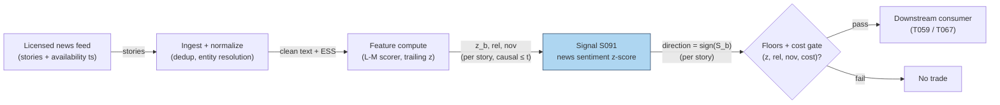

# S091 — News sentiment z-score (ESS)

A per-story sentiment trigger. Each story arrives with an event sentiment score `S_b ∈ [−1,1]` (vendor ESS or an own Loughran–McDonald scorer); the module z-scores it against the trailing sentiment panel `z_b = (S_b − μ_trail)/σ_trail` and enters with the sign of `S_b` when `|z_b| > z_entry` and the story clears relevance and novelty floors [documented]. The classical dictionary version (Tetlock 2007) scores pessimism as negative-words/total-words; use the Loughran–McDonald finance dictionary — roughly three-quarters of Harvard 'negatives' are neutral accounting terms in finance [documented].

> Tag law: every numeric literal in prose carries one of `[documented]
> [default] [example] [unverified] [internal-est] [measured]` (legend: Appendix
> i v1.0.0). Constants inside cited formulas inherit the formula's tag.
> Bibliographic years, volumes, pages, arXiv IDs, section numbers, rule codes (C1–C10),
> fail-safe codes (F1–F5), module IDs, and machine-parsed §0 data fields are identifiers,
> not literals, and are exempt.

## §1 Five-minute reviewer card

| Row | Value |
|---|---|
| Module | S091 — News sentiment z-score (ESS), v1.1.0 |
| Edge verdict | `AFTER-COST-EDGE` (conditional, narrow) — first-minute news reaction is mostly competed away; the documented edge lives in the hours-to-days drift/fade legs on less-efficient names [documented]. |
| After-cost | `COMM-ONLY` — the chapter's sketch nets costs explicitly (gross $114.25 − $7.50 costs = +$106.75 net [example]); production after-cost is implementation-specific [documented]. |
| Build cost | Tier L · `4–12` h [internal-est] · `$600–1,800` loaded [internal-est] |
| Data cost | News text rights: Benzinga Pro Essential $197/mo list (monthly billing; $166/mo annual equivalent) [documented] as of 2026-09-10; GDELT/RSS Tier-0 headlines free for research [documented]. |
| latency_class | event / seconds (story arrival) |
| risk_class | medium (signal-only; headline risk lives with the consumer) |
| Capacity | `$1–10`M/day notional [example] — news-reaction capacity is thin |
| Executability | Feasible: scoring is microseconds per story; the constraint is latency and licensing, not compute [documented]. |
| Risk summary | Stale-news-as-fresh, duplicate headlines, publication-vs-availability timestamp confusion, dictionary mismatch on finance text [documented]. |
| When it dies | Crowded first-minute reaction; stale stories traded as fresh; macro news drowning firm sentiment; dictionary misfires [documented]. |
| Regime gates | Machine records below (restrictive default: unknown regime state → veto) |
| Emits | `signal_vector` (Appendix b v1.0.0) — never orders |

**Regime gates (machine records).** `regime_id` ∈ R001–R050 (this repo); `direction` ∈ {amplifies, degrades, inverts};
`action` ∈ {veto, halve, double, widen_stops, pause_entry}.

```yaml
regime_gates:
  - regime_id: R036   # macro announcement windows
    direction: degrades
    mechanism: "scheduled macro releases (FOMC, CPI, NFP) dominate price action; firm-specific sentiment is noise [documented]"
    condition: "R036 active (story arrival inside a macro announcement window)"
    action: veto
    min_lag: "0 events [default]"
    unknown_behavior: "veto [default]"
  - regime_id: R030   # central-bank event proximity
    direction: degrades
    mechanism: "pre-central-bank-decision drift compresses firm-news reaction [unverified]"
    condition: "R030 active and story is non-central-bank firm news"
    action: halve
    min_lag: "0 events [default]"
    unknown_behavior: "veto [default]"
  - regime_id: R035   # earnings proximity / earnings season
    direction: amplifies
    mechanism: "earnings-window firm news carries high novelty and volume; z-scores calibrate wider [unverified]"
    condition: "R035 active and story relates to the firm's earnings"
    action: double
    min_lag: "0 events [default]"
    unknown_behavior: "revert to base config [default]"
  - regime_id: R047   # sentiment / positioning regime
    direction: degrades
    mechanism: "crowded positioning against the news direction fades the first-minute leg [unverified]"
    condition: "R047 active (crowded) and sign(S_b) aligns with crowded side"
    action: halve
    min_lag: "0 events [default]"
    unknown_behavior: "halve [default]"
  - regime_id: R010   # spread regime
    direction: degrades
    mechanism: "wide effective spreads deteriorate news-implied trading profitability (Gross-Klussmann & Hautsch 2011) [documented]"
    condition: "R010 active (effective spread > 2x trailing median [example])"
    action: veto
    min_lag: "0 events [default]"
    unknown_behavior: "veto [default]"
  - regime_id: R022   # hard-to-borrow / short-squeeze regime
    direction: degrades
    mechanism: "SHORT leg needs borrow; hard-to-borrow or Reg-SHO threshold blocks it (C7)"
    condition: "R022 active and direction < 0 and not locate_ok"
    action: veto
    min_lag: "0 events [default]"
    unknown_behavior: "veto [default]"
```

## §1.5 Cheapest / least-build path

1. **Prototype hour band:** `4–12` h [internal-est] — Loughran–McDonald scorer + trailing z + floors — reference implementation + gates + fixture validation.
2. **Cheapest-source row** (structured; price bands as of `2026-09-10`):

| min_tier | latency_class | required_fields | price_band | build_or_buy |
|---|---|---|---|---|
| GDELT 2.1 API / RSS headlines — research Tier-0 [documented] | per story arrival | headline + availability ts, rel/nov (computed), S_b (own L-M scorer) | `$0`/mo [documented] | **build** the scorer, **buy nothing yet** |
| Benzinga Pro Essential — production Tier-1/2 [documented] | per story arrival | story text + availability ts, ESS, relevance, novelty, tickers | `$197`/mo list, monthly billing (`$166`/mo annual equivalent) [documented] | **build** the scorer, **buy** the text rights |

   Benzinga machine-readable News API (v2 schema): enterprise, custom pricing — verify before budgeting [unverified]. Scraping is not a substitute for a license [documented].
3. **Resource budget:** `1` core, `<1` GB RAM [internal-est]; compute pattern `per_event`.
4. **Skip list:** Full-text relevance models — phase 2; multi-language scoring — phase 2; intraday novelty embedding (see S093) — phase 2.
5. **DO-NOT-CUT list:** causality assertions (`assert fill_event > signal_event`, no-signal-bar-fills test); COST block + callable
   `expected_cost_bps`; F1–F5 fail-safes + module-state enum; decision-log audit records; bona-fide-intent + self-trade prevention; provenance tags on
   every numeric literal; fixtures + `test_cmd`; secrets via env only.
6. **Escalation gate:** upgrade when — duplicate/correction rate > `5`% of stories [default] → add story-ID dedup; production needs full text → buy the license (scraping is not a substitute).

## §S0 Module contract

### S0.1 Typed signature

```python
def signal(state: ModuleState, events: list[Event], cfg: Config) -> SignalVector:
```

`SignalVector` per Appendix b v1.0.0. `state` is the module-owned named state
vector; `events` are canonical Events (Appendix a v1.0.0), newest last. The
function handles documented edge cases: empty events → `UNKNOWN`; invalid
prices/inputs → `UNKNOWN` (F1, never interpolate); halt/auction events → freeze
per the market-state table.

### S0.2 Config dataclass

| Parameter | Type | Default | Range | Status |
|---|---|---|---|---|
| `z_entry` | float | `2.0` | `>0` | calibrate |
| `rel_floor` | float | `80.0` | `0–100` | calibrate |
| `nov_floor` | float | `70.0` | `0–100` | calibrate |
| `trail_n` | int | `30` | `>0` | calibrate |
| `h_exit_min` | int | `30` | `>0` | calibrate |
| `age_cutoff_min` | int | `120` | `>0` | [default] |
| `k` (cost-gate) | float | `0.5` | `0–1` | [default] |

All defaults tagged per the tag law (status `default` ⇒ `[default]`, `example` ⇒ `[example]`, `calibrate` set at fit time).

#### S0.2a Calibration recipe (walk-forward OOS)

Per-parameter grids (initial research values; all `[example]`):

| Parameter | Grid | Notes |
|---|---|---|
| `z_entry` | {1.5, 1.75, 2.0, 2.25, 2.5, 3.0} | small → noise trades; large → < 10 trades/fold |
| `rel_floor` | {60, 70, 80, 90} | small → off-topic stories; large → starvation |
| `nov_floor` | {50, 60, 70, 80} | small → stale retrigger; large → misses rewrites |
| `trail_n` | {10, 20, 30, 60, 120} | small → noisy z; large → stale panel |
| `h_exit_min` | {5, 10, 15, 30, 60} | reaction-leg horizon |

Walk-forward design [example unless noted]: expanding train window `12` months; OOS test window `3` months; **embargo** `5` trading days between train end and OOS start (prevents leakage from slow news drift); minimum `30` OOS trades per fold [default] — folds below this are skipped, not interpolated. Selection metric: after-cost **DSR** (Deflated Sharpe Ratio) over the OOS window, costed with `expected_cost_bps(...)` at `COMM-ONLY` level minimum [default]; Sharpe-after-cost as runner-up. **Freeze rule:** freeze the parameter set when two consecutive OOS folds select the same `(z_entry, rel_floor)` pair and the DSR delta between the top-2 configs is `< 0.05` [default]; re-fit cadence `12` months [default], or sooner if the live cost-gate veto rate drifts `> 2×` its frozen baseline [default]. Parameters never selected from fewer than `3` folds [default].

### S0.3 Canonical schema mapping

Vendor columns → canonical Event schema (Appendix a v1.0.0), stated once here:

| Source field | Canonical |
|---|---|
| story text + availability ts (vendor) | `event_ts (int64 ns UTC; availability ts, never publication ts)` |
| event sentiment score | `S_b in [-1,1] [example] (module feature input)` |
| relevance / novelty | `rel, nov (module feature inputs)` |
| trailing sentiment panel | `trail_mean, trail_sd (module feature inputs)` |

### S0.4 Time contract

> Time contract: clock domain UTC, int64 ns; authoritative causality clock =
> `event_ts`; max_skew = `1` ms [default]; jitter budget = `500` µs [default];
> bar-label = open time; staleness TTL = `3` s [default] (`3`× the `1`-s reference cadence per F4); gap policy = mask, no interpolation;
> halt/auction → discard contributions across reopen.

**Timing box:** `signal@t (per_event, America/New_York) → earliest fill @open(t+1)`

### S0.5 Market-state table

| State | Module behavior |
|---|---|
| CONTINUOUS_TRADING | Compute normally; emit per cadence |
| HALTED | Freeze state; emit `UNKNOWN`; discard contributions across reopen |
| AUCTION | No new signals; hold last `SignalVector`; state `DEGRADED` |
| CLOSED | Emit nothing; state `OFF` |

### S0.6 Module-state enum + error taxonomy

States per Appendix k v1.0.0: `OK | DEGRADED | UNKNOWN | OFF`. Invalid input →
`UNKNOWN`, never interpolate (Appendix f v1.0.0, F1–F5).

| Failure | State | Alert |
|---|---|---|
| Missing/stale input (TTL `3` s [default] (`3`× the `1`-s reference cadence per F4)) | `UNKNOWN` | page |
| Invalid price/input reaching module (NaN, ≤ 0 [default], non-finite) | `UNKNOWN` | log |
| Feature out of mathematical bounds (F2) | `UNKNOWN` | page |
| `seq` gap > `1,000` events [default] | `DEGRADED` (restart windows) | log |
| Jitter > budget persistently | `DEGRADED` | notify |
| Halt/auction | `UNKNOWN` / `DEGRADED` (per table) | log |
| Kill/administrative disable | `OFF` | page |
| Anything unmapped | `UNKNOWN` | page |

### S0.7 Ops tail

- **Schedule:** continuous during US equities regular session `09:30`–`16:00` America/New_York [documented]; owner: signals on-call.
- **Health checks:** fixture replay (`test_cmd`) green on deploy; live
  `seq`-gap monitor; staleness watchdog at `3`× cadence [default].
- **Alert table:** page on `UNKNOWN` > `30` s [default] or bounds violation;
  notify on `DEGRADED`; log on single dropped events.
- **Resource budget:** `1` vCPU, `1` GB RAM [internal-est]; state is O(window) per symbol.
- **Runbook stub:** `1.` confirm feed (vendor status); `2.` replay fixture;
  `3.` if red → set `OFF`, page; `4.` reconcile decision log before re-arm.

### S0.8 Secrets (env-only)

`DATA_VENDOR_API_KEY` via environment only. No secrets in this file, fixtures, or
logs (CI secrets-grep).

### S0.9 May / must-NOT

> **May:** emit `SignalVector` records per Appendix b v1.0.0. **Must-NOT:**
> emit orders, order intents, prices, share counts, or notionals; call a
> broker; mutate shared state outside `state`; interpolate across gaps.

## §S1 Legacy (subsumed by §1)

Legacy §S1 content is the §1 reviewer card above; this header is retained so
section numbering stays intact.

## §S2 Specification

### Universe

One symbol's story flow; fixture: `9` synthetic stories (seed `91` [example]) — tradable, gated-out, boundary, invalid, halt rows.

### Entry rule (Boolean — no prose-only conditions)

```
S_b       := ESS in [-1,1]                     # vendor or Loughran-McDonald scorer [documented]
z_b       := (S_b - trail_mean) / trail_sd      # trailing z-score over trail_n stories [documented]
FLOORS    := rel >= rel_floor AND nov >= nov_floor   # rel_floor=80, nov_floor=70 [calibrate]
ENTER     := |z_b| > z_entry AND FLOORS          # z_entry = 2.0 [calibrate]; strict >
DIRECTION := sign(S_b) iff ENTER else FLAT       # sign(0) = 0: zero sentiment never trades
```

### Exits (with post-exit cooldown)

```
EXIT := after `h_exit_min` minutes as the reaction completes (default `30` [calibrate]); or on story correction/supersede → flatten immediately. Post-exit cooldown `1` session [default]; no re-entry on the same story_id (C10).
```

### Position sizing (fenced function)

```python
def size_shares(risk_budget_R, stop_distance, vol_estimate, ADV_cap_shares,
                cost_bps, edge_bps, confidence):
    """S-module emits a capital fraction only; share math lives in the consumer strategy.
    All inputs bound. cost_bps from expected_cost_bps(...); edge_bps illustrative [example]."""
    confidence = min(max(confidence, 0.0), 1.0)          # C4 fat-finger clamp
    if cost_bps > 0.5 * edge_bps:                        # cost-gate veto (C2); k = 0.5 [default]
        return 0
    risk_notional = risk_budget_R * 0.5 * confidence     # 0.5 factor [default]
    raw_shares = risk_notional / max(stop_distance, 1e-9) # [default] floor
    return int(min(raw_shares, ADV_cap_shares * 0.001))  # 0.1% ADV cap [default]
```

### Risk limits

| Limit | Value |
|---|---|
| Max capital fraction per signal | `0.5` [default] |
| Max adverse excursion before `UNKNOWN` review | `2.0`× stop [default] |
| Staleness kill | TTL `3` s [default] (`3`× the `1`-s reference cadence per F4) → `UNKNOWN` |
| Story age cutoff | `age_cutoff_min = 120` min [default] — older stories are masked, never signals |

### COST block (single source of truth)

| Component | Value (bps) | Tag | Basis |
|---|---|---|---|
| Spread | `1.5` | [example] | news-reaction spread at the example notional |
| Fees | `0.5` | [example] | venue schedule |
| Borrow | `0.0` | [default] | long leg in the chapter's sketch; intraday |
| Market impact/slippage | `1.0` | [example] | chasing the first-minute move |
| **Total reference** | `3.0` | [example] | matches the fixture cost_bps=3.0 |

`borrow_bps_per_day`: `0.0` [default] — reason: the chapter's sketch is the long leg held intraday; no borrow accrues. SHORT legs accrue venue borrow at the stock-loan rate via the consumer's cost model (see R022 gate).

`fee_schedule_as_of`: `2026-09-01` [unverified] — placeholder; pin the real venue schedule before production. `side`: taker [example]; venue/tier/source: XNAS [example]. Re-stating cost numbers outside this block is a validation failure.

```python
def expected_cost_bps(notional, adv_pct, venue, side, urgency) -> float:
    """Callable cost model — news-reaction stack (taker). Mirrors the COST block exactly.
    L2 constant-stack: arguments accepted and logged; stack is constant at the
    reference notional (arguments are used by the impact tier in production)."""
    spread_bps = 1.5   # [example]
    fee_bps    = 0.5   # [example]
    borrow_bps = 0.0   # [default] reason in table: long leg, intraday
    impact_bps = 1.0   # [example] chasing the first-minute move
    return spread_bps + fee_bps + borrow_bps + impact_bps
```

### Execution / fill model table

| Aspect | Assumption |
|---|---|
| Latency | story availability ts + scoring microseconds; tradable at the first honest quote after the signal [documented] |
| Participation | small — news-reaction capacity is thin [example] |
| Partial fills | assume partial fills on fast moves [example] |
| Adverse fill | pre-positioned leakage: check pre-event drift; skip if the move is mostly done [documented] |

### Robustness

High sensitivity to the dictionary (Harvard negatives misfire on finance text — Loughran–McDonald is the documented fix [documented]) and to the availability timestamp (publication-ts backtests are fantasies [documented]). z_entry=2.0 [example] is a screening choice, not a standard.

### Compliance sub-block (C1–C10+)

| Code | Rule: trigger → check → action → log |
|---|---|
| C1 | Self-match prevention: S091 emits no orders; downstream T-modules must set self-trade-prevention flags — S091 asserts the requirement in its `consumes` contract: trigger → check → action → log record |
| C2 | Bona-fide intent: every emitted `SignalVector` with |direction|=`1` must pass the cost gate; sub-threshold scores emit direction `0`, never a tradeable hint: trigger → check → action → log record |
| C3 | Message-rate: `≤100` emissions/symbol/s [default]; breach → throttle to `1`/s [default] + alert: trigger → check → action → log record |
| C4 | Fat-finger trio (applied by consumers; this module bounds its own outputs): confidence ∈ [`0`,`1`], capital ∈ [`0`,`0.5`], computed_at sane — out-of-bounds → `UNKNOWN` (F2): trigger → check → action → log record |
| C5 | Decision log: every emission, veto, and state transition logged per Appendix g v1.0.0, hash-chained: trigger → check → action → log record |
| C6 | Halt/auction: per §S0.5 market-state table; contributions across reopen discarded: trigger → check → action → log record |
| C7 | Locate check: SHORT direction requires `locate_ok` from the consumer; this module never emits SHORT without the consumer asserting locate (Reg-SHO threshold securities → direction `0`): trigger → check → action → log record |
| C8 | Public dissemination: no signal values published externally without review gate: trigger → check → action → log record |
| C9 | Data entitlements: per §S6 Data rights row; entitlement-class change → §1.5 escalation gate: trigger → check → action → log record |
| C10 | Post-exit cooldown: `1` session [default] after exit; no re-entry on the same story: trigger → check → action → log record |

### Parameter table

| Parameter | Symbol | Value | Tag | Sensitivity |
|---|---|---|---|---|
| Entry z | ``z_entry`` | `2.0` | calibrate (grid §S0.2a) | high — small: noise; large: no trades |
| Relevance floor | ``rel_floor`` | `80` | calibrate (grid §S0.2a) | medium — small: off-topic stories; large: no stories |
| Novelty floor | ``nov_floor`` | `70` | calibrate (grid §S0.2a) | medium — small: stale stories retrigger; large: misses rewrites |
| Trailing panel | ``trail_n`` | `30` | calibrate (grid §S0.2a) | medium — small: noisy z; large: stale |
| Exit horizon | ``h_exit_min`` | `30` | calibrate (grid §S0.2a) | medium — small: cuts the leg; large: gives back |

### Timing box

`signal@t (per_event, America/New_York) → earliest fill @open(t+1)`

## §S3 Math + normative pseudocode

Per story b: sentiment `S_b ∈ [−1,1]` (vendor ESS or own scorer) [documented]; trailing panel `(μ_trail, σ_trail)` over the last `trail_n` stories (`30` [calibrate]); `z_b = (S_b − μ_trail)/σ_trail` [documented]. Enter with `sign(S_b)` iff `|z_b| > z_entry` (`2.0` [calibrate]) and `rel ≥ rel_floor`, `nov ≥ nov_floor` (`80`/`70` [calibrate]). The classical dictionary score (Tetlock 2007) is pessimism = (# negative words)/(# total words) [documented]. Cost gate: `expected_cost_bps(...) <= k * edge_bps`, `k = 0.5` [default]; the fixture's story-1 illustrative edge is `42.7` bps [example] vs the `3.0` bps stack [example].

**Normative pseudocode** (pseudocode is normative; prose is commentary). Every variable is bound before use; every guard from §S2/§S0 is inline.

```
# ---- bindings ----
E            := story event:
                  story_id    : str          ('' if unknown)
                  event_ts    : int64 ns UTC (AVAILABILITY ts; never publication ts) = t
                  computed_at : int64 ns UTC (module receipt time) = t_now
                  ess         : float in [-1,1] (vendor ESS or L-M scorer) = S_b
                  rel, nov    : float in [0,100]
                  trail_mean, trail_sd : float (trailing panel; sd > 0)
                  market_state: enum {CONTINUOUS_TRADING, HALTED, AUCTION, CLOSED}
                  locate_ok   : bool (consumer assertion for SHORT; C7)
                  edge_bps    : float (illustrative edge estimate [example])
state        := module state: {cooldown_stories: set[str]} (C10)
cfg          := Config: {z_entry, rel_floor, nov_floor, trail_n, h_exit_min,
                         age_cutoff_min, k}  (S0.2; calibrate/default tags there)
NS_PER_MIN   := 60000000000   # exact unit conversion, not a fitted value

def signal(state, E, cfg) -> SignalVector:
    # ---- guards: validity (F1) ----
    if any not-finite of {t, t_now, S_b, rel, nov, mu, sd, edge_bps}:   # F1
        return Vector(direction=0, confidence=0, capital=0, state=UNKNOWN)
    # ---- guards: market state (halt/auction/closed) ----
    if market_state != CONTINUOUS_TRADING:                                # S0.5
        return Vector(direction=0, confidence=0, capital=0,
                      state=(UNKNOWN if HALTED else DEGRADED if AUCTION else OFF))
    # ---- guards: mathematical bounds (F2) ----
    if not (-1.0 <= S_b <= 1.0) or not (0.0 <= rel <= 100.0) \
       or not (0.0 <= nov <= 100.0) or sd <= 0.0:                         # F2
        return Vector(direction=0, confidence=0, capital=0, state=UNKNOWN)
    # ---- guards: staleness + cooldown (locate/cooldown/staleness) ----
    if (t_now - t) > cfg.age_cutoff_min * NS_PER_MIN:                    # 120 min [default]
        return Vector(direction=0, confidence=0, capital=0, state=OK)    # stale: mask
    if story_id != '' and story_id in state.cooldown_stories:            # C10
        return Vector(direction=0, confidence=0, capital=0, state=OK)    # no re-entry

    # ---- compute (data <= t only) ----
    z_b       = (S_b - trail_mean) / trail_sd                            # trailing z [documented]
    floors_ok = (rel >= cfg.rel_floor) and (nov >= cfg.nov_floor)        # [calibrate]
    enter     = floors_ok and (abs(z_b) > cfg.z_entry)                   # strict > [calibrate]

    # ---- cost gate: executable predicate ----
    cost_bps  = expected_cost_bps(notional=25000.0, adv_pct=0.01,        # [example] ref args;
                                 venue="XNAS", side="taker",             # [example]; L2
                                 urgency="urgent")                      # constant-stack
    gate_pass = (cost_bps <= cfg.k * edge_bps)                           # k = 0.5 [default]
    if not gate_pass:                                                   # C2: veto, never a hint
        enter = False

    # ---- emit ----
    if enter and S_b > 0.0:      direction = +1
    elif enter and S_b < 0.0:
        direction = -1 if locate_ok else 0                               # C7: Reg-SHO locate
    else:                        direction = 0                           # incl. S_b == 0
    confidence = min(1.0, abs(z_b) / 4.0) if direction != 0 else 0.0      # [default]
    capital    = 0.5 * confidence if direction != 0 else 0.0              # [default]

    fill_event = t + 1                                # first tradable event strictly after t [default]
    assert fill_event > t                             # causality: never a signal-bar fill
    if direction != 0 and story_id != '':
        state.cooldown_stories.add(story_id)          # C10: post-exit cooldown registration
    return Vector(symbol=E.symbol, direction=direction, confidence=confidence,
                  capital=capital, computed_at=t_now, state=OK,
                  edge_bps=edge_bps, cost_bps=cost_bps, gate_pass=gate_pass,
                  fill_event_ts=fill_event)
```

Causality: the computation at `t` uses only data `≤ t`; earliest reaction is
`t+1`. Mandatory unit test: no-signal-bar fills. Gate failure is a veto
(`direction = 0`), not an exception — C2 requires sub-threshold scores emit no
tradeable hint.

## §S4 Worked example (fixture-backed)

- Fixture: `9` synthetic stories (seed `91` [example]); tape `modules/fixtures/S091_tape.csv` (`# TYPE: validation-run`); expected outputs `modules/fixtures/S091_expected.csv` (tolerance `1e-9` [default]).
- Story 1 (NOVA): z = (0.85−0.05)/0.30 = **2.667** → clears floors and z_entry → long, gate passes (edge `42.7` bps vs the COST-block total) [example].
- Story 2: |z| = **1.52** < 2.0 → no trade; story 3: rel **40** < 80 floor → no trade; story 5: nov **60** < 70 floor → no trade [example].
- Story 6: z = **3.0**, floors pass, but the cost gate **vetoes** (illustrative edge `4.0` bps → `0.5 × 4.0 = 2.0` < `3.0` stack) → direction `0`, gate_pass `0`, state `OK` [example].
- Story 7: |z| = **2.0 exactly** (ess `1.0`, sd `0.5`, mean `0.0`) → strict `>` fails → no trade; boundary pin for the entry rule [example].
- Story 8: ess `1.5` outside `[−1,1]` → `UNKNOWN` (F2 bounds) [measured].
- Story 9: `market_state = HALTED` → `UNKNOWN`, state frozen, no new signal [measured].
- Chapter P&L sketch: gross **$114.25** − costs **$7.50** = net **+$106.75** [example] — arithmetic, not a backtest.
- `assert fill_event > signal_event` holds on every row [measured]; story 4 (invalid) → `UNKNOWN` [measured].
- Where the example is optimistic: the `9`-story tape is a screening demo, not evidence; real first-minute reaction on liquid large-caps is mostly competed away and frequently ≈ 0 after spread/slippage for mega-caps [documented].

## §S5 Strategies that use this signal

Generated from `deps.yaml` (CI symmetry); hand-listed here for this module:

| Strategy | Role |
|---|---|
| T059 — News-sentiment first-minute momentum | primary: this chapter's signal as the entry trigger, with volume confirmation |
| T067 — Anchored-VWAP event trader | primary: anchors VWAP at news/events and trades deviations with novelty context |
| T049 — Unusual-options-activity follower | confirmation filter: confirms signed options sweeps with news sentiment |
| T078 — Earnings-drift intraday leg | context: S091 supplies the sentiment context for post-announcement drift |

## §S6 Data required

### Field schema (canonical names; vendor column mapping in §S0.3)

| Field | Type | Granularity | Source tier | Notes |
|---|---|---|---|---|
| `story_id` | string | per story | Tier 1–3 | vendor story ID; dedup key (C10) |
| Headline + body text | text | per story | Tier 1–3 | full text for own scorer; licensed, never scraped |
| `availability_ts` | int64 ns UTC | per story | Tier 1–3 | vendor availability ts, **never** publication ts [documented] |
| Event sentiment score (ESS) | float ∈ [−1,1] | per story | Tier 2–3 or computed | vendor ESS or own Loughran–McDonald scorer |
| `tickers` | list[string] | per story | Tier 1–3 | entity resolution to the symbol universe |
| Relevance / novelty | float ∈ [0,100] | per story | computed | floors [calibrate] |
| Trailing sentiment panel | float | per story | computed | `trail_n` [calibrate] mean/sd |
| Price/quote for reaction window | numeric | `1`-min [documented] or tick | Tier 0–1 | first honest quote after the signal |

### Vendor / product / endpoint (concrete)

| Tier | Vendor | Product | Access | Schema | Required fields delivered | Price band (as of `2026-09-10`) |
|---|---|---|---|---|---|---|
| Tier-0 research | GDELT Project | GDELT 2.1 API (DOC) | free JSON API, no key | GDELT DOC 2.1 [documented] | headline, URL, **publication** ts — lagged vs availability; treat as research-only [documented] | `$0`/mo [documented] |
| Tier-1/2 production | Benzinga | Benzinga Pro — Essential plan | subscription; 14-day trial [documented] | Benzinga newsfeed (realtime full text + sentiment indicators + advanced filtering + news-desk chat) [documented] | story text, availability ts, sentiment indicators, relevance/novelty filters | `$197`/mo list, monthly billing (`$166`/mo annual equivalent) [documented] |
| Tier-2/3 machine | Benzinga | News API (v2 schema) | enterprise contract | schema_version `"2"` (matches §0 datasets) | story_id, headline, body, availability ts, ESS, tickers | custom enterprise pricing — verify before budgeting [unverified] |
| Scorer (own) | Notre Dame SRAF | Loughran–McDonald Master Dictionary | public download | per-release CSV word lists | negative/positive word lists for the own scorer [documented] | free for academic research; commercial licensing via the authors [unverified] |

Required fields to trade the module: story_id, text + availability ts, S_b (vendor ESS or own-scored), rel, nov, tickers, market_state, locate_ok (for SHORT). `fee_schedule_as_of` must be pinned before production (see COST block).

**Data rights row** (Appendix j v1.0.0): News text: licensed (Benzinga) — scraping is not a substitute for a license [documented]; scorer code: own research IP; LM dictionary: academic-use free, commercial license via authors [unverified].

## §S7 Local build (M5 Max / 128 GB)

Feasibility: feasible — scoring is microseconds per story; the working set is megabytes (headlines + a trailing panel) — far under the ~`77` GB budget [documented]. Tier L, `4–12` h → `$600–1,800` loaded [internal-est]. Bottleneck is latency and licensing, not compute [documented].

## §S8 Buy vs build

Build the scorer, buy the text rights. The Loughran–McDonald scorer is an afternoon; lawful, timestamped full text at scale is the product you cannot build. Never scrape your way to a licensed feed [documented].

## §S9 Efficacy — documented evidence

| Study / source | Market & period | Metric | Before/after cost | Caveat |
|---|---|---|---|---|
| Tetlock (2007), Journal of Finance 62(3) | US stocks, WSJ news | pessimism (negative-words ratio) predicts next-day declines [documented] | `BEFORE-COST` (predictive regression) | dictionary-based; next-day horizon |
| Groß-Klußmann & Hautsch (2011), J. Empirical Finance 18(2) | LSE stocks, `20`-s intraday news flow [documented] | distinct reactions in returns, volatility, volume, spreads; relevance classification is crucial to filter noise; sentiment indicators have predictability for future price trends though news-implied trading profitability is deteriorated by increased bid-ask spreads [documented] | `BEFORE-COST` | intraday; LSE sample, implementation-specific |
| Loughran & McDonald (2011), Journal of Finance 66(1) | 10-K filings | ~3/4 of Harvard 'negatives' are neutral in finance text; finance dictionary required [documented] | `BEFORE-COST` (methodological) | dictionary construction, not a signal |
| Boudoukh et al. (2019), RFS 32(3) | US stocks | news-identified fundamental information accounts for 49.6% of overnight idiosyncratic volatility [documented] | `BEFORE-COST` | identification result, not a trading rule |
| Calomiris & Mamaysky (2019), JFE 133(2) | Global news flow | news-flow measures drive risk and returns across countries [documented] | `BEFORE-COST` | aggregate, not per-story tradable |
| Keown & Pinkerton (1981), Journal of Finance 36(4) | Merger announcements | significant pre-announcement leakage up to 12 trading days before first public announcement [documented] | `BEFORE-COST` | the documented reason to use availability ts, not publication ts |

Selection disclosure: these are the sources surfaced by the chapter's research pass. Fails in: crowded first-minute reaction, stale/duplicated stories, macro-news regimes, dictionary mismatch. **Honest bottom line:** news sentiment predicts returns in the literature, but the tradable first-minute leg is thin and mostly competed away — the module's honest use is as a trigger inside T059/T067 with explicit cost modeling, never a standalone edge claim [documented].

## §S10 Failure modes & pitfalls

| # | Trigger → Detect → Action → Recovery | check: |
|---|---|
| 1 | Publication ts ≠ availability ts → backtests on publication times are fantasies [documented] → use the vendor's availability ts; log own receipt time → fills assumed at untradable prices | `check: signal ts == availability ts` |
| 2 | Duplicate/corrected headlines → reprints retrigger on stale news [documented] → dedup by story ID; novelty floor → faded stale spikes | `check: story-ID dedup active` |
| 3 | Stale news traded as fresh → a 2-hour-old story with high ESS is not a signal [documented] → novelty filter + age cutoff → fading priced news | `check: story age < 120 min` |
| 4 | Pre-positioned leakage → price moved before the signal [documented] → check pre-event drift; skip if the move is mostly done → buying the top | `check: pre-event drift < threshold` |
| 5 | Simultaneous macro news → firm sentiment is noise during FOMC/CPI [documented] → macro calendar gate → sentiment whipsaw | `check: macro calendar gate` |
| 6 | Dictionary mismatch → Harvard 'negatives' misfire on finance text [documented] → Loughran–McDonald dictionary → false pessimism | `check: scorer == Loughran-McDonald` |
| 7 | Cost blowup → spread+slippage+adverse selection erase mega-cap first-minute moves [documented] → model costs explicitly → negative net | `check: cost gate on every emission` |
| 8 | Halts and gaps → news that halts the stock cannot be traded at the signal price [documented] → halt filter → fills at fantasy prices | `check: halt → UNKNOWN` |

## §S11 Visuals

`../../images/S091_example.png` — synthetic worked-example chart (seed `91` [example]).



## §S12 Source log + unverified leads

**Sources** (citable facts only):

1. Tetlock, Paul C. (2007). 'Giving Content to Investor Sentiment: The Role of Media in the Stock Market.' Journal of Finance 62(3): 1139–1168. http://www.columbia.edu/~pt2238/papers/Tetlock_Media_Sentiment_JF.pdf
2. Groß-Klußmann, Axel & Hautsch, Nikolaus (2011). 'When Machines Read the News: Using Automated Text Analytics to Quantify High Frequency News-Implied Market Reactions.' Journal of Empirical Finance 18(2): 321–340.
3. Loughran, Tim & McDonald, Bill (2011). 'When Is a Liability Not a Liability? Textual Analysis, Dictionaries, and 10-Ks.' Journal of Finance 66(1): 35–65. https://econpapers.repec.org/RePEc:bla:jfinan:v:66:y:2011:i:1:p:35-65
4. Boudoukh, J., Feldman, R., Kogan, S. & Richardson, M. (2019). 'Information, Trading, and Volatility: Evidence from Firm-Specific News.' Review of Financial Studies 32(3): 992–1033. https://ideas.repec.org/a/oup/rfinst/v32y2019i3p992-1033..html
5. Calomiris, C. W. & Mamaysky, H. (2019). 'How News and Its Context Drive Risk and Returns Around the World.' Journal of Financial Economics 133(2): 299–336. https://doi.org/10.1016/j.jfineco.2018.11.009
6. Keown, A. J. & Pinkerton, J. M. (1981). 'Merger Announcements and Insider Trading Activity: An Empirical Investigation.' Journal of Finance 36(4): 855–869. https://www.jstor.org/stable/2327551
7. LuxAlgo (2026). 'Benzinga Pro Review: Is 'News Edge' Worth The Cost?' Benzinga Pro plan pricing: Basic $37/mo, Streamlined $147/mo, Essential $197/mo (monthly billing); annual equivalents Basic $30.58, Streamlined $124.75, Essential $166.42/mo [documented]. https://www.luxalgo.com/blog/benzinga-pro-review-is-news-edge-worth-cost/
8. Liberated Stock Trader (2026). 'Benzinga Pro Review 2026: Hands-On 58-Point Test & Verdict.' Effective monthly cost $197 for the Essential tier; cost-per-day $6.48 on the annual plan [documented]. https://www.liberatedstocktrader.com/benzinga-pro-review-real-time-news/

**Chatbot source log.** Duck.ai answered Q-SB3-1–Q-SB3-3 (2026-09-10) [measured]; Grok/Cursor answers pending (checked 2026-09-10).

**Unverified leads** (chatbot-only — never in evidence tables):

- Duck.ai Q-SB3-2: backtests MUST use the first available timestamp, not the publication timestamp — method note, no independent check this batch [unverified].
- Duck.ai Q-SB3-3: half-life sketches (scheduled liquid news: minutes to tens of minutes; earnings drift: hours to sessions) — practitioner estimates, not measured facts [unverified].
- LM Master Dictionary distribution: Notre Dame SRAF hosts the master dictionary CSV; licensing described as free for academic research with commercial licensing via the authors — sourced from a third-party repo README, not the SRAF site itself [unverified]. https://github.com/teejballa/ticker-research/blob/HEAD/data/lexicons/README.md
- Benzinga News API (v2 schema) enterprise pricing: custom, unlisted — verify with the vendor before budgeting [unverified].

---

## Appendix — AI build prompt (S091)

Copy-paste into any chat agent:

> Build module **S091 — News sentiment z-score (ESS)** v1.1.0 per `notes/module-template.md` v1.0.0 and this file's §S0 contract.
> Cheapest path (§1.5): prototype `4–12` h [internal-est] — Loughran–McDonald scorer + trailing z + floors; compute pattern `per_event`.
> Implement `signal(state, events, cfg) -> SignalVector` (Appendix b v1.0.0)
> with the §S3 normative pseudocode: all variables bound, guards inline
> (halt/staleness/cooldown/locate), cost-gate **veto** predicate
> `expected_cost_bps(...) <= k * edge_bps` (fail → direction `0`, never a hint),
> and `assert fill_event > signal_event`. Wire F1–F5 (Appendix f v1.0.0):
> invalid input → `UNKNOWN`, never interpolate. Log decisions per
> Appendix g v1.0.0. Secrets via env only. Run the 9-story fixture
> `modules/fixtures/S091_tape.csv` (`# TYPE: validation-run` — covers
> tradable, cost-gate veto, `|z| == z_entry` boundary, out-of-bounds ESS,
> NaN ESS, HALTED freeze) against `modules/fixtures/S091_expected.csv`
> (tolerance `1e-9` [default]).
> **Definition of done:** `python3 -m pytest modules/tests/test_S091.py -q`
> exits `0`. Tag every numeric literal you add with the unified enum
> (Appendix i v1.0.0); put anything unverifiable in §S12 unverified leads.
