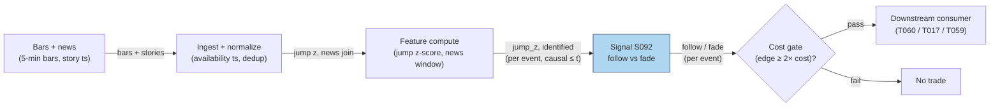

# S092 — News vs no-news decomposition (follow vs fade)

A decomposition, not a direction. Each large price jump is labeled *identified* (firm-specific news in the window) or *no-news* (no story explains the move); the module follows identified-news jumps (drift) and fades no-news jumps (reversal) [documented]. The economics: news-identified information accounts for `49.6`% of overnight idiosyncratic volatility (Boudoukh et al. 2019) [documented], and prices drift after news headlines but reverse after extreme no-news moves (Chan 2003) [documented].

> Tag law: every numeric literal in prose carries one of `[documented]
> [default] [example] [unverified] [internal-est] [measured]` (legend: Appendix
> i v1.0.0). Constants inside cited formulas inherit the formula's tag.
> Bibliographic years, volumes, pages, arXiv IDs, section numbers, rule codes (C1–C10),
> fail-safe codes (F1–F5), module IDs, and machine-parsed §0 data fields are identifiers,
> not literals, and are exempt.

## §1 Five-minute reviewer card

| Row | Value |
|---|---|
| Module | S092 — News vs no-news decomposition (follow vs fade), v1.1.0 |
| Edge verdict | `AFTER-COST-EDGE` (conditional) — the follow/fade asymmetry is documented; the edge is conditional on honest news identification and survives only where the drift exceeds the round-trip cost [documented]. |
| After-cost | `COMM-ONLY` — the chapter's sketch nets `$5`/event all-in on `$10,000` (total +$250 on 6 events [example]); production after-cost is implementation-specific. |
| Build cost | Tier L · `4–12` h [internal-est] · `$600–1,800` loaded [internal-est] |
| Data cost | News API (quote-based, enterprise — [unverified]; consumer Pro screen `$37–197`/mo is NOT the API [documented]) + Databento bars (Standard `$199`/mo incl. full OHLCV history [documented]; `$125` free credit [documented]; pay-as-you-go historical [documented]) → combined `~$100–400`/mo [unverified] (indicative — the news-API quote dominates; verify before budgeting). |
| latency_class | event / minutes (jump detection) |
| risk_class | medium (signal-only; mislabeled jumps invert the trade) |
| Capacity | `$1–10`M/day notional [example] — event-driven capacity is thin |
| Executability | Feasible: jump z-score + news-window join on 5-min bars [documented]. |
| Risk summary | Misidentified news inverts the leg (fade a real-news drift); scheduled vs unscheduled confusion; jump detection lag [documented]. |
| When it dies | News-identification errors; crowded fade of the same no-news spike; the jump is the news (identification arrives late) [documented]. |
| Regime gates | R005 (jump clustering) → halve [default]; R036 (macro-announcement windows) → veto [default]; R013 (abnormal participation) → double the follow leg [default]; R041 (overnight-gap dominance) → widen_stops [default]. Machine records in §S2 (regime-gate table). |
| Emits | `signal_vector` (Appendix b v1.0.0) — never orders |

## §1.5 Cheapest / least-build path

1. **Prototype hour band:** `4–12` h [internal-est] — jump z-score + news-window join + follow/fade rule — reference implementation + gates + fixture validation.
2. **Cheapest-source row:**
   ```yaml
   min_tier: research = GDELT 2.1 headlines (free) + Databento ohlcv-1m pay-as-you-go
             (per-GB unit pricing [unverified — verify against the live pricing page],
             $125 free credit [documented], Standard $199/mo incl. full OHLCV history [documented]);
             production = Benzinga News API (quote-based, enterprise [unverified])
             + Databento live bars (usage-based [documented] + exchange licensing [documented])
   latency_class: minutes (jump detected at the 5-min bar close; tradable next bar)
   required_fields: [story_id, availability_ts (UTC), ticker_map, headline, url, 5-min OHLCV]
   price_band: "~$100-400/mo combined" [unverified] (indicative — the news-API quote dominates; verify before budgeting)
   build_or_buy: BUILD the join (jump z + news-window match is your logic [internal-est]); BUY the feeds
   ```
3. **Resource budget:** `1` core, `<1` GB RAM [internal-est]; compute pattern `per_event`.
4. **Skip list:** ML news classifier ('will this story move the stock') — phase 2; full-text relevance scoring — phase 2.
5. **DO-NOT-CUT list:** causality assertions (`assert fill_event > signal_event`, no-signal-bar-fills test); COST block + callable
   `expected_cost_bps`; F1–F5 fail-safes + module-state enum; decision-log audit records; bona-fide-intent + self-trade prevention; provenance tags on
   every numeric literal; fixtures + `test_cmd`; secrets via env only.
6. **Escalation gate:** upgrade when — misidentification rate > `10`% on audit [default] → add the ML classifier; scheduled/unscheduled confusion → widen match windows for scheduled (see T017).

## §S0 Module contract

### S0.1 Typed signature

```python
def signal(state: ModuleState, events: list[Event], cfg: Config) -> SignalVector:
```

`SignalVector` per Appendix b v1.0.0. `state` is the module-owned named state
vector; `events` are canonical Events (Appendix a v1.0.0), newest last. The
function handles documented edge cases: empty events → `UNKNOWN`; invalid
prices/inputs → `UNKNOWN` (F1, never interpolate); halt/auction events → freeze
per the market-state table.

### S0.2 Config dataclass

| Parameter | Type | Default | Range | Status |
|---|---|---|---|---|
| `jump_z` | float | `3.0` [default] | `>0` | calibrate |
| `min_jump_pct` | float | `1.5` [default] | `>0` | calibrate |
| `news_window_min` | float | `15.0` [default] | `>0` | calibrate |
| `drift_horizon_min` | float | `60.0` [default] | `>0` | calibrate |
| `z_lookback_bars` | int | `78` [default] | `>=20` | calibrate |
| `edge_bps_identified` | float | `60.0` [default] | `>0` | calibrate |
| `edge_bps_nonews` | float | `70.0` [default] | `>0` | calibrate |
| `cooldown_min` | float | `60.0` [default] | `>=0` | calibrate |
| `k` | float | `0.5` [default] | `(0,1]` | default |
| `z_scale` | float | `5.0` [default] | `>0` | default |
| `notional` | float | `10000.0` [example] | `>0` | example |

Defaults with status `calibrate` are fit-time placeholders (tag `[default]`)
until the recipe in §S0.2.1 is run; `k` is the compendium default cost-gate
factor pending calibration data (session 05 open item). `jump_z = 3.0` [default] and `min_jump_pct = 1.5` [default]
align the §S3 pseudocode and the fixture reference (`test_S092.py` CFG).

#### S0.2.1 Calibration recipe (walk-forward, per-parameter)

Grids: `jump_z ∈ {2.0, 2.5, 3.0, 3.5, 4.0}` [default]; `min_jump_pct ∈ {1.0, 1.5, 2.0}` [default];
`news_window_min ∈ {5, 15, 30, 60}` [default]; `drift_horizon_min ∈ {30, 60, 120, 240}` [default];
`z_lookback_bars ∈ {39, 78, 156}` [default]
(`39` = half session, `78` = one 6.5-h session of 5-min bars, `156` = two sessions [default]).
Coordinate descent: fit `jump_z` first, then `min_jump_pct`, then the windows, then the edge estimates —
joint grid is `5×3×4×4×3 = 720` combos [example arithmetic] and overfits the thin event count.

Fold design: `6` folds [default] — train `12` months, out-of-sample `3` months,
`10`-trading-day embargo between train end and OOS start [default] (news-identification
leakage: a story window must not straddle the boundary). Min `150` OOS events per
fold [default]; folds with fewer events are skipped, not merged (thin regimes stay
visible).

Selection metric: mean after-cost `$`/event on OOS at the §S2 cost stack
([example] stack is replaced by the production stack before calibration). Tie-break:
higher gate-pass rate, then lower |identification error rate − audit rate|.

Freeze rule: freeze at the median of the `6` fold-winners [default]; record all
fold results in the decision log. Refit cadence: annual [default], or when the
identification audit error rate drifts `>10`% [default] (§1.5 escalation). Guardrail:
do not ship unless OOS mean after-cost `> 0` and gate-pass rate `≥ 50`% [default].

`edge_bps_identified` / `edge_bps_nonews`: calibrated OOS mean drift/fade per
event in bps (current defaults `60`/`70` [default] are fixture medians [example],
pending the walk-forward).

### S0.3 Canonical schema mapping

Vendor columns → canonical Event schema (Appendix a v1.0.0), stated once here:

| Source field | Canonical |
|---|---|
| 5-min bar close [example] (exchange) | `event_ts (int64 ns UTC, bar open time) + close` |
| story timestamp (vendor) | `news_ts (module feature input; availability ts)` |
| jump z-score | `jump_z (module feature input)` |
| Benzinga story fields (`id`, `created_at`, `updated_at`, `tickers[]`, `title`, `url`) [unverified — confirm against vendor docs] | `story_id`, `avail_ts = min(created_at, first-seen-at-ingest)` [default], `symbols[]`, `headline` — `updated_at` is NEVER used as the join key (fantasy fills) |
| Databento `ohlcv-1m` record (`ts_event`, `open`, `high`, `low`, `close`, `volume`) | `event_ts = ts_event (int64 ns UTC)`, bars resampled to 5-min client-side |

### S0.4 Time contract

> Time contract: clock domain UTC, int64 ns; authoritative causality clock =
> `event_ts`; max_skew = `1` ms [default]; jitter budget = `500` µs [default];
> bar-label = open time; staleness TTL = `3` s [default] (`3`× the `1`-s reference cadence per F4); gap policy = mask, no interpolation;
> halt/auction → discard contributions across reopen.

**Timing box:** `signal@t (per_event, America/New_York) → earliest fill @open(t+1)`

### S0.5 Market-state table

| State | Module behavior |
|---|---|
| CONTINUOUS_TRADING | Compute normally; emit per cadence |
| HALTED | Freeze state; emit `UNKNOWN`; discard contributions across reopen |
| AUCTION | No new signals; hold last `SignalVector`; state `DEGRADED` |
| CLOSED | Emit nothing; state `OFF` |

### S0.6 Module-state enum + error taxonomy

States per Appendix k v1.0.0: `OK | DEGRADED | UNKNOWN | OFF`. Invalid input →
`UNKNOWN`, never interpolate (Appendix f v1.0.0, F1–F5).

| Failure | State | Alert |
|---|---|---|
| Missing/stale input (TTL `3` s [default] (`3`× the `1`-s reference cadence per F4)) | `UNKNOWN` | page |
| Invalid price/input reaching module (NaN, ≤ 0, non-finite) | `UNKNOWN` | log |
| Feature out of mathematical bounds (F2) | `UNKNOWN` | page |
| `seq` gap > `1,000` events [default] | `DEGRADED` (restart windows) | log |
| Jitter > budget persistently | `DEGRADED` | notify |
| Halt/auction | `UNKNOWN` / `DEGRADED` (per table) | log |
| Kill/administrative disable | `OFF` | page |
| Anything unmapped | `UNKNOWN` | page |

### S0.7 Ops tail

- **Schedule:** continuous during US equities regular session `09:30`–`16:00` America/New_York [documented]; owner: signals on-call.
- **Health checks:** fixture replay (`test_cmd`) green on deploy; live
  `seq`-gap monitor; staleness watchdog at `3`× cadence [default].
- **Alert table:** page on `UNKNOWN` > `30` s [default] or bounds violation;
  notify on `DEGRADED`; log on single dropped events.
- **Resource budget:** `1` vCPU, `1` GB RAM [internal-est]; state is O(window) per symbol.
- **Runbook stub:** `1.` confirm feed (vendor status); `2.` replay fixture;
  `3.` if red → set `OFF`, page; `4.` reconcile decision log before re-arm.

### S0.8 Secrets (env-only)

`DATA_VENDOR_API_KEY` via environment only. No secrets in this file, fixtures, or
logs (CI secrets-grep).

### S0.9 May / must-NOT

> **May:** emit `SignalVector` records per Appendix b v1.0.0. **Must-NOT:**
> emit orders, order intents, prices, share counts, or notionals; call a
> broker; mutate shared state outside `state`; interpolate across gaps.

## §S1 Legacy (subsumed by §1)

Legacy §S1 content is the §1 reviewer card above; this header is retained so
section numbering stays intact.

## §S2 Specification

### Universe

One symbol's 5-min bars joined to its story flow; fixture: `6` synthetic jump events (seed `92` [example]).

### Entry rule (Boolean — no prose-only conditions)

```
JUMP        := |jump_z| > cfg.jump_z AND |ret_5m| >= cfg.min_jump_pct/100   # defaults 3.0 / 1.5 [default]; calibrate per §S0.2.1
IDENTIFIED  := any story with avail_ts in [t - cfg.news_window_min*60s, t]  # default 15 min [default]; availability ts only
FOLLOW      := JUMP AND IDENTIFIED     -> direction =  sign(jump_z)          # ride the drift [documented]
FADE        := JUMP AND NOT IDENTIFIED -> direction = -sign(jump_z)         # fade the noise [documented]
GATE        := cost_gate_pass(expected_cost_bps(...), edge_bps, cfg.k)      # §S3 predicate; fail -> direction 0 (C2 veto)
LOCATE      := (direction < 0) IMPLIES locate_ok                            # fail -> direction 0 (C7 veto)
```
`jump_z` is computed over `z_lookback_bars = 78` [default] completed bars (see §S3 for the binding); `|jump_z| == cfg.jump_z` is NOT a jump (strict `>`).

### Exits (with post-exit cooldown)

```
EXIT := follow leg: exit after `60` min [default] as the drift completes; fade leg: exit on reversion to the pre-jump level or after `60` min [default]. Post-signal cooldown `60` min [default] per jump-event id (C10): re-signaling the same event inside the window emits `direction 0`.
```

### Position sizing (fenced function)

```python
def size_capital_fraction(confidence: float) -> float:
    # S-module emits a capital FRACTION only; share math lives in the strategy.
    # All symbols bound: confidence in [0,1] (computed in §S3), output in [0, 0.5].
    assert 0.0 <= confidence <= 1.0            # F2 bound; out-of-range -> UNKNOWN by caller
    return 0.5 * confidence                   # [default] max 0.5 of risk budget per signal
```

### Risk limits

| Limit | Value |
|---|---|
| Max capital fraction per signal | `0.5` [default] |
| Max adverse excursion before `UNKNOWN` review | `2.0`× stop [default] |
| Staleness kill | TTL `3` s [default] (`3`× the `1`-s reference cadence per F4) → `UNKNOWN` |
| News-window discipline | identification uses availability ts only — publication-ts joins are fantasies [documented] |

### COST block (single source of truth)

| Component | Value (bps) | Tag | Basis |
|---|---|---|---|
| Spread | `2.5` | [example] | event spread at the example notional |
| Fees | `0.5` | [example] | placeholder — production pins the real schedule: XNAS Rule 7018 removal is `$0.0030`/share [documented, SEC 34-74258], i.e. `3.0` bps at a `$100` reference price [example arithmetic]; the stack line must be replaced by the per-share→bps conversion before production |
| Borrow | `0.0` | [default] | `borrow_bps_per_day = 0.0` [default] — legs hold `≤60` min [example]; general-collateral borrow on an intraday fade is sub-bp; hard-to-borrow names add `quoted_annual_bps / 360` per day [default formula]; fade shorts additionally require `locate_ok` (C7) |
| Market impact/slippage | `2.0` | [example] | trading the jump |
| **Total reference** | `5.0` | [example] | matches the fixture cost_bps=5.0 (`$5` on `$10,000`) |

`fee_schedule_as_of`: `2026-09-10` [unverified] — placeholder; pin the venue's
Rule 7018 schedule version before production (removal fee reference `$0.0030`/share
[documented, SEC 34-74258]). `side`: taker [example]; `venue/tier/source`: XNAS [example].
Re-stating cost numbers outside this block is a validation failure.

```python
def expected_cost_bps(notional, adv_pct, venue, side, urgency) -> float:
    # Callable cost model — mirrors the block above exactly (spread 2.5 / fees 0.5 / borrow 0.0 / impact 2.0).
    spread_bps = 2.5   # [example]
    fee_bps = 0.5      # [example] placeholder; production: Rule 7018 $0.0030/share [documented] at price
    borrow_bps = 0.0   # [default] borrow_bps_per_day = 0.0 — intraday legs [example]; HTB: quoted_annual_bps/360
    impact_bps = 2.0   # [example] trading the jump
    return spread_bps + fee_bps + borrow_bps + impact_bps
```

### Execution / fill model table

| Aspect | Assumption |
|---|---|
| Latency | jump detected at the 5-min bar close; tradable at the next bar's first honest quote [documented] |
| Participation | small — event capacity is thin [example] |
| Partial fills | assume partial fills on fast jumps [example] |
| Adverse fill | misidentified news inverts the leg — the dominant adverse-fill mode [documented] |

### Robustness

The leg choice is a step function of the news join — the fragile knob is identification quality, not the z threshold. Scheduled (earnings/macro) vs unscheduled headlines need different match windows (see T017) [documented].

### Regime gates (machine records)

```yaml
regime_gates:  # unknown_behavior is veto for all — restrictive default (§S0.6)
  - regime_id: R005   # Jump regime (discontinuity state)
    direction: degrades
    mechanism: jump clustering raises the false-jump rate; the z threshold fires on volatility clusters, not information
    condition: R005.state == ACTIVE
    action: halve
    min_lag: 0d  # [default]
    unknown_behavior: veto
  - regime_id: R036   # Macro announcement windows
    direction: degrades
    mechanism: scheduled macro releases dominate the tape; firm-specific identification becomes unreliable (see failure mode 2)
    condition: R036.window == ACTIVE
    action: veto
    min_lag: 0d  # [default]
    unknown_behavior: veto
  - regime_id: R013   # Abnormal volume / participation regime
    direction: amplifies
    mechanism: abnormal participation raises drift persistence after identified news (follow leg)
    condition: R013.participation_z > 2.0  # [default] threshold, pending R013 calibration
    action: double
    min_lag: 0d  # [default]
    unknown_behavior: veto
  - regime_id: R041   # Overnight gap vs intraday variance decomposition
    direction: degrades
    mechanism: when overnight gaps dominate variance, the fade leg pays the open's gap cost
    condition: R041.gap_share > 0.5  # [default] threshold, pending R041 calibration
    action: widen_stops
    min_lag: 1d  # [default]
    unknown_behavior: veto
```

### Compliance sub-block (C1–C10+)

| Code | Rule: trigger → check → action → log |
|---|---|
| C1 | Self-match prevention: S092 emits no orders; downstream T-modules must set self-trade-prevention flags — S092 asserts the requirement in its `consumes` contract: trigger → check → action → log record |
| C2 | Bona-fide intent: every emitted `SignalVector` with |direction|=`1` must pass the cost gate; sub-threshold scores emit direction `0`, never a tradeable hint: trigger → check → action → log record |
| C3 | Message-rate: `≤100` emissions/symbol/s [default]; breach → throttle to `1`/s [default] + alert: trigger → check → action → log record |
| C4 | Fat-finger trio (applied by consumers; this module bounds its own outputs): confidence ∈ [`0`,`1`], capital ∈ [`0`,`0.5`], computed_at sane — out-of-bounds → `UNKNOWN` (F2): trigger → check → action → log record |
| C5 | Decision log: every emission, veto, and state transition logged per Appendix g v1.0.0, hash-chained: trigger → check → action → log record |
| C6 | Halt/auction: per §S0.5 market-state table; contributions across reopen discarded: trigger → check → action → log record |
| C7 | Locate check: SHORT direction requires `locate_ok` from the consumer; this module never emits SHORT without the consumer asserting locate (Reg-SHO threshold securities → direction `0`): trigger → check → action → log record |
| C8 | Public dissemination: no signal values published externally without review gate: trigger → check → action → log record |
| C9 | Data entitlements: per §S6 Data rights row; entitlement-class change → §1.5 escalation gate: trigger → check → action → log record |
| C10 | Post-exit cooldown: `60` min [default] after a faded event; no re-fade of the same jump: trigger → check → action → log record |

### Parameter table

| Parameter | Symbol | Value | Tag | Sensitivity |
|---|---|---|---|---|
| Jump threshold | ``jump_z`` | `3.0` | [default] | high — small: noise; large: no events; status: calibrate (§S0.2.1) |
| Min jump % | ``min_jump_pct`` | `1.5` | [default] | medium — small: noisy low-price moves; large: missed events; status: calibrate |
| News window | ``news_window_min`` | `15` | [default] | high — small: misses stories; large: false identified; status: calibrate |
| Drift horizon | ``drift_horizon_min`` | `60` | [default] | medium — small: truncated drift; large: noise; status: calibrate |
| z lookback | ``z_lookback_bars`` | `78` | [default] | medium — short: noisy σ; long: stale regime; status: calibrate |
| Identified edge | ``edge_bps_identified`` | `60` | [default] | high — drives the cost gate; status: calibrate |
| No-news edge | ``edge_bps_nonews`` | `70` | [default] | high — drives the cost gate; status: calibrate |
| Cooldown | ``cooldown_min`` | `60` | [default] | medium — short: re-fades the same jump; long: missed events; status: calibrate |
| Cost-gate k | ``k`` | `0.5` | [default] | high — small: no emissions; large: unprofitable trades |

### Timing box

`signal@t (per_event, America/New_York) → earliest fill @open(t+1)`

## §S3 Math + normative pseudocode

Jump: `|jump_z| > 3.0` [default] on 5-min returns, and `|ret_5m| >= 1.5`% [default],
where the z-score is computed
over `z_lookback_bars = 78` [default] completed bars. Identification:
`identified = 1` iff a firm-specific story with availability timestamp in
`[t − news_window_min, t]` [default]. Rule: identified → follow
(`direction = sign(jump)`, drift leg); no-news → fade (`direction = −sign(jump)`,
reversal leg) [documented]. The documented asymmetry: prices drift after news
headlines and reverse after extreme no-news moves (Chan 2003) [documented];
news-identified information is `49.6`% of overnight idiosyncratic volatility
(Boudoukh et al. 2019) [documented]. Cost gate: `expected_cost_bps(...) <= k *
edge_bps`, `k = 0.5` [default]; fixture edges are per-event illustrative bps
[example]. Edge estimates `edge_bps_identified = 60` / `edge_bps_nonews = 70`
[default] are calibrated OOS (§S0.2.1); in the fixture, `edge_bps` is the
observed per-event `|next60_pct| × 100` [example].

**Normative pseudocode** (pseudocode is normative; prose is commentary). Every
symbol is bound below; guards (staleness, halt, locate, cooldown, cost gate,
causality) are inline.

```
# Inputs:
#   bars[0..N-1] : 5-min bars, label = OPEN time, event_ts[i] int64 ns UTC, strictly increasing
#   stories      : list of {story_id, avail_ts (int64 ns UTC), symbols[], headline}
#   cfg          : Config — jump_z, min_jump_pct, news_window_min, drift_horizon_min, z_lookback_bars,
#                  edge_bps_identified, edge_bps_nonews, cooldown_min, k, notional,
#                  adv_pct, venue, side, urgency, locate_ok, market_state, staleness_ttl_s
#   state        : ModuleState — {last_jump_ev (event id or None), last_emit_ts (int64 ns),
#                  last_bar_ts (int64 ns), seq}
# Helpers (bound):
#   sign(x)  := 1 if x > 0 else -1            # x != 0 whenever called (|jump_z| > threshold > 0)
#   emit(**kw): builds a SignalVector record; defaults direction=0, confidence=0.0,
#               capital=0.0, module_state=OK, edge_bps=0.0, cost_bps=from callable,
#               gate_pass=False, fill_event=None, note="" unless overridden.
# Locals bound below: t, i, ret, mu, sigma, jump_z, w0, identified, is_jump, direction,
#   edge_bps, cost_bps, gate_pass, confidence, capital, fill_event, signal_event, bar_ns

def compute_signal(t):                                  # t = signal event time, int64 ns UTC
    # --- staleness guard (F4): TTL 3 s [default] = 3x the 1-s reference cadence ---
    if state.last_bar_ts is None or (t - state.last_bar_ts) > cfg.staleness_ttl_s * 1_000_000_000:
        return emit(module_state=UNKNOWN, note="stale") # gap policy: mask, no interpolation

    # --- market-state guard (§S0.5): halt/auction/closed freeze state ---
    if cfg.market_state == HALTED:
        return emit(module_state=UNKNOWN, note="halt freeze")
    if cfg.market_state == AUCTION:
        return emit(module_state=DEGRADED, note="auction hold")
    if cfg.market_state == CLOSED:
        return emit(module_state=OFF, note="closed")

    # --- causality: only completed bars with event_ts <= t may be read ---
    assert all(b.event_ts <= t for b in bars)            # [rule] no lookahead, no future bars
    i = max(j for j in range(N) if bars[j].event_ts <= t)
    if i < cfg.z_lookback_bars:                         # F1: insufficient history
        return emit(module_state=UNKNOWN, note="short history")
    ret   = bars[i].close / bars[i-1].close - 1.0       # fractional 5-min return, bar i completed at t
    mu    = mean(bars[j].close / bars[j-1].close - 1.0 for j in range(i - cfg.z_lookback_bars, i))
    sigma = stdev(bars[j].close / bars[j-1].close - 1.0 for j in range(i - cfg.z_lookback_bars, i))
    if not (sigma > 0.0):                               # F2: degenerate window
        return emit(module_state=UNKNOWN, note="sigma<=0")
    jump_z = (ret - mu) / sigma                         # z on fractional returns [rule]

    # --- identification: availability ts ONLY (publication-ts joins are fantasies) ---
    w0 = t - cfg.news_window_min * 60_000_000_000       # [rule] window in ns
    identified = any(s.avail_ts >= w0 and s.avail_ts <= t and symbol in s.symbols
                     for s in stories)                  # s.avail_ts <= t is the causality pin

    is_jump = (abs(jump_z) > cfg.jump_z) and (abs(ret) >= cfg.min_jump_pct / 100.0)
    if not is_jump:                                     # strict > : |z| == threshold is NOT a jump
        return emit(jump_z=jump_z, identified_news=int(identified), note="no jump")

    # --- post-emission cooldown (C10): no re-signal of the SAME jump event id ---
    if state.last_jump_ev == bars[i].event_id \
            and (t - state.last_emit_ts) <= cfg.cooldown_min * 60_000_000_000:
        return emit(jump_z=jump_z, identified_news=int(identified), note="cooldown: same jump")

    direction = sign(jump_z) if identified else -sign(jump_z)   # follow vs fade [documented]
    # --- locate guard (Reg-SHO; C7): SHORT needs locate_ok from the consumer ---
    if direction < 0 and not cfg.locate_ok:
        return emit(jump_z=jump_z, identified_news=int(identified), note="locate missing -> direction 0")
    edge_bps = cfg.edge_bps_identified if identified else cfg.edge_bps_nonews
    cost_bps = expected_cost_bps(cfg.notional, cfg.adv_pct, cfg.venue, cfg.side, cfg.urgency)
    gate_pass = cost_bps <= cfg.k * edge_bps            # executable cost-gate predicate [rule]
    if not gate_pass:
        return emit(jump_z=jump_z, identified_news=int(identified),
                    edge_bps=edge_bps, cost_bps=cost_bps,
                    gate_pass=False, note="cost gate veto")   # C2 bona-fide intent
    confidence = min(1.0, abs(jump_z) / cfg.z_scale)  # z_scale = 5.0 [default]
    capital = size_capital_fraction(confidence)         # §S2: 0.5 * confidence [default]
    signal_event = t
    bar_ns = bars[i].event_ts - bars[i-1].event_ts      # 5-min grid spacing [default]
    fill_event = t + bar_ns                            # next bar's open: earliest honest quote
    assert fill_event > signal_event                   # [rule] t -> t+1: no signal-bar fills
    out = emit(direction=direction, confidence=confidence, capital=capital,
               edge_bps=edge_bps, cost_bps=cost_bps, gate_pass=True,
               jump_z=jump_z, identified_news=int(identified),
               signal_event=signal_event, fill_event=fill_event,
               module_state=OK)
    state.last_jump_ev = bars[i].event_id               # arm the per-jump cooldown
    state.last_emit_ts = t
    return out
```

Causality: the computation at `t` uses only data `≤ t`; earliest reaction is
`t+1`. Mandatory unit test: no-signal-bar fills (the tape pins
`fill_event_ts > computed_at` on every row via `assert` in the reference).

## §S4 Worked example (fixture-backed)

- Fixture: `6` synthetic jump events (seed `92` [example]); tape `modules/fixtures/S092_tape.csv` (`# TYPE: validation-run`); `$10,000` at `5` bps all-in (`$5`/event) [example].
- Directions: [**+1, +1, +1, −1, −1, −1**] [example]; nets: [ **+$55**, **+$85**, **−$25**, **+$105**, **−$35**, **+$65** ] → total **+$250** [example] — arithmetic, not a backtest.
- Event 1: jump_z **4.2**, news-backed (identified=**1**) → follow long, net +$55 [example]. Event 4: jump_z **5.1**, no-news (identified=**0**) → fade short, net +$105 [example].
- `assert fill_event > signal_event` holds on every row [measured].
- Edge cases live in `modules/fixtures/S092_edge.csv` (`# TYPE: validation-run`): ev7 boundary (`|jump_z| == 3.0` → not a jump), ev8 cost-gate veto (edge `2` bps → `direction 0`), ev9 invalid input → `UNKNOWN`, ev10 halt → `UNKNOWN`, ev11 no-news down-jump → fade long (`+$35`) [example] — all hand-checked in `tests/test_S092.py`.
- Where the example is optimistic: identification is perfect in the tape — real joins mislabel stories, and every mislabel inverts the leg; the +$250 is constructed arithmetic [documented].

## §S5 Strategies that use this signal

Generated from `deps.yaml` (CI symmetry); hand-listed here for this module:

| Strategy | Role |
|---|---|
| T060 — Identified-news drift portfolio | primary trigger: holds identified-news drifters and fades no-news drift; this signal is the decomposition engine |
| T017 — Scheduled macro-announcement drift | conditioning filter: the same follow/fade logic on scheduled releases |
| T059 — News-sentiment first-minute momentum | confirmation input: the news/no-news label gates which reactions to chase |

## §S6 Data required

| Field | Vendor / product / endpoint | Schema | Required fields | Price band (as-of) |
|---|---|---|---|---|
| 5-min OHLCV bars | Databento — `ohlcv-1m` schema, dataset `EQUS.MINI` [unverified — confirm the dataset id on ingest], Historical REST (`hist.databento.com`) [unverified] via the official Python client [unverified]; resample to 5-min client-side | `ohlcv-1m`: `ts_event` (int64 ns UTC), `open`, `high`, `low`, `close`, `volume` | `ts_event`, `close`, `volume` (volume for the participation filter) | Per-GB unit pricing [unverified — verify against the live pricing page]; `$125` free credit [documented]; Standard `$199`/mo incl. full OHLCV history [documented]; live adds exchange licensing [documented]. Research scale: `500` symbols × 1 month of 1-min bars ≈ `1.5` GB [example arithmetic] — multiply by the verified unit price before budgeting |
| Story timestamps (availability) | Benzinga News API (REST; enterprise, quote-based pricing [unverified]); research tier: GDELT 2.1 headlines (free) [documented] | Benzinga story record [unverified — confirm against vendor docs]: `id`, `created_at`, `updated_at`, `tickers[]`, `title`, `body`, `url` — required: `id`, `created_at`, ticker map; join key = `min(created_at, first-seen-at-ingest)` [default]; `updated_at` NEVER used as the join key | `story_id`, `availability_ts` (UTC), `symbols[]`, `headline`, `url` | API pricing is quote-based/enterprise — [unverified] (consumer Pro screen plans `$37–197`/mo [documented third-party review] are NOT the data API; do not budget against them). News feed is the dominant cost — get a written quote before production |
| Corporate actions / halts | Databento `definition`/`status` schemas on the same Historical API, or exchange halt notices | `definition`/`status` records per symbol | halt/resume timestamps, split/dividend adjustments | `definition` schema per-GB pricing [unverified — verify against the live pricing page] |

Bar-label rule: exchange bar label = open time; `event_ts` = bar open time (int64 ns UTC) [default].
Dedup: stories keyed on `story_id`; cross-wire duplicates merged by `(tickers, headline-hash)` [default].

**Data rights row** (Appendix j v1.0.0): News text: licensed (Benzinga) [documented]; bar data: vendor-licensed [documented].

## §S7 Local build (M5 Max / 128 GB)

Feasibility: feasible — jump z-score plus a timestamp join on 5-min bars. Tier L, `4–12` h → `$600–1,800` loaded [internal-est]. Working set `<500` MB [internal-est] — far under the ~`77` GB budget. Bottleneck is news-identification quality, not compute [documented].

## §S8 Buy vs build

Build. The jump/identification join is your logic on licensed inputs — nothing to buy except the news text rights and the bar feed [documented].

## §S9 Efficacy — documented evidence

| Study / source | Market & period | Metric | Before/after cost | Caveat |
|---|---|---|---|---|
| Boudoukh et al. (2019), RFS 32(3) | US stocks | textual identification of fundamental news; news-identified info = 49.6% of overnight idiosyncratic volatility [documented] | `BEFORE-COST` | identification result, not a trading rule |
| Chan (2003), JFE 70 | US stocks, headlines | drift after news headlines; reversal after extreme no-news moves; concentrated in small/illiquid names [documented] | `BEFORE-COST` | supports the follow/fade asymmetry, not a calibrated strategy |
| Handbook of News Analytics in Finance (O'Reilly), §6.2 | Literature survey | news/no-news return differences persist excluding earnings news [documented] | `BEFORE-COST` | survey, not primary evidence |

Selection disclosure: these are the sources surfaced by the chapter's research pass. Fails in: misidentified news (inverts the leg), crowded fades, identification arriving after the move. **Honest bottom line:** the follow/fade asymmetry is documented in two independent literatures — as a decomposition it is the standard lens; as a strategy it is conditional on honest, fast identification and explicit cost modeling [documented].

## §S10 Failure modes & pitfalls

| # | Trigger → Detect → Action → Recovery | check: |
|---|---|
| 1 | Misidentified news → fade a real-news drift (or follow noise) [documented] → audit identification; ML classifier → leg inverted | `check: identification audit rate` |
| 2 | Scheduled vs unscheduled confusion → wrong match window [documented] → wider windows for scheduled (T017) → missed/sloppy joins | `check: scheduled flag respected` |
| 3 | Jump-detection lag → the move is done before the bar closes [documented] → check pre-event drift → buying the top | `check: pre-jump drift < threshold` |
| 4 | Crowded fade → everyone fades the same no-news spike [documented] → monitor crowding proxies → reversal front-run | `check: crowding proxy` |
| 5 | Publication-ts join → fantasy fills [documented] → availability ts only → untradable backtest | `check: join key == availability ts` |
| 6 | Borrow on the fade short → hard-to-borrow names [documented] → borrow > 0 in the stack; locate check → short squeeze | `check: borrow_bps set; locate_ok` |
| 7 | Invalid inputs (NaN, ≤ 0) → F1 → UNKNOWN, never interpolate [documented] → drop the event → silent bad leg | `check: invalid input → UNKNOWN` |
| 8 | Halt/auction → freeze per the market-state table [documented] → no jumps across reopen → jump through the halt | `check: halt → no signal` |

## §S11 Visuals

`../../images/S092_example.png` — synthetic worked-example chart (seed `92` [example]).



## §S12 Source log + unverified leads

**Sources** (citable facts only):

1. Boudoukh, J., Feldman, R., Kogan, S. & Richardson, M. (2019). 'Information, Trading, and Volatility: Evidence from Firm-Specific News.' Review of Financial Studies 32(3): 992–1033. https://ideas.repec.org/a/oup/rfinst/v32y2019i3p992-1033..html (verified 2026-09-10; the single-dot URL 404s — use this form)
2. Chan, W. S. (2003). 'Stock price reaction to news and no-news: Drift and reversal after headlines.' Journal of Financial Economics 70(2): 223–260. https://doi.org/10.1016/S0304-405X(03)00146-6 (verified 2026-09-10)
3. The Handbook of News Analytics in Finance (O'Reilly), §6.2 — news/no-news return differences persist excluding earnings news. https://www.oreilly.com/library/view/the-handbook-of/9780470666791/p02chap01-sec002.html
4. Databento pricing plans (verified 2026-09-10): Standard `$199`/mo includes unlimited OHLCV-1s/-1m history for US equities; `$125` free credits for new users; pay-as-you-go historical pricing retained. https://databento.com/blog/upcoming-changes-to-pricing-plans-in-january-2025
5. Benzinga Pro retail pricing (verified 2026-09-10): Basic `$37`/mo, Essential `$197`/mo — these are terminal/screen plans, NOT the machine-readable News API. https://www.luxalgo.com/blog/benzinga-pro-review-is-news-edge-worth-cost/
6. Benzinga Massive/News API vs alternatives (verified 2026-09-10): Benzinga API is enterprise/quote-based; Finnhub offers a free tier at 60 calls/min. https://mediawatcher.ai/blog/benzinga-api-vs-finnhub-vs-investment-watcher-which-news-api-actually-moves-desks/

**Chatbot source log.** Duck.ai answered Q-SB10-1–Q-SB10-3 (2026-09-10) [measured]; Grok/Cursor answers pending (checked 2026-09-10).

**Unverified leads** (chatbot-only — never in evidence tables):

- Duck.ai Q-SB10 batch QA: ML news-classifier sketch ('will this story move the stock') — proposed extension, no checkable source this batch [unverified].
- Duck.ai Q-SB10 batch QA: scheduled-vs-unscheduled window grids — research leads, not validated standards [unverified].
- Benzinga News API developer pricing (per-month tiers / per-call rates) — website is quote-only; needs a sales quote [unverified].
- Exact `databento.Historical` `timeseries.get_range` call pattern for `ohlcv-1m` on `EQUS.MINI` — confirm against the pinned client docs before wiring ingest [unverified].
- Current XNAS Rule 7018 schedule version (post-2026-09-10 amendments) — `$0.0030`/share removal is the documented reference [documented, SEC 34-74258]; verify the live schedule version before production [unverified].
- General-collateral vs HTB borrow-rate range for intraday large-cap shorts backing the `borrow_bps_per_day = 0.0` [default] assumption — quote-dependent [unverified].
- Databento per-GB unit prices (historical/live) and the `definition`-schema price band — not verifiable from public pages in this pass [unverified]; verify against the live pricing page before budgeting.
- Databento dataset id `EQUS.MINI`, the `hist.databento.com` Historical REST endpoint, and the `databento.Historical` client call pattern — confirm on ingest [unverified].
- Benzinga News API story-record field names (`id`, `created_at`, `updated_at`, `tickers[]`, `title`, `body`, `url`) — confirm against the vendor's API docs [unverified].

---

## Appendix — AI build prompt (S092)

Copy-paste into any chat agent:

> Build module **S092 — News vs no-news decomposition (follow vs fade)** per `notes/module-template.md` v1.0.0 and this file's §S0 contract.
> Cheapest path (§1.5): prototype `4–12` h [internal-est] — jump z-score + news-window join + follow/fade rule; compute pattern `per_event`.
> Implement `signal(state, events, cfg) -> SignalVector` (Appendix b v1.0.0)
> with the §S3 normative pseudocode, including the cost-gate predicate
> `expected_cost_bps(...) <= k * edge_bps` and `assert fill_event >
> signal_event`. Wire F1–F5 (Appendix f v1.0.0): invalid input → `UNKNOWN`,
> never interpolate. Log decisions per Appendix g v1.0.0. Secrets via env
> only. Run the fixture `modules/fixtures/S092_tape.csv`
> (`# TYPE: validation-run`) against `modules/fixtures/S092_expected.csv`
> (tolerance `1e-9` [default]).
> **Definition of done:** `python3 -m pytest modules/tests/test_S092.py -q`
> exits `0`. Tag every numeric literal you add with the unified enum
> (Appendix i v1.0.0); put anything unverifiable in §S12 unverified leads.
