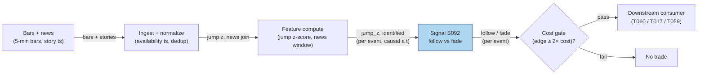

# S092 — News vs no-news decomposition (follow vs fade)

A decomposition, not a direction. Each large price jump is labeled *identified* (firm-specific news in the window) or *no-news* (no story explains the move); the module follows identified-news jumps (drift) and fades no-news jumps (reversal) [documented]. The economics: news-identified information accounts for `49.6`% of overnight idiosyncratic volatility (Boudoukh et al. 2019) [documented], and prices drift after news headlines but reverse after extreme no-news moves (Chan 2003) [documented].

> Tag law: every numeric literal in prose carries one of `[documented]
> [default] [example] [unverified] [internal-est] [measured]` (legend: Appendix
> i v1.0.0). Constants inside cited formulas inherit the formula's tag.
> Bibliographic years, volumes, pages, arXiv IDs, section numbers, rule codes (C1–C10),
> fail-safe codes (F1–F5), module IDs, and machine-parsed §0 data fields are identifiers,
> not literals, and are exempt.

## §1 Five-minute reviewer card

| Row | Value |
|---|---|
| Module | S092 — News vs no-news decomposition (follow vs fade), v1.0.0 |
| Edge verdict | `AFTER-COST-EDGE` (conditional) — the follow/fade asymmetry is documented; the edge is conditional on honest news identification and survives only where the drift exceeds the round-trip cost [documented]. |
| After-cost | `COMM-ONLY` — the chapter's sketch nets `$5`/event all-in on `$10,000` (total +$250 on 6 events [example]); production after-cost is implementation-specific. |
| Build cost | Tier L · `4–12` h [internal-est] · `$600–1,800` loaded [internal-est] |
| Data cost | News + 5-min bars: ~$100–400/mo combined [unverified] (indicative — verify before budgeting). |
| latency_class | event / minutes (jump detection) |
| risk_class | medium (signal-only; mislabeled jumps invert the trade) |
| Capacity | `$1–10`M/day notional [example] — event-driven capacity is thin |
| Executability | Feasible: jump z-score + news-window join on 5-min bars [documented]. |
| Risk summary | Misidentified news inverts the leg (fade a real-news drift); scheduled vs unscheduled confusion; jump detection lag [documented]. |
| When it dies | News-identification errors; crowded fade of the same no-news spike; the jump is the news (identification arrives late) [documented]. |
| Regime gates | Provisional: R-macro-event → identification unreliable: stand down [example]. |
| Emits | `signal_vector` (Appendix b v1.0.0) — never orders |

## §1.5 Cheapest / least-build path

1. **Prototype hour band:** `4–12` h [internal-est] — jump z-score + news-window join + follow/fade rule — reference implementation + gates + fixture validation.
2. **Cheapest-source row:** min_tier = Tier-0/1 bars + GDELT headlines (free) for research [documented]; production min_tier = Tier-1/2 news + bars; latency_class = minutes; required_fields = 5-min bars, story timestamps; price_band = `~$100–400`/mo [unverified] (indicative — verify before budgeting); build_or_buy = **build** — the join logic is yours [internal-est].
3. **Resource budget:** `1` core, `<1` GB RAM [internal-est]; compute pattern `per_event`.
4. **Skip list:** ML news classifier ('will this story move the stock') — phase 2; full-text relevance scoring — phase 2.
5. **DO-NOT-CUT list:** causality assertions (`assert fill_event > signal_event`, no-signal-bar-fills test); COST block + callable
   `expected_cost_bps`; F1–F5 fail-safes + module-state enum; decision-log audit records; bona-fide-intent + self-trade prevention; provenance tags on
   every numeric literal; fixtures + `test_cmd`; secrets via env only.
6. **Escalation gate:** upgrade when — misidentification rate > `10`% on audit [default] → add the ML classifier; scheduled/unscheduled confusion → widen match windows for scheduled (see T017).

## §S0 Module contract

### S0.1 Typed signature

```python
def signal(state: ModuleState, events: list[Event], cfg: Config) -> SignalVector:
```

`SignalVector` per Appendix b v1.0.0. `state` is the module-owned named state
vector; `events` are canonical Events (Appendix a v1.0.0), newest last. The
function handles documented edge cases: empty events → `UNKNOWN`; invalid
prices/inputs → `UNKNOWN` (F1, never interpolate); halt/auction events → freeze
per the market-state table.

### S0.2 Config dataclass

| Parameter | Type | Default | Range | Status |
|---|---|---|---|---|
| `jump_z` | float | `3.0` | `>0` | [example] |
| `news_window_min` | float | `15.0` | `>0` | [example] |
| `drift_horizon_min` | float | `60.0` | `>0` | [example] |

All defaults tagged per the tag law (status `default` ⇒ `[default]`, `example` ⇒ `[example]`, `calibrate` set at fit time).

### S0.3 Canonical schema mapping

Vendor columns → canonical Event schema (Appendix a v1.0.0), stated once here:

| Source field | Canonical |
|---|---|
| 5-min bar close [example] (exchange) | `event_ts (int64 ns UTC, bar open time) + close` |
| story timestamp (vendor) | `news_ts (module feature input; availability ts)` |
| jump z-score | `jump_z (module feature input)` |

### S0.4 Time contract

> Time contract: clock domain UTC, int64 ns; authoritative causality clock =
> `event_ts`; max_skew = `1` ms [default]; jitter budget = `500` µs [default];
> bar-label = open time; staleness TTL = `3` s [default] (`3`× the `1`-s reference cadence per F4); gap policy = mask, no interpolation;
> halt/auction → discard contributions across reopen.

**Timing box:** `signal@t (per_event, America/New_York) → earliest fill @open(t+1)`

### S0.5 Market-state table

| State | Module behavior |
|---|---|
| CONTINUOUS_TRADING | Compute normally; emit per cadence |
| HALTED | Freeze state; emit `UNKNOWN`; discard contributions across reopen |
| AUCTION | No new signals; hold last `SignalVector`; state `DEGRADED` |
| CLOSED | Emit nothing; state `OFF` |

### S0.6 Module-state enum + error taxonomy

States per Appendix k v1.0.0: `OK | DEGRADED | UNKNOWN | OFF`. Invalid input →
`UNKNOWN`, never interpolate (Appendix f v1.0.0, F1–F5).

| Failure | State | Alert |
|---|---|---|
| Missing/stale input (TTL `3` s [default] (`3`× the `1`-s reference cadence per F4)) | `UNKNOWN` | page |
| Invalid price/input reaching module (NaN, ≤ 0, non-finite) | `UNKNOWN` | log |
| Feature out of mathematical bounds (F2) | `UNKNOWN` | page |
| `seq` gap > `1,000` events [default] | `DEGRADED` (restart windows) | log |
| Jitter > budget persistently | `DEGRADED` | notify |
| Halt/auction | `UNKNOWN` / `DEGRADED` (per table) | log |
| Kill/administrative disable | `OFF` | page |
| Anything unmapped | `UNKNOWN` | page |

### S0.7 Ops tail

- **Schedule:** continuous during US equities regular session `09:30`–`16:00` America/New_York [documented]; owner: signals on-call.
- **Health checks:** fixture replay (`test_cmd`) green on deploy; live
  `seq`-gap monitor; staleness watchdog at `3`× cadence [default].
- **Alert table:** page on `UNKNOWN` > `30` s [default] or bounds violation;
  notify on `DEGRADED`; log on single dropped events.
- **Resource budget:** `1` vCPU, `1` GB RAM [internal-est]; state is O(window) per symbol.
- **Runbook stub:** `1.` confirm feed (vendor status); `2.` replay fixture;
  `3.` if red → set `OFF`, page; `4.` reconcile decision log before re-arm.

### S0.8 Secrets (env-only)

`DATA_VENDOR_API_KEY` via environment only. No secrets in this file, fixtures, or
logs (CI secrets-grep).

### S0.9 May / must-NOT

> **May:** emit `SignalVector` records per Appendix b v1.0.0. **Must-NOT:**
> emit orders, order intents, prices, share counts, or notionals; call a
> broker; mutate shared state outside `state`; interpolate across gaps.

## §S1 Legacy (subsumed by §1)

Legacy §S1 content is the §1 reviewer card above; this header is retained so
section numbering stays intact.

## §S2 Specification

### Universe

One symbol's 5-min bars joined to its story flow; fixture: `6` synthetic jump events (seed `92` [example]).

### Entry rule (Boolean — no prose-only conditions)

```
JUMP        := |jump_z| > 3.0                        # 5-min jump z-score [example]
IDENTIFIED  := any story in [t-15min, t]              # news window [example]
FOLLOW      := JUMP AND IDENTIFIED -> direction = sign(jump)    # ride the drift [documented]
FADE        := JUMP AND NOT IDENTIFIED -> direction = -sign(jump)  # fade the noise [documented]
```

### Exits (with post-exit cooldown)

```
EXIT := follow leg: exit after `60` min [example] as the drift completes; fade leg: exit on reversion to the pre-jump level or after `60` min [example]. Post-exit cooldown `60` min [default].
```

### Position sizing (fenced function)

```python
def size_shares(risk_budget_R, stop_distance, vol_estimate, ADV_cap, cost):
    # S-module requests capital fraction only; share math lives in the strategy.
    # Reference: capital = 0.5 * confidence  (confidence in [0,1])  [default]
    risk_notional = risk_budget_R * 0.5 * confidence          # [default] 0.5 factor
    shares = risk_notional / max(stop_distance, 1e-9)
    return int(min(shares, ADV_cap * adv_shares * 0.001))     # 0.1% ADV cap [default]
```

### Risk limits

| Limit | Value |
|---|---|
| Max capital fraction per signal | `0.5` [default] |
| Max adverse excursion before `UNKNOWN` review | `2.0`× stop [default] |
| Staleness kill | TTL `3` s [default] (`3`× the `1`-s reference cadence per F4) → `UNKNOWN` |
| News-window discipline | identification uses availability ts only — publication-ts joins are fantasies [documented] |

### COST block (single source of truth)

| Component | Value (bps) | Tag | Basis |
|---|---|---|---|
| Spread | `2.5` | [example] | event spread at the example notional |
| Fees | `0.5` | [example] | venue schedule |
| Borrow | `0.0` | [default] | set > 0 when the fade leg shorts hard-to-borrow names |
| Market impact/slippage | `2.0` | [example] | trading the jump |
| **Total reference** | `5.0` | [example] | matches the fixture cost_bps=5.0 ($5 on $10,000) |

`fee_schedule_as_of`: `2026-09-01` [unverified] — placeholder; pin the real venue schedule before production. `side`: taker [example]; venue/tier/source: XNAS [example]. Re-stating cost numbers outside this block is a validation failure.

```python
def expected_cost_bps(notional, adv_pct, venue, side, urgency) -> float:
    # Callable cost model - event-trading stack (taker).
    spread_bps = 2.5   # [example]
    fee_bps = 0.5      # [example]
    borrow_bps = 0.0    # [default] reason in table
    impact_bps = 2.0   # [example] trading the jump
    return spread_bps + fee_bps + borrow_bps + impact_bps
```

### Execution / fill model table

| Aspect | Assumption |
|---|---|
| Latency | jump detected at the 5-min bar close; tradable at the next bar's first honest quote [documented] |
| Participation | small — event capacity is thin [example] |
| Partial fills | assume partial fills on fast jumps [example] |
| Adverse fill | misidentified news inverts the leg — the dominant adverse-fill mode [documented] |

### Robustness

The leg choice is a step function of the news join — the fragile knob is identification quality, not the z threshold. Scheduled (earnings/macro) vs unscheduled headlines need different match windows (see T017) [documented].

### Compliance sub-block (C1–C10+)

| Code | Rule: trigger → check → action → log |
|---|---|
| C1 | Self-match prevention: S092 emits no orders; downstream T-modules must set self-trade-prevention flags — S092 asserts the requirement in its `consumes` contract: trigger → check → action → log record |
| C2 | Bona-fide intent: every emitted `SignalVector` with |direction|=`1` must pass the cost gate; sub-threshold scores emit direction `0`, never a tradeable hint: trigger → check → action → log record |
| C3 | Message-rate: `≤100` emissions/symbol/s [default]; breach → throttle to `1`/s [default] + alert: trigger → check → action → log record |
| C4 | Fat-finger trio (applied by consumers; this module bounds its own outputs): confidence ∈ [`0`,`1`], capital ∈ [`0`,`0.5`], computed_at sane — out-of-bounds → `UNKNOWN` (F2): trigger → check → action → log record |
| C5 | Decision log: every emission, veto, and state transition logged per Appendix g v1.0.0, hash-chained: trigger → check → action → log record |
| C6 | Halt/auction: per §S0.5 market-state table; contributions across reopen discarded: trigger → check → action → log record |
| C7 | Locate check: SHORT direction requires `locate_ok` from the consumer; this module never emits SHORT without the consumer asserting locate (Reg-SHO threshold securities → direction `0`): trigger → check → action → log record |
| C8 | Public dissemination: no signal values published externally without review gate: trigger → check → action → log record |
| C9 | Data entitlements: per §S6 Data rights row; entitlement-class change → §1.5 escalation gate: trigger → check → action → log record |
| C10 | Post-exit cooldown: `60` min [default] after a faded event; no re-fade of the same jump: trigger → check → action → log record |

### Parameter table

| Parameter | Symbol | Value | Tag | Sensitivity |
|---|---|---|---|---|
| Jump threshold | ``jump_z`` | `3.0` | [example] | high — small: noise; large: no events |
| News window | ``news_window_min`` | `15` | [example] | high — small: misses stories; large: false identified |
| Drift horizon | ``drift_horizon_min`` | `60` | [example] | medium — small: truncated drift; large: noise |

### Timing box

`signal@t (per_event, America/New_York) → earliest fill @open(t+1)`

## §S3 Math + normative pseudocode

Jump: `|jump_z| > 3.0` on 5-min returns [example]. Identification: `identified = 1` iff a firm-specific story with availability timestamp in `[t−15min, t]` [example]. Rule: identified → follow (`direction = sign(jump)`, drift leg); no-news → fade (`direction = −sign(jump)`, reversal leg) [documented]. The documented asymmetry: prices drift after news headlines and reverse after extreme no-news moves (Chan 2003) [documented]; news-identified information is `49.6`% of overnight idiosyncratic volatility (Boudoukh et al. 2019) [documented]. Cost gate: `expected_cost_bps(...) <= k * edge_bps`, `k = 0.5` [default]; fixture edges are per-event illustrative bps [example].

**Normative pseudocode** (pseudocode is normative; prose is commentary):

```
jump_z = (ret_5m - mean_5m) / sd_5m          # completed bars only, data <= t
identified = any(story.avail_ts in [t-15min, t])  # availability ts, never publication
if abs(jump_z) > 3.0:                          # [example] threshold
    direction = sign(jump_z) if identified else -sign(jump_z)  # follow vs fade [documented]
    edge_bps = illustrative_drift_bps           # per-event [example]
    assert expected_cost_bps(notional, adv_pct, venue, side, urgency) <= k * edge_bps  # k = 0.5 [default]
else:
    direction = 0
assert fill_event > signal_event              # bar-close detection; fill no earlier than next bar
```

Causality: the computation at `t` uses only data `≤ t`; earliest reaction is
`t+1`. Mandatory unit test: no-signal-bar fills.

## §S4 Worked example (fixture-backed)

- Fixture: `6` synthetic jump events (seed `92` [example]); tape `modules/fixtures/S092_tape.csv` (`# TYPE: validation-run`); `$10,000` at `5` bps all-in (`$5`/event) [example].
- Directions: [**+1, +1, +1, −1, −1, −1**] [example]; nets: [ **+$55**, **+$85**, **−$25**, **+$105**, **−$35**, **+$65** ] → total **+$250** [example] — arithmetic, not a backtest.
- Event 1: jump_z **4.2**, news-backed (identified=**1**) → follow long, net +$55 [example]. Event 4: jump_z **5.1**, no-news (identified=**0**) → fade short, net +$105 [example].
- `assert fill_event > signal_event` holds on every row [measured].
- Where the example is optimistic: identification is perfect in the tape — real joins mislabel stories, and every mislabel inverts the leg; the +$250 is constructed arithmetic [documented].

## §S5 Strategies that use this signal

Generated from `deps.yaml` (CI symmetry); hand-listed here for this module:

| Strategy | Role |
|---|---|
| T060 — Identified-news drift portfolio | primary trigger: holds identified-news drifters and fades no-news drift; this signal is the decomposition engine |
| T017 — Scheduled macro-announcement drift | conditioning filter: the same follow/fade logic on scheduled releases |
| T059 — News-sentiment first-minute momentum | confirmation input: the news/no-news label gates which reactions to chase |

## §S6 Data required

| Field | Type | Granularity | Source tier | Notes |
|---|---|---|---|---|
| `5`-min [example] OHLCV bars | float | `5`-min [example] | Tier 0–1 | jump z-score input |
| Story timestamps (availability) | UTC ts | per story | Tier 1–3 | availability ts; dedup across wires |
| Corporate actions / halts | calendar | daily/event | Tier 1 | halts excluded from jump detection |

**Data rights row** (Appendix j v1.0.0): News text: licensed (Benzinga) [documented]; bar data: vendor-licensed [documented].

## §S7 Local build (M5 Max / 128 GB)

Feasibility: feasible — jump z-score plus a timestamp join on 5-min bars. Tier L, `4–12` h → `$600–1,800` loaded [internal-est]. Working set `<500` MB [internal-est] — far under the ~`77` GB budget. Bottleneck is news-identification quality, not compute [documented].

## §S8 Buy vs build

Build. The jump/identification join is your logic on licensed inputs — nothing to buy except the news text rights and the bar feed [documented].

## §S9 Efficacy — documented evidence

| Study / source | Market & period | Metric | Before/after cost | Caveat |
|---|---|---|---|---|
| Boudoukh et al. (2019), RFS 32(3) | US stocks | textual identification of fundamental news; news-identified info = 49.6% of overnight idiosyncratic volatility [documented] | `BEFORE-COST` | identification result, not a trading rule |
| Chan (2003), JFE 70 | US stocks, headlines | drift after news headlines; reversal after extreme no-news moves; concentrated in small/illiquid names [documented] | `BEFORE-COST` | supports the follow/fade asymmetry, not a calibrated strategy |
| Handbook of News Analytics in Finance (O'Reilly), §6.2 | Literature survey | news/no-news return differences persist excluding earnings news [documented] | `BEFORE-COST` | survey, not primary evidence |

Selection disclosure: these are the sources surfaced by the chapter's research pass. Fails in: misidentified news (inverts the leg), crowded fades, identification arriving after the move. **Honest bottom line:** the follow/fade asymmetry is documented in two independent literatures — as a decomposition it is the standard lens; as a strategy it is conditional on honest, fast identification and explicit cost modeling [documented].

## §S10 Failure modes & pitfalls

| # | Trigger → Detect → Action → Recovery | check: |
|---|---|
| 1 | Misidentified news → fade a real-news drift (or follow noise) [documented] → audit identification; ML classifier → leg inverted | `check: identification audit rate` |
| 2 | Scheduled vs unscheduled confusion → wrong match window [documented] → wider windows for scheduled (T017) → missed/sloppy joins | `check: scheduled flag respected` |
| 3 | Jump-detection lag → the move is done before the bar closes [documented] → check pre-event drift → buying the top | `check: pre-jump drift < threshold` |
| 4 | Crowded fade → everyone fades the same no-news spike [documented] → monitor crowding proxies → reversal front-run | `check: crowding proxy` |
| 5 | Publication-ts join → fantasy fills [documented] → availability ts only → untradable backtest | `check: join key == availability ts` |
| 6 | Borrow on the fade short → hard-to-borrow names [documented] → borrow > 0 in the stack; locate check → short squeeze | `check: borrow_bps set; locate_ok` |
| 7 | Invalid inputs (NaN, ≤ 0) → F1 → UNKNOWN, never interpolate [documented] → drop the event → silent bad leg | `check: invalid input → UNKNOWN` |
| 8 | Halt/auction → freeze per the market-state table [documented] → no jumps across reopen → jump through the halt | `check: halt → no signal` |

## §S11 Visuals

`../../images/S092_example.png` — synthetic worked-example chart (seed `92` [example]).



## §S12 Source log + unverified leads

**Sources** (citable facts only):

1. Boudoukh, J., Feldman, R., Kogan, S. & Richardson, M. (2019). 'Information, Trading, and Volatility: Evidence from Firm-Specific News.' Review of Financial Studies 32(3): 992–1033. https://ideas.repec.org/a/oup/rfinst/v32y2019i3p992-1033.html
2. Chan, W. S. (2003). 'Stock price reaction to news and no-news: Drift and reversal after headlines.' Journal of Financial Economics 70: 223–260.
3. The Handbook of News Analytics in Finance (O'Reilly), §6.2 — news/no-news return differences persist excluding earnings news. https://www.oreilly.com/library/view/the-handbook-of/9780470666791/p02chap01-sec002.html

**Chatbot source log.** Duck.ai answered Q-SB10-1–Q-SB10-3 (2026-09-10) [measured]; Grok/Cursor answers pending (checked 2026-09-10).

**Unverified leads** (chatbot-only — never in evidence tables):

- Duck.ai Q-SB10 batch QA: ML news-classifier sketch ('will this story move the stock') — proposed extension, no checkable source this batch [unverified].
- Duck.ai Q-SB10 batch QA: scheduled-vs-unscheduled window grids — research leads, not validated standards [unverified].

---

## Appendix — AI build prompt (S092)

Copy-paste into any chat agent:

> Build module **S092 — News vs no-news decomposition (follow vs fade)** per `notes/module-template.md` v1.0.0 and this file's §S0 contract.
> Cheapest path (§1.5): prototype `4–12` h [internal-est] — jump z-score + news-window join + follow/fade rule; compute pattern `per_event`.
> Implement `signal(state, events, cfg) -> SignalVector` (Appendix b v1.0.0)
> with the §S3 normative pseudocode, including the cost-gate predicate
> `expected_cost_bps(...) <= k * edge_bps` and `assert fill_event >
> signal_event`. Wire F1–F5 (Appendix f v1.0.0): invalid input → `UNKNOWN`,
> never interpolate. Log decisions per Appendix g v1.0.0. Secrets via env
> only. Run the fixture `modules/fixtures/S092_tape.csv`
> (`# TYPE: validation-run`) against `modules/fixtures/S092_expected.csv`
> (tolerance `1e-9` [default]).
> **Definition of done:** `python3 -m pytest modules/tests/test_S092.py -q`
> exits `0`. Tag every numeric literal you add with the unified enum
> (Appendix i v1.0.0); put anything unverifiable in §S12 unverified leads.
