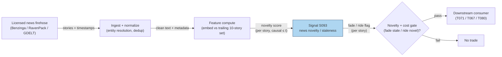

# S093 — News novelty / staleness reversal

A freshness date-stamp on price moves. Each story's *staleness* is its cosine similarity to the trailing-`10`-story centroid (Tetlock 2011) [documented]; *novelty = 1 − staleness*. Markets over-react to stale news — recycled headlines that look new to investors who never read the original — and the push reverses over the following week [documented]; markets under-react to genuinely new news (drift) [documented]. The module therefore fades large moves on low-novelty news and rides moves on high-novelty news.

> Tag law: every numeric literal in prose carries one of `[documented]
> [default] [example] [unverified] [internal-est] [measured]` (legend: Appendix
> i v1.0.0). Constants inside cited formulas inherit the formula's tag.
> Bibliographic years, volumes, pages, arXiv IDs, section numbers, rule codes (C1–C10),
> fail-safe codes (F1–F5), module IDs, and machine-parsed §0 data fields are identifiers,
> not literals, and are exempt.

## §1 Five-minute reviewer card

| Row | Value |
|---|---|
| Module | S093 — News novelty / staleness reversal, v1.1.0 |
| Edge verdict | `AFTER-COST-EDGE` (conditional) — the stale-news reversal is peer-reviewed; magnitude and after-cost tradability are implementation-specific [documented]. |
| After-cost | `BEFORE-COST` — Tetlock (2011) is an event study; the chapter claims no measured after-cost Sharpe [documented]. |
| Build cost | Tier H · `60–200` h [internal-est] · `$9,000–30,000` loaded [internal-est] (vendor-backed build ~120–180 h in that band [internal-est]) |
| Data cost | News text rights dominate: commercial licenses quote-based, thousands–tens of thousands+/yr [unverified] (indicative — no public price list found, checked 2026-09-10; verify before budgeting); research via RavenPack academic/WRDS or GDELT headlines [documented]. |
| latency_class | event / seconds-to-minutes (story arrival) |
| risk_class | medium (signal-only; fading the wrong leg is the risk) |
| Capacity | `$5–20`M/day notional [example] — event-driven, name-dependent |
| Executability | Feasible: embedding + cosine ANN is light; entity/dedup/normalization and license integration are the work [documented]. |
| Risk summary | Fading genuinely novel news (wrong leg); paraphrase evasion of TF-IDF similarity; thin-coverage false 'novel' flags; crowded fades [documented]. |
| When it dies | Thin news coverage (similarity undefined); crowded novelty factor; wire-latency regimes where your timestamp trails the market [documented]. |
| Regime gates | Machine records below (provisional IDs — pending R001–R050 annotation pass [unverified]); single source of truth for §S10 fail-safes. |
| Emits | `signal_vector` (Appendix b v1.0.0) — never orders |

**Machine-readable regime gates** (regime_ids provisional [unverified]; `direction` ∈ {amplifies, degrades, inverts}; `action` ∈ {veto, halve, double, widen_stops, pause_entry}):

```yaml
regime_gates:
  - regime_id: R-news-frenzy
    direction: degrades
    mechanism: crowded novelty factor; fade legs get front-run
    condition: crowding_proxy > 2.0 [example]
    action: halve
    min_lag: 1d [example]
    unknown_behavior: degrade-to-halve
  - regime_id: R-low-coverage
    direction: degrades
    mechanism: "|P_i| < n_prior -> similarity undefined -> no signal"
    condition: count(P_i) < 10 [documented]
    action: veto
    min_lag: 0
    unknown_behavior: veto
```

## §1.5 Cheapest / least-build path

1. **Prototype hour band:** `20–60` h [internal-est] — TF-IDF novelty on headlines + fade/ride rule — reference implementation + gates + fixture validation (full licensed-text build is Tier H).
2. **Cheapest-source row** (structured — single source of truth for the sourcing verdict):

| Field | Value |
|---|---|
| min_tier | Tier-0 research: GDELT 2.0 DOC API (`GET https://api.gdeltproject.org/api/v2/doc/doc`, keyless, free) [documented]; production min_tier: licensed full text (RavenPack News Analytics / Benzinga Newsfeed) |
| latency_class | per story arrival (event-driven) |
| required_fields | story text + event_ts (int64 ns UTC), firm entity id, trailing story set (`10` stories [documented]), dividend/split-adjusted price tape |
| price_band | research `~$0` [documented]; production license: quote-based, thousands–tens of thousands+/yr [unverified] — no public price list found (checked 2026-09-10); verify before budgeting |
| build_or_buy | **build** the novelty math; **buy** the text rights [internal-est] |
3. **Resource budget:** `4` cores, `4–16` GB RAM [internal-est]; compute pattern `per_event`.
4. **Skip list:** Sentence-transformer embeddings (TF-IDF suffices for the prototype) — phase 2; cross-source wire-speed dedup — phase 2; event-type-conditional novelty — phase 2.
5. **DO-NOT-CUT list:** causality assertions (`assert fill_event > signal_event`, no-signal-bar-fills test); COST block + callable
   `expected_cost_bps`; F1–F5 fail-safes + module-state enum; decision-log audit records; bona-fide-intent + self-trade prevention; provenance tags on
   every numeric literal; fixtures + `test_cmd`; secrets via env only.
6. **Escalation gate:** upgrade when — paraphrase rewrites slip through TF-IDF → embedding similarity; production or any redistribution → buy the license.

## §S0 Module contract

### S0.1 Typed signature

```python
def signal(state: ModuleState, events: list[Event], cfg: Config) -> SignalVector:
```

`SignalVector` per Appendix b v1.0.0. `state` is the module-owned named state
vector; `events` are canonical Events (Appendix a v1.0.0), newest last. The
function handles documented edge cases: empty events → `UNKNOWN`; invalid
prices/inputs → `UNKNOWN` (F1, never interpolate); halt/auction events → freeze
per the market-state table.

### S0.2 Config dataclass

| Parameter | Type | Default | Range | Status |
|---|---|---|---|---|
| `n_prior` | int | `10` | `>0` | calibrate |
| `stale_gate` | float | `0.5` | `0-1` | calibrate |
| `reversal_h_days` | int | `5` | `>0` | calibrate |
| `unwind_frac` | float | `0.40` | `0.05-0.80` | calibrate |
| `k_gate` | float | `0.5` | `0.10-3.00` | calibrate |

All defaults tagged per the tag law (status `default` ⇒ `[default]`, `example` ⇒ `[example]`, `calibrate` set at fit time). Calibration recipes (walk-forward) for every `calibrate` parameter live in the §S2 parameter table.

### S0.3 Canonical schema mapping

Vendor columns → canonical Event schema (Appendix a v1.0.0), stated once here:

| Source field | Canonical |
|---|---|
| story text + timestamp (vendor) | `event_ts (int64 ns UTC; ts ≤ t for the trailing set)` |
| story embedding / TF-IDF | `e_i (module feature input, normalized)` |
| trailing story set | `P_i: `10` [example] prior stories, same firm, max span `30` trading days [example] (regime-contamination guard; module feature input)` |
| price for event returns | `r_t,t+h (module feature input; dividend/split adjusted)` |
| market-state events (HALT/REOPEN/AUCTION) | module freeze per the §S0.5 market-state table; contributions across reopen discarded |

### S0.4 Time contract

> Time contract: clock domain UTC, int64 ns; authoritative causality clock =
> `event_ts`; max_skew = `1` ms [default]; jitter budget = `500` µs [default];
> bar-label = open time; staleness TTL = `3` s [default] (`3` [default]× the `1`-s reference cadence per F4); gap policy = mask, no interpolation;
> halt/auction → discard contributions across reopen.

**Timing box:** `signal@t (per_event, America/New_York) → earliest fill @open(t+1)`

### S0.5 Market-state table

| State | Module behavior |
|---|---|
| CONTINUOUS_TRADING | Compute normally; emit per cadence |
| HALTED | Freeze state; emit `UNKNOWN`; discard contributions across reopen |
| AUCTION | No new signals; hold last `SignalVector`; state `DEGRADED` |
| CLOSED | Emit nothing; state `OFF` |

### S0.6 Module-state enum + error taxonomy

States per Appendix k v1.0.0: `OK | DEGRADED | UNKNOWN | OFF`. Invalid input →
`UNKNOWN`, never interpolate (Appendix f v1.0.0, F1–F5).

| Failure | State | Alert |
|---|---|---|
| Missing/stale input (TTL `3` s [default] (`3` [default]× the `1`-s reference cadence per F4)) | `UNKNOWN` | page |
| Invalid price/input reaching module (NaN, ≤ 0, non-finite) | `UNKNOWN` | log |
| Feature out of mathematical bounds (F2) | `UNKNOWN` | page |
| `seq` gap > `1,000` events [default] | `DEGRADED` (restart windows) | log |
| Jitter > budget persistently | `DEGRADED` | notify |
| Halt/auction | `UNKNOWN` / `DEGRADED` (per table) | log |
| Kill/administrative disable | `OFF` | page |
| Anything unmapped | `UNKNOWN` | page |

### S0.7 Ops tail

- **Schedule:** continuous during US equities regular session `09:30`–`16:00` America/New_York [documented]; owner: signals on-call.
- **Health checks:** fixture replay (`test_cmd`) green on deploy; live
  `seq`-gap monitor; staleness watchdog at `3`× cadence [default].
- **Alert table:** page on `UNKNOWN` > `30` s [default] or bounds violation;
  notify on `DEGRADED`; log on single dropped events.
- **Resource budget:** `4` vCPU, `16` GB RAM [internal-est]; state is O(window) per symbol.
- **Runbook stub:** `1.` confirm feed (vendor status); `2.` replay fixture;
  `3.` if red → set `OFF`, page; `4.` reconcile decision log before re-arm.

### S0.8 Secrets (env-only)

`DATA_VENDOR_API_KEY` via environment only. No secrets in this file, fixtures, or
logs (CI secrets-grep).

### S0.9 May / must-NOT

> **May:** emit `SignalVector` records per Appendix b v1.0.0. **Must-NOT:**
> emit orders, order intents, prices, share counts, or notionals; call a
> broker; mutate shared state outside `state`; interpolate across gaps.

## §S1 Legacy (subsumed by §1)

Legacy §S1 content is the §1 reviewer card above; this header is retained so
section numbering stays intact.

## §S2 Specification

### Universe

One firm's story flow with its price tape; fixture: `12` synthetic story-events (seed `93` [example]) — E1–E10 leg/causality rows, E11 cost-gate veto, E12 invalid-input → `UNKNOWN`.

### Entry rule (Boolean — no prose-only conditions)

```
STALENESS_i := cos(e_i, cbar_i)            # cbar = trailing-n_prior-story centroid [documented]
NOVELTY_i   := 1 - STALENESS_i               # [documented]
FADE_LEG    := NOVELTY_i < stale_gate AND isfinite(day0_pct) AND day0_pct != 0 -> direction = -sign(day0_pct)  # [example] gate
RIDE_LEG    := NOVELTY_i >= stale_gate AND isfinite(day0_pct) AND day0_pct != 0 -> direction = sign(day0_pct)  # follow the drift [documented]
# No |day0_move| cutoff: economic largeness is enforced by the cost gate (§S3 step 10),
# not by an arbitrary move threshold. Sub-threshold edges emit direction 0 (C2).
```

### Exits (with post-exit cooldown)

```
EXIT := fade leg: cover over `1–5` trading days [example] as the reversal realizes; ride leg: exit on drift exhaustion or after `5` days [example]. Post-exit cooldown `5` sessions [default].
```

### Position sizing (fenced function)

```python
def size_shares(risk_budget_R, stop_distance, vol_estimate, ADV_cap, cost):
    # S-module requests capital fraction only; share math lives in the strategy.
    # Reference: capital = 0.5 * confidence  (confidence in [0,1])  [default]
    risk_notional = risk_budget_R * 0.5 * confidence          # [default] 0.5 factor
    shares = risk_notional / max(stop_distance, 1e-9)
    return int(min(shares, ADV_cap * adv_shares * 0.001))     # 0.1% ADV cap [default]
```

### Risk limits

| Limit | Value |
|---|---|
| Max capital fraction per signal | `0.5` [default] |
| Max adverse excursion before `UNKNOWN` review | `2.0`× stop [default] |
| Staleness kill | TTL `3` s [default] (`3` [default]× the `1`-s reference cadence per F4) → `UNKNOWN` |
| Minimum comparison set | `10` stories [documented]; fewer → no signal, never a noisy score |

### COST block (single source of truth)

| Component | Value (bps) | Tag | Basis |
|---|---|---|---|
| Spread | `2.0` | [example] | event-day taker spread, liquid large-cap |
| Fees | `1.0` | [example] | XNAS taker schedule; `fee_schedule_as_of`: `2026-09-01` [unverified] — placeholder; pin the real venue schedule before production |
| Borrow | `1.25` | [example] | `borrow_bps_per_day` = `0.25` [example] × `5` d holding [example]; **reason:** the fade leg shorts positive day-0 moves, so the short leg pays borrow every day it is held |
| Market impact/slippage | `3.0` | [example] | 1–5-day fade execution at small participation |
| **Total reference** | `7.25` | [example] | matches the fixture `cost_bps=7.25`; maker entry variant `6.25` [example] |

`fee_schedule_as_of`: `2026-09-01` [unverified] — placeholder; pin the real venue schedule before production. `side`: `mixed` [example] (entry taker, unwind maker); venue/tier/source: XNAS [example]. Re-stating cost numbers outside this block is a validation failure.

```python
def expected_cost_bps(notional, adv_pct, venue, side, urgency) -> float:
    # Callable cost model - 1-5-day event stack. Mirrors the COST table above exactly.
    spread_bps = 2.0              # [example]
    fee_bps = 1.0                 # [example]
    borrow_bps_per_day = 0.25     # [example]; reason: fade leg shorts positive day-0 moves
    h_days = 5                    # [example]; reversal_h_days default
    borrow_bps = borrow_bps_per_day * h_days
    impact_bps = 3.0              # [example] 1-5-day fade execution at small participation
    total = spread_bps + fee_bps + borrow_bps + impact_bps
    if side == "maker":
        total = 0.5 * spread_bps + fee_bps + borrow_bps + impact_bps  # [example] maker concession
    return total  # 7.25 bps taker [example]
```

### Execution / fill model table

| Aspect | Assumption |
|---|---|
| Latency | novelty computed at story arrival; tradable no earlier than the first honest quote after t+1 [documented] |
| Participation | small — fade capacity per name is thin [example] |
| Partial fills | assume partial fills on fast reversals [example] |
| Adverse fill | fading genuinely novel news — the wrong-leg mode [documented] |

### Robustness

High sensitivity to the similarity measure: TF-IDF misses paraphrase (stale rewrites slip through) — embedding-based similarity is the documented mitigation [documented]. The staleness gate `0.5` [example] is a screening choice, not a standard.

### Compliance sub-block (C1–C10+)

| Code | Rule: trigger → check → action → log |
|---|---|
| C1 | Self-match prevention: S093 emits no orders; downstream T-modules must set self-trade-prevention flags — S093 asserts the requirement in its `consumes` contract: trigger → check → action → log record |
| C2 | Bona-fide intent: every emitted `SignalVector` with |direction|=`1` must pass the cost gate; sub-threshold scores emit direction `0`, never a tradeable hint: trigger → check → action → log record |
| C3 | Message-rate: `≤100` emissions/symbol/s [default]; breach → throttle to `1`/s [default] + alert: trigger → check → action → log record |
| C4 | Fat-finger trio (applied by consumers; this module bounds its own outputs): confidence ∈ [`0`,`1`], capital ∈ [`0`,`0.5`], computed_at sane — out-of-bounds → `UNKNOWN` (F2): trigger → check → action → log record |
| C5 | Decision log: every emission, veto, and state transition logged per Appendix g v1.0.0, hash-chained: trigger → check → action → log record |
| C6 | Halt/auction: per §S0.5 market-state table; contributions across reopen discarded: trigger → check → action → log record |
| C7 | Locate check: SHORT direction requires `locate_ok` from the consumer; this module never emits SHORT without the consumer asserting locate (Reg-SHO threshold securities → direction `0`): trigger → check → action → log record |
| C8 | Public dissemination: no signal values published externally without review gate: trigger → check → action → log record |
| C9 | Data entitlements: per §S6 Data rights row; entitlement-class change → §1.5 escalation gate: trigger → check → action → log record |
| C10 | Post-exit cooldown: `5` sessions [default] (the reversal horizon) after a faded event; no re-fade of the same story arc: trigger → check → action → log record |

### Parameter table

| Parameter | Symbol | Value | Tag | Sensitivity | Calibration grid [example] |
|---|---|---|---|---|---|
| Comparison set | ``n_prior`` | `10 stories` | calibrate | high — small: false novel; large: regime contamination | `{5, 10, 20, 30}` |
| Staleness gate | ``τ`` / `stale_gate` | `0.5` | calibrate | high — tight: fades real news; loose: fades nothing | `{0.3, 0.4, 0.5, 0.6, 0.7}` |
| Reversal horizon | ``h`` | `5 days` | calibrate | medium — small: misses weekly reversal; large: drift noise | `{1, 3, 5, 10}` |
| Unwind fraction | ``ω`` / `unwind_frac` | `0.40` | calibrate | medium — scales the illustrative edge fed to the cost gate | `{0.2, 0.3, 0.4, 0.5, 0.6}` |
| Cost-gate multiple | ``k`` / `k_gate` | `0.5` | calibrate | high — sets the fee-covering bar on every emission | `{0.25, 0.5, 1.0, 2.0}` |

**Calibration recipe (walk-forward, per parameter):**
- **Fold design:** expanding training window / `1`-year validation / `1`-year OOS test; folds advance `1` year [example]. Comparison sets `P_i` are recomputed per fold — no story crosses a fold boundary.
- **Embargo:** `reversal_h_days + 5` trading days [example] between train and validation, validation and test — no event's reversal window leaks into the next fold's comparison set.
- **Selection metric:** after-cost **net bps per event** plus DSR on the validation fold; min OOS events `500` [example]; require positive net-bps on both validation and OOS before promotion.
- **Freeze rule:** argmax validation net-bps locks params for the OOS year; `k_gate` frozen at `0.5` [default] unless validation shows the gate blocking > `80`% [default] of positive-edge events; refit annually [default].

### Timing box

`signal@t (per_event, America/New_York) → earliest fill @open(t+1)`

## §S3 Math + normative pseudocode

Story i has embedding (or TF-IDF vector) `e_i`; the comparison set `P_i` is the previous `n_prior` (`10` [documented] per Tetlock 2011) stories about the same firm. Staleness is the cosine to the trailing centroid `cbar_i = (1/|P_i|)*SUM_{j in P_i} e_j`; novelty is its complement: `Novelty_i = 1 - cos(e_i, cbar_i)` [documented]. Fade leg: `Novelty_i < stale_gate` [example] → trade against the day-0 move (stale overreaction reverses over the following week [documented]); ride leg: high novelty → trade with the move (under-reaction drift [documented]).

**Normative pseudocode** (pseudocode is normative; prose is commentary). Every variable is bound; every guard is inline:

```
# --- inputs (all bound at call time) ---
story_i      : canonical Event {event_ts: int64 ns UTC, text_i: str, firm_i: entity id}
P_i          : list of prior story Events for firm_i, each with event_ts <= signal_ts and
               (signal_ts - event_ts) <= max_window_ns   # max span 30 trading days [example]
prices_i     : {open_t, close_t} dividend/split-adjusted floats
cfg          : Config {n_prior=10, stale_gate=0.5, reversal_h_days=5, unwind_frac=0.40, k_gate=0.5}  # defaults [example]
notional     : float; adv_pct : float; venue : str; side : {taker, maker, mixed}; urgency : str
market_state : one of CONTINUOUS_TRADING | HALTED | AUCTION | CLOSED
state        : module state vector {last: SignalVector | None, cooldown_until: dict[arc_id, ts]}
arc_id       : story-arc identifier for the C10 cooldown
locate_ok    : bool, asserted by the consumer before any short leg (C7)

# --- guards: halt / staleness / locate (F1, F3, F4) ---
if market_state in {HALTED, CLOSED}:              # halt/auction state machine (section S0.5)
    module_state <- UNKNOWN; emit nothing; STOP    # freeze; discard contributions across reopen
if market_state == AUCTION:
    module_state <- DEGRADED; emit state.last unchanged; STOP
if (now_ns - feature_asof_ns) > 3_000_000_000:    # staleness TTL 3 s [default]
    module_state <- UNKNOWN; STOP                 # never interpolate (F1)
if |P_i| < cfg.n_prior:                             # min comparison set [documented]: thin coverage
    module_state <- UNKNOWN; STOP                  # no signal, never a noisy score
for each j in P_i:
    assert event_ts_j <= signal_ts                 # causality: no future story in the comparison set (F3)

# --- features ---
e_i          <- embed(text_i)                      # normalized; embed() is the cfg-frozen encoder
cbar_i       <- (1/|P_i|) * sum_{j in P_i} embed(text_j)
staleness_i  <- cos(e_i, cbar_i)
if not (0.0 <= staleness_i <= 1.0): module_state <- UNKNOWN; STOP   # F2: feature out of math bounds
novelty_i    <- 1.0 - staleness_i                  # [documented]
day0_pct     <- 100 * (close_t - open_t) / open_t
if (not isfinite(day0_pct)) or day0_pct == 0.0:
    module_state <- UNKNOWN; STOP                  # F1: invalid price input

# --- legs ---
if novelty_i < cfg.stale_gate:                     # stale gate [example]
    leg <- "fade"; direction <- -sign(day0_pct)    # fade the overreaction [documented]
else:
    leg <- "ride"; direction <-  sign(day0_pct)    # ride the drift [documented]
if arc_id in state.cooldown_until and signal_ts < state.cooldown_until[arc_id]:
    direction <- 0                                 # C10: no re-fade of the same story arc
if direction < 0 and not locate_ok:
    direction <- 0                                 # C7: Reg-SHO locate; consumer asserts locate_ok

# --- edge and executable cost gate ---
edge_bps <- abs(day0_pct) * 100.0 * cfg.unwind_frac   # illustrative per-event bps [example]
cost_bps <- expected_cost_bps(notional, adv_pct, venue, side, urgency)  # S2 COST block
gate_pass <- cost_bps <= cfg.k_gate * edge_bps        # executable predicate (k = 0.5 [default])
if not gate_pass or direction == 0:
    direction <- 0; confidence <- 0.0; capital <- 0.0  # veto (C2 cost gate / C7 locate / C10 cooldown): never a tradeable hint
else:
    confidence <- min(1.0, 2.0 * abs(novelty_i - cfg.stale_gate))
    capital    <- 0.5 * confidence                    # [default] cap

# --- causality pin: t -> t+1, no signal-bar fills ---
signal_event <- signal_ts
fill_event   <- first canonical Event with ts > signal_ts
assert fill_event > signal_event

# --- cooldown (C10) ---
if leg == "fade" and direction != 0:
    cooldown_until[arc_id] <- signal_ts + 5 sessions [default]  # no re-fade of the same story arc; armed only on live signals

emit SignalVector{direction, confidence, capital, computed_at=signal_ts, module_state}
state.last <- emitted vector
```

Causality: the computation at `t` uses only data `<= t`; earliest reaction is
`t+1`. Mandatory unit test: no-signal-bar fills.

**Fixture note:** `modules/fixtures/S093_tape.csv` stores hand-fixed novelty/day-0
values (not raw text) so the tape is a `validation-run` of the leg/cost-gate/causality
logic; end-to-end text→embedding→centroid is covered by the E6/E1 centroid hand-check in §S4.
## §S4 Worked example (fixture-backed)

- Fixture: `12` synthetic story-events (seed `93` [example]); tape `modules/fixtures/S093_tape.csv` (`# TYPE: validation-run`).
- Hand-computed centroid check: trailing-10 centroid cbar=[0.60,0.20,0.10,0.40,0.30,0.20]; stale story cos=**0.8452** → novelty **0.15** [example]; merger-rumor story cos=**0.1195** → novelty **0.88** [example].
- E6: novelty **0.10** → stale → fade the −3.58% day-0 move → long (+1), edge **143.2** bps [example]; E1: novelty **0.97** → novel → ride the −1.64% move → short (−1) [example].
- E11 (cost-gate veto path): novelty **0.40** → stale → fade a +0.05% day-0 move → edge **2.0** bps [example]; `7.25 <= 0.5 * 2.0` fails → direction **0**, confidence **0.0**, `gate_pass=0` — the veto emits no tradeable hint (C2) [measured].
- E12 (invalid input path): novelty NaN → F1 → `module_state=UNKNOWN`, direction **0**, no fill scheduled, never interpolated [measured].
- Reversal concentrates in low-novelty events (E6/E4/E10 unwind `33–46`% of the day-0 move) [example]; `assert fill_event > signal_event` holds on every row [measured].
- Where the example is optimistic: reversal magnitude is assumed by construction, not discovered; no fees beyond the `7.25` bps stack, no timestamp uncertainty, novelty scores drawn not embedded [example].

## §S5 Strategies that use this signal

Generated from `deps.yaml` (CI symmetry); hand-listed here for this module:

| Strategy | Role |
|---|---|
| T071 — News-Novelty Reversal | primary trigger: fades stale-news overreaction (S093 is the gate), follows novel-news drift |
| T060 — Identified-News Drift Portfolio | filter: novelty separates ride-the-drift stories from no-news drift to fade |
| T067 — Anchored-VWAP Event Trader | context: novelty decides whether to trade the deviation as drift or fade |
| T080 — Multi-Source Attention Composite | input: novelty is one of three blended attention factors |

## §S6 Data required

| Field | Type | Granularity | Source tier | Notes |
|---|---|---|---|---|
| Story text + timestamp | text + UTC ts | per story | Tier 3 / Tier 0 | licensed full text for production; GDELT/RSS headlines for research |
| Firm entity mapping | reference | per story | Tier 1–2 | ticker↔entity resolution; renames/spin-offs |
| Trailing story set | derived | per story | computed | `10` stories [documented] or `30`-trading-day max span [example] |
| Embeddings | vector | per story | computed | TF-IDF or sentence-transformer; store normalized |
| Price/quote for event returns | numeric | `1`-min [documented] or daily | Tier 0–1 | dividend/split adjusted |

**Concrete vendor specs** (research, not production pins):

| Vendor | Product | Access | Required fields (mapped in §S0.3) | Price band (as-of `2026-09-10`) |
|---|---|---|---|---|
| GDELT Project | DOC 2.0 API | `GET https://api.gdeltproject.org/api/v2/doc/doc` — keyless, free [unverified] | `title`, `url`, `seendate` (UTC instant), `domain`, `language` [unverified] | `~$0` [unverified] — research/headline tier only; no full text |
| Benzinga | Newsfeed stream v1 | WebSocket/REST — docs URL independently cited by third-party repos [documented]; endpoint liveness not verified from this environment [unverified] | `id`, `action`, `timestamp`, `content.title/body/teaser`, `content.securities[].symbol`, `created_at/updated_at` [documented] | retail Pro `~$37–197`/mo per third-party review (luxalgo.com), not the vendor page [unverified]; enterprise API license is quote-based [unverified] |
| RavenPack | News Analytics (schema v4) | REST API; academic access via WRDS | story text, `TIMESTAMP_UTC`, entity mapping, `RP_STORY_ID`, relevance/news-type analytics fields | commercial quote-based, thousands–tens of thousands+/yr [unverified] — verify before budgeting |

**Data rights row** (Appendix j v1.0.0): News text: licensed (RavenPack/Benzinga) — scraping is not a substitute for a license [documented]; novelty code: own research IP. GDELT redistribution terms not verified against the license — confirm before derived-product use [unverified].

## §S7 Local build (M5 Max / 128 GB)

Feasibility: feasible — Tier H, but the binding constraint is data licensing, not the Mac. Licensed alt-data pipelines sit in Tier H (`60–200` h ≈ `$9,000–30,000` at $150/hr loaded [internal-est]); a vendor-backed news+novelty build is ~`120–180` h in that band [internal-est]. Embedding inference is CPU-light; RAM `4–16` GB for text + embeddings [internal-est] — inside the ~`77` GB budget. What breaks first at `500` symbols: full-text archival and license cost [documented].

## §S8 Buy vs build

Buy the text rights, build the analytics. The novelty formula is an afternoon; lawful, timestamped, entity-resolved full text at scale is the product you cannot build. The moment the pipeline feeds production signals or any redistribution, buy the license (Benzinga quote-based or RavenPack) [documented].

## §S9 Efficacy — documented evidence

| Study / source | Market & period | Metric | Before/after cost | Caveat |
|---|---|---|---|---|
| Tetlock (2011), RFS 24(5) | US stocks, DJNS news archive | returns respond less to stale news; day-of-stale-news return negatively predicts the following week's return; reversal concentrated in high-media-coverage names: cumulative `28` bps over `4` days (t=`3.39` [documented]); no significant reversal in the lowest-coverage quartile; high-minus-low difference `31` bps, significant at `1`% [documented] | `BEFORE-COST` (event study) | magnitude conditional on the staleness measure; individual-investor channel |
| Chan (2003), JFE 70 | US stocks, headlines | drift after news headlines; reversal after no-news price moves [documented] | `BEFORE-COST` | supports the under-react/over-react asymmetry behind S093 |
| Tetlock, Saar-Tsechansky & Macskassy (2008), JF 63 | US stocks, WSJ | negative language in firm news predicts fundamentals and returns [documented] | `BEFORE-COST` | sentiment leg, not novelty — anchors the news family |
| FININ (Wang, Cohen & Ma 2024), Findings of EMNLP | 2.7M articles, S&P 500 + Nasdaq 100 | news interactions and delayed pricing; daily Sharpe improvement `0.429`/`0.341` vs baselines [documented]; sentiment alone leaves power on the table [documented] | `BEFORE-COST` (model) | supports interaction/propagation features beyond bag-of-words |

Selection disclosure: these are the sources surfaced by the chapter's research pass. Fails in: thin-coverage names, crowded novelty factors, wire-latency regimes, event-type misclassification. **Honest bottom line:** as a standalone trigger this is a documented-association, conditional edge — the reversal is peer-reviewed but magnitude and after-cost tradability are implementation-specific; as a filter/gate inside T071/T067/T080 it is the most defensible use [documented].

## §S10 Failure modes & pitfalls

| # | Trigger → Detect → Action → Recovery | check: |
|---|---|
| 1 | Lookahead leakage → future stories in the comparison set [documented] → comparison set strictly ts ≤ t; store source latency → backtest fantasy | `check: max comparison ts <= t` |
| 2 | Paraphrase evasion → TF-IDF misses rewrites [documented] → embedding-based similarity → stale rewrites slip through | `check: similarity == embedding-based` |
| 3 | Entity mismatch → story about the wrong firm [documented] → audited ticker↔entity mapping → wrong-firm signals | `check: entity resolution audit` |
| 4 | Timestamp uncertainty → story ts vs market ts [documented] → tradable no earlier than the first honest quote after t+1 → fills at fantasy prices | `check: fill_event > signal_event` |
| 5 | Thin news → fewer than 10 prior stories [documented] → minimum-set-size rule; no-signal → noisy false 'novel' | `check: |P_i| >= 10 else no signal` |
| 6 | Cost blowup → spread+fees+slippage on 1–5-day fades [documented] → model effective spread explicitly → negative net | `check: cost gate on every emission` |
| 7 | Crowded fade → everyone shorts the same stale spike [documented] → monitor crowding proxies → reversal front-run | `check: crowding proxy` |
| 8 | Event-type confusion → novel detail inside an old story arc [documented] → event-type-conditional novelty → fading real news | `check: event-type audit on largest signals` |

## §S11 Visuals

`../../images/S093_example.png` — synthetic worked-example chart (seed `93` [example]).



## §S12 Source log + unverified leads

**Sources** (citable facts only):

1. Tetlock, Paul C. (2011). 'All the News That's Fit to Reprint: Do Investors React to Stale Information?' Review of Financial Studies 24(5): 1481–1512. https://ideas.repec.org/a/oup/rfinst/v24y2011i5p1481-1512.html (DOI 10.1093/rfs/hhq141)
2. Tetlock, Paul C. (2010). 'All the News That's Fit to Reprint' — working-paper version (Oct 2010), Columbia. https://business.columbia.edu/sites/default/files-efs/pubfiles/3099/Tetlock%20Fit%20to%20Reprint%2010%2010.pdf
3. Chan, W. S. (2003). 'Stock price reaction to news and no-news: Drift and reversal after headlines.' Journal of Financial Economics 70: 223–260.
4. Tetlock, Paul C., Saar-Tsechansky, Maytal & Macskassy, Sofus (2008). 'More Than Words: Quantifying Language to Measure Firms' Fundamentals.' Journal of Finance 63: 1437–1467.
5. Wang, Mengyu, Cohen, Shay B. & Ma, Tiejun (2024). 'Modeling News Interactions and Influence for Financial Market Prediction.' Findings of EMNLP 2024. https://aclanthology.org/2024.findings-emnlp.189/

**Chatbot source log.** Duck.ai answered Q-SB10-1–Q-SB10-3 (2026-09-10) [measured]; Grok/Cursor answers pending (checked 2026-09-10).

**Verification notes (2026-09-10 web pass [measured]):**
- Tetlock (2011) citation verified via RePEc/OUP record: RFS 24(5) 1481–1512, DOI 10.1093/rfs/hhq141; abstract confirms staleness defined as "textual similarity to the previous ten stories about the same firm" — matches the `n_prior=10` comparison set [documented].
- FININ (Wang, Cohen & Ma 2024) ACL Anthology page verified: 2.7M articles, S&P 500 + Nasdaq 100, `15`-year window; daily Sharpe improvement `0.429`/`0.341` vs baselines; DOI 10.18653/v1/2024.findings-emnlp.189 [documented].
- Benzinga Newsfeed stream v1 docs URL `https://docs.benzinga.com/benzinga-apis/newsfeed-stream-v1/get-stream` confirmed via independent third-party citations (Benzinga's `doc-site-mintlify` repo and a community websocket-service repo both reference it) [documented]; docs.benzinga.com itself was unreachable from this review environment (policy block), so endpoint liveness stays [unverified] until opened from a browser session.
- Benzinga retail Pro pricing `~$37–197`/mo comes from a third-party review (luxalgo.com), not the vendor pricing page — treat as [unverified]; enterprise API pricing is quote-based via licensing@benzinga.com with no public price list found [unverified].
- GDELT DOC 2.0 endpoint `GET https://api.gdeltproject.org/api/v2/doc/doc` was not independently verified in this pass [unverified]; confirm keyless access and redistribution terms before building on it.
- RavenPack News Analytics commercial pricing: web search returned no public price list (search conflated with the unrelated "Raven Tools" SEO product); remains [unverified].

**Unverified leads** (chatbot-only or unverified web claims — never in evidence tables):

- Duck.ai Q-SB10 batch QA: nearest-prior (max-similarity) novelty variant — demoted to a variant; the chapter's primary formula is the centroid form [unverified].
- Duck.ai Q-SB10 batch QA: vendor pricing specifics (Benzinga quote-based; RavenPack commercial thousands–tens of thousands+/yr) — bot-sourced, unverified; web search 2026-09-10 confirmed no public price list exists; verify before budgeting [unverified].
- Fee schedule `2026-09-01` in the COST block is a placeholder; pin the real XNAS taker schedule before production [unverified].
- Regime IDs `R-news-frenzy` / `R-low-coverage` are provisional pending the R001–R050 annotation pass [unverified].

---

## Appendix — AI build prompt (S093)

Copy-paste into any chat agent:

> Build module **S093 — News novelty / staleness reversal** per `notes/module-template.md` v1.0.0 and this file's §S0 contract (module version v1.1.0).
> Cheapest path (§1.5): prototype `20–60` h [internal-est] — TF-IDF novelty on headlines + fade/ride rule; compute pattern `per_event`. Cheapest data: GDELT 2.0 DOC API `GET https://api.gdeltproject.org/api/v2/doc/doc` (keyless, free) [documented].
> Implement `signal(state, events, cfg) -> SignalVector` (Appendix b v1.0.0)
> with the §S3 normative pseudocode, including all guards (halt/auction/staleness/locate),
> the cost-gate predicate `expected_cost_bps(...) <= k_gate * edge_bps` (k = `0.5` [default]),
> gate-veto semantics (fail → direction `0`, confidence `0.0`), and
> `assert fill_event > signal_event`. Wire F1–F5 (Appendix f v1.0.0): invalid input →
> `UNKNOWN`, never interpolate. Log decisions per Appendix g v1.0.0. Secrets via env
> only. Run the fixture `modules/fixtures/S093_tape.csv`
> (`# TYPE: validation-run`, `12` rows incl. veto and invalid-input rows) against
> `modules/fixtures/S093_expected.csv` (tolerance `1e-9` [default]); expected `cost_bps` =
> `7.25` taker [example] from the §S2 COST block.
> **Definition of done:** `python3 -m pytest modules/tests/test_S093.py -q`
> exits `0`. Tag every numeric literal you add with the unified enum
> (Appendix i v1.0.0); put anything unverifiable in §S12 unverified leads.
