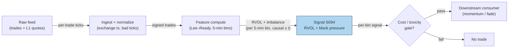

# S094 — Unusual intraday volume (RVOL) & signed block-trade pressure

Volume vs its own time-of-day history (RVOL) plus the buy/sell imbalance of large block prints. RVOL answers 'is anyone here?' — abnormal participation vs the same time-of-day history; signed blocks answer 'which way are they going?' — volume without direction is noise [documented]. The edge is in the combination: participation confirms the move is institutional, the sign gives the direction, and the fade comes when the imbalance mean-reverts. The RVOL/block-imbalance composite is practitioner-standard reconstruction; the Lee–Ready signing step is documented within it.

> Tag law: every numeric literal in prose carries one of `[documented]
> [default] [example] [unverified] [internal-est] [measured]` (legend: Appendix
> i v1.0.0). Constants inside cited formulas inherit the formula's tag.
> Bibliographic years, volumes, pages, arXiv IDs, section numbers, rule codes (C1–C10),
> fail-safe codes (F1–F5), module IDs, and machine-parsed §0 data fields are identifiers,
> not literals, and are exempt.

## §1 Five-minute reviewer card

| Row | Value |
|---|---|
| Module | S094 — Unusual intraday volume (RVOL) & signed block-trade pressure, v1.1.0 |
| Edge verdict | `PREDICTIVE-FEATURE-ONLY` as a standalone trigger (volume alone is noise); `AFTER-COST-EDGE` (conditional) as a confirmation/gating filter — one of the most-used tools in the intraday stack [documented]. |
| After-cost | `COMM-ONLY` — the chapter's sketch nets `$50` costs on `$700` gross (+$650 net [example]); no production after-cost figure is claimed. |
| Build cost | Tier M · `20–60` h [internal-est] · `$3,000–9,000` loaded [internal-est] |
| Data cost | Databento Standard ~`$199`/mo [documented] (incl. 12 mo L1 history; checked 2026-09-10); Alpaca Basic free (IEX real-time) / Algo Trader Plus `$99`/mo (full SIP) [documented] (checked 2026-09-10); direct Tier-1 consolidated ~`$30–200`/mo [unverified] (indicative — verify before budgeting). |
| latency_class | per_bar / 5-minute bins [documented] |
| risk_class | medium (signal-only; chasing blocks pays their impact) |
| Capacity | `$10–50`M/day notional [example] — block-following capacity per name |
| Executability | Feasible: polars join_asof for Lee–Ready quote matching runs ~1–10M rows/sec [documented]. |
| Risk summary | Volume without direction; mechanical (op-ex/rebalance) volume; stale-quote signing errors; chasing blocks pays their impact [documented]. |
| When it dies | Expiration/rebalance days; retail-driven spikes; low-float gaps; volatility shocks widening spreads past the drift [documented]. |
| Regime gates | Machine records in §S10: `R-EXPIRY` → veto · `R-VOLSHOCK` → pause_entry · `R-HALT` → veto (restrictive defaults; regime_ids provisional) [example]. |
| Emits | `signal_vector` (Appendix b v1.0.0) — never orders |

## §1.5 Cheapest / least-build path

1. **Prototype hour band:** `20–60` h [internal-est] — RVOL ratios + Lee–Ready signing + block imbalance — reference implementation + gates + fixture validation.
2. **Cheapest-source row (structured):**
   - `min_tier`: research = Alpaca **Basic** (IEX real-time tick feed, free; 15-min-delayed SIP history) [documented]; production = Alpaca **Algo Trader Plus** (`$99`/mo, full SIP consolidated) [documented] or Databento **Standard** (`$199`/mo, unlimited live + 12 mo L1 history) [documented] — all prices checked 2026-09-10.
   - `latency_class`: `per_bar` / 5-min bins (end-of-bin compute; free-tier research tolerates the 15-min historical delay) [documented].
   - `required_fields`: trades (`price`, `size`, `ts_event` ns); quotes (`bid`, `ask`, `ts_event` ns); 1-min bars (`open, high, low, close, volume`) for RVOL baselines [documented].
   - `price_band`: research ~`$0`; production `$99–199`/mo [documented]; direct Tier-1 consolidated ~`$30–200`/mo [unverified] (indicative — verify before budgeting).
   - `build_or_buy`: **build** — RVOL is a ratio and Lee–Ready is public-domain arithmetic on your own bars and trades; spend on the cleanest trade/quote feed you can afford [internal-est].
3. **Resource budget:** `2` cores, `4` GB RAM [internal-est]; compute pattern `per_bar`.
4. **Skip list:** Full-depth L2 signing — phase 2; bulk volume classification (BVC) robustness check — phase 2; session-cumulative RVOL variant — phase 2.
5. **DO-NOT-CUT list:** causality assertions (`assert fill_event > signal_event`, no-signal-bar-fills test); COST block + callable
   `expected_cost_bps`; F1–F5 fail-safes + module-state enum; decision-log audit records; bona-fide-intent + self-trade prevention; provenance tags on
   every numeric literal; fixtures + `test_cmd`; secrets via env only.
6. **Escalation gate:** upgrade when — signing accuracy degrades (stale quotes) → lagged-midquote audit + BVC check; `500`-symbol [example] universe → build baselines from 1-min bars, not raw ticks.

## §S0 Module contract

### S0.1 Typed signature

```python
def signal(state: ModuleState, events: list[Event], cfg: Config) -> SignalVector:
```

`SignalVector` per Appendix b v1.0.0. `state` is the module-owned named state
vector; `events` are canonical Events (Appendix a v1.0.0), newest last. The
function handles documented edge cases: empty events → `UNKNOWN`; invalid
prices/inputs → `UNKNOWN` (F1, never interpolate); halt/auction events → freeze
per the market-state table.

### S0.2 Config dataclass

| Parameter | Type | Default | Range | Status |
|---|---|---|---|---|
| `baseline_days` | int | `20` | `>0` | calibrate |
| `bin_minutes` | int | `5` | `>0` | [example] (structural — changing it rebuilds baselines) |
| `rvol_trigger` | float | `2.0` | `>1` | calibrate |
| `block_shares` | int | `10000` | `>0` | calibrate |
| `imb_window_min` | int | `15` | `>0` | calibrate |
| `expected_drift_bps` | float | `15.0` | `>0` | calibrate (ex-ante per-signal drift feeding the cost gate) |
| `k` | float | `0.5` | `(0, 2]` | [default] |
| `cooldown_min` | int | `30` | `>=0` | [default] |
| `staleness_ttl_s` | int | `900` | `>0` | [default] (`3`× the `5`-min reference cadence per F4) |

All defaults tagged per the tag law (status `default` ⇒ `[default]`, `example` ⇒ `[example]`, `calibrate` set at fit time).

### S0.2.1 Calibration recipe (walk-forward OOS)

Fittable parameters are calibrated on gated-signal bins only (never on pooled train+OOS).

- **Universe:** liquid US equities, top `500` by dollar volume [example]; per-symbol folds to avoid cross-sectional leakage from common factor days.
- **Fold design:** `6`-month train / `3`-month OOS, rolling with a `3`-month step [example]; embargo = `5` trading days [example] between train end and OOS start (covers the baseline window's autocorrelation tail).
- **Per-parameter grids [example]:** `baseline_days ∈ {10, 20, 30, 60}` · `rvol_trigger ∈ {1.5, 2.0, 2.5, 3.0, 4.0}` · `block_shares ∈ {5_000, 10_000, 25_000, 50_000}` · `imb_window_min ∈ {5, 15, 30}` · `expected_drift_bps ∈ {5, 10, 15, 25}` (sensitivity; the operational value is the OOS mean net drift per gated bin).
- **Selection metric:** OOS mean net drift per cost-gated signal bin, bps, `COMM-ONLY`, minimum `200` gated bins per fold [example]; ties broken toward the higher gated-bin count (capacity proxy).
- **Freeze rule:** freeze the grid point when its OOS metric is within `1` pooled standard deviation of the argmax across `2` consecutive folds [example]; otherwise expand the grid one ring outward and refit. Never select on train, never pool train+OOS.
- **Recalibration cadence:** quarterly, or when the signing-accuracy audit (§S0.7) degrades [example].

### S0.3 Canonical schema mapping

Vendor columns → canonical Event schema (Appendix a v1.0.0), stated once here:

| Source field | Canonical |
|---|---|
| tick trade (price, size, exchange ts) | `event_ts (int64 ns UTC) + price/size` |
| L1 bid/ask (lagged `5` s [documented]) | `mid_lagged (module feature input; the Lee–Ready quote test)` |
| `1`-min OHLCV bars [documented] | `baseline volume per time-of-day bin` |
| corporate actions / halts | `split adjustments; halts excluded from baselines` |

### S0.4 Time contract

> Time contract: clock domain UTC, int64 ns; authoritative causality clock =
> `event_ts`; max_skew = `1` ms [default]; jitter budget = `500` µs [default];
> bar-label = open time; staleness TTL = `15` min [default] (`3`× the `5`-min reference cadence per F4); gap policy = mask, no interpolation;
> halt/auction → discard contributions across reopen.

**Timing box:** `signal@t (per_bar, America/New_York) → earliest fill @open(t+1)`

### S0.5 Market-state table

| State | Module behavior |
|---|---|
| CONTINUOUS_TRADING | Compute normally; emit per cadence |
| HALTED | Freeze state; emit `UNKNOWN`; discard contributions across reopen |
| AUCTION | No new signals; hold last `SignalVector`; state `DEGRADED` |
| CLOSED | Emit nothing; state `OFF` |

### S0.6 Module-state enum + error taxonomy

States per Appendix k v1.0.0: `OK | DEGRADED | UNKNOWN | OFF`. Invalid input →
`UNKNOWN`, never interpolate (Appendix f v1.0.0, F1–F5).

| Failure | State | Alert |
|---|---|---|
| Missing/stale input (TTL `15` min [default] (`3`× the `5`-min reference cadence per F4)) | `UNKNOWN` | page |
| Invalid price/input reaching module (NaN, ≤ 0, non-finite) | `UNKNOWN` | log |
| Feature out of mathematical bounds (F2) | `UNKNOWN` | page |
| `seq` gap > `1,000` events [default] | `DEGRADED` (restart windows) | log |
| Jitter > budget persistently | `DEGRADED` | notify |
| Halt/auction | `UNKNOWN` / `DEGRADED` (per table) | log |
| Kill/administrative disable | `OFF` | page |
| Anything unmapped | `UNKNOWN` | page |

### S0.7 Ops tail

- **Schedule:** continuous during US equities regular session `09:30`–`16:00` America/New_York [documented]; owner: signals on-call.
- **Health checks:** fixture replay (`test_cmd`) green on deploy; live
  `seq`-gap monitor; staleness watchdog at `3`× cadence [default].
- **Alert table:** page on `UNKNOWN` > `5` min [default] or bounds violation;
  notify on `DEGRADED`; log on single dropped events.
- **Resource budget:** `2` vCPU, `4` GB RAM [internal-est]; state is O(window) per symbol.
- **Runbook stub:** `1.` confirm feed (vendor status); `2.` replay fixture;
  `3.` if red → set `OFF`, page; `4.` reconcile decision log before re-arm.

### S0.8 Secrets (env-only)

`DATA_VENDOR_API_KEY` via environment only. No secrets in this file, fixtures, or
logs (CI secrets-grep).

### S0.9 May / must-NOT

> **May:** emit `SignalVector` records per Appendix b v1.0.0. **Must-NOT:**
> emit orders, order intents, prices, share counts, or notionals; call a
> broker; mutate shared state outside `state`; interpolate across gaps.

## §S1 Legacy (subsumed by §1)

Legacy §S1 content is the §1 reviewer card above; this header is retained so
section numbering stays intact.

## §S2 Specification

### Universe

One symbol's intraday tape; fixture: `12` synthetic 5-min bins, 9:30–10:30 (seed `94094` [example]).

### Entry rule (Boolean — no prose-only conditions)

```
RVOL(b)    := V_b / mean(V_b over N=20 completed days, same time-of-day bin, today excluded)  # [documented]
SIGN(p)    := Lee-Ready: quote test vs 5-s-lagged mid; tick test resolves midquote prints [documented]
             (+1 if p.price > mid_lag; -1 if p.price < mid_lag;
              else +1/-1 by tick vs previous trade price; zero tick inherits previous sign)
BLOCKS(b)  := trades in bin b with size >= block_shares (= 10,000 shares)                     # calibrate
TOT(b)     := buy_vol(BLOCKS) + sell_vol(BLOCKS)   # shares
BLOCKIMB   := (BuyVol_blocks - SellVol_blocks) / TOT in [-1,+1]; undefined when TOT = 0
TRIGGER    := RVOL > rvol_trigger AND TOT >= block_shares AND BLOCKIMB defined
              AND event_ts >= cooldown_until AND market_state = CONTINUOUS_TRADING
              AND NOT calendar.is_expiry_or_rebalance_day                                # R-EXPIRY veto, §S10
DIRECTION  := sign(BLOCKIMB) iff TRIGGER else 0; SHORT requires consumer locate_ok (C7, Reg-SHO)
GATE       := expected_cost_bps(notional, adv_pct, venue, side, urgency) <= k * expected_drift_bps
              # k = 0.5 [default]; expected_drift_bps = 15.0 bps [example] ex-ante
EMIT       := TRIGGER AND DIRECTION != 0 AND GATE   # failed gate → direction 0 (C2), never a hint
```

### Exits (with post-exit cooldown)

```
EXIT := when BlockImb mean-reverts toward zero (the fade leg, T084) or the bin's RVOL normalizes; post-exit cooldown `30` min [default].
```

### Position sizing (fenced function)

```python
def size_shares(risk_budget_R, stop_distance, vol_estimate, ADV_cap, cost):
    # S-module requests capital fraction only; share math lives in the strategy.
    # Reference: capital = 0.5 * confidence  (confidence in [0,1])  [default]
    risk_notional = risk_budget_R * 0.5 * confidence          # [default] 0.5 factor
    shares = risk_notional / max(stop_distance, 1e-9)
    return int(min(shares, ADV_cap * adv_shares * 0.001))     # 0.1% ADV cap [default]
```

### Risk limits

| Limit | Value |
|---|---|
| Max capital fraction per signal | `0.5` [default] |
| Max adverse excursion before `UNKNOWN` review | `2.0`× stop [default] |
| Staleness kill | TTL `15` min [default] (`3`× the `5`-min reference cadence per F4) → `UNKNOWN` |
| Liquidity floor | ADV multiple gate before arming [example] — low-float gaps are untradable |
| Calendar filter | op-ex / index-rebalance days → no trigger [documented] |

### COST block (single source of truth)

| Component | Value (bps) | Tag | Basis |
|---|---|---|---|
| Spread | `2.5` | [example] | $20 crossing the half-spread on the 2,000-share $80k example = 2.5 bps |
| Fees | `1.25` | [example] | $10 bundled retail commissions/fees on the $80k example = 1.25 bps |
| Borrow | `0.0` | [default] | n/a — intraday holding period, no borrow; `borrow_bps_per_day = 0.0` [default] |
| Market impact/slippage | `2.5` | [example] | $20 chasing the block prints on the $80k example = 2.5 bps |
| **Total reference** | `6.25` | [example] | matches the fixture cost_bps=6.25 |

`borrow_bps_per_day`: `0.0` [default] — reason: intraday signal, no overnight carry; any strategy holding overnight must re-pin this from its stock-loan desk [documented].
`fee_schedule_as_of`: `2026-04-04` [documented] — SEC Section 31 FY2026 fee-rate advisory (`$20.60` per `$1`M, effective 2026-04-04; FY2027 rate TBD). Venue take-fee schedules are pinned per-venue at production; the `$10` fee line above is a bundled retail commission [example], not a venue schedule.
`side`: taker [example]; venue/tier/source: XNAS [example]. Re-stating cost numbers outside this block is a validation failure.

```python
def expected_cost_bps(notional, adv_pct, venue, side, urgency) -> float:
    # Callable cost model - chapter S4 stack on the 2,000-share $80k example (taker).
    spread_bps = 2.5    # [example] $20 = 2.5 bps
    fee_bps = 1.25      # [example] $10 = 1.25 bps
    borrow_bps = 0.0    # [default] borrow_bps_per_day = 0.0: intraday, no borrow
    impact_bps = 2.5    # [example] $20 = 2.5 bps
    return spread_bps + fee_bps + borrow_bps + impact_bps  # 6.25 bps [example]
```

### Execution / fill model table

| Aspect | Assumption |
|---|---|
| Latency | bin RVOL computed at the bin close; tradable no earlier than the next bin [documented] |
| Participation | small — chasing prints moves the price [example] |
| Partial fills | assume partial fills when chasing block prints [example] |
| Adverse fill | entering late means buying the liquidity provider's exit (T084 fade leg) [documented] |

### Robustness

Medium sensitivity: the RVOL trigger `2.0` [example] and block threshold `10,000` shares [example] are screening choices. The fragile knob is signing quality — garbage quotes in, garbage signs out [documented].

### Compliance sub-block (C1–C10+)

| Code | Rule: trigger → check → action → log |
|---|---|
| C1 | Self-match prevention: S094 emits no orders; downstream T-modules must set self-trade-prevention flags — S094 asserts the requirement in its `consumes` contract: trigger → check → action → log record |
| C2 | Bona-fide intent: every emitted `SignalVector` with |direction|=`1` must pass the cost gate; sub-threshold scores emit direction `0`, never a tradeable hint: trigger → check → action → log record |
| C3 | Message-rate: `≤100` emissions/symbol/s [default]; breach → throttle to `1`/s [default] + alert: trigger → check → action → log record |
| C4 | Fat-finger trio (applied by consumers; this module bounds its own outputs): confidence ∈ [`0`,`1`], capital ∈ [`0`,`0.5`], computed_at sane — out-of-bounds → `UNKNOWN` (F2): trigger → check → action → log record |
| C5 | Decision log: every emission, veto, and state transition logged per Appendix g v1.0.0, hash-chained: trigger → check → action → log record |
| C6 | Halt/auction: per §S0.5 market-state table; contributions across reopen discarded: trigger → check → action → log record |
| C7 | Locate check: SHORT direction requires `locate_ok` from the consumer; this module never emits SHORT without the consumer asserting locate (Reg-SHO threshold securities → direction `0`): trigger → check → action → log record |
| C8 | Public dissemination: no signal values published externally without review gate: trigger → check → action → log record |
| C9 | Data entitlements: per §S6 Data rights row; entitlement-class change → §1.5 escalation gate: trigger → check → action → log record |
| C10 | Post-exit cooldown: `30` min [default] after exit; no re-entry on the same block cluster: trigger → check → action → log record |

### Parameter table

| Parameter | Symbol | Value | Tag | Status | Sensitivity | Calibration grid (OOS) |
|---|---|---|---|---|---|---|
| Baseline window | ``N`` | `20 days` | [example] | calibrate | medium — small: noisy; large: stale | `{10, 20, 30, 60}` [example] |
| Bin width | ``b`` | `5 min` | [example] | [example] (structural) | medium — small: noisy; large: the move is over | n/a — rebuilds baselines |
| RVOL trigger | `—` | `2.0` | [example] | calibrate | high — small: false positives; large: no trades | `{1.5, 2.0, 2.5, 3.0, 4.0}` [example] |
| Block threshold | `—` | `10,000 shares` | [example] | calibrate | high — small: retail noise; large: no blocks | `{5k, 10k, 25k, 50k}` [example] |
| Imbalance window | `—` | `15 min` | [example] | calibrate | medium — small: flickers; large: stale | `{5, 15, 30}` [example] |
| Expected drift (cost gate) | `—` | `15.0 bps` | [example] | calibrate | high — small: gate blocks everything; large: gate is decoration | OOS mean net drift per gated bin; sensitivity `{5, 10, 15, 25}` [example] |
| Cost-gate k | `—` | `0.5` | [default] | [default] | medium | sensitivity `{0.25, 0.5, 1.0}` [example] |
| Post-exit cooldown | `—` | `30 min` | [default] | [default] | low | n/a |

Calibration procedure: §S0.2.1 (walk-forward, `6`-mo train / `3`-mo OOS, `5`-day embargo [example]; selection metric = OOS mean net drift per cost-gated bin, `COMM-ONLY`, ≥ `200` gated bins/fold [example]).

### Timing box

`signal@t (per_bar, America/New_York) → earliest fill @open(t+1)`

## §S3 Math + normative pseudocode

For time-of-day bin b on day t: `RVOL_{t,b} = V_{t,b} / mean(V_{t−d,b})` over `N = 20` completed days [example], today excluded; time-of-day matching removes the diurnal U-shape [documented]. Trigger: `RVOL > rvol_trigger = 2.0` (calibrate). Direction from signed blocks: Lee–Ready (1991) — the quote test compares the trade price to the 5-second-lagged midquote; the tick test resolves midquote prints against the previous trade price, with zero ticks inheriting the previous classification [documented]; blocks are prints ≥ `block_shares = 10,000` shares (calibrate); `BlockImb = (BuyVol − SellVol)/TotalVol ∈ [−1,+1]`, undefined when no blocks print. Trade with the sign of BlockImb; fade/exit when it mean-reverts [documented]. Cost gate: `expected_cost_bps(...) <= k * expected_drift_bps`, `k = 0.5` [default], `expected_drift_bps = 15.0` bps [example] (bound ex-ante edge; calibrate per §S0.2.1).

**Normative pseudocode** (pseudocode is normative; prose is commentary):

```
# ---- inputs (all bound) ----
# events: canonical Events (Appendix a), newest last; each e has
#   e.event_ts (int64 ns UTC), e.asof_ts, e.seq, e.market_state,
#   e.trades[] (price, size, ts), e.quotes[] (bid, ask, ts), e.bin_volume
# cfg: Config (§S0.2) — N=20, bin_min=5, rvol_trigger=2.0, block_shares=10000,
#   imb_window_min=15, expected_drift_bps=15.0, k=0.5, cooldown_min=30,
#   staleness_ttl_s=900, locate_ok (consumer-provided per symbol)
#   (numeric tags per §S0.2; calibrate/default/example)
# state (module-owned): baseline[d][b] (completed days only), pos ∈ {0,+1,-1},
#   cooldown_until_ts (int64 ns | None), last_seq, last_emission
# consumer inputs (bound by caller): notional, adv_pct, venue="XNAS" [example],
#   side="taker" [example], urgency ∈ {passive, normal, urgent}, calendar, locate_ok

function signal(state, events, cfg) -> SignalVector:
  e = latest(events)
  now = wall_clock_ns()

  # ---- F1 / validity guards (invalid input -> UNKNOWN, never interpolate) ----
  if e is None or e.trades is None or e.bin_volume is None:            return UNKNOWN
  if any(not isfinite(x) or x <= 0 for x in prices(e)) or e.bin_volume < 0:
      return UNKNOWN
  if e.seq <= state.last_seq - 1000:                                    # [default] seq gap
      state.degraded("seq gap"); return DEGRADED(hold=state.last_emission)
  if now - e.event_ts > cfg.staleness_ttl_s * 1e9:                       # 900 s [default]
      return UNKNOWN                                                    # F4: stale
  if e.market_state == HALTED:   return UNKNOWN                         # freeze; discard
  if e.market_state == AUCTION:  return DEGRADED(hold=state.last_emission)
  if e.market_state == CLOSED:   return OFF(emit nothing)
  # (CONTINUOUS_TRADING continues below)

  # ---- features: data <= e.event_ts only; baseline excludes today ----
  b       = bin_of(e.event_ts, cfg.bin_min)                             # bar-label = open time
  V       = e.bin_volume
  mu      = mean(state.baseline[d][b] for d in last N completed days)   # today excluded
  if mu <= 0: return UNKNOWN                                               # F2: bounds
  RVOL    = V / mu

  # ---- Lee–Ready signing (normative; Lee & Ready 1991) [documented] ----
  buy_vol = 0.0; sell_vol = 0.0
  prev_price = None; prev_sign = 0
  for p in e.trades sorted by ts:                                       # p.ts <= e.event_ts
      if p.size < cfg.block_shares:  prev_price = p.price; continue     # not a block
      mid_lag = midquote_at(p.ts - 5_000_000_000)                        # 5-s-lagged mid [documented]
      if mid_lag is None:            return UNKNOWN                     # F1: cannot sign
      if p.price > mid_lag:          s = +1                             # quote test
      elif p.price < mid_lag:        s = -1
      else:                                                            # midquote print: tick test
          if prev_price is None:     s = 0                              # unclassifiable
          elif p.price > prev_price: s = +1
          elif p.price < prev_price: s = -1
          else:                      s = prev_sign                      # zero tick inherits
      if s == +1: buy_vol  += p.size
      if s == -1: sell_vol += p.size
      prev_price = p.price; prev_sign = s if s != 0 else prev_sign

  TOT  = buy_vol + sell_vol
  IMB  = (buy_vol - sell_vol) / TOT if TOT > 0 else UNDEFINED

  # ---- trigger (Boolean; every term bound) ----
  in_cooldown = state.cooldown_until_ts is not None and e.event_ts < state.cooldown_until_ts
  no_mech_vol = not calendar.is_expiry_or_rebalance_day(e.event_ts)     # R-EXPIRY veto
  TRIGGER = (RVOL > cfg.rvol_trigger) and (TOT >= cfg.block_shares) \
            and (IMB is not UNDEFINED) and (not in_cooldown) and no_mech_vol

  direction = 0
  if TRIGGER and IMB != 0:
      direction = +1 if IMB > 0 else -1
  if direction == -1 and not locate_ok:                                 # C7 Reg-SHO
      direction = 0

  # ---- executable cost gate (entry only) ----
  cost_bps  = expected_cost_bps(notional, adv_pct, venue, side, urgency) # §S2, 6.25 [example]
  GATE      = cost_bps <= cfg.k * cfg.expected_drift_bps                # 6.25 <= 7.5 [example]
  if TRIGGER and direction != 0 and not GATE:
      direction = 0                                                     # C2 veto: no hint

  # ---- exits: imbalance mean-reverts (fade leg) or RVOL normalizes ----
  if state.pos != 0 and TRIGGER and direction != 0 and direction != state.pos:
      state.pos = 0
      state.cooldown_until_ts = e.event_ts + cfg.cooldown_min * 60e9    # 30 min [default]
  elif TRIGGER and direction != 0 and state.pos == 0:
      state.pos = direction

  confidence = min(1.0, RVOL / 4.0) if (TRIGGER and direction != 0) else 0.0   # [default]
  capital    = 0.5 * confidence if (TRIGGER and direction != 0) else 0.0       # [default]

  fill_event = bin_open_ts(b + 1)                                       # earliest fill @open(t+1)
  assert fill_event > e.event_ts, "no signal-bar fills"                 # causality, machine-checked
  state.last_seq = e.seq

  vec = SignalVector(symbol=e.symbol, direction=direction, confidence=confidence,
                     capital=capital, computed_at=e.event_ts,
                     module_state=OK, edge_bps=cfg.expected_drift_bps, cost_bps=cost_bps)
  state.last_emission = vec
  return vec
```

Causality: the computation at `t` uses only data `≤ t` (baseline from completed days, trades/quotes with `ts ≤ e.event_ts`, 5-s-lagged midquote); earliest reaction is `t+1`. Mandatory unit test: no-signal-bar fills (fill pinned to `open(t+1)`).

## §S4 Worked example (fixture-backed)

- Fixture: `12` synthetic 5-min bins, 9:30–10:30 (seed `94094` [example]) + `5` hand-built boundary/robustness rows (bins 13–17) [example]; tape `modules/fixtures/S094_tape.csv` (`# TYPE: validation-run`). buy_k/sell_k are pre-signed block aggregates in thousands of shares — production signs per-trade via the §S3 Lee–Ready rules; the fixture validates the aggregated decision logic [documented].
- Bin 4: RVOL = 206/60 = **3.43** > 2.0 → trigger; BlockImb = (43−0)/43 = **+1.0** → long [example]. Cost gate on the bound expected drift: **6.25 ≤ 0.5 × 15.0 = 7.5** → pass [example].
- Bin 9: RVOL = 157/55 = **2.85**, BlockImb = **−1.0** → imbalance flipped → exit at $40.35 [example].
- P&L sketch: 2,000 × $0.35 = **$700** gross − **$50** costs (spread $20 + fees $10 + impact $20 [example]) = **+$650** net [example] — arithmetic, not a backtest. Realized drift (40.35−40.00)/40.00 = **87.5** bps [example] vs the **15.0** bps ex-ante bound feeding the gate; the fixture's `edge_bps` column carries the ex-ante bound on gated trigger rows, `0.0` otherwise [example].
- Bin 10: RVOL **1.55** with no blocks → correctly ignored (trigger `0`, direction `0`) [example]; `assert fill_event > signal_event` holds on every row, with fill pinned to `open(t+1)` [measured].
- Bin 13 (boundary): RVOL = **2.00** exactly → trigger `0` (rule is strict `>`) [example]; bin 14: RVOL **2.01** with block volume exactly at the `10,000`-share threshold → trigger `1`, direction `+1`, gate pass [example]; bins 15–17 (zero baseline, NaN volume, HALTED) → `UNKNOWN`, never interpolated [measured].
- Where the example is optimistic: fills assumed at the bin close with no partial fills and no market impact beyond the `$20` sketch; chasing the second block print in reality means paying the impact the block created [documented].

## §S5 Strategies that use this signal

Generated from `deps.yaml` (CI symmetry); hand-listed here for this module:

| Strategy | Role |
|---|---|
| T018 — RVOL-gated gap-and-go | primary: chases opening gaps only with institutional relative volume and block-pressure footprints |
| T084 — Block-trade impact reversion | primary: provides liquidity after block trades; exits on the resiliency half-life (the fade leg) |
| T039 — ETF creation/redemption flow trader | confirmation: confirms ETF–basket dislocations with block volume and RVOL |
| T049 — Unusual-options-activity follower | confirmation: confirms signed options sweeps with equity RVOL |

## §S6 Data required

| Field | Vendor product | Endpoint / schema | Required fields | Granularity |
|---|---|---|---|---|
| Tick trades (price, size) | Databento US Equities (DBEQ) [unverified: dataset code to confirm at ingest] · Alpaca [documented] | Databento Historical: `client.timeseries.get_range(dataset=..., schema="trades", symbols=..., start=..., end=...)` [documented]; Alpaca REST: `GET https://data.alpaca.markets/v2/stocks/{symbol}/trades` [documented] | `price`, `size`, `ts_event` (int64 ns) [documented] | trade |
| L1 quotes (bid/ask) | same | Databento schema `"tbbo"` [documented]; Alpaca REST: `GET /v2/stocks/{symbol}/quotes`; websocket `wss://stream.data.alpaca.markets/v2/iex` (free) or `/v2/sip` (paid) [documented] | `bid`, `ask`, `ts_event` (int64 ns) [documented] | quote tick |
| `1`-min OHLCV bars [documented] | same (Tier 0–1) | Databento schema `"ohlcv-1m"` [documented]; Alpaca: `GET /v2/stocks/{symbol}/bars?timeframe=1Min` [documented] | `open, high, low, close, volume` [documented] | 1-min [documented] |
| Corporate actions / halts | vendor reference data | Databento `definition`/`status` schemas [documented] | split factor, halt flag [documented] | daily/event |

**Price bands (checked 2026-09-10):** Databento Standard `$199`/mo — unlimited live + 12 months L1 history [documented]; Alpaca Basic `$0`/mo (IEX real-time; SIP history 15-min delayed) and Algo Trader Plus `$99`/mo (full SIP consolidated, unlimited symbols) [documented]; direct Tier-1 consolidated ~`$30–200`/mo [unverified] (indicative — verify before budgeting). Research minimum: Alpaca Basic free tier (IEX-only, ~`2–3`% of US volume [documented]) suffices for the arithmetic; production needs consolidated SIP [documented].

**Data rights row** (Appendix j v1.0.0): Trade/quote data: vendor-licensed (Databento) [documented]; Lee–Ready: published method [documented]. Latency/queue-position claims on SIP/L1 are simulated only — requires MBO/ITCH [documented].

## §S7 Local build (M5 Max / 128 GB)

Feasibility: feasible — Tier M plumbing, not heavy compute. Tick rates for liquid names run ~`10–200`/sec busy [documented]; polars join_asof signs at ~`1–10`M rows/sec [documented]. Tier M, `20–60` h → `$3,000–9,000` loaded [internal-est]. `50` symbols × `60` days of ticks does not fit the ~`77` GB budget — stream per-symbol daily files or build baselines from 1-min bars (`12` MB for `500` symbols × `60` days [example]) [documented].

## §S8 Buy vs build

Build. RVOL is a ratio and Lee–Ready is public-domain arithmetic — there is nothing to buy except the raw prints. Spend the budget on the cleanest trade/quote feed you can afford: garbage quotes in, garbage signs out [documented].

## §S9 Efficacy — documented evidence

| Study / source | Market & period | Metric | Before/after cost | Caveat |
|---|---|---|---|---|
| Gervais, Kaniel & Mingelgrin (2001), J. Finance 56(3) | US stocks; high/low volume days and weeks | unusually high (low) volume stocks appreciate (depreciate) over the following month — the high-volume return premium [documented] | `BEFORE-COST` (cross-sectional predictability) | monthly horizon and visibility mechanism — supports the idea, not an intraday trigger |
| Chan & Lakonishok (1993), JFE 33 | 37 institutional managers, 1986–1988 | institutional trades move prices intraday; impact relates to cap, package size, manager identity [documented] | `BEFORE-COST` (execution-cost measurement) | impact is documented as a cost to the institution — the follower's edge is the residual drift |
| Lee & Ready (1991), J. Finance 46(2) | NYSE, 150 firms, 1988 | trade-classification algorithm (lagged quote test + tick test) [documented] | n/a — methodological | signing accuracy imperfect, especially midquote trades |
| Lee (1992), JFE 15 | Intraday around earnings news | 'good'/'bad' news triggers brief intense buying/selling in large trades [documented] | `BEFORE-COST` | the small-trade anomaly warns not all signed volume is informed |
| Ellis, Michaely & O'Hara (2000), J. Finance 55(3) | IPO aftermarket, TORQ audit trail | Lee–Ready validation against audit-trail truth [documented] | n/a — methodological | the documented accuracy evidence for the signing step |

Selection disclosure: these are the sources surfaced by the chapter's research pass. Fails in: expiration/rebalance days, retail-driven spikes, low-float names, volatility shocks. **Honest bottom line:** as a standalone trigger this is a weak-to-moderate, context-dependent edge — volume alone is noise; as a confirmation and gating filter it is one of the most-used tools in the intraday stack [documented].

## §S10 Failure modes & pitfalls

| # | Trigger → Detect → Action → Recovery | check: |
|---|---|
| 1 | Volume without direction → RVOL alone cannot tell accumulation from distribution [documented] → always pair with a sign → false triggers | `check: trigger requires |BlockImb| > 0` |
| 2 | Mechanical volume → op-ex, rebalances, MOC print huge RVOL with zero information [documented] → calendar filter → trading noise | `check: expiry/rebalance calendar gate` |
| 3 | Stale-quote signing errors → Lee–Ready misfires when quotes lag [documented] → lagged midquote; BVC robustness check → wrong signs | `check: signing accuracy audit` |
| 4 | Continuation vs reversion confusion → entering late buys the liquidity provider's exit [documented] → enter on the first confirming bin → adverse exit | `check: entry bin == first trigger bin` |
| 5 | Cost blowup chasing blocks → the block already moved the price [documented] → model spread + impact explicitly → negative net | `check: cost gate on every emission` |
| 6 | Low-float gaps → a 30k block gaps past any fill [documented] → ADV-multiple liquidity floor → unfillable signals | `check: ADV floor before arming` |
| 7 | Lookahead in the baseline → including today biases RVOL [documented] → baseline from completed days only → inflated RVOL | `check: baseline excludes today` |

### Regime gates (machine records)

```yaml
# Provisional regime IDs (R-chapters not yet annotated); restrictive defaults.
regime_gates:
  - regime_id: R-EXPIRY
    direction: degrades
    mechanism: "mechanical volume (op-ex, index rebalances, MOC) inflates RVOL with zero information"
    condition: "calendar.is_expiry_or_rebalance_day(symbol, date)"
    action: veto
    min_lag: 0
    unknown_behavior: veto          # unknown calendar -> no trigger (restrictive)
  - regime_id: R-VOLSHOCK
    direction: degrades
    mechanism: "volatility shock widens spreads beyond expected drift; chasing blocks pays their impact"
    condition: "intraday_spread_bps > 2 * expected_drift_bps"   # [example] threshold
    action: pause_entry
    min_lag: 1
    unknown_behavior: halve         # shock state unknown -> halve capital (restrictive)
  - regime_id: R-HALT
    direction: degrades
    mechanism: "halts/auctions break the Lee-Ready quote match and bin causality"
    condition: "market_state in (HALTED, AUCTION)"
    action: veto
    min_lag: 0
    unknown_behavior: veto          # unknown market state -> UNKNOWN per §S0.6
```

## §S11 Visuals

`../../images/S094_example.png` — synthetic worked-example chart (seed `94` [example]).



## §S12 Source log + unverified leads

**Sources** (citable facts only):

1. Lee, Charles M. C. & Ready, Mark J. (1991). 'Inferring Trade Direction from Intraday Data.' Journal of Finance 46(2): 733–746. https://ideas.repec.org/a/bla/jfinan/v46y1991i2p733-46.html
2. Gervais, Simon, Kaniel, Ron & Mingelgrin, Dan H. (2001). 'The High-Volume Return Premium.' Journal of Finance 56(3): 877–919. http://ideas.repec.org/a/bla/jfinan/v56y2001i3p877-919.html
3. Chan, Louis K. C. & Lakonishok, Josef (1993). 'Institutional Trades and Intraday Stock Price Behavior.' Journal of Financial Economics 33(2): 173–199.
4. Lee, Charles M. C. (1992). 'Earnings News and Small Traders: An Intraday Analysis.' Journal of Financial Economics 15: 265–302.
5. Ellis, K., Michaely, R. & O'Hara, M. (2000). 'When the Underwriter Is the Market Maker.' Journal of Finance 55(3): 1039–1074. https://doi.org/10.1111/0022-1082.00240
6. Roll, R. (1984). 'A Simple Implicit Measure of the Effective Bid-Ask Spread in an Efficient Market.' Journal of Finance 39(4): 1127–1139. https://doi.org/10.1111/j.1540-6261.1984.tb03897.x

**Chatbot source log.** Duck.ai answered Q-SB3-1–Q-SB3-3 (2026-09-10) [measured]; Grok/Cursor answers pending (checked 2026-09-10).

**Unverified leads** (chatbot-only — never in evidence tables):

- Duck.ai Q-SB3 batch QA: an options-screening flag (option volume > 2× daily average and ≥ 500 contracts) — unverified practitioner rule, no checkable citation obtained [unverified].
- Databento US equities consolidated dataset code for trades+quotes: the module previously named product "TQB" [unverified] — confirm the exact `DBEQ.*` dataset code (and schema version) at ingest before licensing [unverified].

---

## Appendix — AI build prompt (S094)

Copy-paste into any chat agent:

> Build module **S094 — Unusual intraday volume (RVOL) & signed block-trade pressure** (v1.1.0) per `notes/module-template.md` v1.0.0 and this file's §S0 contract.
> Cheapest path (§1.5): prototype `20–60` h [internal-est] — RVOL ratios + Lee–Ready signing + block imbalance; compute pattern `per_bar`.
> Implement `signal(state, events, cfg) -> SignalVector` (Appendix b v1.0.0)
> with the §S3 normative pseudocode: all inputs bound, Lee–Ready quote/tick
> tests as specified, locate/cooldown/staleness/halt guards inline, the
> cost-gate predicate `expected_cost_bps(...) <= k * expected_drift_bps`
> (`k = 0.5` [default], `expected_drift_bps = 15.0` [example]), and
> `assert fill_event > signal_event` with fill pinned to `open(t+1)`.
> Wire F1–F5 (Appendix f v1.0.0): invalid input → `UNKNOWN`,
> never interpolate. Log decisions per Appendix g v1.0.0. Secrets via env
> only. Run the fixture `modules/fixtures/S094_tape.csv`
> (`# TYPE: validation-run`, 17 rows incl. trigger/threshold boundaries,
> zero-baseline, NaN, HALTED) against `modules/fixtures/S094_expected.csv`
> (tolerance `1e-9` [default]).
> **Definition of done:** `python3 -m pytest modules/tests/test_S094.py -q`
> exits `0`. Tag every numeric literal you add with the unified enum
> (Appendix i v1.0.0); put anything unverifiable in §S12 unverified leads.
