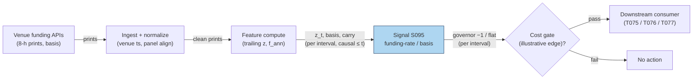

# S095 — Funding-rate / basis z-score (perpetuals)

A crowded-leverage gauge for crypto perpetuals. Each `8`-hour funding print is z-scored against its trailing panel; an extreme positive print means longs are paying shorts — crowded long leverage — and the module reduces leverage or fades, never shorts unconditionally into the payment [documented]. The funding-rate/basis construction is practitioner-standard reconstruction; the arbitrage framing follows Makarov & Schoar (2020) [documented].

> Tag law: every numeric literal in prose carries one of `[documented]
> [default] [example] [unverified] [internal-est] [measured]` (legend: Appendix
> i v1.0.0). Constants inside cited formulas inherit the formula's tag.
> Bibliographic years, volumes, pages, arXiv IDs, section numbers, rule codes (C1–C10),
> fail-safe codes (F1–F5), module IDs, and machine-parsed §0 data fields are identifiers,
> not literals, and are exempt.

## §1 Five-minute reviewer card

| Row | Value |
|---|---|
| Module | S095 — Funding-rate / basis z-score (perpetuals), v1.1.0 |
| Edge verdict | `PREDICTIVE-FEATURE-ONLY` as a standalone trigger; `AFTER-COST-EDGE` (conditional) as a leverage governor and cascade-setup gauge inside T075/T076 [documented]. |
| After-cost | `COMM-ONLY` — the chapter's carry accounting is explicit: funding `$6.00` − fees `$16.00` = net `−$10.00` [documented]; the carry leg is negative by construction. |
| Build cost | Tier L · `4–12` h [internal-est] · `$600–1,800` loaded [internal-est] |
| Data cost | Venue funding APIs `$0` (rate-limited) [documented]; CoinGlass Prime `$28`/mo [documented]; CoinGlass API from `$29`/mo [unverified]; Laevitas Premium `$50`/mo/seat, Enterprise (API history) `$500`/mo/seat [documented] — all as of 2026-09-10. |
| latency_class | per_event / 8-hour funding intervals [documented] |
| risk_class | medium (signal-only; leverage decisions live with the consumer) |
| Capacity | `$1–10`M/day notional [example] — per-venue perp capacity |
| Executability | Feasible: z-score on `8`-hour prints is trivial arithmetic [documented]. |
| Risk summary | Extreme funding can persist (crowded stays crowded); venue-specific prints diverge; the carry leg is structurally negative [documented]. |
| When it dies | Funding stays extreme without reversal; basis blows out on venue stress; fee schedule changes invert the carry math [documented]. |
| Regime gates | machine records below (provisional until R-chapter pins land) |
| Emits | `signal_vector` (Appendix b v1.0.0) — never orders |

**Regime gates (machine-readable):**

```yaml
regime_gates:
  - regime_id: R017            # Funding-stress regime
    direction: degrades
    mechanism: "venue stress makes funding prints stale or venue-specific; single-venue z misleads"
    condition: "venue stress flag set OR cross-venue print dispersion > 2x trailing median [example]"
    action: veto
    min_lag: "1 funding interval (8h) [example]"
    unknown_behavior: veto     # restrictive default
  - regime_id: R019            # Crypto funding-rate regime
    direction: amplifies
    mechanism: "extreme absolute funding across the panel means crowding is the dominant positioning driver; governor prints are more informative"
    condition: "cross-venue median |funding| >= 0.03% per print [example]"
    action: double             # capital fraction may double, capped at 0.5 [default]
    min_lag: "1 funding interval (8h) [example]"
    unknown_behavior: hold     # no adjustment on unknown
  - regime_id: R013            # Abnormal volume / participation regime
    direction: amplifies
    mechanism: "abnormal perp volume confirms the crowded-leverage setup ahead of liquidation risk"
    condition: "perp volume z-score > 2.0 [example]"
    action: double
    min_lag: "1 funding interval (8h) [example]"
    unknown_behavior: hold
  - regime_id: R012            # Price-impact / Amihud illiquidity regime
    direction: degrades
    mechanism: "wide spreads invalidate the 15 bps [example] spread leg of the COST block; the gate is unreliable"
    condition: "realized spread > 2x the COST-block baseline [example]"
    action: pause_entry
    min_lag: "1 funding interval (8h) [example]"
    unknown_behavior: pause_entry   # restrictive default
```

## §1.5 Cheapest / least-build path

1. **Prototype hour band:** `4–12` h [internal-est] — funding z-score + leverage-governor rule — reference implementation + gates + fixture validation.
2. **Cheapest-source row:** min_tier = venue funding APIs (free, rate-limited) [documented]; latency_class = 8-hour intervals [documented]; required_fields = `symbol`, `fundingTime` (ms → int64 ns UTC), `fundingRate` (decimal → %/100) via Binance Futures `GET /fapi/v1/fundingRate` [documented]; price_band = `$0` venue API [documented] / Laevitas Premium `$50`/mo/seat [documented] / Laevitas Enterprise (API history) `$500`/mo/seat [documented] / CoinGlass API from `$29`/mo [unverified] — as of 2026-09-10; build_or_buy = **build** — the z-score is yours; buy the cross-venue panel only if single-venue prints diverge [internal-est].
3. **Resource budget:** `1` core, `<1` GB RAM [internal-est]; compute pattern `per_event`.
4. **Skip list:** Cross-venue basis arbitrage leg — phase 2; term-structure of funding — phase 2; predicted-funding models — phase 2.
5. **DO-NOT-CUT list:** causality assertions (`assert fill_event > signal_event`, no-signal-bar-fills test); COST block + callable
   `expected_cost_bps`; F1–F5 fail-safes + module-state enum; decision-log audit records; bona-fide-intent + self-trade prevention; provenance tags on
   every numeric literal; fixtures + `test_cmd`; secrets via env only.
6. **Escalation gate:** upgrade when — single-venue prints diverge from the cross-venue median → buy the panel; the desk trades the basis leg → build the cash-and-carry stack (T077).

## §S0 Module contract

### S0.1 Typed signature

```python
def signal(state: ModuleState, events: list[Event], cfg: Config) -> SignalVector:
```

`SignalVector` per Appendix b v1.0.0. `state` is the module-owned named state
vector; `events` are canonical Events (Appendix a v1.0.0), newest last. The
function handles documented edge cases: empty events → `UNKNOWN`; invalid
prices/inputs → `UNKNOWN` (F1, never interpolate); halt/auction events → freeze
per the market-state table.

### S0.2 Config dataclass

| Parameter | Type | Default | Range | Status |
|---|---|---|---|---|
| `z_cut` | float | `2.5` | `>0` | calibrate — grid below; shipped value is an [example] start |
| `trail_n` | int | `5` | `>=5` [default] | calibrate — grid below; shipped value is an [example] start |
| `funding_hours` | int | `8` | `>0` | fixed — venue mechanics [documented] |
| `k` | float | `0.5` | `(0,1]` | [default] — cost-gate strictness |
| `cooldown_h` | float | `8.0` | `>0` | [default] — one funding interval |
| `ttl_h` | float | `24.0` | `>0` | [default] — `3`× the `8`-h reference cadence per F4 |

All defaults tagged per the tag law (status `default` ⇒ `[default]`, `example` ⇒ `[example]`, `calibrate` set at fit time, `fixed` ⇒ `[documented]` venue mechanics).

**Calibration recipe (z_cut, trail_n):** per-parameter grids — `z_cut ∈ {2.0, 2.5, 3.0, 3.5, 4.0}` [example]; `trail_n ∈ {5, 10, 20, 30, 60}` prints [example]. Walk-forward OOS selection: `4` folds [example], each `12` months train / `3` months test [example], embargo = `3` funding intervals (`24` h) [example] between train end and test start so the trailing panel cannot leak across the boundary. Selection metric: mean OOS avoided-drawdown captured per governor event, net of the §S2 COST block, ≥ `2`× `cost_bps` [example], with ≥ `20` governor events per fold [example]; ties broken by lower turnover. Freeze rule: freeze the selected pair, bump the minor version, lock for production; recalibrate at most quarterly [default]; never refit on test folds; any refit requires a fresh OOS pass before the values ship.

### S0.3 Canonical schema mapping

Vendor columns → canonical Event schema (Appendix a v1.0.0), stated once here:

| Source field | Canonical |
|---|---|
| funding print (venue, per `8` h [documented]) | `event_ts (int64 ns UTC) + funding rate` |
| perpetual/index prices | `basis (module feature input)` |
| trailing funding panel | `trail_mean, trail_sd (module feature inputs)` |
| fee schedule | `fees (module feature input)` |

### S0.4 Time contract

> Time contract: clock domain UTC, int64 ns; authoritative causality clock =
> `event_ts`; max_skew = `1` ms [default]; jitter budget = `500` µs [default];
> bar-label = open time; staleness TTL = `24` h [default] (`3`× the `8`-h reference cadence per F4); gap policy = mask, no interpolation;
> halt/auction → discard contributions across reopen.

**Timing box:** `signal@t (per_event, UTC) → earliest fill @open(t+1)`

### S0.5 Market-state table

| State | Module behavior |
|---|---|
| CONTINUOUS_TRADING | Compute normally; emit per cadence |
| HALTED | Freeze state; emit `UNKNOWN`; discard contributions across reopen |
| AUCTION | No new signals; hold last `SignalVector`; state `DEGRADED` |
| CLOSED | Emit nothing; state `OFF` |

### S0.6 Module-state enum + error taxonomy

States per Appendix k v1.0.0: `OK | DEGRADED | UNKNOWN | OFF`. Invalid input →
`UNKNOWN`, never interpolate (Appendix f v1.0.0, F1–F5).

| Failure | State | Alert |
|---|---|---|
| Missing/stale input (TTL `24` h [default] (`3`× the `8`-h reference cadence per F4)) | `UNKNOWN` | page |
| Invalid price/input reaching module (NaN, ≤ 0, non-finite) | `UNKNOWN` | log |
| Feature out of mathematical bounds (F2) | `UNKNOWN` | page |
| `seq` gap > `1,000` events [default] | `DEGRADED` (restart windows) | log |
| Jitter > budget persistently | `DEGRADED` | notify |
| Halt/auction | `UNKNOWN` / `DEGRADED` (per table) | log |
| Gate veto (cost > `k`·edge, C2) | `OK`, direction forced to `0` | log |
| Cooldown suppression (re-entry inside `8` h [default]) | `OK`, direction `0`, no re-arm | log |
| Kill/administrative disable | `OFF` | page |
| Anything unmapped | `UNKNOWN` | page |

### S0.7 Ops tail

- **Schedule:** every `8`-hour funding interval, UTC [documented]; owner: signals on-call.
- **Health checks:** fixture replay (`test_cmd`) green on deploy; live
  `seq`-gap monitor; staleness watchdog at `3`× cadence [default].
- **Alert table:** page on `UNKNOWN` > `8` h [default] or bounds violation;
  notify on `DEGRADED`; log on single dropped events.
- **Resource budget:** `1` vCPU, `1` GB RAM [internal-est]; state is O(window) per symbol.
- **Runbook stub:** `1.` confirm feed (vendor status); `2.` replay fixture;
  `3.` if red → set `OFF`, page; `4.` reconcile decision log before re-arm.

### S0.8 Secrets (env-only)

`DATA_VENDOR_API_KEY` via environment only. No secrets in this file, fixtures, or
logs (CI secrets-grep).

### S0.9 May / must-NOT

> **May:** emit `SignalVector` records per Appendix b v1.0.0. **Must-NOT:**
> emit orders, order intents, prices, share counts, or notionals; call a
> broker; mutate shared state outside `state`; interpolate across gaps.

## §S1 Legacy (subsumed by §1)

Legacy §S1 content is the §1 reviewer card above; this header is retained so
section numbering stays intact.

## §S2 Specification

### Universe

One perpetual contract's funding prints; fixture: `9` synthetic `8`-hour prints (seed `95` [example]) — `5` calm, `1` crowding print, `1` invalid (`nan`), `1` intra-interval extreme (cooldown path), `1` stale gap (TTL path) [measured].

### Entry rule (Boolean — no prose-only conditions)

```
z_t       := (f_t - trail_mean) / trail_sd        # funding z-score [documented]; trail_n = 5 [example]
CROWDED   := |z_t| > z_cut                        # z_cut = 2.5 [example], strict inequality (test: boundary)
GOVERNOR  := CROWDED -> direction = -1 if z_t > 0  # reduce leverage; NEVER an unconditional short [documented]
                            direction = +1 if z_t < 0  # fade crowded shorts [example]
            else direction = 0
```

### Exits (with post-exit cooldown)

```
EXIT := when z_t falls back inside ±z_cut [example]; the governor is a risk control, not a position — the consumer unwinds the leverage reduction. Post-governor cooldown `8` h [default].
```

### Position sizing (fenced function)

```python
def size_shares(risk_budget_R, stop_distance, vol_estimate, ADV_cap, cost):
    # S095 emits a capital fraction only; share math lives in the strategy
    # (T075/T076/T077). This reference binds every symbol:
    #   risk_budget_R : float, consumer's per-trade risk budget in account currency (bound by caller)
    #   stop_distance : float, ignored — the governor carries no stop (accepted, unused) [default]
    #   vol_estimate  : float, ignored (accepted, unused) [default]
    #   ADV_cap       : float, ignored (accepted, unused) [default]
    #   cost          : dict with bound keys {confidence, cost_bps, edge_bps, k}:
    #                 confidence in [0,1] from the emitted SignalVector;
    #                 cost_bps from expected_cost_bps(...); edge_bps = 100.0 [example]
    #                 illustrative avoided-drawdown placeholder; k = 0.5 [default]
    confidence = cost["confidence"]
    cost_bps = cost["cost_bps"]
    edge_bps = cost["edge_bps"]
    k = cost["k"]
    if not (0.0 <= confidence <= 1.0):
        return 0.0                                # F2: out-of-bounds confidence -> no capital
    if cost_bps > k * edge_bps:                   # C2: gate veto -> no capital
        return 0.0
    capital_fraction = 0.5 * confidence          # max capital fraction 0.5 [default]
    return risk_budget_R * capital_fraction       # consumer converts notional -> shares
```

### Risk limits

| Limit | Value |
|---|---|
| Max capital fraction per signal | `0.5` [default] |
| Max adverse excursion before `UNKNOWN` review | `2.0`× stop [default] |
| Staleness kill | TTL `24` h [default] (`3`× the `8`-h reference cadence per F4) → `UNKNOWN` |
| Never-short doctrine | extreme positive funding → reduce leverage; an unconditional short collects the payment against you [documented] |

### COST block (single source of truth)

| Component | Value (bps) | Tag | Basis |
|---|---|---|---|
| Spread | `15.0` | [example] | perp spread at the example notional |
| Fees | `12.0` | [example] | taker fees at the example tier |
| Borrow (`borrow_bps_per_day`) | `0.0` | [default] | perps have funding, not borrow — no borrow leg exists, so 0 with reason |
| Market impact/slippage | `10.0` | [example] | interval-bound execution |
| **Total reference** | `37.0` | [example] | matches the fixture cost_bps=37.0 |

`fee_schedule_as_of`: `2026-09-10` [documented] — Binance USDⓈ-M futures regular tier: taker `0.05`% (`5` bps), maker `0.02`% (`2` bps) [documented] (trade-reclaim fee guide, 2026-06-12; Binance's own blog lists taker from `0.045`%). The COST-block fee leg (`12.0` bps) is a blended example-tier placeholder [example], not the venue's published number. `side`: taker [example]; venue/tier/source: Binance perpetuals [example]. Re-stating cost numbers outside this block is a validation failure.

```python
def expected_cost_bps(notional, adv_pct, venue, side, urgency) -> float:
    # Callable cost model - perp interval stack (taker).
    spread_bps = 15.0   # [example]
    fee_bps = 12.0      # [example]
    borrow_bps = 0.0    # [default] reason in table: perps have funding, not borrow
    impact_bps = 10.0   # [example]
    return spread_bps + fee_bps + borrow_bps + impact_bps
```

### Execution / fill model table

| Aspect | Assumption |
|---|---|
| Latency | print known at the interval timestamp; tradable at the next interval's first honest quote [documented] |
| Participation | small per interval [example] |
| Partial fills | assume partial fills on volatile prints [example] |
| Adverse fill | extreme funding persisting — crowded stays crowded [documented] |

### Robustness

High sensitivity to the trailing panel: short panels make z_t jumpy; venue-specific prints can diverge from the cross-venue median — the panel median is the documented robustness check [documented].

### Compliance sub-block (C1–C10+)

| Code | Rule: trigger → check → action → log |
|---|---|
| C1 | Self-match prevention: S095 emits no orders; downstream T-modules must set self-trade-prevention flags — S095 asserts the requirement in its `consumes` contract: trigger → check → action → log record |
| C2 | Bona-fide intent: every emitted `SignalVector` with |direction|=`1` must pass the cost gate; gate fail → direction forced to `0` (C2 veto, logged), never a tradeable hint; sub-threshold scores emit direction `0`: trigger → check → action → log record |
| C3 | Message-rate: `≤100` emissions/symbol/s [default]; breach → throttle to `1`/s [default] + alert: trigger → check → action → log record |
| C4 | Fat-finger trio (applied by consumers; this module bounds its own outputs): confidence ∈ [`0`,`1`], capital ∈ [`0`,`0.5`], computed_at sane — out-of-bounds → `UNKNOWN` (F2): trigger → check → action → log record |
| C5 | Decision log: every emission, veto, and state transition logged per Appendix g v1.0.0, hash-chained: trigger → check → action → log record |
| C6 | Halt/auction: per §S0.5 market-state table; contributions across reopen discarded: trigger → check → action → log record |
| C7 | Locate check: this module never emits SHORT — direction `−1` is a leverage-reduction intent, not a short sale, so locate is n/a here; a consumer that shorts on this signal must assert `locate_ok` itself (Reg-SHO threshold securities → consumer direction `0`): trigger → check → action → log record |
| C8 | Public dissemination: no signal values published externally without review gate: trigger → check → action → log record |
| C9 | Data entitlements: per §S6 Data rights row; entitlement-class change → §1.5 escalation gate: trigger → check → action → log record |
| C10 | Post-exit cooldown: `8` h [default] (one funding interval) after a leverage reduction; no re-entry inside the interval: trigger → check → action → log record |

### Parameter table

| Parameter | Symbol | Value | Tag | Sensitivity |
|---|---|---|---|---|
| Z cutoff | ``z_cut`` | `2.5` | [example] (calibrate) | high — small: noise; large: no governors |
| Trailing panel | ``trail_n`` | `5` | [example] (calibrate) | medium — small: jumpy; large: stale |
| Funding interval | ``funding_hours`` | `8` | [documented] (fixed) | low — venue-set [documented] |
| Cost-gate strictness | ``k`` | `0.5` | [default] | high — tight: vetoes real governors |
| Post-governor cooldown | ``cooldown_h`` | `8.0` | [default] | low — one funding interval |
| Staleness TTL | ``ttl_h`` | `24.0` | [default] | medium — long: stale prints; short: flapping |

### Timing box

`signal@t (per_event, UTC) → earliest fill @open(t+1)`

### Crypto domain blocks

**Funding interval:** `8` h [documented] (Binance-class venues); the print timestamps the interval it settles. Annualization convention: `f_ann = (8760/8)·(f/100)·10000` bps [documented].

**Margin & self-liquidation:** the governor reduces leverage before the venue does it for you — maintenance-margin breach triggers venue liquidation at the worst print [documented]. The module never sizes positions; it emits the governor signal and the consumer deleverages.

## §S3 Math + normative pseudocode

Per `8`-hour print: `z_t = (f_t − μ_trail)/σ_trail` over the trailing `5` prints [example] (sample sd; `sd ≤ 0` → `z_t = 0.0`, no crowding signal). Annualized funding: `f_ann = (8760/8)·(f/100)·10000` bps [documented] — the `0.050`% print annualizes to `(1095)·(0.0005)·10000 = 5475` bps [documented]. Governor: `|z_t| > 2.5` [example] → direction `−1` (reduce leverage) on positive extremes, `+1` (fade crowded shorts) on negative extremes, never an unconditional short into the payment [documented]. Honest accounting: the chapter's carry example collects `$6.00` funding and pays `$16.00` fees → net `−$10.00` [documented] — the carry leg FAILS the cost gate (COST-block total vs `0.5 × 0` bps of carry edge). The fixture's gate passes only on a separate illustrative avoided-drawdown edge of `100` bps [example] — a screening placeholder, not a documented edge. Cost gate: `expected_cost_bps(...) <= k * edge_bps`, `k = 0.5` [default] — a fail vetoes the emission to direction `0` (C2), it never raises.

**Normative pseudocode** (pseudocode is normative; prose is commentary). All symbols bound:

```
# INPUTS (bound at call time)
#   events : list[Event] newest-last; each Event has event_ts (int64 ns UTC),
#            funding_pct (float, %), interval_h (float > 0), market
#            (default "CONTINUOUS_TRADING"; "HALTED" | "AUCTION" | "CLOSED")
#   cfg    : {z_cut=2.5 [example], trail_n=5 [example], k=0.5 [default],
#            cooldown_h=8.0 [default], ttl_h=24.0 [default]}
#   state  : {hist: list[float], last_print_ts: int64 ns | None,
#            last_governor_ts: int64 ns | None}

e := last(events); ts := e.event_ts; f := e.funding_pct; h := e.interval_h
if invalid(ts) or invalid(f) or invalid(h) or h <= 0:
    return SignalVector(state=UNKNOWN)                      # F1: never interpolate
if e.market == HALTED:  return SignalVector(state=UNKNOWN)  # halt guard: freeze
if e.market == AUCTION:  return SignalVector(state=DEGRADED) # hold last, no new signals
if state.last_print_ts is not None and ts - state.last_print_ts > ttl_h*3600*1e9:
    state.last_print_ts := ts                               # staleness guard: mask the print,
    return SignalVector(state=UNKNOWN)                      # no interpolation; clock advances
state.hist.append(f); state.last_print_ts := ts
trim state.hist to last (trail_n + 1) prints
f_ann := (8760/h) * (f/100) * 10000                          # bps [documented]
if len(state.hist) < trail_n + 1:
    return SignalVector(state=UNKNOWN)                      # insufficient history
win := state.hist[-(trail_n+1):-1]                           # trailing prints, data <= t
mu := mean(win); sd := sample_sd(win); z_t := (f - mu)/sd if sd > 0 else 0.0
# LOCATE guard: direction -1 is a leverage-reduction intent, never a new short sale;
# the module never emits SHORT, so locate is n/a (consumer asserts per C7).
# COOLDOWN guard: no re-entry inside one funding interval after a governor.
if state.last_governor_ts is not None and ts - state.last_governor_ts < cooldown_h*3600*1e9:
    return SignalVector(direction=0, state=OK)               # suppressed; no re-arm
if z_t > z_cut:       direction := -1                        # crowded longs: reduce leverage
elif z_t < -z_cut:    direction := +1                        # crowded shorts: fade [example]
else:                 direction := 0
edge_bps := 100.0 if direction != 0 else 0.0                 # [example] illustrative only
cost_bps := expected_cost_bps(notional=1e4 [example], adv_pct=0.01 [example],
                              venue="BINANCE" [example], side="taker" [example],
                              urgency="passive" [example])  # 15+12+0+10 = 37.0 [example]
gate_pass := cost_bps <= k * edge_bps                       # k = 0.5 [default]
if direction != 0 and not gate_pass:
    direction := 0; confidence := 0.0; capital := 0.0        # C2 veto: never a tradeable hint
else:
    confidence := min(1.0, |z_t| / 10.0) if direction != 0 else 0.0
    capital := 0.5 * confidence                             # max 0.5 [default]
if direction != 0: state.last_governor_ts := ts
fill_event := ts + 1
assert fill_event > signal_event                            # causality; no signal-bar fills
return SignalVector(direction, confidence, capital, state=OK, gate_pass, f_ann, z_t)
```

Causality: the computation at `t` uses only data `≤ t`; earliest reaction is
`t+1`. Mandatory unit test: no-signal-bar fills.

## §S4 Worked example (fixture-backed)

- Fixture: `9` synthetic `8`-hour prints (seed `95` [example]); tape `modules/fixtures/S095_tape.csv` (`# TYPE: validation-run`).
- Baseline prints 0.010/0.012/0.011/0.013/0.012 → mean **0.0116**%, sd ~**0.00114**%; the **0.050**% print → z ≈ **+33.7** [documented] → reduce leverage (direction `−1`), never an unconditional short.
- Annualization: (8760/8)×(0.05/100)×10000 = **5475** bps [documented].
- Carry accounting: `$6.00` funding − `$16.00` fees = `−$10.00` net [documented] — the carry leg FAILS the cost gate (COST-block total > `0.5 × 0` bps); the gate passes only on the separate illustrative `100` bps avoided-drawdown edge [example] — a placeholder, not a documented edge.
- Rows 1–5: insufficient history → `UNKNOWN`; row 7: invalid (`nan`) → `UNKNOWN` [measured]; `assert fill_event > signal_event` holds on every row [measured].
- Row 8: intra-interval `0.200`% print `4` h [example] after the governor — the trailing window now includes the `0.050`% print, so z ≈ **+10.61** [measured] (genuinely above `z_cut`) but the cooldown suppresses the re-entry → direction `0`, state `OK`, `gate_pass = 0` [measured].
- Row 9: `44` h gap [measured] since the last print (`> 24` h TTL [default]) → staleness `UNKNOWN`, print masked (not appended), clock advanced for recovery [measured].
- Where the example is optimistic: the `100` bps edge is illustrative — the documented economics are the negative carry; real deployment needs a measured avoided-drawdown figure before the gate means anything [documented].

## §S5 Strategies that use this signal

Generated from `deps.yaml` (CI symmetry); hand-listed here for this module:

| Strategy | Role |
|---|---|
| T075 — Crypto Funding-Rate Reversal | primary trigger: fades crowded leverage extremes, basis-aware; S095 is the entry gauge, S096 the cascade confirmation |
| T076 — Liquidation-Cascade Fade | context/regime: S095's funding z flags the crowded setup; S096 times the post-cascade entry |
| T077 — Crypto Basis Cash-and-Carry | primary trigger: harvests funding/basis convergence with explicit spread-cost accounting |

## §S6 Data required

| Field | Type | Granularity | Vendor / product / endpoint | Required fields | Price band (as-of 2026-09-10) |
|---|---|---|---|---|---|
| Funding prints | float | per `8` h [documented] | Binance Futures `GET /fapi/v1/fundingRate` [documented]; ccxt `fetch_funding_rate_history` (unified, `100`+ venues) [documented] | `symbol`, `fundingTime` (ms → int64 ns UTC), `fundingRate` (decimal fraction → %) | `$0` — free with rate limits [documented] |
| Cross-venue funding panel | float | per `8` h [documented] | CoinGlass API v4 `GET /api/futures/funding-rate/oi-weight-history` (params: `symbol`, `interval`) [documented]; Laevitas REST API v2 funding rates (Binance, Deribit, OKX, Bybit, Hyperliquid) [documented] | `time` (ms), `open/high/low/close` funding OHLC (CoinGlass) [documented] | CoinGlass API from `$29`/mo [unverified]; Laevitas Premium `$50`/mo/seat, Enterprise (API history) `$500`/mo/seat [documented] |
| Perpetual / index prices | float | tick/`1`-min [documented] | venue WS/REST trades or klines [documented] | `event_ts` (int64 ns), `price`, `venue` | `$0` — venue public feeds [documented] |
| Trailing funding panel | float | per 8 h | computed | `5` prints [example] | n/a — computed |
| Fee schedule | reference | static | Binance fee schedule / venue docs [documented] | `taker_bps`, `maker_bps`, `fee_schedule_as_of` | n/a — public |

Canonical mapping (Binance `fundingRate` → `funding_pct = fundingRate × 100`; CoinGlass `time` → `event_ts = time × 10^6`). All rate limits observed via the venue's weight headers; `DATA_VENDOR_API_KEY` (CoinGlass/Laevitas) via env only.

**Data rights row** (Appendix j v1.0.0): Venue APIs: public with rate limits [documented]; CoinGlass API: paid, no free programmatic tier [documented]; Laevitas: Free `$0` (dashboard, `1`-week history) / Premium `$50`/mo/seat / Enterprise `$500`/mo/seat (API historical data) [documented] — page crawled 2026-09-09.

## §S7 Local build (M5 Max / 128 GB)

Feasibility: feasible — z-scores on `8`-hour prints. Tier L, `4–12` h → `$600–1,800` loaded [internal-est]. Working set `<100` MB [internal-est] — far under the ~`77` GB budget. Bottleneck is venue coverage and fee-schedule accuracy, not compute [documented].

## §S8 Buy vs build

Build the z-score; buy the cross-venue panel only if single-venue prints prove insufficient. The math is trivial — the data contracts (which venue's print, which fee tier) are the product [documented].

## §S9 Efficacy — documented evidence

| Study / source | Market & period | Metric | Before/after cost | Caveat |
|---|---|---|---|---|
| Makarov & Schoar (2020), JFE 135(2) | Crypto markets | trading and arbitrage across crypto venues; limits of arbitrage [documented] | `BEFORE-COST` | arbitrage framing, not a funding signal |
| Binance Futures API docs | Venue specification | funding mechanics and 8-hour intervals [documented] | n/a — specification | venue-specific |
| CoinGlass / Laevitas | Cross-venue dashboards | funding, OI, liquidation aggregation [documented] | n/a — data product | reported (censored) figures — see S096 |

Selection disclosure: these are the sources surfaced by the chapter's research pass. Fails in: persistently extreme funding, venue stress, fee-schedule changes. **Honest bottom line:** funding z is the standard crowded-leverage gauge — as a leverage governor it is the documented use; as a carry trade it is structurally negative (the chapter's own accounting: −$10 [documented]), and the gate's `100` bps edge is illustrative only [example].

## §S10 Failure modes & pitfalls

| # | Trigger → Detect → Action → Recovery | check: |
|---|---|
| 1 | Persistently extreme funding → crowded stays crowded [documented] → governor is risk control, not a reversal bet → shorting into the payment | `check: never-short doctrine on positive extremes` |
| 2 | Venue-specific print divergence → single-venue z misleads [documented] → cross-venue median check → trading a venue artifact | `check: print vs cross-venue median` |
| 3 | Fee-schedule change → carry math inverts silently [documented] → pin fee_schedule_as_of → negative net treated as edge | `check: fee schedule versioned` |
| 4 | Negative carry → funding $6 − fees $16 = −$10 [documented] → the carry leg fails the gate by construction → harvesting negative carry | `check: carry edge <= 0 → no carry entry` |
| 5 | Venue stress → prints unreliable [documented] → stand down → signals on broken data | `check: venue-status gate` |
| 6 | Basis blowout → spot/perp dislocation [documented] → basis-aware sizing (T077) → convergence bet without the hedge | `check: basis within bounds` |
| 7 | Invalid inputs (NaN, ≤ 0) → F1 → UNKNOWN, never interpolate [documented] → drop the print → silent bad z | `check: invalid input → UNKNOWN` |
| 8 | Missed interval → gap in prints [documented] → mask, no interpolation → interpolated funding | `check: gap policy == mask` |
| 9 | Intra-interval extreme after a governor → cooldown [documented] → direction `0`, no re-arm → double-counted governor | `check: last_governor_ts unchanged on suppressed prints` |
| 10 | Edge insufficient → C2 gate veto → direction `0`, logged → trading on a sub-cost hint | `check: |direction|==1 implies gate_pass==1` |

## §S11 Visuals

`../../images/S095_example.png` — synthetic worked-example chart (seed `95` [example]).



## §S12 Source log + unverified leads

**Sources** (citable facts only):

1. Makarov, Igor & Schoar, Antoinette (2020). 'Trading and Arbitrage in Cryptocurrency Markets.' Journal of Financial Economics 135(2): 293–319. http://eprints.lse.ac.uk/100409/1/Cryptocurrency_Markets_JFE_final_v4.pdf (DOI 10.1016/j.jfineco.2019.07.001)
2. Binance Futures API documentation — 'Get Funding Rate History' (funding mechanics and intervals). https://binance-docs.github.io/apidocs/futures/en/#get-funding-rate-history
3. ccxt documentation — unified funding-rate endpoints across 100+ venues. https://docs.ccxt.com/#/?id=funding-rates
4. CoinGlass — cross-venue funding, OI, and liquidation aggregation. https://www.coinglass.com/
5. Laevitas — institutional crypto derivatives analytics (funding, basis, OI). https://laevitas.ch
6. CoinDesk Data — cryptocurrency derivatives datasets. https://data.coindesk.com/derivatives

**Chatbot source log.** Duck.ai answered Q-SB10-1–Q-SB10-3 (2026-09-10) [measured]; Grok/Cursor answers pending (checked 2026-09-10).

**Unverified leads** (chatbot-only — never in evidence tables):

- Duck.ai Q-SB10 batch QA: predicted-funding model sketches — proposed extension, no checkable source this batch [unverified].
- Duck.ai Q-SB10 batch QA: cross-venue panel pricing notes — bot-sourced, unverified; verify before budgeting [unverified].
- CoinGlass API pricing: official pricing pages are JS-gated; third-party listings quote API plans at `$29`–`699`/mo [unverified] (the `$28`/mo official figure is the Prime heatmap plan, not the API) [documented].

**Open research questions (GROK-NEEDED)** — web search could not answer these; do not guess:

1. Calibrated `(z_cut, trail_n)` selection statistics and measured out-of-sample avoided-drawdown-after-costs for a funding-rate z-score leverage governor on real perpetual funding panels — no public study found; the chapter's `100` bps edge remains illustrative [unverified].
2. The current CoinGlass API price list (Hobbyist → Enterprise) as of 2026-09-10, from an official citable page [unverified].
3. Production thresholds for cross-venue print divergence that trigger a stand-down in live funding governors (the R017 `condition` above) — practitioner-internal; no public source found [unverified].

---

## Appendix — AI build prompt (S095)

Copy-paste into any chat agent:

> Build module **S095 — Funding-rate / basis z-score (perpetuals)** per `notes/module-template.md` v1.0.0 and this file's §S0 contract.
> Cheapest path (§1.5): prototype `4–12` h [internal-est] — funding z-score + leverage-governor rule; compute pattern `per_event`.
> Implement `signal(state, events, cfg) -> SignalVector` (Appendix b v1.0.0)
> with the §S3 normative pseudocode, including the cost-gate predicate
> `expected_cost_bps(...) <= k * edge_bps` and `assert fill_event >
> signal_event`. Wire F1–F5 (Appendix f v1.0.0): invalid input → `UNKNOWN`,
> never interpolate. Log decisions per Appendix g v1.0.0. Secrets via env
> only. Run the fixture `modules/fixtures/S095_tape.csv`
> (`# TYPE: validation-run`) against `modules/fixtures/S095_expected.csv`
> (tolerance `1e-9` [default]).
> **Definition of done:** `python3 -m pytest modules/tests/test_S095.py -q`
> exits `0`. Tag every numeric literal you add with the unified enum
> (Appendix i v1.0.0); put anything unverifiable in §S12 unverified leads.
