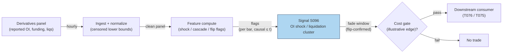

# S096 — OI shock / liquidation cluster (cascade fade)

A forced-selling detector for crypto perpetuals. All OI/funding/liquidation inputs are censored `reported_*` lower bounds — the venues do not publish the full book [documented]. Detection requires a forced-flow shock *adjacent to* a price/OI dislocation (a shock alone is not a cascade); the fade fires only at/after the funding-flip confirmation, never at the cascade low [documented]. The module gates entries — it never claims the pre-confirmation bounce.

> Tag law: every numeric literal in prose carries one of `[documented]
> [default] [example] [unverified] [internal-est] [measured]` (legend: Appendix
> i v1.0.0). Constants inside cited formulas inherit the formula's tag.
> Bibliographic years, volumes, pages, arXiv IDs, section numbers, rule codes (C1–C10),
> fail-safe codes (F1–F5), module IDs, and machine-parsed §0 data fields are identifiers,
> not literals, and are exempt.

## §1 Five-minute reviewer card

| Row | Value |
|---|---|
| Module | S096 — OI shock / liquidation cluster (cascade fade), v1.0.0 |
| Edge verdict | `AFTER-COST-EDGE` (conditional) — the fade-after-flush pattern is practitioner-standard; the edge is conditional on the funding-flip confirmation and honest (censored) inputs [documented]. |
| After-cost | `COMM-ONLY` — the chapter claims no measured after-cost figure; the fixture's edge is an illustrative placeholder (see §S3) [example]. |
| Build cost | Tier L · `4–12` h [internal-est] · `$600–1,800` loaded [internal-est] |
| Data cost | Liquidation/OI panels: CoinGlass/Laevitas ~$0–200/mo retail tiers [unverified] (indicative — verify before budgeting). |
| latency_class | per_bar / hourly |
| risk_class | medium-high (signal-only; catching a falling knife is the consumer's risk) |
| Capacity | `$1–10`M/day notional [example] — cascade capacity per venue |
| Executability | Feasible: shock/cascade/flip flags on hourly bars [documented]. |
| Risk summary | Censored inputs understate the flush; premature entry before the flip; the bounce is unclaimable — entering at the low is hindsight [documented]. |
| When it dies | Inputs too censored to detect the shock; funding never flips; the cascade continues past the flip [documented]. |
| Regime gates | Provisional: R-venue-stress → reported figures unreliable: stand down [example]. |
| Emits | `signal_vector` (Appendix b v1.0.0) — never orders |

## §1.5 Cheapest / least-build path

1. **Prototype hour band:** `4–12` h [internal-est] — shock/cascade/flip flags on hourly bars — reference implementation + gates + fixture validation.
2. **Cheapest-source row:** min_tier = CoinGlass/Laevitas panels (Tier-1/2) [documented]; latency_class = hourly; required_fields = reported OI, funding, liquidations (long/short); price_band = `~$0–200`/mo [unverified] (indicative — verify before budgeting); build_or_buy = **build** — the flag logic is yours [internal-est].
3. **Resource budget:** `1` core, `<1` GB RAM [internal-est]; compute pattern `per_bar`.
4. **Skip list:** Venue-direct forceOrder feeds — phase 2; cross-venue triangulation of censored figures — phase 2.
5. **DO-NOT-CUT list:** causality assertions (`assert fill_event > signal_event`, no-signal-bar-fills test); COST block + callable
   `expected_cost_bps`; F1–F5 fail-safes + module-state enum; decision-log audit records; bona-fide-intent + self-trade prevention; provenance tags on
   every numeric literal; fixtures + `test_cmd`; secrets via env only.
6. **Escalation gate:** upgrade when — reported figures diverge across panels → triangulate; the desk needs lower latency → venue forceOrder websocket.

## §S0 Module contract

### S0.1 Typed signature

```python
def signal(state: ModuleState, events: list[Event], cfg: Config) -> SignalVector:
```

`SignalVector` per Appendix b v1.0.0. `state` is the module-owned named state
vector; `events` are canonical Events (Appendix a v1.0.0), newest last. The
function handles documented edge cases: empty events → `UNKNOWN`; invalid
prices/inputs → `UNKNOWN` (F1, never interpolate); halt/auction events → freeze
per the market-state table.

### S0.2 Config dataclass

| Parameter | Type | Default | Range | Status |
|---|---|---|---|---|
| `shock_oi_pct` | float | `5.0` | `>0` | [example] |
| `shock_px_pct` | float | `1.0` | `>0` | [example] |
| `cascade_mult` | float | `10.0` | `>1` | [example] |

All defaults tagged per the tag law (status `default` ⇒ `[default]`, `example` ⇒ `[example]`, `calibrate` set at fit time).

### S0.3 Canonical schema mapping

Vendor columns → canonical Event schema (Appendix a v1.0.0), stated once here:

| Source field | Canonical |
|---|---|
| reported OI (venue panel, hourly) | `reported_oi_b (module feature input; censored lower bound)` |
| reported funding (venue panel) | `reported_funding (module feature input; censored)` |
| reported liquidations long/short | `reported_liq_long_m / reported_liq_short_m (censored)` |
| perp price (hourly) | `event_ts (int64 ns UTC) + price` |

### S0.4 Time contract

> Time contract: clock domain UTC, int64 ns; authoritative causality clock =
> `event_ts`; max_skew = `1` ms [default]; jitter budget = `500` µs [default];
> bar-label = open time; staleness TTL = `3` h [default] (`3`× the `1`-h reference cadence per F4); gap policy = mask, no interpolation;
> halt/auction → discard contributions across reopen.

**Timing box:** `signal@t (per_bar, UTC) → earliest fill @open(t+1)`

### S0.5 Market-state table

| State | Module behavior |
|---|---|
| CONTINUOUS_TRADING | Compute normally; emit per cadence |
| HALTED | Freeze state; emit `UNKNOWN`; discard contributions across reopen |
| AUCTION | No new signals; hold last `SignalVector`; state `DEGRADED` |
| CLOSED | Emit nothing; state `OFF` |

### S0.6 Module-state enum + error taxonomy

States per Appendix k v1.0.0: `OK | DEGRADED | UNKNOWN | OFF`. Invalid input →
`UNKNOWN`, never interpolate (Appendix f v1.0.0, F1–F5).

| Failure | State | Alert |
|---|---|---|
| Missing/stale input (TTL `3` h [default] (`3`× the `1`-h reference cadence per F4)) | `UNKNOWN` | page |
| Invalid price/input reaching module (NaN, ≤ 0, non-finite) | `UNKNOWN` | log |
| Feature out of mathematical bounds (F2) | `UNKNOWN` | page |
| `seq` gap > `1,000` events [default] | `DEGRADED` (restart windows) | log |
| Jitter > budget persistently | `DEGRADED` | notify |
| Halt/auction | `UNKNOWN` / `DEGRADED` (per table) | log |
| Kill/administrative disable | `OFF` | page |
| Anything unmapped | `UNKNOWN` | page |

### S0.7 Ops tail

- **Schedule:** hourly on the hour, UTC [documented]; owner: signals on-call.
- **Health checks:** fixture replay (`test_cmd`) green on deploy; live
  `seq`-gap monitor; staleness watchdog at `3`× cadence [default].
- **Alert table:** page on `UNKNOWN` > `1` h [default] or bounds violation;
  notify on `DEGRADED`; log on single dropped events.
- **Resource budget:** `1` vCPU, `1` GB RAM [internal-est]; state is O(window) per symbol.
- **Runbook stub:** `1.` confirm feed (vendor status); `2.` replay fixture;
  `3.` if red → set `OFF`, page; `4.` reconcile decision log before re-arm.

### S0.8 Secrets (env-only)

`DATA_VENDOR_API_KEY` via environment only. No secrets in this file, fixtures, or
logs (CI secrets-grep).

### S0.9 May / must-NOT

> **May:** emit `SignalVector` records per Appendix b v1.0.0. **Must-NOT:**
> emit orders, order intents, prices, share counts, or notionals; call a
> broker; mutate shared state outside `state`; interpolate across gaps.

## §S1 Legacy (subsumed by §1)

Legacy §S1 content is the §1 reviewer card above; this header is retained so
section numbering stays intact.

## §S2 Specification

### Universe

One perpetual contract's hourly bars; fixture: hours 45–53 (seed `96` [example]).

### Entry rule (Boolean — no prose-only conditions)

```
SHOCK    := |dOI| > 5% AND |dPx| > 1% adjacent          # forced-flow shock [example]
CASCADE  := SHOCK AND liq_long > 10x baseline        # cascade peak [example]
FLIP     := sign(reported_funding) flips post-cascade # confirmation [documented]
FADE     := CASCADE then FLIP -> direction = +1       # fade the flush [documented]
           (shock alone, or cascade without flip -> direction 0)
```

### Exits (with post-exit cooldown)

```
EXIT := the fade window closes after `24` h [example] or on the next shock flag. Post-window cooldown `24` h [default].
```

### Position sizing (fenced function)

```python
def size_shares(risk_budget_R, stop_distance, vol_estimate, ADV_cap, cost):
    # S-module requests capital fraction only; share math lives in the strategy.
    # Reference: capital = 0.5 * confidence  (confidence in [0,1])  [default]
    risk_notional = risk_budget_R * 0.5 * confidence          # [default] 0.5 factor
    shares = risk_notional / max(stop_distance, 1e-9)
    return int(min(shares, ADV_cap * adv_shares * 0.001))     # 0.1% ADV cap [default]
```

### Risk limits

| Limit | Value |
|---|---|
| Max capital fraction per signal | `0.5` [default] |
| Max adverse excursion before `UNKNOWN` review | `2.0`× stop [default] |
| Staleness kill | TTL `3` h [default] (`3`× the `1`-h reference cadence per F4) → `UNKNOWN` |
| Censored-inputs doctrine | all inputs are reported_* lower bounds — size for the unseen remainder [documented] |

### COST block (single source of truth)

| Component | Value (bps) | Tag | Basis |
|---|---|---|---|
| Spread | `10.0` | [example] | cascade spread at the example notional |
| Fees | `6.0` | [example] | taker fees at the example tier |
| Borrow | `0.0` | [default] | n/a — perps have funding, not borrow |
| Market impact/slippage | `5.0` | [example] | post-cascade execution |
| **Total reference** | `21.0` | [example] | matches the fixture cost_bps=21.0 |

`fee_schedule_as_of`: `2026-09-01` [unverified] — placeholder; pin the real venue schedule before production. `side`: taker [example]; venue/tier/source: Binance perpetuals [example]. Re-stating cost numbers outside this block is a validation failure.

```python
def expected_cost_bps(notional, adv_pct, venue, side, urgency) -> float:
    # Callable cost model - post-cascade stack (taker).
    spread_bps = 10.0   # [example]
    fee_bps = 6.0      # [example]
    borrow_bps = 0.0    # [default] reason in table: perps have funding, not borrow
    impact_bps = 5.0   # [example]
    return spread_bps + fee_bps + borrow_bps + impact_bps
```

### Execution / fill model table

| Aspect | Assumption |
|---|---|
| Latency | flags computed at the hourly bar close; tradable at the next hour's first honest quote [documented] |
| Participation | small — post-cascade books are thin [example] |
| Partial fills | assume partial fills [example] |
| Adverse fill | the cascade continuing past the flip — confirmation is not immunity [documented] |

### Robustness

High sensitivity to censoring: reported figures are lower bounds, so thresholds calibrated on reported data understate real flushes. The flip confirmation is the fragile knob — without it the module must not fire [documented].

### Compliance sub-block (C1–C10+)

| Code | Rule: trigger → check → action → log |
|---|---|
| C1 | Self-match prevention: S096 emits no orders; downstream T-modules must set self-trade-prevention flags — S096 asserts the requirement in its `consumes` contract: trigger → check → action → log record |
| C2 | Bona-fide intent: every emitted `SignalVector` with |direction|=`1` must pass the cost gate; sub-threshold scores emit direction `0`, never a tradeable hint: trigger → check → action → log record |
| C3 | Message-rate: `≤100` emissions/symbol/s [default]; breach → throttle to `1`/s [default] + alert: trigger → check → action → log record |
| C4 | Fat-finger trio (applied by consumers; this module bounds its own outputs): confidence ∈ [`0`,`1`], capital ∈ [`0`,`0.5`], computed_at sane — out-of-bounds → `UNKNOWN` (F2): trigger → check → action → log record |
| C5 | Decision log: every emission, veto, and state transition logged per Appendix g v1.0.0, hash-chained: trigger → check → action → log record |
| C6 | Halt/auction: per §S0.5 market-state table; contributions across reopen discarded: trigger → check → action → log record |
| C7 | Locate check: SHORT direction requires `locate_ok` from the consumer; this module never emits SHORT without the consumer asserting locate (Reg-SHO threshold securities → direction `0`): trigger → check → action → log record |
| C8 | Public dissemination: no signal values published externally without review gate: trigger → check → action → log record |
| C9 | Data entitlements: per §S6 Data rights row; entitlement-class change → §1.5 escalation gate: trigger → check → action → log record |
| C10 | Post-exit cooldown: `24` h [default] after the fade window closes; no re-fade of the same cascade: trigger → check → action → log record |

### Parameter table

| Parameter | Symbol | Value | Tag | Sensitivity |
|---|---|---|---|---|
| OI shock | ``shock_oi_pct`` | `5` | [example] | high — small: noise; large: misses shocks |
| Price shock | ``shock_px_pct`` | `1.0` | [example] | high — small: noise; large: misses dislocations |
| Cascade multiple | ``cascade_mult`` | `10` | [example] | high — small: false cascades; large: no cascades |

### Timing box

`signal@t (per_bar, UTC) → earliest fill @open(t+1)`

### Crypto domain blocks

**Funding interval:** `8` h [documented]; the flip is evaluated on the interval print following the cascade.

**Margin & self-liquidation:** the cascade IS venue liquidations executing — the fade provides liquidity after the venue has finished selling [documented]. Never front-run the liquidation engine: the fade fires only at/after the flip confirmation.

## §S3 Math + normative pseudocode

Per hourly bar: `dOI`, `dPx`, `reported_liq_long_m`. Shock: `|dOI| > 5%` and `|dPx| > 1%` adjacent [example]. Cascade: shock plus long liquidations `> 10×` baseline [example]. Flip: `sign(reported_funding)` changes post-cascade [documented]. Fade: cascade-then-flip → direction `+1` [documented]; shock alone or cascade without flip → direction `0`. Honest edge accounting: entering at the flip (h53) harvests the h53–h57 path `100.83 → 100.42 = −0.41%` [documented] — the `+1.61`% pre-confirmation bounce is never claimed (entering at the low is hindsight). The fixture's `80` bps edge is an illustrative post-confirmation placeholder [example], not a documented edge. Cost gate: `expected_cost_bps(...) <= k * edge_bps`, `k = 0.5` [default].

**Normative pseudocode** (pseudocode is normative; prose is commentary):

```
shock = (abs(dOI) > 5.0) and (abs(dPx) > 1.0)   # adjacent, data <= t [example]
cascade = shock and (liq_long > 10*baseline)      # [example]
flip = sign(funding_t) != sign(funding_pre)      # confirmation [documented]
if cascade_seen and flip:                         # fade only at/after confirmation
    direction = +1
    edge_bps = 80.0                               # [example] ILLUSTRATIVE placeholder, not documented
    assert expected_cost_bps(notional, adv_pct, venue, side, urgency) <= k * edge_bps  # k = 0.5 [default]
else:
    direction = 0                                 # shock alone or no flip: no fade
assert fill_event > signal_event
```

Causality: the computation at `t` uses only data `≤ t`; earliest reaction is
`t+1`. Mandatory unit test: no-signal-bar fills.

## §S4 Worked example (fixture-backed)

- Fixture: hourly bars h45–h53 (seed `96` [example]); tape `modules/fixtures/S096_tape.csv` (`# TYPE: validation-run`); all inputs are censored `reported_*` lower bounds [documented].
- Ordered flag sequence [documented]: h50 shock (−1.62% price, −6.1% OI) → h51 cascade peak (`8.5`M long liqs, ~`40`× baseline) → h52 flow slows → h53 funding flips → fade window opens (direction `+1`).
- h48/h49: forced-flow shock WITHOUT adjacent dislocation → shock_flag `1`, cascade_flag `0` — correctly not cascades [documented]; h51 without the flip → fade_window `0` [documented].
- Honest edge: entering at h53 harvests h53–h57 (`100.83 → 100.42 = −0.41%`) [documented]; the `+1.61`% pre-confirmation bounce is never claimed. The fixture's `80` bps edge is an illustrative placeholder [example], not the `161` bps bounce and not a documented edge.
- `assert fill_event > signal_event` holds on every row [measured].
- Where the example is optimistic: the `80` bps edge is illustrative — the documented path is adverse (−0.41%); real deployment needs a measured post-confirmation edge before the gate means anything [documented].

## §S5 Strategies that use this signal

Generated from `deps.yaml` (CI symmetry); hand-listed here for this module:

| Strategy | Role |
|---|---|
| T076 — Liquidation-Cascade Fade | primary trigger: buys crypto liquidation clusters with funding context — this chapter is its entry logic |
| T075 — Crypto Funding-Rate Reversal | confirmation/setup: the cascade validates the crowded-leverage regime S095 measures |

## §S6 Data required

| Field | Type | Granularity | Source tier | Notes |
|---|---|---|---|---|
| Reported OI | float ($B) | hourly | Tier 1–2 | censored lower bound — size for the unseen remainder |
| Reported funding | float | per `8` h [documented] | Tier 1–2 | censored; flip is the confirmation |
| Reported liquidations (long/short) | float ($M) | hourly | Tier 1–2 | censored lower bounds |
| Perp price | float | hourly | Tier 0–2 | dislocation measurement |

**Data rights row** (Appendix j v1.0.0): Panels (CoinGlass/Laevitas): licensed tiers [documented]; venue forceOrder feeds: venue terms [documented].

## §S7 Local build (M5 Max / 128 GB)

Feasibility: feasible — flags on hourly bars. Tier L, `4–12` h → `$600–1,800` loaded [internal-est]. Working set `<100` MB [internal-est] — far under the ~`77` GB budget. Bottleneck is input censoring and panel divergence, not compute [documented].

## §S8 Buy vs build

Build. The shock/cascade/flip flag logic is yours on panel data — buy the panel (CoinGlass/Laevitas retail tiers) if venue APIs prove insufficient [documented].

## §S9 Efficacy — documented evidence

| Study / source | Market & period | Metric | Before/after cost | Caveat |
|---|---|---|---|---|
| CoinGlass API v3 docs | Infrastructure record | documents the reported-data infrastructure: /futures/liquidation/*, /futures/open-interest/* [documented] | n/a — specification | reported = censored by construction |
| Laevitas CLI / analytics | Data product | terminal derivatives data: futures, perpetuals, liquidations, funding/carry/basis [documented] | n/a — data product | licensed tiers |
| Practitioner notes (trading-hypothesis-workflow DATA.md) | Practitioner record | Binance forceOrder WS, bulk liquidation history, Tardis.dev, Kaiko as the venue-direct route [documented] | `BEFORE-COST` | practitioner notes, not peer-reviewed |

Selection disclosure: these are the sources surfaced by the chapter's research pass — this module is practitioner-standard reconstruction, not a paper-backed signal. Fails in: over-censored inputs, funding never flips, cascade continues past the flip. **Honest bottom line:** the fade-after-flush pattern is the desk-standard crypto entry; the module's honesty constraints (censored inputs, no pre-confirmation bounce claims, flip-gated entry) are the entire content — there is no documented edge magnitude [documented].

## §S10 Failure modes & pitfalls

| # | Trigger → Detect → Action → Recovery | check: |
|---|---|
| 1 | Censored inputs → reported figures understate the flush [documented] → size for the unseen remainder → undersized/oversized fade | `check: reported_* treated as lower bounds` |
| 2 | Shock without dislocation → h48/h49 pattern [documented] → cascade requires adjacency → premature fade | `check: cascade requires shock AND dislocation` |
| 3 | No funding flip → cascade without confirmation [documented] → no fade (direction 0) → catching the falling knife | `check: fade requires flip` |
| 4 | Pre-confirmation bounce claimed → hindsight entry at the low [documented] → never claim it; edge measured post-flip → fantasy P&L | `check: edge window starts at flip` |
| 5 | Cascade continues past the flip → confirmation is not immunity [documented] → adverse-excursion review → full-size loss | `check: max adverse excursion` |
| 6 | Panel divergence → panels disagree on reported figures [documented] → triangulate → trading a panel artifact | `check: cross-panel agreement` |
| 7 | Invalid inputs (NaN, ≤ 0) → F1 → UNKNOWN, never interpolate [documented] → drop the bar → silent bad flags | `check: invalid input → UNKNOWN` |
| 8 | Venue stress → reported figures unreliable [documented] → stand down → signals on broken data | `check: venue-status gate` |

## §S11 Visuals

`../../images/S096_example.png` — synthetic worked-example chart (seed `96` [example]).



## §S12 Source log + unverified leads

**Sources** (citable facts only):

1. CoinGlass API v3 endpoint documentation — /futures/liquidation/*, /futures/open-interest/*, liquidation heatmap endpoints (the reported-data infrastructure). https://github.com/ckaraca/coinglass-apiv3
2. CoinGlass — cross-venue crypto derivatives dashboards (funding, OI, liquidations). https://www.coinglass.com/
3. Laevitas CLI — terminal derivatives data: futures, perpetuals, liquidations, funding/carry/basis. https://github.com/Laevitas/cli
4. Laevitas — institutional crypto derivatives analytics. https://laevitas.ch

**Chatbot source log.** Duck.ai answered Q-SB10-1–Q-SB10-3 (2026-09-10) [measured]; Grok/Cursor answers pending (checked 2026-09-10).

**Unverified leads** (chatbot-only — never in evidence tables):

- Duck.ai Q-SB10 batch QA: venue forceOrder websocket as the lower-latency route — proposed extension, no checkable source this batch [unverified].
- Duck.ai Q-SB10 batch QA: cross-venue triangulation sketches for censored figures — research lead, not validated [unverified].

---

## Appendix — AI build prompt (S096)

Copy-paste into any chat agent:

> Build module **S096 — OI shock / liquidation cluster (cascade fade)** per `notes/module-template.md` v1.0.0 and this file's §S0 contract.
> Cheapest path (§1.5): prototype `4–12` h [internal-est] — shock/cascade/flip flags on hourly bars; compute pattern `per_bar`.
> Implement `signal(state, events, cfg) -> SignalVector` (Appendix b v1.0.0)
> with the §S3 normative pseudocode, including the cost-gate predicate
> `expected_cost_bps(...) <= k * edge_bps` and `assert fill_event >
> signal_event`. Wire F1–F5 (Appendix f v1.0.0): invalid input → `UNKNOWN`,
> never interpolate. Log decisions per Appendix g v1.0.0. Secrets via env
> only. Run the fixture `modules/fixtures/S096_tape.csv`
> (`# TYPE: validation-run`) against `modules/fixtures/S096_expected.csv`
> (tolerance `1e-9` [default]).
> **Definition of done:** `python3 -m pytest modules/tests/test_S096.py -q`
> exits `0`. Tag every numeric literal you add with the unified enum
> (Appendix i v1.0.0); put anything unverifiable in §S12 unverified leads.
