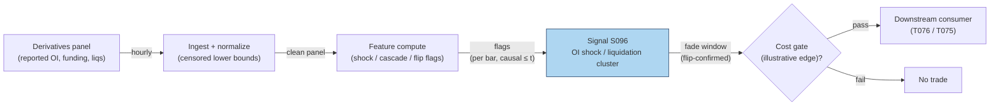

# S096 — OI shock / liquidation cluster (cascade fade)

A forced-selling detector for crypto perpetuals. All OI/funding/liquidation inputs are censored `reported_*` lower bounds — the venues do not publish the full book [documented]. Detection requires a forced-flow shock *adjacent to* a price/OI dislocation (a shock alone is not a cascade); the fade fires only at/after the funding-flip confirmation, never at the cascade low [documented]. The module gates entries — it never claims the pre-confirmation bounce.

> Tag law: every numeric literal in prose carries one of `[documented]
> [default] [example] [unverified] [internal-est] [measured]` (legend: Appendix
> i v1.0.0). Constants inside cited formulas inherit the formula's tag.
> Bibliographic years, volumes, pages, arXiv IDs, section numbers, rule codes (C1–C10),
> fail-safe codes (F1–F5), module IDs, and machine-parsed §0 data fields are identifiers,
> not literals, and are exempt.

## §1 Five-minute reviewer card

| Row | Value |
|---|---|
| Module | S096 — OI shock / liquidation cluster (cascade fade), v1.1.0 |
| Edge verdict | `AFTER-COST-EDGE` (conditional) — the fade-after-flush pattern is practitioner-standard; the edge is conditional on the funding-flip confirmation and honest (censored) inputs [documented]. |
| After-cost | `COMM-ONLY` — the chapter claims no measured after-cost figure; the fixture's edge is an illustrative placeholder (see §S3) [example]. |
| Build cost | Tier L · `4–12` h [internal-est] · `$600–1,800` loaded [internal-est] |
| Data cost | Laevitas Premium `$50`/mo/seat (1y history, CSV export) [documented]; CoinGlass $/mo unverified — verify at coinglass.com/pricing [unverified]; hourly liquidation history needs CoinGlass Startup+ tier [documented]. |
| latency_class | per_bar / hourly |
| risk_class | medium-high (signal-only; catching a falling knife is the consumer's risk) |
| Capacity | `$1–10`M/day notional [example] — cascade capacity per venue |
| Executability | Feasible: shock/cascade/flip flags on hourly bars [documented]. |
| Risk summary | Censored inputs understate the flush; premature entry before the flip; the bounce is unclaimable — entering at the low is hindsight [documented]. |
| When it dies | Inputs too censored to detect the shock; funding never flips; the cascade continues past the flip [documented]. |
| Regime gates | Machine records below (provisional ids; pending R001–R050 annotation pass). Restrictive default: unknown → veto. |
| Emits | `signal_vector` (Appendix b v1.0.0) — never orders |

**Regime gates (machine records)** — §0 `regime_ids` pins these three ids:

```yaml
# provisional; pending R001–R050 annotation pass
regime_gates:
  - regime_id: R-VENUE-STRESS
    direction: degrades                    # amplifies|degrades|inverts
    mechanism: "reported OI/funding/liq panels unreliable during venue outage, API gap, or cross-panel divergence"
    condition: "venue_status != CONTINUOUS_TRADING OR cross-panel reported_oi divergence > 20%"  # [example]
    action: veto                           # veto|halve|double|widen_stops|pause_entry
    min_lag: 0                             # [default] bars
    unknown_behavior: veto                 # restrictive default
  - regime_id: R-CASCADE-CONTINUATION
    direction: inverts
    mechanism: "cascade continues past the funding flip; the fade harvests adverse drift"
    condition: "post-flip adverse excursion > 2.0x stop"  # [default]
    action: pause_entry
    min_lag: 0                             # [default] bars
    unknown_behavior: veto                 # restrictive default
  - regime_id: R-FUNDING-NO-FLIP
    direction: degrades
    mechanism: "funding never flips after the cascade; confirmation absent"
    condition: "no FLIP_t within cascade_confirm_bars of CASCADE_t"  # [default]
    action: veto
    min_lag: 0                             # [default] bars
    unknown_behavior: veto                 # restrictive default
```

## §1.5 Cheapest / least-build path

1. **Prototype hour band:** `4–12` h [internal-est] — shock/cascade/flip flags on hourly bars — reference implementation + gates + fixture validation.
2. **Cheapest-source row:** min_tier = Laevitas Premium (`$50`/mo/seat, `1`-year history, CSV export) [documented] or CoinGlass Startup+ tier (hourly intervals need Startup+; Hobbyist limited to ≥`4`h [documented]; $/mo unverified — verify at coinglass.com/pricing [unverified]); latency_class = hourly; required_fields = reported OI, funding, liquidations (long/short); price_band = `$0–500`/mo [documented] (Laevitas Free `$0`/mo for research only — `1`-week history [documented]; Enterprise `$500`/mo/seat for API historical data [documented]); build_or_buy = **build** — the flag logic is yours [internal-est].
3. **Resource budget:** `1` core, `<1` GB RAM [internal-est]; compute pattern `per_bar`.
4. **Skip list:** Venue-direct forceOrder feeds — phase 2; cross-venue triangulation of censored figures — phase 2.
5. **DO-NOT-CUT list:** causality assertions (`assert fill_event > signal_event`, no-signal-bar-fills test); COST block + callable
   `expected_cost_bps`; F1–F5 fail-safes + module-state enum; decision-log audit records; bona-fide-intent + self-trade prevention; provenance tags on
   every numeric literal; fixtures + `test_cmd`; secrets via env only.
6. **Escalation gate:** upgrade when — reported figures diverge across panels → triangulate; the desk needs lower latency → venue forceOrder websocket.

## §S0 Module contract

### S0.1 Typed signature

```python
def signal(state: ModuleState, events: list[Event], cfg: Config) -> SignalVector:
```

`SignalVector` per Appendix b v1.0.0. `state` is the module-owned named state
vector; `events` are canonical Events (Appendix a v1.0.0), newest last. The
function handles documented edge cases: empty events → `UNKNOWN`; invalid
prices/inputs → `UNKNOWN` (F1, never interpolate); halt/auction events → freeze
per the market-state table.

### S0.2 Config dataclass

| Parameter | Type | Default | Range | Status |
|---|---|---|---|---|
| `shock_px_pct` | float | `1.0` | `>0` | calibrate |
| `shock_oi_pct` | float | `3.0` | `>0` | calibrate |
| `shock_liq_mult` | float | `5.0` | `>1` | calibrate |
| `liq_baseline_bars` | int | `24` | `≥1` | default |
| `cascade_confirm_bars` | int | `8` | `≥1` | calibrate |
| `fade_h` | int | `4` | `≥1` | calibrate |
| `k` | float | `0.5` | `(0,1]` | default |
| `staleness_ttl_s` | int | `10800` | `>0` | default |
| `cooldown_bars` | int | `24` | `≥0` | default |

All defaults tagged per the tag law (status `default` ⇒ `[default]`, `example` ⇒ `[example]`; `calibrate` params ship with the §S2 calibration recipe and get fitted values recorded in the decision log). This table mirrors `CFG` in `modules/tests/test_S096.py` exactly.

### S0.3 Canonical schema mapping

Vendor columns → canonical Event schema (Appendix a v1.0.0), stated once here.
Concrete endpoints (CoinGlass API v4, base `https://open-api-v4.coinglass.com`,
auth header `CG-API-KEY`) [documented]:

| Source field | Canonical |
|---|---|
| CoinGlass `/api/futures/open-interest/history` or `/api/futures/open-interest/aggregated-history` (params: exchange, symbol, interval; OHLC fields open/high/low/close + `time` ms) → reported OI; alt: Laevitas `laevitas oi` / REST v2 | `reported_oi_b (module feature input; censored lower bound)` |
| CoinGlass `/api/futures/funding-rate/history` (funding OHLC history); alt: Laevitas `laevitas perps carry BTC-PERPETUAL -p 1h` → `.data[0].funding_rate_close` | `reported_funding (module feature input; censored)` |
| CoinGlass `/api/futures/liquidation/history` (`long_liquidation_usd`, `short_liquidation_usd`) or `/api/futures/liquidation/aggregated-history` (`aggregated_long_liquidation_usd`) | `reported_liq_long_m / reported_liq_short_m (censored)` |
| CoinGlass `/api/futures/price/history`; perp price (hourly) | `event_ts (int64 ns UTC) + price` |

Hourly intervals on CoinGlass require the Startup+ plan (Hobbyist limited to `≥4`h intervals) [documented]. `reported_liq_short_m` is logged per §S0.9 but is not a feature of the §S3 reference (the cascade detector uses long liquidations only) [documented].

### S0.4 Time contract

> Time contract: clock domain UTC, int64 ns; authoritative causality clock =
> `event_ts`; max_skew = `1` ms [default]; jitter budget = `500` µs [default];
> bar-label = open time; staleness TTL = `3` h [default] (`3`× the `1`-h reference cadence per F4); gap policy = mask, no interpolation;
> halt/auction → discard contributions across reopen.

**Timing box:** `signal@t (per_bar, UTC) → earliest fill @open(t+1)`

### S0.5 Market-state table

| State | Module behavior |
|---|---|
| CONTINUOUS_TRADING | Compute normally; emit per cadence |
| HALTED | Freeze state; emit `UNKNOWN`; discard contributions across reopen |
| AUCTION | No new signals; hold last `SignalVector`; state `DEGRADED` |
| CLOSED | Emit nothing; state `OFF` |

### S0.6 Module-state enum + error taxonomy

States per Appendix k v1.0.0: `OK | DEGRADED | UNKNOWN | OFF`. Invalid input →
`UNKNOWN`, never interpolate (Appendix f v1.0.0, F1–F5).

| Failure | State | Alert |
|---|---|---|
| Missing/stale input (TTL `3` h [default] (`3`× the `1`-h reference cadence per F4)) | `UNKNOWN` | page |
| Invalid price/input reaching module (NaN, ≤ 0, non-finite) | `UNKNOWN` | log |
| Feature out of mathematical bounds (F2) | `UNKNOWN` | page |
| `seq` gap > `1,000` events [default] | `DEGRADED` (restart windows) | log |
| Jitter > budget persistently | `DEGRADED` | notify |
| Halt/auction | `UNKNOWN` / `DEGRADED` (per table) | log |
| Reopen after HALT | first CONTINUOUS_TRADING bar: `liq_hist`, `prev_px/prev_oi`, `prev_shock/prev_disloc` reset — contributions across the halt are discarded (F4) [default] | log |
| Kill/administrative disable | `OFF` | page |
| Anything unmapped | `UNKNOWN` | page |

### S0.7 Ops tail

- **Schedule:** hourly on the hour, UTC [documented]; owner: signals on-call.
- **Health checks:** fixture replay (`test_cmd`) green on deploy; live
  `seq`-gap monitor; staleness watchdog at `3`× cadence [default].
- **Alert table:** page on `UNKNOWN` > `1` h [default] or bounds violation;
  notify on `DEGRADED`; log on single dropped events.
- **Resource budget:** `1` vCPU, `1` GB RAM [internal-est]; state is O(window) per symbol.
- **Runbook stub:** `1.` confirm feed (vendor status); `2.` replay fixture;
  `3.` if red → set `OFF`, page; `4.` reconcile decision log before re-arm.

### S0.8 Secrets (env-only)

`DATA_VENDOR_API_KEY` via environment only. No secrets in this file, fixtures, or
logs (CI secrets-grep).

### S0.9 May / must-NOT

> **May:** emit `SignalVector` records per Appendix b v1.0.0. **Must-NOT:**
> emit orders, order intents, prices, share counts, or notionals; call a
> broker; mutate shared state outside `state`; interpolate across gaps.

## §S1 Legacy (subsumed by §1)

Legacy §S1 content is the §1 reviewer card above; this header is retained so
section numbering stays intact.

## §S2 Specification

### Universe

One perpetual contract's hourly bars; fixture: hours 45–56 (seed `96` [example]).

### Entry rule (Boolean — no prose-only conditions)

```
SHOCK_t   := liq_long_t > 5.0 * median(liq_long, trailing 24 bars)  # forced-flow shock; strict >: equality is NOT a shock [example]
DISLOC_t  := dPx_t <= -1.0% OR dOI_t <= -3.0%                       # adjacent dislocation; inclusive boundary [example]
CASCADE_t := SHOCK_t AND SHOCK_{t-1} AND DISLOC_{t-1}               # adjacent shock+dislocation [example]
FLIP_t    := sign(funding_t) != sign(funding_{t-1})                # both legs nonzero; a 0.0 print is not a flip [documented]
FADE      := FLIP_t within 8 bars of CASCADE_t [default]
             AND cooldown_left == 0 [default]
             -> direction = +1 iff the cost gate passes (C2)
             (shock alone, cascade without flip, cooldown active, or gate fail -> direction 0)
```

### Exits (with post-exit cooldown)

```
EXIT := the fade window closes after fade_h = 4 bars [default]. Post-window cooldown 24 bars [default] (C10): no re-fade of the same cascade.
```

### Position sizing (fenced function)

```python
def size_shares(risk_budget_R, stop_distance, vol_estimate, ADV_cap, cost):
    # S-module requests capital fraction only; share math lives in the strategy.
    # Reference: capital = 0.5 * confidence  (confidence in [0,1])  [default]
    risk_notional = risk_budget_R * 0.5 * confidence          # [default] 0.5 factor
    shares = risk_notional / max(stop_distance, 1e-9)
    # adv_shares: 30d average daily share volume, supplied by the consumer [default]
    return int(min(shares, ADV_cap * adv_shares * 0.001))     # 0.1% ADV cap [default]
```

### Risk limits

| Limit | Value |
|---|---|
| Max capital fraction per signal | `0.5` [default] |
| Max adverse excursion before `UNKNOWN` review | `2.0`× stop [default] |
| Staleness kill | TTL `3` h [default] (`3`× the `1`-h reference cadence per F4) → `UNKNOWN` |
| Censored-inputs doctrine | all inputs are reported_* lower bounds — size for the unseen remainder [documented] |

### COST block (single source of truth)

| Component | Value (bps) | Tag | Basis |
|---|---|---|---|
| Spread | `10.0` | [example] | cascade spread at the example notional |
| Fees | `6.0` | [example] | taker fees at the example tier (Binance USDⓈ-M Regular taker is `5` bps [documented] — see fee schedule below) |
| Borrow (`borrow_bps_per_day`) | `0.0` | [default] | perps have funding, not borrow — no borrow accrues on a perp position; funding-rate carry is signal input, not a cost-stack line |
| Market impact/slippage | `5.0` | [example] | post-cascade execution |
| **Total reference** | `21.0` | [example] | matches the fixture cost_bps=21.0 |

`fee_schedule_as_of`: `2026-07` [documented] — Binance USDⓈ-M futures Regular tier: maker `2` bps / taker `5` bps, cross-checked against the machine-readable 2026 schedule (github.com/jack0752168/crypto-exchange-fee-data); the chapter stack uses `6.0` bps taker [example] as the stressed example tier. `side`: taker [example]; venue/tier/source: Binance perpetuals [example]. Re-stating cost numbers outside this block is a validation failure.

```python
def expected_cost_bps(notional, adv_pct, venue, side, urgency) -> float:
    # Callable cost model - post-cascade stack (taker); mirrors the table above exactly.
    spread_bps = 10.0   # [example] cascade spread at the example notional
    fee_bps = 6.0       # [example] taker fees at the example tier
    borrow_bps = 0.0    # [default] borrow_bps_per_day = 0.0: perps have funding, not borrow
    impact_bps = 5.0   # [example] post-cascade execution
    return spread_bps + fee_bps + borrow_bps + impact_bps
```

### Execution / fill model table

| Aspect | Assumption |
|---|---|
| Latency | flags computed at the hourly bar close; tradable at the next hour's first honest quote [documented] |
| Participation | small — post-cascade books are thin [example] |
| Partial fills | assume partial fills [example] |
| Adverse fill | the cascade continuing past the flip — confirmation is not immunity [documented] |

### Robustness

High sensitivity to censoring: reported figures are lower bounds, so thresholds calibrated on reported data understate real flushes. The flip confirmation is the fragile knob — without it the module must not fire [documented].

### Compliance sub-block (C1–C10+)

| Code | Rule: trigger → check → action → log |
|---|---|
| C1 | Self-match prevention: S096 emits no orders; downstream T-modules must set self-trade-prevention flags — S096 asserts the requirement in its `consumes` contract: trigger → check → action → log record |
| C2 | Bona-fide intent: every emitted `SignalVector` with |direction|=`1` must pass the cost gate; sub-threshold scores emit direction `0`, never a tradeable hint: trigger → check → action → log record |
| C3 | Message-rate: `≤100` emissions/symbol/s [default]; breach → throttle to `1`/s [default] + alert: trigger → check → action → log record |
| C4 | Fat-finger trio (applied by consumers; this module bounds its own outputs): confidence ∈ [`0`,`1`], capital ∈ [`0`,`0.5`], computed_at sane [default] — out-of-bounds → `UNKNOWN` (F2): trigger → check → action → log record |
| C5 | Decision log: every emission, veto, and state transition logged per Appendix g v1.0.0, hash-chained: trigger → check → action → log record |
| C6 | Halt/auction: per §S0.5 market-state table; contributions across reopen discarded: trigger → check → action → log record |
| C7 | Locate check: n/a for this module — direction ∈ {`0`, `+1`} only, SHORT is never emitted (pinned by `test_never_emits_short`); downstream T-modules assert `locate_ok` for their own shorts per the consumer contract: trigger → check → action → log record |
| C8 | Public dissemination: no signal values published externally without review gate: trigger → check → action → log record |
| C9 | Data entitlements: per §S6 Data rights row; entitlement-class change → §1.5 escalation gate: trigger → check → action → log record |
| C10 | Post-exit cooldown: `24` h [default] after the fade window closes; no re-fade of the same cascade: trigger → check → action → log record |

### Parameter table

| Parameter | Symbol | Value | Tag | Sensitivity |
|---|---|---|---|---|
| OI shock threshold | ``shock_oi_pct`` | `3.0` | calibrate | high — small: noise; large: misses dislocations |
| Price shock threshold | ``shock_px_pct`` | `1.0` | calibrate | high — small: noise; large: misses dislocations |
| Shock liq multiple | ``shock_liq_mult`` | `5.0` | calibrate | high — small: false shocks; large: misses forced flow |
| Liq baseline window | ``liq_baseline_bars`` | `24` | [default] | low — median is robust past ~`12` bars [default] |
| Cascade confirmation window | ``cascade_confirm_bars`` | `8` | calibrate | medium — small: misses late flips; large: stale cascades |
| Fade window | ``fade_h`` | `4` | calibrate | high — small: exits early; large: holds into continuation |
| Cost-gate multiplier | ``k`` | `0.5` | [default] | policy, not fitted |
| Staleness TTL | ``staleness_ttl_s`` | `10800` | [default] | policy (F4: `3`× the `1`-h cadence) |
| Post-exit cooldown | ``cooldown_bars`` | `24` | [default] | policy (C10) |

### Calibration recipe

- **Objective:** maximize OOS net edge per fade (after the FULL-COST gate), subject to `≥20` fades per OOS window [default].
- **Grid** (all [example] starting points): `shock_px_pct ∈ {0.5, 1.0, 2.0}`; `shock_oi_pct ∈ {2.0, 3.0, 5.0}`; `shock_liq_mult ∈ {3.0, 5.0, 8.0}`; `cascade_confirm_bars ∈ {4, 8, 12}`; `fade_h ∈ {4, 8, 12}`.
- **Walk-forward:** `6`-month in-sample / `1`-month out-of-sample, rolled monthly [default]; embargo = `24` h between IS and OOS (one full fade window + cooldown) [example]; R-VENUE-STRESS windows excluded from fitting, used only for veto validation [default].
- **Selection metric:** OOS after-cost bps per fade; tie-break: lower max adverse excursion [default].
- **Freeze rule:** freeze when the OOS metric is stable across `3` consecutive windows (Δ `<10`% [default]) or after `2` refits, whichever first; record fitted values + dataset fingerprint in the decision log [default].
- **Status:** `shock_px_pct`, `shock_oi_pct`, `shock_liq_mult`, `cascade_confirm_bars`, `fade_h` → calibrate; `k`, `liq_baseline_bars`, `staleness_ttl_s`, `cooldown_bars` stay fixed/default (policy, not fitted) [default].

### Timing box

`signal@t (per_bar, UTC) → earliest fill @open(t+1)`

### Crypto domain blocks

**Funding interval:** `8` h [documented]; the flip is evaluated on the interval print following the cascade.

**Margin & self-liquidation:** the cascade IS venue liquidations executing — the fade provides liquidity after the venue has finished selling [documented]. Never front-run the liquidation engine: the fade fires only at/after the flip confirmation.

## §S3 Math + normative pseudocode

Per hourly bar: forced-flow shock = long liquidations vs a trailing median
baseline; dislocation = price and/or OI drop past thresholds; cascade = shock
*adjacent to* dislocation; flip = funding sign change (both legs nonzero);
fade = flip confirming a recent cascade, gated by cost and cooldown. Honest
edge accounting: entering at the flip (h53) harvests the h53–h57 path
`100.83 → 100.42 = −0.41%` [documented] — the `+1.61`% pre-confirmation bounce
is never claimed (entering at the low is hindsight). The fixture's `80` bps
edge is an illustrative post-confirmation placeholder [example], not a
documented edge. Cost gate: `expected_cost_bps(...) <= k * edge_bps`,
`k = 0.5` [default].

**Normative pseudocode** (pseudocode is normative; prose is commentary). This
mirrors `step()` in `modules/tests/test_S096.py` exactly — every variable is
bound, every guard is inline:

```
# Per-bar evaluation at bar t (hourly bars, UTC, int64 ns event_ts).
# Config (§S0.2): shock_px_pct=1.0 [example], shock_oi_pct=3.0 [example],
#   shock_liq_mult=5.0 [example], liq_baseline_bars=24 [default],
#   cascade_confirm_bars=8 [default], fade_h=4 [default], k=0.5 [default],
#   staleness_ttl_s=10800 [default], cooldown_bars=24 [default].

# --- market-state guards (§S0.5) ---
ms := row.market_state or CONTINUOUS_TRADING
if ms == HALTED:
    emit module_state=UNKNOWN, direction=0, all flags 0   # freeze: no state update
    post_halt := true                                     # discard contributions across reopen
    return
if ms == AUCTION:
    emit last_vector with module_state=DEGRADED           # hold: no new signals
    return                                                # no feature/state update
if ms == CLOSED:
    emit module_state=OFF, direction=0; return
if ms not in {CONTINUOUS_TRADING}: emit UNKNOWN; return   # unmapped state: fail closed

# --- staleness guard (F4) ---
if last_ts exists and (t - last_ts) > staleness_ttl_s * 1_000_000_000:   # ns/s [fixed]
    last_ts := t; emit module_state=UNKNOWN, direction=0; return   # mask the gap, never interpolate

# --- F1 input validity (invalid -> UNKNOWN, never interpolate) ---
require t is int64
require is_finite(price) and price > 0
require is_finite(reported_oi_b) and reported_oi_b >= 0
require is_finite(reported_funding)                          # 0.0 is a valid reading
require is_finite(reported_liq_long_m) and reported_liq_long_m >= 0
on violation: emit module_state=UNKNOWN, direction=0, all flags 0; return

# --- post-halt reopen: discard contributions across the halt ---
if post_halt:
    liq_hist := []; prev_px := null; prev_oi := null
    prev_shock := 0; prev_disloc := 0; post_halt := false
last_ts := t

# --- features (all inputs have event_ts <= t; causality holds by construction) ---
hist     := last liq_baseline_bars of liq_hist
baseline := median(hist) if hist nonempty else 0.05           # [default] cold-start baseline
liq_hist.append(reported_liq_long_m_t)

shock_t  := 1 if liq_long_t > shock_liq_mult * baseline else 0   # strict >: equality is NOT a shock [example]
dpx_t    := (price_t - price_{t-1}) / price_{t-1} if price_{t-1} exists else 0.0
doi_t    := (oi_t - oi_{t-1}) / oi_{t-1}           if oi_{t-1} exists else 0.0
disloc_t := 1 if (dpx_t <= -shock_px_pct/100) or (doi_t <= -shock_oi_pct/100) else 0  # inclusive [example]

# cascade = forced-flow shock ADJACENT to the dislocation (a shock alone is not a cascade)
cascade_t := 1 if (shock_t and shock_{t-1} and disloc_{t-1}) else 0
prev_shock, prev_disloc := shock_t, disloc_t
bars_since_cascade := 0 if cascade_t else bars_since_cascade + 1

# flip = funding sign change, both legs nonzero (a 0.0 print is not a flip)
flip_t := 1 if (funding_{t-1} exists and sign(funding_t) != sign(funding_{t-1})
                and funding_t != 0 and funding_{t-1} != 0) else 0
prev_funding := funding_t

# fade: flip confirms a RECENT cascade -> fade the exhaustion move.
# C10 post-exit cooldown blocks re-fading the same cascade.
if flip_t and bars_since_cascade <= cascade_confirm_bars and cooldown_left == 0:
    fade_left := fade_h
fade_window_t := 1 if fade_left > 0 else 0
if fade_window_t:
    fade_left -= 1
    if fade_left == 0: cooldown_left := cooldown_bars      # [default]
elif cooldown_left > 0:
    cooldown_left -= 1

# --- edge, cost gate, output ---
edge_bps_t  := 80.0 if fade_window_t else 0.0              # [example] ILLUSTRATIVE placeholder, not documented
cost_bps_t  := expected_cost_bps(notional, adv_pct, venue, side, urgency)  # §S2 COST block callable
gate_pass_t := 1 if cost_bps_t <= k * edge_bps_t else 0    # executable cost-gate predicate [default] k=0.5
direction_t := +1 if (fade_window_t and gate_pass_t) else 0  # gate veto (C2); locate n/a: -1 never emitted
confidence_t := 0.6 if direction_t == 1 else 0.0           # [example]
capital_t    := 0.5 * confidence_t                         # [default]
module_state := OK
last_vector  := emitted record                             # for the AUCTION hold

assert fill_event_ts > signal_event_ts                     # t->t+1 causality; no signal-bar fills
```

Causality: the computation at `t` uses only data `≤ t`; earliest reaction is
`t+1`. Mandatory unit test: no-signal-bar fills.

## §S4 Worked example (fixture-backed)

- Fixture: hourly bars h45–h56 (seed `96` [example]); tape `modules/fixtures/S096_tape.csv` (`# TYPE: validation-run`); all inputs are censored `reported_*` lower bounds [documented].
- Ordered flag sequence [documented]: h50 shock (−1.62% price, −6.1% OI) → h51 cascade peak (`8.5`M long liqs, ~`61`× the trailing median baseline — `8.5 / 0.14`, computed from the tape [measured]) → h52 flow slows → h53 funding flips → fade window opens (direction `+1`).
- h48/h49: forced-flow shock WITHOUT adjacent dislocation → shock_flag `1`, cascade_flag `0` — correctly not cascades [documented]; h51 without the flip → fade_window `0` [documented].
- Honest edge: entering at h53 harvests h53–h57 (`100.83 → 100.42 = −0.41%`) [documented]; the `+1.61`% pre-confirmation bounce is never claimed. The fixture's `80` bps edge is an illustrative placeholder [example], not the `161` bps bounce and not a documented edge.
- `assert fill_event > signal_event` holds on every row [measured].
- Where the example is optimistic: the `80` bps edge is illustrative — the documented path is adverse (−0.41%); real deployment needs a measured post-confirmation edge before the gate means anything [documented].

## §S5 Strategies that use this signal

Generated from `deps.yaml` (CI symmetry); hand-listed here for this module:

| Strategy | Role |
|---|---|
| T076 — Liquidation-Cascade Fade | primary trigger: buys crypto liquidation clusters with funding context — this chapter is its entry logic |
| T075 — Crypto Funding-Rate Reversal | confirmation/setup: the cascade validates the crowded-leverage regime S095 measures |

## §S6 Data required

| Field | Type | Granularity | Vendor / product / endpoint | Schema | Required fields |
|---|---|---|---|---|---|
| Reported OI | float ($B) | hourly | CoinGlass API v4 `/api/futures/open-interest/history` (alt: `/api/futures/open-interest/aggregated-history`); params: exchange, symbol, interval [documented] | OHLC: open/high/low/close + `time` (ms) [documented] | `close`, `time` |
| Reported funding | float | per `8` h [documented] | CoinGlass API v4 `/api/futures/funding-rate/history` [documented]; alt: Laevitas `laevitas perps carry BTC-PERPETUAL -p 1h -o json` → `.data[0].funding_rate_close` [documented] | funding OHLC history [documented] | `funding_rate_close` (or OHLC close), `time` |
| Reported liquidations (long/short) | float ($M) | hourly | CoinGlass API v4 `/api/futures/liquidation/history` (params: exchange, symbol, interval; e.g. `exchange=Binance&symbol=BTCUSDT&interval=1h`) or `/api/futures/liquidation/aggregated-history` [documented]; alt: Laevitas REST v2 / CLI [documented] | `long_liquidation_usd`, `short_liquidation_usd` (pair) or `aggregated_long_liquidation_usd` / `aggregated_short_liquidation_usd` (coin) + `time` (ms) [documented] | `long_liquidation_usd`, `time` |
| Perp price | float | hourly | CoinGlass API v4 `/api/futures/price/history` [documented]; venue-direct WS phase 2 | price OHLC + `time` (ms) | `close`, `time` |

**Price bands (as-of 2026-09-11):**
- Laevitas: Free `$0`/mo (`1` week historical data, basic charting); Premium `$50`/mo per seat (`1` year historical data, unlimited charting, CSV exports); Enterprise `$500`/mo per seat (API historical data, unlimited dashboards); Custom Enterprise (high-throughput API) [documented — laevitas.ch]. REST API v2 / WebSocket / MCP + x402 pay-per-request available [documented]. Research on Premium (`$50`/mo) is the cheapest viable tier; production API access sits at Enterprise (`$500`/mo/seat) or x402 (per-call rates unpublished) [documented].
- CoinGlass: plans Hobbyist / Startup / Standard / Professional / Enterprise [documented]; hourly liquidation/OI/funding history requires the Startup+ plan (Hobbyist limited to `≥4`h intervals) [documented]; $/mo not published in machine-readable form — verify at coinglass.com/pricing before budgeting [unverified].
- Auth: CoinGlass header `CG-API-KEY` [documented]; Laevitas via `laevitas doctor` auth check [documented].

**Data rights row** (Appendix j v1.0.0): Panels (CoinGlass/Laevitas): licensed tiers [documented]; venue forceOrder feeds: venue terms [documented].

## §S7 Local build (M5 Max / 128 GB)

Feasibility: feasible — flags on hourly bars. Tier L, `4–12` h → `$600–1,800` loaded [internal-est]. Working set `<100` MB [internal-est] — far under the ~`77` GB budget [internal-est]. Bottleneck is input censoring and panel divergence, not compute [documented].

## §S8 Buy vs build

Build. The shock/cascade/flip flag logic is yours on panel data — buy the panel (CoinGlass/Laevitas retail tiers) if venue APIs prove insufficient [documented].

## §S9 Efficacy — documented evidence

| Study / source | Market & period | Metric | Before/after cost | Caveat |
|---|---|---|---|---|
| Chitra (2025), "Perpetual Futures in Decentralised Finance" (Int. J. Financial Stud. 2026, 14, 178) | Crypto perps | first formal autodeleveraging study; 10 Oct 2025 Hyperliquid cascade — largest single-day liquidation event in crypto history (`>$19`B), ~`$653`M unnecessary haircuts from suboptimal ADL [documented] | n/a — mechanism | mechanism evidence, not a fade-edge backtest |
| Ruan & Streltsov (2025) | Crypto perps | U-shaped spot-market-quality patterns tied to the `8`h funding cycle; liquidation events at cycle boundaries generate measurable spillovers [documented] | n/a — mechanism | mechanism evidence (as cited in the MDPI review above), not a fade-edge backtest |
| "Liquidation, Leverage and Optimal Margin in Bitcoin Futures" (arXiv:2102.04591) | BTC futures | forced-liquidation inference from price data; liq% estimated as liquidation/OI [documented] | n/a — mechanism | mechanism evidence, not a fade-edge backtest |
| CoinGlass API v3 docs | Infrastructure record | documents the reported-data infrastructure: /futures/liquidation/*, /futures/open-interest/* [documented] | n/a — specification | reported = censored by construction |
| CoinGlass API v4 docs | Infrastructure record | `/api/futures/liquidation/history`, `/api/futures/liquidation/aggregated-history`, `/api/futures/open-interest/history`, `/api/futures/funding-rate/history` (base `https://open-api-v4.coinglass.com`, `CG-API-KEY` auth) [documented] | n/a — specification | reported = censored by construction |
| Laevitas CLI / analytics | Data product | terminal derivatives data: futures, perpetuals, liquidations, funding/carry/basis; REST v2 / WS / MCP / x402; pricing `$0`/`$50`/`$500` per seat/mo [documented] | n/a — data product | licensed tiers |
| Practitioner notes (trading-hypothesis-workflow DATA.md) | Practitioner record | Binance forceOrder WS, bulk liquidation history, Tardis.dev, Kaiko as the venue-direct route [documented] | `BEFORE-COST` | practitioner notes, not peer-reviewed |

Selection disclosure: mechanism papers (Chitra 2025; Ruan & Streltsov 2025; arXiv:2102.04591) document that liquidation cascades and funding-cycle effects are real, measurable phenomena — none of them backtests the fade-after-flip edge, whose magnitude remains undocumented. These are the sources surfaced by the chapter's research pass — this module is practitioner-standard reconstruction plus mechanism evidence, not a paper-backed signal. Fails in: over-censored inputs, funding never flips, cascade continues past the flip. **Honest bottom line:** the fade-after-flush pattern is the desk-standard crypto entry; the module's honesty constraints (censored inputs, no pre-confirmation bounce claims, flip-gated entry) are the entire content — there is no documented edge magnitude [documented].

## §S10 Failure modes & pitfalls

| # | Trigger → Detect → Action → Recovery | check: |
|---|---|
| 1 | Censored inputs → reported figures understate the flush [documented] → size for the unseen remainder → undersized/oversized fade | `check: reported_* treated as lower bounds` |
| 2 | Shock without dislocation → h48/h49 pattern [documented] → cascade requires adjacency → premature fade | `check: cascade requires shock AND dislocation` |
| 3 | No funding flip → cascade without confirmation [documented] → no fade (direction 0) → catching the falling knife | `check: fade requires flip` |
| 4 | Pre-confirmation bounce claimed → hindsight entry at the low [documented] → never claim it; edge measured post-flip → fantasy P&L | `check: edge window starts at flip` |
| 5 | Cascade continues past the flip → confirmation is not immunity [documented] → adverse-excursion review → full-size loss | `check: max adverse excursion` |
| 6 | Panel divergence → panels disagree on reported figures [documented] → triangulate → trading a panel artifact | `check: cross-panel agreement` |
| 7 | Invalid inputs (NaN, ≤ 0) → F1 → UNKNOWN, never interpolate [documented] → drop the bar → silent bad flags | `check: invalid input → UNKNOWN` |
| 8 | Venue stress → reported figures unreliable [documented] → stand down → signals on broken data | `check: venue-status gate` |

## §S11 Visuals

`../../images/S096_example.png` — synthetic worked-example chart (seed `96` [example]).



## §S12 Source log + unverified leads

**Sources** (citable facts only):

1. CoinGlass API v3 endpoint documentation — /futures/liquidation/*, /futures/open-interest/*, liquidation heatmap endpoints (the reported-data infrastructure). https://github.com/ckaraca/coinglass-apiv3
2. CoinGlass — cross-venue crypto derivatives dashboards (funding, OI, liquidations). https://www.coinglass.com/
3. CoinGlass API v4 endpoint overview — base URL, open-interest / funding-rate / liquidation history endpoints, CG-API-KEY auth. https://docs.coinglass.com/reference/endpoint-overview
4. CoinGlass API v4 aggregated liquidation history — plan/interval limits (hourly needs Startup+). https://docs.coinglass.com/reference/aggregated-liquidation-history
5. Laevitas CLI — terminal derivatives data: futures, perpetuals, liquidations, funding/carry/basis. https://github.com/Laevitas/cli
6. Laevitas — institutional crypto derivatives analytics; pricing ($0/$50/$500 per seat/mo), REST API v2 / WS / MCP / x402. https://laevitas.ch
7. Laevitas CLI skill reference — `laevitas perps carry BTC-PERPETUAL -p 1h` → `.data[0].funding_rate_close`; REST API v2 coverage (Binance, Deribit, OKX, Bybit, Hyperliquid). https://github.com/laevitas/cli/blob/HEAD/skills/laevitas-cli/SKILL.md
8. Binance USDⓈ-M futures fee schedule 2026 — Regular tier maker 0.0200% / taker 0.0500%, last verified 2026-07 [documented]. https://github.com/jack0752168/crypto-exchange-fee-data
9. Chitra (2025), "Perpetual Futures in Decentralised Finance" (Int. J. Financial Stud. 2026, 14, 178) — autodeleveraging study; 10 Oct 2025 Hyperliquid cascade (>$19B), ~$653M unnecessary ADL haircuts [documented]. https://doi.org/10.3390/ijfs14070178
10. Ruan & Streltsov (2025) — U-shaped spot-quality patterns around the 8h funding cycle; liquidation spillovers at cycle boundaries (cited in source 9) [documented]. https://doi.org/10.3390/ijfs14070178
11. "Liquidation, Leverage and Optimal Margin in Bitcoin Futures" (arXiv:2102.04591) — forced-liquidation inference [documented]. http://arXIV.org/pdf/2102.04591

**Chatbot source log.** Duck.ai answered Q-SB10-1–Q-SB10-3 (2026-09-10) [measured]; Grok/Cursor answers pending (checked 2026-09-10).

**Unverified leads** (chatbot-only — never in evidence tables):

- Duck.ai Q-SB10 batch QA: venue forceOrder websocket as the lower-latency route — proposed extension, no checkable source this batch [unverified].
- Duck.ai Q-SB10 batch QA: cross-venue triangulation sketches for censored figures — research lead, not validated [unverified].
- CoinGlass API $/mo tier prices — the pricing page renders no machine-readable prices; verify at https://www.coinglass.com/pricing before budgeting [unverified].
- Laevitas x402 pay-per-request per-call pricing — availability documented, rates unpublished [unverified].
- GROK-NEEDED (deep review 2026-09-11): no published study was found measuring the post-confirmation fade edge (forward return from the first post-cascade funding flip over the next 4–24h on BTC perps, net of a ~21 bps cost stack) — the fixture's 80 bps edge remains an illustrative placeholder [unverified].
- GROK-NEEDED (deep review 2026-09-11): no public parameter study was found for calibrating shock_liq_mult / shock_px_pct / shock_oi_pct on censored reported liquidation data — the §S2 calibration recipe must be run on the desk's own walk-forward data [unverified].

---

## Appendix — AI build prompt (S096)

Copy-paste into any chat agent:

> Build module **S096 — OI shock / liquidation cluster (cascade fade)** v1.1.0 per `notes/module-template.md` v1.0.0 and this file's §S0 contract.
> Cheapest path (§1.5): prototype `4–12` h [internal-est] — shock/cascade/flip flags on hourly bars; compute pattern `per_bar`.
> Implement `signal(state, events, cfg) -> SignalVector` (Appendix b v1.0.0)
> with the §S3 normative pseudocode — including the market-state/halt/auction/staleness guards, the F1 validity checks, the post-halt reopen reset, the C10 post-exit cooldown, the executable cost-gate predicate
> `expected_cost_bps(...) <= k * edge_bps` (gate veto → direction `0`), and `assert fill_event >
> signal_event`. Wire F1–F5 (Appendix f v1.0.0): invalid input → `UNKNOWN`,
> never interpolate. Log decisions per Appendix g v1.0.0. Secrets via env
> only. Run the fixture `modules/fixtures/S096_tape.csv`
> (`# TYPE: validation-run`) against `modules/fixtures/S096_expected.csv`
> (tolerance `1e-9` [default]); the test suite also pins boundary conditions
> (strict shock inequality, inclusive dislocation boundary, zero-funding flip guard),
> the gate veto path, halt/auction/closed guards, the staleness TTL, and the cooldown.
> **Definition of done:** `python3 -m pytest modules/tests/test_S096.py -q`
> exits `0`. Tag every numeric literal you add with the unified enum
> (Appendix i v1.0.0); put anything unverifiable in §S12 unverified leads.
