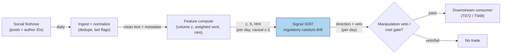

# S097 — Social and media sentiment

A social-catalyst detector: post volume is z-scored over exactly five prior days (sample SD) [documented]; the composite is `z_vol × weighted sentiment` above a minimum-post floor, gated by the manipulation diagnostic (HHI concentration) [documented]. Day 6 fires (+26.25 [documented]); day 7 is vetoed (HHI 0.3168 > 0.25 [documented]) — the veto is the signal's most valuable output [documented]. Literature position: social sentiment is an attention/flow variable that moves volume and retail flow — not a standalone directional signal [documented].

> Tag law: every numeric literal in prose carries one of `[documented]
> [default] [example] [unverified] [internal-est] [measured]` (legend: Appendix
> i v1.0.0). Constants inside cited formulas inherit the formula's tag.
> Bibliographic years, volumes, pages, arXiv IDs, section numbers, rule codes (C1–C10),
> fail-safe codes (F1–F5), module IDs, and machine-parsed §0 data fields are identifiers,
> not literals, and are exempt.

## §1 Five-minute reviewer card

| Row | Value |
|---|---|
| Module | S097 — Social and media sentiment, v1.1.0 |
| Edge verdict | `AFTER-COST-EDGE` (conditional) as an entry-timing rider on an existing position — never the position's thesis [documented]; `PREDICTIVE-FEATURE-ONLY` standalone. |
| After-cost | `COMM-ONLY` — chapter cost is explicit (see the COST block [documented]); no documented after-cost edge. |
| Build cost | Tier L · `4–12` h [internal-est] · `$600–1,800` loaded [internal-est] |
| Data cost | X API v2 pay-per-use `$0.005`/post read (default for new devs since Feb 2026 [documented]; legacy Basic `$200`/mo, Pro `$5,000`/mo, Enterprise `$42,000`+/mo [documented]); Reddit Data API commercial ~`$0.24`/`1,000` calls reported, contract-required [unverified]; StockTwits API via Enterprise plan, custom quote [unverified]. |
| latency_class | per_event / daily |
| risk_class | medium-high (manipulation is the adversary; the gate is the product) |
| Capacity | `$1–10`M/day notional [example] — retail-flow capacity |
| Executability | Feasible: z-scores, HHI, lexicon scoring on daily buckets [documented]. |
| Risk summary | Pump campaigns manufacture the signal; the module's value is mostly the veto [documented]. |
| When it dies | HHI-gate failure lets a bot campaign through; firehose API changes; sentiment stops leading volume [documented]. |
| Regime gates | Provisional machine records in §S10: R021 retail mania → veto tightened; R047 sentiment regime → amplifies; R022 short-squeeze → pause SHORT; R013 abnormal volume → amplifies; R033 crisis → veto [example]. |
| Emits | `signal_vector` (Appendix b v1.0.0) — never orders |

## §1.5 Cheapest / least-build path

1. **Prototype hour band:** `4–12` h [internal-est] — volume z + weighted sentiment + HHI veto — reference implementation + gates + fixture validation.
2. **Cheapest-source row** (min_tier, latency_class, required_fields, price_band, build_or_buy):
   `(Tier-1 paid X API v2 pay-per-use, or Tier-2 Reddit Data API free OAuth for non-commercial research [documented]; daily [documented]; (post_id, author_id, created_at_utc_ns, text) [documented]; ~$50–1,000/mo metered at daily-bucket volumes [internal-est]; buy the firehose, build the scoring and manipulation diagnostics — the vendor's black-box score is not your edge [documented])`.
3. **Resource budget:** `1` core, `<1` GB RAM [internal-est]; compute pattern `per_event`.
4. **Skip list:** Transformer scoring — phase 2 (finance lexicon first; graduate only on a hand-labeled sample [documented]); multi-platform triangulation — phase 2.
5. **DO-NOT-CUT list:** causality assertions (`assert fill_event > signal_event`, no-signal-bar-fills test); COST block + callable
   `expected_cost_bps`; F1–F5 fail-safes + module-state enum; decision-log audit records; bona-fide-intent + self-trade prevention; provenance tags on
   every numeric literal; fixtures + `test_cmd`; secrets via env only.
6. **Escalation gate:** upgrade when — bot filters fail on raw counts → build near-duplicate clustering; sentiment needs context → hand-labeled transformer.

## §S0 Module contract

### S0.1 Typed signature

```python
def signal(state: ModuleState, events: list[Event], cfg: Config) -> SignalVector:
```

`SignalVector` per Appendix b v1.0.0. `state` is the module-owned named state
vector; `events` are canonical Events (Appendix a v1.0.0), newest last. The
function handles documented edge cases: empty events → `UNKNOWN`; invalid
prices/inputs → `UNKNOWN` (F1, never interpolate); halt/auction events → freeze
per the market-state table.

### S0.2 Config dataclass

| Parameter | Type | Default | Range | Status |
|---|---|---|---|---|
| `z_entry` | float | `3.0` | `>0` | calibrate |
| `sent_min` | float | `0.10` | `>0` | calibrate |
| `hhi_max` | float | `0.25` | `(0,1)` | calibrate |
| `W` | int | `5` | fixed | fixed |
| `k` | float | `0.5` | `>0` | default |
| `cooldown_days` | int | `5` | `>=0` | default |
| `ttl_days` | int | `3` | `>0` | default |

All defaults tagged per the tag law (status `default` ⇒ `[default]`, `calibrate` ⇒ value set at fit time per §S0.2.1, `fixed` ⇒ `[documented]` convention pinned). `W` = `5` [documented] (exactly five priors — changing it changes every z); `k` = `0.5` [default]; `cooldown_days` = `5` [default] (C10); `ttl_days` = `3` [default] (`3`× the `1`-d reference cadence per F4); `z_entry` = `3.0` [example]; `sent_min` = `0.10` [example]; `hhi_max` = `0.25` [documented] (desk veto convention).

### S0.2.1 Calibration procedure (per parameter — grid + OOS selection, no hand-tuning in production)

Walk-forward protocol (shared): expanding training window of `>=252` sessions [example], `63`-session test folds [example], `5`-day embargo gap between train and test [example] (no lookahead across the catalyst bucket), purged of halt/auction sessions. Selection metric per parameter below; winner frozen for the quarter, re-validated quarterly [default]; any change logs a new `params_hash` (C5). Sensitivity notes inline.

- `z_entry` (`3.0` [example]): grid `{2.0, 2.5, 3.0, 3.5, 4.0}` [example]; selection metric = OOS precision of fired catalysts (fraction of fires whose next-session |return| exceeds the COST-block total) subject to `>=20` fires per fold [example]; pick the grid point maximizing precision; tie-break toward the larger threshold. Sensitivity: high — small: noise fires; large: no fires.
- `sent_min` (`0.10` [example]): grid `{0.05, 0.10, 0.15, 0.20}` [example]; selection metric = OOS sign accuracy of `sign(S)` vs next-session return sign on fired days [example]; freeze the maximizer. Sensitivity: high — small: vetoes less; large: vetoes everything.
- `hhi_max` (`0.25` [documented]): grid `{0.15, 0.20, 0.25, 0.30, 0.40}` [example]; selection metric = veto precision — fraction of vetoed days whose next-session return underperforms the median fired-day return (campaign proxy), target `>=60`% [example]; freeze the smallest threshold meeting the target, else `0.25`. Sensitivity: high — small: vetoes organic days; large: admits campaigns.
- `k` (`0.5` [default]): grid `{0.25, 0.5, 1.0}` [example]; selection metric = downstream T072 rider net P&L on walk-forward OOS folds [example]; freeze the maximizer. Sensitivity: medium.
- `W`, `cooldown_days`, `ttl_days`: not grid-searched (`W` is the pinned five-prior convention [documented]; cooldown/TTL are fail-safe constants [default]).

### S0.3 Canonical schema mapping

Vendor columns → canonical Event schema (Appendix a v1.0.0), stated once here:

| Source field | Canonical |
|---|---|
| social posts with author IDs + canonical timestamps | `event_ts (int64 ns UTC) + posts (module feature input)` |
| post text | `raw_sent / w_sent (module feature inputs)` |
| account shares | `hhi (module feature input)` |
| price/volume bars (alignment) | `daily bars, exchange-timezone aligned` |

### S0.4 Time contract

> Time contract: clock domain UTC, int64 ns; authoritative causality clock =
> `event_ts`; max_skew = `1` ms [default]; jitter budget = `500` µs [default];
> bar-label = open time; staleness TTL = `3` d [default] (`3`× the `1`-d reference cadence per F4); gap policy = mask, no interpolation;
> halt/auction → discard contributions across reopen.

**Timing box:** `signal@t (per_event, UTC) → earliest fill @open(t+1)`

### S0.5 Market-state table

| State | Module behavior |
|---|---|
| CONTINUOUS_TRADING | Compute normally; emit per cadence |
| HALTED | Freeze state; emit `UNKNOWN`; discard contributions across reopen |
| AUCTION | No new signals; hold last `SignalVector`; state `DEGRADED` |
| CLOSED | Emit nothing; state `OFF` |

### S0.6 Module-state enum + error taxonomy

States per Appendix k v1.0.0: `OK | DEGRADED | UNKNOWN | OFF`. Invalid input →
`UNKNOWN`, never interpolate (Appendix f v1.0.0, F1–F5).

| Failure | State | Alert |
|---|---|---|
| Missing/stale input (TTL `3` d [default] (`3`× the `1`-d reference cadence per F4)) | `UNKNOWN` | page |
| Invalid price/input reaching module (NaN, ≤ 0, non-finite) | `UNKNOWN` | log |
| Feature out of mathematical bounds (F2) | `UNKNOWN` | page |
| `seq` gap > `1,000` events [default] | `DEGRADED` (restart windows) | log |
| Jitter > budget persistently | `DEGRADED` | notify |
| Halt/auction | `UNKNOWN` / `DEGRADED` (per table) | log |
| Kill/administrative disable | `OFF` | page |
| Anything unmapped | `UNKNOWN` | page |

### S0.7 Ops tail

- **Schedule:** daily at the reference close, UTC [default]; owner: signals on-call.
- **Health checks:** fixture replay (`test_cmd`) green on deploy; live
  `seq`-gap monitor; staleness watchdog at `3`× cadence [default].
- **Alert table:** page on `UNKNOWN` > `1` d [default] or bounds violation;
  notify on `DEGRADED`; log on single dropped events.
- **Resource budget:** `1` vCPU, `1` GB RAM [internal-est]; state is O(window) per symbol.
- **Runbook stub:** `1.` confirm feed (vendor status); `2.` replay fixture;
  `3.` if red → set `OFF`, page; `4.` reconcile decision log before re-arm.

### S0.8 Secrets (env-only)

`DATA_VENDOR_API_KEY` via environment only. No secrets in this file, fixtures, or
logs (CI secrets-grep).

### S0.9 May / must-NOT

> **May:** emit `SignalVector` records per Appendix b v1.0.0. **Must-NOT:**
> emit orders, order intents, prices, share counts, or notionals; call a
> broker; mutate shared state outside `state`; interpolate across gaps.

## §S1 Legacy (subsumed by §1)

Legacy §S1 content is the §1 reviewer card above; this header is retained so
section numbering stays intact.

## §S2 Specification

### Universe

One name's social tape; fixture: `10` synthetic days (seed `97` [example]).

### Entry rule (Boolean — no prose-only conditions)

```
z_t       := (posts_t - mean(prior 5 days)) / sample_sd(prior 5 days)  # EXACTLY five priors [documented]
S_t       := z_t * w_sent_t                                            # composite [documented]
veto      := hhi_t > hhi_max                                          # campaign territory [documented]
fire_cand := (|z_t| > z_entry) AND (|w_sent_t| > sent_min) AND (hhi_t < hhi_max)   # strict inequalities [example]/[documented]
edge_bps  := |S_t| * 20.0 if fire_cand else 0.0                        # [example] illustrative composite-to-edge mapping
cost_ok   := expected_cost_bps(notional, adv_pct, venue, side, urgency) <= k * edge_bps  # k = 0.5 [default]; fail -> direction 0
cooldown  := (t - t_last_fire) < 5 d                                  # [default] C10 post-fire cooldown
direction := sign(S_t) if (fire_cand AND veto == 0 AND NOT cooldown AND cost_ok) else 0
direction := 0 if (direction == -1 AND NOT locate_ok)                  # C7: no locate -> no SHORT
```

Day 6: `z = +26.25` [documented], `|w_sent| = 0.120 > 0.10` [documented] fires; day 7: `hhi = 0.3168 > 0.25` [documented] → `veto = 1`, direction `0`.

### Exits (with post-exit cooldown)

```
EXIT := the consumer unwinds; this module is an entry-timing rider — it emits the catalyst event and the veto, not the exit. Post-fire cooldown `5` d [default].
```

### Position sizing (fenced function)

```python
def size_shares(risk_budget_R, stop_distance, vol_estimate, ADV_cap, cost):
    # S-module requests capital fraction only; share math lives in the strategy.
    # Reference: capital = 0.5 * confidence  (confidence in [0,1])  [default]
    risk_notional = risk_budget_R * 0.5 * confidence          # [default] 0.5 factor
    shares = risk_notional / max(stop_distance, 1e-9)
    return int(min(shares, ADV_cap * adv_shares * 0.001))     # 0.1% ADV cap [default]
```

### Risk limits

| Limit | Value |
|---|---|
| Max capital fraction per signal | `0.5` [default] |
| Max adverse excursion before `UNKNOWN` review | `2.0`× stop [default] |
| Staleness kill | TTL `3` d [default] (`3`× the `1`-d reference cadence per F4) → `UNKNOWN` |
| Rider doctrine | entry-timing rider on an existing position — never the position's thesis [documented] |

### COST block (single source of truth)

| Component | Value (bps) | Tag | Basis |
|---|---|---|---|
| Half-spread both ways | `10.0` | [documented] | $50 on $50k = 10 bps at 2c half-spread |
| Fees | `1.75` | [documented] | $8.75 on $50k (IBKR Pro tiered $0.0035/share × 2 legs, 1250 shares; min $0.35/order) |
| Borrow | `0.0` | [default] | n/a — reference trade is the long-side day-6 fire |
| Market impact/slippage | `3.0` | [documented] | 3 bps at the example notional |
| **Total reference** | **`14.75`** | [documented] | arithmetic of the stack above (≈ $73.75 on $50k) |

`borrow_bps_per_day`: `0.0` [default] — reason: the reference stack prices the long-side day-6 fire; there is no short leg. Any SHORT deployment must calibrate a positive per-name borrow rate (Reg-SHO hard-to-borrow) before production; the callable adds it for `side == "short"`.
`fee_schedule_as_of`: `2026-09-10` [measured] — IBKR Pro tiered US-stock schedule observed via IBKR's published commissions page (tiered `$0.0035`/share ≤ `300,000` shares/mo, min `$0.35`/order; fixed `$0.005`/share).
`side`: `long` [example] — the reference trade is the unvetoed day-6 long fire; venue/tier/source: XNAS [example]. The callable prices the same stack for `mixed`; for `short` it adds `borrow_short_bps_per_day` (default `0.0` [default] — uncalibrated, must be set before any short deployment).
Re-stating cost numbers outside this block is a validation failure.

```python
BORROW_SHORT_BPS_PER_DAY = 0.0  # [default] uncalibrated; set per-name before any short deployment

def expected_cost_bps(notional, adv_pct, venue, side, urgency) -> float:
    # Callable cost model - mirrors the COST block exactly for the reference
    # (long, XNAS, mixed, normal) trade; the short side adds the borrow term.
    spread_bps = 10.0    # [documented] $50 on $50k at 2c half-spread
    fee_bps = 1.75       # [documented] $8.75 on $50k (IBKR tiered $0.0035/share x 2 legs, 1250 shares)
    borrow_bps = 0.0 if side == "long" else BORROW_SHORT_BPS_PER_DAY  # [default] reason in block
    impact_bps = 3.0     # [documented] 3 bps at the example notional
    return spread_bps + fee_bps + borrow_bps + impact_bps
```

### Execution / fill model table

| Aspect | Assumption |
|---|---|
| Latency | computed at the daily bucket close; tradable at the next day's first honest quote [documented] |
| Participation | small — retail-flow capacity [example] |
| Partial fills | assume partial fills on volume-spike days [example] |
| Adverse fill | the campaign manufacturing the volume [documented] |

### Robustness

The HHI gate is the robustness: raw sentiment is gamed, weighted sentiment + concentration veto is not. Window fragility is real — exactly five priors with sample SD is the documented convention; changing it changes every z [documented].

### Compliance sub-block (C1–C10+)

| Code | Rule: trigger → check → action → log |
|---|---|
| C1 | Self-match prevention: S097 emits no orders; downstream T-modules must set self-trade-prevention flags — S097 asserts the requirement in its `consumes` contract: trigger → check → action → log record |
| C2 | Bona-fide intent: every emitted `SignalVector` with |direction|=`1` must pass the cost gate; sub-threshold scores emit direction `0`, never a tradeable hint: trigger → check → action → log record |
| C3 | Message-rate: `≤100` emissions/symbol/s [default]; breach → throttle to `1`/s [default] + alert: trigger → check → action → log record |
| C4 | Fat-finger trio (applied by consumers; this module bounds its own outputs): confidence ∈ [`0`,`1`], capital ∈ [`0`,`0.5`], computed_at sane — out-of-bounds → `UNKNOWN` (F2): trigger → check → action → log record |
| C5 | Decision log: every emission, veto, and state transition logged per Appendix g v1.0.0, hash-chained: trigger → check → action → log record |
| C6 | Halt/auction: per §S0.5 market-state table; contributions across reopen discarded: trigger → check → action → log record |
| C7 | Locate check: SHORT direction requires `locate_ok` from the consumer; this module never emits SHORT without the consumer asserting locate (Reg-SHO threshold securities → direction `0`): trigger → check → action → log record |
| C8 | Public dissemination: no signal values published externally without review gate: trigger → check → action → log record |
| C9 | Data entitlements: per §S6 Data rights row; entitlement-class change → §1.5 escalation gate: trigger → check → action → log record |
| C10 | Post-exit cooldown: `5` d [default] after a fired catalyst; no re-fire on the same campaign: trigger → check → action → log record |

### Parameter table

| Parameter | Symbol | Value | Tag | Sensitivity |
|---|---|---|---|---|
| Volume z entry | ``z_entry`` | `3.0` | [example] | high — small: noise; large: no fires |
| Sentiment minimum | ``sent_min`` | `0.10` | [example] | high — small: vetoes less; large: vetoes everything |
| HHI veto | ``hhi_max`` | `0.25` | [documented] | high — small: vetoes organic days; large: admits campaigns |
| Prior window | ``W`` | `5` | [documented] | fixed convention — changing it changes every z |
| Cost-gate ratio | ``k`` | `0.5` | [default] | medium — small: vetoes marginal fires; large: admits them |

### Timing box

`signal@t (per_event, UTC) → earliest fill @open(t+1)`

### Event-study blocks

**Catalyst bucketing:** the catalyst is a calendar day; detection at the day's bucket close, direction by the composite's sign [documented]. The module is an event detector (catalyst vs vetoed) — the consumer (T072) owns entry timing, sizing, and exit.

**Lead-vs-follow:** before risking capital, test that sentiment leads volume/volatility out-of-sample — if it doesn't, it's coincident, not predictive [documented].

## §S3 Math + normative pseudocode

Per day: `z_vol_t = (posts_t − mean(prior 5)) / sample_sd(prior 5)` [documented]. Composite `S_t = z_vol_t × w_sent_t` [documented] — day 6: `26.25 × 0.120 = 3.15` [documented]. HHI = Σ account share² [documented] — day 7: `0.3168` [documented] → veto. Desk gate: `|z_vol| > 3.0` [example], `|w_sent| > 0.10` [example], `hhi < 0.25` [documented] — all strict inequalities; day 6 passes (`0.120 > 0.10`), day 7 fails on concentration → direction `0`, veto `1` — the veto is the signal's most valuable output [documented]. Cost: the COST-block total `14.75` bps [documented]; the executable gate passes on the illustrative edge of `63` bps (`|S| × 20` [example]): `expected_cost_bps(...) <= k * edge_bps`, `k = 0.5` [default] → `14.75 <= 31.5` passes [measured]. Fail the cost gate → direction `0` (veto, never a weakened signal).

**Normative pseudocode** (pseudocode is normative; prose is commentary):

```
# ---- inputs: every variable bound before use ----
event_ts      := row.event_ts                       # int64 ns UTC, authoritative causality clock
posts_t       := row.posts                          # float, >= 0
w_sent_t      := row.w_sent                          # float in [-1, 1]
hhi_t         := row.hhi                            # float in [0, 1], 0-1 fraction
market_state  := row.market_state                   # CONTINUOUS_TRADING | HALTED | AUCTION | CLOSED
locate_ok     := consumer_context.locate_ok         # bool; consumer asserts before any SHORT
prior_5       := state.vol_hist                     # exactly the five PRIOR daily buckets (never t)
t_last_fire   := state.last_fire_ts                 # int64 ns or None (C10 anchor)
t_last_event  := state.last_event_ts                # int64 ns or None (F4 anchor)
cfg           := {W=5 [documented], z_entry=3.0 [example], sent_min=0.10 [example],
                  hhi_max=0.25 [documented], k=0.5 [default],
                  cooldown_days=5 [default], ttl_days=3 [default]}

# ---- F1: invalid input -> UNKNOWN, never interpolate ----
if any(non_finite(x) for x in (event_ts, posts_t, w_sent_t, hhi_t)): emit UNKNOWN; return
if posts_t < 0 or not (-1 <= w_sent_t <= 1) or not (0 <= hhi_t <= 1): emit UNKNOWN; return

# ---- C6 / §S0.5 market-state gates ----
if market_state == HALTED:  emit UNKNOWN; return                    # freeze; discard across reopen
if market_state == AUCTION:  hold last SignalVector; state := DEGRADED; return
if market_state == CLOSED:   state := OFF; emit nothing; return
# CONTINUOUS_TRADING continues

# ---- F4 staleness TTL: gap > 3 x reference cadence -> UNKNOWN ----
if t_last_event is not None and (event_ts - t_last_event) > ttl_days * 86400e9: emit UNKNOWN; return

# ---- history gate: z uses the five PRIOR days, excluding t ----
if len(prior_5) < W: append posts_t to prior_5; t_last_event := event_ts; emit UNKNOWN; return

# ---- F2: feature out of mathematical bounds -> UNKNOWN ----
mu := mean(prior_5); sd := sample_sd(prior_5)          # sample SD, denominator W-1
if sd <= 0 or not finite(sd) or not finite(mu): emit UNKNOWN; return
z := (posts_t - mu) / sd
if not finite(z): emit UNKNOWN; return

S := z * w_sent_t                                     # composite [documented]
veto := 1 if hhi_t > hhi_max else 0                    # campaign territory [documented]

# ---- desk gate: strict inequalities ----
fire_cand := (abs(z) > z_entry) and (abs(w_sent_t) > sent_min) and (hhi_t < hhi_max)

# ---- C10 post-fire cooldown: no re-fire on the same campaign ----
cooldown := (t_last_fire is not None) and ((event_ts - t_last_fire) < cooldown_days * 86400e9)

edge_bps := abs(S) * 20.0 if fire_cand else 0.0        # [example] illustrative mapping
cost_bps := expected_cost_bps(notional, adv_pct, venue, side, urgency)
cost_ok  := cost_bps <= k * edge_bps                   # executable predicate; fail -> direction 0

direction := 0
if fire_cand and (veto == 0) and (not cooldown) and cost_ok:
    direction := +1 if S > 0 else (-1 if S < 0 else 0)
    if direction == -1 and not locate_ok: direction := 0    # C7: no locate -> no SHORT
if direction != 0: t_last_fire := event_ts             # C10 re-arm anchor

confidence := min(1.0, abs(z) / 10.0) if direction != 0 else 0.0   # [example]
capital    := 0.5 * confidence                        # [default] rider cap

fill_event_ts := event_ts + 1                         # earliest fill @ open(t+1), int64 ns
assert fill_event_ts > event_ts                       # causality pin

append posts_t to prior_5 (keep last W); t_last_event := event_ts
emit SignalVector(direction, confidence, capital, computed_at=event_ts, module_state=OK)
```

Causality: the computation at `t` uses only data `≤ t`; earliest reaction is
`t+1`. Mandatory unit test: no-signal-bar fills.

## §S4 Worked example (fixture-backed)

- Fixture: `10` synthetic days (seed `97` [example]); tape `modules/fixtures/S097_tape.csv` (`# TYPE: validation-run`), now carrying a `market_state` column for the §S0.5 gates.
- Day-6 hand-check [documented]: window `[123, 143, 117, 138, 132]`; mean `130.60`; sample sd `10.6442`; z = `(410 − 130.60)/10.6442` = **+26.25** → composite `3.15`, direction `+1` (desk gate: `|26.25| > 3.0` [example], `|0.120| > 0.10` [example], `0.090 < 0.25` [documented]).
- Day-7 manipulation autopsy [documented]: z ≈ `+6.36` but HHI `0.3168` (one account `55`%, rest concentrated) → veto `1`, direction `0`; weighted sentiment `+0.0637` refuses to confirm the raw `+0.45` — **no trade**.
- Days 1–5: fewer than five prior days → `UNKNOWN` [documented]; `assert fill_event > signal_event` holds on every row [measured].
- The COST-block total `14.75` bps [documented] vs the illustrative `63` bps edge [example] → `14.75 <= 31.5` gate passes [measured]; the edge mapping is illustrative, not a documented edge.
- Where the example is optimistic: raw volume/sentiment without the HHI veto is the fantasy — the veto is what makes this honest [documented].

## §S5 Strategies that use this signal

Generated from `deps.yaml` (CI symmetry); hand-listed here for this module:

| Strategy | Role |
|---|---|
| T072 — Social-sentiment ignition rider | primary trigger (entry-timing rider): uses S097 with S032, S099 — a volume-z spike with confirmed weighted sentiment, HHI-gated — never the position's thesis |
| T048 — Put/call contrarian fade | filter/veto: extreme bullish social sentiment is a contrarian crowding input to options-flow positioning |

## §S6 Data required

| Field | Type | Granularity | Source tier | Notes |
|---|---|---|---|---|
| Social posts | text + author ID | streaming/daily | Tier 1–2 | author IDs + canonical timestamps required |
| Weighted sentiment | float | daily | computed | lexicon first (Loughran & McDonald 2011); transformer only on a hand-labeled sample |
| HHI concentration | float | daily | computed | Σ account share² — the manipulation diagnostic |
| Price/volume bars | float | daily | Tier 0–2 | exchange-timezone aligned; lead-vs-follow validation |

### Concrete vendor specs (as-of 2026-09-10)

- **X API v2** (X Corp) [documented]: `GET /2/tweets/search/recent` (7-day window [documented]), `POST /2/tweets/search/stream` filtered stream (legacy Pro/Enterprise); required fields `data.id`, `data.text`, `data.author_id`, `data.created_at`, `data.public_metrics`; auth via bearer token (`DATA_VENDOR_API_KEY`, env only). Price band: pay-per-use `$0.005`/post read is the default for new developers (Feb 2026 change); legacy Basic `$200`/mo, Pro `$5,000`/mo, Enterprise `$42,000`+/mo — verify current rates in the developer console before budgeting.
- **Reddit Data API** (Reddit Inc) [documented for free tier; commercial terms unverified]: `GET /r/{subreddit}/new`, `GET /search` via OAuth; required fields `id`, `author`, `created_utc`, `selftext`/`title`, `score`. Free OAuth tier: `100` queries/min (10-min average), non-commercial use only. Commercial use requires written approval + contract; widely reported at ~`$0.24`/`1,000` calls [unverified] — treat as a lead, get a quote.
- **StockTwits API** (StockTwits Inc): streams endpoint; API access is sold through the Enterprise plan — no public rate card [unverified], custom quote required.
- **Aggregators** (LunarCrush, Santiment, Brandwatch-class): crypto-focused or enterprise social-listening suites; reported bands `~$10–1,000`+/mo [unverified] — indicative only, verify before budgeting. Not a substitute for raw-post access: the module needs author IDs to compute HHI.

**Canonical required fields** (all vendors): `post_id`, `author_id`, `created_at` (UTC, int64 ns), `text`, `platform`. Missing `author_id` → HHI cannot be computed → the bucket is `UNKNOWN` (F1), never scored on volume alone.

**Data rights row** (Appendix j v1.0.0): Firehose APIs: commercial/metered terms [documented]; post archives: retain raw posts, never just aggregates [documented].

## §S7 Local build (M5 Max / 128 GB)

Feasibility: feasible — z-scores, HHI, lexicon scoring. Tier L, `4–12` h → `$600–1,800` loaded [internal-est]. Working set `<1` GB [internal-est] — far under the ~`77` GB budget. Bottleneck is firehose access and bot filtering, not compute [documented].

## §S8 Buy vs build

**Buy the firehose** (X/Reddit/StockTwits APIs or an aggregator); **build the scoring and manipulation diagnostics** yourself — the vendor's black-box score is not your edge [documented].

## §S9 Efficacy — documented evidence

| Study / source | Market & period | Metric | Before/after cost | Caveat |
|---|---|---|---|---|
| Antweiler & Frank (2004), JF 59(3) | Message-board content | internet message boards carry information content [documented] | `AFTER-COST-EDGE` (conditional) | message boards, not modern platforms |
| Chen et al. (2014), RFS 27(5) | Social-media opinions | transmitted opinions have value (wisdom of crowds) [documented] | `AFTER-COST-EDGE` (conditional) | opinions, not volume catalysts |
| Barber & Odean (2008), RFS 21(2) | Attention and buying | attention drives individual/institutional buying [documented] | `BEFORE-COST` | attention mechanism, not sentiment alpha |
| Tetlock (2007), JF 62(3) | Media sentiment | investor sentiment via media content [documented] | `BEFORE-COST` | media, not social |
| Hasso et al. (2022), FRL 45 | GameStop episode | post-2021 meme-stock attention at scale, brokerage-account evidence [documented] | n/a — episode evidence | confirms attention + manipulation, not alpha |

Selection disclosure: these are the sources surfaced by the chapter's research pass. Fails in: pump campaigns, bot inflation, lexicon misfires, platform API changes. **Honest bottom line:** the record supports social sentiment as an attention/flow variable — not a standalone directional signal; the module's veto (HHI gate) is its most valuable output [documented].

## §S10 Failure modes & pitfalls

| # | Trigger → Detect → Action → Recovery | check: |
|---|---|
| 1 | Coordinated pump campaigns → manufactured volume + bullishness [documented] → HHI concentration gate → trading the campaign | `check: HHI veto on concentrated days` |
| 2 | Bot/duplicate inflation → raw counts gamed [documented] → originality weights + dedupe → volume z on bots | `check: never score raw counts` |
| 3 | Lexicon misfires (sarcasm, negation) → wrong sign [documented] → finance lexicon (Loughran & McDonald 2011) → inverted sentiment | `check: validation sample` |
| 4 | Platform API changes → survivorship [documented] → multi-platform + archive raw → dead signal | `check: raw archives retained` |
| 5 | Sentiment coincident, not leading → no edge [documented] → lead-vs-follow test before capital → fantasy alpha | `check: out-of-sample lead test` |
| 6 | Five-prior window changed → every z changes [documented] → exact convention pinned → irreproducible scores | `check: window == 5, sample SD` |
| 7 | Veto ignored → day-7 trade [documented] → veto is the product → campaign loss | `check: veto == 1 → direction 0` |
| 8 | Invalid inputs (NaN, posts < 0) → F1 → UNKNOWN, never interpolate [documented] → drop the bucket → silent bad z | `check: invalid input → UNKNOWN` |
| 9 | Cost-stack drift: venue/fees move off the COST block → gate misprices the veto [internal-est] → re-pin `fee_schedule_as_of`, re-run the decomposition test → stale cost gate | `check: cost_callable_mirrors_block green on deploy` |
| 10 | Short-side borrow uncalibrated: SHORT fires with `borrow_bps_per_day = 0.0` [default] → understated cost on hard-to-borrow names [documented] → calibrate per-name borrow before any short deployment; locate gate (C7) is not a cost gate → short-side loss | `check: borrow_short_bps_per_day set before SHORT enable` |

### Regime-gate machine records (provisional)

| regime_id | direction | mechanism | condition | action | min_lag | unknown_behavior |
|---|---|---|---|---|---|---|
| R021 | degrades | retail-mania regimes flood the tape with coordinated campaigns; raw volume z loses specificity | R021 active [example] | tighten veto: `hhi_max` `0.25`→`0.15` [example] | `1` session [example] | veto entries |
| R047 | amplifies | broad bullish/bearish positioning regime aligns with the social-sentiment direction | R047 active [example] | double (subject to the `0.5` capital cap [default]) | `1` session [example] | hold last label |
| R022 | inverts | short-squeeze regimes invert the SHORT side of sentiment catalysts; borrow explodes | R022 active [example] | pause_entry on SHORT; recalibrate `borrow_bps_per_day` | `0` | veto entries |
| R013 | amplifies | abnormal-volume regime confirms the `z_vol` leg of the composite | R013 active [example] | double (subject to the `0.5` capital cap [default]) | `1` session [example] | hold last label |
| R033 | degrades | systemic tail-risk regimes break the sentiment→flow mapping | R033 active [example] | veto | `0` | veto entries |

## §S11 Visuals

`../../images/S097_example.png` — synthetic worked-example chart (seed `97` [example]).



## §S12 Source log + unverified leads

**Sources** (citable facts only):

1. Antweiler, Werner & Frank, Murray Z. (2004). 'Is All That Talk Just Noise? The Information Content of Internet Stock Message Boards.' Journal of Finance 59(3): 1259–1294. https://doi.org/10.1111/j.1540-6261.2004.00662.x
2. Chen, Hailiang, De, Prabuddha, Hu, Yu & Hwang, Byoung-Hyoun (2014). 'Wisdom of Crowds: The Value of Stock Opinions Transmitted Through Social Media.' Review of Financial Studies 27(5): 1367–1403. https://doi.org/10.1093/rfs/hhu001
3. Bollen, Johan, Mao, Huina & Zeng, Xiaojun (2011). 'Twitter Mood Predicts the Stock Market.' Journal of Computational Science 2(1): 1–8. https://doi.org/10.1016/j.jocs.2010.12.007 (preprint: https://arxiv.org/abs/1010.3003)
4. Das, Sanjiv R. & Chen, Mike Y. (2007). 'Yahoo! for Amazon: Sentiment Extraction from Small Talk on the Web.' Management Science 53(9): 1375–1388. https://doi.org/10.1287/mnsc.1070.0704
5. Barber, Brad M. & Odean, Terrance (2008). 'All That Glitters: The Effect of Attention and News on the Buying Behavior of Individual and Institutional Investors.' Review of Financial Studies 21(2): 785–818. https://doi.org/10.1093/rfs/hhm079
6. Tetlock, Paul C. (2007). 'Giving Content to Investor Sentiment: The Role of Media in the Stock Market.' Journal of Finance 62(3): 1139–1168. https://doi.org/10.1111/j.1540-6261.2007.01232.x
7. Loughran, Tim & McDonald, Bill (2011). 'When Is a Liability Not a Liability? Textual Analysis, Dictionaries, and 10-Ks.' Journal of Finance 66(1): 35–65. https://doi.org/10.1111/j.1540-6261.2010.01625.x
8. Hasso, Tim, Müller, Daniel, Pelster, Matthias & Warkulat, Sonja (2022). 'Who participated in the GameStop frenzy? Evidence from brokerage accounts.' Finance Research Letters 45: 102140. https://doi.org/10.1016/j.frl.2021.102140
9. Renault, Thomas (2017). 'Intraday online investor sentiment and return patterns in the U.S. stock market.' Journal of Banking & Finance 84: 25–40. https://doi.org/10.1016/j.jbankfin.2017.07.002

**Chatbot source log.** Duck.ai answered Q-SB10-1–Q-SB10-3 (2026-09-10) [measured]; Grok/Cursor answers pending (checked 2026-09-10).

**Unverified leads** (chatbot-only — never in evidence tables):

- X API (~$0.005/post read), Reddit commercial API (metered), LunarCrush/Santiment (~$50–1,000+/mo) — bot-summarized; treat all pricing as leads, indicative only [unverified]. Web-verified 2026-09-10 for the §S6 spec: X pay-per-use $0.005/read (default for new devs since Feb 2026), legacy Basic $200/mo / Pro $5,000/mo / Enterprise $42,000+/mo [documented]; Reddit free OAuth 100 QPM non-commercial, commercial contract-required with ~$0.24/1,000 calls widely reported but not from Reddit [unverified]; StockTwits API via Enterprise plan, no public rate card [unverified]; LunarCrush/Santiment public plans conflict across sources and are crypto-focused [unverified].
- Duck.ai Q-SB10 batch QA: transformer-scoring upgrade sketches — proposed extension, no checkable source this batch [unverified].
- HHI veto threshold calibration (`0.25` desk convention) and the `z_entry`/`sent_min` grid winners: no published calibration study for this exact detector found; values are desk [example]/[documented] conventions pending the §S0.2.1 walk-forward fit [unverified].
- Fee basis: IBKR Pro tiered $0.0035/share (≤300,000 shares/mo, min $0.35/order) verified via IBKR's published commissions page 2026-09-10 [documented]; the `$50k`/1250-share/`$40`-implied-price reference trade is illustrative [example].

---

## Appendix — AI build prompt (S097)

Copy-paste into any chat agent:

> Build module **S097 — Social and media sentiment** per `notes/module-template.md` v1.0.0 and this file's §S0 contract.
> Cheapest path (§1.5): prototype `4–12` h [internal-est] — volume z + weighted sentiment + HHI veto; compute pattern `per_event`.
> Implement `signal(state, events, cfg) -> SignalVector` (Appendix b v1.0.0)
> with the §S3 normative pseudocode, including the cost-gate predicate
> `expected_cost_bps(...) <= k * edge_bps` and `assert fill_event >
> signal_event`. Wire F1–F5 (Appendix f v1.0.0): invalid input → `UNKNOWN`,
> never interpolate. Log decisions per Appendix g v1.0.0. Secrets via env
> only. Run the fixture `modules/fixtures/S097_tape.csv`
> (`# TYPE: validation-run`) against `modules/fixtures/S097_expected.csv`
> (tolerance `1e-9` [default]).
> **Definition of done:** `python3 -m pytest modules/tests/test_S097.py -q`
> exits `0`. Tag every numeric literal you add with the unified enum
> (Appendix i v1.0.0); put anything unverifiable in §S12 unverified leads.
