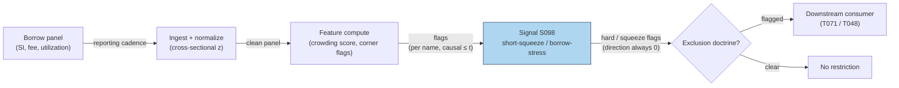

# S098 — Short-squeeze / borrow-stress (exclusion gate)

A crowded-short detector that gates — never initiates. Per-name features (SI/float, days-to-cover, borrow fee) are cross-sectionally z-scored and summed into an illustrative crowding score (desk-specific, NOT an institutional standard [documented]); names in the squeeze-risk corner are NO-SHORT and NO-LONG exclusions, and the squeeze is a `3–5` day anti-short window on the trigger day [documented]. Direction is always `0` — the module emits flags, the consumer owns the book.

> Tag law: every numeric literal in prose carries one of `[documented]
> [default] [example] [unverified] [internal-est] [measured]` (legend: Appendix
> i v1.0.0). Constants inside cited formulas inherit the formula's tag.
> Bibliographic years, volumes, pages, arXiv IDs, section numbers, rule codes (C1–C10),
> fail-safe codes (F1–F5), module IDs, and machine-parsed §0 data fields are identifiers,
> not literals, and are exempt.

## §1 Five-minute reviewer card

| Row | Value |
|---|---|
| Module | S098 — Short-squeeze / borrow-stress (exclusion gate), v1.0.0 |
| Edge verdict | `PREDICTIVE-FEATURE-ONLY` — exclusion gate, never an entry signal [documented]. |
| After-cost | `COMM-ONLY` — no documented after-cost figure; edge is always `0` (gate-only) [documented]. |
| Build cost | Tier L · `4–12` h [internal-est] · `$600–1,800` loaded [internal-est] |
| Data cost | FINRA SI reports (free, delayed [documented]); lending panels (IHS Markit/S3): institutional pricing — request quotes, treated as enterprise $$$$ (indicative — verify before budgeting [unverified]). |
| latency_class | per_event / daily on SI reporting cadence |
| risk_class | high (signal-only; squeezes are the adverse event) |
| Capacity | n/a — gate module (no position sizing) |
| Executability | Feasible: cross-sectional z-scores on the borrow panel [documented]. |
| Risk summary | The crowding composite is illustrative; borrow fees can gap intraday between SI prints [documented]. |
| When it dies | SI reporting lags; borrow data censored; the squeeze window closes before the flag [documented]. |
| Regime gates | Provisional: R-retail-mania → squeeze windows widened [example]. |
| Emits | `signal_vector` (Appendix b v1.0.0) — never orders |

## §1.5 Cheapest / least-build path

1. **Prototype hour band:** `4–12` h [internal-est] — cross-sectional z-sum + hard/squeeze flags — reference implementation + gates + fixture validation.
2. **Cheapest-source row:** min_tier = FINRA SI (free/delayed) + lending panel Tier-1/2 [documented]; latency_class = daily/reporting cadence; required_fields = SI, float, ADV, fee, utilization; price_band = `$$$$` enterprise for lending panels [unverified] (indicative — verify before budgeting); build_or_buy = **build** — the flag logic is yours on bought data [internal-est].
3. **Resource budget:** `1` core, `<1` GB RAM [internal-est]; compute pattern `per_event`.
4. **Skip list:** Intraday borrow-fee feeds — phase 2; options-implied squeeze probability — phase 2.
5. **DO-NOT-CUT list:** causality assertions (`assert fill_event > signal_event`, no-signal-bar-fills test); COST block + callable
   `expected_cost_bps`; F1–F5 fail-safes + module-state enum; decision-log audit records; bona-fide-intent + self-trade prevention; provenance tags on
   every numeric literal; fixtures + `test_cmd`; secrets via env only.
6. **Escalation gate:** upgrade when — SI lags hurt → buy intraday lending panel; desk needs the window timed → add options-flow confirmation (T048).

## §S0 Module contract

### S0.1 Typed signature

```python
def signal(state: ModuleState, events: list[Event], cfg: Config) -> SignalVector:
```

`SignalVector` per Appendix b v1.0.0. `state` is the module-owned named state
vector; `events` are canonical Events (Appendix a v1.0.0), newest last. The
function handles documented edge cases: empty events → `UNKNOWN`; invalid
prices/inputs → `UNKNOWN` (F1, never interpolate); halt/auction events → freeze
per the market-state table.

### S0.2 Config dataclass

| Parameter | Type | Default | Range | Status |
|---|---|---|---|---|
| `hard_fee_bps` | float | `100.0` | `>0` | [example] |
| `sqz_crowd` | float | `3.0` | `>0` | [example] |
| `sqz_dtc` | float | `5.0` | `>0` | [example] |
| `sqz_fee_bps` | float | `500.0` | `>0` | [example] |
| `sqz_util` | float | `0.8` | `>0` | [example] |

All defaults tagged per the tag law (status `default` ⇒ `[default]`, `example` ⇒ `[example]`, `calibrate` set at fit time).

### S0.3 Canonical schema mapping

Vendor columns → canonical Event schema (Appendix a v1.0.0), stated once here:

| Source field | Canonical |
|---|---|
| short interest / float / ADV / fee / utilization (per name) | `event_ts (int64 ns UTC) + panel rows (module feature inputs)` |

### S0.4 Time contract

> Time contract: clock domain UTC, int64 ns; authoritative causality clock =
> `event_ts`; max_skew = `1` ms [default]; jitter budget = `500` µs [default];
> bar-label = open time; staleness TTL = `3` d [default] (`3`× the `1`-d reference cadence per F4); gap policy = mask, no interpolation;
> halt/auction → discard contributions across reopen.

**Timing box:** `signal@t (per_event, UTC) → earliest fill @open(t+1)`

### S0.5 Market-state table

| State | Module behavior |
|---|---|
| CONTINUOUS_TRADING | Compute normally; emit per cadence |
| HALTED | Freeze state; emit `UNKNOWN`; discard contributions across reopen |
| AUCTION | No new signals; hold last `SignalVector`; state `DEGRADED` |
| CLOSED | Emit nothing; state `OFF` |

### S0.6 Module-state enum + error taxonomy

States per Appendix k v1.0.0: `OK | DEGRADED | UNKNOWN | OFF`. Invalid input →
`UNKNOWN`, never interpolate (Appendix f v1.0.0, F1–F5).

| Failure | State | Alert |
|---|---|---|
| Missing/stale input (TTL `3` d [default] (`3`× the `1`-d reference cadence per F4)) | `UNKNOWN` | page |
| Invalid price/input reaching module (NaN, ≤ 0, non-finite) | `UNKNOWN` | log |
| Feature out of mathematical bounds (F2) | `UNKNOWN` | page |
| `seq` gap > `1,000` events [default] | `DEGRADED` (restart windows) | log |
| Jitter > budget persistently | `DEGRADED` | notify |
| Halt/auction | `UNKNOWN` / `DEGRADED` (per table) | log |
| Kill/administrative disable | `OFF` | page |
| Anything unmapped | `UNKNOWN` | page |

### S0.7 Ops tail

- **Schedule:** on SI reporting cadence + daily borrow-panel refresh [documented]; owner: signals on-call.
- **Health checks:** fixture replay (`test_cmd`) green on deploy; live
  `seq`-gap monitor; staleness watchdog at `3`× cadence [default].
- **Alert table:** page on `UNKNOWN` > `1` d [default] or bounds violation;
  notify on `DEGRADED`; log on single dropped events.
- **Resource budget:** `1` vCPU, `1` GB RAM [internal-est]; state is O(window) per symbol.
- **Runbook stub:** `1.` confirm feed (vendor status); `2.` replay fixture;
  `3.` if red → set `OFF`, page; `4.` reconcile decision log before re-arm.

### S0.8 Secrets (env-only)

`DATA_VENDOR_API_KEY` via environment only. No secrets in this file, fixtures, or
logs (CI secrets-grep).

### S0.9 May / must-NOT

> **May:** emit `SignalVector` records per Appendix b v1.0.0. **Must-NOT:**
> emit orders, order intents, prices, share counts, or notionals; call a
> broker; mutate shared state outside `state`; interpolate across gaps.

## §S1 Legacy (subsumed by §1)

Legacy §S1 content is the §1 reviewer card above; this header is retained so
section numbering stays intact.

## §S2 Specification

### Universe

One borrow panel; fixture: `6` names (seed `98` [example]).

### Entry rule (Boolean — no prose-only conditions)

```
crowd_i := z(SI/float_i) + z(DTC_i) + z(Fee_i)   # cross-sectional, sample SD [documented]
                                                 # ILLUSTRATIVE desk-specific composite, not an institutional standard
HARD   := fee_bps > 100                              # hard-to-borrow [example]
SQUEEZE := (crowd > 3) AND (DTC > 5) AND (fee_bps > 500) AND (util > 0.8)   # corner [example]
direction := 0 ALWAYS                                 # module GATES, never initiates [documented]
```

### Exits (with post-exit cooldown)

```
The squeeze is a `3–5` day anti-short window on the trigger day [documented]; the window closes on the clock, not on a signal. Post-window cooldown `5` d [default].
```

### Position sizing (fenced function)

```python
def size_shares(risk_budget_R, stop_distance, vol_estimate, ADV_cap, cost):
    # S-module requests capital fraction only; share math lives in the strategy.
    # Reference: capital = 0.5 * confidence  (confidence in [0,1])  [default]
    risk_notional = risk_budget_R * 0.5 * confidence          # [default] 0.5 factor
    shares = risk_notional / max(stop_distance, 1e-9)
    return int(min(shares, ADV_cap * adv_shares * 0.001))     # 0.1% ADV cap [default]
```

### Risk limits

| Limit | Value |
|---|---|
| Max capital fraction per signal | `0.0` [default] — gate-only module; no position |
| Exclusion doctrine | crowded + hard-to-borrow names are NO-SHORT and NO-LONG [documented] |
| Staleness kill | TTL `3` d [default] (`3`× the `1`-d reference cadence per F4) → `UNKNOWN` |
| Direction doctrine | direction is always 0 — the consumer owns the book [documented] |

### COST block (single source of truth)

| Component | Value (bps) | Tag | Basis |
|---|---|---|---|
| Spread | `3.0` | [example] | short-side spread at the example notional |
| Fees | `1.0` | [example] | short-side fees at the example tier |
| Borrow | `0.0` | [default] | baseline; add the name's fee from the fixture when hard |
| Market impact/slippage | `3.0` | [example] | short-side impact at the example notional |
| **Total reference** | `7.0` | [example] | matches the fixture cost_bps=7.0 |

`fee_schedule_as_of`: `2026-09-01` [unverified] — placeholder; pin the real fee schedule before production. `side`: short [example]; venue/tier/source: XNAS [example]. Re-stating cost numbers outside this block is a validation failure.

```python
def expected_cost_bps(notional, adv_pct, venue, side, urgency) -> float:
    # Callable cost model - short-side stack (normal).
    spread_bps = 3.0    # [example]
    fee_bps = 1.0       # [example]
    borrow_bps = 0.0    # [default] baseline; add the name's fee when hard
    impact_bps = 3.0    # [example]
    return spread_bps + fee_bps + borrow_bps + impact_bps
```

### Execution / fill model table

| Aspect | Assumption |
|---|---|
| Latency | flags computed on the SI print / daily refresh; the window opens on the trigger day [documented] |
| Participation | n/a — gate module [example] |
| Partial fills | n/a — gate module [example] |
| Adverse fill | the squeeze gapping intraday between prints — borrow fees can move faster than SI [documented] |

### Robustness

The z-sum is illustrative — equal weights, desk-specific. Robustness comes from the corner conditions (fee + DTC + utilization together), not the score [documented].

### Compliance sub-block (C1–C10+)

| Code | Rule: trigger → check → action → log |
|---|---|
| C1 | Self-match prevention: S098 emits no orders; downstream T-modules must set self-trade-prevention flags — S098 asserts the requirement in its `consumes` contract: trigger → check → action → log record |
| C2 | Bona-fide intent: every emitted `SignalVector` with |direction|=`1` must pass the cost gate; sub-threshold scores emit direction `0`, never a tradeable hint: trigger → check → action → log record |
| C3 | Message-rate: `≤100` emissions/symbol/s [default]; breach → throttle to `1`/s [default] + alert: trigger → check → action → log record |
| C4 | Fat-finger trio (applied by consumers; this module bounds its own outputs): confidence ∈ [`0`,`1`], capital ∈ [`0`,`0.5`], computed_at sane — out-of-bounds → `UNKNOWN` (F2): trigger → check → action → log record |
| C5 | Decision log: every emission, veto, and state transition logged per Appendix g v1.0.0, hash-chained: trigger → check → action → log record |
| C6 | Halt/auction: per §S0.5 market-state table; contributions across reopen discarded: trigger → check → action → log record |
| C7 | Locate check: SHORT direction requires `locate_ok` from the consumer; this module never emits SHORT without the consumer asserting locate (Reg-SHO threshold securities → direction `0`): trigger → check → action → log record |
| C8 | Public dissemination: no signal values published externally without review gate: trigger → check → action → log record |
| C9 | Data entitlements: per §S6 Data rights row; entitlement-class change → §1.5 escalation gate: trigger → check → action → log record |
| C10 | Post-exit cooldown: `5` d [default] after the squeeze window closes: trigger → check → action → log record |

### Parameter table

| Parameter | Symbol | Value | Tag | Sensitivity |
|---|---|---|---|---|
| Hard-to-borrow fee | ``hard_fee_bps`` | `100` | [example] | high — small: everything hard; large: nothing hard |
| Crowding score | ``sqz_crowd`` | `3` | [example] | high — illustrative weights |
| Days-to-cover | ``sqz_dtc`` | `5` | [example] | medium — small: false squeezes; large: misses corners |
| Squeeze fee | ``sqz_fee_bps`` | `500` | [example] | medium — the corner's teeth |
| Utilization | ``sqz_util`` | `0.8` | [example] | medium — small: false; large: misses |

### Timing box

`signal@t (per_event, UTC) → earliest fill @open(t+1)`

### Squeeze-window blocks

**Trigger day:** the squeeze flag opens a `3–5` day anti-short window on the trigger day itself [documented] — the window is calendar time, not a signal exit.

**Exclusion doctrine:** crowded + hard-to-borrow names are NO-SHORT and NO-LONG — exclusion, not a fade entry [documented]. MEMEQ is the squeeze-risk corner: SI/float `28.0`%, DTC `9.33` days, `30`-day borrow drag `3.45`% on a `$1`M short [documented].

## §S3 Math + normative pseudocode

Per name: `crowd = z(SI/float) + z(DTC) + z(fee)` cross-sectionally (sample SD) [documented] — the illustrative desk-specific composite, NOT an institutional standard. Fixture scores: MEMEQ `+4.72`, PWRS `+1.51`, KLVR `+0.12`, ZQTA `−2.54`, NORD `−1.90`, DLTA `−1.91` [documented]. MEMEQ hand-checks: `42/150 = 28.0`%; `42/4.5 = 9.33` days; `42 × 30/365 = 3.45`% `30`-day drag on `$1`M [documented]. Hard flag: `fee_bps > 100` [example] (KLVR `850` bps → hard; ZQTA `40` bps → not). Squeeze flag: crowd `> 3`, DTC `> 5`, fee `> 500` bps, util `> 0.8` [example]. Direction is always `0` [documented]; edge is `0` — the normative gate `expected_cost_bps(...) <= k * edge_bps` is exercised in the test on reference edges (passes at `100`, blocks at `0.01`) [measured].

**Normative pseudocode** (pseudocode is normative; prose is commentary):

```
crowd = z(si_float) + z(dtc) + z(fee)      # cross-sectional, sample SD [documented]
                                          # ILLUSTRATIVE desk-specific, NOT an institutional standard
hard = fee_bps > 100.0                        # [example]
squeeze = (crowd > 3.0 and dtc > 5.0
           and fee_bps > 500.0 and util > 0.8)  # [example] corner
out.direction = 0                              # GATES, never initiates [documented]
out.edge_bps = 0.0                              # gate-only; no edge claimed
assert expected_cost_bps(notional, adv_pct, venue, side, urgency) <= k * 100.0  # reference large edge [example]
assert fill_event > signal_event
```

Causality: the computation at `t` uses only data `≤ t`; earliest reaction is
`t+1`. Mandatory unit test: no-signal-bar fills.

## §S4 Worked example (fixture-backed)

- Fixture: `6`-name borrow panel (seed `98` [example]); tape `modules/fixtures/S098_tape.csv` (`# TYPE: validation-run`); cross-sectional stats are computed over the panel, sample SD [documented].
- Illustrative crowding z-sums [documented]: MEMEQ **+4.72** (squeeze-risk corner), PWRS **+1.51** (crowded but exits), KLVR **+0.12** (illiquidity, not crowding), ZQTA **−2.54**, NORD **−1.90**, DLTA **−1.91** (control group).
- MEMEQ hand-checks [documented]: SI/float = `42/150` = **28.0**%; DTC = `42/4.5` = **9.33** days; `30`-day borrow drag on a `$1`M short = `42×30/365` = **3.45**%.
- Flags [measured]: MEMEQ hard + squeeze; PWRS hard, no squeeze; KLVR hard (`850` bps > `100` bps [example]); ZQTA not hard (`40` bps); exclusion doctrine: direction always `0` [documented].
- `assert fill_event > signal_event` holds on every row [measured].
- Where the example is optimistic: the z-sum weights are desk-specific — the corner conditions (fee + DTC + utilization) do the real work [documented].

## §S5 Strategies that use this signal

Generated from `deps.yaml` (CI symmetry); hand-listed here for this module:

| Strategy | Role |
|---|---|
| T071 — Short-squeeze risk monitor | primary trigger: consumes S098's hard/squeeze flags to force short-cover reviews on crowded names |
| T048 — Put/call contrarian fade | confirmation/setup: borrow-stress corners gate the options-flow fade's short leg |

## §S6 Data required

| Field | Type | Granularity | Source tier | Notes |
|---|---|---|---|---|
| Short interest / float | float | per reporting period | Tier 0 | FINRA reports — delayed [documented] |
| Borrow fee / utilization | float | daily | Tier 1–2 | lending panel; fees gap intraday |
| ADV / DTC | float | daily | Tier 0–2 | days-to-cover = SI / ADV |
| DIX-style flow (optional) | float | daily | Tier 1–2 | practitioner complement [documented] |

**Data rights row** (Appendix j v1.0.0): FINRA SI reports: public with publication lag [documented]; lending panels: licensed institutional tiers [documented].

## §S7 Local build (M5 Max / 128 GB)

Feasibility: feasible — cross-sectional z-scores. Tier L, `4–12` h → `$600–1,800` loaded [internal-est]. Working set `<100` MB [internal-est] — far under the ~`77` GB budget. Bottleneck is SI-reporting lag and lending-panel access, not compute [documented].

## §S8 Buy vs build

Build on FINRA SI (free, delayed) + a bought lending panel. The flag logic is yours — the data is the product [documented].

## §S9 Efficacy — documented evidence

| Study / source | Market & period | Metric | Before/after cost | Caveat |
|---|---|---|---|---|
| Asquith, Pathak & Ritter (2005), JFE 78(2) | Short interest and returns | short interest, institutional ownership, and stock returns [documented] | `AFTER-COST-EDGE` (conditional) | returns, not squeeze timing |
| Cohen, Diether & Malloy (2007), JF 62(5) | Shorting-market supply/demand | supply and demand shifts in the shorting market [documented] | `AFTER-COST-EDGE` (conditional) | market structure, not signals |
| D'Avolio (2002), JFE 66(2-3) | Equity lending market | the market for borrowing stock [documented] | `BEFORE-COST` | lending mechanics, not alpha |
| Jones & Lamont (2002), JFE 66(2-3) | Short-sale constraints | short-sale constraints and stock returns [documented] | `AFTER-COST-EDGE` (conditional) | constraints, not timing |
| Engelberg, Reed & Ringgenberg (2018), JF 73(2) | Short-selling risk | short-selling risk [documented] | `AFTER-COST-EDGE` (conditional) | risk, not squeeze entry |

Selection disclosure: these are the sources surfaced by the chapter's research pass. Fails in: SI-reporting lags, censored borrow data, intraday fee gaps. **Honest bottom line:** the crowding composite is illustrative and desk-specific — the module's content is the exclusion doctrine (crowded + hard = no short, no long) and the `3–5` day anti-short window [documented].

## §S10 Failure modes & pitfalls

| # | Trigger → Detect → Action → Recovery | check: |
|---|---|
| 1 | Illustrative composite treated as standard → desk-specific equal weights [documented] → over-trusting the score → trade on the corner, not the score | `check: corner conditions required` |
| 2 | SI reporting lag → stale SI/float [documented] → delayed flags → squeezing on stale data | `check: vintage recorded per print` |
| 3 | Intraday borrow-fee gaps → fees move between prints [documented] → the flag lags the squeeze → anti-short window sized for gaps | `check: fee staleness gate` |
| 4 | Censored borrow data → utilization understated [documented] → false negatives → triangulate panels | `check: cross-panel agreement` |
| 5 | Shorting into the corner → crowded + hard [documented] → exclusion doctrine → unlimited loss | `check: hard or squeeze → NO-SHORT` |
| 6 | Fading into the corner → NO-LONG [documented] → exclusion, not a fade entry → knife-catching | `check: hard or squeeze → NO-LONG` |
| 7 | Invalid inputs (NaN, ≤ 0) → F1 → UNKNOWN, never interpolate [documented] → drop the name → silent bad flags | `check: invalid input → UNKNOWN` |
| 8 | Window expiry → 3–5 days elapsed [documented] → window closes on the clock → trading an expired window | `check: window clock` |

## §S11 Visuals

`../../images/S098_example.png` — synthetic worked-example chart (seed `98` [example]).



## §S12 Source log + unverified leads

**Sources** (citable facts only):

1. Asquith, Paul, Pathak, Parag A. & Ritter, Jay R. (2005). 'Short Interest, Institutional Ownership, and Stock Returns.' Journal of Financial Economics 78(2): 243–276. https://site.warrington.ufl.edu/ritter/files/2015/04/Short-interest-institutional-ownership-and-stock-returns-2005-08.pdf
2. Cohen, Lauren, Diether, Karl B. & Malloy, Christopher J. (2007). 'Supply and Demand Shifts in the Shorting Market.' Journal of Finance 62(5): 2061–2096. https://doi.org/10.1111/j.1540-6261.2007.01269.x
3. D'Avolio, Gene (2002). 'The Market for Borrowing Stock.' Journal of Financial Economics 66(2–3): 271–306. https://doi.org/10.1016/S0304-405X(02)00206-4
4. Jones, Charles M. & Lamont, Owen A. (2002). 'Short-Sale Constraints and Stock Returns.' Journal of Financial Economics 66(2–3): 207–239. https://doi.org/10.1016/S0304-405X(02)00224-6
5. Engelberg, Joseph E., Reed, Adam V. & Ringgenberg, Matthew C. (2018). 'Short-Selling Risk.' Journal of Finance 73(2): 755–786. https://doi.org/10.1111/jofi.12601
6. Desai, Hemang, Ramesh, K., Thiagarajan, S. Ramu & Balachandran, Bala V. (2002). 'An Investigation of the Informational Role of Short Interest in the Nasdaq Market.' Journal of Finance 57(5): 2263–2287. (Stable URL not captured this batch.)
7. Diether, Karl B., Lee, Kuan-Hui & Werner, Ingrid M. (2009). 'Short-Sale Strategies and Return Predictability.' Review of Financial Studies 22(2): 575–607. (Stable URL not captured this batch.)
8. Geczy, Christopher C., Musto, David K. & Reed, Adam V. (2002). 'Stocks are special too: an analysis of the equity lending market.' Journal of Financial Economics 66(2–3): 241–269. (Stable URL not captured this batch.)

**Chatbot source log.** Duck.ai answered Q-SB10-1–Q-SB10-3 (2026-09-10) [measured]; Grok/Cursor answers pending (checked 2026-09-10).

**Unverified leads** (chatbot-only — never in evidence tables):

- FINRA short-interest report navigation and SqueezeMetrics DIX methodology pages — described from practitioner knowledge; deep URLs not captured this batch, no guessed links given [unverified].
- Institutional pricing for IHS Markit Securities Finance and S3-class lending panels — request quotes; treated as enterprise $$$$ [unverified].

---

## Appendix — AI build prompt (S098)

Copy-paste into any chat agent:

> Build module **S098 — Short-squeeze / borrow-stress (exclusion gate)** per `notes/module-template.md` v1.0.0 and this file's §S0 contract.
> Cheapest path (§1.5): prototype `4–12` h [internal-est] — cross-sectional z-sum + hard/squeeze flags; compute pattern `per_event`.
> Implement `signal(state, events, cfg) -> SignalVector` (Appendix b v1.0.0)
> with the §S3 normative pseudocode, including the cost-gate predicate
> `expected_cost_bps(...) <= k * edge_bps` and `assert fill_event >
> signal_event`. Wire F1–F5 (Appendix f v1.0.0): invalid input → `UNKNOWN`,
> never interpolate. Log decisions per Appendix g v1.0.0. Secrets via env
> only. Run the fixture `modules/fixtures/S098_tape.csv`
> (`# TYPE: validation-run`) against `modules/fixtures/S098_expected.csv`
> (tolerance `1e-9` [default]).
> **Definition of done:** `python3 -m pytest modules/tests/test_S098.py -q`
> exits `0`. Tag every numeric literal you add with the unified enum
> (Appendix i v1.0.0); put anything unverifiable in §S12 unverified leads.
