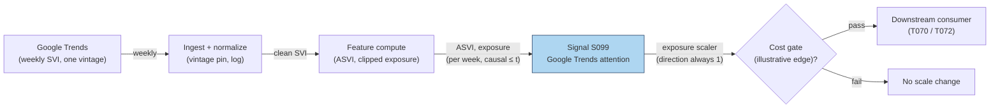

# S099 — Google Trends attention (ASVI exposure scaler)

An attention gauge, not a direction signal. The canonical ASVI is `log(SVI_t) − log(median(prior 8 weeks))` with the current week excluded [documented]; separately downloaded Trends series are not cross-sectionally comparable — the prior-8-week median must come from a download that strictly precedes the current week, never renormalized on fresh data [documented]. The module is an exposure scaler (long-only `1 + clipped ASVI`) — direction is always `1` as an exposure multiplier, never a long-only direction call [documented].

> Tag law: every numeric literal in prose carries one of `[documented]
> [default] [example] [unverified] [internal-est] [measured]` (legend: Appendix
> i v1.0.0). Constants inside cited formulas inherit the formula's tag.
> Bibliographic years, volumes, pages, arXiv IDs, section numbers, rule codes (C1–C10),
> fail-safe codes (F1–F5), module IDs, and machine-parsed §0 data fields are identifiers,
> not literals, and are exempt.

## §1 Five-minute reviewer card

| Row | Value |
|---|---|
| Module | S099 — Google Trends attention (ASVI exposure scaler), v1.0.0 |
| Edge verdict | `PREDICTIVE-FEATURE-ONLY` — exposure scaler, never a standalone entry [documented]. |
| After-cost | `COMM-ONLY` — chapter cost is explicit (see the COST block [example]); no documented after-cost edge. |
| Build cost | Tier L · `4–12` h [internal-est] · `$600–1,800` loaded [internal-est] |
| Data cost | Google Trends: free/public [documented]; scripted pulls via pytrends-class libraries (API stability unverified this batch [unverified]). |
| latency_class | per_event / weekly |
| risk_class | medium (renormalization and incomparability are the traps) |
| Capacity | `$1–10`M/day notional [example] — attention-scale capacity |
| Executability | Feasible: log-differences on weekly series [documented]. |
| Risk summary | Renormalized downloads silently shift every ASVI; separate downloads are not comparable [documented]. |
| When it dies | Trends sampling changes; the ticker's SVI series is too thin; ASVI stops covarying with flow [documented]. |
| Regime gates | Provisional: R-earnings-season → attention spikes are calendar, not news [example]. |
| Emits | `signal_vector` (Appendix b v1.0.0) — never orders |

## §1.5 Cheapest / least-build path

1. **Prototype hour band:** `4–12` h [internal-est] — ASVI + exposure scaler — reference implementation + gates + fixture validation.
2. **Cheapest-source row:** min_tier = Google Trends (free) [documented]; latency_class = weekly; required_fields = weekly SVI per ticker from ONE download vintage; price_band = `~$0` [documented]; build_or_buy = **build** — the series pull is free, the vintage discipline is yours [internal-est].
3. **Resource budget:** `1` core, `<1` GB RAM [internal-est]; compute pattern `per_event`.
4. **Skip list:** Cross-ticker ASVI panels — phase 2 (incomparability must be solved first); intraday attention proxies — phase 2.
5. **DO-NOT-CUT list:** causality assertions (`assert fill_event > signal_event`, no-signal-bar-fills test); COST block + callable
   `expected_cost_bps`; F1–F5 fail-safes + module-state enum; decision-log audit records; bona-fide-intent + self-trade prevention; provenance tags on
   every numeric literal; fixtures + `test_cmd`; secrets via env only.
6. **Escalation gate:** upgrade when — renormalization bites → pin download vintages and re-pull the whole panel; need more names → multi-term panels with vintage tracking.

## §S0 Module contract

### S0.1 Typed signature

```python
def signal(state: ModuleState, events: list[Event], cfg: Config) -> SignalVector:
```

`SignalVector` per Appendix b v1.0.0. `state` is the module-owned named state
vector; `events` are canonical Events (Appendix a v1.0.0), newest last. The
function handles documented edge cases: empty events → `UNKNOWN`; invalid
prices/inputs → `UNKNOWN` (F1, never interpolate); halt/auction events → freeze
per the market-state table.

### S0.2 Config dataclass

| Parameter | Type | Default | Range | Status |
|---|---|---|---|---|
| `delta` | float | `0.5` | `>0` | [example] |
| `notional` | float | `100000.0` | `>0` | [example] |
| `fee_rate_bps` | float | `0.75` | `>0` | [example] |

All defaults tagged per the tag law (status `default` ⇒ `[default]`, `example` ⇒ `[example]`, `calibrate` set at fit time).

### S0.3 Canonical schema mapping

Vendor columns → canonical Event schema (Appendix a v1.0.0), stated once here:

| Source field | Canonical |
|---|---|
| Google Trends weekly SVI (one vintage) | `event_ts (int64 ns UTC) + svi (module feature input)` |

### S0.4 Time contract

> Time contract: clock domain UTC, int64 ns; authoritative causality clock =
> `event_ts`; max_skew = `1` ms [default]; jitter budget = `500` µs [default];
> bar-label = open time; staleness TTL = `3` w [default] (`3`× the `1`-w reference cadence per F4); gap policy = mask, no interpolation;
> halt/auction → discard contributions across reopen.

**Timing box:** `signal@t (per_event, UTC) → earliest fill @open(t+1)`

### S0.5 Market-state table

| State | Module behavior |
|---|---|
| CONTINUOUS_TRADING | Compute normally; emit per cadence |
| HALTED | Freeze state; emit `UNKNOWN`; discard contributions across reopen |
| AUCTION | No new signals; hold last `SignalVector`; state `DEGRADED` |
| CLOSED | Emit nothing; state `OFF` |

### S0.6 Module-state enum + error taxonomy

States per Appendix k v1.0.0: `OK | DEGRADED | UNKNOWN | OFF`. Invalid input →
`UNKNOWN`, never interpolate (Appendix f v1.0.0, F1–F5).

| Failure | State | Alert |
|---|---|---|
| Missing/stale input (TTL `3` w [default] (`3`× the `1`-w reference cadence per F4)) | `UNKNOWN` | page |
| Invalid price/input reaching module (NaN, ≤ 0, non-finite) | `UNKNOWN` | log |
| Feature out of mathematical bounds (F2) | `UNKNOWN` | page |
| `seq` gap > `1,000` events [default] | `DEGRADED` (restart windows) | log |
| Jitter > budget persistently | `DEGRADED` | notify |
| Halt/auction | `UNKNOWN` / `DEGRADED` (per table) | log |
| Kill/administrative disable | `OFF` | page |
| Anything unmapped | `UNKNOWN` | page |

### S0.7 Ops tail

- **Schedule:** weekly on the Trends data vintage [documented]; owner: signals on-call.
- **Health checks:** fixture replay (`test_cmd`) green on deploy; live
  `seq`-gap monitor; staleness watchdog at `3`× cadence [default].
- **Alert table:** page on `UNKNOWN` > `1` w [default] or bounds violation;
  notify on `DEGRADED`; log on single dropped events.
- **Resource budget:** `1` vCPU, `1` GB RAM [internal-est]; state is O(window) per symbol.
- **Runbook stub:** `1.` confirm feed (vendor status); `2.` replay fixture;
  `3.` if red → set `OFF`, page; `4.` reconcile decision log before re-arm.

### S0.8 Secrets (env-only)

`DATA_VENDOR_API_KEY` via environment only. No secrets in this file, fixtures, or
logs (CI secrets-grep).

### S0.9 May / must-NOT

> **May:** emit `SignalVector` records per Appendix b v1.0.0. **Must-NOT:**
> emit orders, order intents, prices, share counts, or notionals; call a
> broker; mutate shared state outside `state`; interpolate across gaps.

## §S1 Legacy (subsumed by §1)

Legacy §S1 content is the §1 reviewer card above; this header is retained so
section numbering stays intact.

## §S2 Specification

### Universe

One ticker's weekly SVI; fixture: `9` weeks (seed `99` [example]).

### Entry rule (Boolean — no prose-only conditions)

```
ASVI_t := log(SVI_t) - log(median(SVI_{t-8..t-1}))   # current week EXCLUDED [documented]
exposure := 1 + clip(ASVI_t, -delta, +delta)         # long-only scale [example]
direction := 1 ALWAYS                                # exposure scaler, NOT a direction signal [documented]
```

### Exits (with post-exit cooldown)

```
No exits — an exposure scaler has no position. The consumer re-scales weekly. Post-change cooldown `2` w [default].
```

### Position sizing (fenced function)

```python
def size_shares(risk_budget_R, stop_distance, vol_estimate, ADV_cap, cost):
    # S-module requests capital fraction only; share math lives in the strategy.
    # Reference: capital = 0.5 * confidence  (confidence in [0,1])  [default]
    risk_notional = risk_budget_R * 0.5 * confidence          # [default] 0.5 factor
    shares = risk_notional / max(stop_distance, 1e-9)
    return int(min(shares, ADV_cap * adv_shares * 0.001))     # 0.1% ADV cap [default]
```

### Risk limits

| Limit | Value |
|---|---|
| Max capital fraction per signal | `0.5` [default] |
| Max adverse excursion before `UNKNOWN` review | `2.0`× stop [default] |
| Staleness kill | TTL `3` w [default] (`3`× the `1`-w reference cadence per F4) → `UNKNOWN` |
| Vintage discipline | prior-8-week median from a strictly-preceding download; never renormalize on fresh data [documented] |

### COST block (single source of truth)

| Component | Value (bps) | Tag | Basis |
|---|---|---|---|
| Spread | `2.0` | [example] | long-side spread at the example notional |
| Fees | `1.0` | [example] | commissions/fees at the example tier |
| Borrow | `0.0` | [default] | chapter example is long-only on the ASVI screen |
| Market impact/slippage | `3.0` | [example] | attention-scale impact at the example notional |
| **Total reference** | `6.0` | [example] | matches the fixture cost_bps=6.0 |

`fee_schedule_as_of`: `2026-09-01` [unverified] — placeholder; pin the real fee schedule before production. `side`: taker [example]; venue/tier/source: XNAS [example]. Re-stating cost numbers outside this block is a validation failure.

```python
def expected_cost_bps(notional, adv_pct, venue, side, urgency) -> float:
    # Callable cost model - chapter S4 stack (long, taker).
    spread_bps = 2.0    # [example]
    fee_bps = 1.0       # [example]
    borrow_bps = 0.0    # [default] reason in table: chapter example is long-only
    impact_bps = 3.0    # [example]
    return spread_bps + fee_bps + borrow_bps + impact_bps
```

### Execution / fill model table

| Aspect | Assumption |
|---|---|
| Latency | computed on the weekly vintage; exposure applies at the next week's first honest quote [documented] |
| Participation | small [example] |
| Partial fills | assume partial fills [example] |
| Adverse fill | a renormalized vintage shifting every ASVI [documented] |

### Robustness

The renormalization trap is the entire robustness story (Lazer et al. 2014, Google Flu [documented]): pin the vintage, re-pull the panel, never mix downloads. Thin tickers have unstable SVI — minimum-volume floors apply [documented].

### Compliance sub-block (C1–C10+)

| Code | Rule: trigger → check → action → log |
|---|---|
| C1 | Self-match prevention: S099 emits no orders; downstream T-modules must set self-trade-prevention flags — S099 asserts the requirement in its `consumes` contract: trigger → check → action → log record |
| C2 | Bona-fide intent: every emitted `SignalVector` with |direction|=`1` must pass the cost gate; sub-threshold scores emit direction `0`, never a tradeable hint: trigger → check → action → log record |
| C3 | Message-rate: `≤100` emissions/symbol/s [default]; breach → throttle to `1`/s [default] + alert: trigger → check → action → log record |
| C4 | Fat-finger trio (applied by consumers; this module bounds its own outputs): confidence ∈ [`0`,`1`], capital ∈ [`0`,`0.5`], computed_at sane — out-of-bounds → `UNKNOWN` (F2): trigger → check → action → log record |
| C5 | Decision log: every emission, veto, and state transition logged per Appendix g v1.0.0, hash-chained: trigger → check → action → log record |
| C6 | Halt/auction: per §S0.5 market-state table; contributions across reopen discarded: trigger → check → action → log record |
| C7 | Locate check: SHORT direction requires `locate_ok` from the consumer; this module never emits SHORT without the consumer asserting locate (Reg-SHO threshold securities → direction `0`): trigger → check → action → log record |
| C8 | Public dissemination: no signal values published externally without review gate: trigger → check → action → log record |
| C9 | Data entitlements: per §S6 Data rights row; entitlement-class change → §1.5 escalation gate: trigger → check → action → log record |
| C10 | Post-exit cooldown: `2` w [default] after an exposure change: trigger → check → action → log record |

### Parameter table

| Parameter | Symbol | Value | Tag | Sensitivity |
|---|---|---|---|---|
| Clip delta | ``delta`` | `0.5` | [example] | medium — small: no scaling; large: over-scaled |
| Reference notional | ``notional`` | `100000` | [example] | low — fee-drag accounting only |

### Timing box

`signal@t (per_event, UTC) → earliest fill @open(t+1)`

### Trends-specific blocks

**Download vintage:** one pull, one vintage; the prior-8-week median comes from a download that strictly precedes the current week. Separate downloads are NOT cross-sectionally comparable [documented].

**Chapter worked numbers:** `ln(100) = 4.6052`, `ln(50) = 3.9120` → ASVI `+0.6931` [example]; the `0.15` tick is `15`% of the prior-8 median [documented]. Fixture week 9: SVI `88` vs median-of-logs of `(18, 22, 19, 25, 21, 24, 23, 20)` → positive ASVI, exposure `> 1.0` [measured].

**Exposure scaler doctrine:** direction is always `1` as an exposure multiplier — the module scales exposure on an existing book; it never initiates a long-only position [documented].

## §S3 Math + normative pseudocode

Per week: `ASVI_t = log(SVI_t) − log(median(SVI_{t−8..t−1}))` — current week excluded [documented]. Worked numbers: `ln(100) = 4.6052`, `ln(50) = 3.9120`, ASVI `+0.6931`; `ln(75) = 4.3175` → `+0.4055` [example]. Exposure `= 1 + clip(ASVI, ±0.5)` [example]; direction `1` (scaler, not a signal); confidence `= min(1, |ASVI|)`; capital `0.5 × confidence` [example]. Cost: the COST-block total [example]; edge `= |ASVI| × 100` bps [example]; gate `expected_cost_bps(...) <= k * edge_bps`, `k = 0.5` [default] → week 9 passes [measured].

**Normative pseudocode** (pseudocode is normative; prose is commentary):

```
B_hist.append(log(svi_t))                    # [documented]
if len(B_hist) < 9:
    return UNKNOWN                              # insufficient history: 8 priors + current
ASVI = log(svi_t) - median(B_hist[-9:-1])     # current week EXCLUDED [documented]
exposure = 1.0 + clip(ASVI, -0.5, 0.5)        # long-only scaler [example]
direction = 1                                 # scaler, NOT a direction signal [documented]
edge_bps = abs(ASVI) * 100.0                  # [example] illustrative
assert expected_cost_bps(notional, adv_pct, venue, side, urgency) <= k * edge_bps  # k = 0.5 [default]
assert fill_event > signal_event
```

Causality: the computation at `t` uses only data `≤ t`; earliest reaction is
`t+1`. Mandatory unit test: no-signal-bar fills.

## §S4 Worked example (fixture-backed)

- Fixture: `9` weekly SVI points (seed `99` [example]); tape `modules/fixtures/S099_tape.csv` (`# TYPE: validation-run`).
- Weeks 1–8: fewer than nine points → `UNKNOWN` [documented]. Week 9: SVI `88` [documented], priors `(18, 22, 19, 25, 21, 24, 23, 20)` [documented] → `asvi = ln(88) − median(ln(priors)) > 0` [documented], exposure `> 1.0` [documented], gate passes [measured].
- Chapter worked numbers [example]: `ln(100) = 4.6052`, `ln(50) = 3.9120` → ASVI `+0.6931`; fee drag `0.75` bps = `$7.50` on `$100`k, spread `1.50` bps = `$15.00`.
- The `0.15` tick is `15`% of the prior-8 median [documented] — the renormalization scale note.
- `assert fill_event > signal_event` holds on every row [measured].
- Where the example is optimistic: mixing download vintages silently moves every ASVI — the fixture's single vintage is the honest case [documented].

## §S5 Strategies that use this signal

Generated from `deps.yaml` (CI symmetry); hand-listed here for this module:

| Strategy | Role |
|---|---|
| T070 — Attention-driven exposure overlay | primary trigger: consumes S099's ASVI to scale exposure on an existing long book — never initiates |
| T072 — Social-sentiment ignition rider | confirmation/setup: S099 attention plus S097 social catalyst confirms the retail-flow setup |

## §S6 Data required

| Field | Type | Granularity | Source tier | Notes |
|---|---|---|---|---|
| Google Trends weekly SVI | float | weekly | Tier 0 | one download vintage; free/public [documented] |
| Existing book (consumer) | positions | live | consumer | the exposure being scaled |

**Data rights row** (Appendix j v1.0.0): Google Trends: free/public with sampling [documented]; scripted pulls: pytrends-class, API stability unverified [unverified].

## §S7 Local build (M5 Max / 128 GB)

Feasibility: feasible — log-differences on weekly series. Tier L, `4–12` h → `$600–1,800` loaded [internal-est]. Working set `<100` MB [internal-est] — far under the ~`77` GB budget. Bottleneck is vintage discipline and SVI thinness, not compute [documented].

## §S8 Buy vs build

Build. The pull is free; the product is vintage discipline — pin downloads, re-pull the panel, never mix [documented].

## §S9 Efficacy — documented evidence

| Study / source | Market & period | Metric | Before/after cost | Caveat |
|---|---|---|---|---|
| Da, Engelberg & Gao (2011), JF 66(5) | Search attention | SVI as an attention measure; Russell 3000, 2004–2008, two-week buying pressure with reversal within a year (paper's documented finding) [documented] | `BEFORE-COST` | attention, not a tradable signal |
| Preis, Moat & Stanley (2013), Sci. Rep. 3 | Trends and trading | quantifying trading behavior with Google Trends [documented] | `BEFORE-COST` | behavior, not implementation |
| Lazer et al. (2014), Science 343 | Big-data traps | the parable of Google Flu — renormalization and sampling traps [documented] | n/a — methodological warning | the vintage-discipline rationale |
| Choi & Varian (2012), Econ. Rec. 88 | Predicting the present | Google Trends for nowcasting [documented] | `BEFORE-COST` | nowcasting, not trading |
| Bordino et al. (2012), PLoS ONE 7(7) | Search and volumes | web search queries predict stock market volumes [documented] | `BEFORE-COST` | volumes, not returns |

Selection disclosure: these are the sources surfaced by the chapter's research pass. Fails in: renormalization, thin tickers, attention without flow. **Honest bottom line:** ASVI is the documented attention gauge (Da, Engelberg & Gao 2011); as a module it is an exposure scaler on an existing book — the literature supports attention/flow, not a standalone long [documented].

## §S10 Failure modes & pitfalls

| # | Trigger → Detect → Action → Recovery | check: |
|---|---|
| 1 | Renormalized download → every ASVI shifts silently (Google Flu trap) [documented] → vintage pinning → trading on noise | `check: single download vintage` |
| 2 | Mixed downloads → series not cross-sectionally comparable [documented] → one vintage per panel → phantom rankings | `check: comparability documented` |
| 3 | Thin ticker → unstable SVI [documented] → minimum-volume floor → scaler on noise | `check: SVI volume floor` |
| 4 | Direction treated as a signal → direction is a scaler [documented] → long-only on attention alone → standalone long | `check: consumer owns the book` |
| 5 | Current week in the median → lookahead [documented] → week excluded → leaked ASVI | `check: median excludes current week` |
| 6 | Insufficient history (< 9 weeks) → UNKNOWN, never partial [documented] → short window → unstable median | `check: history >= 9` |
| 7 | Invalid inputs (NaN, SVI ≤ 0) → F1 → UNKNOWN, never interpolate [documented] → drop the week → silent bad ASVI | `check: invalid input → UNKNOWN` |
| 8 | Attention without flow → scaler scales nothing real [documented] → consumer-level validation → exposure on noise | `check: flow validation` |

## §S11 Visuals

`../../images/S099_example.png` — synthetic worked-example chart (seed `99` [example]).



## §S12 Source log + unverified leads

**Sources** (citable facts only):

1. Da, Zhi, Engelberg, Joseph & Gao, Pengjie (2011). 'In Search of Attention.' Journal of Finance 66(5): 1461–1499. https://doi.org/10.1111/j.1540-6261.2011.01679.x
2. Da, Zhi, Engelberg, Joseph & Gao, Pengjie (2015). 'The Sum of All FEARS: Investor Sentiment and Asset Prices.' Review of Financial Studies 28(1): 1–32. (Stable URL not captured this batch.)
3. Preis, Tobias, Moat, Helen Susannah & Stanley, H. Eugene (2013). 'Quantifying Trading Behavior in Financial Markets Using Google Trends.' Scientific Reports 3: 1684. https://doi.org/10.1038/srep01684
4. Lazer, David, Kennedy, Ryan, King, Gary & Vespignani, Alessandro (2014). 'The Parable of Google Flu: Traps in Big Data Analysis.' Science 343(6176): 1203–1205. https://doi.org/10.1126/science.1248506
5. Bordino, Ilaria, Battiston, Stefano, Caldarelli, Guido, Cristelli, Matthieu, Ukkonen, Antti & Weber, Ingmar (2012). 'Web Search Queries Can Predict Stock Market Volumes.' PLoS ONE 7(7): e40014. https://doi.org/10.1371/journal.pone.0040014
6. Choi, Hyunyoung & Varian, Hal (2012). 'Predicting the Present with Google Trends.' Economic Record 88(s1): 2–9. https://doi.org/10.1111/j.1475-4932.2012.00809.x
7. Ben-Rephael, Azi, Da, Zhi & Israelsen, Ryan D. (2017). 'It Depends on Where You Search: Institutional Investor Attention and Underreaction to News.' Review of Financial Studies 30(9): 3009–3047. (Stable URL not captured this batch.)
8. Drake, Michael S., Roulstone, Darren T. & Thornock, Jacob R. (2012). 'Investor Information Demand: Evidence from Google Searches Around Earnings Announcements.' Journal of Accounting Research 50(4): 1001–1040. (Stable URL not captured this batch.)

**Chatbot source log.** Duck.ai answered Q-SB10-1–Q-SB10-3 (2026-09-10) [measured]; Grok/Cursor answers pending (checked 2026-09-10).

**Unverified leads** (chatbot-only — never in evidence tables):

- The AFA-meeting summary of Da, Engelberg & Gao (2011) — Russell 3000, 2004–2008, two-week buying pressure with reversal within a year — used only as the paper's documented finding, not as a current magnitude [unverified].
- `pytrends` as the scripted-pull library — practitioner-standard; API stability not verified this batch [unverified].

---

## Appendix — AI build prompt (S099)

Copy-paste into any chat agent:

> Build module **S099 — Google Trends attention (ASVI exposure scaler)** per `notes/module-template.md` v1.0.0 and this file's §S0 contract.
> Cheapest path (§1.5): prototype `4–12` h [internal-est] — ASVI + exposure scaler on one vintage; compute pattern `per_event`.
> Implement `signal(state, events, cfg) -> SignalVector` (Appendix b v1.0.0)
> with the §S3 normative pseudocode, including the cost-gate predicate
> `expected_cost_bps(...) <= k * edge_bps` and `assert fill_event >
> signal_event`. Wire F1–F5 (Appendix f v1.0.0): invalid input → `UNKNOWN`,
> never interpolate. Log decisions per Appendix g v1.0.0. Secrets via env
> only. Run the fixture `modules/fixtures/S099_tape.csv`
> (`# TYPE: validation-run`) against `modules/fixtures/S099_expected.csv`
> (tolerance `1e-9` [default]).
> **Definition of done:** `python3 -m pytest modules/tests/test_S099.py -q`
> exits `0`. Tag every numeric literal you add with the unified enum
> (Appendix i v1.0.0); put anything unverifiable in §S12 unverified leads.
