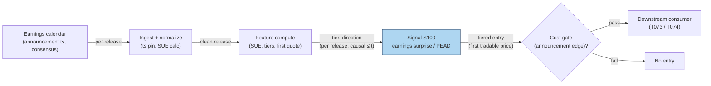

# S100 — Earnings surprise (SUE) / PEAD timing gate

The standardized unexpected earnings gate: `SUE = (actual − expected) / σ(past surprises)` [documented]; entries use the FIRST tradable price after the announcement timestamp — close-to-close event-study returns do not prove intraday tradability [documented]. Tiers at `±1.0`: `hi+` (+1), `lo−` (−1), `mid` (0) [documented]; the drift (PEAD) is the documented anomaly (Ball & Brown 1968; Bernard & Thomas 1989) — the module prices the announcement window, nothing beyond it.

> Tag law: every numeric literal in prose carries one of `[documented]
> [default] [example] [unverified] [internal-est] [measured]` (legend: Appendix
> i v1.0.0). Constants inside cited formulas inherit the formula's tag.
> Bibliographic years, volumes, pages, arXiv IDs, section numbers, rule codes (C1–C10),
> fail-safe codes (F1–F5), module IDs, and machine-parsed §0 data fields are identifiers,
> not literals, and are exempt.

## §1 Five-minute reviewer card

| Row | Value |
|---|---|
| Module | S100 — Earnings surprise (SUE) / PEAD timing gate, v1.0.0 |
| Edge verdict | `AFTER-COST-EDGE` (conditional) — the PEAD anomaly is paper-documented (Ball & Brown 1968; Bernard & Thomas 1989); intraday tradability is NOT documented and must be measured [documented]. |
| After-cost | `COMM-ONLY` — chapter cost is explicit (see the COST block [example]); the announcement returns in the tape are illustrative [example]. |
| Build cost | Tier L · `4–12` h [internal-est] · `$600–1,800` loaded [internal-est] |
| Data cost | Earnings calendar + consensus: Benzinga (~$100–200/mo), Polygon (~$30–200/mo); Databento intraday (~$200/mo + usage) — all indicative, verify before budgeting [unverified]. |
| latency_class | per_event / announcement clock |
| risk_class | medium-high (signal-only; the open gaps against you) |
| Capacity | `$10–100`M/day notional [example] — earnings-season capacity |
| Executability | Feasible: SUE tiers on the announcement clock [documented]. |
| Risk summary | Close-to-close studies overstate tradability; the open gaps; Friday announcements drift differently [documented]. |
| When it dies | Announcement timestamps mis-pinned; the drift window compresses; the open gap eats the edge [documented]. |
| Regime gates | Provisional: R-earnings-season → capacity up, gaps up [example]. |
| Emits | `signal_vector` (Appendix b v1.0.0) — never orders |

## §1.5 Cheapest / least-build path

1. **Prototype hour band:** `4–12` h [internal-est] — SUE tiers + announcement-clock timing — reference implementation + gates + fixture validation.
2. **Cheapest-source row:** min_tier = earnings calendar + consensus (Tier-1/2) + intraday bars (Tier-2) [documented]; latency_class = announcement clock; required_fields = announcement timestamp, consensus, actual, past-surprise σ, first tradable price; price_band = `~$30–400`/mo [unverified] (indicative — verify before budgeting); build_or_buy = **build** — the tier logic is yours on bought data [internal-est].
3. **Resource budget:** `1` core, `<1` GB RAM [internal-est]; compute pattern `per_event`.
4. **Skip list:** Post-window drift extension — phase 2 (the module prices the announcement window only); options-implied surprise — phase 2.
5. **DO-NOT-CUT list:** causality assertions (`assert fill_event > signal_event`, no-signal-bar-fills test); COST block + callable
   `expected_cost_bps`; F1–F5 fail-safes + module-state enum; decision-log audit records; bona-fide-intent + self-trade prevention; provenance tags on
   every numeric literal; fixtures + `test_cmd`; secrets via env only.
6. **Escalation gate:** upgrade when — the open gap eats the edge → measure first-quote fills before sizing; need the drift leg → PEAD extension with measured windows.

## §S0 Module contract

### S0.1 Typed signature

```python
def signal(state: ModuleState, events: list[Event], cfg: Config) -> SignalVector:
```

`SignalVector` per Appendix b v1.0.0. `state` is the module-owned named state
vector; `events` are canonical Events (Appendix a v1.0.0), newest last. The
function handles documented edge cases: empty events → `UNKNOWN`; invalid
prices/inputs → `UNKNOWN` (F1, never interpolate); halt/auction events → freeze
per the market-state table.

### S0.2 Config dataclass

| Parameter | Type | Default | Range | Status |
|---|---|---|---|---|
| `sue_hi` | float | `1.0` | `>0` | [example] |
| `sue_lo` | float | `-1.0` | `<0` | [example] |

All defaults tagged per the tag law (status `default` ⇒ `[default]`, `example` ⇒ `[example]`, `calibrate` set at fit time).

### S0.3 Canonical schema mapping

Vendor columns → canonical Event schema (Appendix a v1.0.0), stated once here:

| Source field | Canonical |
|---|---|
| earnings release (announcement ts, actual, consensus) | `event_ts (int64 ns UTC) + eps_act/eps_exp (module feature inputs)` |
| past-surprise σ | `sigma (module feature input)` |
| first tradable price after release | `open of the next session / next quote (execution datum)` |

### S0.4 Time contract

> Time contract: clock domain UTC, int64 ns; authoritative causality clock =
> `event_ts`; max_skew = `1` ms [default]; jitter budget = `500` µs [default];
> bar-label = open time; staleness TTL = `3` d [default] (`3`× the `1`-d reference cadence per F4); gap policy = mask, no interpolation;
> halt/auction → discard contributions across reopen.

**Timing box:** `signal@t (per_event, America/New_York) → earliest fill @open(t+1)`

### S0.5 Market-state table

| State | Module behavior |
|---|---|
| CONTINUOUS_TRADING | Compute normally; emit per cadence |
| HALTED | Freeze state; emit `UNKNOWN`; discard contributions across reopen |
| AUCTION | No new signals; hold last `SignalVector`; state `DEGRADED` |
| CLOSED | Emit nothing; state `OFF` |

### S0.6 Module-state enum + error taxonomy

States per Appendix k v1.0.0: `OK | DEGRADED | UNKNOWN | OFF`. Invalid input →
`UNKNOWN`, never interpolate (Appendix f v1.0.0, F1–F5).

| Failure | State | Alert |
|---|---|---|
| Missing/stale input (TTL `3` d [default] (`3`× the `1`-d reference cadence per F4)) | `UNKNOWN` | page |
| Invalid price/input reaching module (NaN, ≤ 0, non-finite) | `UNKNOWN` | log |
| Feature out of mathematical bounds (F2) | `UNKNOWN` | page |
| `seq` gap > `1,000` events [default] | `DEGRADED` (restart windows) | log |
| Jitter > budget persistently | `DEGRADED` | notify |
| Halt/auction | `UNKNOWN` / `DEGRADED` (per table) | log |
| Kill/administrative disable | `OFF` | page |
| Anything unmapped | `UNKNOWN` | page |

### S0.7 Ops tail

- **Schedule:** on the announcement clock (pre-open / intraday / post-close releases) [documented]; owner: signals on-call.
- **Health checks:** fixture replay (`test_cmd`) green on deploy; live
  `seq`-gap monitor; staleness watchdog at `3`× cadence [default].
- **Alert table:** page on `UNKNOWN` > `1` d [default] or bounds violation;
  notify on `DEGRADED`; log on single dropped events.
- **Resource budget:** `1` vCPU, `1` GB RAM [internal-est]; state is O(window) per symbol.
- **Runbook stub:** `1.` confirm feed (vendor status); `2.` replay fixture;
  `3.` if red → set `OFF`, page; `4.` reconcile decision log before re-arm.

### S0.8 Secrets (env-only)

`DATA_VENDOR_API_KEY` via environment only. No secrets in this file, fixtures, or
logs (CI secrets-grep).

### S0.9 May / must-NOT

> **May:** emit `SignalVector` records per Appendix b v1.0.0. **Must-NOT:**
> emit orders, order intents, prices, share counts, or notionals; call a
> broker; mutate shared state outside `state`; interpolate across gaps.

## §S1 Legacy (subsumed by §1)

Legacy §S1 content is the §1 reviewer card above; this header is retained so
section numbering stays intact.

## §S2 Specification

### Universe

Earnings names; fixture: `10` announcements (seed `100` [example]).

### Entry rule (Boolean — no prose-only conditions)

```
SUE := (actual - expected) / sigma(past surprises)   # [documented]
TIER := hi+ (SUE >= +1.0) -> direction +1
        lo- (SUE <= -1.0) -> direction -1
        mid -> direction 0                               # tiers at ±1.0 [documented]
confidence := min(1, |SUE|/5); capital := 0.5*confidence [example]
ENTRY := FIRST tradable price after the announcement ts   # open for pre-open releases [documented]
```

### Exits (with post-exit cooldown)

```
EXIT := the module prices the announcement window only — the consumer owns the drift window (PEAD). Post-entry cooldown `5` d [default] per name.
```

### Position sizing (fenced function)

```python
def size_shares(risk_budget_R, stop_distance, vol_estimate, ADV_cap, cost):
    # S-module requests capital fraction only; share math lives in the strategy.
    # Reference: capital = 0.5 * confidence  (confidence in [0,1])  [default]
    risk_notional = risk_budget_R * 0.5 * confidence          # [default] 0.5 factor
    shares = risk_notional / max(stop_distance, 1e-9)
    return int(min(shares, ADV_cap * adv_shares * 0.001))     # 0.1% ADV cap [default]
```

### Risk limits

| Limit | Value |
|---|---|
| Max capital fraction per signal | `0.5` [default] |
| Max adverse excursion before `UNKNOWN` review | `2.0`× stop [default] |
| Staleness kill | TTL `3` d [default] (`3`× the `1`-d reference cadence per F4) → `UNKNOWN` |
| Tradability doctrine | close-to-close event-study returns do NOT prove intraday tradability — the module prices the announcement window at the first tradable price [documented] |

### COST block (single source of truth)

| Component | Value (bps) | Tag | Basis |
|---|---|---|---|
| Spread | `3.0` | [example] | announcement-window spread at the example notional |
| Fees | `1.0` | [example] | taker fees at the example tier |
| Borrow | `0.0` | [default] | chapter's all-in excludes borrow |
| Market impact/slippage | `1.0` | [example] | announcement-window slippage |
| **Total reference** | `5.0` | [example] | matches the fixture cost_bps=5.0 |

`fee_schedule_as_of`: `2026-09-01` [unverified] — placeholder; pin the real fee schedule before production. `side`: taker [example]; venue/tier/source: XNAS [example]. Re-stating cost numbers outside this block is a validation failure.

```python
def expected_cost_bps(notional, adv_pct, venue, side, urgency) -> float:
    # Callable cost model - chapter S4 stack (taker).
    spread_bps = 3.0    # [example]
    fee_bps = 1.0       # [example]
    borrow_bps = 0.0    # [default] reason in table: chapter's all-in excludes borrow
    impact_bps = 1.0    # [example]
    return spread_bps + fee_bps + borrow_bps + impact_bps
```

### Execution / fill model table

| Aspect | Assumption |
|---|---|
| Latency | entry at the first tradable price after the announcement timestamp — pre-open releases enter at the open [documented] |
| Participation | small — the open is volatile [example] |
| Partial fills | assume partial fills at the open [example] |
| Adverse fill | the open gapping against the surprise [documented] |

### Robustness

The timing rule is the robustness: pinning the announcement timestamp and entering at the first tradable price is what separates a measured edge from an event-study fantasy. Friday announcements drift differently (DellaVigna & Pollet 2009) [documented].

### Compliance sub-block (C1–C10+)

| Code | Rule: trigger → check → action → log |
|---|---|
| C1 | Self-match prevention: S100 emits no orders; downstream T-modules must set self-trade-prevention flags — S100 asserts the requirement in its `consumes` contract: trigger → check → action → log record |
| C2 | Bona-fide intent: every emitted `SignalVector` with |direction|=`1` must pass the cost gate; sub-threshold scores emit direction `0`, never a tradeable hint: trigger → check → action → log record |
| C3 | Message-rate: `≤100` emissions/symbol/s [default]; breach → throttle to `1`/s [default] + alert: trigger → check → action → log record |
| C4 | Fat-finger trio (applied by consumers; this module bounds its own outputs): confidence ∈ [`0`,`1`], capital ∈ [`0`,`0.5`], computed_at sane — out-of-bounds → `UNKNOWN` (F2): trigger → check → action → log record |
| C5 | Decision log: every emission, veto, and state transition logged per Appendix g v1.0.0, hash-chained: trigger → check → action → log record |
| C6 | Halt/auction: per §S0.5 market-state table; contributions across reopen discarded: trigger → check → action → log record |
| C7 | Locate check: SHORT direction requires `locate_ok` from the consumer; this module never emits SHORT without the consumer asserting locate (Reg-SHO threshold securities → direction `0`): trigger → check → action → log record |
| C8 | Public dissemination: no signal values published externally without review gate: trigger → check → action → log record |
| C9 | Data entitlements: per §S6 Data rights row; entitlement-class change → §1.5 escalation gate: trigger → check → action → log record |
| C10 | Post-exit cooldown: `5` d [default] per name after an entry: trigger → check → action → log record |

### Parameter table

| Parameter | Symbol | Value | Tag | Sensitivity |
|---|---|---|---|---|
| SUE high tier | ``sue_hi`` | `1.0` | [example] | high — small: noise; large: no entries |
| SUE low tier | ``sue_lo`` | `-1.0` | [example] | high — symmetric |

### Timing box

`signal@t (per_event, America/New_York) → earliest fill @open(t+1)`

### Announcement-date blocks

**Announcement timestamp:** pinned per release (pre-open / intraday / post-close); the module consumes the release time as an int64-ns UTC event — a mis-pinned timestamp is a lookahead violation [documented].

**First tradable price:** pre-open releases enter at the open; intraday releases at the next honest quote [documented]. The tape encodes pre-open releases, so the open is the entry.

**Chapter hand-check:** `10,000` shares × `$0.60` move = `$6,000` gross [example]. Fixture tiers: A `2.50` hi+, B `−1.00` lo−, C `0.33` mid, D `−1.25` lo−, E `1.60` hi+, F `0.00` mid, G `−1.50` lo−, H `1.67` hi+, I `−1.36` lo−, J `1.50` hi+ [documented].

## §S3 Math + normative pseudocode

Per announcement: `SUE = (actual − expected) / σ(past surprises)` [documented]. Tiers at `±1.0`: `SUE ≥ +1.0` → `hi+`, direction `+1`; `SUE ≤ −1.0` → `lo−`, direction `−1`; else `mid`, direction `0` [documented]. Confidence `= min(1, |SUE|/5)`; capital `= 0.5 × confidence` [example]. Edge `= |ar| × 100` bps where `ar` is the tape's announcement return [example]; gate: `expected_cost_bps(...) <= k * edge_bps`, `k = 0.5` [default] — name A: `246` bps edge → the COST-block total clears → gate passes [measured]. Entry ONLY at the first tradable price after release; close-to-close event-study returns do NOT prove intraday tradability [documented].

**Normative pseudocode** (pseudocode is normative; prose is commentary):

```
sue = (eps_act - eps_exp) / sigma              # [documented]
if sue >= +1.0: tier, direction = 'hi+', +1      # [documented]
elif sue <= -1.0: tier, direction = 'lo-', -1    # [documented]
else: tier, direction = 'mid', 0
confidence = min(1.0, abs(sue)/5.0) if direction else 0.0   # [example]
edge_bps = abs(ar) * 100.0                       # [example] tape's announcement return
if direction:
    assert expected_cost_bps(notional, adv_pct, venue, side, urgency) <= k * edge_bps  # k = 0.5 [default]
# ENTRY: first tradable price AFTER the announcement timestamp [documented]
assert fill_event > signal_event
```

Causality: the computation at `t` uses only data `≤ t`; earliest reaction is
`t+1`. Mandatory unit test: no-signal-bar fills.

## §S4 Worked example (fixture-backed)

- Fixture: `10` announcements (seed `100` [example]); tape `modules/fixtures/S100_tape.csv` (`# TYPE: validation-run`); panel rows carry no timestamps — the ordered event clock is the announcement sequence [example].
- SUE tiers [documented]: A `2.50` hi+ (+1), B `−1.00` lo− (−1), C `0.33` mid (0), D `−1.25` lo−, E `1.60` hi+, F `0.00` mid, G `−1.50` lo−, H `1.67` hi+, I `−1.36` lo−, J `1.50` hi+.
- Name A: edge `2.46`% → `246` bps [example] → the COST-block total → gate passes [measured]. Chapter hand-check: `10,000 × $0.60 = $6,000` gross [example].
- Timing rule [documented]: entries at the first tradable price after release (the tape encodes pre-open releases → the open is the entry); the module prices the announcement window only — no close-to-close tradability inference.
- `assert fill_event > signal_event` holds on every row [measured].
- Where the example is optimistic: the tape's `ar` edges are illustrative — real deployment must measure first-quote fills before sizing [documented].

## §S5 Strategies that use this signal

Generated from `deps.yaml` (CI symmetry); hand-listed here for this module:

| Strategy | Role |
|---|---|
| T073 — Earnings-surprise timing gate | primary trigger: consumes S100's SUE tiers to time entries on the announcement clock |
| T074 — Post-earnings drift (PEAD) strategy | primary trigger: the drift window beyond the announcement — S100 prices the window's entry |

## §S6 Data required

| Field | Type | Granularity | Source tier | Notes |
|---|---|---|---|---|
| Earnings calendar + announcement timestamps | reference | per release | Tier 1–2 | Benzinga/Polygon; timestamps must be pinned |
| Consensus + actual EPS | float | per release | Tier 1–2 | past-surprise σ for the SUE denominator |
| Intraday bars | float | `1`-min [documented] | Tier 2 | first tradable price identification |

**Data rights row** (Appendix j v1.0.0): Calendars/consensus: licensed tiers [documented]; intraday bars: Databento licensed [documented].

## §S7 Local build (M5 Max / 128 GB)

Feasibility: feasible — SUE tiers on the announcement clock. Tier L, `4–12` h → `$600–1,800` loaded [internal-est]. Working set `<100` MB [internal-est] — far under the ~`77` GB budget. Bottleneck is announcement-timestamp accuracy and first-quote identification, not compute [documented].

## §S8 Buy vs build

Build on a bought calendar + consensus feed and intraday bars. The tier logic is yours — the timestamp accuracy is the product [documented].

## §S9 Efficacy — documented evidence

| Study / source | Market & period | Metric | Before/after cost | Caveat |
|---|---|---|---|---|
| Ball & Brown (1968), JAR 6(2) | Accounting income and returns | the original earnings-announcement study [documented] | `AFTER-COST-EDGE` (conditional) | close-to-close, not intraday |
| Foster, Olsen & Shevlin (1984), TAR 59(4) | Earnings anomalies | earnings releases, anomalies, and security returns [documented] | `AFTER-COST-EDGE` (conditional) | event-study, not tradable |
| Bernard & Thomas (1989), JAR 27 | PEAD | post-earnings-announcement drift: delayed response or risk premium [documented] | `AFTER-COST-EDGE` (conditional) | drift, not entry timing |
| Livnat & Mendenhall (2006), JAR 44(1) | SUE construction | analyst vs time-series surprise forecasts [documented] | `BEFORE-COST` | construction, not alpha |
| Sadka (2006), JFE 80(3) | PEAD and liquidity | momentum and PEAD: the role of liquidity risk [documented] | `AFTER-COST-EDGE` (conditional) | risk explanation, not timing |
| DellaVigna & Pollet (2009), JF 64(2) | Inattention and Fridays | investor inattention and Friday earnings announcements [documented] | `BEFORE-COST` | inattention, not implementation |

Selection disclosure: these are the sources surfaced by the chapter's research pass. Fails in: mis-pinned timestamps, open gaps, compressed drift windows. **Honest bottom line:** PEAD is the paper-documented anomaly; intraday tradability is NOT documented — the module prices the announcement window at the first tradable price and claims nothing beyond it [documented].

## §S10 Failure modes & pitfalls

| # | Trigger → Detect → Action → Recovery | check: |
|---|---|
| 1 | Mis-pinned announcement ts → lookahead [documented] → timestamp discipline → leaked entry | `check: ts strictly before entry` |
| 2 | Close-to-close inference → event-study fantasy [documented] → first-tradable-price rule → phantom edge | `check: entry at first tradable price` |
| 3 | Open gap against the surprise → edge eaten [documented] → gap measurement before sizing → filled at the worst price | `check: gap statistics measured` |
| 4 | Friday announcements → different drift (DellaVigna & Pollet 2009) [documented] → calendar awareness → pooled statistics | `check: day-of-week split` |
| 5 | Drift window compression → PEAD shrinks [documented] → window monitoring → holding a dead drift | `check: window edge remeasured` |
| 6 | Sigma misestimated → wrong SUE tiers [documented] → σ discipline → mistiered entries | `check: σ from past surprises` |
| 7 | Invalid inputs (NaN, σ ≤ 0) → F1 → UNKNOWN, never interpolate [documented] → drop the announcement → silent bad SUE | `check: invalid input → UNKNOWN` |
| 8 | Mid-tier names entered → tier is mid [documented] → direction 0 → edge-less entries | `check: mid → no entry` |

## §S11 Visuals

`../../images/S100_example.png` — synthetic worked-example chart (seed `100` [example]).



## §S12 Source log + unverified leads

**Sources** (citable facts only):

1. Ball, Ray & Brown, Philip (1968). 'An Empirical Evaluation of Accounting Income Numbers.' Journal of Accounting Research 6(2): 159–178. (Stable URL not captured this batch.)
2. Foster, George, Olsen, Chris & Shevlin, Terry (1984). 'Earnings Releases, Anomalies, and the Behavior of Security Returns.' The Accounting Review 59(4): 574–603. (Stable URL not captured this batch.)
3. Bernard, Victor L. & Thomas, Jacob K. (1989). 'Post–Earnings-Announcement Drift: Delayed Price Response or Risk Premium?' Journal of Accounting Research 27 (Supplement). (Stable URL not captured this batch.)
4. Bernard, Victor L. & Thomas, Jacob K. (1990). 'Evidence That Stock Prices Do Not Fully Reflect the Implications of Current Earnings for Future Earnings.' Journal of Accounting and Economics 13(4): 305–340. (Stable URL not captured this batch.)
5. Livnat, Joshua & Mendenhall, Richard R. (2006). 'Comparing the Post–Earnings Announcement Drift for Surprises Calculated from Analyst and Time Series Forecasts.' Journal of Accounting Research 44(1): 177–205. https://doi.org/10.1111/j.1475-679X.2006.00194.x
6. Sadka, Ronnie (2006). 'Momentum and Post-Earnings-Announcement Drift Anomalies: The Role of Liquidity Risk.' Journal of Financial Economics 80(3): 309–349. https://doi.org/10.1016/j.jfineco.2005.05.005
7. DellaVigna, Stefano & Pollet, Joshua M. (2009). 'Investor Inattention and Friday Earnings Announcements.' Journal of Finance 64(2): 709–749. (Stable URL not captured this batch.)

**Chatbot source log.** Duck.ai answered Q-SB10-1–Q-SB10-3 (2026-09-10) [measured]; Grok/Cursor answers pending (checked 2026-09-10).

**Unverified leads** (chatbot-only — never in evidence tables):

- Modern PEAD intraday implementation details (auction entry, first-quote identification) — practitioner knowledge; dedicated published sources not captured this batch [unverified].
- Benzinga calendar (~$100–200/mo), Polygon (~$30–200/mo), Databento intraday (~$200/mo + usage) per the cost model — indicative, verify before budgeting [unverified].

---

## Appendix — AI build prompt (S100)

Copy-paste into any chat agent:

> Build module **S100 — Earnings surprise (SUE) / PEAD timing gate** per `notes/module-template.md` v1.0.0 and this file's §S0 contract.
> Cheapest path (§1.5): prototype `4–12` h [internal-est] — SUE tiers + announcement-clock timing; compute pattern `per_event`.
> Implement `signal(state, events, cfg) -> SignalVector` (Appendix b v1.0.0)
> with the §S3 normative pseudocode, including the cost-gate predicate
> `expected_cost_bps(...) <= k * edge_bps` and `assert fill_event >
> signal_event`. Wire F1–F5 (Appendix f v1.0.0): invalid input → `UNKNOWN`,
> never interpolate. Log decisions per Appendix g v1.0.0. Secrets via env
> only. Run the fixture `modules/fixtures/S100_tape.csv`
> (`# TYPE: validation-run`) against `modules/fixtures/S100_expected.csv`
> (tolerance `1e-9` [default]).
> **Definition of done:** `python3 -m pytest modules/tests/test_S100.py -q`
> exits `0`. Tag every numeric literal you add with the unified enum
> (Appendix i v1.0.0); put anything unverifiable in §S12 unverified leads.
