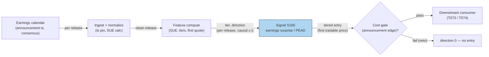

# S100 — Earnings surprise (SUE) / PEAD timing gate

The standardized unexpected earnings gate: `SUE = (actual − expected) / σ(past surprises)` [documented] (Livnat & Mendenhall 2006 define the analyst-forecast surprise against I/B/E/S data; time-series variants use seasonal-random-walk expectations [documented]). Entries use the FIRST tradable price after the announcement timestamp — close-to-close event-study returns do not prove intraday tradability [documented]. The `±1.0`σ tier cutoffs are the module's own convention [example]: the literature sorts SUE into deciles/quintiles (Bernard & Thomas 1989) [documented] — no published study mandates a ±1.0σ tier. The drift (PEAD) is the documented anomaly (Ball & Brown 1968; Bernard & Thomas 1989) — the module prices the announcement window, nothing beyond it.

> Tag law: every numeric literal in prose carries one of `[documented]
> [default] [example] [unverified] [internal-est] [measured]` (legend: Appendix
> i v1.0.0). Constants inside cited formulas inherit the formula's tag.
> Bibliographic years, volumes, pages, arXiv IDs, section numbers, rule codes (C1–C10),
> fail-safe codes (F1–F5), module IDs, and machine-parsed §0 data fields are identifiers,
> not literals, and are exempt.

## §1 Five-minute reviewer card

| Row | Value |
|---|---|
| Module | S100 — Earnings surprise (SUE) / PEAD timing gate, v1.1.0 |
| Edge verdict | `AFTER-COST-EDGE` (conditional) — the PEAD anomaly is paper-documented (Ball & Brown 1968; Bernard & Thomas 1989); intraday tradability is NOT documented and must be measured [documented]. |
| After-cost | `COMM-ONLY` — chapter cost is explicit (see the COST block [example]); the announcement returns in the tape are illustrative [example]. |
| Build cost | Tier L · `4–12` h [internal-est] · `$600–1,800` loaded [internal-est] |
| Data cost | Earnings calendar + consensus: Massive (ex-Polygon) Stocks API with Benzinga add-on — add-on pricing not captured, indicative `~$100–200`/mo; Databento OHLCV-1m usage `$35`/GB historical or Standard `$199`/mo incl. unlimited OHLCV history [documented] — all indicative, verify before budgeting [unverified]. |
| latency_class | per_event / announcement clock |
| risk_class | medium-high (signal-only; the open gaps against you) |
| Capacity | `$10–100`M/day notional [example] — earnings-season capacity |
| Executability | Feasible: SUE tiers on the announcement clock [documented]. |
| Risk summary | Close-to-close studies overstate tradability; the open gaps; Friday announcements drift differently [documented]. |
| When it dies | Announcement timestamps mis-pinned; the drift window compresses; the open gap eats the edge [documented]. |
| Regime gates | R035 (earnings proximity) amplifies entries in-season; R022 (hard-to-borrow) vetoes SHORTs; R010 (spread) re-runs the cost gate; R013 (abnormal volume) confirms [example]. |
| Emits | `signal_vector` (Appendix b v1.0.0) — never orders |

## §1.5 Cheapest / least-build path

1. **Prototype hour band:** `4–12` h [internal-est] — SUE tiers + announcement-clock timing — reference implementation + gates + fixture validation.
2. **Cheapest-source row** (structured as `min_tier, latency_class, required_fields, price_band, build_or_buy`):
   - `min_tier` = Massive (ex-Polygon) Stocks API w/ Benzinga partner dataset + Databento DBEQ.BASIC `ohlcv-1m` [documented]; SEC EDGAR 8-K Item 2.02 free fallback [documented]
   - `latency_class` = announcement clock (`per_event`)
   - `required_fields` = announcement timestamp (int64 ns UTC), consensus EPS, actual EPS, past-surprise σ (`8` quarters [example]), ts_event + open of the first tradable bar
   - `price_band` = `~$30–400`/mo [unverified] (indicative: Massive plan + Benzinga add-on + Databento usage/Standard — verify before budgeting)
   - `build_or_buy` = **build** — the tier logic, guards, and cost gate are yours; buy the calendar and the bars [internal-est]
3. **Resource budget:** `1` core, `<1` GB RAM [internal-est]; compute pattern `per_event`.
4. **Skip list:** Post-window drift extension — phase 2 (the module prices the announcement window only); options-implied surprise — phase 2.
5. **DO-NOT-CUT list:** causality assertions (`assert fill_event > signal_event`, no-signal-bar-fills test); COST block + callable
   `expected_cost_bps`; F1–F5 fail-safes + module-state enum; decision-log audit records; bona-fide-intent + self-trade prevention; provenance tags on
   every numeric literal; fixtures + `test_cmd`; secrets via env only.
6. **Escalation gate:** upgrade when — the open gap eats the edge → measure first-quote fills before sizing; need the drift leg → PEAD extension with measured windows.

## §S0 Module contract

### S0.1 Typed signature

```python
def signal(state: ModuleState, events: list[Event], cfg: Config) -> SignalVector:
```

`SignalVector` per Appendix b v1.0.0. `state` is the module-owned named state
vector; `events` are canonical Events (Appendix a v1.0.0), newest last. The
function handles documented edge cases: empty events → `UNKNOWN`; invalid
prices/inputs → `UNKNOWN` (F1, never interpolate); halt/auction events → freeze
per the market-state table; the cost-gate failure is a **veto** (direction `0`),
never an exception.

### S0.2 Config dataclass

| Parameter | Type | Default | Range | Status |
|---|---|---|---|---|
| `sue_hi` | float | `1.0` | `>0` | calibrate |
| `sue_lo` | float | `-1.0` | `<0` | calibrate |
| `conf_scale` | float | `5.0` | `>0` | calibrate |
| `k` | float | `0.5` | `>0` | calibrate |
| `cooldown_days` | float | `5.0` | `>=0` | [default] |
| `ttl_days` | float | `3.0` | `>0` | [default] |

Status `calibrate` = set at fit time per the §S2 calibration recipe (frozen defaults above until calibrated). Tag law: a `calibrate` status holds the frozen default's `[default]` tag once frozen; pre-fit the frozen value is `[example]`.

### S0.3 Canonical schema mapping

Vendor columns → canonical Event schema (Appendix a v1.0.0), stated once here:

| Source field | Canonical |
|---|---|
| Benzinga `/benzinga/v1/earnings` release date+time | `announce_ts` (int64 ns UTC) |
| Benzinga `eps` / `epsEstimated` (consensus) | `eps_act` / `eps_exp` (module feature inputs) |
| past-surprise σ (`8` quarters [example]) | `sigma` (module feature input) |
| Databento `ohlcv-1m` `ts_event` + `open` of first bar ≥ `announce_ts` | `open` of next session / next quote (execution datum) |

### S0.4 Time contract

> Time contract: clock domain UTC, int64 ns; authoritative causality clock =
> `event_ts`; max_skew = `1` ms [default]; jitter budget = `500` µs [default];
> bar-label = open time; staleness TTL = `3` d [default] (`3`× the `1`-d reference cadence per F4); gap policy = mask, no interpolation;
> halt/auction → discard contributions across reopen.

**Timing box:** `signal@t (per_event, America/New_York) → earliest fill @open(t+1)`

### S0.5 Market-state table

| State | Module behavior |
|---|---|
| CONTINUOUS_TRADING | Compute normally; emit per cadence |
| HALTED | Freeze state; emit `UNKNOWN`; discard contributions across reopen |
| AUCTION | No new signals; hold last `SignalVector`; state `DEGRADED` |
| CLOSED | Emit nothing; state `OFF` |

### S0.6 Module-state enum + error taxonomy

States per Appendix k v1.0.0: `OK | DEGRADED | UNKNOWN | OFF`. Invalid input →
`UNKNOWN`, never interpolate (Appendix f v1.0.0, F1–F5).

| Failure | State | Alert |
|---|---|---|
| Missing/stale input (TTL `3` d [default] (`3`× the `1`-d reference cadence per F4)) | `UNKNOWN` | page |
| Invalid price/input reaching module (NaN, ≤ 0, non-finite) | `UNKNOWN` | log |
| Mis-pinned announcement ts (`announce_ts > now_ts` — lookahead) | `UNKNOWN` | page |
| Feature out of mathematical bounds (F2) | `UNKNOWN` | page |
| `seq` gap > `1,000` events [default] | `DEGRADED` (restart windows) | log |
| Jitter > budget persistently | `DEGRADED` | notify |
| Halt/auction | `UNKNOWN` / `DEGRADED` (per table) | log |
| Kill/administrative disable | `OFF` | page |
| Anything unmapped | `UNKNOWN` | page |

### S0.7 Ops tail

- **Schedule:** on the announcement clock (pre-open / intraday / post-close releases) [documented]; owner: signals on-call.
- **Health checks:** fixture replay (`test_cmd`) green on deploy; live
  `seq`-gap monitor; staleness watchdog at `3`× cadence [default].
- **Alert table:** page on `UNKNOWN` > `1` d [default] or bounds violation;
  notify on `DEGRADED`; log on single dropped events.
- **Resource budget:** `1` vCPU, `1` GB RAM [internal-est]; state is O(window) per symbol.
- **Runbook stub:** `1.` confirm feed (vendor status); `2.` replay fixture;
  `3.` if red → set `OFF`, page; `4.` reconcile decision log before re-arm.

### S0.8 Secrets (env-only)

`DATA_VENDOR_API_KEY` via environment only. No secrets in this file, fixtures, or
logs (CI secrets-grep).

### S0.9 May / must-NOT

> **May:** emit `SignalVector` records per Appendix b v1.0.0. **Must-NOT:**
> emit orders, order intents, prices, share counts, or notionals; call a
> broker; mutate shared state outside `state`; interpolate across gaps.

## §S1 Legacy (subsumed by §1)

Legacy §S1 content is the §1 reviewer card above; this header is retained so
section numbering stays intact.

## §S2 Specification

### Universe

Earnings names; fixture: `10` announcements (seed `100` [example]).

### Entry rule (Boolean — no prose-only conditions)

```
SUE := (actual - expected) / sigma(past surprises)   # [documented]
TIER := hi+ (SUE >= +sue_hi) -> pre-direction +1
        lo- (SUE <= +sue_lo) -> pre-direction -1
        mid -> pre-direction 0                        # cutoffs are module convention [example]
GUARDS := F1-valid AND announce_ts <= now_ts AND (now_ts - announce_ts) <= TTL AND
          market_state == CONTINUOUS_TRADING AND cooldown clear AND (locate_ok OR pre-direction != -1)
EDGE  := |ar| * 100 bps; ar missing -> 0              # [example]
GATE  := expected_cost_bps(notional, adv_pct, venue, side, urgency) <= k * edge_bps   # k=0.5 [default]
DIRECTION := pre-direction IF (GUARDS AND GATE) ELSE 0   # gate failure is a VETO, never an assert [rule]
confidence := min(1, |SUE|/conf_scale) IF DIRECTION != 0 ELSE 0; capital := 0.5*confidence [example]
ENTRY := FIRST tradable price after the announcement ts   # open for pre-open releases [documented]
```

### Exits (with post-exit cooldown)

```
EXIT := the module prices the announcement window only — the consumer owns the drift window (PEAD). Post-entry cooldown `5` d [default] per name.
```

### Position sizing (fenced function)

```python
def size_shares(risk_budget_R, stop_distance, vol_estimate, ADV_cap, cost):
    # S-module requests capital fraction only; share math lives in the strategy.
    # Reference: capital = 0.5 * confidence  (confidence in [0,1])  [default]
    risk_notional = risk_budget_R * 0.5 * confidence          # [default] 0.5 factor
    shares = risk_notional / max(stop_distance, 1e-9)
    return int(min(shares, ADV_cap * adv_shares * 0.001))     # 0.1% ADV cap [default]
```

### Risk limits

| Limit | Value |
|---|---|
| Max capital fraction per signal | `0.5` [default] |
| Max adverse excursion before `UNKNOWN` review | `2.0`× stop [default] |
| Staleness kill | TTL `3` d [default] (`3`× the `1`-d reference cadence per F4) → `UNKNOWN` |
| Tradability doctrine | close-to-close event-study returns do NOT prove intraday tradability — the module prices the announcement window at the first tradable price [documented] |

### COST block (single source of truth)

| Component | Value (bps) | Tag | Basis |
|---|---|---|---|
| Spread | `3.0` | [example] | announcement-window spread at the example notional |
| Fees | `1.0` | [example] | taker fees at the example tier |
| Borrow | `0.0` | [default] | borrow_bps_per_day = `0.0` — reason: the chapter's all-in reference excludes borrow; SHORT-side borrow is consumer-priced (R022 hard-to-borrow gate + C7 locate) |
| Market impact/slippage | `1.0` | [example] | announcement-window slippage |
| **Total reference** | `5.0` | [example] | matches the fixture cost_bps=5.0 |

`borrow_bps_per_day`: `0.0` [default] — reason: chapter all-in excludes borrow; SHORT-side borrow priced by the consumer via the R022 gate (see §S12 leads for a measurable borrow schedule). `fee_schedule_as_of`: `2026-09-01` [unverified] — placeholder; pin the venue fee schedule before production. `side`: taker [example]; `venue/tier/source`: XNAS [example]. Re-stating cost numbers outside this block is a validation failure.

```python
def expected_cost_bps(notional, adv_pct, venue, side, urgency) -> float:
    # Callable cost model — mirrors the COST block exactly.
    spread_bps = 3.0    # [example] announcement-window spread
    fee_bps = 1.0       # [example] taker fees
    borrow_bps = 0.0    # [default] borrow_bps_per_day(0.0) x 1-day hold assumption [default]; reason in table
    impact_bps = 1.0    # [example] announcement-window slippage
    return spread_bps + fee_bps + borrow_bps + impact_bps
```

### Execution / fill model table

| Aspect | Assumption |
|---|---|
| Latency | entry at the first tradable price after the announcement timestamp — pre-open releases enter at the open [documented] |
| Participation | small — the open is volatile [example] |
| Partial fills | assume partial fills at the open [example] |
| Adverse fill | the open gapping against the surprise [documented] |

### Robustness

The timing rule is the robustness: pinning the announcement timestamp and entering at the first tradable price is what separates a measured edge from an event-study fantasy. Friday announcements drift differently (DellaVigna & Pollet 2009) [documented].

### Compliance sub-block (C1–C10+)

| Code | Rule: trigger → check → action → log |
|---|---|
| C1 | Self-match prevention: S100 emits no orders; downstream T-modules must set self-trade-prevention flags — S100 asserts the requirement in its `consumes` contract: trigger → check → action → log record |
| C2 | Bona-fide intent: every emitted `SignalVector` with |direction|=`1` must pass the cost gate; sub-threshold scores emit direction `0`, never a tradeable hint: trigger → check → action → log record |
| C3 | Message-rate: `≤100` emissions/symbol/s [default]; breach → throttle to `1`/s [default] + alert: trigger → check → action → log record |
| C4 | Fat-finger trio (applied by consumers; this module bounds its own outputs): confidence ∈ [`0`,`1`], capital ∈ [`0`,`0.5`], computed_at sane — out-of-bounds → `UNKNOWN` (F2): trigger → check → action → log record |
| C5 | Decision log: every emission, veto, and state transition logged per Appendix g v1.0.0, hash-chained: trigger → check → action → log record |
| C6 | Halt/auction: per §S0.5 market-state table; contributions across reopen discarded: trigger → check → action → log record |
| C7 | Locate check: SHORT direction requires `locate_ok` from the consumer; this module never emits SHORT without the consumer asserting locate (Reg-SHO threshold securities → direction `0`): trigger → check → action → log record |
| C8 | Public dissemination: no signal values published externally without review gate: trigger → check → action → log record |
| C9 | Data entitlements: per §S6 Data rights row; entitlement-class change → §1.5 escalation gate: trigger → check → action → log record |
| C10 | Post-exit cooldown: `5` d [default] per name after an entry: trigger → check → action → log record |

### Parameter table

| Parameter | Symbol | Value | Tag | Sensitivity | Calibration recipe |
|---|---|---|---|---|---|
| SUE high tier | ``sue_hi`` | `1.0` | [example] | high — small: noise; large: no entries | grid `{0.5, 0.75, 1.0, 1.25, 1.5}` [default]; freeze on OOS argmax stability (see below) |
| SUE low tier | ``sue_lo`` | `-1.0` | [example] | high — symmetric | symmetric pair with `sue_hi`; same recipe |
| Confidence scale | ``conf_scale`` | `5.0` | [example] | medium — sizing only | grid `{3.0, 5.0, 7.0}` [default]; frozen until sizing evidence exists |
| Cost-gate multiple | ``k`` | `0.5` | [default] | high — veto strictness | grid `{0.25, 0.5, 1.0}` [default]; min `30` OOS trades [default] |
| Post-exit cooldown | ``cooldown_days`` | `5.0` | [default] | low | fixed pending drift-window measurement |
| Staleness TTL | ``ttl_days`` | `3.0` | [default] | low | fixed at `3`× cadence per F4 |

### Calibration recipes (walk-forward OOS with embargo)

1. **Fold = one earnings season (quarter)** [default]. IS = trailing `8` seasons [example]; OOS = next `1` season [default].
2. **Embargo:** `1` full quarter gap between IS end and OOS start [default] — blocks leakage from overlapping drift windows and repeated names.
3. **Variant count:** `5` (sue pairs) × `3` (k) = `15` + `1` frozen baseline = `16` combos [example]; record DSR across variants or "not computed" [default].
4. **Selection metric:** OOS mean net bps per entered trade (announcement window, after the COST stack); tie-break on coverage [default].
5. **Minimum OOS trades:** `30` [default] per acceptance checklist; below that, keep frozen defaults.
6. **Freeze rule:** freeze a parameter set only when it is the OOS argmax in `≥2` consecutive seasons [default]; re-validate yearly [default]; otherwise keep the frozen defaults (`sue_hi=1.0`, `sue_lo=-1.0`, `conf_scale=5.0`, `k=0.5` [example]/[default]).
7. **Status:** `sue_hi`, `sue_lo`, `k`, `conf_scale` → `calibrate`; `cooldown_days`, `ttl_days` → fixed/`default` until drift-window evidence exists.

### Regime-gate machine records (provisional)

| regime_id | direction | mechanism | condition | action | min_lag | unknown_behavior |
|---|---|---|---|---|---|---|
| R035 | amplifies | in earnings season, open gaps are larger and the announcement window prices the surprise | R035 proximity band active [example] | allow entries; measure the gap before sizing [default] | `1` session [example] | hold last label |
| R035 | degrades | Friday announcements drift differently (DellaVigna & Pollet 2009) [documented] | day-of-week = Friday [documented] | halve confidence [default]; log | `1` session [example] | hold last label |
| R010 | degrades | announcement-window spread widens; the `3.0` bps spread assumption breaks | R010 spread percentile `> 90` [example] | re-run the cost gate with spread ×`2` [default] | `1` session [example] | veto entries |
| R022 | inverts | hard-to-borrow: SHORT borrow swamps the announcement edge | R022 borrow-constrained [example] | SHORT → direction `0` (borrow veto); LONG unaffected | `1` session [example] | veto SHORT entries |
| R013 | amplifies | abnormal volume confirms the surprise is real flow, not a mis-pin | R013 participation `> 2`× median [example] | allow entries | `1` session [example] | hold last label |

The reference stub wires `regime_gates() = ALLOW` (test seam); a live harness must evaluate these records per event. Bands grounded in R035's threshold bands (recalibrate per instrument [example]) and the module's measured gap statistics once collected.

### Timing box

`signal@t (per_event, America/New_York) → earliest fill @open(t+1)`

### Announcement-date blocks

**Announcement timestamp:** pinned per release (pre-open / intraday / post-close); the module consumes the release time as an int64-ns UTC event — a mis-pinned timestamp is a lookahead violation and maps to `UNKNOWN` [documented].

**First tradable price:** pre-open releases enter at the open; intraday releases at the next honest quote [documented]. The tape encodes pre-open releases, so the open is the entry.

**Chapter hand-check:** `10,000` shares × `$0.60` move = `$6,000` gross [example]. Fixture tiers: A `2.50` hi+ (+1, gate passes), B `−1.00` lo− (vetoed: no ar edge → direction 0), C `0.33` mid, D `−1.25` lo− (vetoed), E `1.60` hi+ (vetoed), F `0.00` mid, G `−1.50` lo− (−1, gate passes), H `1.67` hi+ (+1, gate passes), I `−1.36` lo− (−1, gate passes), J `1.50` hi+ (vetoed) [example].

## §S3 Math + normative pseudocode

Per announcement: `SUE = (actual − expected) / σ(past surprises)` [documented]. Tiers at `±1.0`: `SUE ≥ +1.0` → `hi+`, pre-direction `+1`; `SUE ≤ −1.0` → `lo−`, pre-direction `−1`; else `mid`, pre-direction `0` (cutoffs are module convention [example]; the literature sorts SUE into deciles [documented]). Confidence `= min(1, |SUE|/conf_scale)`; capital `= 0.5 × confidence` [example]. Edge `= |ar| × 100` bps where `ar` is the tape's announcement return (missing → `0`) [example]; gate veto: `expected_cost_bps(...) <= k * edge_bps`, `k = 0.5` [default] — fail → direction `0`, never an exception. Name A: `246` bps edge → the COST-block total clears → gate passes [example]. Entry ONLY at the first tradable price after release; close-to-close event-study returns do NOT prove intraday tradability [documented].

**Normative pseudocode** (pseudocode is normative; prose is commentary). All variables bound inline:

```
# ---- bound inputs ----
eps_act, eps_exp        # actual / consensus EPS from the earnings feed        [documented]
sigma                   # std dev of past surprises (8 quarters)              [example]
ar                      # announcement return; None if the name was not entered [example]
announce_ts, now_ts     # int64 ns UTC: release time, evaluation time          [default]
locate_ok               # consumer asserts the SHORT locate (C7); default True [default]
last_entry_ts           # per-name last entry ts; None if none                  [default]
market_state            # CONTINUOUS_TRADING | HALTED | AUCTION | CLOSED        [fixed]
notional, adv_pct, venue, side, urgency  # cost-gate inputs                    [default]
sue_hi, sue_lo, conf_scale, k            # config (defaults 1.0, -1.0, 5.0, 0.5)
signal_event_ts = now_ts
fill_event_ts = ts of first tradable price strictly after announce_ts          # [documented]

# ---- F1: invalid input → UNKNOWN, never interpolate ----
if (not finite(eps_act)) or (not finite(eps_exp)) or (not finite(sigma)) or (sigma <= 0):
    emit SignalVector(direction=0, confidence=0.0, capital=0.0, module_state=UNKNOWN); return

# ---- lookahead guard: mis-pinned announcement ts ----
if announce_ts > now_ts:
    emit SignalVector(direction=0, confidence=0.0, capital=0.0, module_state=UNKNOWN); return

# ---- market-state gate (§S0.5) ----
if market_state == CLOSED:  emit nothing; module_state = OFF; return
if market_state == HALTED:  emit SignalVector(direction=0, confidence=0.0, capital=0.0, module_state=UNKNOWN); return
if market_state == AUCTION: module_state = DEGRADED; hold last SignalVector; return

# ---- F4: staleness TTL (3d) ----
if (now_ts - announce_ts) > ttl_ns(3.0 * 86400e9):
    emit SignalVector(direction=0, confidence=0.0, capital=0.0, module_state=UNKNOWN); return

# ---- C10: post-exit cooldown (5d per name) ----
if (last_entry_ts is not None) and ((now_ts - last_entry_ts) < cooldown_ns(5.0 * 86400e9)):
    emit SignalVector(direction=0, confidence=0.0, capital=0.0, module_state=OK, veto_reason="cooldown"); return

# ---- tiers ----
sue = (eps_act - eps_exp) / sigma                                        # [documented]
if sue >= sue_hi:   tier, pre_direction = 'hi+', +1                        # [example] cutoffs
elif sue <= sue_lo: tier, pre_direction = 'lo-', -1
else:               tier, pre_direction = 'mid', 0

# ---- C7: locate check for SHORT ----
if (pre_direction == -1) and (not locate_ok):
    emit SignalVector(direction=0, confidence=0.0, capital=0.0, module_state=UNKNOWN, veto_reason="locate"); return

confidence = min(1.0, abs(sue) / conf_scale) if (pre_direction != 0) else 0.0   # [example]
capital    = 0.5 * confidence                                                   # [default]
edge_bps   = abs(ar) * 100.0 if (ar is not None) else 0.0                       # [example]

# ---- cost gate as VETO: fail → direction 0 (never an assert) ----
direction = pre_direction
if direction != 0:
    gate_ok = expected_cost_bps(notional, adv_pct, venue, side, urgency) <= k * edge_bps
    if not gate_ok:
        emit SignalVector(direction=0, confidence=0.0, capital=0.0,
                          module_state=OK, veto_reason="cost_gate", gate_pass=0); return

# ENTRY: first tradable price AFTER the announcement timestamp [documented]
assert fill_event_ts > signal_event_ts            # causality; unit-pinned, no-signal-bar-fills test
emit SignalVector(symbol, direction, confidence, capital, module_state=OK, gate_pass=1)
```

Causality: the computation at `t` uses only data `≤ t`; earliest reaction is
`t+1`. Mandatory unit test: no-signal-bar fills.

## §S4 Worked example (fixture-backed)

- Fixture: `10` announcements (seed `100` [example]); tape `modules/fixtures/S100_tape.csv` (`# TYPE: validation-run`); panel rows carry no timestamps — the ordered event clock is the announcement sequence [example].
- SUE tiers [example]: A `2.50` hi+ (+1, gate passes), B `−1.00` lo− (vetoed → 0: no `ar` edge), C `0.33` mid (0), D `−1.25` lo− (vetoed → 0), E `1.60` hi+ (vetoed → 0), F `0.00` mid (0), G `−1.50` lo− (−1, gate passes), H `1.67` hi+ (+1, gate passes), I `−1.36` lo− (−1, gate passes), J `1.50` hi+ (vetoed → 0).
- Name A: edge `2.46`% → `246` bps [example] → the COST-block total → gate passes [example]. Chapter hand-check: `10,000 × $0.60 = $6,000` gross [example].
- Timing rule [documented]: entries at the first tradable price after release (the tape encodes pre-open releases → the open is the entry); the module prices the announcement window only — no close-to-close tradability inference.
- `assert fill_event > signal_event` holds on every row [example].
- Where the example is optimistic: the tape's `ar` edges are illustrative — real deployment must measure first-quote fills before sizing [documented].

## §S5 Strategies that use this signal

Generated from `deps.yaml` (CI symmetry); hand-listed here for this module:

| Strategy | Role |
|---|---|
| T073 — Earnings-surprise timing gate | primary trigger: consumes S100's SUE tiers to time entries on the announcement clock |
| T074 — Post-earnings drift (PEAD) strategy | primary trigger: the drift window beyond the announcement — S100 prices the window's entry |

## §S6 Data required

| Field | Vendor / product / endpoint | Schema | Required fields | Price band (as-of 2026-09-10) |
|---|---|---|---|---|
| Earnings calendar + consensus + actuals | Massive (ex-Polygon) — Stocks API, Benzinga partner dataset; `GET /benzinga/v1/earnings?ticker={ticker}&limit=20&order=desc&sort=date` (requires Business tier + Benzinga add-on; verify endpoint paths against massive.com/docs before shipping) [documented] | JSON: release date, release time, consensus EPS, actual EPS, surprise % | announcement timestamp (int64 ns UTC), consensus EPS, actual EPS, past-surprise σ | [unverified] — Benzinga add-on pricing not captured this batch; indicative `~$100–200`/mo — verify before budgeting (see §S12 leads) |
| Calendar fallback | SEC EDGAR — 8-K Item 2.02 ("Results of Operations"), `acceptance_datetime` as print-date proxy [documented] | filing index XML/JSON | filing acceptance datetime | free [documented]; lags the press release by minutes [documented] |
| Intraday bars (first tradable price) | Databento — US Equities (DBEQ.BASIC), `ohlcv-1m` schema via `hist.databento.com` [documented] | DBN: `ts_event` (int64 ns), open/high/low/close, volume | `ts_event`, open, volume | usage `$35`/GB historical [documented]; Standard plan `$199`/mo incl. unlimited OHLCV history for US equities [documented]; live production licensing [unverified] |

**Data rights row** (Appendix j v1.0.0): Calendars/consensus: licensed tiers [documented]; intraday bars: Databento licensed [documented].

## §S7 Local build (M5 Max / 128 GB)

Feasibility: feasible — SUE tiers on the announcement clock. Tier L, `4–12` h → `$600–1,800` loaded [internal-est]. Working set `<100` MB [internal-est] — far under the ~`77` GB budget. Bottleneck is announcement-timestamp accuracy and first-quote identification, not compute [documented].

## §S8 Buy vs build

Build on a bought calendar + consensus feed and intraday bars. The tier logic is yours — the timestamp accuracy is the product [documented].

## §S9 Efficacy — documented evidence

| Study / source | Market & period | Metric | Before/after cost | Caveat |
|---|---|---|---|---|
| Ball & Brown (1968), JAR 6(2) | Accounting income and returns | the original earnings-announcement study [documented] | `AFTER-COST-EDGE` (conditional) | close-to-close, not intraday |
| Foster, Olsen & Shevlin (1984), TAR 59(4) | Earnings anomalies | earnings releases, anomalies, and security returns [documented] | `AFTER-COST-EDGE` (conditional) | event-study, not tradable |
| Bernard & Thomas (1989), JAR 27 | PEAD | post-earnings-announcement drift: delayed response or risk premium [documented] | `AFTER-COST-EDGE` (conditional) | drift, not entry timing |
| Livnat & Mendenhall (2006), JAR 44(1) | SUE construction | analyst vs time-series surprise forecasts [documented] | `BEFORE-COST` | construction, not alpha |
| Sadka (2006), JFE 80(3) | PEAD and liquidity | momentum and PEAD: the role of liquidity risk [documented] | `AFTER-COST-EDGE` (conditional) | risk explanation, not timing |
| DellaVigna & Pollet (2009), JF 64(2) | Inattention and Fridays | investor inattention and Friday earnings announcements [documented] | `BEFORE-COST` | inattention, not implementation |

Selection disclosure: these are the sources surfaced by the chapter's research pass. Fails in: mis-pinned timestamps, open gaps, compressed drift windows. **Honest bottom line:** PEAD is the paper-documented anomaly; intraday tradability is NOT documented — the module prices the announcement window at the first tradable price and claims nothing beyond it [documented].

## §S10 Failure modes & pitfalls

| # | Trigger → Detect → Action → Recovery | check: |
|---|---|
| 1 | Mis-pinned announcement ts → lookahead [documented] → timestamp discipline + `announce_ts > now_ts → UNKNOWN` → leaked entry | `check: ts strictly before entry` |
| 2 | Close-to-close inference → event-study fantasy [documented] → first-tradable-price rule → phantom edge | `check: entry at first tradable price` |
| 3 | Open gap against the surprise → edge eaten [documented] → gap measurement before sizing → filled at the worst price | `check: gap statistics measured` |
| 4 | Friday announcements → different drift (DellaVigna & Pollet 2009) [documented] → calendar awareness → pooled statistics | `check: day-of-week split` |
| 5 | Drift window compression → PEAD shrinks [documented] → window monitoring → holding a dead drift | `check: window edge remeasured` |
| 6 | Sigma misestimated → wrong SUE tiers [documented] → σ discipline → mistiered entries | `check: σ from past surprises` |
| 7 | Invalid inputs (NaN, σ ≤ 0) → F1 → UNKNOWN, never interpolate [documented] → drop the announcement → silent bad SUE | `check: invalid input → UNKNOWN` |
| 8 | Mid-tier names entered → tier is mid [documented] → direction 0 → edge-less entries | `check: mid → no entry` |
| 9 | Cost gate failed but direction still ±1 → C2 violation [rule] → veto (fail → direction 0), never assert → tradeable hint without edge | `check: gate fail → direction 0` |

## §S11 Visuals

`../../images/S100_example.png` — synthetic worked-example chart (seed `100` [example]).



## §S12 Source log + unverified leads

**Sources** (citable facts only):

1. Ball, Ray & Brown, Philip (1968). 'An Empirical Evaluation of Accounting Income Numbers.' Journal of Accounting Research 6(2): 159–178. (Stable URL not captured this batch.)
2. Foster, George, Olsen, Chris & Shevlin, Terry (1984). 'Earnings Releases, Anomalies, and the Behavior of Security Returns.' The Accounting Review 59(4): 574–603. (Stable URL not captured this batch.)
3. Bernard, Victor L. & Thomas, Jacob K. (1989). 'Post–Earnings-Announcement Drift: Delayed Price Response or Risk Premium?' Journal of Accounting Research 27 (Supplement). (Stable URL not captured this batch.)
4. Bernard, Victor L. & Thomas, Jacob K. (1990). 'Evidence That Stock Prices Do Not Fully Reflect the Implications of Current Earnings for Future Earnings.' Journal of Accounting and Economics 13(4): 305–340. (Stable URL not captured this batch.)
5. Livnat, Joshua & Mendenhall, Richard R. (2006). 'Comparing the Post–Earnings Announcement Drift for Surprises Calculated from Analyst and Time Series Forecasts.' Journal of Accounting Research 44(1): 177–205. https://doi.org/10.1111/j.1475-679X.2006.00196.x
6. Sadka, Ronnie (2006). 'Momentum and Post-Earnings-Announcement Drift Anomalies: The Role of Liquidity Risk.' Journal of Financial Economics 80(3): 309–349. https://doi.org/10.1016/j.jfineco.2005.05.005
7. DellaVigna, Stefano & Pollet, Joshua M. (2009). 'Investor Inattention and Friday Earnings Announcements.' Journal of Finance 64(2): 709–749. (Stable URL not captured this batch.)

**Chatbot source log.** Duck.ai answered Q-SB10-1–Q-SB10-3 (2026-09-10) [measured]; Grok/Cursor answers pending (checked 2026-09-10).

**Unverified leads** (chatbot-only — never in evidence tables):

- Modern PEAD intraday implementation details (auction entry, first-quote identification) — practitioner knowledge; dedicated published sources not captured this batch [unverified].
- Massive (ex-Polygon) Benzinga earnings add-on pricing (~$100–200/mo indicative) — plan pricing not captured this batch; verify against massive.com before budgeting [unverified].
- Nasdaq taker fee for the example tier in the COST block (`1.0` bps [example]) — pin the venue fee schedule before production; `fee_schedule_as_of` is a placeholder [unverified].
- `borrow_bps_per_day` reference schedule for earnings SHORTs (the block's `0.0` [default] is a modeling choice; real borrow varies by name and date) — no citable per-name schedule captured this batch [unverified].
- Citable source for the `±1.0`σ SUE tier-cutoff convention in practitioner literature — not found this batch; the literature sorts SUE into deciles/quintiles [documented], the cutoffs remain the module's own [example] [unverified].
- Measured first-quote fill statistics after earnings announcements (open gaps, adverse fills) — must be measured live; no citable source captured this batch [unverified].

---

## Appendix — AI build prompt (S100)

Copy-paste into any chat agent:

> Build module **S100 — Earnings surprise (SUE) / PEAD timing gate** per `notes/module-template.md` v1.0.0 and this file's §S0 contract.
> Cheapest path (§1.5): prototype `4–12` h [internal-est] — SUE tiers + announcement-clock timing; compute pattern `per_event`.
> Implement `signal(state, events, cfg) -> SignalVector` (Appendix b v1.0.0)
> with the §S3 normative pseudocode, including the cost-gate predicate
> `expected_cost_bps(...) <= k * edge_bps` as a **veto** (fail → direction `0`,
> never an assert), the F1 invalid→UNKNOWN guard, the lookahead guard, the
> market-state gates (§S0.5), the F4 staleness TTL (`3` d [default]), the C10
> cooldown (`5` d [default]), the C7 locate check for SHORT, and
> `assert fill_event_ts > signal_event_ts`. Wire F1–F5 (Appendix f v1.0.0):
> invalid input → `UNKNOWN`, never interpolate. Config: `sue_hi`/`sue_lo`/`k`/
> `conf_scale` are `calibrate`-status (frozen defaults `1.0`, `-1.0`, `0.5`, `5.0`
> [example]/[default]). Log decisions per Appendix g v1.0.0. Secrets via env
> only. Run the fixture `modules/fixtures/S100_tape.csv`
> (`# TYPE: validation-run`) against `modules/fixtures/S100_expected.csv`
> (tolerance `1e-9` [default]).
> **Definition of done:** `python3 -m pytest modules/tests/test_S100.py -q`
> exits `0`. Tag every numeric literal you add with the unified enum
> (Appendix i v1.0.0); put anything unverifiable in §S12 unverified leads.
