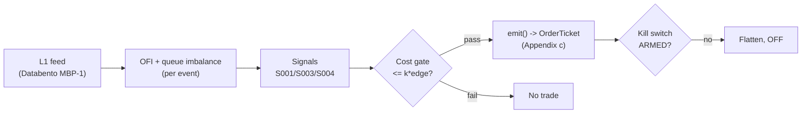

# T001 — OFI + Queue-Imbalance Directional Scalper

> **Reviewer card.** Intraday microstructure directional scalping (liquidity-taking): touch order-flow imbalance (S001) confirmed by depth-queue imbalance (S003), gated by microprice fair value (S004). Provenance **[D]**.
>
> Edge verdict: **NO-DOCUMENTED-EDGE** — documented prediction (OFI, queue imbalance) is contemporaneous/classification, not an after-cost trading rule [documented].
>
> After-cost: **FULL-COST** — one-sentence verdict: costs, not signals, usually decide — the net `-$50` [example] worked day is the honest shape.
>
> Tier **M** · prototype 40–80 h [example] · loaded cost $6,000–12,000 [example] · latency microstructure / sub-second · risk medium (intraday leverage, taker).

> Capacity $0.5–2M/day notional [example] — near zero for a non-colocated taker; fees consume the documented move · Executability: Feasible: Python+polars prototype on `5–20` symbols [internal-est]; colocated feed needed to mean anything.

## §1  Identity & provenance

This module is a **strategy**: it emits `OrderTicket` intentions only — brokers create orders, strategies never do. Family **A  # microstructure & order flow**, batch **TB1**, provenance **D**.

**Lede.** Intraday microstructure directional scalping (liquidity-taking): touch order-flow imbalance (S001) confirmed by depth-queue imbalance (S003), gated by microprice fair value (S004). Provenance **[D]**.

**When it dies.** Spread `>3` ticks [default]; depth collapse; SIP-only feed in a colocated race; fee schedule change.

**Regime gates (provisional).** R001 elevated RV amplifies then kills (spread convexity); halted names excluded.

**Prototype scope.** event-state machine + OFI/queue aggregators + cost gate + kill-switch + fixture.

## §1.5  Escalation gate

Cheapest viable path: **Polygon.io Stocks Basic** — L1 bid/ask price + displayed size per quote event, exchange timestamps at ~$30–200/mo [unverified]. build the signal stack, buy the L1 feed.

Resource budget: `1` core, `<4` GB RAM for `≤20` symbols live [internal-est] · compute pattern `per_event`.

Explicitly out of scope (phase two): multi-venue aggregation; L2/MBO replay; Rust ingest; colocation; integrated multi-level OFI (phase `2`).

Escalation gate: live universe `>20` symbols [default]; SIP jitter `>500` µs [default] persistently; spread regime beyond `3` ticks [default] — crossing it requires re-review of §T7 and §T8.

## §T0  Contract — strategies emit intentions, brokers create orders

This strategy's sole output is a list of `OrderTicket` intentions. It never places, routes, or confirms an order. Every ticket carries `parent_signal` (the upstream signal id and its `computed_at`), an `intent_ts`, and a `tif`. The backtest harness fills tickets strictly after the signal bar (`fill_event > signal_event`, t->t+1 causality); any fill timestamped at or before its signal bar is a harness bug and trips the kill switch.

State variables carried between bars: ``prev_book`, `ofi_window`, `depth_window`, `ewma_mu`, `ewma_sd`, `cooldown_until`, `position`, `entry_mid`, `module_state``.

## §T1  Strategy thesis & edge

**Thesis.** Intraday microstructure directional scalping (liquidity-taking): touch order-flow imbalance (S001) confirmed by depth-queue imbalance (S003), gated by microprice fair value (S004). Provenance **[D]**.

**Edge verdict: NO-DOCUMENTED-EDGE** — documented prediction (OFI, queue imbalance) is contemporaneous/classification, not an after-cost trading rule [documented].

**After-cost verdict: FULL-COST** — one-sentence verdict: costs, not signals, usually decide — the net `-$50` [example] worked day is the honest shape.

**Risk summary.** Adverse selection on both legs; spread-widening exactly when flow is one-sided; latency race at the touch.

**Math.**

```text
Per L1 snapshot `t`: queue imbalance `I_t = (Q^b_t − Q^a_t)/(Q^b_t +
Q^a_t)` (Gould–Bonart [documented]); OFI z-score `z^OFI_t = (OFI_t − μ)/(σ)`
with `μ, σ` from a causal `15`-min EWMA [example]; microprice deviation `d_t =
P^micro_t − M_t` (Stoikov [documented]). Modeled edge `edge_bps = |z_ofi| *
0.35` [example]; trade only when the cost gate passes.
```

**Pseudocode (normative).**

```text
function emit(state, signals, bars, cfg) -> list[OrderTicket]:
    assert bars non-empty else return UNKNOWN                       # F1
    t = bars[-1]   # newest snapshot, exchange time
    assert t.bid_px > 0 and t.ask_px > t.bid_px else return UNKNOWN  # F2
    z  = signals['S001'].z_ofi                                     # newest <= t
    I  = signals['S003'].imbalance
    d  = signals['S004'].deviation
    assert isfinite(z) and isfinite(I) and isfinite(d) else return UNKNOWN  # F2

    edge_bps = abs(z) * 0.35                                       # [example]
    cost_ok = expected_cost_bps(notional, adv_pct, venue, side, urgency) <= cfg.cost_gate_k * edge_bps
    # ^^^ normative cost-gate predicate: expected_cost_bps(...) <= k * edge_bps

    tickets = []
    if state.position == 0 and cost_ok and t.event_ts >= state.cooldown_until:
        if z >= cfg.z_entry and I >= cfg.I_entry and d >= 0:
            tickets = [ticket(side='BUY', qty=size(...), limit=t.ask_px,
                              tif='IOC', parent_signal=f"S001@{signals['S001'].computed_at}")]
        elif z <= -cfg.z_entry and I <= -cfg.I_entry and d <= 0 and locate_ok():
            tickets = [ticket(side='SELL', qty=size(...), limit=t.bid_px,
                              tif='IOC', parent_signal=f"S001@{signals['S001'].computed_at}")]
    else:
        if exit_trigger(t, state, cfg): tickets = [flatten_ticket(state)]
        state.cooldown_until = t.event_ts + cfg.cooldown_s * 1e9   # C10
    for tk in tickets: log_decision(tk, inputs_hash, params_hash)  # C5 / App. g
    assert fill.event_ts > t.event_ts for any fill                 # t->t+1 causality
    return tickets
```

## §T2  Signal stack — dependencies & data rights

| Signal | Role | Contract |
|---|---|---|
| `S001` | trigger | z^OFI_t >= +1.5 long / <= -1.5 short [example] |
| `S003` | confirm | |I_t| >= 0.60 [example]; flow and level must agree |
| `S004` | veto | d_t sign must agree with the trade direction |

Max dependency depth: `2` [default].

**Schema mapping (canonical).**

| Vendor (Databento MBP-1) | Canonical |
|---|---|
| `ts_event` | `event_ts` (int64 ns UTC) |
| `bid_px_00`, `bid_sz_00` | `bid_px`, `bid_sz` |
| `ask_px_00`, `ask_sz_00` | `ask_px`, `ask_sz` |
| `action` ∈ {A, C, T} | `event_type` ∈ {ADD, CANCEL, TRADE} |

Staleness: max skew `1` [default] · jitter budget `500 µs` [default] · TTL `3 s` [default] · cadence `per_event` · tz `America/New_York`.

**Inputs that break the module.**

| Input failure | Module state | Alert |
|---|---|---|
| OFI or z-score out of mathematical bounds (F2) | `UNKNOWN` | page |
| seq gap > 1,000 events [default] | `DEGRADED` (restart windows) | log |
| SIP jitter > budget persistently | `DEGRADED` | notify |
| Exit timer fires late (paper ledger mismatch) | `OFF` (kill trip) | page |

**Data rights.** US equities L1 via Databento MBP-1, `rights: licensed`; license scope =
research + stated production symbol count (`≤20` [default]); raw ticks never
leave our systems — fixtures are synthetic; entitlement = professional/internal,
no display; retention per vendor terms, purge path in runbook; derived features
ours. Entitlement-class change → §1.5 escalation gate.

**Build vs buy.** Build the signal stack on a bought L1 feed (Tier 2); buy nothing
packaged — a "signal SaaS" cannot be audited for t→t+1 causality. The edge is
your OFI window, queue thresholds, and microprice fit.

**Local build.** Feasible. O(`1`) [documented] per-event scan: Python loop `~100–500`k
events/s [internal-est] vs `~50–500` L1 events/s average per liquid name; `20`
symbols → Python borderline, Rust comfortable. Bottleneck is I/O and timestamp
normalization. RAM: state O(window) per symbol — trivial.

**Data dictionary (canonical fields).**

| Field | Type | Cadence | Tier | Notes |
|---|---|---|---|---|
| `Best bid/ask price+size` | float/int | every quote event (L1) | Tier 2 | exchange timestamps |
| `Exchange timestamps` | int64 ns | per event | Tier 2 | SIP jitter `10`s of µs [documented] — latency claims simulated-only |
| `Corporate actions / halts` | reference | daily + intraday halt feed | Tier 1 | contributions garbage across splits/reopens |

## §T3  Entry / exit / sizing & worked example

**Entry rule.**

```text
ENTER_LONG  := (z_ofi >= z_entry) AND (I_t >= I_entry) AND (d_t >= 0)
               AND (mid_jump_5s <= 1 tick) AND (flat) AND (now >= cooldown_until)
               AND (locate_ok) AND (expected_cost_bps(...) <= cost_gate_k * edge_bps)
ENTER_SHORT := (z_ofi <= -z_entry) AND (I_t <= -I_entry) AND (d_t <= 0)
               AND (mid_jump_5s <= 1 tick) AND (flat) AND (now >= cooldown_until)
               AND (locate_ok) AND (expected_cost_bps(...) <= cost_gate_k * edge_bps)
FLAT        := otherwise
```

**Exit rule.**

```text
EXIT := (z_ofi crosses 0 against position) OR (|I_t| < I_exit)
        OR (age >= time_stop_s) OR (mid <= entry_mid - stop_ticks * tick) [long]
        OR (mid >= entry_mid + target_ticks * tick) OR (module_state != OK)
```

**Cooldown.** `60` s [default] after every exit (C10).

**Sizing function (normative).**

```python
def shares(risk_budget_R, stop_distance, vol_estimate, ADV_cap, cost):
    # risk_budget_R in $, stop_distance in $/share; taker scalper: stop = 2 ticks
    n = risk_budget_R / max(stop_distance, 1e-9)   # [default] floor below
    n = min(n, ADV_cap * 0.01)                    # 1% of 1-min ADV [default]
    n = min(n * 50000.0, 1000000.0) / 50000.0     # $1M notional cap [default]
    return int(n)
```

**Risk limits.**

| Limit | Value |
|---|---|
| Daily loss stop | `-$2,000` [example] → dark for the day |
| Max gross | `$1M` notional [example] |
| Per-name heat | `≤ $250k` [example] |
| Staleness kill | feed heartbeat `>2` s [example] → trip |

**Worked example (fixture-backed, from `fixtures/T001_tape.csv` trade 1).**

Trade 1: `BUY` `10000` shares [example] @ `50.01` [example], exit `50.03` [example] (`target +2 ticks`). Gross P&L = `200.00` [measured] dollars. Cost stack = `4.0` bps [example] → `200.04` [measured] dollars on `500100.00` [example] notional. Net = `-0.04` [measured] dollars. The fixture's expected CSV carries the same arithmetic for all six trades; the per-module test recomputes it from the tape and asserts equality.

**Flow.**


## §T4  Parameters

| Parameter | Key | Default | Provenance | Sensitivity |
|---|---|---|---|---|
| OFI event window | `ofi_window_events` | `100` events | [default] | high |
| Entry z-threshold | `z_entry` | `1.5` | [default] | high |
| Queue-imbalance entry | `I_entry` | `0.60` | [default] | high |
| Queue-imbalance exit | `I_exit` | `0.25` | [default] | medium |
| Time stop | `time_stop_s` | `8` s | [default] | medium |
| Stop distance | `stop_ticks` | `2` ticks | [default] | high |
| Post-exit cooldown | `cooldown_s` | `60` s | [default] | low |
| Cost-gate k | `cost_gate_k` | `0.5` | [default] | high |

## §T5  Costs — the callable is the single source of truth

| Component | bps | Basis |
|---|---|---|
| Spread | `2.0` | [example] 1-tick spread at $50: half-spread per aggressive leg × 2 legs |
| Fees | `2.0` | [example] $0.005/share each way at $50 = 1 bps/leg |
| Borrow | `0.0` | [default] intraday; shorts excluded from the reference build |
| Impact | `0.0` | [example] flagged; calibrate per venue at scale-up |
| **Total** | `4.0` | [example] reference stack |

Fee schedule as of `2026-09-01` [example] · venue `XNAS / Databento MBP-1 [example]` · side `taker` · borrow `0.0` bps/day [example] — reference build long-biased intraday; shorts would add locate + borrow — excluded, see C7.

```python
def expected_cost_bps(notional, adv_pct, venue, side, urgency) -> float:
    """Callable cost model - T001 COST block (single source of truth)."""
    spread_bps = 2.0   # [example] 1-tick @ $50: half-spread per aggressive leg x 2
    fee_bps = 2.0      # [example] $0.005/share each way @ $50 = 1 bps/leg
    borrow_bps = 0.0   # [default] intraday; shorts excluded from reference build
    impact_bps = 0.0   # [example] flagged; calibrate per venue at scale-up
    return spread_bps + fee_bps + borrow_bps + impact_bps
```

**Normative cost-gate predicate (C3):** `expected_cost_bps(...) <= k * edge_bps` — no ticket is emitted unless the callable cost clears this gate. The predicate appears verbatim in the §T1 pseudocode and is asserted by the per-module test.

## §T6  Execution assumptions

| Aspect | Assumption |
|---|---|
| Latency | signal→intent `≤1` ms colocated [example]; SIP path latency-simulated-only |
| Partial fills | oldest `intent_ts` first (FIFO) per Appendix c v1.0.0; partials keep same ticket |
| Impact | `0` bps reference [example]; stress ×`5` [example] |
| Adverse fill | toxic-flow haircut `0.2` bps per `1.0` |z| [example] |

## §T7  Risk contract & kill switch

Per-trade R: `$200` [example] per trade · daily loss stop: `- $2,000` [example] then dark for the day · max gross: `$1M` notional [example] · max adverse per trade: `2.0`x stop [default].

Enforcement: `intraday-hard` [default]. Calibration recipe: paper-trade `20` sessions [default]; size `R` from realized per-trade vol; re-pin fee schedule monthly [default].

**Kill switch: `ARMED` → `TRIPPED` → `RECOVERY` → `ARMED`.**

Trip conditions:

- feed heartbeat missed > 2 s [example]
- book sequence gap
- clock skew > 50 ms vs NTP [example]
- any exit timer firing late
- paper ledger != module state

On trip: the module stops emitting tickets immediately, flattens managed positions per the exit rule, and pages. `RECOVERY` requires manual review, cooldown expiry, and healthy feeds; only then does the module return to `ARMED`. The per-module test drives the full transition cycle.

**Ops.** Schedule: continuous during US equities RTH `09:45`–`15:45` America/New_York [example]; flat by `15:45` · budget: `1` vCPU, `4` GB RAM per `20` symbols [internal-est]; state O(window) per symbol [internal-est] · env: `DATABENTO_API_KEY, POLYGON_API_KEY`.

**Universe.** US common stocks, RTH `09:45`–`15:45` ET [example], `5–20` liquid large-tick
names with one-to-two-tick spreads and deep, stable queues (SPY/QQQ/AAPL-class)
[example]. Exclude: median spread `>3` ticks [example]; earnings-day and
halted names; unstable L1 depth. Flat by `15:45` ET regardless.

## §T8  Compliance (C1–C10+)

- **C1** | No orders: the strategy emits `OrderTicket` intentions only; the broker creates orders.
- **C2** | Kill switch: `ARMED` → `TRIPPED` → `RECOVERY` → `ARMED` on the trip conditions in §T7.
- **C3** | Cost gate: `expected_cost_bps(...) <= k * edge_bps` before any ticket (see §T5).
- **C4** | Causality: `fill_event > signal_event` (t->t+1); no signal-bar fills, ever.
- **C5** | Decision log: every ticket logged with inputs hash and params hash (see App. g).
- **C6** | Staleness: inputs older than the TTL → `UNKNOWN`, no tickets.
- **C7** | Short discipline: `locate_ok` required before any short ticket.
- **C8** | Cooldown: post-exit cooldown enforced in seconds; no re-entry inside it.
- **C9** | Session flatten: no uncommanded overnight carry.
- **C10** | Position caps: per-trade R, daily loss stop, and max gross enforced.
- **C11 | Queue-position honesty: trigger = any passive-fill-rate claim → check = MBO/ITCH evidence → action = label `simulated only — requires MBO/ITCH` → log = honesty record**
- **C12 | No-chase: trigger = mid_jump_5s > 1 tick [example] → check = entry rule mid-jump clause → action = veto → log = `GATE_VETO`**

## §T9  Evidence, failures & regime gates

**Evidence (cost-level tokens; every statistic tagged).**

| Source | Sample | Finding | Cost level | Caveat |
|---|---|---|---|---|
| Cont, Kukanov & Stoikov (2014) [documented] | `50` S&P 500 names, NYSE TAQ, Apr–Jun `2010` [documented] | linear Δmid = β·OFI; slope ∝ `1/(2·depth)` [documented] | `BEFORE-COST`; contemporaneous impact, not a delayed fill | no forward P&L, no Sharpe |
| Gould & Bonart (2016) [documented] | `10` Nasdaq names, LOB | logistic I → next-mid direction, strongly significant on large-tick names [documented] | `BEFORE-COST` (classification, not P&L) | direction only; no trading rule, no costs |

**Where this module is known to fail.** vol spikes (depth evaporates), wide-spread names, retail books (odd-lot noise), crowded/spoofed periods, fee-schedule changes.

**Failure modes (detect → action → recovery).**

| # | Failure | Detect → action → recovery | Executable check |
|---|---|---|---|
| 1 | Toxic adverse selection on the entry leg | detect: exit-leg slippage > `1` tick [default] persistently → action: widen `I_entry` or stand down → recovery: re-tune on embargoed OOS | `exit_slippage_ticks <= 1` |
| 2 | Lookahead leakage: fills inside the signal snapshot | detect: causality audit flags `fill_event <= signal_event` → action: halt, fix finalization → recovery: re-run no-signal-bar-fills test [default] | `all(fill_ts > signal_ts)` |
| 3 | Spread widening when flow is one-sided | detect: trailing effective spread > `2`× median [default] → action: veto entries → recovery: resume when spread normalizes `5` min [default] | `spread_ratio <= 2` |
| 4 | Cost blowup: sub-second round trips under fee pressure | detect: cost gate failing on `[measured]` costs → action: stand down or renegotiate fees → recovery: re-pin fee schedule | `expected_cost_bps(...) <= k * edge_bps` |
| 5 | Kill-trip during open position | detect: ledger != module state → action: flatten at touch, reconcile before re-arm → recovery: full re-arm checklist [default] | `ledger_reconciled` |

**Regime gates.**

| Regime | Effect | Mechanism | Condition | Action | Latency | Fallback |
|---|---|---|---|---|---|---|
| R001 | amplifies | elevated RV widens spreads convexly | rv_pctile > 80 [default] | halve | 1 bar [default] | veto |
| R001 | degrades | extreme RV: depth evaporates | rv_pctile > 95 [default] | pause_entry | 1 bar [default] | veto |
| R-halt | inverts | halt/auction state | state != CONTINUOUS_TRADING [default] | veto | 0 [default] | veto |

**Robustness.** OFI window `50`–`200` events keeps sign stability [internal-est];
`z_entry` in `1.0`–`2.0` trades hit-rate for frequency [example]. The cost gate,
not the threshold, is the binding constraint: at `4.0` bps reference cost
[example], a `1`-tick move nets zero after fees.

**What the optimistic case assumes (and we do not).** (1) fills assumed at the touch on every exit — no partial fills,
quote flicker, or adverse selection on the exit leg; (2) spread constant at
`1` tick [example] — real books widen exactly when flow is one-sided; (3) zero
latency — signal at `t`, fill at `t+1` with no wire delay; a SIP feed adds tens
of milliseconds this arithmetic ignores; (4) impact stubbed at `0` [example]
— flagged for calibration at scale-up.

## §T10  Unverified leads & what would change our mind

- Imbalance-taker fee study (~`15` s [unverified] holds, `18,927` trades [unverified], post-fee mean negative) — chatbot-sourced, units and methodology unverified.
- Lipton–Pesavento–Sotiropoulos (2013) quote on expected mid move vs spread — via chatbot lead [unverified]; verify against the paper before citing precisely.

What would change our mind: a purged/embargoed walk-forward with full costs that survives the S088 honesty protocol; a documented after-cost P&L from the cited authors' own implementations; or a regime-gated replication that holds outside the original sample.

## AI build prompt

```text
Build the T001 (OFI + Queue-Imbalance Directional Scalper) strategy module from this specification.
Hard constraints:
- The strategy emits OrderTicket intentions ONLY; it never creates orders (C1).
- Causality: fill_event > signal_event (t->t+1); no signal-bar fills (C4).
- Cost gate: expected_cost_bps(...) <= k * edge_bps before any ticket (C3).
- Kill switch ARMED -> TRIPPED -> RECOVERY -> ARMED on the §T7 trip conditions (C2).
- Every numeric literal in prose carries an honesty tag [documented]/[measured]/[example]/[unverified]/[default]/[internal-est]; exempt identifiers only.
- Sources must be real and cited with cost-level tokens; chatbot-only material goes to §T10.
Config surface:
- ofi_window_events (int): default 100, range 10–1,000 [default]
- z_entry (float): default 1.5, range 0.5–5.0 [default]
- z_flip (float): default 0.0, range -0.5–0.5 [default]
- I_entry (float): default 0.60, range 0.3–0.9 [default]
- I_exit (float): default 0.25, range 0.0–0.5 [default]
- time_stop_s (float): default 8.0, range 1–60 [default]
- stop_ticks (float): default 2.0, range 1–10 [default]
- cooldown_s (float): default 60.0, range 0–3,600 [default]
- cost_gate_k (float): default 0.5, range 0.1–2.0 [default]
Entry rule:
ENTER_LONG  := (z_ofi >= z_entry) AND (I_t >= I_entry) AND (d_t >= 0)
               AND (mid_jump_5s <= 1 tick) AND (flat) AND (now >= cooldown_until)
               AND (locate_ok) AND (expected_cost_bps(...) <= cost_gate_k * edge_bps)
ENTER_SHORT := (z_ofi <= -z_entry) AND (I_t <= -I_entry) AND (d_t <= 0)
               AND (mid_jump_5s <= 1 tick) AND (flat) AND (now >= cooldown_until)
               AND (locate_ok) AND (expected_cost_bps(...) <= cost_gate_k * edge_bps)
FLAT        := otherwise
Exit rule:
EXIT := (z_ofi crosses 0 against position) OR (|I_t| < I_exit)
        OR (age >= time_stop_s) OR (mid <= entry_mid - stop_ticks * tick) [long]
        OR (mid >= entry_mid + target_ticks * tick) OR (module_state != OK)
Sizing: implement the §T3 sizing_fn verbatim; enforce the §T7 risk contract.
Deliverables: the module markdown (all sections §1–§T10), the fixture tape CSV
(fixtures/T001_tape.csv), the expected CSV (fixtures/T001_expected.csv), and
the per-module test (modules/tests/test_T001.py) covering fixture arithmetic,
causality, the cost gate, the kill-switch cycle, invalid→UNKNOWN, and the callable signature.
```
