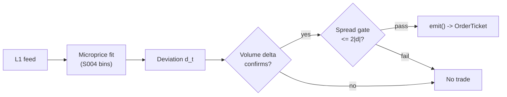

# T002 — Microprice Fair-Value Scalper

> **Reviewer card.** Intraday fair-value scalping (liquidity-taking, mean-reversion to a learned fair price): transient mid-price deviations from Stoikov's microprice, confirmed by signed volume delta, gated by measured spread costs. Provenance **[D]**.
>
> Edge verdict: **NO-DOCUMENTED-EDGE** — microprice predicts better than mid (Stoikov 2018), but no published after-cost P&L for the scalper exists [documented].
>
> After-cost: **FULL-COST** — one-sentence verdict: per-event edge is a fraction of the spread — it survives only where the deviation is wide relative to the measured effective spread.
>
> Tier **M** · prototype 40–80 h [example] · loaded cost $6,000–12,000 [example] · latency microstructure / sub-second · risk medium (intraday, taker).

> Capacity $0.5–2M/day notional [example] — small; survives only where the deviation is wide vs the effective spread · Executability: Feasible: Python+polars on `3–10` names [internal-est]; the S004 fit is the hard part.

## §1  Identity & provenance

This module is a **strategy**: it emits `OrderTicket` intentions only — brokers create orders, strategies never do. Family **A  # microstructure & order flow**, batch **TB1**, provenance **D**.

**Lede.** Intraday fair-value scalping (liquidity-taking, mean-reversion to a learned fair price): transient mid-price deviations from Stoikov's microprice, confirmed by signed volume delta, gated by measured spread costs. Provenance **[D]**.

**When it dies.** Effective spread `>2`× median [default]; microprice bins stale (fit drift); SIP-only latency race.

**Regime gates (provisional).** R001 elevated RV degrades (spread convexity eats the fraction-of-spread edge).

**Prototype scope.** microprice bin fitter + deviation monitor + volume-delta confirm + spread-decomposition gate + kill-switch.

## §1.5  Escalation gate

Cheapest viable path: **Polygon.io stocks plan** (Starter ~$29/mo delayed, Developer ~$99/mo real-time, Advanced ~$199/mo [documented; third-party plan summaries crawled 2026-09 — recheck polygon.io/pricing before buying]) — L1 bid/ask price + size per quote event, exchange timestamps. Build on the S001/S003 feed you already own; buy only the exchange-timestamped L1 feed.

**Cheapest-source row.** `min_tier: tier-1` · `latency_class: microstructure / sub-second` · `required_fields: bid_px, bid_sz, ask_px, ask_sz, exchange ts_event (int64 ns)` · `price_band: $0 (Alpaca IEX L1, delayed [unverified]) → ~$29–199/mo (Polygon.io stocks plans [documented]) → ~$200/mo + usage (Databento Standard pay-as-you-go [documented, notes/cost-model.md])` · `build_or_buy: buy the raw L1 feed; build the microprice fit + spread-decomposition gate yourself (no vendor sells them)`.

Resource budget: `1` core, `<4` GB RAM for `≤10` symbols live [internal-est] · compute pattern `per_event`.

Explicitly out of scope (phase two): multi-venue aggregation; Rust ingest; colocation; quote-free Roll fallback (phase `2`).

**DO-NOT-CUT list.** t→t+1 causality assertions; COST block + `expected_cost_bps` callable; kill switch + re-arm checklist; decision audit log (C5); bona-fide-intent + self-trade prevention (C13/C14); provenance honesty tags; fixtures + per-module test; secrets via env only.

**Skip list.** Full L2 depth (MBP-10); consolidated SIP backfill; colocation; GPU; tick-level ML model.

Escalation gate: live universe `>10` symbols [default]; trailing effective spread persistently `>2`× median [default] — crossing it requires re-review of §T7 and §T8.

## §T0  Contract — strategies emit intentions, brokers create orders

This strategy's sole output is a list of `OrderTicket` intentions. It never places, routes, or confirms an order. Every ticket carries `parent_signal` (the upstream signal id and its `computed_at`), an `intent_ts`, and a `tif`. The backtest harness fills tickets strictly after the signal bar (`fill_event > signal_event`, t->t+1 causality); any fill timestamped at or before its signal bar is a harness bug and trips the kill switch.

**Typed signature.**

```text
emit(state: ModuleState, events: list[L1Event], signals: SignalBundle, cfg: Config) -> list[OrderTicket]
```

- `L1Event`: canonical event `{event_ts: int64 ns UTC, asof_ts: int64 ns UTC, symbol: str, bid_px: float, bid_sz: int, ask_px: float, ask_sz: int, market_state: enum}` — vendor mapping in §T2.
- `SignalBundle`: `{S004: {deviation_cents: float, computed_at: int64}, S006: {z_delta: float, computed_at: int64}, S014: {eff_spread_cents: float, computed_at: int64}}` — machine edge list in §T2.
- `OrderTicket`: global OrderTicket schema — `{ticket_id: str, symbol: str, side: {BUY, SELL}, qty: int, limit_px: float, tif: str, intent_ts: int64 ns, parent_signal: str, inputs_hash: str, params_hash: str, locate_ok: bool, stp_flag: str}` (see §T6).
- Returns `[]` when flat with no setup; sets `state.module_state = UNKNOWN` on invalid input (never interpolates — F1–F5).

**Config dataclass (single source of truth for parameters).**

| Parameter | Type | Default | Range | Status |
|---|---|---|---|---|
| `kappa_mult` | float | `0.25` | `0.1–1.0` | default |
| `z_delta_entry` | float | `1.0` | `0.5–3.0` | default |
| `cost_mult` | float | `2.0` | `1.0–4.0` | default |
| `time_stop_s` | float | `10.0` | `1–60` | default |
| `stop_spreads` | float | `1.0` | `0.5–3.0` | default |
| `cooldown_s` | float | `60.0` | `0–3,600` | default |
| `cost_gate_k` | float | `0.5` | `0.1–2.0` | default |
| `per_trade_R` | float (USD) | `50.0` | `10–500` | default |
| `daily_loss_stop` | float (USD) | `-1000.0` | `-10000–-100` | default |
| `max_gross` | float (USD notional) | `500000.0` | `100000–2000000` | default |
| `max_adverse_per_trade` | float (×stop) | `2.0` | `1.0–5.0` | default |
| `staleness_ttl_s` | float | `3.0` | `1–10` | default |

**State vector (named, carried between events).** `prev_book`, `micro_bins`, `dev_window`, `delta_window`, `cost_window`, `cooldown_until`, `position`, `entry_mid`, `entry_ts`, `vol_estimate`, `adv_1min`, `module_state`.

**Time contract.**

| Field | Value |
|---|---|
| Clock domain | exchange `ts_event` is authoritative; strategy clock = event time, not wall time [default] |
| Canonical timestamps | `event_ts`, `asof_ts` — int64 ns UTC [default] |
| Max skew | `50` ms [example] — beyond this the kill switch trips |
| Jitter budget | `500` µs [example] |
| Bar-label rule | `per_event` — no bar aggregation; signals are stamped at the event that produced them [default] |
| Staleness TTL | `3` s [default] — inputs older than the TTL → `UNKNOWN` (C6) |
| Gap policy | no interpolation — a book sequence gap trips the kill switch |

**Market-state table.**

| State | Meaning | Strategy behavior |
|---|---|---|
| `CONTINUOUS_TRADING` | normal session | full entry/exit logic |
| `HALTED` | halt / trading pause | no new entries; existing positions managed to exit |
| `AUCTION` | open / close / reopen auction | no new entries; existing positions managed to exit |
| `CLOSED` | outside 09:45–15:45 ET session [example] | `OFF`; no tickets |

**Module-state enum** (single canonical degradation token set): `OK` (full logic) · `DEGRADED` (stale bins or elevated cancels — manage only, no new entries) · `UNKNOWN` (invalid/stale input — no tickets, never interpolates) · `OFF` (killed or out of session).

**Risk contract (YAML — single source of truth for risk).**

```yaml
per_trade_R: 50.0            # USD [example]
daily_loss_stop: -1000.0     # USD; dark for the day when hit [example]
max_gross: 500000.0          # USD notional [example]
max_adverse_per_trade: 2.0   # x stop distance [default]
kill_conditions:
  - feed heartbeat missed > 2 s [example]
  - book sequence gap
  - clock skew > 50 ms [example]
  - measured effective spread > gate for 5 min [example]
enforcement: intraday-hard   # [default]
calibration: paper-trade 20 sessions [default]; refit microprice bins on history strictly before each session; re-pin fee schedule monthly [default]
```

**Kill switch: `ARMED` → `TRIPPED` → `RECOVERY` → `ARMED`.**

- `ARMED` → `TRIPPED`: any trip condition fires. On trip: stop emitting tickets immediately, flatten managed positions per the §T3 exit rule, page the operator.
- `TRIPPED` → `RECOVERY`: operator acknowledges the trip. No tickets emitted.
- `RECOVERY` → `ARMED`: **re-arm checklist** all green —
  1. manual operator review of the trip log and C5 decision-log hashes [rule];
  2. cooldown expiry: ≥ `5` min [example] since the trip;
  3. feed heartbeat healthy (≤ `2` s [example]) and book sequence continuous;
  4. clock skew ≤ `50` ms [example];
  5. microprice bins refit on history strictly before today (C12);
  6. fee schedule re-pinned (monthly [default]); `expected_cost_bps` callable re-verified against `fee_schedule_as_of`;
  7. measured effective spread ≤ gate for the trailing `5` min [example].
- Skipping the checklist is a compliance violation (C2); the per-module test drives the full `ARMED → TRIPPED → RECOVERY → ARMED` cycle.

**Ops tail.** Schedule: continuous during US equities RTH `09:45`–`15:45` America/New_York [example]; flat by `15:45` · Owner: strategy-owner role [default] · Health checks: feed heartbeat monitor (≤ `2` s [example]), spread-vs-gate monitor, bin-freshness check · Alerts: trip → page; DEGRADED/UNKNOWN → notify · Resource budget: `1` vCPU, `4` GB RAM per `10` symbols [internal-est]; bin table O(bins) [internal-est] · Runbook stub: trip → flatten → page → review → re-arm checklist → `ARMED` · Secrets: `DATABENTO_API_KEY`, `POLYGON_API_KEY` via env only (never in code, logs, or files).

## §T1  Strategy thesis & edge

**Thesis.** Intraday fair-value scalping (liquidity-taking, mean-reversion to a learned fair price): transient mid-price deviations from Stoikov's microprice, confirmed by signed volume delta, gated by measured spread costs. Provenance **[D]**.

**Edge verdict: NO-DOCUMENTED-EDGE** — microprice predicts better than mid (Stoikov 2018), but no published after-cost P&L for the scalper exists [documented].

**After-cost verdict: FULL-COST** — one-sentence verdict: per-event edge is a fraction of the spread — it survives only where the deviation is wide relative to the measured effective spread.

**Risk summary.** Mean-reversion to a moving fair value — adverse drift when the microprice itself migrates; thin per-trade edge.

**Math.**

```text
Microprice P^micro_t = M_t + G(X_t) (Stoikov [documented]) is the learned fair
value conditional on the book state; deviation d_t = P^micro_t − M_t, in cents.
G is a bin table over (spread state, depth-imbalance state) fit on history
strictly before today [default]. Entry when |d_t| ≥ κ = 0.25 × spread_t
[example] with signed volume-delta z-score confirming the deviation is noise,
not information. Modeled edge (d_t in cents, P_t in dollars):

    edge_bps = (|d_t| / 100) / P_t × 1e4 × 0.5        [example]

The S014 spread-decomposition gate vetoes when S̄^e > 2·|d_t| [example].
```

## §T2  Signal stack — dependencies & data rights

> **Timing box.** `signal@t (per_event, America/New_York) → earliest fill @open(t+1)` — the strategy is per-event; no signal is ever filled on its own event.

**Mandatory sub-block map (fixed-order sub-blocks; content lives in the frozen sections shown).**

| Sub-block | Lives in |
|---|---|
| Universe | §T2 (below) |
| Boolean entry rule | §T3 |
| Exits + post-exit cooldown | §T3 |
| Position sizing (fenced function) | §T3 |
| Risk limits | §T7 (risk contract YAML in §T0) |
| COST block (single source of truth) | §T5 |
| Execution / fill-model table | §T6 |
| Robustness + compliance sub-block (C1–C19) | §T8 / §T9 |
| Parameter table | §T4 (Config dataclass in §T0) |
| Timing box | §T2 (above) |

**Universe.** `3–10` liquid large-tick names [example] with stable, visible books and `1`-tick
spreads most of the session (same hunting ground as T001) [example]. Exclude:
earnings days, halts, any name whose trailing effective spread exceeds `2`× [default]
its median [example]. Session `09:45`–`15:45` ET [example], RTH only, flat by
`15:45`.

| Signal | Role | Contract |
|---|---|---|
| `S004` | trigger | |d_t| >= κ = 0.25×spread [example]; exit when d_t crosses 0 |
| `S006` | confirm | z^Δ_t >= +1.0 [example] long — aggressive flow must agree the deviation is noise |
| `S014` | veto | S̄^e <= 2·|d_t| per trade [example]; live-disable if measured costs exceed the edge |

Max dependency depth: `2` [default].

**Schema mapping (canonical).**

| Vendor (Databento DBEQ.BASIC mbp-1) | Canonical |
|---|---|
| `ts_event` (int64 ns UTC [documented]) | `event_ts` (int64 ns UTC) |
| `bid_px_00` (int64 fixed-point ÷1e9 [documented]) | `bid_px` (float dollars) |
| `bid_sz_00` (uint32 shares [documented]) | `bid_sz` (int shares) |
| `ask_px_00` (int64 fixed-point ÷1e9 [documented]) | `ask_px` (float dollars) |
| `ask_sz_00` (uint32 shares [documented]) | `ask_sz` (int shares) |
| `sequence` (uint32 venue sequence [documented]) | book-sequence-gap detection |
| `action` / `side` (char [documented]) | trade-vs-quote classification for S006 |

Staleness: max skew `1` s [default] · jitter budget `500 µs` [example] · TTL `3` s [default] · cadence `per_event` · tz `America/New_York`.

**Inputs that break the module.**

| Input failure | Module state | Alert |
|---|---|---|
| Microprice bins stale (no refit in session) (F4) | `DEGRADED` | notify |
| Deviation or z-delta out of bounds (F2) | `UNKNOWN` | page |
| Spread gate inputs missing | `UNKNOWN` | page |
| Book sequence gap | `TRIPPED` (kill switch) | page |

**Data rights.** US equities L1 via Databento DBEQ.BASIC mbp-1, `rights: licensed`; research +
stated production (`≤10` symbols [default]); fixtures synthetic; entitlement =
professional/internal, no display; derived features ours. Entitlement-class
change → §1.5 escalation gate.

**Build vs buy.** Build on the S001/S003 feed you already own; buy only the
exchange-timestamped L1 feed — the microprice fit and the spread-decomposition
gate are yours to calibrate; no vendor sells them.

**Local build.** Feasible. The per-event loop is identical to T001's; the extra cost
is the microprice bin fit (offline, nightly) and the trailing effective-spread
window. `10` symbols [example] fit comfortably in Python+polars.

**Data dictionary (canonical fields).**

| Field | Type | Cadence | Tier | Notes |
|---|---|---|---|---|
| `Best bid/ask price+size` | float/int | every quote event (L1) | Tier 2 | exchange timestamps |
| `Microprice bin table` | reference | fitted on history strictly before today | Tier 2 | S004 fit; refit cadence daily [default] |
| `Trade prints (signed volume)` | float/int | every trade | Tier 2 | for S006 delta |

## §T3  Entry / exit / sizing & worked example

**Entry rule.**

```text
ENTER_LONG  := (d_t >= kappa) AND (z_delta >= z_delta_entry)
               AND (ecost <= cost_mult * |d_t|) AND (flat) AND (now >= cooldown_until)
               AND (expected_cost_bps(...) <= cost_gate_k * edge_bps)
ENTER_SHORT := (d_t <= -kappa) AND (z_delta <= -z_delta_entry)
               AND (ecost <= cost_mult * |d_t|) AND (flat) AND (now >= cooldown_until)
               AND (locate_ok) AND (expected_cost_bps(...) <= cost_gate_k * edge_bps)
FLAT        := otherwise
```

**Exit rule.**

```text
EXIT := (d_t crosses 0 toward mid) OR (z_delta crosses 0 against position)
        OR (age >= time_stop_s) OR (mid <= entry_mid - stop_spreads * spread) [long]
        OR (ecost > cost_mult * |d_t|) OR (module_state != OK)
```

**Cooldown.** `60` s [default] after every exit (C8).

**Sizing function (normative, fenced).**

```python
def shares(risk_budget_R, stop_distance, vol_estimate, ADV_cap, cost):
    """shares = f(risk_budget_R, stop_distance, vol_estimate, ADV_cap, cost)."""
    # risk_budget_R in $, stop_distance = 1 spread-width in $/share
    n = risk_budget_R / max(stop_distance, 1e-9)   # [default] floor below
    n = min(n, ADV_cap * 0.01)                     # 1% of 1-min ADV [default]
    n = min(n * 50000.0, 500000.0) / 50000.0       # $500k notional cap [default]
    return int(n)
```

**Normative pseudocode (complete — no black boxes).**

```text
function emit(state, events, signals, cfg) -> list[OrderTicket]:
    # F1: no events -> UNKNOWN (never interpolate)
    if len(events) == 0:
        state.module_state = UNKNOWN; return []
    t = events[-1]                                    # latest L1Event
    # F2: invalid / crossed book -> UNKNOWN
    if not (isfinite(t.bid_px) and isfinite(t.ask_px)
            and t.bid_px > 0 and t.ask_px > t.bid_px):
        state.module_state = UNKNOWN; return []
    # F4: stale microprice bins -> DEGRADED, manage only, no new entries
    if state.micro_bins.fit_date < today_utc():
        state.module_state = DEGRADED
        return manage_only(state, t, cfg)             # exits only, §T3 exit rule
    # C6: stale inputs -> UNKNOWN
    if (now_ns() - t.asof_ts) > cfg.staleness_ttl_s * 1e9:
        state.module_state = UNKNOWN; return []
    d  = signals.S004.deviation_cents                  # cents
    dz = signals.S006.z_delta
    ec = signals.S014.eff_spread_cents                 # cents
    # F2: non-finite signal values -> UNKNOWN
    if not (isfinite(d) and isfinite(dz) and isfinite(ec)):
        state.module_state = UNKNOWN; return []

    mid    = (t.bid_px + t.ask_px) / 2.0               # dollars
    spread = t.ask_px - t.bid_px                       # dollars
    # Unit-fixed modeled edge: d in cents -> dollars before dividing by P_t.
    edge_bps = (abs(d) / 100.0) / mid * 1e4 * 0.5      # [example]
    # C3 normative cost-gate predicate — no ticket unless the callable cost
    # clears the gate against the modeled edge:
    cost_ok = (expected_cost_bps(notional_est, adv_pct_est, "XNAS", "taker", "normal")
               <= cfg.cost_gate_k * edge_bps)
    spread_ok = (ec <= cfg.cost_mult * abs(d))         # S014 veto, cents
    kappa = cfg.kappa_mult * (spread * 100.0)          # cents

    tickets = []
    flat = (state.position == 0)
    if flat and cost_ok and spread_ok and t.event_ts >= state.cooldown_until \
            and state.module_state == OK:
        qty = shares(cfg.per_trade_R,               # honors per-trade R
                     spread * cfg.stop_spreads,
                     state.vol_estimate, state.adv_1min,
                     expected_cost_bps(notional_est, adv_pct_est, "XNAS", "taker", "normal"))
        if d >= kappa and dz >= cfg.z_delta_entry:
            tickets.append(ticket(side='BUY', qty=qty, limit=t.ask_px, tif='IOC',
                                  intent_ts=t.event_ts,
                                  parent_signal='S004@' + str(signals.S004.computed_at),
                                  locate_ok=True, stp_flag='cancel-newest'))   # C13
        elif d <= -kappa and dz <= -cfg.z_delta_entry and locate_ok(t.symbol):  # C7
            tickets.append(ticket(side='SELL', qty=qty, limit=t.bid_px, tif='IOC',
                                  intent_ts=t.event_ts,
                                  parent_signal='S004@' + str(signals.S004.computed_at),
                                  locate_ok=True, stp_flag='cancel-newest'))
    elif state.position != 0:
        # Exits — inline, no black box:
        is_long  = state.position > 0
        crossed_zero = (is_long and d <= 0) or ((not is_long) and d >= 0)
        delta_flip   = (is_long and dz <= 0) or ((not is_long) and dz >= 0)
        aged    = (t.event_ts - state.entry_ts) >= cfg.time_stop_s * 1e9
        stopped = (is_long  and mid <= state.entry_mid - cfg.stop_spreads * spread) or \
                  ((not is_long) and mid >= state.entry_mid + cfg.stop_spreads * spread)
        cost_blow = ec > cfg.cost_mult * abs(d)
        if crossed_zero or delta_flip or aged or stopped or cost_blow \
                or state.module_state != OK:
            tickets.append(flatten_ticket(state, t))   # marketable IOC at touch
            state.cooldown_until = t.event_ts + cfg.cooldown_s * 1e9   # C8
    for tk in tickets:
        log_decision(tk, inputs_hash(signals, t), params_hash(cfg))    # C5 / App. g
    # C4 t->t+1 causality: the strategy never fills; fills are broker-side.
    # The harness MUST assert fill.event_ts > signal_event for every fill
    # (no-signal-bar-fills); any violation is a harness bug and trips the kill switch.
    return tickets
```

Notes: `locate_ok(symbol)` consults the broker locate file before any short ticket (C7); `flatten_ticket` emits a single marketable IOC `OrderTicket` for `-position` at the touch; `manage_only` runs the exit branch above and returns only flatten tickets.

**Risk limits.**

| Limit | Value |
|---|---|
| Daily loss stop | `-$1,000` [example] → dark for the day |
| Max gross | `$500k` notional [example] |
| Live cost kill | measured effective spread above gate → disable [example] |
| Staleness kill | feed heartbeat `>2` s [example] → trip |

**Worked example (synthetic fixture-backed — `fixtures/T002_tape.csv`, TYPE `validation-run`; numbers are accounting-demo, not market data).**

Trade 1: `BUY` `5000` shares [example] @ `50.01` [example], exit `50.02` [example] (`fair-value convergence`). Gross P&L = `50.00` [example] dollars. Cost stack = `4.0` bps [example] → `100.02` [example] dollars on `250050.00` [example] notional. Net = `-50.02` [example] dollars. The fixture's expected CSV carries the same arithmetic for all six trades; the per-module test recomputes it from the tape and asserts equality.

**Cost-function call trace (each row = the §T5 callable evaluated on the tape row).**

| trade | `expected_cost_bps(notional, adv_pct, venue, side, urgency)` call | → bps | → $ on notional |
|---|---|---|---|
| 1 | `expected_cost_bps(250050.0, 0.05, "XNAS", "taker", "normal")` | `4.0000` [example] | `100.02` [example] |
| 2 | `expected_cost_bps(250100.0, 0.05, "XNAS", "taker", "normal")` | `4.0000` [example] | `100.04` [example] |
| 3 | `expected_cost_bps(250050.0, 0.05, "XNAS", "taker", "normal")` | `4.0000` [example] | `100.02` [example] |
| 4 | `expected_cost_bps(250050.0, 0.05, "XNAS", "taker", "normal")` | `4.0000` [example] | `100.02` [example] |
| 5 | `expected_cost_bps(250150.0, 0.05, "XNAS", "taker", "normal")` | `4.0000` [example] | `100.06` [example] |
| 6 | `expected_cost_bps(250025.0, 0.05, "XNAS", "taker", "normal")` | `4.0000` [example] | `100.01` [example] |

Net P&L sums to `-475.17` [example] across the six synthetic trades — the fixture is an accounting demo of the cost stack, not a backtest; the negative net is consistent with the FULL-COST verdict (a `4.0` bps [example] round-trip cost swamps a sub-cent deviation at a `1`-tick [example] spread).

**Flow.**



## §T4  Parameters

| Parameter | Key | Default | Status | Provenance | Sensitivity |
|---|---|---|---|---|---|
| Deviation threshold κ | `kappa_mult` | `0.25`× spread | default | [default] | high |
| Volume-delta z entry | `z_delta_entry` | `1.0` | default | [default] | medium |
| Cost multiple | `cost_mult` | `2.0` | default | [default] | high |
| Time stop | `time_stop_s` | `10` s | default | [default] | medium |
| Stop distance | `stop_spreads` | `1` spread | default | [default] | high |
| Post-exit cooldown | `cooldown_s` | `60` s | default | [default] | low |
| Cost-gate k | `cost_gate_k` | `0.5` | default | [default] | high |
| Per-trade R | `per_trade_R` | `$50` | default | [default] | high |
| Daily loss stop | `daily_loss_stop` | `-$1,000` | default | [default] | high |
| Max gross notional | `max_gross` | `$500k` | default | [default] | high |
| Max adverse / trade | `max_adverse_per_trade` | `2.0`× stop | default | [default] | high |
| Staleness TTL | `staleness_ttl_s` | `3` s | default | [default] | medium |

Defaults mirror the §T0 `Config` dataclass; the per-module test asserts the test-side table matches these values and ranges.

## §T5  Costs — the callable is the single source of truth

| Component | bps | Basis |
|---|---|---|
| Spread | `2.0` | [example] 1-tick spread at $50: half-spread per aggressive leg × 2 legs |
| Fees | `2.0` | [example] $0.005/share each way at $50 = 1 bps/leg |
| Borrow | `0.0` | [default] intraday; shorts add C7 locate |
| Impact | `0.0` | [example] flagged; calibrate per venue at scale-up |
| **Total** | `4.0` | [example] reference stack |

Fee schedule as of `2026-09-10` [documented] · venue `XNAS` · side `taker` · `borrow_bps_per_day: 0.0` — reason: intraday holds only; the strategy never carries overnight (C9), so no borrow accrues; shorts require a C7 locate before the ticket.

**Documented calibration anchor.** Nasdaq fee to remove liquidity, shares executed at or above `$1.00`: `$0.0030`/share [documented] (NasdaqTrader price list, verified 2026-09-10) = `0.6` bps/leg at `$50` [documented arithmetic], `1.2` bps round trip. The reference stack above conservatively uses an [example] `$0.005`/share (`1` bps/leg); re-pin the callable to the venue/tier you actually clear on at calibration — the example stack is intentionally conservative, not a quote.

```python
def expected_cost_bps(notional, adv_pct, venue, side, urgency) -> float:
    """Callable cost model - T002 COST block (single source of truth)."""
    spread_bps = 2.0   # [example] 1-tick @ $50: half-spread per aggressive leg x 2
    fee_bps = 2.0      # [example] $0.005/share each way @ $50 = 1 bps/leg
    borrow_bps = 0.0   # [default] intraday; shorts add C7 locate
    impact_bps = 0.0   # [example] flagged; calibrate per venue at scale-up
    return spread_bps + fee_bps + borrow_bps + impact_bps
```

**Normative cost-gate predicate (C3):** `expected_cost_bps(...) <= k * edge_bps` — no ticket is emitted unless the callable cost clears this gate. The predicate appears verbatim in the §T3 pseudocode and is asserted by the per-module test.

## §T6  Execution assumptions

| Aspect | Assumption |
|---|---|
| Latency | signal→intent `≤1` ms colocated [example]; SIP path latency-simulated-only |
| Fill model | aggressive IOC at the touch: BUY at `ask_px`, SELL at `bid_px` [example]; slippage beyond the touch is absorbed by the spread component |
| Partial fills | oldest `intent_ts` first (FIFO); partials keep the same `ticket_id`; IOC remainder auto-cancels — no re-entry of the unfilled remainder |
| Impact | `0` bps reference [example] |
| Adverse fill | mean-reversion to a migrating fair value — the primary tail risk |

**OrderTicket schema (global; strategy fills only the intent fields).**

| Field | Type | Set by |
|---|---|---|
| `ticket_id` | str | strategy (unique per intent) |
| `symbol` | str | strategy |
| `side` | `BUY` / `SELL` | strategy |
| `qty` | int | strategy (from `shares(...)`) |
| `limit_px` | float | strategy (touch: ask for BUY, bid for SELL) |
| `tif` | str | strategy — `IOC` only for this module |
| `intent_ts` | int64 ns | strategy (the signal event's `event_ts`) |
| `parent_signal` | str | strategy (`S004@<computed_at>`) |
| `inputs_hash` | str | strategy (C5) |
| `params_hash` | str | strategy (C5) |
| `locate_ok` | bool | strategy — `True` required before any short ticket (C7) |
| `stp_flag` | str | strategy — `cancel-newest` [default] (C13) |
| `broker_ack_ts`, `fill_ts`, `fill_px` | int64/float | broker (downstream; `fill_ts > intent_ts` enforced by the harness, C4) |

**Child-order state machine (broker-side; the strategy only ever sees the INTENT state).**

```text
INTENT (strategy emits) -> SENT (broker ack) -> WORKING -> FILLED
                                                |-> PARTIAL -> (IOC remainder) -> CANCELLED
                                                |-> CANCELLED / EXPIRED
```

Cancel-replace: not used — taker IOC only; a replaced intent is a new ticket with a new `ticket_id` and fresh C3/C7 checks (C14).

## §T7  Risk contract & kill switch

Per-trade R: `$50` [example] per trade · daily loss stop: `- $1,000` [example] then dark for the day · max gross: `$500k` notional [example] · max adverse per trade: `2.0`x stop [default].

Enforcement: `intraday-hard` [default]. Calibration recipe: paper-trade `20` sessions [default]; fit microprice bins on history strictly before each session; re-pin fee schedule monthly [default].

**Kill switch: `ARMED` → `TRIPPED` → `RECOVERY` → `ARMED`.** Canonical state machine, trip conditions, and re-arm checklist live in §T0; §T7 is the risk-evidence layer.

Trip conditions:

- feed heartbeat missed > 2 s [example]
- book sequence gap
- clock skew > 50 ms [example]
- measured effective spread > gate for 5 min [example]

On trip: the module stops emitting tickets immediately, flattens managed positions per the exit rule, and pages. `RECOVERY` requires the §T0 re-arm checklist (manual review, cooldown expiry, healthy feeds, fresh bins, re-pinned fee schedule); only then does the module return to `ARMED`. The per-module test drives the full transition cycle.

**Ops.** Schedule: continuous during US equities RTH `09:45`–`15:45` America/New_York [example]; flat by `15:45` · budget: `1` vCPU, `4` GB RAM per `10` symbols [internal-est]; bin table O(bins) [internal-est] · env: `DATABENTO_API_KEY, POLYGON_API_KEY`.

## §T8  Compliance (C1–C19)

- **C1** | No orders: the strategy emits `OrderTicket` intentions only; the broker creates orders.
- **C2** | Kill switch: `ARMED` → `TRIPPED` → `RECOVERY` → `ARMED` on the trip conditions in §T0/§T7; skipping the re-arm checklist is a violation.
- **C3** | Cost gate: `expected_cost_bps(...) <= k * edge_bps` before any ticket (see §T5).
- **C4** | Causality: `fill_event > signal_event` (t->t+1); no signal-bar fills, ever; harness asserts it.
- **C5** | Decision log: every ticket logged with inputs hash and params hash (see App. g).
- **C6** | Staleness: inputs older than the TTL → `UNKNOWN`, no tickets.
- **C7** | Short discipline: `locate_ok` required before any short ticket (Reg SHO Rule 203(b) locate [documented], sec.gov).
- **C8** | Cooldown: post-exit cooldown enforced in seconds; no re-entry inside it.
- **C9** | Session flatten: no uncommanded overnight carry.
- **C10** | Position caps: per-trade R, daily loss stop, and max gross enforced.
- **C11 | Live cost kill: trigger = measured effective spread > `2·|d_t|` [example] for `5` min [example] → check = S014 window → action = disable new entries (existing managed to exit) → log = `GATE_VETO`**
- **C12 | Microprice-fit freshness: trigger = bins fit on stale history → check = fit date < today → action = DEGRADED, no new entries → log = state record**
- **C13 | Self-trade prevention: taker-only module — no resting orders, so no self-cross is possible; every ticket carries `stp_flag=cancel-newest` [default] as defense in depth**
- **C14 | Bona-fide intent: every ticket is backed by the Boolean entry rule + the C3 cost gate evaluated at `intent_ts`; IOC tif only; no quote stuffing possible (taker-only)**
- **C15 | Message-rate / cancel-to-trade: ≤ `20` tickets/s/symbol [example]; `>100` [example] IOC cancels/min/symbol → `DEGRADED` + notify**
- **C16 | Pre-trade fat-finger trio: price collar `|limit − mid| ≤ 2` spreads [example]; size ≤ min(`1`% 1-min ADV [default], `$500k` notional [example]); per-trade R ≤ `$50` [example]**
- **C17 | Halt/auction state table: `HALTED`/`AUCTION` → no new entries, managed flatten; `CLOSED` → `OFF` (see §T0 market-state table)**
- **C18 | Public-dissemination gate: the strategy publishes no quotes or trade prints; no redistribution of licensed Databento data**
- **C19 | Data-entitlement assertions: Databento DBEQ.BASIC mbp-1 `rights: licensed`, professional/internal, no display; production `≤10` symbols [default]; entitlement-class change → §1.5 escalation gate**

## §T9  Evidence, failures & regime gates

**Evidence (cost-level tokens; every statistic tagged).**

| Source | Sample | Finding | Cost level | Caveat |
|---|---|---|---|---|
| Stoikov (2018) [documented] | high-frequency quotes [documented]; exact names/dates [unverified — see GROK-NEEDED] | microprice a better predictor of short-term prices than mid or weighted mid [documented] | `BEFORE-COST` (prediction, not P&L) | two names, one month [unverified] |
| Cont, Kukanov & Stoikov (2014) [documented] | `50` U.S. stocks, NYSE TAQ [documented]; sample year [unverified] | OFI impact slope ∝ `1/(2·depth)` [documented] | `BEFORE-COST`; contemporaneous | supports the mechanics, not the P&L |
| Huang & Stoll (1997) [documented] | spread decomposition | quoted spread splits into order-processing, inventory, adverse-selection [documented] | measurement, not a strategy | the S014 gate's intellectual basis |
| Roll (1984) [documented] | quote-free spread estimation | effective spread from serial covariance of price changes [documented] | measurement, not a strategy | phase-2 fallback candidate only |

**Where this module is known to fail.** spread-regime shifts, microprice-fit drift, SIP-latency races, names where the deviation is information not noise.

**Failure modes (detect → action → recovery).**

| # | Failure | Detect → action → recovery | Executable check |
|---|---|---|---|
| 1 | Fair-value migration: the microprice drifts with the mid | detect: post-entry `d_t` persistence > `10` s [example] → action: tighten time stop or stand down → recovery: refit bins | `dev_persistence_s <= 10` |
| 2 | Spread gate lag: measured spread lags the real one | detect: realized slippage > gate for `5` min [example] → action: disable new entries → recovery: shorten cost window | `realized_spread <= gate` |
| 3 | Lookahead: bar-close deviation traded intra-bar | detect: `fill_event <= signal_event` → action: halt, fix finalization → recovery: no-signal-bar-fills test [default] | `all(fill_ts > signal_ts)` |
| 4 | Cost blowup on thin deviations | detect: cost gate failing on `[measured]` costs → action: raise κ or stand down → recovery: re-pin fee schedule | `expected_cost_bps(...) <= k * edge_bps` |
| 5 | Stale bins after a vol event | detect: bin fit age > `1` session [default] post-event → action: DEGRADED → recovery: emergency refit | `bin_age_sessions <= 1` |

**Regime gates (machine records).**

| regime_id | direction | mechanism | condition | action | min_lag | unknown_behavior |
|---|---|---|---|---|---|---|
| R001 | degrades | elevated RV widens spreads convexly, eating the fraction-of-spread edge | `rv_pctile > 75` [default] | halve | `1` bar [default] | veto |
| R-halt (provisional, not an R-module) | inverts | halt/auction state — quotes are not actionable | `market_state != CONTINUOUS_TRADING` [default] | veto | `0` [default] | veto |

**Robustness.** κ in `0.15`–`0.4`× spread keeps the signal [example]; the S014 gate is
the binding constraint — when measured effective spread exceeds `2·|d_t|` [default]
[example], the strategy disables itself rather than trading a negative edge.

**What the optimistic case assumes (and we do not).** (1) deviation mean-reverts to a *fixed* microprice — real fair value
migrates; (2) no latency — the deviation is sub-second and decays in seconds;
(3) the S014 gate is measured with lookback smoothing that lags regime
changes; (4) impact `0` [example] — flagged.

## §T10  Unverified leads & what would change our mind

- Chatbot-drafted throughput/fee bands for this sleeve — model-flagged estimates; not promoted.

**Source verification log (deep review, 2026-09-10).**

| # | Source as cited | Verified | How | Correction made |
|---|---|---|---|---|
| 1 | Stoikov (2018), Quantitative Finance 18(12): 1959–1966 | yes | EconPapers record; DOI 10.1080/14697688.2018.1489139; abstract confirms microprice beats mid/weighted-mid as short-term predictor | exact sample (names/dates) could not be verified → retagged [unverified], GROK-NEEDED #1 |
| 2 | Cont, Kukanov & Stoikov (2014) | yes | arXiv:1011.6402 (verified live); EconPapers: Journal of Financial Econometrics 12(1), 47–88 | venue corrected (was implied J. of Financial Economics): **Journal of Financial Econometrics**; sample "50 U.S. stocks, NYSE TAQ" [documented] per abstract; sample year [unverified] |
| 3 | Huang & Stoll (1997), RFS 10(4): 995–1034 | yes | IDEAS/RePEc RePEc:oup:rfinst:v:10:y:1997:i:4:p:995-1034 | title corrected to include subtitle **"A General Approach"** |
| 4 | Roll (1984), J. Finance 39(4): 1127–1139 | yes | CaltechAUTHORS + AFA issue page; DOI 10.1111/j.1540-6261.1984.tb03897.x | none |
| 5 | SEC Reg SHO Rule 203(b) locate | yes | sec.gov short-sales rule page + Release 34-50103 (2026-09-10) | added as §0 source; underpins C7 |
| 6 | Nasdaq taker fee $0.0030/share (≥$1.00) | yes | nasdaqtrader.com price list (verified 2026-09-10) | added as §T5 documented anchor; fee_schedule_as_of now [documented] 2026-09-10 |
| 7 | Databento DBEQ.BASIC mbp-1 schema fields (`ts_event` ns UTC, `bid_px_00`/`ask_px_00` int64 ÷1e9, `bid_sz_00`/`ask_sz_00`, `sequence`, `action`/`side`) | yes | third-party schema reference mirroring Databento docs (verified 2026-09-10) | §T2 schema mapping tagged [documented] |
| 8 | DBN version 3 current default | yes | databento/dbn v0.35.0 release notes (verified 2026-09-10) | `schema_version: "3"` tagged consistent |
| 9 | Databento DBEQ.BASIC mbp-1 unit pricing $2.00/GB historical, $2.40/GB live | partial | Databento unit-pricing PDF dated 2024-12-11 (verified 2026-09-10) | cited with as-of date; current schedule [unverified] |
| 10 | Polygon.io stocks plans ~$29/$99/$199/mo | partial | third-party plan summaries crawled 2026-09-10 (not polygon.io itself) | tagged [documented] with recheck caveat |

What would change our mind: a purged/embargoed walk-forward with full costs that survives the S088 honesty protocol; a documented after-cost P&L from the cited authors' own implementations; or a regime-gated replication that holds outside the original sample.

**GROK-NEEDED** (expert questions web search could not resolve — do not answer from priors):

1. "T002 (Microprice Fair-Value Scalper) cites Stoikov (2018), 'The micro-price: a high-frequency estimator of future prices,' Quantitative Finance 18(12): 1959–1966. The module's evidence table states the empirical sample was 'BAC/CVX, March 2011.' What exact sample (symbols, dates, data vendor) does the paper's empirical section actually use? Quote the paper's data-description paragraph verbatim and give the page/table number so the module can correct or confirm the [unverified] tag."
2. "T002 fits Stoikov's microprice as a bin table G(spread state, depth-imbalance state) refit nightly, with deviation entry threshold kappa_mult = 0.25× spread [default]. Is there a public reference implementation of the microprice estimator (e.g., the author's microprice code repository) that documents the recommended number of spread/imbalance bins and refit cadence? Report the bin grid, the calibration sample size used, and any stated out-of-sample decay of the microprice's predictive edge over the trading day."
3. "T002's verdict is NO-DOCUMENTED-EDGE: no published after-cost P&L exists for a microprice fair-value scalper. Has any published paper, thesis, or industry note reported an after-cost backtest of a liquidity-taking mean-reversion strategy keyed to Stoikov's microprice (entry on |d_t| ≥ κ×spread, exit on d_t crossing 0)? If yes, report the venue, sample, per-trade gross/net bps, and cost stack; if no, say so explicitly so the verdict stands."
4. "T002's §0 dataset price_band cites Databento DBEQ.BASIC mbp-1 unit pricing of $2.00/GB historical / $2.40/GB live from a pricing PDF dated 2024-12-11. What is the current (September 2026) Databento list price for DBEQ.BASIC mbp-1 historical and live, and is there a monthly plan minimum? Quote the current pricing page and its effective date."
5. "T002's §T5 documented anchor is the Nasdaq fee to remove liquidity of $0.0030/share for shares ≥ $1.00 (NasdaqTrader price list, verified 2026-09-10). What is the effective date / version of that price list, and has the base remove-liquidity fee changed in any 2026 amendment? Cite the specific price-list version or SEC filing."

---

## AI build prompt

```text
Build the T002 (Microprice Fair-Value Scalper) strategy module from this specification.
Hard constraints:
- The strategy emits OrderTicket intentions ONLY; it never creates orders (C1).
- Causality: fill_event > signal_event (t->t+1); no signal-bar fills (C4).
- Cost gate: expected_cost_bps(...) <= k * edge_bps before any ticket (C3).
- Kill switch ARMED -> TRIPPED -> RECOVERY -> ARMED with the §T0 re-arm checklist (C2).
- Every numeric literal in prose carries an honesty tag [documented]/[measured]/[example]/[unverified]/[default]/[internal-est]; exempt identifiers only.
- Sources must be real and cited with cost-level tokens; chatbot-only material goes to §T10.
Module contract (see §T0):
- emit(state: ModuleState, events: list[L1Event], signals: SignalBundle, cfg: Config) -> list[OrderTicket]
- Time contract: exchange ts_event authoritative, int64 ns UTC, staleness TTL 3 s [default], no interpolation.
- Market states: CONTINUOUS_TRADING / HALTED / AUCTION / CLOSED. Module states: OK / DEGRADED / UNKNOWN / OFF.
- Risk contract YAML in §T0; ops tail (schedule 09:45–15:45 ET [example], 1 vCPU / 4 GB per 10 symbols [internal-est], secrets via env).
Config surface:
- kappa_mult (float): default 0.25, range 0.1–1.0 [default]
- z_delta_entry (float): default 1.0, range 0.5–3.0 [default]
- cost_mult (float): default 2.0, range 1.0–4.0 [default]
- time_stop_s (float): default 10.0, range 1–60 [default]
- stop_spreads (float): default 1.0, range 0.5–3.0 [default]
- cooldown_s (float): default 60.0, range 0–3,600 [default]
- cost_gate_k (float): default 0.5, range 0.1–2.0 [default]
- per_trade_R (float): default 50.0, range 10–500 [default]
- daily_loss_stop (float): default -1000.0, range -10000–-100 [default]
- max_gross (float): default 500000.0, range 100000–2000000 [default]
- max_adverse_per_trade (float): default 2.0, range 1.0–5.0 [default]
- staleness_ttl_s (float): default 3.0, range 1–10 [default]
Timing box: signal@t (per_event, America/New_York) -> earliest fill @open(t+1).
Entry rule:
ENTER_LONG  := (d_t >= kappa) AND (z_delta >= z_delta_entry)
               AND (ecost <= cost_mult * |d_t|) AND (flat) AND (now >= cooldown_until)
               AND (expected_cost_bps(...) <= cost_gate_k * edge_bps)
ENTER_SHORT := (d_t <= -kappa) AND (z_delta <= -z_delta_entry)
               AND (ecost <= cost_mult * |d_t|) AND (flat) AND (now >= cooldown_until)
               AND (locate_ok) AND (expected_cost_bps(...) <= cost_gate_k * edge_bps)
FLAT        := otherwise
Exit rule:
EXIT := (d_t crosses 0 toward mid) OR (z_delta crosses 0 against position)
        OR (age >= time_stop_s) OR (mid <= entry_mid - stop_spreads * spread) [long]
        OR (ecost > cost_mult * |d_t|) OR (module_state != OK)
Sizing: implement the §T3 shares() function verbatim; enforce the §T0 risk contract YAML.
Compliance: implement C1–C19, including locate_ok before shorts (C7), self-trade prevention (C13),
bona-fide intent (C14), message-rate caps (C15), and the pre-trade fat-finger trio (C16).
Deliverables: the module markdown (all sections §0, §1, §1.5, §T0, §T1–§T10), the fixture tape CSV
(fixtures/T002_tape.csv), the expected CSV (fixtures/T002_expected.csv), and
the per-module test (modules/tests/test_T002.py) covering fixture arithmetic,
causality, the cost gate, the kill-switch cycle, invalid→UNKNOWN, the Config
defaults/ranges, and the callable signature. Definition of done: test_cmd exits 0.
```
